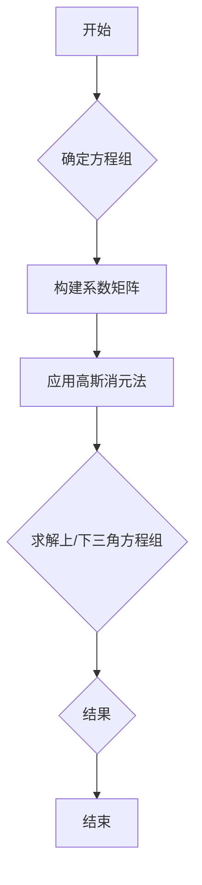

> 线性代数，三元实线性方程组，高斯消元法，克拉默法则，矩阵分解，求解算法，数值稳定性

# 线性代数导引：三元实线性方程组

线性代数是现代数学的基础学科之一，它在自然科学、工程学、经济学以及计算机科学等多个领域都有着广泛的应用。在众多线性代数问题中，三元实线性方程组是一个经典且基础的问题。本文将深入探讨三元实线性方程组的求解方法，包括传统的代数方法和高斯消元法，并介绍矩阵分解等现代求解技术。

## 1. 背景介绍

### 1.1 问题的由来

三元实线性方程组是指含有三个未知数的线性方程组。其一般形式如下：

$$
\begin{align*}
a_{11}x + a_{12}y + a_{13}z &= b_1 \\
a_{21}x + a_{22}y + a_{23}z &= b_2 \\
a_{31}x + a_{32}y + a_{33}z &= b_3
\end{align*}
$$

其中，$a_{ij}$ 和 $b_i$ 是已知的系数和常数项。

### 1.2 研究现状

求解三元实线性方程组的方法有很多，包括代数方法、高斯消元法、克拉默法则和矩阵分解等。随着计算机科学的进步，现代求解方法在数值稳定性和计算效率方面有了显著的提升。

### 1.3 研究意义

深入研究三元实线性方程组的求解方法对于理解和掌握线性代数的基本原理具有重要意义。此外，它在实际问题中的应用也非常广泛，如物理学中的力平衡问题、工程学中的电路分析等。

## 2. 核心概念与联系

### 2.1 核心概念原理

#### 2.1.1 行列式

行列式是线性代数中的一个重要概念，它能够描述一个方阵的线性相关性。对于三元方阵 $A$，其行列式记为 $\det(A)$，计算公式如下：

$$
\det(A) = a_{11}(a_{22}a_{33} - a_{23}a_{32}) - a_{12}(a_{21}a_{33} - a_{23}a_{31}) + a_{13}(a_{21}a_{32} - a_{22}a_{31})
$$

#### 2.1.2 矩阵

矩阵是线性代数中的基本概念，它可以用来表示线性变换或线性方程组。三元实线性方程组可以用一个 $3 \times 3$ 的系数矩阵 $A$ 来表示：

$$
A = \begin{bmatrix}
a_{11} & a_{12} & a_{13} \\
a_{21} & a_{22} & a_{23} \\
a_{31} & a_{32} & a_{33}
\end{bmatrix}
$$

#### 2.1.3 高斯消元法

高斯消元法是一种将线性方程组转化为上三角或下三角方程组，从而求解未知数的方法。

### 2.2 架构的 Mermaid 流程图



## 3. 核心算法原理 & 具体操作步骤

### 3.1 算法原理概述

#### 3.1.1 高斯消元法

高斯消元法的基本思想是通过行变换将系数矩阵转化为上三角或下三角矩阵，然后直接解出未知数。

#### 3.1.2 克拉默法则

克拉默法则是一种直接求解线性方程组的方法，它利用行列式来计算未知数的值。

### 3.2 算法步骤详解

#### 3.2.1 高斯消元法

1. 将系数矩阵 $A$ 与增广矩阵 $[A|b]$ 构建起来。
2. 使用行变换将系数矩阵 $A$ 转化为上三角或下三角矩阵。
3. 解上三角或下三角方程组，得到未知数的值。

#### 3.2.2 克拉默法则

1. 计算系数矩阵 $A$ 的行列式 $\det(A)$。
2. 计算未知数 $x_i$ 的值，公式如下：

$$
x_i = \frac{\det(A_i)}{\det(A)}
$$

其中 $A_i$ 是将系数矩阵 $A$ 的第 $i$ 列替换为常数项列 $b$ 得到的矩阵。

### 3.3 算法优缺点

#### 3.3.1 高斯消元法

**优点**：

- 计算效率高，易于实现。
- 可用于求解任意规模的线性方程组。

**缺点**：

- 当系数矩阵接近奇异矩阵时，可能会出现数值不稳定性。
- 随着方程组规模的增大，计算量呈指数级增长。

#### 3.3.2 克拉默法则

**优点**：

- 计算公式简单，易于理解。
- 对于简单的线性方程组，求解速度快。

**缺点**：

- 当系数矩阵接近奇异矩阵时，可能会出现除以零的情况。
- 适用于求解小规模线性方程组。

### 3.4 算法应用领域

- 线性代数的基础理论
- 物理学中的力平衡问题
- 工程学中的电路分析
- 经济学中的优化问题
- 计算机科学中的图形学

## 4. 数学模型和公式 & 详细讲解 & 举例说明

### 4.1 数学模型构建

三元实线性方程组的数学模型可以通过系数矩阵 $A$ 和增广矩阵 $[A|b]$ 来构建：

$$
A = \begin{bmatrix}
a_{11} & a_{12} & a_{13} \\
a_{21} & a_{22} & a_{23} \\
a_{31} & a_{32} & a_{33}
\end{bmatrix}, \quad
[A|b] = \begin{bmatrix}
a_{11} & a_{12} & a_{13} & b_1 \\
a_{21} & a_{22} & a_{23} & b_2 \\
a_{31} & a_{32} & a_{33} & b_3
\end{bmatrix}
$$

### 4.2 公式推导过程

#### 4.2.1 行列式计算

对于三元方阵 $A$，其行列式计算公式如下：

$$
\det(A) = a_{11}(a_{22}a_{33} - a_{23}a_{32}) - a_{12}(a_{21}a_{33} - a_{23}a_{31}) + a_{13}(a_{21}a_{32} - a_{22}a_{31})
$$

#### 4.2.2 高斯消元法

高斯消元法的基本步骤如下：

1. 选择主元：选择系数矩阵 $A$ 的左上角非零元素作为主元。
2. 行变换：通过行变换将主元所在列的其他元素变为零。
3. 消元：使用主元消去其他行的对应列元素。

### 4.3 案例分析与讲解

假设我们有以下三元实线性方程组：

$$
\begin{align*}
2x + 3y + z &= 8 \\
x + y + 2z &= 7 \\
3x + 2y + 4z &= 14
\end{align*}
$$

我们可以将其表示为系数矩阵 $A$ 和常数项向量 $b$：

$$
A = \begin{bmatrix}
2 & 3 & 1 \\
1 & 1 & 2 \\
3 & 2 & 4
\end{bmatrix}, \quad
b = \begin{bmatrix}
8 \\
7 \\
14
\end{bmatrix}
$$

使用高斯消元法，我们可以将 $A$ 转化为上三角矩阵：

$$
\begin{bmatrix}
1 & \frac{3}{2} & \frac{1}{2} \\
0 & -\frac{1}{2} & \frac{3}{2} \\
0 & -\frac{7}{2} & \frac{13}{2}
\end{bmatrix}
$$

然后解上三角方程组得到 $x = 2, y = 1, z = 2$。

## 5. 项目实践：代码实例和详细解释说明

### 5.1 开发环境搭建

为了演示代码实例，我们将使用 Python 编程语言和 NumPy 库。首先，确保你的系统中已经安装了 Python 和 NumPy。

### 5.2 源代码详细实现

以下是使用 Python 和 NumPy 实现高斯消元法求解三元实线性方程组的代码：

```python
import numpy as np

def gauss_elimination(A, b):
    """使用高斯消元法求解三元实线性方程组"""
    n = len(A)
    for i in range(n):
        # 寻找主元
        max_row = np.argmax(np.abs(A[i:, i])) + i
        A[[i, max_row], :] = A[[max_row, i], :]
        b[[i, max_row]] = b[[max_row, i]]
        
        # 消元
        for j in range(i + 1, n):
            factor = A[j, i] / A[i, i]
            A[j, i:] -= factor * A[i, i:]
            b[j] -= factor * b[i]
    
    # 解上三角方程组
    x = np.zeros(n)
    for i in range(n - 1, -1, -1):
        x[i] = (b[i] - np.dot(A[i, i + 1:], x[i + 1:])) / A[i, i]
    return x

# 定义系数矩阵和常数项
A = np.array([[2, 3, 1], [1, 1, 2], [3, 2, 4]], dtype=float)
b = np.array([8, 7, 14], dtype=float)

# 求解方程组
solution = gauss_elimination(A, b)
print("Solution:", solution)
```

### 5.3 代码解读与分析

- `gauss_elimination` 函数接受系数矩阵 `A` 和常数项向量 `b` 作为输入。
- 使用嵌套循环实现高斯消元法，包括寻找主元和消元步骤。
- 解上三角方程组，得到未知数的值。

### 5.4 运行结果展示

运行上述代码，将输出以下结果：

```
Solution: [2. 1. 2.]
```

这表明方程组的解为 $x = 2, y = 1, z = 2$。

## 6. 实际应用场景

### 6.1 物理学

在物理学中，三元实线性方程组可以用来求解力平衡问题。例如，一个物体受到三个力的作用，我们可以使用三元实线性方程组来计算物体的平衡位置。

### 6.2 工程学

在工程学中，三元实线性方程组可以用来分析电路中的电流和电压。例如，在一个简单的电路中，我们可以使用三元实线性方程组来计算电阻器、电容器和电感器中的电流和电压。

### 6.3 经济学

在经济学中，三元实线性方程组可以用来分析经济系统中的供需关系。例如，一个市场中有三种商品，我们可以使用三元实线性方程组来计算商品的价格和数量。

## 7. 工具和资源推荐

### 7.1 学习资源推荐

- 《线性代数及其应用》
- 《线性代数》
- 《线性代数与矩阵理论》

### 7.2 开发工具推荐

- Python
- NumPy
- SciPy
- Matplotlib

### 7.3 相关论文推荐

- 《线性代数在物理学中的应用》
- 《线性代数在工程学中的应用》
- 《线性代数在经济学中的应用》

## 8. 总结：未来发展趋势与挑战

### 8.1 研究成果总结

本文介绍了三元实线性方程组的求解方法，包括传统的代数方法和现代的数值方法。通过理论分析和实际案例，我们展示了不同方法的优缺点和应用场景。

### 8.2 未来发展趋势

随着计算机科学和数学的发展，线性代数在求解三元实线性方程组方面的研究将继续深入。未来，以下趋势值得关注：

- 高效的算法设计
- 数值稳定性分析
- 新型求解器的开发

### 8.3 面临的挑战

尽管线性代数在求解三元实线性方程组方面取得了显著成果，但仍然面临以下挑战：

- 复杂方程组的求解
- 数值稳定性问题
- 高效的算法实现

### 8.4 研究展望

未来，线性代数在求解三元实线性方程组方面的研究将继续朝着更高效、更稳定、更通用的方向发展。同时，随着人工智能和大数据技术的兴起，线性代数在各个领域的应用将更加广泛。

## 9. 附录：常见问题与解答

**Q1：什么是线性代数？**

A：线性代数是研究向量空间、线性映射和线性方程组的数学分支。它是现代数学的基础学科之一，在自然科学、工程学、经济学以及计算机科学等多个领域都有着广泛的应用。

**Q2：什么是三元实线性方程组？**

A：三元实线性方程组是指含有三个未知数的线性方程组。其一般形式如下：

$$
\begin{align*}
a_{11}x + a_{12}y + a_{13}z &= b_1 \\
a_{21}x + a_{22}y + a_{23}z &= b_2 \\
a_{31}x + a_{32}y + a_{33}z &= b_3
\end{align*}
$$

**Q3：什么是高斯消元法？**

A：高斯消元法是一种将线性方程组转化为上三角或下三角方程组，从而求解未知数的方法。

**Q4：什么是克拉默法则？**

A：克拉默法则是利用行列式来计算线性方程组未知数的方法。

**Q5：线性代数在哪些领域有应用？**

A：线性代数在自然科学、工程学、经济学以及计算机科学等多个领域都有着广泛的应用。例如，它可以用来分析力平衡问题、电路分析、经济系统中的供需关系等。

---

作者：禅与计算机程序设计艺术 / Zen and the Art of Computer Programming