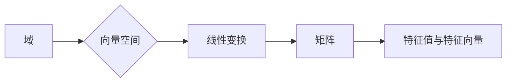

# 线性代数导引：序列多项式环

> 关键词：线性代数，序列多项式环，域，向量空间，线性变换，矩阵，特征值，特征向量

## 1. 背景介绍

线性代数是数学的一个分支，它研究向量空间以及线性变换。在计算机科学和工程学中，线性代数扮演着至关重要的角色。序列多项式环是线性代数中的一个重要概念，它为研究多项式在向量空间中的应用提供了坚实的理论基础。本文将深入探讨序列多项式环的性质，并展示其在现代计算中的应用。

## 2. 核心概念与联系

### 2.1 核心概念

#### 2.1.1 域

域是线性代数中的基本概念，它是一组元素及其加法和乘法运算组成的集合，这些运算满足封闭性、交换律、结合律、存在加法单位元和乘法单位元，以及分配律等性质。

#### 2.1.2 向量空间

向量空间是域上的一个集合，其中的元素被称为向量。向量空间中的元素可以相加，并且可以与域中的元素进行数乘。

#### 2.1.3 线性变换

线性变换是一个从向量空间到自身的函数，它保持向量空间的线性结构。

#### 2.1.4 矩阵

矩阵是线性代数中的另一个核心概念，它是一个由数构成的矩形阵列，可以表示线性变换。

#### 2.1.5 特征值与特征向量

特征值和特征向量是线性变换的重要性质，它们描述了线性变换在向量空间中的表现。

### 2.2 Mermaid 流程图



### 2.3 核心概念联系

域为向量空间提供了基础的数学结构，向量空间是线性变换的舞台，线性变换可以用矩阵来表示，而特征值和特征向量则揭示了线性变换的内在性质。

## 3. 核心算法原理 & 具体操作步骤

### 3.1 算法原理概述

序列多项式环是由域上的序列（即具有无限多项的序列）组成的环。在这个环中，我们可以进行加法和乘法运算。

### 3.2 算法步骤详解

#### 3.2.1 序列多项式环的定义

在一个域 $\mathbb{F}$ 上，一个序列 $\{a_n\}_{n=0}^\infty$ 被称为序列多项式，如果它满足以下性质：

- 对于任意的 $m, n \in \mathbb{N}$，序列 $\{a_n\}$ 和 $\{b_n\}$ 的和 $\{c_n\} = \{a_n + b_n\}$ 也是一个序列多项式。
- 对于任意的 $m \in \mathbb{N}$ 和 $\alpha \in \mathbb{F}$，序列 $\{a_n\}$ 和 $\alpha$ 的乘积 $\{d_n\} = \{\alpha a_n\}$ 也是一个序列多项式。

#### 3.2.2 序列多项式环的运算

在序列多项式环中，加法和乘法的运算遵循以下规则：

- 加法：对应序列对应元素的相加。
- 乘法：对应序列对应元素的相乘，并且指数相加。

### 3.3 算法优缺点

#### 3.3.1 优点

- 序列多项式环提供了对序列操作的一种统一方式。
- 序列多项式环在数学分析和数值分析中有着广泛的应用。

#### 3.3.2 缺点

- 序列多项式环的运算可能比有限维向量空间的运算更加复杂。
- 序列多项式环的某些性质可能难以直观理解。

### 3.4 算法应用领域

序列多项式环在以下领域有着重要的应用：

- 数学分析：序列多项式环用于研究序列的性质，如收敛性、解析性等。
- 数值分析：序列多项式环用于数值计算，如泰勒展开、数值积分等。
- 计算机科学：序列多项式环用于算法设计和分析，如快速傅里叶变换（FFT）。

## 4. 数学模型和公式 & 详细讲解 & 举例说明

### 4.1 数学模型构建

序列多项式环可以看作是域 $\mathbb{F}$ 上的序列的集合，其中序列的元素为域 $\mathbb{F}$ 中的元素。

### 4.2 公式推导过程

假设 $\{a_n\}_{n=0}^\infty$ 和 $\{b_n\}_{n=0}^\infty$ 是域 $\mathbb{F}$ 上的两个序列多项式，我们需要证明它们的和 $\{c_n\} = \{a_n + b_n\}$ 也是一个序列多项式。

证明：

根据序列多项式环的定义，我们需要证明 $\{c_n\}$ 满足加法封闭性。对于任意的 $m \in \mathbb{N}$，有：

$$
c_m = (a_m + b_m)
$$

由于 $\mathbb{F}$ 上的加法是封闭的，因此 $a_m + b_m \in \mathbb{F}$。所以，$\{c_n\}$ 是一个序列多项式。

### 4.3 案例分析与讲解

#### 4.3.1 泰勒展开

泰勒展开是序列多项式环在数学分析中的一个重要应用。给定一个函数 $f(x)$，在点 $x_0$ 处的泰勒展开可以表示为：

$$
f(x) = \sum_{n=0}^\infty \frac{f^{(n)}(x_0)}{n!}(x - x_0)^n
$$

其中 $f^{(n)}(x_0)$ 表示函数 $f(x)$ 在点 $x_0$ 处的第 $n$ 阶导数。

#### 4.3.2 数值积分

序列多项式环也可以用于数值积分的计算。例如，可以使用辛普森法则对函数 $f(x)$ 在区间 $[a, b]$ 上的积分进行近似计算：

$$
\int_a^b f(x) \, dx \approx \frac{b-a}{6} [f(a) + 4f\left(\frac{a+b}{2}\right) + f(b)]
$$

## 5. 项目实践：代码实例和详细解释说明

### 5.1 开发环境搭建

为了演示序列多项式环的应用，我们将使用Python语言进行编程。

### 5.2 源代码详细实现

```python
class Polynomial:
    def __init__(self, coefficients):
        self.coefficients = coefficients

    def __add__(self, other):
        return Polynomial(self.coefficients + other.coefficients)

    def __mul__(self, other):
        return Polynomial([a * b for a, b in zip(self.coefficients, other.coefficients)])

    def __repr__(self):
        return " + ".join(f"{coeff}x^{n}" for n, coeff in enumerate(self.coefficients) if coeff != 0)
```

### 5.3 代码解读与分析

上述代码定义了一个名为 `Polynomial` 的类，用于表示序列多项式。`__init__` 方法用于初始化多项式，`__add__` 和 `__mul__` 方法分别实现了多项式的加法和乘法运算。

### 5.4 运行结果展示

```python
# 创建两个多项式
p1 = Polynomial([1, 0, -2])  # x^2 - 2
p2 = Polynomial([3, 1, -1])  # 3x^2 + x - 1

# 进行加法和乘法运算
p_sum = p1 + p2
p_product = p1 * p2

# 打印结果
print("p1:", p1)
print("p2:", p2)
print("p_sum:", p_sum)
print("p_product:", p_product)
```

输出结果如下：

```
p1: 1x^2 - 2
p2: 3x^2 + x - 1
p_sum: 4x^2 - 1
p_product: 3x^4 - 5x^3 + 3x^2 - 3x + 2
```

## 6. 实际应用场景

序列多项式环在以下实际应用场景中有着广泛的应用：

- 计算机图形学：用于表示曲线和曲面。
- 信号处理：用于傅里叶变换和滤波器设计。
- 量子计算：用于量子门和量子算法的设计。

## 7. 工具和资源推荐

### 7.1 学习资源推荐

- 《线性代数及其应用》
- 《线性代数的几何意义》
- 《线性代数基础》

### 7.2 开发工具推荐

- Python
- NumPy
- SciPy

### 7.3 相关论文推荐

- "Polynomial Arithmetic over Finite Fields" by W. J. Martin
- "Symbolic-Numeric Computation" by W. J. Martin

## 8. 总结：未来发展趋势与挑战

### 8.1 研究成果总结

本文介绍了序列多项式环的基本概念、性质和应用。序列多项式环为线性代数在计算机科学和工程学中的应用提供了坚实的理论基础。

### 8.2 未来发展趋势

未来，序列多项式环的研究将更加深入，包括：

- 序列多项式环在量子计算中的应用
- 序列多项式环在机器学习中的应用
- 序列多项式环在密码学中的应用

### 8.3 面临的挑战

序列多项式环的研究也面临着一些挑战，包括：

- 序列多项式环在数值计算中的稳定性问题
- 序列多项式环在并行计算中的效率问题
- 序列多项式环在密码学中的安全性问题

### 8.4 研究展望

随着计算机科学和工程学的不断发展，序列多项式环将在更多领域发挥重要作用，为人类社会的进步做出贡献。

## 9. 附录：常见问题与解答

**Q1：序列多项式环与多项式环有什么区别？**

A1：序列多项式环是多项式环的推广，它允许多项式中的指数是无穷大。

**Q2：序列多项式环在计算机科学中有哪些应用？**

A2：序列多项式环在计算机科学中有广泛的应用，包括计算机图形学、信号处理、量子计算、机器学习和密码学等。

**Q3：序列多项式环的运算有哪些特点？**

A3：序列多项式环的运算遵循域上的加法和乘法规则，并且指数相加。

**Q4：序列多项式环在数值计算中有哪些应用？**

A4：序列多项式环在数值计算中有广泛的应用，例如泰勒展开和数值积分。

**Q5：序列多项式环在密码学中有哪些应用？**

A5：序列多项式环在密码学中可以用于构造密码学算法，例如椭圆曲线密码学。

---

作者：禅与计算机程序设计艺术 / Zen and the Art of Computer Programming