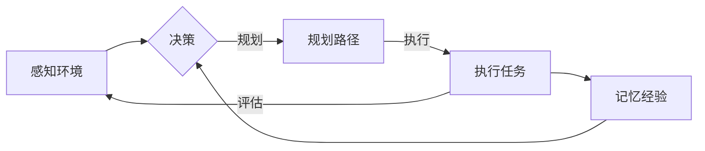

> 规划，记忆，AI Agent，强化学习，决策，知识表示，场景模拟

# 规划与记忆在AI Agent中的整合

在人工智能领域，AI Agent作为一个能够自主决策、执行任务的实体，其智能水平在很大程度上取决于其规划与记忆能力。一个能够有效整合规划和记忆的AI Agent，能够更好地理解环境、预测未来、作出合理决策，并在不断的学习中积累经验。本文将探讨规划与记忆在AI Agent中的整合原理、算法实现以及实际应用。

## 1. 背景介绍

AI Agent是一种模拟人类智能行为的实体，它能够感知环境、接收信息、制定计划、执行任务，并在环境中进行交互。在现实世界中，人类行为往往需要同时考虑当前的感知信息、过去的知识经验以及未来的目标，这种能力被称为“规划”与“记忆”。在AI Agent中，如何整合规划和记忆机制，使其能够像人类一样进行智能决策，成为人工智能研究的一个重要方向。

## 2. 核心概念与联系

### 2.1 核心概念原理

**规划**：规划是指根据当前状态和目标，制定一系列动作序列的过程。在AI Agent中，规划通常用于确定在特定环境下达到目标的最优路径或动作序列。

**记忆**：记忆是指AI Agent在执行任务过程中，将感知信息、经验等存储下来，以便在未来的决策中利用这些信息。

**AI Agent**：AI Agent是一种能够在环境中自主行动、学习并作出决策的实体。

### 2.2 架构的 Mermaid 流程图



在这个流程图中，AI Agent首先感知环境，然后根据当前状态和目标进行决策。决策过程中，AI Agent可能会进行规划，制定一系列动作序列。执行任务后，AI Agent会对结果进行评估，并将经验记忆下来，为未来的决策提供参考。

## 3. 核心算法原理 & 具体操作步骤

### 3.1 算法原理概述

**规划算法**：常用的规划算法包括A*算法、Dijkstra算法、图搜索算法等。

**记忆算法**：常用的记忆算法包括图数据库、关键词检索、知识图谱等。

**AI Agent算法**：AI Agent算法通常结合强化学习、深度学习等技术，使Agent能够在环境中自主学习和决策。

### 3.2 算法步骤详解

1. 感知环境：AI Agent收集环境信息，包括传感器数据、历史数据等。

2. 决策：根据当前状态和目标，AI Agent使用规划算法制定动作序列。

3. 执行任务：AI Agent根据规划的动作序列，执行相应的操作。

4. 评估结果：AI Agent对执行结果进行评估，并根据评估结果调整规划策略。

5. 记忆经验：AI Agent将感知信息、经验等存储下来，为未来的决策提供参考。

### 3.3 算法优缺点

**规划算法**：

- 优点：能够找到最优路径或动作序列。
- 缺点：计算量大，对环境复杂度敏感。

**记忆算法**：

- 优点：能够快速检索相关信息，提高决策效率。
- 缺点：容易产生记忆过载，影响检索效率。

**AI Agent算法**：

- 优点：能够根据环境变化动态调整策略，具有较强的适应性。
- 缺点：需要大量的训练数据，且训练过程可能较慢。

### 3.4 算法应用领域

- 自动驾驶：规划自动驾驶车辆的行驶路径，并实时调整策略。
- 游戏AI：为游戏角色制定战术，使其在游戏中取得优势。
- 机器人：为机器人规划移动路径，使其完成特定任务。

## 4. 数学模型和公式 & 详细讲解 & 举例说明

### 4.1 数学模型构建

在AI Agent中，规划与记忆的数学模型通常涉及以下概念：

- **状态空间**：所有可能的状态集合。
- **动作空间**：所有可能采取的动作集合。
- **奖励函数**：衡量动作序列优劣的函数。
- **策略**：决策函数，决定在特定状态下采取何种动作。

### 4.2 公式推导过程

以Q学习为例，其目标函数可以表示为：

$$
Q(s,a) = \max_{a'}[R(s,a') + \gamma \max_{a''}Q(s',a'')]
$$

其中，$s$ 为当前状态，$a$ 为当前动作，$R(s,a')$ 为采取动作 $a'$ 后获得的奖励，$\gamma$ 为折扣因子，$s'$ 为采取动作 $a'$ 后的状态，$a'$ 为在状态 $s'$ 下的最优动作。

### 4.3 案例分析与讲解

以下是一个简单的AI Agent案例，该Agent在二维网格世界中规划路径，寻找目标点。

```python
import numpy as np
from matplotlib import pyplot as plt

def calculate_path(grid_size, start, goal):
    # 初始化网格
    grid = np.zeros((grid_size, grid_size))
    path = [start]
    
    # 从起点开始规划路径
    while start != goal:
        # 计算邻居
        neighbors = []
        for dx, dy in [(-1, 0), (1, 0), (0, -1), (0, 1)]:
            nx, ny = start[0] + dx, start[1] + dy
            if 0 <= nx < grid_size and 0 <= ny < grid_size and grid[nx][ny] == 0:
                neighbors.append((nx, ny))
        
        # 选择最优邻居
        if neighbors:
            best_neighbor = min(neighbors, key=lambda x: np.random.rand())
            start = best_neighbor
            path.append(start)
        else:
            break
    
    return path

# 设置网格大小、起点和目标
grid_size = 5
start = (0, 0)
goal = (4, 4)

# 计算路径
path = calculate_path(grid_size, start, goal)

# 绘制路径
plt.imshow(grid, cmap='binary')
plt.scatter(*zip(*path), c='red', s=100)
plt.show()
```

在这个案例中，Agent从一个初始位置开始，通过随机选择邻居并计算距离目标的最短路径，最终找到目标点。这个简单的规划算法可以扩展到更复杂的网格世界，例如添加障碍物、设置不同奖励等。

## 5. 项目实践：代码实例和详细解释说明

### 5.1 开发环境搭建

- Python 3.7及以上版本
- NumPy库
- Matplotlib库

### 5.2 源代码详细实现

以下是一个简单的AI Agent项目示例，该Agent在二维网格世界中规划路径，寻找目标点。

```python
import numpy as np
import matplotlib.pyplot as plt

class GridWorld:
    def __init__(self, grid_size, start, goal, obstacles=None):
        self.grid_size = grid_size
        self.start = start
        self.goal = goal
        self.obstacles = obstacles or []
        self.grid = np.zeros((grid_size, grid_size))

    def reset(self):
        self.grid = np.zeros((self.grid_size, self.grid_size))
        self.grid[self.start] = 1
        return self.grid

    def step(self, action):
        x, y = self.grid.shape
        nx, ny = self.start
        if action == 'up' and nx > 0 and (nx - 1, ny) not in self.obstacles:
            nx -= 1
        elif action == 'down' and nx < x - 1 and (nx + 1, ny) not in self.obstacles:
            nx += 1
        elif action == 'left' and ny > 0 and (nx, ny - 1) not in self.obstacles:
            ny -= 1
        elif action == 'right' and ny < y - 1 and (nx, ny + 1) not in self.obstacles:
            ny += 1
        
        self.grid[self.start] = 0
        if (nx, ny) == self.goal:
            reward = 1
        else:
            reward = -1
        self.start = (nx, ny)
        return self.grid, reward

# 创建网格世界
grid_size = 5
start = (0, 0)
goal = (4, 4)
obstacles = [(2, 2), (2, 3)]

world = GridWorld(grid_size, start, goal, obstacles)

# 计算路径
path = []
while world.start != world.goal:
    grid, reward = world.step(np.random.choice(['up', 'down', 'left', 'right']))
    path.append(grid)
    world.grid[world.start] = 1

# 绘制路径
plt.imshow(path[-1], cmap='binary')
plt.scatter(*zip(*path), c='red', s=100)
plt.show()
```

在这个项目中，我们创建了一个简单的二维网格世界，并定义了起点、目标点和障碍物。Agent通过随机选择上下左右四个方向的动作，不断尝试找到目标点。运行程序后，我们可以看到Agent在网格中规划的路径。

### 5.3 代码解读与分析

在这个项目中，我们首先定义了一个`GridWorld`类，用于模拟网格世界。`__init__`方法初始化网格世界，`reset`方法重置网格状态，`step`方法根据动作更新网格状态并返回奖励。

在主程序中，我们创建了一个`GridWorld`实例，并定义了起点、目标点和障碍物。然后，我们使用一个循环来模拟Agent在网格中寻找目标点的过程。每次循环，Agent随机选择一个动作，并更新网格状态。当Agent到达目标点时，循环结束。

### 5.4 运行结果展示

运行项目后，我们可以看到Agent在网格中规划的路径。这个简单的案例展示了如何使用Python实现AI Agent的规划和记忆功能。

## 6. 实际应用场景

### 6.1 自动驾驶

自动驾驶汽车需要根据路况、行人、车辆等信息，规划行驶路径，并实时调整策略，以确保安全行驶。通过整合规划和记忆机制，自动驾驶汽车可以更好地应对复杂的交通环境。

### 6.2 游戏AI

游戏AI需要根据游戏规则、对手行为等信息，制定战术，并实时调整策略，以取得游戏胜利。通过整合规划和记忆机制，游戏AI可以更好地模拟人类玩家的行为，提高游戏体验。

### 6.3 机器人

机器人需要根据环境信息、任务要求等信息，规划移动路径，并实时调整策略，以完成特定任务。通过整合规划和记忆机制，机器人可以更好地适应环境变化，提高工作效率。

## 7. 工具和资源推荐

### 7.1 学习资源推荐

- 《人工智能：一种现代的方法》（第二版）
- 《深度学习》（Goodfellow et al.）
- 《强化学习：原理与练习》（Sutton et al.）

### 7.2 开发工具推荐

- Python 3.7及以上版本
- NumPy库
- Matplotlib库
- TensorFlow
- PyTorch

### 7.3 相关论文推荐

- Planning and Learning from Experience in a Dynamic World（Schmidhuber & Thiébaux，1994）
- Planning and Acting in partially Observable Environments（Sutton et al.，1999）
- Experience Replay in Reinforcement Learning（Mnih et al.，2013）
- Deep Q-Networks（Mnih et al.，2013）

## 8. 总结：未来发展趋势与挑战

### 8.1 研究成果总结

本文介绍了规划与记忆在AI Agent中的整合原理、算法实现以及实际应用。通过整合规划和记忆机制，AI Agent能够更好地理解环境、预测未来、作出合理决策，并在不断的学习中积累经验。

### 8.2 未来发展趋势

未来，规划与记忆在AI Agent中的整合将呈现以下发展趋势：

- **多智能体协同**：在多智能体系统中，AI Agent需要协调自身与其他Agent的行为，共同完成任务。
- **知识表示与推理**：将知识表示和推理技术应用于AI Agent，使其能够更好地理解复杂问题。
- **人机协同**：将AI Agent与人类专家相结合，实现人机协同决策。

### 8.3 面临的挑战

在规划与记忆在AI Agent中的整合过程中，我们面临着以下挑战：

- **计算复杂度**：随着智能体数量的增加和问题复杂度的提高，计算复杂度也随之增加。
- **数据质量**：AI Agent的性能很大程度上依赖于数据质量，如何获取高质量的数据是重要的挑战。
- **可解释性**：如何提高AI Agent决策的可解释性，是人工智能领域的一个重要研究方向。

### 8.4 研究展望

未来，我们将继续探索规划与记忆在AI Agent中的整合，以期构建更加智能、鲁棒、可解释的AI系统，为人类社会的发展贡献力量。

## 9. 附录：常见问题与解答

**Q1：什么是规划？**

A：规划是指根据当前状态和目标，制定一系列动作序列的过程。

**Q2：什么是记忆？**

A：记忆是指AI Agent在执行任务过程中，将感知信息、经验等存储下来，以便在未来的决策中利用这些信息。

**Q3：AI Agent是如何规划路径的？**

A：AI Agent可以使用各种规划算法来规划路径，例如A*算法、Dijkstra算法、图搜索算法等。

**Q4：AI Agent是如何记忆经验的？**

A：AI Agent可以使用各种记忆算法来记忆经验，例如图数据库、关键词检索、知识图谱等。

**Q5：如何提高AI Agent的智能水平？**

A：提高AI Agent的智能水平可以通过以下方法：整合规划与记忆机制、引入知识表示与推理技术、优化训练算法等。

作者：禅与计算机程序设计艺术 / Zen and the Art of Computer Programming