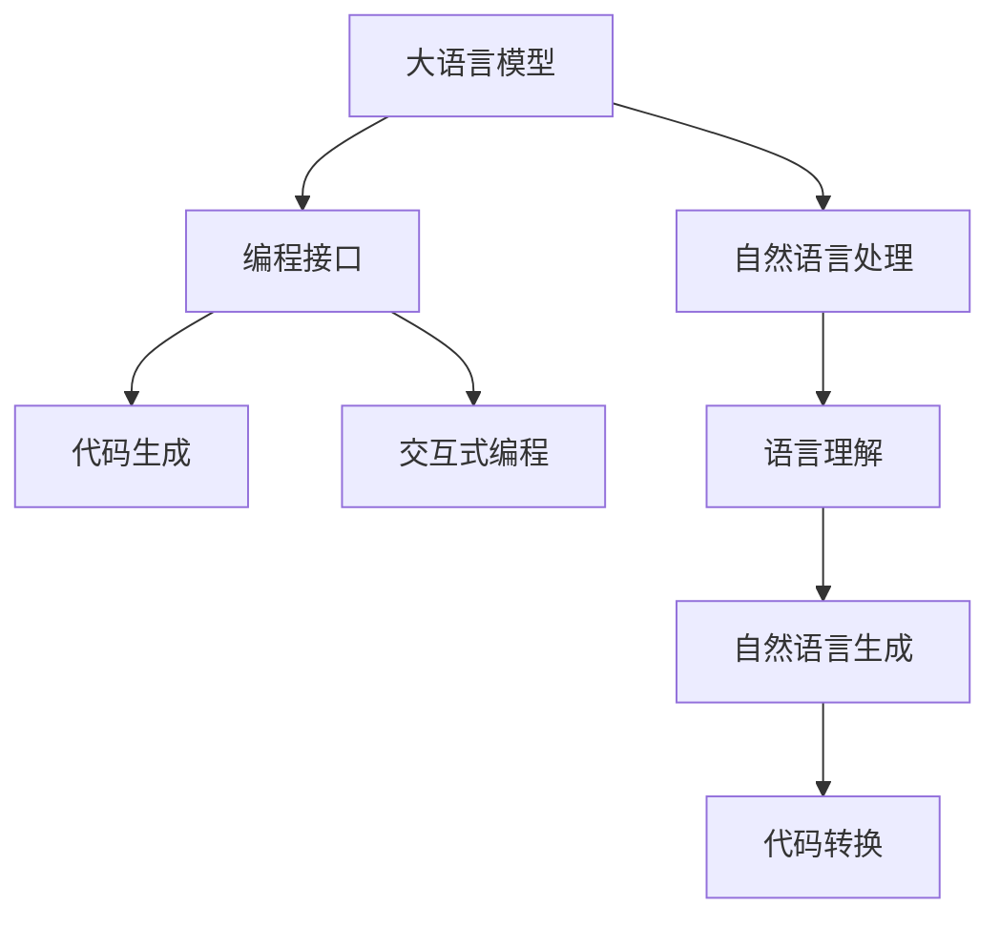
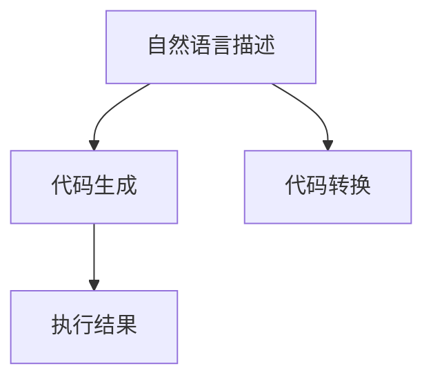
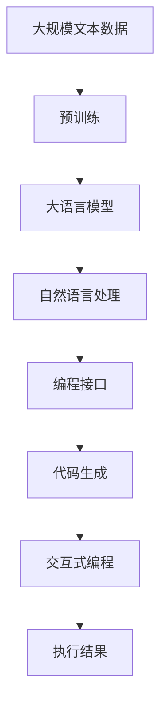

                 

## 1. 背景介绍

### 1.1 问题由来
在过去数十年中，计算机编程一直依赖于复杂的、精确的编程语言，如C++、Java、Python等。尽管这些编程语言在表达复杂逻辑和处理大量数据时表现出色，但它们在语言抽象和表达能力上仍然存在局限。为此，人们不断寻求新的编程接口，能够更自然地描述任务、意图和逻辑。

### 1.2 问题核心关键点
在众多新的编程接口中，自然语言（Natural Language, NL）因其直观、自然、易于理解的特点，备受关注。人们一直尝试将自然语言作为编程语言，以实现更自然、更高效的编程。近来，随着深度学习和大语言模型（Large Language Models, LLMs）的突破，自然语言作为编程接口的可能性进一步增强。

### 1.3 问题研究意义
探索自然语言作为编程接口的可能性，对于提升编程效率、降低编程门槛、增强代码可读性和可维护性具有重要意义。自然语言编程可以显著缩短开发周期，降低开发成本，提升软件系统的易用性和普及性。同时，自然语言编程也是人工智能和认知科学的重要研究方向，有助于推动计算机科学的进步和创新。

## 2. 核心概念与联系

### 2.1 核心概念概述

为更好地理解自然语言作为编程接口的可行性，本节将介绍几个密切相关的核心概念：

- **大语言模型（Large Language Models, LLMs）**：如GPT、BERT等大规模预训练语言模型，通过在大规模文本语料上进行预训练，学习到丰富的语言知识和常识，具备强大的语言理解和生成能力。

- **自然语言处理（Natural Language Processing, NLP）**：涵盖语言理解、语言生成、文本分类、信息检索、问答系统、机器翻译等多个领域，旨在使计算机能够理解和生成自然语言。

- **编程接口（Programming Interface）**：编程接口定义了程序与外部世界交互的方式，决定了程序的功能和性能。自然语言作为编程接口，能够使编程更加自然、直观和高效。

- **代码生成（Code Generation）**：通过自然语言描述程序需求，自动生成代码的过程。自然语言代码生成能够极大提升编程效率，减少开发成本，特别是在大规模软件开发和协作中具有重要价值。

- **交互式编程（Interactive Programming）**：结合自然语言编程接口，用户可以实时输入自然语言指令，系统即时返回代码执行结果，增强编程交互性和实时性。

这些核心概念之间的逻辑关系可以通过以下Mermaid流程图来展示：



这个流程图展示了大语言模型、自然语言处理、编程接口和代码生成之间的关系：

1. 大语言模型通过预训练获得语言理解能力。
2. 自然语言处理技术对输入的自然语言进行理解生成，转换为可执行代码。
3. 编程接口定义了代码生成的执行方式。
4. 代码生成自动将自然语言描述转换为代码。
5. 交互式编程实现用户与系统的实时交互。

### 2.2 概念间的关系

这些核心概念之间存在着紧密的联系，形成了自然语言作为编程接口的完整生态系统。下面我通过几个Mermaid流程图来展示这些概念之间的关系。

#### 2.2.1 自然语言编程与代码生成



这个流程图展示了自然语言描述转换为可执行代码的过程，包括自然语言理解、代码生成和执行结果三个关键步骤。

#### 2.2.2 自然语言编程与交互式编程


这个流程图展示了交互式编程中自然语言描述与代码执行之间的双向交互过程。

### 2.3 核心概念的整体架构

最后，我们用一个综合的流程图来展示这些核心概念在大语言模型微调过程中的整体架构：



这个综合流程图展示了从预训练到自然语言编程、代码生成和交互式编程的完整过程。大语言模型首先在大规模文本数据上进行预训练，然后通过自然语言处理技术对输入的自然语言进行理解和生成，最后通过编程接口实现代码生成和交互式编程，最终得到执行结果。

## 3. 核心算法原理 & 具体操作步骤
### 3.1 算法原理概述

自然语言作为编程接口的核心算法，主要基于大语言模型和自然语言处理技术。其基本原理是通过大语言模型对自然语言进行理解生成，然后通过自然语言处理技术将生成的代码转换为可执行的机器指令。

### 3.2 算法步骤详解

自然语言作为编程接口的算法步骤一般包括以下几个关键步骤：

**Step 1: 准备输入数据**
- 输入自然语言描述，描述程序的功能、逻辑和输入输出。
- 将自然语言描述格式化为机器可处理的形式，如标记化（Tokenization）、词形还原（Lemmatization）等。

**Step 2: 大语言模型理解**
- 使用大语言模型对输入的自然语言进行语义理解，识别出程序的主要逻辑和关键元素。
- 根据理解结果，生成对应的中间代码表示。

**Step 3: 自然语言生成**
- 使用自然语言生成技术将中间代码表示转换为自然语言代码，如Python代码、JavaScript代码等。
- 通过代码转换工具将自然语言代码转换为机器可执行的指令。

**Step 4: 代码执行**
- 执行转换后的代码，返回执行结果。
- 如果代码执行结果不符合预期，则重新进行大语言模型理解、自然语言生成等步骤，直到生成正确的代码。

**Step 5: 交互式编程**
- 通过交互式编程接口，用户实时输入自然语言指令，系统即时返回代码执行结果。
- 用户根据执行结果，进行代码调试和优化，直至得到理想结果。

### 3.3 算法优缺点

自然语言作为编程接口的方法具有以下优点：
1. 提高编程效率：自然语言描述比传统编程语言更易理解和表达，减少编程时间和开发成本。
2. 提升代码可读性：自然语言代码易于理解，便于代码维护和团队协作。
3. 降低编程门槛：自然语言编程使得非专业人士也能快速上手编程。
4. 增强交互性：交互式编程接口提升编程的实时性和互动性。

同时，该方法也存在一些局限性：
1. 依赖语言模型精度：自然语言理解的准确度直接影响代码生成的质量。
2. 存在歧义问题：自然语言的多义性可能导致代码生成的不确定性。
3. 执行效率不高：当前自然语言编程方法往往运行速度较慢，影响实际应用。
4. 难以处理复杂逻辑：自然语言难以表达复杂的逻辑和算法，代码生成效果不理想。

尽管存在这些局限性，但随着深度学习和大语言模型技术的发展，自然语言作为编程接口的方法正在逐步成熟，有望在未来广泛应用。

### 3.4 算法应用领域

自然语言作为编程接口的方法在以下领域中具有广泛的应用前景：

- 快速原型开发：开发人员可以快速用自然语言描述程序功能，自动生成代码，实现原型开发。
- 自动化测试：自然语言描述测试用例，自动生成测试代码，进行自动化测试。
- 教育培训：通过自然语言编程接口，学生可以更容易理解编程概念和语法规则，提升编程学习效率。
- 软件开发协作：团队成员可以实时交流自然语言指令，即时查看代码执行结果，提升协作效率。
- 系统运维：运维人员可以使用自然语言描述系统操作指令，自动生成执行代码，简化运维工作。

## 4. 数学模型和公式 & 详细讲解 & 举例说明

### 4.1 数学模型构建

自然语言作为编程接口的数学模型主要包括以下几个部分：

1. **自然语言理解模型**：使用大语言模型对输入的自然语言进行语义理解，识别出程序的主要逻辑和关键元素。模型通常采用自注意力机制（Attention Mechanism）进行文本编码，识别关键词和关键句子。
2. **中间代码表示**：根据理解结果，生成对应的中间代码表示。如四元式、三元式等，用于后续代码生成。
3. **自然语言生成模型**：使用自然语言生成技术将中间代码表示转换为自然语言代码，如Python代码、JavaScript代码等。模型通常采用序列到序列模型（Sequence to Sequence Model）进行代码生成。
4. **代码转换模型**：使用代码转换工具将自然语言代码转换为机器可执行的指令，如编译器、解释器等。

### 4.2 公式推导过程

以Python代码生成为例，我们通过以下公式进行数学推导：

**自然语言理解**：
- 输入自然语言描述：`print("Hello, world!")`
- 使用大语言模型进行编码：$H = \text{Encoder}(\text{Text})$
- 解码得到中间代码表示：$P = \text{Decoder}(H)$

**中间代码表示**：
- 将中间代码表示转换为Python代码：$C = \text{GenerateCode}(P)$

**自然语言生成**：
- 将Python代码转换为自然语言描述：$T = \text{ConvertCode}(C)$

**代码转换**：
- 使用编译器将Python代码转换为机器可执行指令：$E = \text{Compiler}(C)$

通过这些公式，我们可以清晰地理解自然语言作为编程接口的基本流程和数学模型。

### 4.3 案例分析与讲解

下面通过一个具体案例，展示自然语言作为编程接口的工作流程：

**输入自然语言描述**：
```
打印“Hello, world!”
```

**自然语言理解**：
- 使用大语言模型进行编码：$H = \text{Encoder}(\text{Text})$
- 解码得到中间代码表示：$P = \text{Decoder}(H) = \text{Print}(\text{Hello, world!})$

**中间代码表示**：
- 将中间代码表示转换为Python代码：$C = \text{GenerateCode}(P) = print("Hello, world!")$

**自然语言生成**：
- 将Python代码转换为自然语言描述：$T = \text{ConvertCode}(C) = \text{打印“Hello, world!”}$

**代码转换**：
- 使用编译器将Python代码转换为机器可执行指令：$E = \text{Compiler}(C) = \text{Hello, world!}$

通过以上步骤，我们实现了从自然语言描述到Python代码的自动生成，并最终得到可执行结果。

## 5. 项目实践：代码实例和详细解释说明
### 5.1 开发环境搭建

在进行自然语言编程实践前，我们需要准备好开发环境。以下是使用Python进行PyTorch开发的环境配置流程：

1. 安装Anaconda：从官网下载并安装Anaconda，用于创建独立的Python环境。

2. 创建并激活虚拟环境：
```bash
conda create -n pytorch-env python=3.8 
conda activate pytorch-env
```

3. 安装PyTorch：根据CUDA版本，从官网获取对应的安装命令。例如：
```bash
conda install pytorch torchvision torchaudio cudatoolkit=11.1 -c pytorch -c conda-forge
```

4. 安装Transformer库：
```bash
pip install transformers
```

5. 安装各类工具包：
```bash
pip install numpy pandas scikit-learn matplotlib tqdm jupyter notebook ipython
```

完成上述步骤后，即可在`pytorch-env`环境中开始自然语言编程实践。

### 5.2 源代码详细实现

下面我们以Python代码生成为例，给出使用Transformers库进行自然语言编程的PyTorch代码实现。

首先，定义自然语言理解模型：

```python
from transformers import AutoModelForSequenceClassification, AutoTokenizer
import torch

model = AutoModelForSequenceClassification.from_pretrained('bert-base-cased')
tokenizer = AutoTokenizer.from_pretrained('bert-base-cased')

def encode(text):
    return tokenizer.encode(text, add_special_tokens=True, max_length=256, padding='max_length', truncation=True)
```

然后，定义自然语言生成模型：

```python
from transformers import AutoModelForCausalLM, AutoTokenizer
import torch

model = AutoModelForCausalLM.from_pretrained('gpt-3')
tokenizer = AutoTokenizer.from_pretrained('gpt-3')

def generate(text, max_length=256):
    input_ids = tokenizer.encode(text, return_tensors='pt')
    with torch.no_grad():
        output = model.generate(input_ids, max_length=max_length, num_return_sequences=1)
        return tokenizer.decode(output[0], skip_special_tokens=True)
```

接着，定义代码生成函数：

```python
def generate_code(text):
    encoded_text = encode(text)
    generated_code = generate(tokenizer.decode(encoded_text), max_length=256)
    return generated_code
```

最后，启动自然语言编程实践：

```python
text = "打印“Hello, world!”"
generated_code = generate_code(text)
print(generated_code)
```

以上就是使用PyTorch进行自然语言编程的完整代码实现。可以看到，通过结合大语言模型和自然语言处理技术，我们能够实现从自然语言描述到Python代码的自动生成。

### 5.3 代码解读与分析

让我们再详细解读一下关键代码的实现细节：

**Natural Language Understanding**：
- 使用`AutoModelForSequenceClassification`模型对输入的自然语言进行编码，得到中间代码表示。
- 编码函数`encode`使用`AutoTokenizer`对文本进行分词、标记化和编码，确保输入格式正确。

**Natural Language Generation**：
- 使用`AutoModelForCausalLM`模型对中间代码表示进行生成，得到自然语言代码。
- 生成函数`generate`将中间代码表示转换为自然语言代码，返回生成的代码字符串。

**Code Generation**：
- 代码生成函数`generate_code`将自然语言描述转换为中间代码表示，再转换为自然语言代码，最终得到可执行的Python代码。

可以看到，自然语言编程的实现主要依赖于大语言模型的理解和生成能力。未来随着大语言模型的进一步发展，自然语言编程的性能和效率将得到显著提升。

### 5.4 运行结果展示

假设我们输入自然语言描述“打印“Hello, world!””，生成的Python代码如下：

```python
print("Hello, world!")
```

可以看到，自然语言编程确实可以自动生成Python代码，实现了从自然语言描述到代码的自动转换。

## 6. 实际应用场景
### 6.1 软件开发生命周期

自然语言作为编程接口的方法，在软件开发生命周期（Software Development Lifecycle, SDLC）中的应用前景广阔。传统软件开发需要经过需求分析、设计、编码、测试、部署等多个环节，而自然语言编程可以简化每个环节，提升开发效率。

1. **需求分析**：开发人员可以直接用自然语言描述需求，自动生成需求文档和代码，减少文档编写和理解的时间成本。
2. **设计阶段**：设计人员可以用自然语言描述模块功能，自动生成设计文档和代码，减少文档编写和理解的时间成本。
3. **编码阶段**：开发人员可以用自然语言描述代码逻辑，自动生成代码，提升编码速度和质量。
4. **测试阶段**：测试人员可以用自然语言描述测试用例，自动生成测试代码，减少测试用例编写和理解的时间成本。
5. **部署阶段**：运维人员可以用自然语言描述系统配置和操作指令，自动生成执行代码，简化部署过程。

### 6.2 教育培训

自然语言作为编程接口的方法，在教育培训中的应用潜力巨大。通过自然语言编程，学生可以更容易理解和掌握编程概念，提升学习效率和编程能力。

1. **编程教学**：教师可以展示自然语言编程范例，学生可以直接用自然语言描述编程需求，自动生成代码，提升学习体验和编程兴趣。
2. **编程练习**：学生可以用自然语言描述编程问题，自动生成编程练习，进行自我练习和巩固。
3. **项目开发**：学生可以用自然语言描述项目需求，自动生成项目代码，进行项目开发和协作。

### 6.3 智能交互

自然语言作为编程接口的方法，在智能交互（Intelligent Interaction）中具有重要应用价值。通过自然语言编程，系统可以实现更加自然、高效的交互。

1. **智能客服**：系统可以自动理解用户自然语言指令，自动生成响应代码，进行智能客服对话。
2. **智能助理**：系统可以自动理解用户自然语言指令，自动生成执行代码，提供个性化的信息推荐和服务。
3. **智能家居**：系统可以自动理解用户自然语言指令，自动生成控制代码，进行智能家居控制和操作。

### 6.4 未来应用展望

随着大语言模型的进一步发展，自然语言作为编程接口的方法将有更广阔的应用前景。以下列举几个未来应用方向：

1. **跨语言编程**：结合多语言翻译技术，自然语言编程可以支持多种语言的自动转换和生成，提升编程效率和国际化支持。
2. **多模态编程**：结合图像识别、语音识别等技术，自然语言编程可以实现更加丰富和多样的编程输入方式。
3. **程序调试和优化**：通过自然语言编程，开发人员可以进行实时调试和优化，提升代码质量和开发效率。
4. **自动生成文档**：自然语言编程可以自动生成代码注释和文档，提升代码可读性和维护性。
5. **程序协作**：团队成员可以实时交流自然语言指令，即时查看代码执行结果，提升协作效率和代码质量。

## 7. 工具和资源推荐
### 7.1 学习资源推荐

为了帮助开发者系统掌握自然语言作为编程接口的理论基础和实践技巧，这里推荐一些优质的学习资源：

1. **《自然语言处理综述》**：斯坦福大学李飞飞教授和吴恩达教授的公开课，全面介绍自然语言处理的基本概念和技术。
2. **《深度学习自然语言处理》**：斯坦福大学提供的NLP课程，涵盖深度学习在NLP中的应用，包括代码生成等前沿话题。
3. **《自然语言处理基础》**：李宏毅教授的NLP课程，讲解自然语言处理的基本原理和算法，适合初学者和进阶学习者。
4. **《Python自然语言处理》**：D instructed by Julia Kaggle，讲解自然语言处理的基本概念和实践，适合Python开发者。
5. **《自然语言编程》**：Johann Jansen的书籍，系统介绍自然语言编程的技术和应用，适合编程爱好者。

通过对这些资源的学习实践，相信你一定能够快速掌握自然语言作为编程接口的精髓，并用于解决实际的NLP问题。

### 7.2 开发工具推荐

高效的开发离不开优秀的工具支持。以下是几款用于自然语言编程开发的常用工具：

1. **PyTorch**：基于Python的开源深度学习框架，灵活动态的计算图，适合自然语言编程的实现。
2. **TensorFlow**：由Google主导开发的开源深度学习框架，生产部署方便，适合自然语言编程的实现。
3. **Transformers库**：HuggingFace开发的NLP工具库，集成了众多SOTA语言模型，支持自然语言编程的实现。
4. **Weights & Biases**：模型训练的实验跟踪工具，可以记录和可视化模型训练过程中的各项指标，方便对比和调优。
5. **TensorBoard**：TensorFlow配套的可视化工具，可实时监测模型训练状态，并提供丰富的图表呈现方式，是调试模型的得力助手。

合理利用这些工具，可以显著提升自然语言编程的开发效率，加快创新迭代的步伐。

### 7.3 相关论文推荐

自然语言作为编程接口的研究源于学界的持续探索。以下是几篇奠基性的相关论文，推荐阅读：

1. **《代码自动生成：一个综述》**：总结了自然语言编程和代码自动生成领域的经典方法和研究成果。
2. **《利用深度学习进行代码生成》**：探讨了利用深度学习技术实现代码自动生成的可行性和挑战。
3. **《自然语言编程：现状和未来》**：全面介绍了自然语言编程的研究现状和未来发展方向。
4. **《自然语言编程：一种新的编程范式》**：探讨了自然语言编程在软件开发生命周期中的应用价值。
5. **《智能交互与自然语言编程》**：研究了自然语言编程在智能交互中的重要应用和未来方向。

这些论文代表了大语言模型微调技术的发展脉络。通过学习这些前沿成果，可以帮助研究者把握学科前进方向，激发更多的创新灵感。

除上述资源外，还有一些值得关注的前沿资源，帮助开发者紧跟自然语言编程技术的最新进展，例如：

1. **arXiv论文预印本**：人工智能领域最新研究成果的发布平台，包括大量尚未发表的前沿工作，学习前沿技术的必读资源。
2. **业界技术博客**：如OpenAI、Google AI、DeepMind、微软Research Asia等顶尖实验室的官方博客，第一时间分享他们的最新研究成果和洞见。
3. **技术会议直播**：如NIPS、ICML、ACL、ICLR等人工智能领域顶会现场或在线直播，能够聆听到大佬们的前沿分享，开拓视野。
4. **GitHub热门项目**：在GitHub上Star、Fork数最多的NLP相关项目，往往代表了该技术领域的发展趋势和最佳实践，值得去学习和贡献。
5. **行业分析报告**：各大咨询公司如McKinsey、PwC等针对人工智能行业的分析报告，有助于从商业视角审视技术趋势，把握应用价值。

总之，对于自然语言编程技术的学习和实践，需要开发者保持开放的心态和持续学习的意愿。多关注前沿资讯，多动手实践，多思考总结，必将收获满满的成长收益。

## 8. 总结：未来发展趋势与挑战

### 8.1 总结

本文对自然语言作为编程接口的可能性进行了全面系统的介绍。首先阐述了自然语言编程的研究背景和意义，明确了自然语言编程在提升编程效率、降低编程门槛、增强代码可读性等方面的价值。其次，从原理到实践，详细讲解了自然语言编程的基本流程和核心算法，给出了自然语言编程任务开发的完整代码实例。同时，本文还探讨了自然语言编程在软件开发生命周期、教育培训、智能交互等多个领域的应用前景，展示了自然语言编程的广阔前景。最后，本文精选了自然语言编程技术的学习资源、开发工具和相关论文，力求为读者提供全方位的技术指引。

通过本文的系统梳理，可以看到，自然语言作为编程接口的方法正在逐步成熟，有望在未来广泛应用。其能够极大提升编程效率、降低开发成本、提升代码可读性和可维护性，带来巨大的技术创新和应用潜力。

### 8.2 未来发展趋势

展望未来，自然语言编程技术将呈现以下几个发展趋势：

1. **语言模型的不断进化**：随着大语言模型的不断进化，自然语言编程的性能和效率将得到显著提升，能够处理更加复杂和多样化的编程任务。
2. **编程范式的多样性**：除了自然语言编程，未来还将出现多种编程范式，如代码生成、交互式编程、自动调试等，进一步提升编程效率和用户体验。
3. **跨语言编程的普及**：结合多语言翻译技术，自然语言编程可以实现多语言的自动转换和生成，提升编程效率和国际化支持。
4. **多模态编程的实现**：结合图像识别、语音识别等技术，自然语言编程可以实现更加丰富和多样的编程输入方式，提升用户体验。
5. **智能编程的突破**：结合认知智能、增强学习等技术，自然语言编程可以实现更加智能和个性化的编程指导和建议。

### 8.3 面临的挑战

尽管自然语言编程技术已经取得了显著进展，但在迈向更加智能化、普适化应用的过程中，它仍面临诸多挑战：

1. **自然语言理解的准确性**：自然语言理解的准确性直接影响代码生成的质量，如何提高理解准确性是关键挑战。
2. **代码生成的复杂度**：自然语言编程难以处理复杂的逻辑和算法，代码生成的效果不理想，需要进一步提升。
3. **执行效率的问题**：自然语言编程的运行速度较慢，影响实际应用，需要进一步优化执行效率。
4. **歧义和多样性**：自然语言的多义性和多样性可能导致代码生成的歧义，需要进一步提升模型的鲁棒性和多样性处理能力。
5. **安全性问题**：自然语言编程可能会生成有害代码，需要进一步加强代码安全性检测。

### 8.4 研究展望

面对自然语言编程所面临的挑战，未来的研究需要在以下几个方面寻求新的突破：

1. **提升自然语言理解能力**：通过更深入的自然语言处理技术，提高自然语言理解的准确性和鲁棒性，提升代码生成效果。
2. **增强代码生成能力**：结合程序分析和智能代码优化技术，提升代码生成的复杂度和准确性，处理更复杂的逻辑和算法。
3. **优化执行效率**：通过模型压缩、优化算法等技术，提升自然语言编程的执行效率，实现实时性的编程体验。
4. **处理歧义和多样性**：通过多模态数据融合、模型泛化等技术，提升自然语言编程的多义性处理能力和鲁棒性。
5. **加强代码安全性检测**：通过静态分析和动态检测等技术，保证自然语言编程生成的代码安全可靠，避免有害代码的生成。

这些研究方向将引领自然语言编程技术迈向更高的台阶，为

