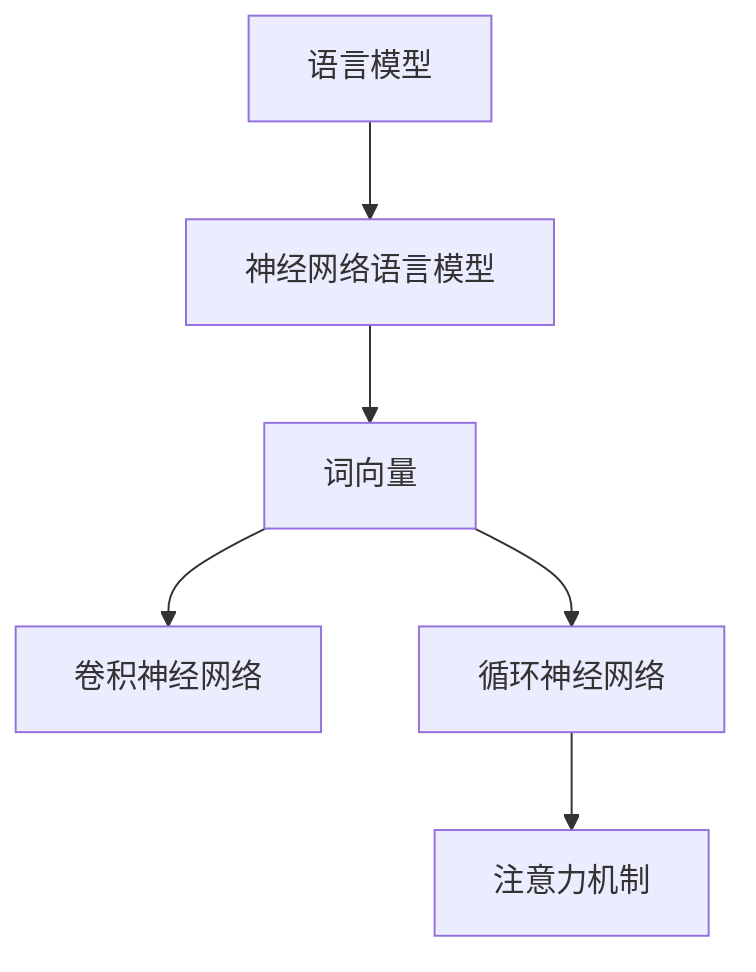
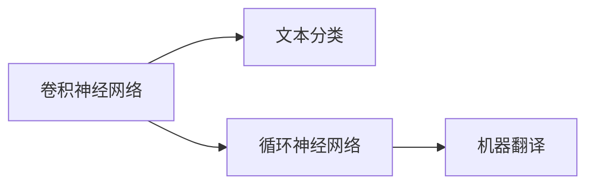
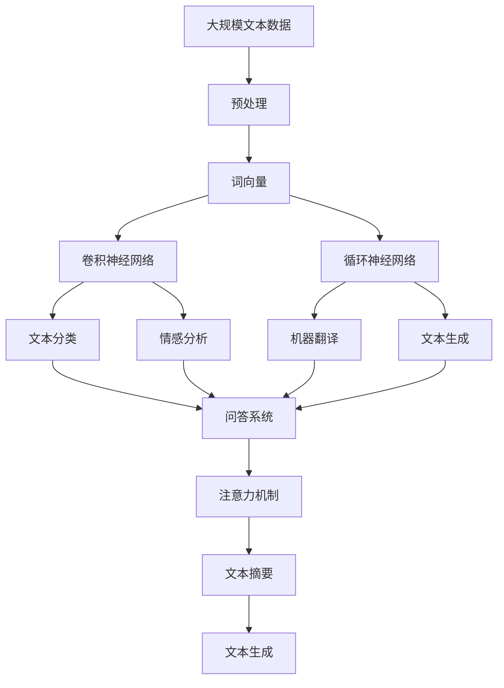

                 

# 自然语言处理(Natural Language Processing) - 原理与代码实例讲解

> 关键词：自然语言处理, 语言模型, 词向量, 卷积神经网络, 循环神经网络, 注意力机制, 代码实例, 项目实践

## 1. 背景介绍

### 1.1 问题由来
自然语言处理(Natural Language Processing, NLP)是人工智能领域的重要分支，旨在让机器理解、处理和生成人类语言。随着深度学习技术的发展，NLP领域涌现出大量基于神经网络的模型，如词向量模型、卷积神经网络、循环神经网络、注意力机制等，极大地提升了语言处理的准确性和智能化水平。这些模型在机器翻译、情感分析、问答系统、文本摘要、信息检索等领域已取得显著成果。

然而，NLP任务涉及语言结构和语义的复杂性，以及人类语言多变性和多样性的特点，使得NLP技术的发展仍面临诸多挑战。本博客将从NLP的原理入手，系统介绍NLP的核心概念和技术，并通过代码实例讲解其实际应用，希望对NLP技术的学习和实践提供帮助。

### 1.2 问题核心关键点
NLP的核心问题包括语言模型的建立、词向量的表示、卷积神经网络(CNN)和循环神经网络(RNN)的应用、注意力机制的引入，以及这些技术的组合应用。具体来说，NLP主要解决以下问题：

- 语言模型建模：如何根据输入的词序列预测下一个词或一段文本的概率。
- 词向量表示：如何将单词映射到向量空间，使得相近的词在向量空间中距离较近。
- 卷积神经网络应用：如何通过CNN模型提取文本中的局部特征。
- 循环神经网络应用：如何通过RNN模型捕捉文本中的时间依赖关系。
- 注意力机制引入：如何通过注意力机制在文本处理中引入上下文信息。

这些问题都是NLP中亟需解决的核心难题，本文将从这些关键点出发，深入讲解NLP原理和实践。

### 1.3 问题研究意义
NLP技术在智能客服、机器翻译、智能问答、新闻摘要、文本分类等众多领域都有广泛应用。通过深入学习和实践NLP技术，可以有效提升信息处理和应用系统的智能化水平，满足日益增长的社会需求。NLP技术的不断进步，将推动智能时代的发展，引领信息技术从自动化向智能化转型。

## 2. 核心概念与联系

### 2.1 核心概念概述

为了更好地理解NLP的核心概念和技术，本节将介绍几个密切相关的核心概念：

- 语言模型：根据输入的词序列预测下一个词的概率分布。常见的语言模型包括n-gram模型和神经网络语言模型。
- 词向量：将单词映射到向量空间，使得向量能够表示单词的语义信息。常见的词向量模型包括Word2Vec、GloVe和FastText等。
- 卷积神经网络：通过卷积层提取文本中的局部特征，适用于文本分类、情感分析等任务。
- 循环神经网络：通过循环层捕捉文本中的时间依赖关系，适用于机器翻译、文本生成等任务。
- 注意力机制：通过引入注意力权重，使得模型能够动态地关注文本中的重要部分，适用于问答系统、文本摘要等任务。

这些核心概念之间的逻辑关系可以通过以下Mermaid流程图来展示：

这个流程图展示了大语言处理的基本构成，包括语言模型、词向量、卷积神经网络、循环神经网络和注意力机制等关键组件。这些组件相互配合，构成了解决NLP任务的完整生态系统。

### 2.2 概念间的关系

这些核心概念之间存在着紧密的联系，形成了NLP任务的完整生态系统。下面我们通过几个Mermaid流程图来展示这些概念之间的关系。

#### 2.2.1 语言模型与词向量

这个流程图展示了语言模型与词向量之间的关系。词向量是通过训练语言模型得到的，语言模型可以通过词向量表示单词的概率分布。

#### 2.2.2 卷积神经网络与循环神经网络

这个流程图展示了卷积神经网络与循环神经网络在NLP任务中的应用。卷积神经网络适用于文本分类、情感分析等任务，而循环神经网络适用于机器翻译、文本生成等任务。

#### 2.2.3 注意力机制与卷积神经网络、循环神经网络

这个流程图展示了注意力机制在NLP任务中的应用。注意力机制可以用于问答系统、文本摘要、文本生成等任务，通过引入上下文信息，增强模型的处理能力。

### 2.3 核心概念的整体架构

最后，我们用一个综合的流程图来展示这些核心概念在大语言处理中的整体架构：

这个综合流程图展示了从数据预处理、词向量训练、神经网络模型构建到具体任务应用的完整过程。通过这些核心概念和技术，NLP技术可以应用于文本分类、情感分析、机器翻译、问答系统、文本摘要、文本生成等众多任务。

## 3. 核心算法原理 & 具体操作步骤
### 3.1 算法原理概述

自然语言处理的核心算法包括语言模型建模、词向量训练、卷积神经网络、循环神经网络和注意力机制。下面我们将分别介绍这些算法的原理。

#### 3.1.1 语言模型建模

语言模型建模的目标是根据输入的词序列预测下一个词的概率。常用的语言模型有n-gram模型和神经网络语言模型。

n-gram模型假设单词之间存在独立性，通过统计单词序列的频率，计算每个单词出现的概率。n-gram模型的公式如下：

$$
P(w_t | w_{t-1}, \cdots, w_{t-n+1}) = \frac{\text{count}(w_{t-1}, \cdots, w_{t-n+1}, w_t)}{\text{count}(w_{t-1}, \cdots, w_{t-n+1})}
$$

其中，$w_t$表示第$t$个单词，$n$表示模型的n-gram窗口大小。

神经网络语言模型则是通过多层神经网络，利用softmax函数计算单词的概率。常用的神经网络语言模型有递归神经网络(Recurrent Neural Network, RNN)和长短时记忆网络(Long Short-Term Memory, LSTM)。

#### 3.1.2 词向量训练

词向量训练的目的是将单词映射到向量空间，使得向量能够表示单词的语义信息。常用的词向量模型有Word2Vec、GloVe和FastText等。

Word2Vec模型通过两个任务训练词向量：基于上下文的单词预测任务和单词类别预测任务。其公式如下：

$$
\text{softmax}(h, x_i) = \frac{\exp\left(w \cdot x_i + b\right)}{\sum_j \exp\left(w \cdot x_j + b\right)}
$$

其中，$h$表示隐层向量，$w$和$b$表示线性层的权重和偏置，$x_i$表示输入向量，$\text{softmax}$函数表示概率分布。

GloVe模型则是通过共现矩阵训练词向量，将每个单词表示为一个向量，计算单词之间的共现概率。其公式如下：

$$
\min_{w, \boldsymbol{v}} \sum_{i \in \text{Voc}} \sum_{j \in \text{Voc}} w_{i,j} \left\| w_i - \boldsymbol{v}_j \right\|^2
$$

其中，$w_{i,j}$表示单词$i$和单词$j$的共现权重，$\left\| w_i - \boldsymbol{v}_j \right\|^2$表示单词$i$和单词$j$的向量差，$w$表示单词的词向量，$\boldsymbol{v}$表示单词的向量。

FastText模型则是通过字符级别的词向量训练，捕捉单词的语义信息。其公式如下：

$$
\min_{w} \sum_{i \in \text{Voc}} \left\| w_i - \sum_{j=1}^{n} \text{char\_{id} \cdot \text{char\_{vec}}_j \right\|^2
$$

其中，$w$表示单词的词向量，$\text{char\_{id}}$表示单词的字符id，$\text{char\_{vec}}_j$表示字符的词向量。

#### 3.1.3 卷积神经网络

卷积神经网络(CNN)在文本分类和情感分析任务中应用广泛。CNN模型通过卷积层提取文本中的局部特征，适用于文本分类、情感分析等任务。

CNN模型由卷积层、池化层和全连接层组成。卷积层通过滑动窗口的方式提取文本中的局部特征，池化层通过降维操作捕捉文本的局部信息，全连接层将池化层的特征进行分类或回归。

卷积神经网络的公式如下：

$$
\text{Conv}(\boldsymbol{X}, w) = \text{ReLU}(\text{Conv\_{2D}}(\boldsymbol{X}, w) + \text{bias})
$$

其中，$\boldsymbol{X}$表示输入的文本，$w$表示卷积核，$\text{ReLU}$表示激活函数，$\text{Conv\_{2D}}$表示二维卷积操作。

#### 3.1.4 循环神经网络

循环神经网络(RNN)在机器翻译和文本生成任务中应用广泛。RNN模型通过循环层捕捉文本中的时间依赖关系，适用于机器翻译、文本生成等任务。

RNN模型由循环层和全连接层组成。循环层通过逐个处理文本中的单词，将前一个单词的状态信息传递到下一个单词的状态中，全连接层将循环层的输出进行分类或回归。

循环神经网络的公式如下：

$$
h_t = \text{tanh}(W_x x_t + U_h h_{t-1} + b_h)
$$

$$
\hat{y_t} = \text{softmax}(V_h h_t + b_y)
$$

其中，$h_t$表示状态向量，$x_t$表示输入向量，$W_x$、$U_h$和$V_h$表示权重矩阵，$b_h$和$b_y$表示偏置向量。

#### 3.1.5 注意力机制

注意力机制在问答系统、文本摘要和文本生成等任务中应用广泛。注意力机制通过引入注意力权重，使得模型能够动态地关注文本中的重要部分。

注意力机制的公式如下：

$$
\text{Attention}(\boldsymbol{Q}, \boldsymbol{K}, \boldsymbol{V}) = \text{softmax}\left(\frac{\boldsymbol{Q}\boldsymbol{K}^T}{\sqrt{d}}\right) \boldsymbol{V}
$$

其中，$\boldsymbol{Q}$表示查询向量，$\boldsymbol{K}$表示键向量，$\boldsymbol{V}$表示值向量，$d$表示向量的维度。

### 3.2 算法步骤详解

#### 3.2.1 语言模型建模

1. 数据预处理：将原始文本数据进行清洗、分词、去除停用词等预处理。
2. 构建n-gram模型或神经网络模型：根据预处理后的数据，构建n-gram模型或神经网络语言模型。
3. 训练模型：通过反向传播算法，使用梯度下降等优化算法训练模型参数。
4. 评估模型：在测试集上评估模型的性能，如困惑度、准确率等指标。

#### 3.2.2 词向量训练

1. 数据预处理：将原始文本数据进行清洗、分词、去除停用词等预处理。
2. 构建词向量模型：根据预处理后的数据，选择Word2Vec、GloVe或FastText等词向量模型。
3. 训练模型：通过反向传播算法，使用梯度下降等优化算法训练词向量。
4. 评估模型：在测试集上评估模型的性能，如向量相似度、共现概率等指标。

#### 3.2.3 卷积神经网络

1. 数据预处理：将原始文本数据进行清洗、分词、去除停用词等预处理。
2. 构建卷积神经网络模型：根据预处理后的数据，构建卷积神经网络模型。
3. 训练模型：通过反向传播算法，使用梯度下降等优化算法训练模型参数。
4. 评估模型：在测试集上评估模型的性能，如分类准确率、情感得分等指标。

#### 3.2.4 循环神经网络

1. 数据预处理：将原始文本数据进行清洗、分词、去除停用词等预处理。
2. 构建循环神经网络模型：根据预处理后的数据，构建循环神经网络模型。
3. 训练模型：通过反向传播算法，使用梯度下降等优化算法训练模型参数。
4. 评估模型：在测试集上评估模型的性能，如翻译质量、生成准确率等指标。

#### 3.2.5 注意力机制

1. 数据预处理：将原始文本数据进行清洗、分词、去除停用词等预处理。
2. 构建注意力机制模型：根据预处理后的数据，构建注意力机制模型。
3. 训练模型：通过反向传播算法，使用梯度下降等优化算法训练模型参数。
4. 评估模型：在测试集上评估模型的性能，如问答准确率、摘要质量等指标。

### 3.3 算法优缺点

自然语言处理的算法各有优缺点，下面我们将分别介绍。

#### 3.3.1 语言模型建模

优点：
- 可以通过n-gram模型或神经网络模型捕捉单词之间的关系，构建语义信息。
- 可以通过神经网络语言模型引入非线性关系，提升模型性能。

缺点：
- n-gram模型假设单词之间存在独立性，忽略上下文信息，难以捕捉长距离依赖关系。
- 神经网络语言模型需要大量标注数据，训练复杂度较高。

#### 3.3.2 词向量训练

优点：
- 可以将单词映射到向量空间，捕捉单词的语义信息。
- 可以通过词向量模型引入先验知识，提升模型性能。

缺点：
- 词向量训练需要大量标注数据，训练复杂度较高。
- 词向量模型需要选择合适的算法，如Word2Vec、GloVe等，选择不当可能导致性能下降。

#### 3.3.3 卷积神经网络

优点：
- 可以通过卷积层提取文本中的局部特征，适用于文本分类、情感分析等任务。
- 可以通过池化层捕捉文本的局部信息，提高模型性能。

缺点：
- 卷积神经网络难以捕捉时间依赖关系，不适用于文本生成任务。
- 卷积神经网络需要大量标注数据，训练复杂度较高。

#### 3.3.4 循环神经网络

优点：
- 可以通过循环层捕捉文本中的时间依赖关系，适用于机器翻译、文本生成等任务。
- 可以通过LSTM等改进模型提升模型性能。

缺点：
- 循环神经网络存在梯度消失和梯度爆炸等问题，训练复杂度较高。
- 循环神经网络难以处理长文本，需要分段处理。

#### 3.3.5 注意力机制

优点：
- 可以通过注意力机制引入上下文信息，提升模型性能。
- 可以通过注意力机制动态关注文本中的重要部分，提高模型效果。

缺点：
- 注意力机制需要计算注意力权重，计算复杂度较高。
- 注意力机制需要大量标注数据，训练复杂度较高。

### 3.4 算法应用领域

自然语言处理的核心算法广泛应用于各种文本处理任务。下面我们将介绍几个典型应用领域：

#### 3.4.1 文本分类

文本分类是NLP中的基础任务，将文本分为不同的类别，如新闻分类、情感分类等。常用的文本分类模型包括朴素贝叶斯、支持向量机、卷积神经网络等。

#### 3.4.2 情感分析

情感分析是NLP中的重要任务，通过分析文本的情感倾向，判断文本的情绪。常用的情感分析模型包括朴素贝叶斯、支持向量机、循环神经网络等。

#### 3.4.3 机器翻译

机器翻译是将一种语言翻译成另一种语言的任务，常用的机器翻译模型包括统计机器翻译模型、基于神经网络的机器翻译模型等。

#### 3.4.4 问答系统

问答系统是根据用户输入的问题，提供准确答案的系统，常用的问答系统模型包括基于检索的问答系统、基于生成式问答系统等。

#### 3.4.5 文本摘要

文本摘要是将长文本压缩成简短摘要的任务，常用的文本摘要模型包括基于抽取的摘要模型、基于生成的摘要模型等。

#### 3.4.6 文本生成

文本生成是根据给定的文本条件，生成新的文本。常用的文本生成模型包括基于自回归的生成模型、基于变分自编码器的生成模型等。

## 4. 数学模型和公式 & 详细讲解 & 举例说明

### 4.1 数学模型构建

本节将使用数学语言对NLP的核心算法进行严格刻画。

#### 4.1.1 语言模型建模

假设有一个长度为$T$的词序列$w_1, w_2, \cdots, w_T$，语言模型为$p(w_t | w_{t-1}, \cdots, w_{t-n+1})$，则语言模型的概率定义为：

$$
p(w_1, \cdots, w_T) = \prod_{t=1}^T p(w_t | w_{t-1}, \cdots, w_{t-n+1})
$$

其中，$p(w_t | w_{t-1}, \cdots, w_{t-n+1})$表示单词$t$在给定前$n$个单词的条件概率，$T$表示序列长度，$n$表示模型窗口大小。

#### 4.1.2 词向量训练

假设有一个长度为$N$的词序列$w_1, w_2, \cdots, w_N$，词向量模型为$w \in \mathbb{R}^d$，则词向量的概率定义为：

$$
p(w_i | w_j) = \frac{\exp\left(\boldsymbol{v_i} \cdot \boldsymbol{v_j}\right)}{\sum_k \exp\left(\boldsymbol{v_i} \cdot \boldsymbol{v_k}\right)}
$$

其中，$w_i$表示单词$i$，$w_j$表示单词$j$，$d$表示向量维度，$\boldsymbol{v_i}$和$\boldsymbol{v_j}$表示单词$i$和单词$j$的词向量。

#### 4.1.3 卷积神经网络

假设有一个长度为$T$的词序列$x_1, x_2, \cdots, x_T$，卷积神经网络模型为$h_t = \text{tanh}(W_x x_t + U_h h_{t-1} + b_h)$，则卷积神经网络的输出定义为：

$$
\hat{y_t} = \text{softmax}(V_h h_t + b_y)
$$

其中，$x_t$表示第$t$个输入向量，$h_t$表示第$t$个状态向量，$y_t$表示第$t$个输出向量，$W_x$、$U_h$和$V_h$表示权重矩阵，$b_h$和$b_y$表示偏置向量。

#### 4.1.4 循环神经网络

假设有一个长度为$T$的词序列$x_1, x_2, \cdots, x_T$，循环神经网络模型为$h_t = \text{tanh}(W_x x_t + U_h h_{t-1} + b_h)$，则循环神经网络的输出定义为：

$$
\hat{y_t} = \text{softmax}(V_h h_t + b_y)
$$

其中，$x_t$表示第$t$个输入向量，$h_t$表示第$t$个状态向量，$y_t$表示第$t$个输出向量，$W_x$、$U_h$和$V_h$表示权重矩阵，$b_h$和$b_y$表示偏置向量。

#### 4.1.5 注意力机制

假设有一个长度为$T$的词序列$x_1, x_2, \cdots, x_T$，注意力机制模型为$\alpha_{ij} = \frac{\exp\left(\boldsymbol{Q_i} \boldsymbol{K_j}^T / \sqrt{d}\right)}{\sum_k \exp\left(\boldsymbol{Q_i} \boldsymbol{K_k}^T / \sqrt{d}\right)}$，则注意力机制的输出定义为：

$$
\hat{y_t} = \text{softmax}(V_h h_t + b_y)
$$

其中，$\alpha_{ij}$表示注意力权重，$\boldsymbol{Q_i}$表示查询向量，$\boldsymbol{K_j}$表示键向量，$\boldsymbol{V_j}$表示值向量，$d$表示向量的维度，$h_t$表示第$t$个状态向量，$y_t$表示第$t$个输出向量，$W_x$、$U_h$和$V_h$表示权重矩阵，$b_h$和$b_y$表示偏置向量。

### 4.2 公式推导过程

以下我们将对上述核心算法的公式进行推导。

#### 4.2.1 语言模型建模

假设有一个长度为$T$的词序列$w_1, w_2, \cdots, w_T$，语言模型为$p(w_t | w_{t-1}, \cdots, w_{t-n+1})$，则语言模型的概率定义为：

$$
p(w_1, \cdots, w_T) = \prod_{t=1}^T p(w_t | w_{t-1}, \cdots, w_{t-n+1})
$$

其中，$p(w_t | w_{t-1}, \cdots, w_{t-n+1})$表示单词$t$在给定前$n$个单词的条件概率，$T$表示序列长度，$n$表示模型窗口大小。

假设有一个长度为$T$的词序列$w_1, w_2, \cdots, w_T$，语言模型为$p(w_t | w_{t-1}, \cdots, w_{t-n+1})$，则语言模型的概率定义为：

$$
p(w_1, \cdots, w_T) = \prod_{t=1}^T p(w_t | w_{t-1}, \cdots, w_{t-n+1})
$$

其中，$p(w_t | w_{t-1}, \cdots, w_{t-n+1})$表示单词$t$在给定前$n$个单词的条件概率，$T$表示序列长度，$n$表示模型窗口大小。

#### 4.2.2 词向量训练

假设有一个长度为$N$的词序列$w_1, w_2, \cdots, w_N$，词向量模型为$w \in \mathbb{R}^d$，则词向量的概率定义为：

$$
p(w_i | w_j) = \frac{\exp\left(\boldsymbol{v_i} \cdot \boldsymbol{v_j}\right)}{\sum_k \exp\left(\boldsymbol{v_i} \cdot \boldsymbol{v_k}\right)}
$$

其中，$w_i$表示单词$i$，$w_j$表示单词$j$，$d$表示向量维度，$\boldsymbol{v_i}$和$\boldsymbol{v_j}$表示单词$i$和单词$j$的词向量。

假设有一个长度为$N$的词序列$w_1, w_2, \cdots, w_N$，词向量模型为$w \in \mathbb{R}^d$，则词向量的概率定义为：

$$
p(w_i | w_j) = \frac{\exp\left(\boldsymbol{v_i} \cdot \boldsymbol{v_j}\right)}{\sum_k \exp\left(\boldsymbol{v_i} \cdot \boldsymbol{v_k}\right)}
$$

其中，$w_i$表示单词$i$，$w_j$表示单词$j$，$d$表示向量维度，$\boldsymbol{v_i}$和$\boldsymbol{v_j}$表示单词$i$和单词$j$的词向量。

#### 4.2.3 卷积神经网络

假设有一个长度为$T$的词序列$x_1,

