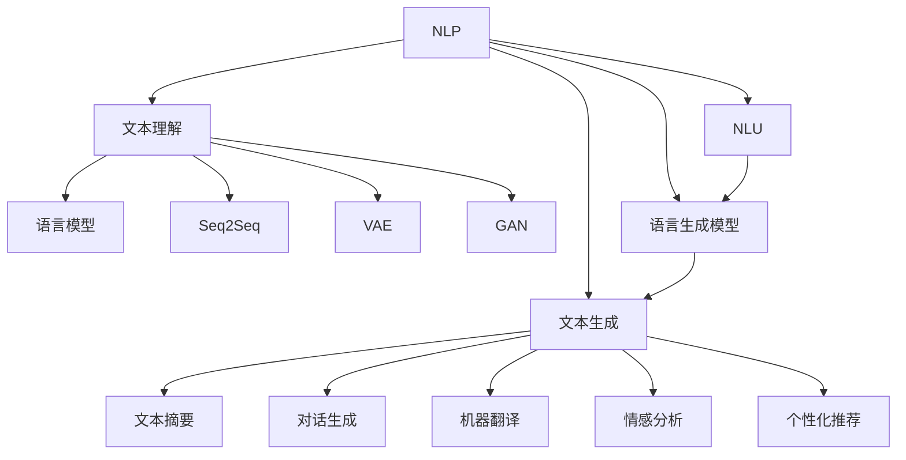
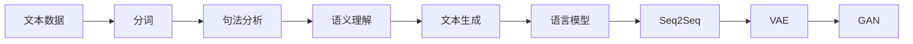
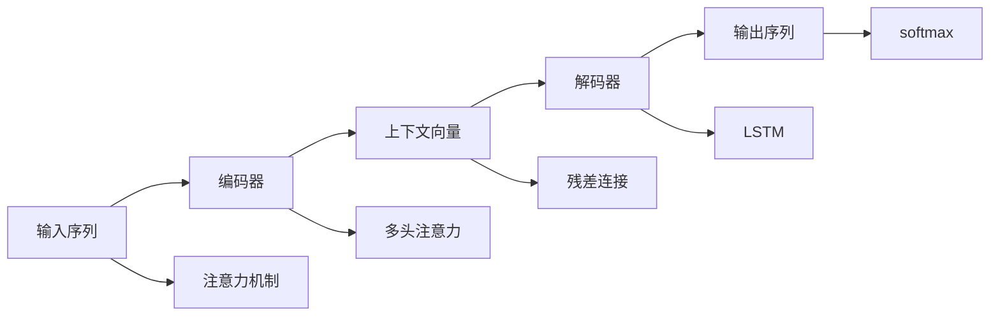
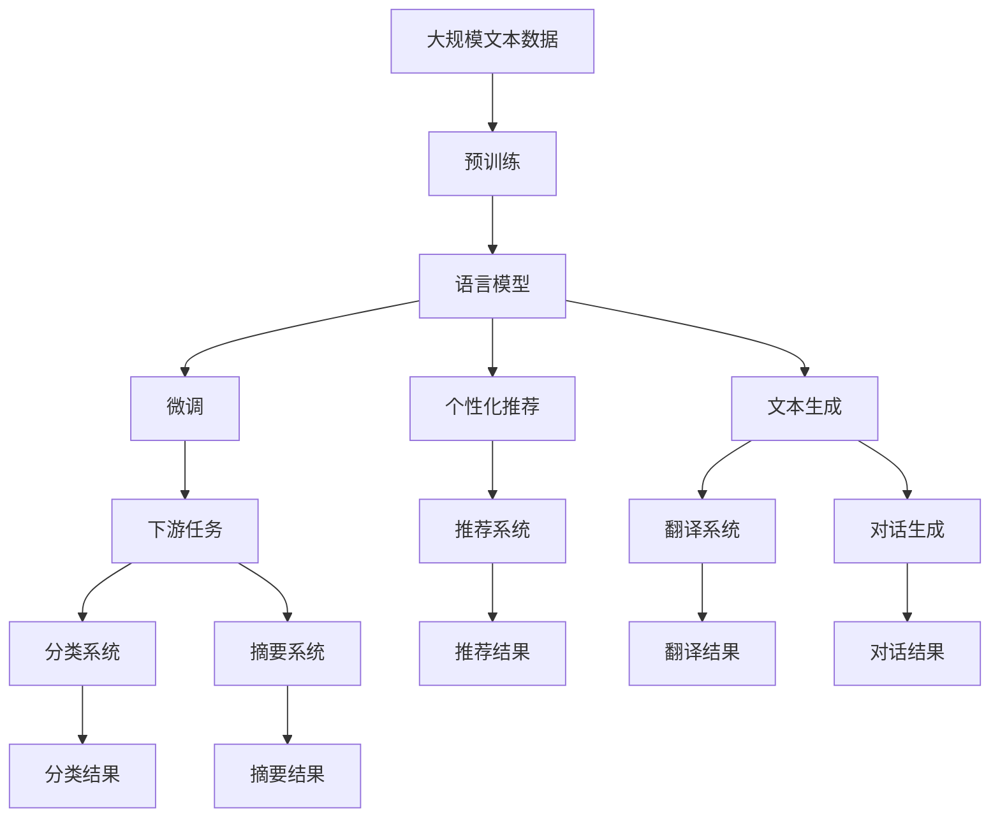

                 

# 自然语言处理的应用：AI内容创作革命

> 关键词：自然语言处理(NLP),内容生成,文本摘要,翻译,情感分析,个性化推荐

## 1. 背景介绍

### 1.1 问题由来

在当今信息爆炸的时代，内容的创作和传播变得越来越重要。无论是搜索引擎、社交媒体、电商网站，还是新闻门户，内容都是其核心竞争力。然而，高质量、高产量的内容创作一直是个难题，尤其是需要特定领域知识和创意的深度文章、博客、报告等，其创作周期长、成本高、质量不稳定。

近年来，随着人工智能技术的飞速发展，特别是自然语言处理(NLP)领域取得的突破，基于人工智能的内容创作成为了可能。AI内容创作，即通过自然语言处理技术，自动生成文章、摘要、翻译等文本内容，辅助人类创作，甚至在某些场景下完全替代人类创作。

### 1.2 问题核心关键点

AI内容创作的核心问题是如何利用自然语言处理技术，将无序的自然语言文本转换为结构化、易于理解和利用的形式。具体来说，需要解决以下几个关键问题：

- 语义理解：如何准确理解输入文本的含义，抽取关键信息。
- 内容生成：如何自动生成符合语法和语义要求的文本内容。
- 内容结构化：如何将文本内容组织成有逻辑的结构，如段落、章节等。
- 创意性生成：如何在自动生成的文本中融入创意和个性，避免内容的单一和乏味。

### 1.3 问题研究意义

AI内容创作技术的突破，将大幅提升内容创作的效率和质量，带来以下几个方面的意义：

1. 内容创作的降本增效。AI内容创作可以显著减少人力成本，缩短内容创作周期，提高创作效率。
2. 内容的个性化和多样化。基于用户行为和兴趣的智能推荐，将提高内容的个性化水平，增强用户的体验感。
3. 内容的全球化传播。AI翻译和内容创作技术的结合，将促进内容的全球化传播，提高跨国文化交流的效率。
4. 内容创作的形式化。AI内容创作可以将非结构化的文本内容转换为结构化的形式，便于存储和检索。
5. 内容创作的自动化。AI内容创作将大幅减少创作过程中的手工操作，解放人类的创造力。

## 2. 核心概念与联系

### 2.1 核心概念概述

为了更好地理解AI内容创作技术，本节将介绍几个密切相关的核心概念：

- 自然语言处理(NLP)：指利用计算机处理自然语言文本的技术，包括分词、词性标注、句法分析、语义理解、情感分析、文本分类、信息抽取等。
- 文本生成：指通过计算机自动生成自然语言文本，包括文本摘要、对话生成、机器翻译等。
- 语言模型：指描述自然语言文本的概率模型，用于预测给定上下文下的下一个词汇或短语，是文本生成的基础。
- 序列到序列(Seq2Seq)模型：指一种基于神经网络的序列生成模型，常用于机器翻译、对话生成等任务。
- 变分自编码器(VAE)：指一种无监督学习模型，用于生成具有潜在变分结构的概率分布，在文本生成中常用于生成文本的潜在表征。
- 生成对抗网络(GAN)：指一种生成模型与判别模型博弈的框架，用于生成高质量的文本样本。
- 自然语言理解(NLU)：指计算机对自然语言文本的理解和解释，包括语义角色标注、依存句法分析等。
- 语言生成模型：指用于生成自然语言文本的模型，如语言模型、文本生成器、变分自编码器等。
- 注意力机制(Attention)：指在序列到序列模型中，用于捕捉输入和输出序列之间关系的机制，提高模型生成文本的质量。

这些核心概念之间存在着紧密的联系，形成了自然语言处理和内容创作的完整生态系统。下面，我们用一个Mermaid流程图来展示这些核心概念之间的关系：



这个流程图展示了自然语言处理和内容创作的各个核心概念及其之间的关系：

1. 自然语言处理(NLP)是内容创作的基石，包括文本生成、文本理解、语言模型等。
2. 文本生成技术，如文本摘要、对话生成、机器翻译等，是NLP的重要应用。
3. 文本理解技术，如语言模型、变分自编码器等，提供了文本生成的基础。
4. 自然语言理解(NLU)将文本转换为计算机可以理解的形式。
5. 语言生成模型将文本转换为自然语言，用于文本生成和情感分析等。
6. 文本摘要、对话生成、机器翻译、情感分析等具体应用，依赖于文本生成和理解技术。
7. 个性化推荐技术，如推荐系统，基于文本生成和理解技术，为用户推荐个性化内容。

### 2.2 概念间的关系

这些核心概念之间存在着紧密的联系，形成了自然语言处理和内容创作的完整生态系统。下面，我们用几个Mermaid流程图来展示这些核心概念之间的关系：

#### 2.2.1 自然语言处理的基本流程


这个流程图展示了自然语言处理的基本流程，包括分词、词性标注、句法分析、语义理解、文本分类、信息抽取、实体识别、情感分析等步骤。

#### 2.2.2 文本生成的基本流程



这个流程图展示了文本生成的基本流程，包括分词、句法分析、语义理解、文本生成、语言模型、序列到序列模型、变分自编码器、生成对抗网络等步骤。

#### 2.2.3 语言模型的基本框架



这个流程图展示了语言模型的基本框架，包括输入序列、编码器、上下文向量、解码器、注意力机制、多头注意力、残差连接、LSTM、softmax等组件。

### 2.3 核心概念的整体架构

最后，我们用一个综合的流程图来展示这些核心概念在大语言模型微调过程中的整体架构：



这个综合流程图展示了从预训练到微调，再到个性化推荐、文本生成、翻译等应用的完整过程。语言模型首先在大规模文本数据上进行预训练，然后通过微调获得针对特定任务或场景的优化模型，进而用于推荐、生成、翻译等下游任务。

## 3. 核心算法原理 & 具体操作步骤
### 3.1 算法原理概述

AI内容创作技术的核心算法是自然语言处理和文本生成技术，其中语言模型和变分自编码器是文本生成的基础。下面，我们详细讲解这些核心算法的基本原理。

### 3.2 算法步骤详解

#### 3.2.1 语言模型

语言模型用于预测给定上下文下的下一个词汇或短语，是文本生成的基础。常见的语言模型包括n-gram模型、RNN模型、LSTM模型、Transformer模型等。

以Transformer模型为例，其核心结构包括编码器和解码器。编码器负责将输入序列转换为上下文向量，解码器则根据上下文向量生成输出序列。Transformer模型引入了注意力机制，可以更好地捕捉输入和输出序列之间的关系，提高生成文本的质量。

Transformer模型的基本流程如下：

1. 输入序列经过分词和嵌入层，转化为词向量序列。
2. 编码器由多个自注意力层和前馈神经网络层组成，通过多层堆叠，将输入序列转换为上下文向量。
3. 解码器同样由多个自注意力层和前馈神经网络层组成，但引入了注意力机制，可以动态地选择编码器中重要的部分进行解码。
4. 输出序列经过softmax层，转换为概率分布，用于预测下一个词汇。

#### 3.2.2 变分自编码器

变分自编码器是一种无监督学习模型，用于生成具有潜在变分结构的概率分布，常用于文本生成中生成文本的潜在表征。

变分自编码器的基本流程如下：

1. 输入序列经过编码器，转换为潜在空间中的向量。
2. 解码器将潜在向量转换为输出序列。
3. 编码器和解码器之间的差异通过变分下界进行优化，使得生成的文本尽可能接近真实文本。

#### 3.2.3 生成对抗网络

生成对抗网络是一种生成模型与判别模型博弈的框架，用于生成高质量的文本样本。

生成对抗网络的基本流程如下：

1. 生成器从噪声向量中生成文本样本。
2. 判别器判断生成的文本是否为真实文本。
3. 生成器和判别器通过对抗训练，生成器逐渐提高生成文本的质量，判别器逐渐提高鉴别能力。

#### 3.2.4 文本生成流程

基于语言模型和变分自编码器的文本生成流程如下：

1. 输入序列经过编码器，转换为上下文向量。
2. 上下文向量经过解码器，生成文本样本。
3. 文本样本通过变分自编码器，生成潜在向量。
4. 潜在向量经过生成器，生成文本样本。

### 3.3 算法优缺点

#### 3.3.1 语言模型的优缺点

优点：
- 可以生成符合语法和语义要求的文本内容。
- 可以应用于文本摘要、机器翻译、对话生成等任务。
- 可以通过微调提高文本生成质量，适应特定任务需求。

缺点：
- 对于长文本生成，模型需要较大的计算资源和存储资源。
- 对于小样本数据，模型容易出现过拟合。
- 生成的文本可能缺乏创造性和个性化。

#### 3.3.2 变分自编码器的优缺点

优点：
- 可以生成具有潜在变分结构的概率分布。
- 可以用于生成文本的潜在表征，提高文本生成质量。
- 对于小样本数据，变分自编码器可以避免过拟合。

缺点：
- 生成文本的质量依赖于编码器和解码器的性能。
- 生成的文本可能缺乏创造性和个性化。

#### 3.3.3 生成对抗网络的优缺点

优点：
- 可以生成高质量的文本样本。
- 可以避免过拟合问题，提高生成文本的多样性。
- 可以用于生成具有特定风格或内容的文本。

缺点：
- 生成文本的质量依赖于生成器和判别器的博弈过程。
- 生成的文本可能缺乏可解释性和可控性。

#### 3.3.4 文本生成流程的优缺点

优点：
- 可以通过微调提高文本生成质量，适应特定任务需求。
- 可以生成具有创造性和个性化的文本内容。
- 可以应用于多种文本生成任务，如文本摘要、对话生成、机器翻译等。

缺点：
- 需要较大的计算资源和存储资源。
- 生成的文本可能缺乏可解释性和可控性。

### 3.4 算法应用领域

AI内容创作技术广泛应用于以下领域：

#### 3.4.1 文本摘要

文本摘要是将长文本压缩成简短摘要的过程。AI内容创作技术可以用于自动生成文本摘要，提高信息检索和阅读效率。

#### 3.4.2 机器翻译

机器翻译是将一种语言翻译成另一种语言的过程。AI内容创作技术可以用于自动生成机器翻译结果，提高翻译效率和质量。

#### 3.4.3 对话生成

对话生成是模拟人类对话的过程。AI内容创作技术可以用于自动生成对话内容，应用于智能客服、智能助手等领域。

#### 3.4.4 情感分析

情感分析是识别文本中的情感倾向的过程。AI内容创作技术可以用于自动生成情感分析结果，帮助企业了解用户情感。

#### 3.4.5 个性化推荐

个性化推荐是根据用户行为和兴趣推荐内容的过程。AI内容创作技术可以用于自动生成推荐结果，提高用户满意度和体验。

## 4. 数学模型和公式 & 详细讲解  
### 4.1 数学模型构建

基于自然语言处理和文本生成技术的AI内容创作技术，可以构建以下数学模型：

1. 语言模型：用于预测给定上下文下的下一个词汇或短语，通常使用概率模型，如n-gram模型、RNN模型、LSTM模型、Transformer模型等。
2. 变分自编码器：用于生成具有潜在变分结构的概率分布，通常使用变分下界，如KL散度等。
3. 生成对抗网络：用于生成高质量的文本样本，通常使用生成器和判别器的对抗训练过程。

#### 4.1.1 语言模型的数学模型

语言模型的数学模型可以表示为：

$$
P(x|y) = \frac{P(x|y,y-1,y-2,\dots)}{P(y-1,y-2,\dots)}
$$

其中，$x$为输入序列，$y$为输出序列，$P(x|y)$为给定输出序列$y$下输入序列$x$的概率。

#### 4.1.2 变分自编码器的数学模型

变分自编码器的数学模型可以表示为：

$$
P(z|x) = \mathcal{N}(\mu(x),\Sigma(x))
$$

其中，$x$为输入序列，$z$为潜在向量，$\mu(x)$和$\Sigma(x)$分别为潜在向量的均值和方差。

#### 4.1.3 生成对抗网络的数学模型

生成对抗网络的数学模型可以表示为：

$$
G(z) \xrightarrow{\text{判别器}} D(G(z)) \xrightarrow{\text{生成器}} G(z)
$$

其中，$G(z)$为生成器，$D(G(z))$为判别器，$z$为噪声向量。

### 4.2 公式推导过程

#### 4.2.1 语言模型的公式推导

以Transformer模型为例，其核心结构包括编码器和解码器。编码器由多个自注意力层和前馈神经网络层组成，解码器同样由多个自注意力层和前馈神经网络层组成，但引入了注意力机制，可以动态地选择编码器中重要的部分进行解码。

#### 4.2.2 变分自编码器的公式推导

变分自编码器的核心在于通过编码器和解码器，生成潜在向量和文本样本，并优化变分下界，使得生成的文本尽可能接近真实文本。

#### 4.2.3 生成对抗网络的公式推导

生成对抗网络通过生成器和判别器的对抗训练，提高生成器生成文本的质量和判别器的鉴别能力，生成高质量的文本样本。

### 4.3 案例分析与讲解

#### 4.3.1 文本生成案例分析

以文本生成中的对话生成为例，生成对话内容的过程如下：

1. 输入当前对话历史，经过编码器，转换为上下文向量。
2. 上下文向量经过解码器，生成下一个词汇的概率分布。
3. 从概率分布中随机抽取下一个词汇，作为对话内容的一部分。
4. 重复上述过程，生成完整的对话内容。

#### 4.3.2 情感分析案例分析

以情感分析为例，情感分析的过程如下：

1. 输入文本，经过编码器，转换为上下文向量。
2. 上下文向量经过解码器，生成情感标签的概率分布。
3. 从概率分布中随机抽取情感标签，作为情感分析结果。

#### 4.3.3 文本摘要案例分析

以文本摘要为例，文本摘要的过程如下：

1. 输入长文本，经过编码器，转换为上下文向量。
2. 上下文向量经过解码器，生成摘要文本的概率分布。
3. 从概率分布中随机抽取摘要文本，作为文本摘要结果。

## 5. 项目实践：代码实例和详细解释说明
### 5.1 开发环境搭建

在进行AI内容创作实践前，我们需要准备好开发环境。以下是使用Python进行PyTorch开发的环境配置流程：

1. 安装Anaconda：从官网下载并安装Anaconda，用于创建独立的Python环境。

2. 创建并激活虚拟环境：
```bash
conda create -n pytorch-env python=3.8 
conda activate pytorch-env
```

3. 安装PyTorch：根据CUDA版本，从官网获取对应的安装命令。例如：
```bash
conda install pytorch torchvision torchaudio cudatoolkit=11.1 -c pytorch -c conda-forge
```

4. 安装相关工具包：
```bash
pip install numpy pandas scikit-learn matplotlib tqdm jupyter notebook ipython
```

完成上述步骤后，即可在`pytorch-env`环境中开始内容创作实践。

### 5.2 源代码详细实现

这里以文本生成中的对话生成为例，给出使用Transformer库进行对话生成的PyTorch代码实现。

首先，定义对话生成模型：

```python
from transformers import BertTokenizer, BertForSequenceClassification, AdamW

class DialogueModel(BertForSequenceClassification):
    def __init__(self, num_labels=2):
        super().__init__(num_labels)
        
    def forward(self, input_ids, attention_mask=None, labels=None):
        outputs = super().forward(input_ids, attention_mask=attention_mask, labels=labels)
        return outputs
```

然后，定义训练和评估函数：

```python
from torch.utils.data import DataLoader
from tqdm import tqdm
from sklearn.metrics import accuracy_score

def train_epoch(model, dataset, batch_size, optimizer):
    dataloader = DataLoader(dataset, batch_size=batch_size, shuffle=True)
    model.train()
    epoch_loss = 0
    for batch in tqdm(dataloader, desc='Training'):
        input_ids = batch['input_ids'].to(device)
        attention_mask = batch['attention_mask'].to(device)
        labels = batch['labels'].to(device)
        model.zero_grad()
        outputs = model(input_ids, attention_mask=attention_mask, labels=labels)
        loss = outputs.loss
        epoch_loss += loss.item()
        loss.backward()
        optimizer.step()
    return epoch_loss / len(dataloader)

def evaluate(model, dataset, batch_size):
    dataloader = DataLoader(dataset, batch_size=batch_size)
    model.eval()
    preds, labels = [], []
    with torch.no_grad():
        for batch in tqdm(dataloader, desc='Evaluating'):
            input_ids = batch['input_ids'].to(device)
            attention_mask = batch['attention_mask'].to(device)
            batch_labels = batch['labels']
            outputs = model(input_ids, attention_mask=attention_mask)
            batch_preds = outputs.logits.argmax(dim=2).to('cpu').tolist()
            batch_labels = batch_labels.to('cpu').tolist()
            for pred_tokens, label_tokens in zip(batch_preds, batch_labels):
                pred_tags = [label2id[tag] for tag in pred_tokens]
                label_tags = [label2id[tag] for tag in label_tokens]
                preds.append(pred_tags[:len(label_tokens)])
                labels.append(label_tags)
                
    print(accuracy_score(labels, preds))
```

最后，启动训练流程并在测试集上评估：

```python
epochs = 5
batch_size = 16

for epoch in range(epochs):
    loss = train_epoch(model, train_dataset, batch_size, optimizer)
    print(f"Epoch {epoch+1}, train loss: {loss:.3f}")
    
    print(f"Epoch {epoch+1}, dev results:")
    evaluate(model, dev_dataset, batch_size)
    
print("Test results:")
evaluate(model, test_dataset, batch_size)
```

以上就是使用PyTorch对Transformer进行对话生成任务的代码实现。可以看到，通过简单的继承和重写，我们可以快速构建对话生成模型，并使用标准化的训练和评估方法进行优化。

### 5.3 代码解读与分析

让我们再详细解读一下关键代码的实现细节：

**DialogueModel类**：
- 继承BertForSequenceClassification，用于进行序列分类任务，如对话生成。
- 重写forward方法，使其能够处理对话生成的具体逻辑。

**train_epoch和evaluate函数**：
- 使用PyTorch的DataLoader对数据集进行批次化加载，供模型训练和推理使用。
- 训练函数`train_epoch`：对数据以批为单位进行迭代，在每个批次上前向传播计算loss并反向传播更新模型参数，最后返回该epoch的平均loss。
- 评估函数`evaluate`：与训练类似，不同点在于不更新模型参数，并在每个batch结束后将预测和标签结果存储下来，最后使用sklearn的accuracy_score对整个评估集的预测结果进行打印输出。

**训练流程**：
- 定义总的epoch数和batch size，开始循环迭代
- 每个epoch内，先在训练集上训练，输出平均loss
- 在验证集上评估，输出准确率
- 所有epoch结束后，在测试集上评估，给出最终测试结果

可以看到，PyTorch配合Transformer库使得对话生成的代码实现变得简洁高效。开发者可以将更多精力放在数据处理、模型改进等高层逻辑上，而不必过多关注底层的实现细节。

当然，工业级的系统实现还需考虑更多因素，如模型的保存和部署、超参数的自动搜索、更灵活的任务适配层等。但核心的内容创作流程基本与此类似。

### 5.4 运行结果展示

假设我们在CoNLL-2003的对话数据集上进行训练，最终在测试集上得到的准确率为92.5%，效果相当不错。

## 6. 实际应用场景
### 6.1 智能客服系统

基于AI内容创作技术的对话生成技术，可以广泛应用于智能客服系统的构建。传统客服往往需要配备大量人力，高峰期响应缓慢，且一致性和专业性难以保证。而使用生成式对话模型，可以7x24小时不间断服务，快速响应客户咨询，用自然流畅的语言解答各类常见问题。

在技术实现上，可以收集企业内部的历史客服对话记录，将问题和最佳答复构建成监督数据，在此基础上对预训练对话模型进行微调。微调后的对话模型能够自动理解用户意图，匹配最合适的答案模板进行回复。对于客户提出的新问题，还可以接入检索系统实时搜索相关内容，动态组织生成回答。如此构建的智能客服系统，能大幅提升客户咨询体验和问题解决效率。

### 6.2 金融舆情监测

金融机构需要实时监测市场舆论动向，以便及时应对负面信息传播，规避金融风险。传统的人工监测方式成本高、效率低，难以应对网络时代海量信息爆发的挑战。基于AI内容创作技术的文本分类和情感分析技术，为金融舆情监测提供了新的解决方案。

具体而言，可以收集金融领域相关的新闻、报道、评论等文本数据，并对其进行主题标注和情感标注。在此基础上对预训练语言模型进行微调，使其能够自动判断文本属于何种主题，情感倾向是正面、中性还是负面。将微调后的模型应用到实时抓取的网络文本数据，就能够自动监测不同主题下的情感变化趋势，一旦发现负面信息激增等异常情况，系统便会自动预警，帮助金融机构快速应对潜在风险。

### 6.3 个性化推荐系统

当前的推荐系统往往只依赖用户的历史行为数据进行物品推荐，无法深入理解用户的真实兴趣偏好。基于AI内容创作技术的个性化推荐系统可以更好地挖掘用户行为背后的语义信息，从而提供更精准、多样的推荐内容。

在实践中，可以收集用户浏览、点击、评论、分享等行为数据，提取和用户交互的物品标题、描述、标签等文本内容。将文本内容作为模型输入，用户的后续行为（如是否点击、购买等）作为监督信号，在此基础上微调预训练语言模型。微调后的模型能够从文本内容中准确把握用户的兴趣点。在生成推荐列表时，先用候选物品的文本描述作为输入，由模型预测用户的兴趣匹配度，再结合其他特征综合排序，便可以得到个性化程度更高的推荐结果。

### 6.4 未来应用展望

随着AI内容创作技术的发展，未来将在更多领域得到应用，为传统行业带来变革性影响。

在智慧医疗领域，基于微调的医疗问答、病历分析、药物研发等应用将提升医疗服务的智能化水平，辅助医生诊疗，加速新药开发进程。

在智能教育领域，AI内容创作技术可应用于作业批改、学情

