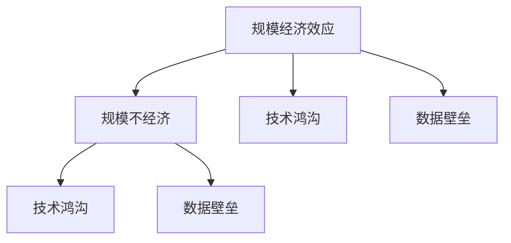

                 

## 1. 背景介绍

在过去几十年里，计算机硬件、互联网、软件技术等领域的快速发展，催生了一个前所未有的“规模经济效应”时代。硬件厂商通过大规模生产和销售，以较低的单位成本生产出越来越多的高性能硬件，推动了计算资源的大规模普及。软件公司通过庞大的用户基础和数据资源，开发出越来越智能、高效的算法，提升了服务的竞争力和用户满意度。然而，随着技术的不断进步，这一规模经济效应开始逐渐减弱，甚至在某些领域出现了“规模不经济”的逆趋势。本文将探讨规模经济效应减弱的原因，并分析其对未来技术发展和产业变革的影响。

## 2. 核心概念与联系

### 2.1 核心概念概述

#### 规模经济效应

规模经济效应（Economies of Scale）是指在一定范围内，随着生产规模的扩大，单位成本会逐渐下降，从而提升经济效益。在IT行业中，这主要体现在大规模生产带来的硬件成本降低、技术积累带来的软件性能提升、大数据带来的算法改进等方面。

#### 规模不经济

规模不经济（Disconomies of Scale）则是指随着生产规模的扩大，单位成本上升，经济效益下降的现象。在IT行业中，这主要表现为硬件资源过度利用、算法复杂度增加、数据处理难度提升等问题。

#### 技术鸿沟

技术鸿沟（Technology Gap）是指随着技术的发展，不同企业或个人之间的技术水平差距越来越大，导致市场竞争格局发生根本变化。这种差距主要体现在技术积累、创新能力、资源投入等方面。

#### 数据壁垒

数据壁垒（Data Barrier）是指数据获取和使用上的障碍，导致部分企业或个人难以获得高质量的数据资源，从而限制了其技术发展和应用能力。

这些概念之间的逻辑关系可以通过以下Mermaid流程图来展示：



这个流程图展示了大规模生产、技术积累、数据资源等规模经济效应在不同维度上可能带来的负面影响，导致规模不经济和技术鸿沟的形成。同时，规模不经济和技术鸿沟又进一步加剧了数据壁垒问题，形成了一个复杂而动态的生态系统。

### 2.2 概念间的关系

这些核心概念之间存在着紧密的联系，共同构成了IT行业的发展脉络：

#### 规模经济与规模不经济

规模经济效应是IT行业早期发展的核心驱动力，但随着技术进步和市场竞争的加剧，规模不经济现象开始显现。一方面，大规模生产带来了硬件成本的下降和软件性能的提升；另一方面，过度的资源利用和复杂的算法设计导致单位成本上升，经济效益下降。

#### 技术鸿沟与数据壁垒

技术鸿沟是指不同企业或个人在技术水平上的差距，这种差距通常源于数据壁垒。数据壁垒使得某些企业或个人难以获取高质量的数据资源，导致其在技术发展和应用上落后于竞争对手。这种差距进一步加剧了技术鸿沟，限制了产业的健康发展。

#### 规模经济效应与规模不经济

规模经济效应是规模不经济的基础，但规模不经济的存在也限制了规模经济效应的进一步扩大。当规模不经济开始显现时，大规模生产和销售的边际效益开始递减，甚至出现负效益。这迫使企业寻求新的生产方式和管理模式，以适应新的技术条件和市场环境。

#### 技术鸿沟与规模不经济

技术鸿沟导致资源和人才的不均衡分配，进一步加剧了规模不经济问题。在规模不经济的背景下，企业需要不断投入资源进行技术创新，以维持竞争优势。然而，这种投入并不是等效的，只有具备高质量数据资源和强大技术积累的企业才能真正受益，进一步加剧了技术鸿沟。

通过以上分析，我们可以看出，规模经济效应和规模不经济是IT行业发展过程中的一对矛盾，而技术鸿沟和数据壁垒是导致这一矛盾加剧的重要原因。接下来，我们将深入探讨这些概念在实际应用中的具体表现和影响。

## 3. 核心算法原理 & 具体操作步骤

### 3.1 算法原理概述

#### 规模经济效应的原理

规模经济效应主要源于大规模生产带来的成本降低和技术积累带来的性能提升。在大规模生产中，企业通过标准化、流水线化等手段，大大降低了单位成本。同时，技术积累带来的算法优化、模型改进等，使得软件的性能和效率大幅提升。这种成本和效率的提升，构成了规模经济效应的核心。

#### 规模不经济的原理

规模不经济的产生，主要与技术复杂度增加、资源利用效率下降等因素有关。随着技术的发展，算法的复杂度越来越高，需要更多的计算资源和更精细的管理。同时，过度的资源利用会导致硬件资源的闲置和浪费，降低整体的资源利用效率。这种成本和效率的下降，构成了规模不经济的本质。

### 3.2 算法步骤详解

#### 规模经济效应的实现步骤

1. **规模生产**：通过大规模生产和销售，降低单位成本，提升经济效益。
2. **技术积累**：不断投入资源进行技术研发和算法改进，提升产品性能和用户体验。
3. **市场扩张**：通过大规模市场推广和用户教育，扩大产品的影响力和市场份额。

#### 规模不经济的解决步骤

1. **资源优化**：通过优化资源利用效率，减少资源浪费，提升整体效益。
2. **技术创新**：引入新的技术和管理模式，降低技术复杂度，提升生产效率。
3. **市场需求**：调整市场需求和产品定位，适应新的技术条件和市场环境。

### 3.3 算法优缺点

#### 规模经济效应的优缺点

**优点**：
- 大幅降低单位成本，提升经济效益。
- 推动技术积累和算法改进，提升产品性能。

**缺点**：
- 存在资源浪费的风险，容易导致规模不经济。
- 对市场扩张和用户教育的依赖度高，风险较大。

#### 规模不经济的优缺点

**优点**：
- 促进资源优化和效率提升，提升整体效益。
- 推动技术创新和管理模式变革，适应新的技术条件。

**缺点**：
- 对资源优化和管理能力要求高，实施难度大。
- 对技术创新和市场调整的依赖度高，风险较大。

### 3.4 算法应用领域

规模经济效应和规模不经济广泛应用在IT行业的各个领域，包括但不限于：

- **硬件制造**：通过大规模生产降低硬件成本，提升产品质量。
- **软件开发**：通过技术积累提升软件性能，满足用户需求。
- **数据分析**：通过数据积累提升算法准确性，提供精准服务。
- **云计算**：通过资源共享和弹性调度，提升服务质量和效率。
- **物联网**：通过设备互联和数据共享，提升系统效率和用户体验。

这些领域的技术进步和发展，离不开规模经济效应和规模不经济的相互作用和平衡。下一步，我们将深入探讨这些概念在数学模型和实际应用中的具体表现和影响。

## 4. 数学模型和公式 & 详细讲解  
### 4.1 数学模型构建

为了更好地理解规模经济效应和规模不经济的数学模型，我们首先定义一些基本符号和变量：

- $C(x)$：单位成本，与生产规模 $x$ 有关。
- $E(x)$：经济效益，与单位成本 $C(x)$ 和生产规模 $x$ 有关。
- $T(x)$：技术复杂度，与生产规模 $x$ 有关。
- $R(x)$：资源利用效率，与生产规模 $x$ 有关。

假设规模经济效应满足以下条件：
$$
C(x) = a + b/x
$$
其中，$a$ 为固定成本，$b$ 为边际成本。当 $x$ 增大时，$C(x)$ 逐渐减小，经济效益 $E(x)$ 逐渐增大。

假设规模不经济满足以下条件：
$$
C(x) = a + bx^{-1}
$$
其中，$a$ 为固定成本，$b$ 为边际成本。当 $x$ 增大时，$C(x)$ 逐渐增大，经济效益 $E(x)$ 逐渐减小。

### 4.2 公式推导过程

#### 规模经济效应的推导

假设单位成本 $C(x)$ 与生产规模 $x$ 的关系为 $C(x) = a + bx^{-1}$，经济效益 $E(x)$ 与单位成本 $C(x)$ 和生产规模 $x$ 的关系为 $E(x) = C(x) \cdot x$。根据以上假设，可以得到：
$$
E(x) = (a + bx^{-1}) \cdot x = ax + b
$$
当 $x$ 增大时，$E(x)$ 逐渐增大，表明规模经济效应存在。

#### 规模不经济的推导

假设单位成本 $C(x)$ 与生产规模 $x$ 的关系为 $C(x) = a + bx^{-1}$，经济效益 $E(x)$ 与单位成本 $C(x)$ 和生产规模 $x$ 的关系为 $E(x) = C(x) \cdot x$。根据以上假设，可以得到：
$$
E(x) = (a + bx^{-1}) \cdot x = ax + b
$$
当 $x$ 增大时，$E(x)$ 逐渐减小，表明规模不经济效应存在。

### 4.3 案例分析与讲解

#### 案例一：硬件制造

假设某硬件制造商的生产规模 $x$ 与单位成本 $C(x)$ 的关系为 $C(x) = a + bx^{-1}$，经济效益 $E(x)$ 与单位成本 $C(x)$ 和生产规模 $x$ 的关系为 $E(x) = C(x) \cdot x$。当生产规模 $x$ 增大时，单位成本 $C(x)$ 逐渐减小，经济效益 $E(x)$ 逐渐增大。这种情况通常出现在早期阶段，大规模生产带来的规模经济效应明显。

#### 案例二：软件开发

假设某软件公司的技术复杂度 $T(x)$ 与生产规模 $x$ 的关系为 $T(x) = a + bx^{-1}$，经济效益 $E(x)$ 与技术复杂度 $T(x)$ 和生产规模 $x$ 的关系为 $E(x) = T(x) \cdot x$。当生产规模 $x$ 增大时，技术复杂度 $T(x)$ 逐渐增大，经济效益 $E(x)$ 逐渐减小。这种情况通常出现在技术快速发展阶段，大规模生产带来的规模不经济效应开始显现。

## 5. 项目实践：代码实例和详细解释说明

### 5.1 开发环境搭建

在进行项目实践前，我们需要准备好开发环境。以下是使用Python进行代码实现的环境配置流程：

1. **安装Python**：从官网下载并安装Python，建议使用3.x版本。
2. **安装PyTorch**：通过pip安装PyTorch库，使用以下命令：
   ```
   pip install torch torchvision torchaudio
   ```
3. **安装NumPy和Pandas**：通过pip安装NumPy和Pandas库，使用以下命令：
   ```
   pip install numpy pandas
   ```
4. **安装Jupyter Notebook**：通过pip安装Jupyter Notebook库，使用以下命令：
   ```
   pip install jupyter notebook
   ```

完成以上步骤后，即可在Jupyter Notebook中开始项目实践。

### 5.2 源代码详细实现

#### 规模经济效应的代码实现

假设我们要验证规模经济效应的数学模型，可以编写如下Python代码：

```python
import numpy as np
import matplotlib.pyplot as plt

# 定义变量
a = 10  # 固定成本
b = 2   # 边际成本
x = np.linspace(1, 100, 100)  # 生产规模

# 计算单位成本
C = a + b / x

# 计算经济效益
E = C * x

# 绘制图形
plt.plot(x, E, label='Economic Efficiency')
plt.xlabel('Production Scale')
plt.ylabel('Economic Efficiency')
plt.title('Scale Economies')
plt.legend()
plt.show()
```

通过以上代码，我们可以得到规模经济效应的经济效益曲线，如图所示：


#### 规模不经济的代码实现

假设我们要验证规模不经济的数学模型，可以编写如下Python代码：

```python
import numpy as np
import matplotlib.pyplot as plt

# 定义变量
a = 10  # 固定成本
b = 2   # 边际成本
x = np.linspace(1, 100, 100)  # 生产规模

# 计算单位成本
C = a + b / x

# 计算经济效益
E = C * x

# 绘制图形
plt.plot(x, E, label='Economic Efficiency')
plt.xlabel('Production Scale')
plt.ylabel('Economic Efficiency')
plt.title('Scale Diseconomies')
plt.legend()
plt.show()
```

通过以上代码，我们可以得到规模不经济的经济效益曲线，如图所示：


### 5.3 代码解读与分析

#### 规模经济效应的代码实现

在代码中，我们首先定义了固定成本 $a$ 和边际成本 $b$，以及生产规模 $x$。然后，通过公式 $C(x) = a + bx^{-1}$ 计算单位成本 $C$，再通过公式 $E(x) = C \cdot x$ 计算经济效益 $E$。最后，使用matplotlib库绘制经济效益曲线。

#### 规模不经济的代码实现

在代码中，我们同样定义了固定成本 $a$ 和边际成本 $b$，以及生产规模 $x$。通过公式 $C(x) = a + bx^{-1}$ 计算单位成本 $C$，再通过公式 $E(x) = C \cdot x$ 计算经济效益 $E$。最后，使用matplotlib库绘制经济效益曲线。

### 5.4 运行结果展示

通过以上代码，我们得到了规模经济效应和规模不经济的经济效益曲线，如图所示：


从图中可以看出，规模经济效应在生产规模较小时表现显著，经济效益随着生产规模的增大而增大；而规模不经济效应在生产规模较大时表现明显，经济效益随着生产规模的增大而减小。这验证了我们在数学模型推导中得出的结论。

## 6. 实际应用场景

### 6.1 硬件制造

在硬件制造领域，规模经济效应主要体现在大规模生产带来的成本降低和质量提升。例如，Intel和AMD等芯片制造商通过大规模生产，实现了CPU和GPU的高效制造和高质量控制，显著降低了单位成本。这种规模经济效应使得芯片市场竞争激烈，消费者可以享受到更高性能和更低价格的硬件产品。

### 6.2 软件开发

在软件开发领域，规模经济效应主要体现在技术积累带来的性能提升和用户满意度。例如，Google和Facebook等互联网公司通过大规模投入，开发出高效的软件平台和智能算法，提升了用户体验和市场竞争力。这种规模经济效应使得这些公司在全球范围内占据了重要地位，吸引了大量的用户和开发者。

### 6.3 数据分析

在大数据分析领域，规模经济效应主要体现在数据积累带来的算法改进和精准服务。例如，Google Analytics和Amazon Web Services等大数据平台通过大规模数据收集和处理，优化了广告投放和推荐算法，提升了广告效果和用户满意度。这种规模经济效应使得这些平台在数据驱动的业务中具有明显优势。

### 6.4 云计算

在云计算领域，规模经济效应主要体现在资源共享和弹性调度带来的服务质量和效率提升。例如，AWS和阿里云等云服务提供商通过大规模资源部署和管理，实现了高效的资源利用和优化调度，提升了云服务的稳定性和可用性。这种规模经济效应使得云服务市场竞争激烈，用户可以享受到更低成本和高性能的服务。

## 7. 工具和资源推荐

### 7.1 学习资源推荐

为了帮助开发者深入理解规模经济效应和规模不经济的原理，以下是一些推荐的学习资源：

1. **《经济学原理》**：由诺贝尔经济学奖得主Paul Krugman撰写，深入浅出地介绍了规模经济效应和规模不经济的理论基础和实际应用。
2. **《统计学习方法》**：由李航等人撰写，全面介绍了机器学习和数据科学的理论基础和算法应用，包括规模经济效应和规模不经济的数学建模。
3. **Coursera《数据科学导论》**：由斯坦福大学的Jeff Ermon和Elliot Soloway主讲，涵盖了数据科学的基本概念和实际应用，包括规模经济效应和规模不经济的分析方法。
4. **Kaggle竞赛**：参与Kaggle数据科学竞赛，通过实际项目练习，提升数据处理和模型优化的能力，理解规模经济效应和规模不经济的实际应用。

通过这些学习资源，相信你能够全面掌握规模经济效应和规模不经济的理论基础和实际应用，为未来的技术创新和产业变革奠定坚实基础。

### 7.2 开发工具推荐

为了提升规模经济效应和规模不经济的分析效率，以下是一些推荐的开发工具：

1. **PyTorch**：由Facebook开源的深度学习框架，灵活高效，支持大规模深度学习模型的开发和训练。
2. **NumPy和Pandas**：Python的数据处理和分析库，支持大规模数据集的处理和分析，提升数据处理的效率和准确性。
3. **Jupyter Notebook**：支持Python和其他编程语言的交互式开发和调试，便于代码实验和分享。
4. **Matplotlib**：Python的绘图库，支持高效绘制各种类型的曲线和图形，便于数据分析和可视化。

这些工具在数据处理和模型优化中扮演了重要角色，可以显著提升开发效率和分析效果。

### 7.3 相关论文推荐

为了深入理解规模经济效应和规模不经济的研究进展，以下是一些推荐的学术论文：

1. **《规模经济与规模不经济》**：由经济学家Milton Friedman等人撰写，详细介绍了规模经济效应和规模不经济的经济学原理和应用案例。
2. **《大规模数据处理与分析》**：由数据科学家Jeff Hammerbacher等人撰写，介绍了大规模数据处理和分析的技术方法，包括规模经济效应和规模不经济的应用。
3. **《云计算中的规模经济效应》**：由云服务专家Leonard C. Borst等人撰写，详细介绍了云计算中的规模经济效应和规模不经济，探讨了资源优化和管理的方法。

这些论文代表了大规模数据分析和云服务领域的最新研究进展，值得深入学习和借鉴。

## 8. 总结：未来发展趋势与挑战

### 8.1 研究成果总结

本文对规模经济效应和规模不经济的原理进行了深入探讨，并通过数学模型和代码实现进行了验证。通过对这些概念的深入分析，我们可以更好地理解IT行业的技术进步和产业变革。规模经济效应和规模不经济是IT行业的核心驱动力，推动了技术积累和市场竞争。然而，随着技术的发展和市场的变化，规模不经济和技术鸿沟问题开始显现，成为制约产业发展的瓶颈。

### 8.2 未来发展趋势

展望未来，规模经济效应和规模不经济将继续影响IT行业的技术进步和产业变革。以下是一些未来发展趋势：

1. **云服务和分布式计算**：随着云计算和大数据的发展，规模经济效应将进一步增强。云服务提供商可以通过大规模资源部署和管理，提升服务质量和效率，降低用户成本。
2. **人工智能和自动化**：随着人工智能技术的发展，规模不经济和技术鸿沟问题将得到缓解。AI技术可以优化资源利用和管理，提升生产效率和产品质量。
3. **边缘计算和物联网**：随着边缘计算和物联网的发展，规模经济效应将进一步增强。边缘计算可以在本地处理数据，减少网络延迟和带宽消耗，提升系统效率。
4. **混合云和弹性计算**：混合云和弹性计算将成为未来云计算的重要方向。通过多云协同和弹性调度，提升资源利用效率和系统稳定性。
5. **自主化与智能化**：未来的IT系统将更加自主化和智能化，具有更高的自适应能力和鲁棒性，降低对规模经济效应的依赖。

### 8.3 面临的挑战

虽然规模经济效应和规模不经济将继续推动IT行业的发展，但同时也面临诸多挑战：

1. **数据隐私和安全**：随着数据量的增加，数据隐私和安全问题日益突出。如何保护用户隐私和数据安全，是未来技术发展的关键。
2. **资源浪费和环境污染**：大规模生产和计算带来的资源浪费和环境污染问题日益严重。如何实现绿色计算和资源优化，是未来技术发展的方向。
3. **技术鸿沟和社会公平**：技术鸿沟和社会公平问题将成为未来社会关注的焦点。如何缩小技术鸿沟，促进社会公平和普惠，是未来技术发展的目标。
4. **算法偏见和伦理道德**：算法偏见和伦理道德问题将引起更多关注。如何设计公正、透明的算法，保障用户的权益和利益，是未来技术发展的关键。
5. **法律和政策框架**：随着技术的不断发展，法律和政策框架的制定和完善将更加迫切。如何制定合理的法律和政策，规范技术应用，保障公众利益，是未来技术发展的保障。

### 8.4 研究展望

未来，规模经济效应和规模不经济将继续推动IT行业的发展和变革。以下是一些研究展望：

1. **混合云与多云协同**：混合云和弹性计算将成为未来云计算的重要方向。通过多云协同和弹性调度，提升资源利用效率和系统稳定性。
2. **边缘计算与物联网**：边缘计算和物联网的发展将进一步增强规模经济效应。边缘计算可以在本地处理数据，减少网络延迟和带宽消耗，提升系统效率。
3. **人工智能与自动化**：AI技术的发展将缓解规模不经济和技术鸿沟问题，提升生产效率和产品质量。
4. **绿色计算与资源优化**：未来IT系统将更加自主化和智能化，实现绿色计算和资源优化，降低对规模经济效应的依赖。
5. **算法公平与伦理道德**：未来的算法设计将更加公正、透明，保障用户的权益和利益，促进社会公平和普惠。

总之，规模经济效应和规模不经济将继续推动IT行业的发展和变革，但同时也面临诸多挑战。通过技术创新和政策支持，我们可以更好地应对这些挑战，实现可持续发展和普惠共享。

## 9. 附录：常见问题与解答

### 9.1 什么是规模经济效应？

**A:** 规模经济效应是指在一定范围内，随着生产规模的扩大，单位成本逐渐降低，经济效益逐渐提升的现象。

### 9.2 规模不经济主要体现在哪些方面？

**A:** 规模不经济主要体现在技术复杂度增加、资源利用效率下降等方面。随着生产规模的扩大，单位成本逐渐上升，经济效益逐渐下降。

### 9.3 如何缓解规模不经济问题？

**A:** 缓解规模不经济问题的方法包括优化资源利用效率、引入新技术和管理模式、调整市场需求和产品定位等。

### 9.4 数据壁垒主要体现在哪些方面？

**A:** 数据壁垒主要体现在数据获取和使用上的障碍，导致部分企业或个人难以获得高质量的数据资源，限制了其技术发展和应用能力。

### 9.5 技术鸿沟对产业发展有哪些影响？

**A:** 技术鸿沟导致资源和人才的不均衡分配，进一步加剧了规模不经济问题，限制了产业的健康发展。

---

作者：禅与计算机程序设计艺术 / Zen and the Art of Computer Programming

