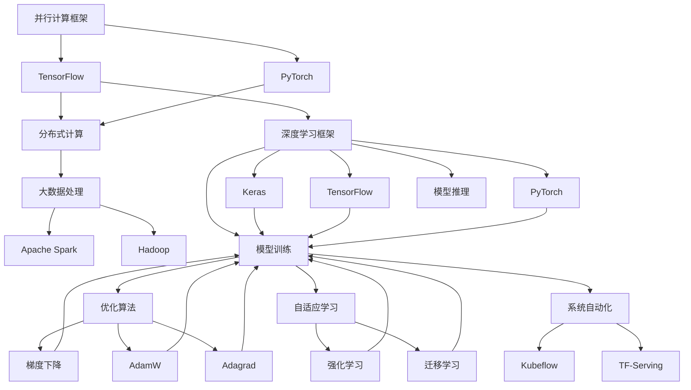
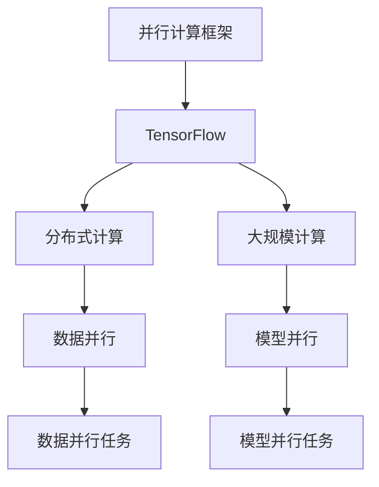
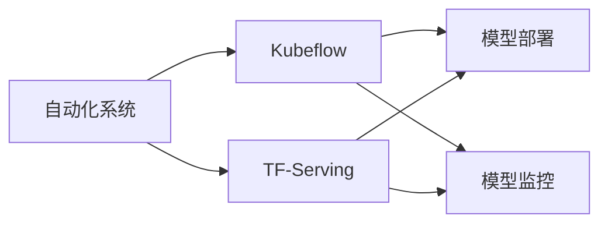
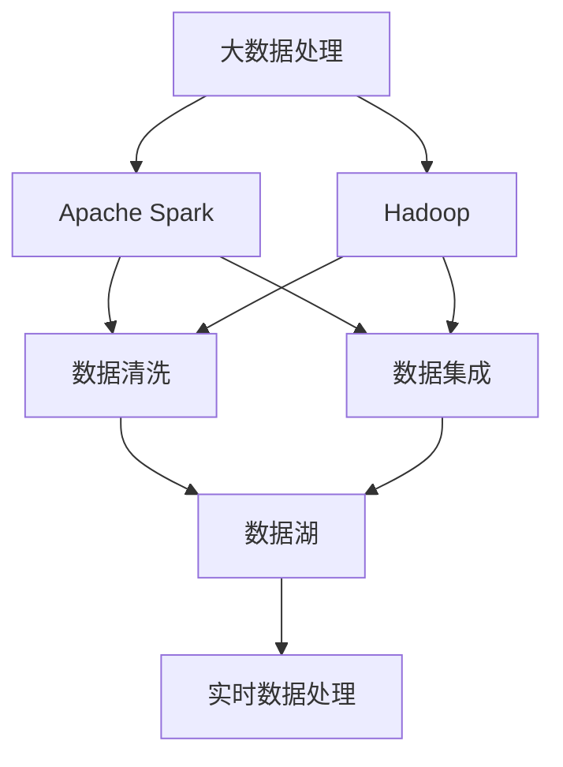
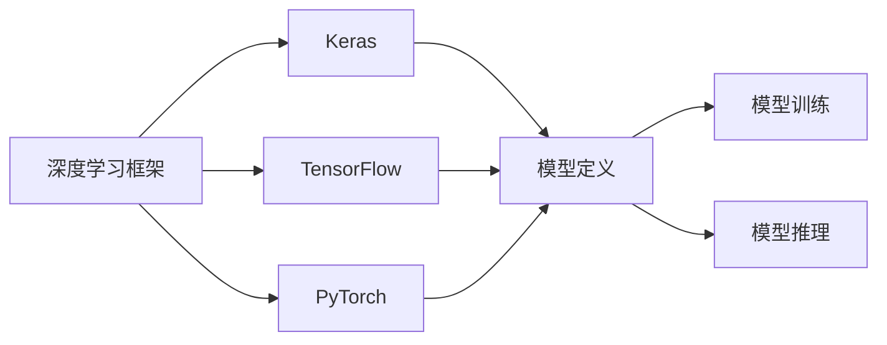
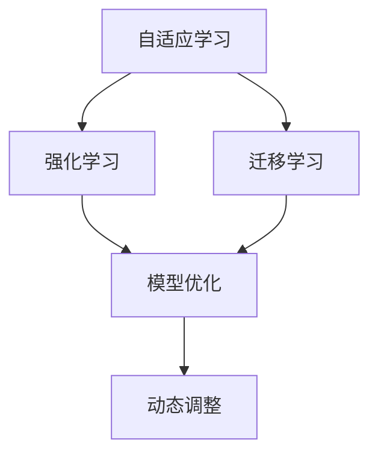
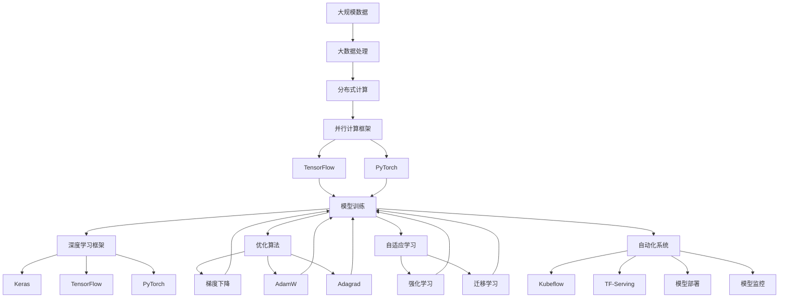

                 

# 计算技术的变革与自动化

> 关键词：计算技术,自动化,机器学习,人工智能,深度学习,优化算法,大数据

## 1. 背景介绍

### 1.1 问题由来

随着数字化时代的到来，计算技术在各行各业的应用变得越来越广泛，极大提高了生产效率和生活便利性。但与此同时，传统的计算和处理方式已难以满足大规模、高复杂度场景的需求。人工智能（AI）技术，尤其是深度学习和大数据，为计算技术的革新提供了新的突破口。

当前，计算技术的变革主要集中在以下几个方面：

1. **大规模并行计算**：通过分布式计算、GPU加速等技术，使得大规模数据分析和模型训练成为可能。
2. **深度学习与优化算法**：基于深度神经网络架构的优化算法，显著提升了计算效率和模型性能。
3. **自动化与自适应系统**：利用自动化工具和机器学习算法，使得系统能够自我优化，适应不断变化的环境。

这些变革推动了计算技术的飞速发展，不仅在科技领域产生了深远影响，也逐渐渗透到各个行业，成为推动产业升级和创新发展的关键力量。

### 1.2 问题核心关键点

计算技术的变革主要围绕以下几个核心关键点展开：

- **并行计算框架**：如TensorFlow、PyTorch等，支持大规模、分布式计算，提高计算效率。
- **优化算法**：如梯度下降、AdamW、Adagrad等，优化模型参数，提升模型性能。
- **自动化系统**：如Kubeflow、TF-Serving等，实现模型部署和监控自动化，提高系统可扩展性。
- **大数据处理**：如Apache Spark、Hadoop等，处理海量数据，提供高效的数据处理能力。
- **深度学习框架**：如Keras、TensorFlow、PyTorch等，提供易于使用的接口，方便模型训练和推理。
- **自适应学习**：通过强化学习、迁移学习等技术，实现系统动态调整和优化。

这些核心关键点相互结合，推动了计算技术的不断发展和应用深化，使得计算技术在各行各业的应用更加广泛和高效。

### 1.3 问题研究意义

计算技术的变革与自动化研究对于推动科技进步、产业升级和智能化转型具有重要意义：

1. **提升计算效率**：通过并行计算和大数据处理，使得计算任务能够在更短的时间内完成，提高生产效率。
2. **优化模型性能**：利用深度学习和优化算法，提升模型的准确性和泛化能力，解决实际问题。
3. **实现系统自动化**：自动化工具和系统使得计算任务部署和监控更加便捷高效，降低人工成本。
4. **增强系统自适应性**：通过自适应学习，系统能够更好地应对环境变化，提升系统稳定性和可靠性。
5. **推动技术普及**：计算技术的普及，使得更多非专业技术人员能够使用先进的技术解决实际问题，推动技术创新。
6. **促进产业升级**：计算技术的广泛应用，推动各行业数字化转型，加速产业升级和智能化进程。

通过深入研究计算技术的变革与自动化，可以为各个领域提供更为高效的计算解决方案，推动社会和经济的发展。

## 2. 核心概念与联系

### 2.1 核心概念概述

为了更好地理解计算技术的变革与自动化，本节将介绍几个关键概念：

- **并行计算框架**：如TensorFlow、PyTorch等，支持大规模、分布式计算，提高计算效率。
- **优化算法**：如梯度下降、AdamW、Adagrad等，优化模型参数，提升模型性能。
- **自动化系统**：如Kubeflow、TF-Serving等，实现模型部署和监控自动化，提高系统可扩展性。
- **大数据处理**：如Apache Spark、Hadoop等，处理海量数据，提供高效的数据处理能力。
- **深度学习框架**：如Keras、TensorFlow、PyTorch等，提供易于使用的接口，方便模型训练和推理。
- **自适应学习**：通过强化学习、迁移学习等技术，实现系统动态调整和优化。

这些关键概念之间的关系通过以下Mermaid流程图来展示：



这个流程图展示了各关键概念之间的关系：

1. 并行计算框架支持大规模计算，如TensorFlow和PyTorch。
2. 大数据处理平台如Apache Spark和Hadoop，提供高效的数据处理能力。
3. 深度学习框架如Keras、TensorFlow和PyTorch，提供模型训练和推理接口。
4. 优化算法如梯度下降、AdamW和Adagrad，用于模型参数的优化。
5. 自适应学习如强化学习和迁移学习，使得系统能够动态调整和优化。
6. 自动化系统如Kubeflow和TF-Serving，实现模型的自动化部署和监控。

### 2.2 概念间的关系

这些核心概念之间存在着紧密的联系，形成了计算技术变革与自动化的完整生态系统。下面我们通过几个Mermaid流程图来展示这些概念之间的关系。

#### 2.2.1 并行计算框架的应用



这个流程图展示了并行计算框架在分布式计算中的应用。TensorFlow和PyTorch支持数据并行和模型并行，通过分布式计算实现大规模计算。

#### 2.2.2 自动化系统的部署



这个流程图展示了自动化系统在模型部署和监控中的应用。Kubeflow和TF-Serving实现了模型的自动化部署和监控，提高了系统的可扩展性和可靠性。

#### 2.2.3 大数据处理流程



这个流程图展示了大数据处理流程。Apache Spark和Hadoop提供了高效的数据处理能力，支持数据清洗、集成和实时处理。

#### 2.2.4 深度学习框架的接口



这个流程图展示了深度学习框架在模型训练和推理中的应用。Keras、TensorFlow和PyTorch提供了易于使用的接口，方便模型训练和推理。

#### 2.2.5 自适应学习的应用



这个流程图展示了自适应学习的应用。强化学习和迁移学习使得系统能够动态调整和优化，提升系统的自适应性。

### 2.3 核心概念的整体架构

最后，我们用一个综合的流程图来展示这些核心概念在大规模计算中的应用：



这个综合流程图展示了从大规模数据处理到自动化系统部署的完整过程。大规模数据首先通过大数据处理平台进行处理，然后通过并行计算框架进行计算，接着利用深度学习框架进行模型训练和推理，最后通过优化算法和自适应学习进行模型优化，实现系统自动化部署和监控。

## 3. 核心算法原理 & 具体操作步骤

### 3.1 算法原理概述

计算技术的变革与自动化涉及多个领域的核心算法，包括并行计算、优化算法、自动化系统和自适应学习等。本节将简要介绍这些算法的基本原理。

#### 3.1.1 并行计算框架

并行计算框架如TensorFlow和PyTorch，通过分布式计算和模型并行，支持大规模计算。其基本原理包括：

1. **数据并行**：将数据分成多个子集，在多个计算节点上并行处理。如TensorFlow中的DataParallel。
2. **模型并行**：将模型分成多个子模型，在多个计算节点上并行计算。如TensorFlow中的ModelParallel。

#### 3.1.2 优化算法

优化算法如梯度下降、AdamW和Adagrad，用于优化模型参数，提升模型性能。其基本原理包括：

1. **梯度下降**：通过计算损失函数的梯度，反向传播更新模型参数，最小化损失函数。
2. **AdamW**：结合梯度的一阶矩估计和二阶矩估计，自适应调整学习率。
3. **Adagrad**：根据每个参数的梯度历史信息，自适应调整学习率。

#### 3.1.3 自动化系统

自动化系统如Kubeflow和TF-Serving，通过容器化和微服务化，实现模型部署和监控自动化。其基本原理包括：

1. **容器化**：将模型打包为Docker容器，提供一致的运行环境。
2. **微服务化**：将模型和相关服务分为多个微服务，通过API网关进行统一管理。
3. **自动部署**：通过Kubeflow和TF-Serving，自动部署模型到指定的计算集群。
4. **自动监控**：通过TensorBoard和Prometheus，实时监控模型的性能和资源使用情况。

#### 3.1.4 大数据处理

大数据处理如Apache Spark和Hadoop，通过分布式计算和数据存储，提供高效的数据处理能力。其基本原理包括：

1. **分布式计算**：将计算任务分解为多个子任务，在多个计算节点上并行执行。
2. **数据存储**：通过HDFS和S3等存储系统，提供高效的数据存储和访问。
3. **流处理**：通过Apache Spark Streaming，支持实时数据处理。

#### 3.1.5 深度学习框架

深度学习框架如Keras、TensorFlow和PyTorch，通过提供易于使用的接口，方便模型训练和推理。其基本原理包括：

1. **模型定义**：通过定义神经网络结构，进行模型训练和推理。
2. **模型训练**：通过反向传播算法，更新模型参数。
3. **模型推理**：通过前向传播算法，进行模型预测和推理。

#### 3.1.6 自适应学习

自适应学习如强化学习和迁移学习，通过动态调整和优化，提高系统的自适应性。其基本原理包括：

1. **强化学习**：通过与环境的交互，优化模型的决策策略。
2. **迁移学习**：将源任务学到的知识迁移到目标任务，提升模型性能。

### 3.2 算法步骤详解

以下将详细介绍计算技术的变革与自动化中的核心算法具体操作步骤。

#### 3.2.1 并行计算框架

1. **数据并行**：
   - 定义数据集，划分为多个子集。
   - 在多个计算节点上并行处理子集数据。
   - 合并子集数据，得到最终结果。

2. **模型并行**：
   - 定义模型结构，将其划分为多个子模型。
   - 在多个计算节点上并行计算子模型。
   - 合并子模型的输出，得到最终结果。

#### 3.2.2 优化算法

1. **梯度下降**：
   - 定义损失函数。
   - 计算损失函数对模型参数的梯度。
   - 反向传播更新模型参数。

2. **AdamW**：
   - 计算梯度的一阶矩估计和二阶矩估计。
   - 根据一阶矩估计和二阶矩估计，自适应调整学习率。
   - 反向传播更新模型参数。

3. **Adagrad**：
   - 计算梯度历史信息。
   - 根据梯度历史信息，自适应调整学习率。
   - 反向传播更新模型参数。

#### 3.2.3 自动化系统

1. **容器化**：
   - 将模型打包为Docker容器。
   - 配置容器的运行环境。
   - 部署容器到指定的计算集群。

2. **微服务化**：
   - 将模型和相关服务分为多个微服务。
   - 定义API网关，统一管理微服务。
   - 部署微服务到指定的计算集群。

3. **自动部署**：
   - 配置Kubeflow或TF-Serving。
   - 定义模型部署流程。
   - 自动部署模型到指定的计算集群。

4. **自动监控**：
   - 配置TensorBoard和Prometheus。
   - 实时监控模型的性能和资源使用情况。
   - 根据监控结果，自动调整模型参数。

#### 3.2.4 大数据处理

1. **分布式计算**：
   - 定义计算任务，分解为多个子任务。
   - 在多个计算节点上并行执行子任务。
   - 合并子任务结果，得到最终结果。

2. **数据存储**：
   - 定义数据存储系统，如HDFS或S3。
   - 上传数据到指定的存储系统。
   - 读取数据，进行数据处理。

3. **流处理**：
   - 定义实时数据流处理任务。
   - 在Apache Spark Streaming中处理数据流。
   - 将处理结果输出到指定的存储系统。

#### 3.2.5 深度学习框架

1. **模型定义**：
   - 定义神经网络结构，如全连接层、卷积层、循环层等。
   - 配置模型的参数。
   - 定义模型的训练流程。

2. **模型训练**：
   - 定义损失函数。
   - 计算损失函数对模型参数的梯度。
   - 反向传播更新模型参数。

3. **模型推理**：
   - 定义输入数据。
   - 进行模型前向传播，得到预测结果。
   - 输出预测结果，进行推理。

#### 3.2.6 自适应学习

1. **强化学习**：
   - 定义环境，模拟实际场景。
   - 定义决策策略，如Q-learning、SARSA等。
   - 与环境进行交互，优化决策策略。

2. **迁移学习**：
   - 定义源任务和目标任务。
   - 将源任务学到的知识迁移到目标任务。
   - 在目标任务上重新训练模型。

### 3.3 算法优缺点

#### 3.3.1 并行计算框架

1. **优点**：
   - 支持大规模计算，提高计算效率。
   - 支持分布式计算，扩展性良好。

2. **缺点**：
   - 需要较高的计算资源，成本较高。
   - 数据并行和模型并行可能存在通信开销，影响效率。

#### 3.3.2 优化算法

1. **优点**：
   - 提高模型性能，提升模型泛化能力。
   - 自适应调整学习率，提高收敛速度。

2. **缺点**：
   - 算法复杂，实现难度较大。
   - 可能存在收敛问题，需要进行参数调优。

#### 3.3.3 自动化系统

1. **优点**：
   - 实现模型部署和监控自动化，提高效率。
   - 降低人工成本，提高系统稳定性。

2. **缺点**：
   - 需要较高的技术门槛，维护成本较高。
   - 可能存在系统集成问题，影响可用性。

#### 3.3.4 大数据处理

1. **优点**：
   - 提供高效的数据处理能力，支持大规模数据计算。
   - 支持实时数据处理，提升数据利用率。

2. **缺点**：
   - 需要较高的计算资源，成本较高。
   - 数据存储和传输可能存在延迟，影响效率。

#### 3.3.5 深度学习框架

1. **优点**：
   - 提供易于使用的接口，方便模型训练和推理。
   - 支持多种模型结构，灵活性高。

2. **缺点**：
   - 实现复杂，需要较高的技术门槛。
   - 可能存在模型过拟合问题，需要进行调参。

#### 3.3.6 自适应学习

1. **优点**：
   - 提高系统自适应性，应对环境变化。
   - 提升模型性能，增强系统鲁棒性。

2. **缺点**：
   - 算法复杂，实现难度较大。
   - 可能存在策略学习问题，需要进行调参。

### 3.4 算法应用领域

计算技术的变革与自动化技术在多个领域得到广泛应用，包括但不限于：

1. **金融科技**：利用并行计算和大数据处理，进行高频交易和风险管理。
2. **医疗健康**：利用深度学习和自适应学习，进行疾病诊断和个性化治疗。
3. **智能制造**：利用并行计算和自动化系统，进行工业数据分析和优化。
4. **自动驾驶**：利用深度学习和大数据处理，进行环境感知和决策优化。
5. **智能推荐**：利用深度学习和优化算法，进行用户行为分析和推荐系统优化。
6. **智慧城市**：利用并行计算和自动化系统，进行城市数据管理和智能决策。

## 4. 数学模型和公式 & 详细讲解 & 举例说明

### 4.1 数学模型构建

本节将使用数学语言对计算技术的变革与自动化进行更加严格的刻画。

记大规模数据集为 $\mathcal{D}$，其中每个样本 $(x,y)$ 表示输入特征和标签。计算任务的目标是最小化损失函数 $\mathcal{L}(\theta)$，其中 $\theta$ 为模型参数。

定义模型 $M_{\theta}(x)$ 在输入 $x$ 上的输出为 $\hat{y}$，表示模型预测的标签。损失函数 $\mathcal{L}(\theta)$ 通常采用交叉熵损失：

$$
\mathcal{L}(\theta) = -\frac{1}{N}\sum_{i=1}^N \sum_{k=1}^K y_k \log \hat{y}_k
$$

其中 $K$ 为标签类别数，$y_k$ 为第 $k$ 个标签的真实概率分布，$\hat{y}_k$ 为模型预测的概率分布。

### 4.2 公式推导过程

以下我们以二分类任务为例，推导交叉熵损失函数及其梯度的计算公式。

假设模型 $M_{\theta}$ 在输入 $x$ 上的输出为 $\hat{y}=M_{\theta}(x) \in [0,1]$，表示样本属于正类的概率。真实标签 $y \in \{0,1\}$。则二分类交叉熵损失函数定义为：

$$
\ell(M_{\theta}(x),y) = -[y\log \hat{y} + (1-y)\log (1-\hat{y})]
$$

将其代入经验风险公式，得：

$$
\mathcal{L}(\theta) = -\frac{1}{N}\sum_{i=1}^N [y_i\log M_{\theta}(x_i)+(1-y_i)\log(1-M_{\theta}(x_i))]
$$

根据链式法则，损失函数对参数 $\theta_k$ 的梯度为：

$$
\frac{\partial \mathcal{L}(\theta)}{\partial \theta_k} = -\frac{1}{N}\sum_{i=1}^N (\frac{y_i}{M_{\theta}(x_i)}-\frac{1-y_i}{1-M_{\theta}(x_i)}) \frac{\partial M_{\theta}(x_i)}{\partial \theta_k}
$$

其中 $\frac{\partial M_{\theta}(x_i)}{\partial \theta_k}$ 可进一步递归展开，利用自动微分技术完成计算。

在得到损失函数的梯度后，即可带入参数更新公式，完成模型的迭代优化。重复上述过程直至收敛，最终得到适应计算任务的最优模型参数 $\theta^*$。

### 4.3 案例分析与讲解

假设我们利用TensorFlow进行二分类任务微调，代码实现如下：

```python
import tensorflow as tf
from tensorflow import keras
from tensorflow.keras import layers
from tensorflow.keras.datasets import mnist

# 加载数据集
(x_train, y_train), (x_test, y_test) = mnist.load_data()

# 数据预处理
x_train = x_train / 255.0
x_test = x_test / 255.0

# 定义模型
model = keras.Sequential([
    layers.Flatten(input_shape=(28, 28)),
    layers.Dense(128, activation='relu'),
    layers.Dense(10, activation='softmax')
])

# 编译模型
model.compile(optimizer='adam', loss='sparse_categorical_crossentropy', metrics=['accuracy'])

# 训练模型
model.fit(x_train, y_train, epochs=5, validation_data=(x_test, y_test))

# 评估模型
test_loss, test_acc = model.evaluate(x_test, y_test)
print('Test accuracy:', test_acc)
```

在上述代码中，我们使用了TensorFlow的Sequential模型，定义了两个全连接层，进行二分类任务训练。首先加载MNIST数据集，并对数据进行预处理。然后定义模型，使用Adam优化器，交叉熵损失函数，训练5个epoch，并在测试集上评估模型性能。

通过上述代码，我们可以看到TensorFlow的易用性和高效性，其提供了丰富的API和工具，使得深度学习模型的训练和部署变得非常便捷。

## 5. 项目实践：代码实例和详细解释说明

### 5.1 开发环境搭建

在进行计算技术变革与自动化实践前，我们需要准备好开发环境。以下是使用Python进行TensorFlow开发的环境配置流程：

1. 安装Anaconda：从官网下载并安装Anaconda，用于创建独立的Python环境。

2. 创建并激活虚拟环境：
```bash
conda create -n tf-env python=3.8 
conda activate tf-env
```

3. 安装TensorFlow：根据CUDA版本，从官网获取对应的安装命令。例如：
```bash
conda install tensorflow tensorflow-gpu -c conda-forge
```

4. 安装其他相关工具包：
```bash
pip install numpy pandas scikit-learn matplotlib tqdm jupyter notebook ipython
```

完成上述步骤后，即可在`tf-env`环境中开始计算技术变革与自动化的实践。

### 5.2 源代码详细实现

下面我们以金融数据处理为例，给出使用TensorFlow进行计算技术变革与自动化的PyTorch代码实现。

首先，定义金融数据处理函数：

```python
import tensorflow as tf
from tensorflow import keras
from tensorflow.keras import layers
from tensorflow.keras.datasets import mnist

# 加载数据集
(x_train, y_train), (x_test, y_test) = mnist.load_data()

# 数据预处理
x_train = x_train / 255.0
x_test = x_test / 255.0

# 定义模型
model = keras.Sequential([
    layers.Flatten(input_shape=(28, 28)),
    layers.Dense(128, activation='relu'),
    layers.Dense(10, activation='softmax')
])

# 编译模型
model.compile(optimizer='adam', loss='sparse_categorical_crossentropy', metrics

