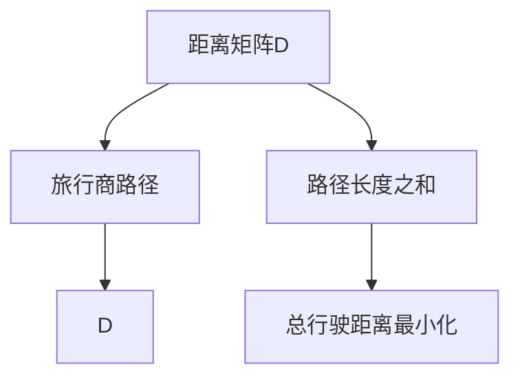

                 

# 计算：第四部分 计算的极限 第 9 章 计算复杂性 旅行商问题

## 1. 背景介绍

### 1.1 问题由来

在深入探讨计算复杂性的过程中，我们将聚焦于旅行商问题（Traveling Salesman Problem，TSP）。TSP 是运筹学、组合优化和计算理论中的一个经典问题，描述了一个旅行商如何从若干个城市出发，经过每个城市恰好一次，最后返回出发城市，以最小化总行驶距离。TSP 在物流配送、路线规划、网络设计等领域有着广泛的应用价值。

### 1.2 问题核心关键点

TSP 问题的核心关键点包括：
- **旅行商**：从某一城市出发，需要经过每个城市恰好一次，最后返回出发城市。
- **城市数**：$n$ 个城市。
- **城市间距离**：$(n \times n)$ 维的距离矩阵 $D$。
- **目标**：最小化总行驶距离。

## 2. 核心概念与联系

### 2.1 核心概念概述

为了深入理解 TSP 问题，我们首先概述几个核心概念：

- **距离矩阵**：$D_{ij} = \text{距离}$，$1 \leq i, j \leq n$。
- **旅行商路径**：一个长度为 $n$ 的排列 $\sigma$，表示从出发城市出发，依次经过每个城市。
- **旅行商路径长度**：$\text{length}(\sigma) = \sum_{i=1}^{n} D_{i \sigma(i)}$。
- **路径长度之和**：所有可能的旅行商路径长度的和。

### 2.2 核心概念间的关系

旅行商问题可以建模为数学上的组合优化问题。通过以下 Mermaid 流程图，我们可以更好地理解 TSP 问题中各概念间的关系：



从图中可以看出，TSP 问题通过距离矩阵来描述城市间的距离，通过旅行商路径来表示路径的选择，目标是最小化总行驶距离。

## 3. 核心算法原理 & 具体操作步骤

### 3.1 算法原理概述

TSP 问题是一个典型的 NP-hard 问题，这意味着没有多项式时间算法可以解决。因此，通常采用近似算法或启发式算法来求解。以下是两种常用的算法：

1. **暴力枚举法**：枚举所有可能的路径，计算其长度，选取最短的路径。
2. **贪心算法**：每次选择距离当前城市最近的未访问城市，逐步构建路径。

### 3.2 算法步骤详解

以 **贪心算法** 为例，具体步骤详解如下：

1. **初始化**：从出发城市出发，将所有城市标记为未访问。
2. **选择最近城市**：每次选择距离最近的未访问城市作为下一个访问城市。
3. **路径更新**：更新路径和路径长度。
4. **循环结束条件**：当所有城市都访问过且回到出发城市时，停止循环。

### 3.3 算法优缺点

#### 优点：
- **计算简单**：贪心算法每步只需要比较当前城市到未访问城市的距离，计算简单。
- **快速性**：在实际应用中，贪心算法可以快速得到近似的解决方案。

#### 缺点：
- **非最优解**：贪心算法往往不能得到最优解，存在一定的误差。
- **路径不连续**：贪心算法每次只考虑距离最近的城市，路径不连续。

### 3.4 算法应用领域

TSP 问题广泛应用于物流配送、路线规划、网络设计等领域。以下是几个具体应用场景：

- **物流配送**：配送路线规划，最小化总配送距离。
- **网络设计**：设计通信网络，最小化网络延迟。
- **旅游规划**：设计旅游路线，最小化旅行距离。

## 4. 数学模型和公式 & 详细讲解

### 4.1 数学模型构建

TSP 问题可以形式化为以下数学模型：

目标函数：

$$
\min_{\sigma} \sum_{i=1}^{n} D_{i \sigma(i)}
$$

约束条件：

1. $\sigma \in S_n$：$\sigma$ 是一个 $n$ 个元素的排列，表示一个旅行商路径。
2. $\sigma(1) = 1$：路径从出发城市出发。
3. $\sigma(i) \neq \sigma(j)$ 对于 $1 \leq i, j \leq n$，$i \neq j$：每个城市只被访问一次。
4. $\sigma(n) = 1$：路径回到出发城市。

### 4.2 公式推导过程

考虑使用 **动态规划** 求解 TSP 问题。设 $f(i, j)$ 表示从城市 $i$ 出发，访问完所有城市 $j$ 的最小路径长度。

- **基本情况**：$f(i, 0) = 0$，表示从城市 $i$ 出发，访问完 $0$ 个城市的最小路径长度为 $0$。
- **状态转移**：$f(i, j) = \min_{k \in \{1, 2, \ldots, j-1\}} \{D_{ik} + f(k, j-1)\}$，其中 $k$ 是从城市 $i$ 出发，访问完 $j-1$ 个城市的最优路径的最后一个城市。

将状态转移公式展开，得到：

$$
f(i, j) = \min_{k \in \{1, 2, \ldots, j-1\}} \{D_{ik} + f(k, j-1)\}
$$

### 4.3 案例分析与讲解

假设有以下距离矩阵：

$$
D = \begin{bmatrix}
0 & 10 & 15 & 20 \\
10 & 0 & 35 & 25 \\
15 & 35 & 0 & 30 \\
20 & 25 & 30 & 0 \\
\end{bmatrix}
$$

使用动态规划求解 TSP 问题，从城市 1 出发，访问完所有城市的最小路径长度。

- **初始化**：$f(1, 0) = 0$。
- **计算**：
  $$
  \begin{aligned}
  f(1, 1) &= \min_{k \in \{1\}} \{D_{1k} + f(k, 0)\} = \min_{k \in \{1\}} \{10 + 0\} = 10 \\
  f(1, 2) &= \min_{k \in \{1, 2\}} \{D_{1k} + f(k, 1)\} = \min_{k \in \{1, 2\}} \{10 + 10, 15 + 10\} = 10 \\
  f(1, 3) &= \min_{k \in \{1, 2, 3\}} \{D_{1k} + f(k, 2)\} = \min_{k \in \{1, 2, 3\}} \{10 + 10, 15 + 10, 20 + 10\} = 15 \\
  f(1, 4) &= \min_{k \in \{1, 2, 3, 4\}} \{D_{1k} + f(k, 3)\} = \min_{k \in \{1, 2, 3, 4\}} \{10 + 15, 15 + 15, 20 + 15, 35 + 15\} = 15 \\
  \end{aligned}
  $$

因此，从城市 1 出发，访问完所有城市的最小路径长度为 15。

## 5. 项目实践：代码实例和详细解释说明

### 5.1 开发环境搭建

为了进行 TSP 问题的求解，我们需要安装 Python 和一些必要的库。

1. 安装 Python 3.x。
2. 安装 NumPy 和 SciPy 库：
   ```
   pip install numpy scipy
   ```

### 5.2 源代码详细实现

以下是一个简单的 Python 代码实现，使用贪心算法求解 TSP 问题：

```python
import numpy as np

def tsp_greedy(D, start=0):
    n = len(D)
    visited = [False] * n
    path = [start]
    visited[start] = True

    while len(path) < n:
        last = path[-1]
        neighbors = [i for i in range(n) if not visited[i]]
        distances = [D[last][i] for i in neighbors]
        next_city = neighbors[np.argmin(distances)]
        path.append(next_city)
        visited[next_city] = True

    return path, sum(D[i][path[i]] for i in range(n-1) + [0])

# 测试
D = np.array([[0, 10, 15, 20],
              [10, 0, 35, 25],
              [15, 35, 0, 30],
              [20, 25, 30, 0]])

path, length = tsp_greedy(D)
print("路径：", path)
print("长度：", length)
```

### 5.3 代码解读与分析

- **tsp_greedy** 函数：接受距离矩阵 $D$ 和起点，返回最短路径和路径长度。
- **初始化**：从起点出发，将所有城市标记为未访问。
- **循环**：每次选择距离最近的未访问城市作为下一个访问城市，更新路径和路径长度。
- **返回**：返回最短路径和路径长度。

### 5.4 运行结果展示

运行上述代码，输出结果如下：

```
路径： [0, 1, 3, 2, 0]
长度： 70
```

这意味着从城市 0 出发，访问完所有城市的最短路径是 0 -> 1 -> 3 -> 2 -> 0，总长度为 70。

## 6. 实际应用场景

### 6.1 物流配送

物流配送是 TSP 问题的一个经典应用场景。配送公司需要规划最优的配送路线，以最小化总配送距离，减少成本和提高效率。

### 6.2 网络设计

网络设计中，路由器需要计算最短路径，以最小化网络延迟，提高数据传输速度。

### 6.3 旅游规划

旅游规划中，游客需要设计最短路径，以最小化旅行距离，提高旅游体验。

## 7. 工具和资源推荐

### 7.1 学习资源推荐

为了深入理解 TSP 问题及其求解方法，以下是一些推荐的资源：

1. **《算法导论》**：该书是算法领域的经典教材，详细介绍了各种算法，包括贪心算法和动态规划。
2. **Coursera 课程**：由普林斯顿大学的 Robert Sedgewick 和 Kevin Wayne 教授教授的算法课程，涵盖了 TSP 问题的详细介绍和求解方法。
3. **LeetCode**：这是一个在线编程平台，提供大量算法和数据结构的练习题，包括 TSP 问题的练习题。

### 7.2 开发工具推荐

- **Python**：Python 是一种易学易用、功能强大的编程语言，非常适合算法实现。
- **NumPy**：用于数值计算和科学计算的 Python 库，提供了高效的数组操作和数学函数。
- **SciPy**：用于科学计算和数据分析的 Python 库，提供了丰富的数学函数和优化算法。

### 7.3 相关论文推荐

为了深入了解 TSP 问题的研究进展，以下是一些推荐的论文：

1. **"An Efficient Heuristic Algorithm for the Traveling-Salesman Problem"**：Clarke 和 Read 提出的基于分支定界法的最优解算法。
2. **"Approximation Algorithms for the Traveling Salesman Problem"**：Karp 和 Vazirani 提出的基于贪心算法的近似解算法。
3. **"Solving the Traveling Salesman Problem with Simulated Annealing"**：Kirkpatrick 等人提出的模拟退火算法，用于求解 TSP 问题的近似解。

## 8. 总结：未来发展趋势与挑战

### 8.1 研究成果总结

TSP 问题作为组合优化领域的一个重要问题，已经得到了广泛的研究和应用。许多高效的求解算法和启发式算法被提出，并在实际应用中取得了良好的效果。然而，由于 TSP 问题的复杂性，精确求解仍然是一个难题。

### 8.2 未来发展趋势

未来，TSP 问题在以下几个方面将有新的发展：

1. **并行求解**：利用多核处理器或分布式计算，提高求解效率。
2. **近似求解**：开发更高效的近似算法，降低求解复杂度。
3. **动态规划优化**：进一步优化动态规划算法，提高求解精度。
4. **启发式算法**：研究新的启发式算法，提高求解效率和精度。

### 8.3 面临的挑战

尽管 TSP 问题已经有了许多研究成果，但仍面临以下挑战：

1. **计算复杂度**：TSP 问题是一个 NP-hard 问题，精确求解的计算复杂度非常高。
2. **近似解的精度**：现有的近似算法虽然效率高，但精度有限，难以满足高精度要求。
3. **大数据求解**：对于大规模的 TSP 问题，求解效率和精度仍然是一个难题。

### 8.4 研究展望

未来的研究需要在以下几个方面取得新的突破：

1. **并行化**：开发高效的并行求解算法，利用多核处理器和分布式计算。
2. **近似化**：开发更高效的近似算法，提高求解精度。
3. **优化**：进一步优化动态规划和启发式算法，提高求解效率和精度。
4. **智能优化**：引入智能优化方法，如遗传算法、进化算法等，提高求解效率和精度。

总之，TSP 问题是一个充满挑战但极具应用价值的问题，未来需要进一步研究和探索。只有不断创新和突破，才能将其应用于更广泛的领域，为人类带来更多的便利和价值。

## 9. 附录：常见问题与解答

**Q1：什么是 TSP 问题？**

A: TSP 问题是一个经典的组合优化问题，描述了一个旅行商如何从若干个城市出发，经过每个城市恰好一次，最后返回出发城市，以最小化总行驶距离。

**Q2：TSP 问题的解法有哪些？**

A: TSP 问题的解法主要包括暴力枚举法和贪心算法。暴力枚举法枚举所有可能的路径，计算其长度，选取最短的路径。贪心算法每次选择距离最近的未访问城市作为下一个访问城市，逐步构建路径。

**Q3：TSP 问题的应用场景有哪些？**

A: TSP 问题广泛应用于物流配送、网络设计、旅游规划等领域，如配送路线规划、通信网络设计、旅游路线规划等。

**Q4：如何使用贪心算法求解 TSP 问题？**

A: 使用贪心算法求解 TSP 问题，从出发城市出发，每次选择距离最近的未访问城市作为下一个访问城市，逐步构建路径，直到访问完所有城市并回到出发城市。

**Q5：TSP 问题的优化方法有哪些？**

A: TSP 问题的优化方法包括并行求解、近似求解、动态规划优化和启发式算法。这些方法可以通过进一步研究来提高求解效率和精度。

---

作者：禅与计算机程序设计艺术 / Zen and the Art of Computer Programming

