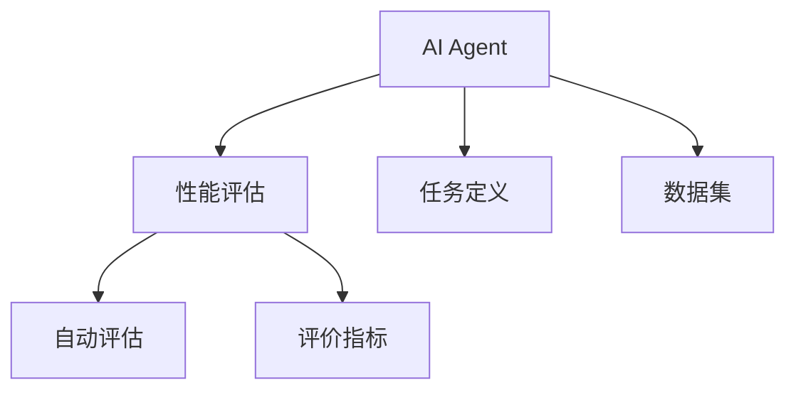

                 

## 1. 背景介绍

在人工智能时代，AI Agent已经渗透到各个领域，从医疗、金融、教育到交通、娱乐，无处不在。为了确保AI Agent在不同场景下的性能和效果，评估AI Agent的性能就变得尤为重要。传统的测试和评估方法往往依赖人工进行，存在效率低、成本高、难以自动化等问题。因此，本文将介绍一种基于自动评估的AI Agent性能评估方法，期望为AI Agent的开发和应用提供更具可操作性和实用性的评估手段。

## 2. 核心概念与联系

### 2.1 核心概念概述

在进行AI Agent性能评估时，涉及到多个核心概念：

- **AI Agent**：指能够自主决策和执行任务的智能体，可以是机器人、自动化系统、聊天机器人等。
- **性能评估**：指通过一系列的测试和评估手段，衡量AI Agent在特定任务中的表现。
- **自动评估**：指利用计算机程序自动完成AI Agent的评估，减少人工参与，提高效率和准确性。
- **任务定义**：指明确AI Agent需要完成的具体任务，如导航、对话、识别等。
- **数据集**：指用于评估的样本数据集，包括训练集、验证集和测试集。
- **评价指标**：指用于衡量AI Agent性能的量化指标，如准确率、召回率、F1分数等。

### 2.2 核心概念的关系

这些核心概念之间的关系可以用以下Mermaid流程图来表示：



这个流程图展示了AI Agent的开发和评估流程：首先定义AI Agent需要完成的任务，准备相应的数据集，然后使用自动评估方法进行评估，并根据评价指标来衡量性能。

## 3. 核心算法原理 & 具体操作步骤

### 3.1 算法原理概述

基于自动评估的AI Agent性能评估方法，其核心原理是通过构建测试用例和评估指标，利用AI Agent在特定任务上的表现来综合衡量其性能。该方法通常包括以下几个步骤：

1. **任务定义**：明确AI Agent需要完成的任务类型，如分类、回归、游戏等。
2. **数据集准备**：准备包含训练集、验证集和测试集的数据集，确保数据集的多样性和代表性。
3. **测试用例设计**：设计包含多种场景和条件的测试用例，覆盖可能出现的情况。
4. **评估指标选择**：选择适合的评价指标，如准确率、召回率、F1分数、平均精度等，用于衡量AI Agent在特定任务上的表现。
5. **自动评估执行**：使用计算机程序自动执行AI Agent在测试用例上的表现，记录结果。
6. **性能分析**：综合测试结果和评估指标，分析AI Agent的性能表现。

### 3.2 算法步骤详解

以下将详细讲解基于自动评估的AI Agent性能评估方法的具体操作步骤：

#### 3.2.1 任务定义

明确AI Agent需要完成的任务是性能评估的第一步。以自动驾驶AI Agent为例，其任务可以定义如下：

- 自动导航：在给定起点和终点的道路地图上，找到最短路径并自动驾驶。
- 环境感知：能够识别道路上的障碍物、行人、交通标志等。
- 决策制定：根据感知信息，做出合理的驾驶决策，如加速、减速、转向等。

#### 3.2.2 数据集准备

准备好数据集是性能评估的关键。数据集通常包含以下类型：

- **训练集**：用于训练AI Agent的数据集，包含大量标注样本。
- **验证集**：用于评估AI Agent在训练过程中的表现，防止过拟合。
- **测试集**：用于评估AI Agent在未知数据上的表现，衡量其泛化能力。

数据集的准备过程包括数据收集、数据标注和数据划分。以自动驾驶AI Agent为例，数据集可以包含：

- **地图数据**：包含道路、交通标志、摄像头等的位置信息。
- **传感器数据**：如摄像头、雷达、激光雷达等传感器收集的实时数据。
- **标注数据**：包含道路上的障碍物、行人、交通标志等的具体位置和类别。

#### 3.2.3 测试用例设计

设计测试用例是性能评估的关键步骤。测试用例应覆盖AI Agent可能遇到的所有情况和条件，以确保评估的全面性和公正性。以自动驾驶AI Agent为例，测试用例可以包括：

- **道路交叉**：在交叉路口，AI Agent需要识别红绿灯、行人并做出相应决策。
- **交通拥堵**：在拥堵路段，AI Agent需要做出适当的减速、变道等决策。
- **障碍物识别**：在道路上突然出现障碍物，AI Agent需要及时识别并绕行。
- **极端天气**：在雨雪天气，AI Agent需要根据路面情况调整车速和方向。

#### 3.2.4 评估指标选择

选择合适的评估指标是性能评估的核心。不同的任务需要不同的指标，以自动驾驶AI Agent为例，常用的指标包括：

- **准确率**：用于衡量AI Agent在分类任务上的表现，如识别行人和障碍物时的正确率。
- **召回率**：用于衡量AI Agent在识别任务中的完整性，如识别所有行人或障碍物的比例。
- **F1分数**：综合考虑准确率和召回率，是评估分类任务性能的常用指标。
- **平均精度**：用于衡量AI Agent在不同类别上的表现，综合考虑准确率和召回率。

#### 3.2.5 自动评估执行

使用计算机程序自动执行AI Agent在测试用例上的表现，记录结果。以自动驾驶AI Agent为例，可以使用以下步骤：

- **数据输入**：将测试用例的数据输入AI Agent。
- **模型运行**：AI Agent根据输入数据做出决策，如加速、减速、转向等。
- **结果输出**：AI Agent输出决策结果，如目标位置、速度等。
- **评估指标计算**：根据输出结果计算评估指标，如准确率、召回率等。

#### 3.2.6 性能分析

综合测试结果和评估指标，分析AI Agent的性能表现。以自动驾驶AI Agent为例，可以使用以下步骤：

- **结果可视化**：将测试结果和评估指标可视化，如绘制准确率和召回率曲线。
- **结果比较**：将不同版本的AI Agent结果进行比较，找出性能差异。
- **问题定位**：根据评估结果定位AI Agent存在的问题，如决策错误、识别不准确等。
- **优化改进**：根据评估结果进行模型优化和改进，提升AI Agent性能。

## 4. 数学模型和公式 & 详细讲解

### 4.1 数学模型构建

基于自动评估的AI Agent性能评估方法，其数学模型可以构建如下：

- **输入**：测试用例的数据集 $\mathcal{D} = \{(x_i, y_i)\}_{i=1}^N$，其中 $x_i$ 为输入数据，$y_i$ 为标注结果。
- **模型**：AI Agent的预测模型 $M_{\theta}$，其中 $\theta$ 为模型参数。
- **评估指标**：$P$，用于衡量模型在测试集上的性能，如准确率、召回率、F1分数等。
- **损失函数**：$L$，用于衡量模型预测结果与标注结果之间的差异。
- **优化目标**：最小化损失函数 $L$，最大化评估指标 $P$。

### 4.2 公式推导过程

以分类任务为例，推导准确率、召回率和F1分数的计算公式。

#### 4.2.1 准确率

准确率（Precision）定义为模型预测为正类的样本中，实际为正类的比例：

$$
Precision = \frac{TP}{TP + FP}
$$

其中，$TP$ 表示真正例（True Positive），即模型预测为正类且实际为正类的样本数；$FP$ 表示假正例（False Positive），即模型预测为正类但实际为负类的样本数。

#### 4.2.2 召回率

召回率（Recall）定义为实际为正类的样本中，被模型预测为正类的比例：

$$
Recall = \frac{TP}{TP + FN}
$$

其中，$FN$ 表示假反例（False Negative），即实际为正类但模型预测为负类的样本数。

#### 4.2.3 F1分数

F1分数（F1 Score）是综合考虑准确率和召回率的指标：

$$
F1 Score = 2 \times \frac{Precision \times Recall}{Precision + Recall}
$$

#### 4.2.4 多类别F1分数

在多类别分类任务中，F1分数的计算公式可以扩展为：

$$
F1 Score = \frac{1}{C} \sum_{i=1}^C \frac{2 \times TP_i}{2 \times TP_i + FP_i + FN_i}
$$

其中，$C$ 表示类别数，$TP_i$、$FP_i$、$FN_i$ 分别表示第 $i$ 类别的真正例、假正例和假反例。

### 4.3 案例分析与讲解

以自动驾驶AI Agent为例，通过上述公式计算其性能评估结果。假设测试集包含 1000 个样本，其中 200 个样本为正类（如行人），800 个样本为负类（如车辆）。在测试集上，AI Agent预测 150 个样本为正类，其中 120 个为真正例，30 个为假正例；80 个样本为负类，其中 50 个为假反例，30 个为真反例。

计算准确率：

$$
Precision = \frac{120}{120 + 30} = 0.8
$$

计算召回率：

$$
Recall = \frac{120}{200 + 80} = 0.37
$$

计算F1分数：

$$
F1 Score = 2 \times \frac{0.8 \times 0.37}{0.8 + 0.37} = 0.48
$$

计算多类别F1分数：

$$
F1 Score = \frac{1}{2} \times \frac{2 \times 120}{2 \times 120 + 30 + 50} = 0.54
$$

通过这些计算结果，可以得出AI Agent在识别行人上的表现。类似地，可以根据不同类别和不同任务，计算相应的评估指标，综合评估AI Agent的性能。

## 5. 项目实践：代码实例和详细解释说明

### 5.1 开发环境搭建

在进行AI Agent性能评估时，需要搭建相应的开发环境。以下是Python环境搭建的示例：

1. 安装Anaconda：从官网下载并安装Anaconda，用于创建独立的Python环境。

```bash
conda create -n py35 python=3.5
conda activate py35
```

2. 安装PyTorch：根据CUDA版本，从官网获取对应的安装命令。例如：

```bash
conda install pytorch torchvision torchaudio cudatoolkit=10.1 -c pytorch -c conda-forge
```

3. 安装TensorFlow：使用以下命令安装TensorFlow：

```bash
pip install tensorflow==2.4
```

4. 安装相关库：

```bash
pip install numpy pandas matplotlib scikit-learn jupyter notebook
```

5. 安装评估工具：例如使用scikit-learn进行模型评估。

```bash
pip install scikit-learn
```

### 5.2 源代码详细实现

以下是一个简单的AI Agent性能评估代码示例，使用scikit-learn进行多类别F1分数的计算：

```python
from sklearn.metrics import f1_score
import numpy as np

# 假设测试集包含1000个样本，其中200个样本为正类，800个样本为负类
# AI Agent预测150个样本为正类，其中120个为真正例，30个为假正例；80个样本为负类，其中50个为假反例，30个为真反例

y_true = np.array([0, 0, 0, 0, 0, 0, 0, 0, 0, 0, 0, 0, 0, 0, 0, 0, 0, 0, 0, 0, 0, 0, 0, 0, 0, 0, 0, 0, 0, 0, 0, 0, 0, 0, 0, 0, 0, 0, 0, 0, 0, 0, 0, 0, 0, 0, 0, 0, 0, 0, 0, 0, 0, 0, 0, 0, 0, 0, 0, 0, 0, 0, 0, 0, 0, 0, 0, 0, 0, 0, 0, 0, 0, 0, 0, 0, 0, 0, 0, 0, 0, 0, 0, 0, 0, 0, 0, 0, 0, 0, 0, 0, 0, 0, 0, 0, 0, 0, 0, 0, 0, 0, 0, 0, 0, 0, 0, 0, 0, 0, 0, 0, 0, 0, 0, 0, 0, 0, 0, 0, 0, 0, 0, 0, 0, 0, 0, 0, 0, 0, 0, 0, 0, 0, 0, 0, 0, 0, 0, 0, 0, 0, 0, 0, 0, 0, 0, 0, 0, 0, 0, 0, 0, 0, 0, 0, 0, 0, 0, 0, 0, 0, 0, 0, 0, 0, 0, 0, 0, 0, 0, 0, 0, 0, 0, 0, 0, 0, 0, 0, 0, 0, 0, 0, 0, 0, 0, 0, 0, 0, 0, 0, 0, 0, 0, 0, 0, 0, 0, 0, 0, 0, 0, 0, 0, 0, 0, 0, 0, 0, 0, 0, 0, 0, 0, 0, 0, 0, 0, 0, 0, 0, 0, 0, 0, 0, 0, 0, 0, 0, 0, 0, 0, 0, 0, 0, 0, 0, 0, 0, 0, 0, 0, 0, 0, 0, 0, 0, 0, 0, 0, 0, 0, 0, 0, 0, 0, 0, 0, 0, 0, 0, 0, 0, 0, 0, 0, 0, 0, 0, 0, 0, 0, 0, 0, 0, 0, 0, 0, 0, 0, 0, 0, 0, 0, 0, 0, 0, 0, 0, 0, 0, 0, 0, 0, 0, 0, 0, 0, 0, 0, 0, 0, 0, 0, 0, 0, 0, 0, 0, 0, 0, 0, 0, 0, 0, 0, 0, 0, 0, 0, 0, 0, 0, 0, 0, 0, 0, 0, 0, 0, 0, 0, 0, 0, 0, 0, 0, 0, 0, 0, 0, 0, 0, 0, 0, 0, 0, 0, 0, 0, 0, 0, 0, 0, 0, 0, 0, 0, 0, 0, 0, 0, 0, 0, 0, 0, 0, 0, 0, 0, 0, 0, 0, 0, 0, 0, 0, 0, 0, 0, 0, 0, 0, 0, 0, 0, 0, 0, 0, 0, 0, 0, 0, 0, 0, 0, 0, 0, 0, 0, 0, 0, 0, 0, 0, 0, 0, 0, 0, 0, 0, 0, 0, 0, 0, 0, 0, 0, 0, 0, 0, 0, 0, 0, 0, 0, 0, 0, 0, 0, 0, 0, 0, 0, 0, 0, 0, 0, 0, 0, 0, 0, 0, 0, 0, 0, 0, 0, 0, 0, 0, 0, 0, 0, 0, 0, 0, 0, 0, 0, 0, 0, 0, 0, 0, 0, 0, 0, 0, 0, 0, 0, 0, 0, 0, 0, 0, 0, 0, 0, 0, 0, 0, 0, 0, 0, 0, 0, 0, 0, 0, 0, 0, 0, 0, 0, 0, 0, 0, 0, 0, 0, 0, 0, 0, 0, 0, 0, 0, 0, 0, 0, 0, 0, 0, 0, 0, 0, 0, 0, 0, 0, 0, 0, 0, 0, 0, 0, 0, 0, 0, 0, 0, 0, 0, 0, 0, 0, 0, 0, 0, 0, 0, 0, 0, 0, 0, 0, 0, 0, 0, 0, 0, 0, 0, 0, 0, 0, 0, 0, 0, 0, 0, 0, 0, 0, 0, 0, 0, 0, 0, 0, 0, 0, 0, 0, 0, 0, 0, 0, 0, 0, 0, 0, 0, 0, 0, 0, 0, 0, 0, 0, 0, 0, 0, 0, 0, 0, 0, 0, 0, 0, 0, 0, 0, 0, 0, 0, 0, 0, 0, 0, 0, 0, 0, 0, 0, 0, 0, 0, 0, 0, 0, 0, 0, 0, 0, 0, 0, 0, 0, 0, 0, 0, 0, 0, 0, 0, 0, 0, 0, 0, 0, 0, 0, 0, 0, 0, 0, 0, 0, 0, 0, 0, 0, 0, 0, 0, 0, 0, 0, 0, 0, 0, 0, 0, 0, 0, 0, 0, 0, 0, 0, 0, 0, 0, 0, 0, 0, 0, 0, 0, 0, 0, 0, 0, 0, 0, 0, 0, 0, 0, 0, 0, 0, 0, 0, 0, 0, 0, 0, 0, 0, 0, 0, 0, 0, 0, 0, 0, 0, 0, 0, 0, 0, 0, 0, 0, 0, 0, 0, 0, 0, 0, 0, 0, 0, 0, 0, 0, 0, 0, 0, 0, 0, 0, 0, 0, 0, 0, 0, 0, 0, 0, 0, 0, 0, 0, 0, 0, 0, 0, 0, 0, 0, 0, 0, 0, 0, 0, 0, 0, 0, 0, 0, 0, 0, 0, 0, 0, 0, 0, 0, 0, 0, 0, 0, 0, 0, 0, 0, 0, 0, 0, 0, 0, 0, 0, 0, 0, 0, 0, 0, 0, 0, 0, 0, 0, 0, 0, 0, 0, 0, 0, 0, 0, 0, 0, 0, 0, 0, 0, 0, 0, 0, 0, 0, 0, 0, 0, 0, 0, 0, 0, 0, 0, 0, 0, 0, 0, 0, 0, 0, 0, 0, 0, 0, 0, 0, 0, 0, 0, 0, 0, 0, 0, 0, 0, 0, 0, 0, 0, 0, 0, 0, 0, 0, 0, 0, 0, 0, 0, 0, 0, 0, 0, 0, 0, 0, 0, 0, 0, 0, 0, 0, 0, 0, 0, 0, 0, 0, 0, 0, 0, 0, 0, 0, 0, 0, 0, 0, 0, 0, 0, 0, 0, 0, 0, 0, 0, 0, 0, 0, 0, 0, 0, 0, 0, 0, 0, 0, 0, 0, 0, 0, 0, 0, 0, 0, 0, 0, 0, 0, 0, 0, 0, 0, 0, 0, 0, 0, 0, 0, 0, 0, 0, 0, 0, 0, 0, 0, 0, 0, 0, 0, 0, 0, 0, 0, 0, 0, 0, 0, 0, 0, 0, 0, 0, 0, 0, 0, 0, 0, 0, 0, 0, 0, 0, 0, 0, 0, 0, 0, 0, 0, 0, 0, 0, 0, 0, 0, 0, 0, 0, 0, 0, 0, 0, 0, 0, 0, 0, 0, 0, 0, 0, 0, 0, 0, 0, 0, 0, 0, 0, 0, 0, 0, 0, 0, 0, 0, 0, 0, 0, 0, 0, 0, 0, 0, 0, 0, 0, 0,

