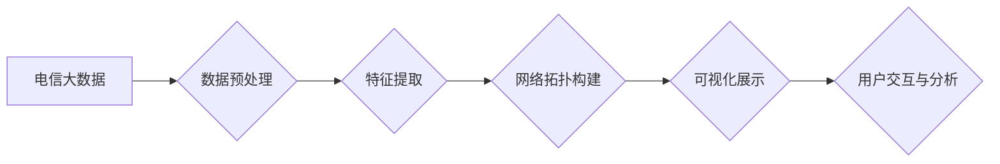

## 基于电信大数据的自我中心网络可视化研究

> 关键词：自我中心网络、电信大数据、可视化分析、网络拓扑、数据挖掘

## 1. 背景介绍

随着互联网和移动技术的飞速发展，电信网络规模不断扩大，数据流量呈指数级增长。电信运营商积累了海量用户行为、网络状态、设备信息等数据，蕴藏着丰富的价值。如何有效挖掘这些数据，洞察网络运行规律和用户需求，对于提升网络运营效率、优化用户体验至关重要。

自我中心网络 (Self-Organizing Network, SON) 是一种能够自动配置、优化和维护网络的智能网络架构。SON 通过对网络状态和用户行为数据的分析，实现网络自适应、自修复、自优化等功能，有效降低运营成本，提升网络性能。

然而，SON 的复杂性使得其网络拓扑结构和运行机制难以直观理解。传统的网络可视化工具往往局限于静态网络拓扑展示，无法有效展现动态变化的网络状态和用户行为数据。因此，基于电信大数据的自我中心网络可视化研究具有重要的理论意义和实际应用价值。

## 2. 核心概念与联系

### 2.1 自我中心网络 (SON)

SON 是一种基于智能算法和数据分析的网络架构，能够自动配置、优化和维护网络。其核心特点包括：

* **自组织:** 网络节点能够自主学习和协作，形成最佳的网络拓扑结构和资源分配方案。
* **自优化:** 网络能够根据实时网络状态和用户需求，动态调整网络参数和资源配置，以实现最佳性能。
* **自修复:** 网络能够自动检测和修复网络故障，确保网络稳定运行。

### 2.2 电信大数据

电信大数据是指电信运营商在运营过程中收集到的海量用户行为、网络状态、设备信息等数据。其特点包括：

* **海量:** 数据量巨大，包含用户通话记录、流量数据、设备信息等多种类型数据。
* **多样化:** 数据类型丰富，包括结构化数据、半结构化数据和非结构化数据。
* **实时性:** 数据更新速度快，需要实时处理和分析。

### 2.3 可视化分析

可视化分析是指通过图形、图表等形式，将复杂的数据信息转化为直观易懂的视觉呈现，帮助用户快速理解数据趋势、发现隐藏规律和做出决策。

**核心概念原理和架构的 Mermaid 流程图**



## 3. 核心算法原理 & 具体操作步骤

### 3.1 算法原理概述

基于电信大数据的自我中心网络可视化研究主要涉及以下核心算法：

* **数据预处理:** 对原始电信大数据进行清洗、转换、整合等操作，去除噪声数据、格式化数据结构，为后续分析提供高质量数据。
* **特征提取:** 从预处理后的电信大数据中提取关键特征，例如用户行为特征、网络状态特征、设备信息特征等，这些特征能够反映网络运行规律和用户需求。
* **网络拓扑构建:** 根据提取的特征信息，构建自我中心网络的动态拓扑结构，例如节点位置、连接关系、流量分配等。
* **可视化展示:** 利用图形、图表等形式，将构建的网络拓扑结构和相关数据信息进行可视化展示，直观地展现网络运行状态和用户行为模式。

### 3.2 算法步骤详解

**数据预处理:**

1. 数据收集: 从电信运营商的数据库中收集用户行为、网络状态、设备信息等数据。
2. 数据清洗: 去除重复数据、缺失数据、异常数据等，保证数据质量。
3. 数据转换: 将数据格式转换为统一格式，方便后续分析。
4. 数据整合: 将不同类型数据进行整合，形成完整的电信大数据集合。

**特征提取:**

1. 用户行为特征: 提取用户通话时长、流量使用量、访问网站类型等特征，反映用户行为模式。
2. 网络状态特征: 提取网络带宽、丢包率、延迟等特征，反映网络运行状态。
3. 设备信息特征: 提取设备类型、操作系统版本、信号强度等特征，反映设备信息。

**网络拓扑构建:**

1. 节点定义: 将用户设备、网络设备等实体定义为网络节点。
2. 连接关系: 根据用户行为数据、网络状态数据，构建节点之间的连接关系，例如用户与网络设备的连接、网络设备之间的连接。
3. 流量分配: 根据流量数据，分配节点之间的流量，反映网络流量流动情况。

**可视化展示:**

1. 图形选择: 选择合适的图形类型，例如节点图、链接图、热力图等，根据数据特点进行可视化展示。
2. 数据映射: 将提取的特征信息映射到图形元素上，例如节点大小、颜色、链接宽度等，直观地展现数据信息。
3. 交互设计: 设计用户交互功能，例如节点点击、链接放大、数据筛选等，方便用户进行数据分析和探索。

### 3.3 算法优缺点

**优点:**

* **直观易懂:** 可视化展示能够直观地展现复杂网络结构和数据信息，方便用户理解和分析。
* **数据挖掘:** 通过可视化分析，能够发现隐藏的网络运行规律和用户行为模式。
* **决策支持:** 可视化分析结果能够为网络运营决策提供支持，例如优化网络资源配置、提升用户体验等。

**缺点:**

* **数据量限制:** 可视化展示效果受限于数据量大小，海量数据难以有效可视化。
* **算法复杂度:** 构建动态网络拓扑结构和可视化展示算法复杂度较高，需要强大的计算能力。
* **交互体验:** 可视化交互体验需要不断优化，才能满足用户多样化的分析需求。

### 3.4 算法应用领域

基于电信大数据的自我中心网络可视化技术具有广泛的应用领域，例如：

* **网络运营:** 优化网络资源配置、提升网络性能、预测网络故障等。
* **用户体验:** 分析用户行为模式、个性化推荐服务、提升用户满意度等。
* **安全保障:** 检测网络异常行为、预防网络攻击、保障网络安全等。
* **学术研究:** 研究网络运行规律、用户行为模式、数据分析方法等。

## 4. 数学模型和公式 & 详细讲解 & 举例说明

### 4.1 数学模型构建

**网络拓扑结构建模:**

* 使用图论模型表示网络拓扑结构，节点代表网络实体，边代表连接关系。
* 节点属性: 每个节点可以拥有属性，例如用户ID、设备类型、网络状态等。
* 边属性: 每个边可以拥有属性，例如流量大小、延迟时间、连接强度等。

**用户行为建模:**

* 使用马尔可夫模型描述用户行为模式，例如用户在不同时间段访问不同网站的概率。
* 使用聚类算法将用户行为数据进行分类，例如将用户分为不同类型用户，例如游戏用户、社交用户、新闻用户等。

**网络状态建模:**

* 使用时间序列模型描述网络状态变化趋势，例如网络流量、丢包率、延迟时间等。
* 使用统计模型分析网络状态特征，例如网络拥塞程度、网络稳定性等。

### 4.2 公式推导过程

**节点重要性度量:**

* 使用 PageRank 算法计算节点重要性，衡量节点在网络中的影响力。
* PageRank 公式: $PR(A) = (1-d) + d \sum_{i \in \text{in}(A)} \frac{PR(i)}{C(i)}$
    * $PR(A)$: 节点 A 的 PageRank 值
    * $d$: 阻尼因子 (0 < d < 1)
    * $in(A)$: 指向节点 A 的所有链接
    * $PR(i)$: 节点 i 的 PageRank 值
    * $C(i)$: 节点 i 的出度

**流量预测:**

* 使用 ARIMA 模型预测网络流量变化趋势。
* ARIMA 模型公式: $y_t = c + \sum_{i=1}^p \phi_i y_{t-i} + \sum_{j=1}^q \theta_j \epsilon_{t-j} + \epsilon_t$
    * $y_t$: 时间 t 的流量值
    * $c$: 常数项
    * $\phi_i$: 自回归系数
    * $\theta_j$: 移动平均系数
    * $\epsilon_t$: 随机误差项

### 4.3 案例分析与讲解

**案例:**

假设电信运营商收集了用户通话记录、流量数据、设备信息等数据，并希望通过可视化分析，了解用户行为模式和网络流量分布情况。

**分析:**

1. 数据预处理: 清洗用户通话记录数据，去除重复数据和异常数据，格式化数据结构。
2. 特征提取: 提取用户通话时长、流量使用量、通话频率等特征，反映用户通话行为模式。
3. 网络拓扑构建: 将用户设备定义为网络节点，根据用户通话记录构建用户之间的连接关系，例如用户之间通话次数、通话时长等。
4. 可视化展示: 使用节点图展示用户网络拓扑结构，节点大小表示用户流量使用量，节点颜色表示用户通话频率。

**结果:**

可视化分析结果可以直观地展现用户行为模式和网络流量分布情况，例如发现特定用户群体具有高流量使用特性，特定时间段网络流量高峰期等。

## 5. 项目实践：代码实例和详细解释说明

### 5.1 开发环境搭建

* 操作系统: Ubuntu 20.04 LTS
* 编程语言: Python 3.8
* 开发工具: Jupyter Notebook, NetworkX, Matplotlib, Seaborn

### 5.2 源代码详细实现

```python
import networkx as nx
import matplotlib.pyplot as plt

# 数据加载
data = {
    'user1': {'traffic': 100, 'call_frequency': 5},
    'user2': {'traffic': 200, 'call_frequency': 10},
    'user3': {'traffic': 50, 'call_frequency': 2},
    'user4': {'traffic': 150, 'call_frequency': 7},
}

# 网络拓扑构建
graph = nx.Graph()
for user in data:
    graph.add_node(user)

# 连接关系构建
for user1 in data:
    for user2 in data:
        if user1!= user2:
            graph.add_edge(user1, user2, weight=data[user1]['call_frequency'])

# 可视化展示
nx.draw(graph, with_labels=True, node_size=[data[user]['traffic'] for user in data], node_color=[data[user]['call_frequency'] for user in data], font_size=10)
plt.show()
```

### 5.3 代码解读与分析

* 数据加载: 将用户数据加载到字典中，每个用户对应流量和通话频率特征。
* 网络拓扑构建: 使用 NetworkX 库构建网络图，每个用户作为节点。
* 连接关系构建: 根据用户通话记录构建用户之间的连接关系，连接权重表示通话频率。
* 可视化展示: 使用 Matplotlib 库绘制网络拓扑图，节点大小表示流量，节点颜色表示通话频率。

### 5.4 运行结果展示

运行代码后，将生成一个用户网络拓扑图，直观地展现用户之间的连接关系和流量分布情况。

## 6. 实际应用场景

### 6.1 网络运营

* **网络资源优化:** 通过可视化分析网络拓扑结构和流量分布