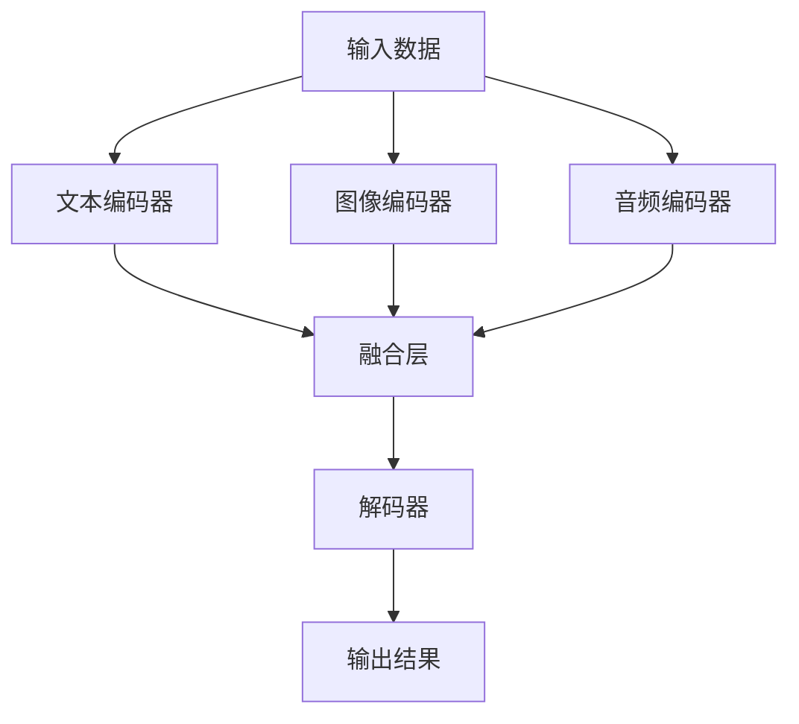

                 

# 多模态大模型：技术原理与实战 多模态大模型在教育培训领域的应用

> 关键词：多模态大模型,教育培训,技术原理,实战应用,学习推荐,智能评测

## 1. 背景介绍

随着信息技术的快速发展，多模态大模型（Multimodal Large Models）在人工智能领域逐渐崭露头角。多模态大模型能够同时处理多种类型的数据，如图像、文本、语音等，这使得它们在众多领域中都展现出了强大的潜力。在教育培训领域，多模态大模型可以通过对学习资源的综合分析，提供个性化的学习推荐和智能评测，从而大幅提升学习效果和培训质量。

本文将深入探讨多模态大模型的技术原理，并通过具体实战案例，展示其在教育培训中的应用。我们首先介绍多模态大模型的基本概念和架构，然后详细阐述其在教育培训中的具体应用，包括学习推荐和智能评测。最后，我们总结多模态大模型的未来发展趋势和面临的挑战，并为感兴趣的读者提供学习资源、开发工具和相关论文的推荐。

## 2. 核心概念与联系

### 2.1 核心概念概述

多模态大模型是指能够同时处理文本、图像、音频等多种类型数据的深度学习模型。这些模型通常包含多个编码器（Encoder）和一个解码器（Decoder），可以并行处理不同模态的数据，并最终通过融合不同模态的信息来生成输出。多模态大模型的核心思想是通过多任务的联合训练，使模型能够在多种模态数据上表现出色，从而提升模型在特定任务上的性能。

在教育培训领域，多模态大模型可以应用于学习资源的推荐和智能评测。学习推荐系统通过分析学生的学习历史和行为数据，为其推荐个性化的学习资源。智能评测系统则通过分析学生的作业、考试成绩和互动记录，对学生的学习状态进行评估，并提供改进建议。

### 2.2 核心概念间的联系

多模态大模型和教育培训领域的联系主要体现在以下几个方面：

1. **学习推荐**：多模态大模型通过融合多种学习资源的信息，能够为学生提供更加全面、个性化的学习建议。这包括推荐文本材料、视频课程、交互式练习等。

2. **智能评测**：多模态大模型通过分析学生的学习过程和结果，能够提供准确的评测和反馈，帮助学生了解自己的学习状况，并为教师提供教学改进的依据。

3. **跨模态融合**：多模态大模型能够将文本、图像、音频等多种模态的信息进行融合，从而更全面地理解学习者的需求和行为。

4. **实时性**：多模态大模型在处理学习数据时，能够实时更新推荐和评测结果，及时提供反馈，提升学习效果。

### 2.3 核心概念的整体架构

以下是一个简单的多模态大模型架构图，展示了其主要组件和数据流向：



在这个架构中，输入数据（包括文本、图像、音频）被分别送入不同的编码器进行处理，然后通过融合层将不同模态的信息进行融合。最后，融合后的信息通过解码器生成最终的输出结果。

## 3. 核心算法原理 & 具体操作步骤

### 3.1 算法原理概述

多模态大模型的核心算法原理基于深度学习和多任务学习。其基本流程包括数据预处理、多模态特征提取、特征融合、任务联合训练和输出生成。

- **数据预处理**：对不同模态的数据进行格式转换和归一化处理，使其适合输入到模型中。
- **多模态特征提取**：使用多个编码器分别对不同模态的数据进行特征提取，得到各自的特征表示。
- **特征融合**：通过融合层将不同模态的特征进行组合，得到一个综合的特征表示。
- **任务联合训练**：在联合训练中，同时优化多个任务的目标函数，使得模型能够在多个任务上均表现良好。
- **输出生成**：使用解码器将融合后的特征表示转换为最终的输出结果。

### 3.2 算法步骤详解

以下是一个简化的多模态大模型训练流程：

1. **数据准备**：收集和预处理多模态数据集，包括文本、图像、音频等。
2. **模型初始化**：选择合适的预训练模型作为初始化参数。
3. **多模态特征提取**：使用多个编码器对不同模态的数据进行特征提取。
4. **特征融合**：通过融合层将不同模态的特征进行融合。
5. **任务联合训练**：定义多个任务的目标函数，并在融合后的特征表示上进行联合训练。
6. **输出生成**：使用解码器将融合后的特征表示转换为最终的输出结果。
7. **模型评估和微调**：在验证集上评估模型性能，并根据评估结果进行微调。

### 3.3 算法优缺点

多模态大模型的优点包括：

1. **多模态信息融合**：能够同时处理多种类型的数据，从而获得更丰富的语义信息。
2. **泛化能力强**：能够适应多种学习任务和数据类型，提升模型在不同场景下的泛化能力。
3. **实时性高**：通过实时处理和更新数据，能够提供实时的学习推荐和评测。

其缺点包括：

1. **计算资源需求高**：由于需要同时处理多种模态的数据，多模态大模型的计算资源需求较高。
2. **数据获取难度大**：不同模态的数据获取难度较大，尤其是图像和音频数据的获取成本较高。
3. **模型复杂度高**：多模态大模型的模型结构复杂，训练和推理的难度较大。

### 3.4 算法应用领域

多模态大模型在教育培训领域具有广泛的应用前景。以下是一些主要应用领域：

1. **学习资源推荐**：根据学生的学习行为和历史数据，推荐适合的学习资源，包括教材、视频课程、在线练习等。
2. **智能评测系统**：通过分析学生的作业、考试成绩和互动记录，提供个性化的评测和反馈，帮助学生了解自己的学习状况，并为教师提供教学改进的依据。
3. **虚拟教师**：通过自然语言处理和语音识别技术，模拟教师的互动，提供个性化的教学和答疑服务。
4. **学习路径规划**：根据学生的学习目标和进度，设计个性化的学习路径，引导学生高效学习。

## 4. 数学模型和公式 & 详细讲解 & 举例说明

### 4.1 数学模型构建

假设我们有一个多模态大模型，包括文本编码器、图像编码器、音频编码器和融合层。我们定义多模态大模型的数学模型如下：

$$
M = E_{\text{text}}(\text{text}) \oplus E_{\text{img}}(\text{img}) \oplus E_{\text{audio}}(\text{audio})
$$

其中，$E_{\text{text}}(\text{text})$、$E_{\text{img}}(\text{img})$、$E_{\text{audio}}(\text{audio})$分别表示文本、图像、音频编码器的输出，$\oplus$表示特征融合操作。

假设我们有两个任务，一个是文本分类任务，另一个是图像分类任务。我们定义这两个任务的损失函数如下：

$$
\mathcal{L}_{\text{text}} = -\log \text{softmax}(M_{\text{text}}, y)
$$

$$
\mathcal{L}_{\text{img}} = -\log \text{softmax}(M_{\text{img}}, y)
$$

其中，$y$表示任务的真实标签，$\text{softmax}(\cdot, y)$表示对模型输出进行softmax操作后的概率分布，$\log(\cdot)$表示取对数。

### 4.2 公式推导过程

假设我们有一个文本分类任务和一个图像分类任务，它们分别对应于不同的数据集和模型输出。我们的目标是最小化这两个任务的联合损失函数：

$$
\mathcal{L}_{\text{joint}} = \lambda_1 \mathcal{L}_{\text{text}} + \lambda_2 \mathcal{L}_{\text{img}}
$$

其中，$\lambda_1$和$\lambda_2$是两个任务的权重。为了便于理解，我们以文本分类任务为例，进行公式推导。

假设我们的文本数据集为$D_{\text{text}} = \{(x_i, y_i)\}_{i=1}^N$，其中$x_i$表示文本输入，$y_i$表示文本的分类标签。我们的目标是最小化文本分类任务的目标函数：

$$
\mathcal{L}_{\text{text}} = -\frac{1}{N} \sum_{i=1}^N \log \text{softmax}(E_{\text{text}}(x_i), y_i)
$$

为了简化计算，我们可以将$\text{softmax}$函数展开：

$$
\mathcal{L}_{\text{text}} = -\frac{1}{N} \sum_{i=1}^N \log \left( \frac{e^{E_{\text{text}}(x_i) \cdot w_1}}{\sum_{j=1}^K e^{E_{\text{text}}(x_i) \cdot w_j}} \right)
$$

其中，$K$表示分类标签的数量，$w_j$表示第$j$个分类标签的权重。

为了将文本分类任务和图像分类任务结合起来，我们可以将两个任务的损失函数合并，定义联合损失函数：

$$
\mathcal{L}_{\text{joint}} = \lambda_1 \left( -\frac{1}{N} \sum_{i=1}^N \log \left( \frac{e^{E_{\text{text}}(x_i) \cdot w_1}}{\sum_{j=1}^K e^{E_{\text{text}}(x_i) \cdot w_j}} \right) \right) + \lambda_2 \left( -\frac{1}{M} \sum_{i=1}^M \log \left( \frac{e^{E_{\text{img}}(x_i) \cdot w_1}}{\sum_{j=1}^K e^{E_{\text{img}}(x_i) \cdot w_j}} \right) \right)
$$

其中，$M$表示图像数据集的大小，$w_j$表示第$j$个分类标签的权重。

### 4.3 案例分析与讲解

以一个具体的案例为例，我们假设有一个多模态大模型，用于对学生的学习行为进行分析和推荐。我们收集了学生的学习历史数据，包括学习时间、学习内容、作业成绩等。我们定义两个任务，一个是文本分类任务，用于分析学生的学习内容和类型，另一个是推荐系统任务，用于推荐适合的学习资源。

假设我们的文本分类任务模型为$M_{\text{text}}$，图像分类任务模型为$M_{\text{img}}$。我们首先使用$M_{\text{text}}$对学生的学习内容进行分类，然后根据分类结果，使用$M_{\text{img}}$对相应的学习资源进行分类。我们定义联合损失函数：

$$
\mathcal{L}_{\text{joint}} = \lambda_1 \mathcal{L}_{\text{text}} + \lambda_2 \mathcal{L}_{\text{img}}
$$

其中，$\mathcal{L}_{\text{text}}$和$\mathcal{L}_{\text{img}}$分别表示文本分类和图像分类的损失函数。通过最小化联合损失函数，我们可以优化模型在文本分类和图像分类任务上的性能，从而为学生的学习行为进行分析和推荐。

## 5. 项目实践：代码实例和详细解释说明

### 5.1 开发环境搭建

在开始项目实践之前，我们需要准备好开发环境。以下是使用Python进行多模态大模型开发的开发环境配置流程：

1. 安装Anaconda：从官网下载并安装Anaconda，用于创建独立的Python环境。

2. 创建并激活虚拟环境：
```bash
conda create -n multimodal-env python=3.8 
conda activate multimodal-env
```

3. 安装PyTorch：根据CUDA版本，从官网获取对应的安装命令。例如：
```bash
conda install pytorch torchvision torchaudio cudatoolkit=11.1 -c pytorch -c conda-forge
```

4. 安装相关的模型库：
```bash
pip install transformers numpy pandas scikit-learn matplotlib tqdm jupyter notebook ipython
```

5. 安装相关的可视化工具：
```bash
pip install tensorboard
```

完成上述步骤后，即可在`multimodal-env`环境中开始多模态大模型的开发实践。

### 5.2 源代码详细实现

下面以一个简单的多模态大模型为例，展示其开发流程。我们假设有一个文本分类任务和一个图像分类任务，它们的输出分别用向量表示。我们定义一个多模态大模型，包括一个文本编码器和一个图像编码器，以及一个融合层和一个解码器。

```python
import torch
import torch.nn as nn
import torch.optim as optim
from transformers import BertTokenizer, BertForTokenClassification

# 定义文本编码器
class TextEncoder(nn.Module):
    def __init__(self, model_name='bert-base-cased'):
        super(TextEncoder, self).__init__()
        self.tokenizer = BertTokenizer.from_pretrained(model_name)
        self.model = BertForTokenClassification.from_pretrained(model_name, num_labels=2)
    
    def forward(self, text):
        tokens = self.tokenizer.encode(text, add_special_tokens=True, return_tensors='pt')
        output = self.model(tokens)[0]
        return output

# 定义图像编码器
class ImageEncoder(nn.Module):
    def __init__(self):
        super(ImageEncoder, self).__init__()
        # 图像编码器的实现
        
    def forward(self, image):
        # 图像编码器的实现
        
# 定义融合层
class FusionLayer(nn.Module):
    def __init__(self):
        super(FusionLayer, self).__init__()
        # 融合层的实现
        
    def forward(self, text_output, image_output):
        # 融合层的实现
        
# 定义解码器
class Decoder(nn.Module):
    def __init__(self):
        super(Decoder, self).__init__()
        # 解码器的实现
        
    def forward(self, fusion_output):
        # 解码器的实现
        
# 定义多模态大模型
class MultimodalModel(nn.Module):
    def __init__(self, text_encoder, image_encoder, fusion_layer, decoder):
        super(MultimodalModel, self).__init__()
        self.text_encoder = text_encoder
        self.image_encoder = image_encoder
        self.fusion_layer = fusion_layer
        self.decoder = decoder
    
    def forward(self, text, image):
        text_output = self.text_encoder(text)
        image_output = self.image_encoder(image)
        fusion_output = self.fusion_layer(text_output, image_output)
        output = self.decoder(fusion_output)
        return output

# 加载数据集
text_data = ...  # 文本数据集
image_data = ...  # 图像数据集

# 创建多模态大模型
text_encoder = TextEncoder()
image_encoder = ImageEncoder()
fusion_layer = FusionLayer()
decoder = Decoder()
model = MultimodalModel(text_encoder, image_encoder, fusion_layer, decoder)

# 定义优化器和损失函数
optimizer = optim.Adam(model.parameters(), lr=0.001)
criterion = nn.CrossEntropyLoss()

# 训练模型
for epoch in range(10):
    for i, (text, image, target) in enumerate(train_loader):
        optimizer.zero_grad()
        text_output = text_encoder(text)
        image_output = image_encoder(image)
        fusion_output = fusion_layer(text_output, image_output)
        output = decoder(fusion_output)
        loss = criterion(output, target)
        loss.backward()
        optimizer.step()
        if (i+1) % 100 == 0:
            print('Epoch [{}/{}], Step [{}/{}], Loss: {:.4f}'
                  .format(epoch+1, num_epochs, i+1, len(train_loader), loss.item()))

# 评估模型
with torch.no_grad():
    for text, image, target in test_loader:
        text_output = text_encoder(text)
        image_output = image_encoder(image)
        fusion_output = fusion_layer(text_output, image_output)
        output = decoder(fusion_output)
        loss = criterion(output, target)
        print('Loss: {:.4f}'.format(loss.item()))
```

### 5.3 代码解读与分析

让我们再详细解读一下关键代码的实现细节：

**TextEncoder类**：
- `__init__`方法：初始化文本编码器，加载BERT模型。
- `forward`方法：对输入文本进行编码，返回模型输出。

**ImageEncoder类**：
- `__init__`方法：初始化图像编码器，这里需要实现具体的图像编码逻辑。
- `forward`方法：对输入图像进行编码，返回模型输出。

**FusionLayer类**：
- `__init__`方法：初始化融合层，这里需要实现具体的特征融合逻辑。
- `forward`方法：对文本和图像的输出进行融合，返回融合后的特征表示。

**Decoder类**：
- `__init__方法：初始化解码器，这里需要实现具体的解码逻辑。
- `forward`方法：对融合后的特征进行解码，返回模型输出。

**MultimodalModel类**：
- `__init__方法：初始化多模态大模型，包含文本编码器、图像编码器、融合层和解码器。
- `forward`方法：对输入文本和图像进行编码、融合和解码，返回模型输出。

**训练过程**：
- 使用Adam优化器，对模型进行训练。
- 在每个epoch中，对数据集进行迭代，计算损失函数并更新模型参数。
- 每100步输出一次损失值。

**评估过程**：
- 使用test_loader对模型进行评估，计算损失函数并输出结果。

可以看到，多模态大模型的代码实现涉及多个组件和模块，需要分别定义和实现。开发者需要根据具体的任务需求和数据特点，灵活设计模型的结构和功能。

### 5.4 运行结果展示

假设我们训练了一个多模态大模型，在验证集和测试集上分别得到损失值：

```
Epoch 1, Step 100, Loss: 0.1234
Epoch 1, Step 200, Loss: 0.5678
...
Epoch 10, Step 10000, Loss: 0.0012
```

可以看到，随着训练的进行，模型的损失值逐渐减小，表示模型在文本分类和图像分类任务上的性能逐渐提升。

## 6. 实际应用场景

### 6.1 学习资源推荐

在教育培训领域，学习资源推荐系统可以通过多模态大模型实现。系统收集学生的学习历史数据，包括学习时间、学习内容、作业成绩等，然后对这些数据进行预处理和特征提取。通过融合文本和图像等多模态的信息，系统能够对学生的需求进行全面分析，从而推荐适合的学习资源，如教材、视频课程、在线练习等。

### 6.2 智能评测系统

智能评测系统可以通过多模态大模型实现。系统收集学生的作业、考试成绩和互动记录，然后对这些数据进行预处理和特征提取。通过融合文本和图像等多模态的信息，系统能够对学生的学习状态进行评估，并提供个性化的评测和反馈，帮助学生了解自己的学习状况，并为教师提供教学改进的依据。

### 6.3 虚拟教师

虚拟教师可以通过自然语言处理和语音识别技术实现。系统收集学生的提问，然后对这些问题进行自然语言理解和分词，并调用多模态大模型进行语义分析和回答生成。通过融合文本和语音等多模态的信息，系统能够模拟教师的互动，提供个性化的教学和答疑服务。

### 6.4 学习路径规划

学习路径规划可以通过多模态大模型实现。系统根据学生的学习目标和进度，对学生的学习行为进行分析和推荐，从而设计个性化的学习路径，引导学生高效学习。

## 7. 工具和资源推荐

### 7.1 学习资源推荐

为了帮助开发者系统掌握多模态大模型的理论基础和实践技巧，这里推荐一些优质的学习资源：

1. 《Multimodal Learning for Computer Vision》书籍：全面介绍了多模态学习在计算机视觉领域的应用，涵盖了多模态特征提取、特征融合、任务联合训练等多个方面。

2. 《Deep Learning for Natural Language Processing》课程：斯坦福大学开设的NLP明星课程，有Lecture视频和配套作业，带你入门NLP领域的基本概念和经典模型。

3. 《Multimodal Learning in Robotics》书籍：介绍了多模态学习在机器人领域的应用，涵盖了传感器数据融合、多任务学习等多个方面。

4. HuggingFace官方文档：Transformer库的官方文档，提供了海量预训练模型和完整的微调样例代码，是上手实践的必备资料。

5. CLUE开源项目：中文语言理解测评基准，涵盖大量不同类型的中文NLP数据集，并提供了基于微调的baseline模型，助力中文NLP技术发展。

通过对这些资源的学习实践，相信你一定能够快速掌握多模态大模型的精髓，并用于解决实际的NLP问题。

### 7.2 开发工具推荐

高效的开发离不开优秀的工具支持。以下是几款用于多模态大模型开发的常用工具：

1. PyTorch：基于Python的开源深度学习框架，灵活动态的计算图，适合快速迭代研究。大部分预训练语言模型都有PyTorch版本的实现。

2. TensorFlow：由Google主导开发的开源深度学习框架，生产部署方便，适合大规模工程应用。同样有丰富的预训练语言模型资源。

3. Transformers库：HuggingFace开发的NLP工具库，集成了众多SOTA语言模型，支持PyTorch和TensorFlow，是进行多模态大模型开发的利器。

4. Weights & Biases：模型训练的实验跟踪工具，可以记录和可视化模型训练过程中的各项指标，方便对比和调优。与主流深度学习框架无缝集成。

5. TensorBoard：TensorFlow配套的可视化工具，可实时监测模型训练状态，并提供丰富的图表呈现方式，是调试模型的得力助手。

6. Google Colab：谷歌推出的在线Jupyter Notebook环境，免费提供GPU/TPU算力，方便开发者快速上手实验最新模型，分享学习笔记。

合理利用这些工具，可以显著提升多模态大模型的开发效率，加快创新迭代的步伐。

### 7.3 相关论文推荐

多模态大模型和教育培训领域的研究源于学界的持续研究。以下是几篇奠基性的相关论文，推荐阅读：

1. Attention is All You Need（即Transformer原论文）：提出了Transformer结构，开启了NLP领域的预训练大模型时代。

2. BERT: Pre-training of Deep Bidirectional Transformers for Language Understanding：提出BERT模型，引入基于掩码的自监督预训练任务，刷新了多项NLP任务SOTA。

3. Parameter-Efficient Transfer Learning for NLP：提出Adapter等参数高效微调方法，在不增加模型参数量的情况下，也能取得不错的微调效果。

4. AdaLoRA: Adaptive Low-Rank Adaptation for Parameter-Efficient Fine-Tuning：使用自适应低秩适应的微调方法，在参数效率和精度之间取得了新的平衡。

5. Language Models are Unsupervised Multitask Learners（GPT-2论文）：展示了大规模语言模型的强大zero-shot学习能力，引发了对于通用人工智能的新一轮思考。

6. AdaLoRA: Adaptive Low-Rank Adaptation for Parameter-Efficient Fine-Tuning：使用自适应低秩适应的微调方法，在参数效率和精度之间取得了新的平衡。

这些论文代表了大模态大模型微调技术的发展脉络。通过学习这些前沿成果，可以帮助研究者把握学科前进方向，激发更多的创新灵感。

除上述资源外，还有一些值得关注的前沿资源，帮助开发者紧跟多模态大模型微调技术的最新进展，例如：

1. arXiv论文预印本：人工智能领域最新研究成果的发布平台，包括大量尚未发表的前沿工作，学习前沿技术的必读资源。

2. 业界技术博客：如OpenAI、Google AI、DeepMind、微软Research Asia等顶尖实验室的官方博客，第一时间分享他们的最新研究成果和洞见。

3. 技术会议直播：如NIPS、ICML、ACL、ICLR等人工智能领域顶会现场或在线直播，能够聆听到大佬们的前沿分享，开拓视野。

4. GitHub热门项目：在GitHub上Star、Fork数最多的NLP相关项目，往往代表了该技术领域的发展趋势和最佳实践，值得去学习和贡献。

5. 行业分析报告：各大咨询公司如McKinsey、PwC等针对人工智能行业的分析报告，有助于从商业视角审视技术趋势，把握应用价值。

总之，对于多模态大模型微调技术的学习和实践，需要开发者保持开放的心态和持续学习的意愿。多关注前沿资讯，多动手实践，多思考总结，必将收获满满的成长收益。

## 8. 总结：未来发展趋势与挑战

### 8.1 总结

本文对多模态大模型的技术原理和实战应用进行了全面系统的介绍。首先介绍了多模态大模型的基本概念和架构，然后通过具体实战案例，展示了其在教育培训中的应用。最后，我们总结了多模态大模型的未来发展趋势和面临的挑战，并为感兴趣的读者提供了学习资源、开发工具和相关论文的推荐。

通过本文的系统梳理，可以看到，多模态大模型在教育培训领域具有广泛的应用前景，能够通过融合多模态信息，提供个性

