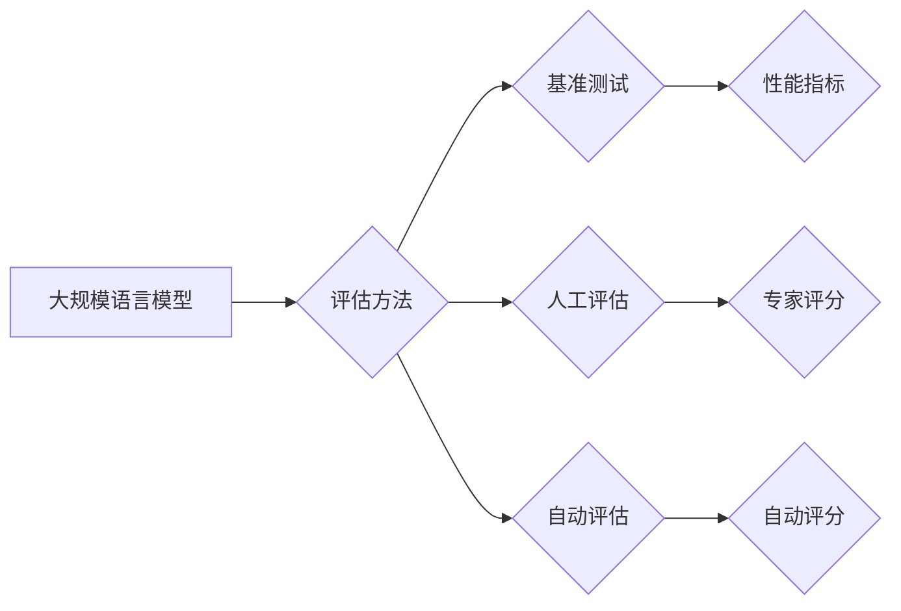

## 大规模语言模型从理论到实践 评估方法

> 关键词：大规模语言模型、评估方法、性能指标、基准测试、公平性、可解释性、伦理

### 1. 背景介绍

近年来，大规模语言模型（LLM）在自然语言处理领域取得了令人瞩目的成就，展现出强大的文本生成、翻译、问答和代码生成能力。这些模型的规模不断扩大，参数数量达到数十亿甚至数千亿，训练数据也变得更加丰富。然而，随着模型规模和复杂度的增加，评估其性能和可靠性变得更加困难。传统的评估方法难以全面衡量 LLMs 的能力，并且存在一些局限性，例如：

* **单一指标的局限性:**  传统的评估方法往往依赖于单一指标，例如准确率或BLEU分数，而忽略了 LLMs 的其他方面，例如流畅度、逻辑性和创造力。
* **人工标注成本高:**  许多评估任务需要人工标注数据，这成本高昂且耗时。
* **缺乏真实世界应用场景:**  一些评估任务缺乏真实世界应用场景，难以反映 LLMs 在实际应用中的表现。

因此，需要开发更加全面、客观、可信的评估方法，以更好地理解和评估 LLMs 的能力。

### 2. 核心概念与联系

**2.1 核心概念**

* **大规模语言模型 (LLM):** 指参数数量庞大（通常超过数十亿）的深度学习模型，能够处理和生成自然语言文本。
* **评估方法:** 用于衡量 LLMs 性能和可靠性的方法，包括基准测试、人工评估和自动评估。
* **性能指标:** 用于量化 LLMs 性能的指标，例如准确率、BLEU分数、ROUGE分数、困惑度等。
* **基准测试:**  针对特定任务设计的标准化测试集和评估指标，用于比较不同 LLMs 的性能。

**2.2 架构图**



**2.3 核心概念联系**

评估方法是衡量 LLMs 性能的关键环节。评估方法可以分为基准测试、人工评估和自动评估三种类型。基准测试使用标准化的测试集和评估指标，可以客观地比较不同 LLMs 的性能。人工评估由专家进行主观评分，可以更全面地评估 LLMs 的能力，但成本较高。自动评估使用算法自动计算性能指标，可以快速高效地评估 LLMs 的性能，但可能缺乏准确性和全面性。

### 3. 核心算法原理 & 具体操作步骤

**3.1 算法原理概述**

评估 LLMs 的性能通常涉及以下几个步骤：

1. **数据准备:**  收集和预处理用于评估的数据集，包括测试集、标注数据等。
2. **模型选择:**  选择合适的 LLMs 进行评估，并根据任务需求进行微调。
3. **性能指标计算:**  使用相应的性能指标计算 LLMs 在测试集上的表现。
4. **结果分析:**  分析评估结果，并进行比较和总结。

**3.2 算法步骤详解**

1. **数据准备:**

* **测试集:**  选择与评估任务相关的标准化测试集，例如 GLUE、SuperGLUE 等。
* **标注数据:**  如果需要进行人工评估或自动评估，需要准备相应的标注数据。

2. **模型选择:**

* **公开模型:**  可以使用公开的 LLMs，例如 BERT、GPT-3 等。
* **微调模型:**  根据评估任务，对公开模型进行微调，以提高其性能。

3. **性能指标计算:**

* **准确率:**  对于分类任务，准确率是指模型正确分类的样本数量占总样本数量的比例。
* **BLEU分数:**  对于机器翻译任务，BLEU分数用于衡量机器翻译结果与参考翻译的相似度。
* **ROUGE分数:**  对于文本摘要任务，ROUGE分数用于衡量文本摘要与参考摘要的相似度。
* **困惑度:**  对于文本生成任务，困惑度是指模型预测下一个词的概率分布的平均熵，越低的困惑度表示模型的预测能力越强。

4. **结果分析:**

* **比较不同模型的性能:**  使用相同的性能指标，比较不同 LLMs 在测试集上的表现。
* **分析模型的优势和劣势:**  根据评估结果，分析 LLMs 的优势和劣势，例如在特定任务上的表现、对数据噪声的鲁棒性等。

**3.3 算法优缺点**

* **优点:**  评估方法可以客观地衡量 LLMs 的性能，并提供有价值的反馈，用于模型改进。
* **缺点:**  评估方法可能存在局限性，例如无法全面衡量 LLMs 的能力，或者难以反映 LLMs 在实际应用中的表现。

**3.4 算法应用领域**

评估方法广泛应用于自然语言处理领域，例如：

* **模型比较:**  比较不同 LLMs 的性能，选择最适合特定任务的模型。
* **模型改进:**  根据评估结果，改进 LLMs 的架构、训练方法或数据预处理方法。
* **研究方向探索:**  探索新的评估方法和指标，以更好地理解和评估 LLMs 的能力。

### 4. 数学模型和公式 & 详细讲解 & 举例说明

**4.1 数学模型构建**

评估 LLMs 的性能通常涉及概率模型和信息论的概念。例如，困惑度可以看作是模型预测下一个词的概率分布的平均熵，可以用以下公式表示：

$$
P(w_i|w_1, w_2,..., w_{i-1}) = \frac{e^{score(w_i|w_1, w_2,..., w_{i-1})}}{\sum_{j} e^{score(w_j|w_1, w_2,..., w_{i-1})}}
$$

其中，$w_i$ 是第 $i$ 个词，$score(w_i|w_1, w_2,..., w_{i-1})$ 是模型预测 $w_i$ 的得分，$P(w_i|w_1, w_2,..., w_{i-1})$ 是模型预测 $w_i$ 的概率。

困惑度公式如下：

$$
Perplexity = 2^{- \frac{1}{N} \sum_{i=1}^{N} log P(w_i|w_1, w_2,..., w_{i-1})}
$$

其中，$N$ 是文本长度。

**4.2 公式推导过程**

困惑度公式的推导过程基于信息论的概念。困惑度可以看作是模型预测下一个词的平均信息量。

**4.3 案例分析与讲解**

假设我们有一个文本序列 "The cat sat on the mat"，模型预测每个词的概率如下：

* The: 0.9
* cat: 0.1
* sat: 0.8
* on: 0.2
* the: 0.9
* mat: 0.1

则困惑度为：

$$
Perplexity = 2^{- \frac{1}{6} (log 0.9 + log 0.1 + log 0.8 + log 0.2 + log 0.9 + log 0.1)} \approx 0.7
$$

困惑度越低，表示模型预测能力越强。

### 5. 项目实践：代码实例和详细解释说明

**5.1 开发环境搭建**

评估 LLMs 通常需要使用 Python 语言和相关的深度学习框架，例如 TensorFlow 或 PyTorch。

**5.2 源代码详细实现**

以下是一个使用 PyTorch 评估 BERT 模型困惑度的简单代码示例：

```python
import torch
from transformers import BertTokenizer, BertModel

# 加载预训练模型和词典
tokenizer = BertTokenizer.from_pretrained('bert-base-uncased')
model = BertModel.from_pretrained('bert-base-uncased')

# 输入文本序列
text = "The cat sat on the mat"

# 将文本序列转换为模型输入格式
inputs = tokenizer(text, return_tensors='pt')

# 获取模型输出
outputs = model(**inputs)

# 计算困惑度
logits = outputs.last_hidden_state[:, 0, :]
probs = torch.softmax(logits, dim=-1)
perplexity = torch.exp(torch.mean(torch.nn.functional.cross_entropy(probs, inputs['input_ids'])))

# 打印困惑度
print(f"Perplexity: {perplexity}")
```

**5.3 代码解读与分析**

* 该代码首先加载预训练的 BERT 模型和词典。
* 然后，将输入文本序列转换为模型输入格式。
* 使用模型对输入文本序列进行编码，获取模型输出。
* 最后，计算模型的困惑度。

**5.4 运行结果展示**

运行该代码后，会输出模型的困惑度值。困惑度值越低，表示模型的预测能力越强。

### 6. 实际应用场景

**6.1 文本生成:**

LLMs 可以用于生成各种类型的文本，例如故事、诗歌、文章、代码等。评估 LLMs 的文本生成能力通常使用 BLEU 分数、ROUGE 分数、困惑度等指标。

**6.2 机器翻译:**

LLMs 可以用于机器翻译，将一种语言的文本翻译成另一种语言。评估 LLMs 的机器翻译能力通常使用 BLEU 分数、METEOR 分数等指标。

**6.3 问答系统:**

LLMs 可以用于构建问答系统，回答用户提出的问题。评估 LLMs 的问答能力通常使用准确率、F1 分数等指标。

**6.4 代码生成:**

LLMs 可以用于生成代码，帮助程序员提高开发效率。评估 LLMs 的代码生成能力通常使用代码准确率、代码可执行性等指标。

**6.5 其他应用场景:**

LLMs 还可应用于其他领域，例如文本摘要、情感分析、对话系统等。

**6.6 未来应用展望**

随着 LLMs 的不断发展，其应用场景将会更加广泛，例如：

* **个性化教育:**  根据学生的学习情况，提供个性化的学习内容和辅导。
* **医疗诊断:**  辅助医生进行疾病诊断，提高诊断准确率。
* **法律服务:**  帮助律师进行法律研究和案件分析。
* **艺术创作:**  辅助艺术家进行创作，生成新的艺术作品。

### 7. 工具和资源推荐

**7.1 学习资源推荐**

* **书籍:**

    * 《深度学习》 - Ian Goodfellow, Yoshua Bengio, Aaron Courville
    * 《自然语言处理》 - Jurafsky, Martin

* **在线课程:**

    * Coursera: 自然语言处理
    * edX: 深度学习

* **博客和网站:**

    * The Gradient
    * Towards Data Science

**7.2 开发工具推荐**

* **深度学习框架:**

    * TensorFlow
    * PyTorch

* **自然语言处理库:**

    * NLTK
    * SpaCy

* **云平台:**

    * Google Cloud AI Platform
    * Amazon SageMaker

**7.3 相关论文推荐**

* **BERT:** Devlin, J., Chang, M. W., Lee, K., & Toutanova, K. (2018). BERT: Pre-training of deep bidirectional transformers for language understanding. arXiv preprint arXiv:1810.04805.
* **GPT-3:** Brown, T. B., Mann, B., Ryder, N., Subbiah, M., Kaplan, J., Dhariwal, P.,... & Amodei, D. (2020). Language models are few-shot learners. arXiv preprint arXiv:2005.14165.

### 8. 总结：未来发展趋势与挑战

**8.1 研究成果总结**

近年来，LLMs 在自然语言