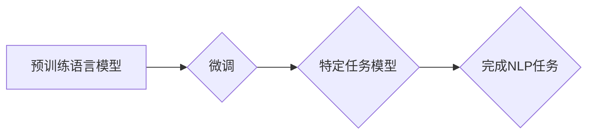

## 如何利用AI LLM优化自然语言处理任务

> 关键词：AI LLM, 自然语言处理, 语言模型, 预训练模型, fine-tuning, 应用场景, 挑战

## 1. 背景介绍

自然语言处理 (NLP) 作为人工智能领域的重要分支，致力于使计算机能够理解、处理和生成人类语言。近年来，随着深度学习技术的飞速发展，基于 Transformer 架构的预训练语言模型 (LLM) 涌现，例如 GPT-3、BERT、LaMDA 等，为 NLP 任务带来了革命性的变革。这些模型通过海量文本数据进行预训练，学习了语言的复杂结构和语义关系，从而在各种 NLP 任务中表现出惊人的能力。

传统的 NLP 方法通常依赖于手工设计的特征工程和规则化方法，需要大量的专业知识和时间投入。而 LLM 的出现则简化了 NLP 任务的开发流程，降低了技术门槛。通过对预训练模型进行微调 (fine-tuning)，可以将其应用于特定领域的特定任务，例如文本分类、问答系统、机器翻译、文本摘要等。

## 2. 核心概念与联系

### 2.1 预训练语言模型 (LLM)

预训练语言模型 (LLM) 是指在海量文本数据上进行预训练的深度学习模型。这些模型通过学习语言的统计规律和语义关系，掌握了丰富的语言知识。常见的 LLM 架构包括 Transformer、BERT、GPT 等。

### 2.2 微调 (Fine-tuning)

微调是指在预训练语言模型的基础上，针对特定任务进行进一步训练的过程。通过微调，可以将预训练模型的通用语言知识应用于特定领域或任务，提高模型的性能。

### 2.3 自然语言处理 (NLP) 任务

自然语言处理 (NLP) 任务是指让计算机能够理解、处理和生成人类语言的任务。常见的 NLP 任务包括：

* 文本分类：将文本分类到预定义的类别中，例如情感分析、主题分类等。
* 问答系统：根据给定的问题，从文本中找到答案。
* 机器翻译：将文本从一种语言翻译成另一种语言。
* 文本摘要：将长文本压缩成短文本，保留关键信息。
* 对话系统：与人类进行自然语言对话。

**Mermaid 流程图**



## 3. 核心算法原理 & 具体操作步骤

### 3.1 算法原理概述

LLM 的核心算法原理是基于 Transformer 架构的深度神经网络。Transformer 模型通过自注意力机制 (self-attention) 学习文本中的长距离依赖关系，并通过多头注意力机制 (multi-head attention) 捕捉不同层面的语义信息。

### 3.2 算法步骤详解

1. **预训练阶段:**

   * 使用海量文本数据训练 Transformer 模型。
   * 目标函数通常是预测下一个词 (next-word prediction) 或掩码语言建模 (masked language modeling)。
   * 通过反向传播算法 (backpropagation) 更新模型参数。

2. **微调阶段:**

   * 使用特定任务的数据对预训练模型进行微调。
   * 调整模型的某些参数，例如最后一层的全连接层。
   * 目标函数根据特定任务而定，例如交叉熵损失 (cross-entropy loss) 用于分类任务。

### 3.3 算法优缺点

**优点:**

* 表现出强大的泛化能力，能够应用于多种 NLP 任务。
* 训练效率高，可以利用预训练模型的知识加速训练过程。
* 模型参数量大，能够捕捉语言的复杂结构和语义关系。

**缺点:**

* 计算资源需求高，需要大量的计算能力进行训练和推理。
* 训练数据量大，需要海量文本数据进行预训练。
* 存在潜在的偏差和错误，需要进行仔细的评估和校正。

### 3.4 算法应用领域

LLM 的应用领域非常广泛，包括：

* **文本生成:** 写作、诗歌创作、代码生成等。
* **机器翻译:** 将文本从一种语言翻译成另一种语言。
* **问答系统:** 根据给定的问题，从文本中找到答案。
* **文本摘要:** 将长文本压缩成短文本，保留关键信息。
* **情感分析:** 分析文本的情感倾向，例如正面、负面、中性。
* **对话系统:** 与人类进行自然语言对话。

## 4. 数学模型和公式 & 详细讲解 & 举例说明

### 4.1 数学模型构建

LLM 的数学模型通常基于 Transformer 架构，其核心是自注意力机制和多头注意力机制。

**自注意力机制:**

自注意力机制允许模型关注输入序列中的不同位置，并计算每个词与其他词之间的相关性。

公式:

$$
Attention(Q, K, V) = softmax(\frac{QK^T}{\sqrt{d_k}})V
$$

其中:

* $Q$：查询矩阵
* $K$：键矩阵
* $V$：值矩阵
* $d_k$：键向量的维度
* $softmax$：softmax 函数

**多头注意力机制:**

多头注意力机制通过使用多个自注意力头，可以捕捉不同层面的语义信息。

公式:

$$
MultiHead(Q, K, V) = Concat(head_1, head_2,..., head_h)W^O
$$

其中:

* $head_i$：第 $i$ 个自注意力头的输出
* $h$：注意力头的数量
* $W^O$：最终输出层的权重矩阵

### 4.2 公式推导过程

自注意力机制的公式推导过程如下:

1. 将输入序列 $X$ 分别转换为查询矩阵 $Q$、键矩阵 $K$ 和值矩阵 $V$。
2. 计算每个词与其他词之间的相关性，使用 $QK^T$ 进行点积，并进行归一化。
3. 使用 softmax 函数将相关性转换为概率分布。
4. 将概率分布与值矩阵 $V$ 进行加权求和，得到每个词的注意力输出。

### 4.3 案例分析与讲解

例如，在机器翻译任务中，可以使用 LLM 将源语言文本翻译成目标语言文本。

* 预训练阶段: 使用大量的平行文本数据训练 LLM 模型。
* 微调阶段: 使用特定语言对的平行文本数据微调 LLM 模型。
* 运行阶段: 将源语言文本输入到微调后的 LLM 模型中，模型会输出目标语言文本。

## 5. 项目实践：代码实例和详细解释说明

### 5.1 开发环境搭建

* Python 3.7+
* PyTorch 或 TensorFlow
* CUDA 和 cuDNN (可选，用于 GPU 加速)

### 5.2 源代码详细实现

```python
# 使用 HuggingFace Transformers 库加载预训练模型
from transformers import AutoModelForSequenceClassification, AutoTokenizer

# 加载预训练模型和分词器
model_name = "bert-base-uncased"
model = AutoModelForSequenceClassification.from_pretrained(model_name)
tokenizer = AutoTokenizer.from_pretrained(model_name)

# 对文本进行预处理
text = "This is a sample text."
inputs = tokenizer(text, return_tensors="pt")

# 将输入数据送入模型进行预测
outputs = model(**inputs)

# 获取预测结果
predicted_class = outputs.logits.argmax().item()
```

### 5.3 代码解读与分析

* 使用 HuggingFace Transformers 库加载预训练模型和分词器。
* 对文本进行预处理，转换为模型可识别的格式。
* 将预处理后的文本数据送入模型进行预测。
* 获取模型预测的结果，例如文本分类的类别。

### 5.4 运行结果展示

运行上述代码后，模型会输出预测结果，例如文本分类的类别。

## 6. 实际应用场景

LLM 在各种实际应用场景中发挥着重要作用，例如：

* **聊天机器人:** 构建更自然、更智能的聊天机器人，能够进行流畅的对话。
* **搜索引擎:** 提升搜索引擎的准确性和相关性，提供更精准的搜索结果。
* **内容创作:** 辅助内容创作，例如生成文章、诗歌、代码等。
* **教育领域:** 提供个性化的学习体验，例如智能辅导、自动批改作业等。
* **医疗领域:** 辅助医生诊断疾病、分析患者数据等。

### 6.4 未来应用展望

LLM 的未来应用前景广阔，例如：

* **更个性化的用户体验:** 根据用户的喜好和需求，提供更个性化的服务和体验。
* **跨语言理解:** 突破语言障碍，实现跨语言的理解和交流。
* **更强大的生成能力:** 生成更逼真、更复杂的文本、图像、音频等内容。
* **人工智能伦理:** 研究和解决 LLM 潜在的伦理问题，例如偏见、虚假信息等。

## 7. 工具和资源推荐

### 7.1 学习资源推荐

* **HuggingFace Transformers:** https://huggingface.co/docs/transformers/index
* **OpenAI API:** https://beta.openai.com/docs/api-reference/introduction
* **Stanford NLP Group:** https://nlp.stanford.edu/

### 7.2 开发工具推荐

* **PyTorch:** https://pytorch.org/
* **TensorFlow:** https://www.tensorflow.org/
* **Jupyter Notebook:** https://jupyter.org/

### 7.3 相关论文推荐

* **BERT: Pre-training of Deep Bidirectional Transformers for Language Understanding:** https://arxiv.org/abs/1810.04805
* **GPT-3: Language Models are Few-Shot Learners:** https://arxiv.org/abs/2005.14165
* **Attention Is All You Need:** https://arxiv.org/abs/1706.03762

## 8. 总结：未来发展趋势与挑战

### 8.1 研究成果总结

LLM 的研究取得了显著进展，展现出强大的语言理解和生成能力，为 NLP 任务带来了革命性的变革。

### 8.2 未来发展趋势

* **模型规模和能力的提升:** 预训练模型的规模将继续扩大，模型的能力将进一步提升。
* **多模态理解:** LLM 将与其他模态数据 (例如图像、音频) 相结合，实现多模态理解。
* **可解释性和透明性:** 研究 LLM 的决策过程，提高模型的可解释性和透明性。
* **高效训练和推理:** 研究更有效的训练和推理方法，降低模型的计算成本。

### 8.3 面临的挑战

* **数据偏见和错误:** LLM 的训练数据可能存在偏见和错误，需要进行仔细的评估和校正。
* **计算资源需求:** 训练大型 LLM 模型需要大量的计算资源，成本较高。
* **伦理问题:** LLM 的应用可能带来伦理问题，例如虚假信息、隐私泄露等，需要进行深入研究和探讨。

### 8.4 研究展望

未来，LLM 研究将继续朝着更强大、更安全、更可解释的方向发展，为人类社会带来更多福祉。

## 9. 附录：常见问题与解答

**Q1: 如何选择合适的预训练模型？**

**A1:** 选择预训练模型需要根据具体的任务和数据特点进行选择。例如，对于文本分类任务，可以使用 BERT 或 RoBERTa 等模型；对于机器翻译任务，可以使用 T5 或 MarianMT 等模型。

**Q2: 如何进行模型微调？**

**A2:** 模型微调需要使用特定任务的数据进行训练，调整模型的某些参数。可以使用 HuggingFace Transformers 库中的微调工具进行操作。

**Q3: 如何评估模型性能？**

**A3:** 模型性能可以使用准确率、召回率、F1-score 等指标进行评估。

**Q4: 如何解决模型过拟合问题？**

**A4:** 模型过拟合问题可以通过使用更