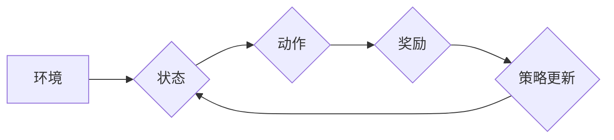

## 强化学习Reinforcement Learning的学习效率与资源管理策略

> 关键词：强化学习、学习效率、资源管理、深度强化学习、Q学习、SARSA、策略梯度、环境模拟、模型压缩、知识蒸馏

## 1. 背景介绍

强化学习 (Reinforcement Learning, RL) 作为机器学习领域的重要分支，近年来取得了显著进展，并在机器人控制、游戏 AI、推荐系统等领域展现出强大的应用潜力。然而，传统的 RL 算法通常需要大量的训练数据和计算资源，这限制了其在实际应用中的推广。因此，提高 RL 的学习效率和资源利用率成为一个重要的研究方向。

随着深度学习技术的快速发展，深度强化学习 (Deep Reinforcement Learning, DRL) 应运而生，它将深度神经网络与强化学习算法相结合，能够学习更复杂、更抽象的策略。然而，DRL 算法的训练过程仍然面临着高计算成本和数据需求的挑战。

## 2. 核心概念与联系

强化学习的核心概念是**代理 (Agent)**、**环境 (Environment)**、**状态 (State)**、**动作 (Action)**、**奖励 (Reward)** 和 **策略 (Policy)**。

* **代理:**  学习和决策的智能体。
* **环境:** 代理与之交互的外部世界。
* **状态:** 环境的当前描述。
* **动作:** 代理可以采取的行动。
* **奖励:** 环境对代理动作的反馈，可以是正向或负向。
* **策略:**  代理根据当前状态选择动作的规则。

**强化学习的学习过程可以概括为以下步骤:**

1. 代理观察环境的当前状态。
2. 根据策略选择一个动作。
3. 环境根据动作产生新的状态和奖励。
4. 代理根据奖励更新策略，以提高未来获得奖励的概率。

**Mermaid 流程图:**



## 3. 核心算法原理 & 具体操作步骤

### 3.1  算法原理概述

强化学习算法主要分为两大类：**值函数方法**和**策略梯度方法**。

* **值函数方法:**  通过学习状态值函数或状态-动作值函数来估计在给定状态下采取特定动作的长期回报。常见的算法包括 Q 学习和 SARSA。
* **策略梯度方法:**  直接优化策略，通过计算策略梯度来更新策略参数。常见的算法包括 REINFORCE 和 A2C。

### 3.2  算法步骤详解

**Q 学习:**

1. 初始化 Q 值表，将所有状态-动作对的 Q 值设置为 0。
2. 在环境中进行交互，观察状态、采取动作、获得奖励和下一个状态。
3. 更新 Q 值表：

$$Q(s,a) \leftarrow Q(s,a) + \alpha [r + \gamma \max_{a'} Q(s',a') - Q(s,a)]$$

其中：

* $s$：当前状态
* $a$：当前动作
* $r$：获得的奖励
* $s'$：下一个状态
* $\alpha$：学习率
* $\gamma$：折扣因子

4. 重复步骤 2 和 3，直到 Q 值表收敛。

**SARSA:**

SARSA 与 Q 学习类似，但更新 Q 值时使用的是当前策略选择的下一个动作的 Q 值，而不是最大 Q 值。

### 3.3  算法优缺点

**Q 学习:**

* **优点:** 
    * 算法简单易懂。
    * 能够学习出最优策略。
* **缺点:** 
    * 需要事先定义所有状态和动作。
    * 对于连续状态和动作空间，难以应用。

**SARSA:**

* **优点:** 
    * 可以应用于连续状态和动作空间。
    * 能够学习出在线策略。
* **缺点:** 
    * 可能会陷入局部最优。

### 3.4  算法应用领域

* **机器人控制:**  训练机器人执行复杂的任务，例如导航、抓取和 Manipulation。
* **游戏 AI:**  开发能够与人类玩家竞争的游戏 AI。
* **推荐系统:**  根据用户的历史行为推荐感兴趣的内容。
* **医疗保健:**  辅助医生诊断疾病和制定治疗方案。

## 4. 数学模型和公式 & 详细讲解 & 举例说明

### 4.1  数学模型构建

强化学习的数学模型可以表示为一个马尔可夫决策过程 (MDP)。

* **状态空间 (S):** 所有可能的系统状态的集合。
* **动作空间 (A):** 代理可以采取的所有动作的集合。
* **转移概率 (P):** 从状态 $s$ 执行动作 $a$ 后转移到状态 $s'$ 的概率。
* **奖励函数 (R):**  代理在状态 $s$ 执行动作 $a$ 后获得的奖励。
* **折扣因子 (γ):**  未来奖励的权重，通常取值在 0 到 1 之间。

### 4.2  公式推导过程

强化学习的目标是找到一个最优策略 $\pi^*$, 使得代理在任何状态下采取该策略的动作能够获得最大的累积奖励。

最优策略可以通过 Bellman 方程来定义：

$$v^*(s) = \max_a \sum_{s',r} P(s',r|s,a) [r + \gamma v^*(s')]$$

其中：

* $v^*(s)$ 是状态 $s$ 的最优价值函数。

### 4.3  案例分析与讲解

**举例说明:**

假设一个代理在玩一个简单的游戏，游戏中有两种状态： "开始" 和 "结束"，代理可以采取两种动作： "前进" 和 "后退"。

* 从 "开始" 状态执行 "前进" 动作，转移到 "结束" 状态，获得奖励 1。
* 从 "开始" 状态执行 "后退" 动作，转移到 "开始" 状态，获得奖励 0。
* 从 "结束" 状态执行任何动作，都无法转移到其他状态，获得奖励 0。

通过 Bellman 方程，我们可以计算出每个状态的最优价值函数，并根据价值函数选择最优动作。

## 5. 项目实践：代码实例和详细解释说明

### 5.1  开发环境搭建

* Python 3.x
* TensorFlow 或 PyTorch
* OpenAI Gym

### 5.2  源代码详细实现

```python
import gym
import numpy as np

# 定义 Q 学习算法
class QLearningAgent:
    def __init__(self, env, alpha=0.1, gamma=0.9, epsilon=0.1):
        self.env = env
        self.alpha = alpha
        self.gamma = gamma
        self.epsilon = epsilon
        self.q_table = np.zeros((env.observation_space.n, env.action_space.n))

    def choose_action(self, state):
        if np.random.uniform(0, 1) < self.epsilon:
            return self.env.action_space.sample()
        else:
            return np.argmax(self.q_table[state])

    def learn(self, state, action, reward, next_state):
        self.q_table[state, action] += self.alpha * (reward + self.gamma * np.max(self.q_table[next_state]) - self.q_table[state, action])

# 创建环境
env = gym.make('CartPole-v1')

# 创建 Q 学习代理
agent = QLearningAgent(env)

# 训练代理
for episode in range(1000):
    state = env.reset()
    done = False
    total_reward = 0
    while not done:
        action = agent.choose_action(state)
        next_state, reward, done, _ = env.step(action)
        agent.learn(state, action, reward, next_state)
        state = next_state
        total_reward += reward
    print(f"Episode {episode+1}, Total Reward: {total_reward}")

# 测试代理
state = env.reset()
while True:
    env.render()
    action = agent.choose_action(state)
    next_state, reward, done, _ = env.step(action)
    state = next_state
    if done:
        break
env.close()
```

### 5.3  代码解读与分析

* **环境搭建:** 使用 OpenAI Gym 创建一个 CartPole 环境。
* **Q 学习代理:** 定义一个 Q 学习代理类，包含学习率、折扣因子、探索率和 Q 值表。
* **动作选择:** 使用 epsilon-greedy 策略选择动作，以一定的概率随机选择动作，以一定的概率选择 Q 值最大的动作。
* **学习更新:** 使用 Bellman 方程更新 Q 值表。
* **训练和测试:** 训练代理并在测试环境中展示其性能。

### 5.4  运行结果展示

运行代码后，代理将学习如何平衡杆，并在测试环境中保持平衡。

## 6. 实际应用场景

### 6.1  机器人控制

强化学习可以用于训练机器人执行复杂的任务，例如导航、抓取和 Manipulation。例如，DeepMind 的 AlphaGo 使用强化学习击败了世界围棋冠军，而 OpenAI 的 Dactyl 使用强化学习学会了用单个手指操作复杂物体。

### 6.2  游戏 AI

强化学习可以用于开发能够与人类玩家竞争的游戏 AI。例如，AlphaStar 使用强化学习在 StarCraft II 中击败了职业玩家，而 OpenAI Five 使用强化学习在 Dota 2 中击败了职业玩家。

### 6.3  推荐系统

强化学习可以用于个性化推荐系统，根据用户的历史行为推荐感兴趣的内容。例如，Netflix 使用强化学习推荐电影和电视剧，而 Amazon 使用强化学习推荐商品。

### 6.4  未来应用展望

强化学习在未来将有更广泛的应用，例如：

* **自动驾驶:** 训练自动驾驶汽车在复杂环境中安全驾驶。
* **医疗保健:** 辅助医生诊断疾病和制定治疗方案。
* **金融:** 开发智能投资策略。

## 7. 工具和资源推荐

### 7.1  学习资源推荐

* **书籍:**
    * Reinforcement Learning: An Introduction by Richard S. Sutton and Andrew G. Barto
    * Deep Reinforcement Learning Hands-On by Maxim Lapan
* **课程:**
    * Stanford CS234: Reinforcement Learning
    * DeepMind's Reinforcement Learning course
* **博客:**
    * OpenAI Blog
    * DeepMind Blog

### 7.2  开发工具推荐

* **TensorFlow:** 深度学习框架，支持强化学习算法的实现。
* **PyTorch:** 深度学习框架，支持强化学习算法的实现。
* **OpenAI Gym:** 强化学习环境库，提供各种标准的强化学习环境。

### 7.3  相关论文推荐

* **Deep Q-Network (DQN):** Mnih et al., 2015
* **Proximal Policy Optimization (PPO):** Schulman et al., 2017
* **Trust Region Policy Optimization (TRPO):** Schulman et al., 2015

## 8. 总结：未来发展趋势与挑战

### 8.1  研究成果总结

近年来，强化学习取得了显著进展，在多个领域取得了突破性成果。

* **算法创新:** 出现了许多新的强化学习算法，例如 DQN、PPO 和 TRPO，这些算法能够学习更复杂、更抽象的策略。
* **应用扩展:** 强化学习的应用范围不断扩展，从游戏 AI 到机器人控制，再到推荐系统，都有着广泛的应用。
* **理论研究:** 强化学习的理论基础也在不断深入，例如对强化学习算法的稳定性和泛化能力的研究。

