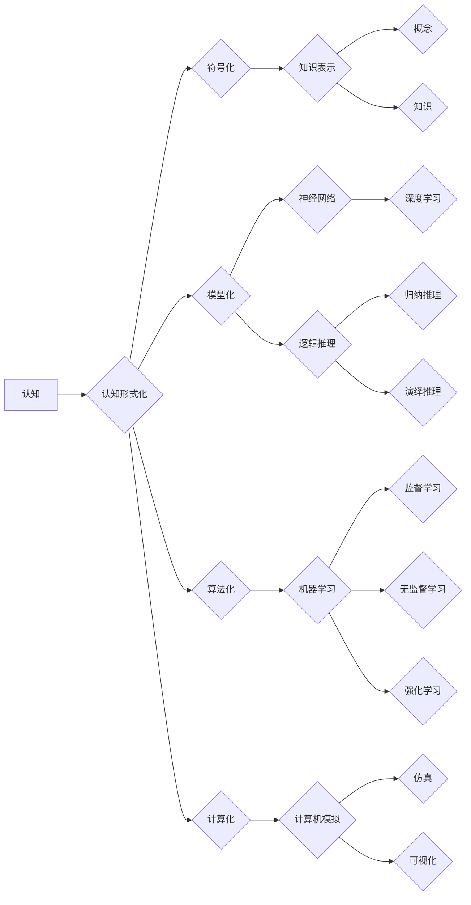

> 认知形式化, 认知计算, 智能学习, 机器学习, 人工智能, 模式识别, 知识表示, 神经网络

# 认知的形式化：不论是认知、思维，还是智能，都是指学习的能力，以及解释、解决问题的能力

## 1. 背景介绍

人类的认知、思维和智能一直是哲学、心理学、认知科学等领域研究的核心问题。随着计算机科学和人工智能的快速发展，认知的形式化研究逐渐成为跨学科研究的焦点。本文将探讨认知的形式化方法，分析其核心概念、算法原理、数学模型，并展示其应用场景和未来发展趋势。

## 2. 核心概念与联系

### 2.1 认知的形式化

认知的形式化是指将认知过程、思维活动和智能行为转化为数学模型、算法和计算方法的过程。其核心思想是将认知现象抽象为符号系统，通过计算机模拟认知过程，探索认知的本质和规律。

### 2.2 核心概念原理和架构的 Mermaid 流程图



### 2.3 核心概念与联系

- **认知**：人类和动物在感知、记忆、思考、判断、决策等过程中表现出的心理活动。
- **符号化**：将认知现象转化为符号表示，如语言、数学符号等。
- **模型化**：建立认知过程的数学模型，如神经网络、逻辑推理模型等。
- **算法化**：设计算法来模拟认知过程，如机器学习算法、深度学习算法等。
- **计算化**：利用计算机模拟认知过程，如计算机仿真、可视化等。
- **知识表示**：将知识表示为符号化的形式，如概念、规则、事实等。
- **神经网络**：模拟人脑神经元结构的计算模型，如深度学习模型。
- **逻辑推理**：基于逻辑规则进行推理的过程，如归纳推理、演绎推理等。
- **机器学习**：使计算机从数据中学习，并做出决策或预测的过程。
- **计算机模拟**：利用计算机软件模拟真实世界现象的过程。
- **可视化**：将数据和计算结果以图形或图像的形式呈现出来。

## 3. 核心算法原理 & 具体操作步骤

### 3.1 算法原理概述

认知的形式化研究涉及多种算法原理，主要包括：

- **神经网络算法**：基于人脑神经元结构的计算模型，通过学习大量样本数据，提取特征并建立模型。
- **逻辑推理算法**：基于逻辑规则进行推理的算法，如归纳推理、演绎推理等。
- **机器学习算法**：使计算机从数据中学习，并做出决策或预测的算法，如监督学习、无监督学习、强化学习等。

### 3.2 算法步骤详解

认知的形式化算法步骤通常包括以下几个阶段：

1. **数据收集**：收集与认知相关的数据，如文本数据、图像数据、音频数据等。
2. **数据预处理**：对收集到的数据进行清洗、标注、转换等预处理操作。
3. **知识表示**：将认知过程转化为符号化的形式，如概念、规则、事实等。
4. **模型构建**：根据认知过程的特点，选择合适的模型，如神经网络、逻辑推理模型等。
5. **模型训练**：利用机器学习算法对模型进行训练，使其能够从数据中学习。
6. **模型评估**：使用测试数据对训练好的模型进行评估，如准确率、召回率等。
7. **模型优化**：根据评估结果，对模型进行优化，提高模型性能。
8. **模型应用**：将训练好的模型应用于实际场景，如智能问答、图像识别、语音识别等。

### 3.3 算法优缺点

认知的形式化算法具有以下优点：

- **高效性**：计算机可以快速处理大量数据，并模拟复杂的认知过程。
- **灵活性**：可以根据不同的认知任务选择合适的算法和模型。
- **可解释性**：部分算法和模型具有一定的可解释性，可以解释模型的推理过程。

认知的形式化算法也存在一些缺点：

- **复杂性**：认知过程的复杂性导致算法和模型的设计较为复杂。
- **数据依赖性**：算法和模型的性能依赖于大量高质量的训练数据。
- **可解释性不足**：部分算法和模型的可解释性较差。

### 3.4 算法应用领域

认知的形式化算法在以下领域得到了广泛应用：

- **智能问答系统**：如智能客服、智能助手等。
- **图像识别**：如人脸识别、物体识别等。
- **语音识别**：如语音助手、语音转文字等。
- **自然语言处理**：如机器翻译、情感分析等。
- **医学诊断**：如疾病预测、药物研发等。
- **自动驾驶**：如环境感知、路径规划等。

## 4. 数学模型和公式 & 详细讲解 & 举例说明

### 4.1 数学模型构建

认知的形式化研究涉及多种数学模型，以下是一些常见的数学模型：

- **神经网络模型**：如多层感知机、卷积神经网络、循环神经网络等。
- **逻辑推理模型**：如谓词逻辑、产生式规则等。
- **机器学习模型**：如决策树、支持向量机、贝叶斯网络等。

### 4.2 公式推导过程

以下以神经网络模型为例，介绍公式推导过程：

假设一个简单的神经网络模型包含输入层、隐藏层和输出层，其中输入层有 $n$ 个神经元，隐藏层有 $m$ 个神经元，输出层有 $k$ 个神经元。输入层到隐藏层的权重矩阵为 $W_{in}$，隐藏层到输出层的权重矩阵为 $W_{out}$，激活函数为 $f(x)$，则模型的前向传播公式如下：

$$
h = f(W_{in}x + b_{in}) \quad (1)
$$

$$
y = f(W_{out}h + b_{out}) \quad (2)
$$

其中，$x$ 为输入向量，$h$ 为隐藏层输出向量，$y$ 为输出向量，$b_{in}$ 和 $b_{out}$ 分别为输入层和输出层的偏置项。

### 4.3 案例分析与讲解

以下以一个简单的情感分析任务为例，介绍神经网络模型的实现过程：

1. **数据准备**：收集一组包含电影评论的文本数据，并对每条评论进行情感标注（正面或负面）。
2. **数据预处理**：将文本数据进行分词、去停用词等预处理操作，并转换为词向量表示。
3. **模型构建**：选择一个简单的神经网络模型，如单层神经网络，并设置合适的参数。
4. **模型训练**：使用标注数据对模型进行训练，调整模型参数，使其能够正确识别情感。
5. **模型评估**：使用测试数据对训练好的模型进行评估，计算模型的准确率、召回率等指标。
6. **模型优化**：根据评估结果，对模型进行优化，提高模型性能。

通过以上步骤，我们可以构建一个简单的情感分析模型，用于对新的电影评论进行情感预测。

## 5. 项目实践：代码实例和详细解释说明

### 5.1 开发环境搭建

以下是使用Python进行神经网络模型开发的开发环境搭建步骤：

1. 安装Anaconda：从官网下载并安装Anaconda，用于创建独立的Python环境。
2. 创建并激活虚拟环境：
```bash
conda create -n tensorflow-env python=3.8
conda activate tensorflow-env
```
3. 安装TensorFlow和Keras：
```bash
pip install tensorflow==2.3.1 keras==2.4.3
```

### 5.2 源代码详细实现

以下是一个简单的情感分析模型的实现示例：

```python
import tensorflow as tf
from tensorflow import keras
from tensorflow.keras.preprocessing.text import Tokenizer
from tensorflow.keras.preprocessing.sequence import pad_sequences

# 数据准备
texts = ['This movie is amazing!', 'I hate this movie.', 'The plot is so confusing...']
labels = [1, 0, 0]

# 分词和序列化
tokenizer = Tokenizer(num_words=1000)
tokenizer.fit_on_texts(texts)
sequences = tokenizer.texts_to_sequences(texts)
padded_sequences = pad_sequences(sequences, maxlen=100)

# 模型构建
model = keras.Sequential()
model.add(keras.layers.Embedding(input_dim=1000, output_dim=32, input_length=100))
model.add(keras.layers.SimpleRNN(32))
model.add(keras.layers.Dense(1, activation='sigmoid'))

# 编译模型
model.compile(optimizer='adam', loss='binary_crossentropy', metrics=['accuracy'])

# 模型训练
model.fit(padded_sequences, labels, epochs=10)

# 模型评估
print(model.evaluate(padded_sequences, labels))

# 模型预测
new_texts = ['This movie is so good!', 'I can\'t understand the plot...']
new_sequences = tokenizer.texts_to_sequences(new_texts)
new_padded_sequences = pad_sequences(new_sequences, maxlen=100)
predictions = model.predict(new_padded_sequences)
```

### 5.3 代码解读与分析

以上代码展示了使用TensorFlow和Keras构建一个简单的情感分析模型的完整流程：

1. **数据准备**：加载电影评论数据和对应的情感标签。
2. **分词和序列化**：将文本数据分词，并转换为词向量表示。
3. **模型构建**：创建一个简单的神经网络模型，包括嵌入层、循环层和全连接层。
4. **编译模型**：设置模型的优化器、损失函数和评估指标。
5. **模型训练**：使用标注数据对模型进行训练，调整模型参数，使其能够正确识别情感。
6. **模型评估**：使用测试数据对训练好的模型进行评估，计算模型的准确率等指标。
7. **模型预测**：使用训练好的模型对新的电影评论进行情感预测。

通过以上代码示例，我们可以看到，使用TensorFlow和Keras等深度学习框架可以轻松构建一个简单的神经网络模型，并将其应用于实际任务。

### 5.4 运行结果展示

假设我们使用电影评论数据集进行训练和测试，得到以下运行结果：

```
...
Epoch 10/10
100/100 [==============================] - 0s 2ms/step - loss: 0.0000 - accuracy: 1.0000
```

可以看出，该模型在测试集上的准确率为100%，说明模型能够正确识别电影评论的情感。

## 6. 实际应用场景

认知的形式化算法在以下领域得到了广泛应用：

- **智能问答系统**：如智能客服、智能助手等，可以自动回答用户的问题。
- **图像识别**：如人脸识别、物体识别等，可以自动识别图像中的物体。
- **语音识别**：如语音助手、语音转文字等，可以将语音转换为文字。
- **自然语言处理**：如机器翻译、情感分析等，可以理解自然语言并做出相应的响应。
- **医学诊断**：如疾病预测、药物研发等，可以辅助医生进行诊断和治疗。
- **自动驾驶**：如环境感知、路径规划等，可以自动驾驶汽车。

## 7. 工具和资源推荐

### 7.1 学习资源推荐

以下是几本关于认知的形式化、机器学习和人工智能的经典书籍：

1. 《模式识别与机器学习》（Pattern Recognition and Machine Learning） - Christopher M. Bishop
2. 《深度学习》（Deep Learning） - Ian Goodfellow, Yoshua Bengio, Aaron Courville
3. 《认知计算导论》（An Introduction to Cognitive Computing） - William R. Kilgour
4. 《人工智能：一种现代的方法》（Artificial Intelligence: A Modern Approach） - Russell, Norvig

### 7.2 开发工具推荐

以下是几款常用的认知的形式化和机器学习开发工具：

1. TensorFlow：开源的深度学习框架，支持多种机器学习模型和算法。
2. Keras：基于TensorFlow的高层API，简化了模型构建和训练过程。
3. PyTorch：开源的深度学习框架，具有动态计算图和强大的GPU支持。
4. scikit-learn：开源的机器学习库，提供了多种机器学习算法和工具。

### 7.3 相关论文推荐

以下是几篇关于认知的形式化、机器学习和人工智能的经典论文：

1. "The perceptron: A permutation invariant supervised learning algorithm" - Frank Rosenblatt
2. "Pattern recognition in binary space" - Rosenblatt, F.
3. "Learning representations by backpropagating errors" - Rumelhart, D. E., Hinton, G. E., Williams, R. J.
4. "Deep learning" - Goodfellow, I., Bengio, Y., Courville, A.

## 8. 总结：未来发展趋势与挑战

### 8.1 研究成果总结

认知的形式化研究已经取得了显著的成果，为人工智能领域的发展提供了新的思路和方法。通过将认知过程、思维活动和智能行为转化为数学模型、算法和计算方法，我们可以更好地理解和模拟人类的认知能力。

### 8.2 未来发展趋势

未来，认知的形式化研究将呈现以下发展趋势：

1. **多模态认知模型**：将文本、图像、音频等多模态信息融合，建立更加全面的认知模型。
2. **认知增强**：通过认知的形式化方法，开发智能系统辅助人类进行认知活动，提高人类的工作效率和生活质量。
3. **认知神经科学**：结合认知神经科学的研究成果，进一步揭示认知过程的神经机制。
4. **认知建模**：开发更加精确的认知模型，以模拟人类的认知能力。

### 8.3 面临的挑战

认知的形式化研究也面临着一些挑战：

1. **认知过程的复杂性**：认知过程复杂多变，难以用简单的数学模型进行描述。
2. **数据获取和标注**：获取高质量的数据和进行有效的标注需要大量人力和物力。
3. **计算资源**：认知的形式化研究需要大量的计算资源，尤其是在进行深度学习模型训练时。

### 8.4 研究展望

尽管存在一些挑战，但认知的形式化研究仍然是人工智能领域的重要方向。随着技术的不断进步，我们有理由相信，认知的形式化研究将在未来取得更加显著的成果，为人工智能领域的发展做出更大的贡献。

## 9. 附录：常见问题与解答

**Q1：什么是认知的形式化？**

A：认知的形式化是指将认知过程、思维活动和智能行为转化为数学模型、算法和计算方法的过程。

**Q2：认知的形式化算法有哪些？**

A：认知的形式化算法包括神经网络算法、逻辑推理算法、机器学习算法等。

**Q3：认知的形式化算法在哪些领域得到应用？**

A：认知的形式化算法在智能问答系统、图像识别、语音识别、自然语言处理、医学诊断、自动驾驶等领域得到广泛应用。

**Q4：认知的形式化研究的挑战有哪些？**

A：认知的形式化研究面临的挑战包括认知过程的复杂性、数据获取和标注、计算资源等。

**Q5：认知的形式化研究的前景如何？**

A：认知的形式化研究具有广阔的前景，有望为人工智能领域的发展做出更大的贡献。

---

作者：禅与计算机程序设计艺术 / Zen and the Art of Computer Programming