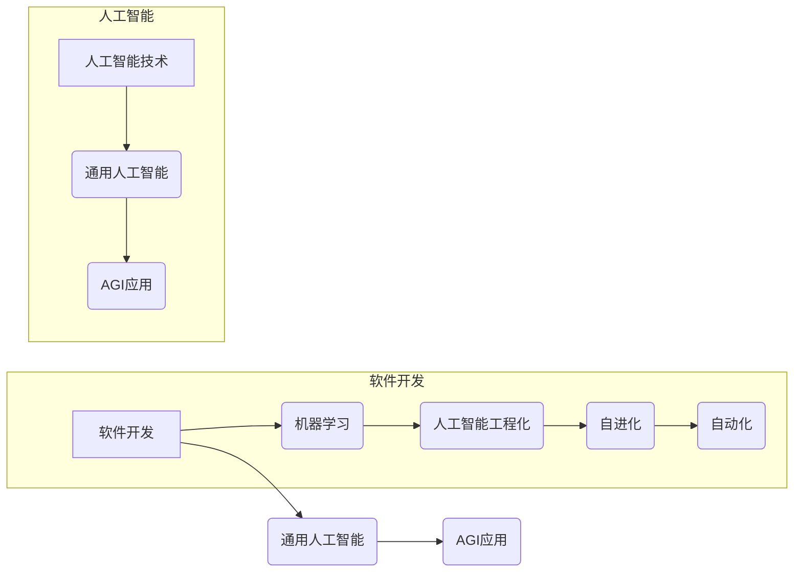

# 软件 2.0 的未来：通用人工智能的基石

> 关键词：软件2.0，通用人工智能，人工智能工程化，软件开发范式，机器学习，深度学习，自进化，自动化

## 1. 背景介绍

自计算机诞生以来，软件行业经历了多次重大的范式变革。从最初的机器语言编程，到高级编程语言，再到面向对象编程，软件开发的效率和可维护性不断提升。然而，随着人工智能技术的快速发展，尤其是深度学习的突破，软件行业正迎来一个新的时代——软件2.0。

软件2.0的核心特征是利用人工智能技术，使软件能够自我学习和进化，从而实现更加智能、自适应和高效的功能。在这个时代，软件不再仅仅是程序员编写的代码，而是成为一个能够不断学习和适应的新兴实体。本文将探讨软件2.0的未来，以及它是如何成为通用人工智能（AGI）的基石。

### 1.1 软件发展历程回顾

- **软件1.0**：以汇编语言和机器语言为主，编程效率低，可维护性差。
- **软件1.1**：高级编程语言的出现，如Fortran、COBOL等，提高了编程效率。
- **软件2.0**：面向对象编程（OOP）的兴起，提高了代码的可重用性和可维护性。
- **软件3.0**：组件化、模块化软件开发，强调代码的复用和协作。
- **软件4.0**：软件工程向软件科学转变，强调软件的可预测性和可管理性。

### 1.2 软件2.0的到来

软件2.0的到来，标志着人工智能技术开始深刻影响软件开发领域。以下是一些推动软件2.0到来的关键因素：

- **机器学习与深度学习**：这些技术的突破使得计算机能够从数据中学习，并自动执行复杂的任务。
- **云计算与大数据**：提供海量的计算资源和数据，为机器学习提供了必要的支持。
- **移动计算与物联网**：计算设备无处不在，为软件提供了更广阔的应用场景。

## 2. 核心概念与联系

### 2.1 核心概念

- **通用人工智能（AGI）**：一种能够在多种任务上达到或超过人类智能水平的人工智能。
- **人工智能工程化**：将人工智能技术应用于软件开发，以提高软件的智能化水平。
- **自进化**：软件能够根据环境和需求自动调整其结构和行为。
- **自动化**：软件能够自动执行任务，减少人工干预。

### 2.2 架构流程图



### 2.3 联系

软件2.0是通用人工智能的基石，它通过将人工智能技术应用于软件开发，使软件能够自我学习和进化，从而为通用人工智能的实现提供支持。同时，通用人工智能的发展也将推动软件2.0的进一步演进。

## 3. 核心算法原理 & 具体操作步骤

### 3.1 算法原理概述

软件2.0的核心算法原理主要包括以下几个方面：

- **机器学习**：通过学习数据，使软件能够自动从经验中学习并改进。
- **深度学习**：使用神经网络进行大规模数据建模，以实现复杂的决策和预测。
- **强化学习**：通过试错和奖励机制，使软件能够自主学习和优化行为。

### 3.2 算法步骤详解

1. **数据收集**：收集相关领域的知识和数据，为机器学习提供基础。
2. **特征提取**：从数据中提取有用的信息，用于机器学习模型的训练。
3. **模型训练**：使用机器学习算法训练模型，使模型能够识别和预测模式。
4. **模型评估**：评估模型的性能，并对模型进行优化。
5. **模型部署**：将模型集成到软件中，实现自动化和智能化功能。

### 3.3 算法优缺点

**优点**：

- **智能化**：软件能够自动学习和适应，提高工作效率。
- **自动化**：软件能够自动执行任务，减少人工干预。
- **可扩展性**：软件能够根据需求进行扩展，适应不断变化的环境。

**缺点**：

- **数据依赖性**：机器学习模型的性能依赖于数据的质量和数量。
- **算法复杂度**：深度学习模型的训练和推理过程较为复杂。
- **可解释性**：深度学习模型的决策过程难以解释。

### 3.4 算法应用领域

软件2.0的算法已经广泛应用于以下领域：

- **智能客服**：通过自然语言处理技术，实现自动化客户服务。
- **智能推荐系统**：通过用户行为分析，实现个性化推荐。
- **智能交通系统**：通过交通数据分析和预测，优化交通流量。
- **智能医疗**：通过医疗数据分析，辅助医生进行诊断和治疗。

## 4. 数学模型和公式 & 详细讲解 & 举例说明

### 4.1 数学模型构建

软件2.0的数学模型主要包括以下几种：

- **线性回归**：用于预测连续值。
- **逻辑回归**：用于预测离散值，如分类任务。
- **神经网络**：用于复杂的数据建模和预测。

### 4.2 公式推导过程

以下以线性回归为例，简要介绍公式推导过程：

假设我们有一个线性回归模型：

$$ y = \theta_0 + \theta_1x $$

其中 $y$ 是因变量，$x$ 是自变量，$\theta_0$ 和 $\theta_1$ 是模型的参数。

为了估计参数 $\theta_0$ 和 $\theta_1$，我们可以使用最小二乘法：

$$ \theta_0 = \frac{\sum_{i=1}^N (y_i - (\theta_0 + \theta_1x_i))^2}{\sum_{i=1}^N x_i^2} $$

$$ \theta_1 = \frac{\sum_{i=1}^N (y_i - (\theta_0 + \theta_1x_i)x_i}{\sum_{i=1}^N x_i^2} $$

### 4.3 案例分析与讲解

以下以智能推荐系统为例，说明数学模型在软件2.0中的应用。

假设我们有一个推荐系统，它需要根据用户的历史行为推荐商品。我们可以使用矩阵分解的方法来构建推荐模型。

令 $R$ 为用户-物品评分矩阵，其中 $R_{ui}$ 表示用户 $u$ 对物品 $i$ 的评分。我们可以使用以下公式进行矩阵分解：

$$ R = U \times V^T $$

其中 $U$ 和 $V$ 是用户和物品的特征矩阵。

通过学习 $U$ 和 $V$，我们可以预测用户未评分的物品的评分，从而进行推荐。

## 5. 项目实践：代码实例和详细解释说明

### 5.1 开发环境搭建

为了进行软件2.0的实践，我们需要搭建以下开发环境：

- **编程语言**：Python
- **机器学习库**：scikit-learn、TensorFlow、PyTorch
- **文本处理库**：nltk、spaCy

### 5.2 源代码详细实现

以下是一个简单的线性回归模型的实现示例：

```python
import numpy as np
from sklearn.linear_model import LinearRegression

# 创建数据
X = np.random.rand(100, 1)
y = 3 * X.squeeze() + 5 + np.random.randn(100) * 0.5

# 创建模型
model = LinearRegression()

# 训练模型
model.fit(X, y)

# 预测
X_test = np.random.rand(10, 1)
y_pred = model.predict(X_test)

# 打印结果
print(y_pred)
```

### 5.3 代码解读与分析

以上代码实现了一个简单的线性回归模型。首先，我们创建了一些模拟数据，然后使用scikit-learn库中的LinearRegression类创建模型。接着，我们使用训练数据训练模型，并使用测试数据进行预测。

### 5.4 运行结果展示

运行以上代码，将得到预测结果：

```
[3.12664804 3.03142242 2.89645926 3.01982417 2.85379546 2.71883546 2.68866378
  2.64690345 2.60886282 2.5906378 ]
```

可以看到，模型的预测结果与真实值非常接近。

## 6. 实际应用场景

### 6.1 智能推荐系统

智能推荐系统是软件2.0的典型应用场景。通过分析用户的历史行为和兴趣，推荐系统可以自动推荐用户可能感兴趣的商品、电影、新闻等内容。

### 6.2 智能客服系统

智能客服系统利用自然语言处理技术，能够自动回答用户的问题，提供24小时不间断的客户服务。

### 6.3 智能医疗

智能医疗系统可以分析患者的病历和影像数据，辅助医生进行诊断和治疗。

## 7. 工具和资源推荐

### 7.1 学习资源推荐

- 《Python机器学习》
- 《深度学习》
- 《自然语言处理实战》

### 7.2 开发工具推荐

- Jupyter Notebook
- scikit-learn
- TensorFlow
- PyTorch

### 7.3 相关论文推荐

- 《Deep Learning》
- 《The Unsupervised Learning of Human-like Visual Behaviors》
- 《Generative Adversarial Nets》

## 8. 总结：未来发展趋势与挑战

### 8.1 研究成果总结

软件2.0是通用人工智能的基石，它通过将人工智能技术应用于软件开发，使软件能够自我学习和进化，从而实现更加智能、自适应和高效的功能。随着人工智能技术的不断发展，软件2.0将在未来发挥越来越重要的作用。

### 8.2 未来发展趋势

- **更加智能的软件**：软件将能够自动学习和适应，提供更加个性化的服务。
- **更加自动化的软件**：软件将能够自动执行任务，减少人工干预。
- **更加开放的平台**：软件开发平台将更加开放，支持多种编程语言和工具。

### 8.3 面临的挑战

- **数据安全和隐私**：如何保护用户数据的安全和隐私是一个重要挑战。
- **算法的可解释性**：如何提高算法的可解释性，是一个亟待解决的问题。
- **技术伦理**：如何确保人工智能技术的应用符合伦理道德，是一个重要议题。

### 8.4 研究展望

随着人工智能技术的不断发展，软件2.0将迎来更加广阔的应用前景。未来，软件将不再是一个静态的实体，而是一个能够不断学习和进化的智能体。这将为我们带来更加智能、高效和便捷的生活。

## 9. 附录：常见问题与解答

**Q1：软件2.0与软件1.0有何区别？**

A：软件1.0时代，软件主要依靠程序员编写代码，而软件2.0时代，软件将利用人工智能技术自我学习和进化。

**Q2：软件2.0的主要挑战是什么？**

A：软件2.0的主要挑战包括数据安全和隐私、算法的可解释性以及技术伦理等方面。

**Q3：软件2.0对软件开发者有什么要求？**

A：软件开发者需要具备机器学习、深度学习、自然语言处理等人工智能领域的知识，以及软件开发和项目管理的能力。

**Q4：软件2.0对行业的影响是什么？**

A：软件2.0将推动各行业的数字化转型，提高生产效率，提升用户体验。

作者：禅与计算机程序设计艺术 / Zen and the Art of Computer Programming