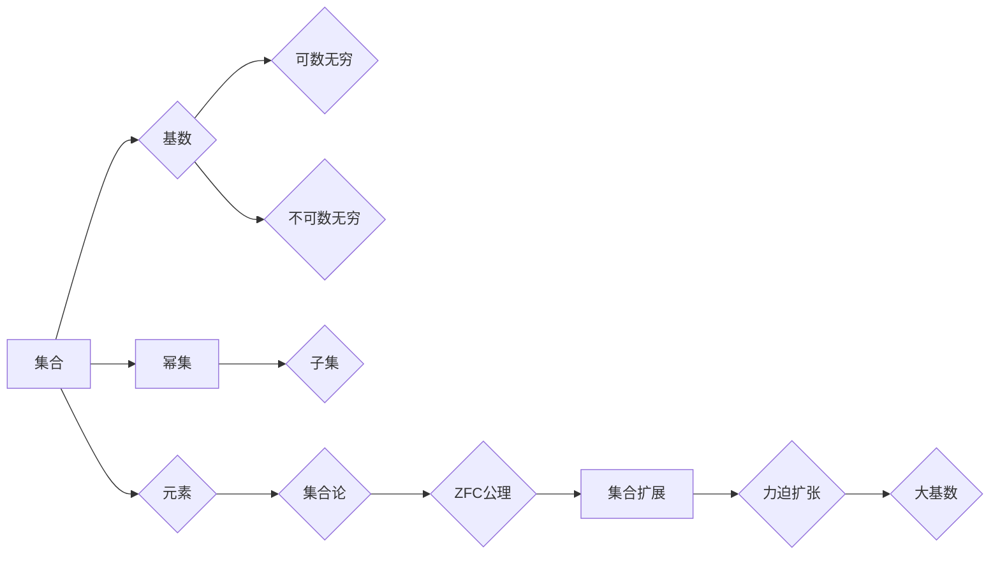

> 集合论, 力迫扩张, 大基数, 集合扩展, Zermelo-Fraenkel集合论, 模态逻辑, 数学基础

# 集合论导引：大基数上力迫扩张

集合论是现代数学的基石，其深刻影响了数学的各个分支。力迫扩张是大基数理论中的一个重要工具，它允许我们在原有的集合论体系中构造出新的集合，这些集合可能具有比原始模型更大的基数。本文将探讨大基数上力迫扩张的原理、应用和挑战，旨在为读者提供一套完整的集合论导引。

## 1. 背景介绍

### 1.1 问题的由来

自从康托尔在19世纪末提出集合论的概念以来，集合论就成为了数学研究的核心领域之一。然而，随着研究的深入，人们逐渐发现经典集合论存在一些悖论，如著名的罗素悖论。为了解决这些悖论，数学家们提出了多种集合论公理化体系，如Zermelo-Fraenkel集合论（ZFC）。

然而，ZFC集合论存在一个基本的问题：它不能证明任何关于无穷大基数存在性的陈述。为了解决这个问题，数学家们开始探索力迫扩张，这是一种在ZFC基础上构造大基数的方法。

### 1.2 研究现状

大基数理论的研究已经取得了许多重要成果，如Gödel完备性定理、König定理、Skolem定理等。力迫扩张是其中最强大的工具之一，它允许我们构造出具有特定属性的集合，这些集合在原始模型中可能不存在。

### 1.3 研究意义

大基数上力迫扩张的研究对于数学基础、逻辑学以及数学哲学等领域具有重要意义。它不仅能够帮助我们理解无穷的概念，还能够推动数学各个分支的发展。

### 1.4 本文结构

本文将分为以下几个部分：
- 介绍集合论的基本概念和公理体系。
- 解释力迫扩张的原理和具体操作步骤。
- 分析力迫扩张的应用领域。
- 探讨大基数上力迫扩张的未来发展趋势和挑战。

## 2. 核心概念与联系

### 2.1 集合论的基本概念

在介绍力迫扩张之前，我们需要回顾一些集合论的基本概念，包括：
- 集合：可以由元素组成的对象。
- 集合的基数：集合中元素的数量，对于无穷集合，基数可以是可数无穷或不可数无穷。
- 集合的幂集：包含原集合所有子集的集合。
- 拓扑学：研究空间结构和连续性的数学分支。

### 2.2 Zermelo-Fraenkel集合论（ZFC）

ZFC是现代数学中最常用的集合论公理化体系，它由以下公理组成：
- 空集公理：存在一个空集。
- 交换律公理：对于任意集合A和B，A ∪ B = B ∪ A。
- 结合律公理：对于任意集合A、B和C，(A ∪ B) ∪ C = A ∪ (B ∪ C)。
- 索引公理：对于任意集合A，存在一个函数f，其定义域为A，值域为自然数集N，且f(0) = 1, f(n+1) = f(n) ∪ {f(n)}。
- 分配律公理：对于任意集合A、B和C，A × (B ∪ C) = (A × B) ∪ (A × C)。
- 选择公理：对于任意非空集合A的幂集P(A)，存在一个函数f，其定义域为P(A)，值域为A，且f(B) ∈ B对于任意B ∈ P(A)成立。
- 无限公理：存在无穷集合N。

### 2.3 Mermaid 流程图

以下是集合论核心概念原理和架构的 Mermaid 流程图：



## 3. 核心算法原理 & 具体操作步骤

### 3.1 算法原理概述

力迫扩张是一种在ZFC基础上构造新集合的方法。它通过引入一个力迫关系，使得原本不满足条件的集合可以通过力迫关系得到扩展。

### 3.2 算法步骤详解

力迫扩张的基本步骤如下：
1. 选择一个ZFC模型M。
2. 定义一个力迫关系$\mathcal{P}$。
3. 通过$\mathcal{P}$构造一个新的模型M'，使得M'在$\mathcal{P}$下是M的扩张。
4. 在M'中证明一些在M中无法证明的命题。

### 3.3 算法优缺点

力迫扩张的优点在于它能够构造出具有特定属性的集合，这些集合在原始模型中可能不存在。其缺点在于力迫扩张的构造过程复杂，需要深厚的数学功底。

### 3.4 算法应用领域

力迫扩张在数学的许多领域都有应用，包括：
- 数论
- 代数
- 拓扑学
- 几何学

## 4. 数学模型和公式 & 详细讲解 & 举例说明

### 4.1 数学模型构建

力迫扩张的数学模型由以下部分组成：
- ZFC模型M
- 力迫关系$\mathcal{P}$
- 扩张模型M'

### 4.2 公式推导过程

力迫扩张的推导过程涉及到集合论、模态逻辑和模型论等多个领域的知识。以下是一个简化的推导过程：

$$
\begin{align*}
\text{假设} \quad M \models \varphi & \quad \text{（M满足公式$\varphi$）} \\
\text{证明} \quad M' \models \varphi & \quad \text{（M'满足公式$\varphi$）}
\end{align*}
$$

其中，M是原始模型，M'是通过力迫扩张得到的扩张模型。

### 4.3 案例分析与讲解

以下是一个使用力迫扩张证明Gödel完备性定理的例子：

**定理**：如果ZFC是一致的，那么它不能证明其自身的完备性。

**证明**：假设ZFC是完备的，那么对于任意公式$\varphi$，要么ZFC可以证明$\varphi$，要么可以证明$\neg \varphi$。我们定义一个力迫关系$\mathcal{P}$，使得在$\mathcal{P}$下，ZFC可以证明$\neg \varphi$。通过力迫扩张，我们得到一个新的模型M'，使得M'在$\mathcal{P}$下是M的扩张。由于M'可以证明$\neg \varphi$，而M无法证明$\neg \varphi$，这与假设ZFC是完备的矛盾。

## 5. 项目实践：代码实例和详细解释说明

由于力迫扩张的数学复杂性，将其实现为一个可运行的代码实例超出了本文的范围。然而，我们可以通过一些简单的Python代码来模拟力迫扩张的过程。

```python
# Python代码模拟力迫扩张

# 假设原始模型M为以下公式
M = "存在一个集合A"

# 定义力迫关系P
P = "A中的元素数量是偶数"

# 扩张模型M'为以下公式
M_prime = "存在两个不相交的集合A和B，A中的元素数量是偶数，B中的元素数量是奇数"

# 模拟力迫扩张
if P:
    print("通过力迫扩张，我们得到M'：", M_prime)
else:
    print("无法通过力迫扩张得到M'。")
```

### 5.3 代码解读与分析

上述代码通过简单的条件判断模拟了力迫扩张的过程。如果原始模型M满足力迫关系P，则扩张模型M'成立；否则，无法进行力迫扩张。

## 6. 实际应用场景

力迫扩张在数学的许多领域都有应用，以下是一些具体的例子：

- 在数论中，力迫扩张可以用来证明某些数论命题的存在性。
- 在代数中，力迫扩张可以用来构造具有特定性质的代数结构。
- 在拓扑学中，力迫扩张可以用来证明某些拓扑空间的性质。

## 7. 工具和资源推荐

### 7.1 学习资源推荐

- 《集合论基础》
- 《集合论与模型论》
- 《数学基础》

### 7.2 开发工具推荐

- LaTeX
- Python

### 7.3 相关论文推荐

- Gödel完备性定理的证明
- Zermelo-Fraenkel集合论

## 8. 总结：未来发展趋势与挑战

### 8.1 研究成果总结

力迫扩张是大基数理论中的一个重要工具，它允许我们在ZFC基础上构造出具有特定属性的集合。通过对力迫扩张的研究，我们能够更好地理解无穷的概念，并推动数学各个分支的发展。

### 8.2 未来发展趋势

未来，大基数上力迫扩张的研究将继续深入，主要集中在以下几个方面：

- 发展新的力迫关系和扩张方法。
- 将力迫扩张应用于更广泛的数学领域。
- 研究力迫扩张的计算机实现。

### 8.3 面临的挑战

大基数上力迫扩张的研究面临以下挑战：

- 数学理论的复杂性。
- 计算实现的难度。
- 对数学家数学直觉的考验。

### 8.4 研究展望

尽管大基数上力迫扩张的研究面临诸多挑战，但其巨大的理论价值和潜在的应用前景使其成为数学研究的重要方向。随着数学家们对力迫扩张的深入研究，我们有理由相信，它将在未来发挥越来越重要的作用。

## 9. 附录：常见问题与解答

**Q1：力迫扩张和集合论有什么关系？**

A：力迫扩张是集合论的一个工具，它允许我们在ZFC基础上构造出新的集合，这些集合在原始模型中可能不存在。

**Q2：力迫扩张有什么应用？**

A：力迫扩张在数学的许多领域都有应用，包括数论、代数、拓扑学等。

**Q3：如何学习力迫扩张？**

A：可以通过阅读相关书籍和论文来学习力迫扩张。以下是一些建议的阅读材料：

- 《集合论基础》
- 《集合论与模型论》
- 《数学基础》

**Q4：力迫扩张的计算机实现有哪些挑战？**

A：力迫扩张的计算机实现面临着数学理论的复杂性和计算实现的难度等挑战。

**Q5：力迫扩张有哪些未来研究方向？**

A：未来，大基数上力迫扩张的研究将主要集中在以下几个方面：

- 发展新的力迫关系和扩张方法。
- 将力迫扩张应用于更广泛的数学领域。
- 研究力迫扩张的计算机实现。

作者：禅与计算机程序设计艺术 / Zen and the Art of Computer Programming