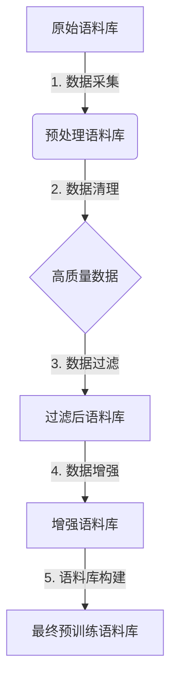

# 大规模语言模型从理论到实践：大语言模型预训练数据

## 1. 背景介绍

### 1.1 问题的由来

在过去几年中，大规模语言模型在自然语言处理(NLP)领域取得了令人瞩目的成就。这些模型通过在海量文本数据上进行预训练,学习到了丰富的语言知识和上下文信息,从而在下游任务中表现出色。然而,预训练数据的质量和多样性对模型性能的影响至关重要。选择合适的预训练语料库并对其进行适当的处理,是确保语言模型获得良好泛化能力的关键。

### 1.2 研究现状

目前,研究人员已经探索了多种预训练语料库,包括网页数据、书籍、新闻文章等。一些常用的预训练语料库包括:

- **Wikipedia**: 维基百科是一个覆盖广泛主题的大型开放式在线百科全书,其文本质量较高,但主题范围有限。
- **BookCorpus**: 包含数千本不同类型的书籍,主题范围广泛,但可能存在版权问题。
- **OpenWebText**: 从互联网上爬取的大量网页数据,数据量巨大,但质量参差不齐。

除了选择合适的语料库外,对预训练数据进行适当的清理、过滤和增强也是非常重要的。例如,去除低质量数据、处理噪声、增加多样性等。

### 1.3 研究意义

高质量的预训练数据对于构建强大的语言模型至关重要。合理选择和处理预训练语料库,可以使模型学习到更加丰富、准确和多样的语言知识,从而在下游任务中表现更佳。此外,探索新型预训练数据的构建方法,也有助于推动语言模型的发展和应用。

### 1.4 本文结构

本文将全面探讨大规模语言模型预训练数据的理论与实践。我们将首先介绍核心概念和原理,然后深入探讨预训练数据构建的核心算法、数学模型和公式推导。接下来,我们将提供实际项目实践的代码示例和详细解释。最后,我们将讨论实际应用场景、工具和资源推荐,并总结未来发展趋势和挑战。

## 2. 核心概念与联系

在探讨预训练数据构建之前,我们需要了解一些核心概念和它们之间的联系。

1. **语言模型(Language Model,LM)**: 语言模型是一种概率模型,旨在捕捉语言序列的统计规律。它可以估计一个句子或单词序列的概率,从而支持自然语言生成、理解和其他任务。

2. **预训练(Pre-training)**: 预训练是指在大规模无标注语料库上训练语言模型,使其学习到丰富的语言知识和上下文信息。这是一种自监督学习方式,不需要人工标注的数据。

3. **微调(Fine-tuning)**: 微调是指在特定下游任务的标注数据上,对预训练模型进行进一步训练和调整,使其适应该任务的特征。

4. **语料库(Corpus)**: 语料库是用于训练语言模型的大规模文本数据集合。选择合适的语料库对于构建高质量的语言模型至关重要。

5. **数据清理(Data Cleaning)**: 数据清理是指对原始语料库进行预处理,去除低质量数据、噪声和重复内容,以提高数据质量。

6. **数据增强(Data Augmentation)**: 数据增强是指通过各种技术(如回译、插入、置换等)人工生成新的训练样本,以增加数据多样性和模型泛化能力。

这些概念相互关联,共同构建了高质量的语言模型。选择合适的语料库、进行适当的数据清理和增强,是确保预训练数据质量的关键。

## 3. 核心算法原理与具体操作步骤

### 3.1 算法原理概述

构建高质量的预训练语料库涉及多个核心算法,包括数据采集、清理、过滤和增强等。这些算法的目标是从原始数据中提取高质量、多样化的文本,并对其进行适当的处理,以满足语言模型训练的需求。



### 3.2 算法步骤详解

1. **数据采集**
   - 从网络、书籍、新闻等多种来源采集原始文本数据。
   - 处理不同格式的文件,如txt、pdf、html等。
   - 去除元数据、标记和其他无关信息。

2. **数据清理**
   - 去除低质量数据,如重复内容、垃圾信息等。
   - 处理噪声数据,如错误拼写、格式错误等。
   - 进行语言识别和过滤,保留目标语言的数据。

3. **数据过滤**
   - 基于长度、主题、质量等标准过滤文本。
   - 使用机器学习模型评估文本质量。
   - 保留高质量、多样化的数据。

4. **数据增强**
   - 使用回译(Back-translation)生成新的句子。
   - 通过插入、置换、混合等方式生成新样本。
   - 增加数据多样性,提高模型泛化能力。

5. **语料库构建**
   - 将清理、过滤和增强后的数据合并。
   - 进行随机打乱和分割,构建训练、验证和测试集。
   - 对数据进行必要的标记和预处理。

### 3.3 算法优缺点

优点:
- 可以从多种来源采集大规模数据。
- 通过清理、过滤和增强,提高数据质量和多样性。
- 算法模块化,可以根据需求进行定制和扩展。

缺点:
- 数据采集和处理过程耗时耗力。
- 需要大量计算资源进行数据处理和增强。
- 算法参数调整和模型评估需要专业知识。

### 3.4 算法应用领域

预训练语料库构建算法可以应用于多个领域:

- 自然语言处理(NLP)
- 机器翻译
- 对话系统
- 文本生成
- 信息检索
- 等等

任何需要大规模语言模型的应用领域,都可以从高质量的预训练语料库中受益。

## 4. 数学模型和公式详细讲解与举例说明

### 4.1 数学模型构建

在构建预训练语料库时,我们需要一些数学模型来评估和优化数据质量。一个常用的模型是基于n-gram的语言模型,它可以估计一个单词序列的概率。

对于一个长度为m的单词序列$W=w_1,w_2,...,w_m$,根据链式法则,我们可以将其概率分解为:

$$P(W)=P(w_1)P(w_2|w_1)P(w_3|w_1,w_2)...P(w_m|w_1,w_2,...,w_{m-1})$$

由于计算复杂度太高,我们通常使用n-gram近似,即只考虑前n-1个词的影响:

$$P(W) \approx \prod_{i=1}^{m}P(w_i|w_{i-n+1},...,w_{i-1})$$

这个模型可以用于评估文本质量、过滤低质量数据,以及生成新的句子进行数据增强。

### 4.2 公式推导过程

我们可以使用最大似然估计(Maximum Likelihood Estimation,MLE)来估计n-gram模型的参数。对于一个语料库$C$,我们希望最大化该语料库的概率:

$$\begin{aligned}
\hat{\theta} &= \arg\max_{\theta}P(C|\theta)\
           &= \arg\max_{\theta}\prod_{W\in C}P(W|\theta)\
           &= \arg\max_{\theta}\sum_{W\in C}\log P(W|\theta)
\end{aligned}$$

其中$\theta$表示模型参数。由于对数函数是单调递增的,我们可以最大化对数似然:

$$\begin{aligned}
L(\theta) &= \sum_{W\in C}\log P(W|\theta)\
          &= \sum_{W\in C}\sum_{i=1}^{m}\log P(w_i|w_{i-n+1},...,w_{i-1};\theta)
\end{aligned}$$

使用贝叶斯估计和平滑技术(如加法平滑),我们可以估计n-gram概率:

$$P(w_i|w_{i-n+1},...,w_{i-1};\theta) = \frac{c(w_{i-n+1},...,w_i)+\alpha}{c(w_{i-n+1},...,w_{i-1})+V\alpha}$$

其中$c(\cdot)$表示计数函数,$\alpha$是平滑参数,$V$是词汇表大小。

通过最大化对数似然函数,我们可以获得n-gram模型的最优参数估计,用于评估和生成文本。

### 4.3 案例分析与讲解

为了更好地理解n-gram模型在预训练语料库构建中的应用,我们来分析一个具体案例。

假设我们有一个包含5个句子的小型语料库:

1. 我爱学习自然语言处理
2. 自然语言处理是一门很有趣的学科
3. 学习自然语言处理需要努力
4. 自然语言处理有广阔的应用前景
5. 我对自然语言处理很感兴趣

我们可以使用2-gram模型来估计这个语料库的概率。首先,我们统计2-gram计数:

```
我 爱: 1
爱 学习: 1
学习 自然: 2
自然 语言: 3
语言 处理: 3
处理 是: 1
是 一门: 1
一门 很: 1
很 有趣: 1
有趣 的: 1
的 学科: 1
需要 努力: 1
有 广阔: 1
广阔 的: 1
应用 前景: 1
对 自然: 1
感 兴趣: 1
```

假设我们使用加法平滑,平滑参数$\alpha=0.1$,词汇表大小$V=10$。根据公式,我们可以估计2-gram概率,例如:

$$P(学习|自然) = \frac{c(自然,学习)+\alpha}{c(自然)+V\alpha} = \frac{2+0.1}{3+10\times0.1} \approx 0.48$$

$$P(语言|自然) = \frac{c(自然,语言)+\alpha}{c(自然)+V\alpha} = \frac{3+0.1}{3+10\times0.1} \approx 0.72$$

通过计算所有2-gram概率的乘积,我们可以获得整个语料库的概率估计值。这个估计值可以用于评估语料库质量,或者通过采样生成新的句子进行数据增强。

### 4.4 常见问题解答

1. **为什么要使用平滑技术?**
   平滑技术可以解决数据稀疏问题,避免出现零概率,从而提高模型的泛化能力。

2. **如何选择合适的n-gram模型阶数?**
   较大的n通常可以捕捉更多上下文信息,但也会增加数据稀疏和计算复杂度。通常需要在模型性能和效率之间权衡。

3. **n-gram模型是否足以捕捉长距离依赖关系?**
   n-gram模型只考虑了有限的上下文信息,无法很好地捕捉长距离依赖关系。因此,在实践中我们通常会使用更复杂的神经网络模型,如Transformer等。

4. **如何评估语料库质量?**
   除了使用n-gram模型估计概率外,我们还可以使用其他指标,如困惑度(Perplexity)、BLEU分数等,来评估语料库质量。

## 5. 项目实践:代码实例和详细解释说明

在本节中,我们将提供一个实际项目的代码示例,展示如何构建高质量的预训练语料库。我们将使用Python和相关库(如NLTK、spaCy等)来实现数据采集、清理、过滤和增强的各个步骤。

### 5.1 开发环境搭建

首先,我们需要安装所需的Python库:

```bash
pip install nltk spacy tqdm
```

然后,我们需要下载NLT