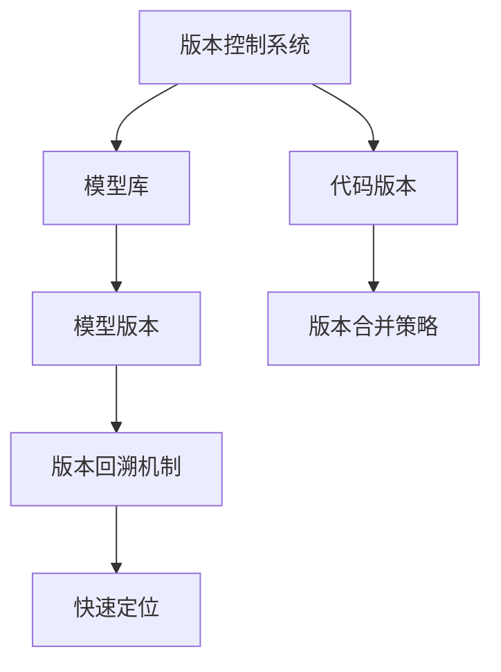

                 

# 神经网络模型的版本控制与协作开发

## 1. 背景介绍

### 1.1 问题由来

在当下复杂的软件和数据工程项目中，神经网络（Neural Networks, NNs）模型的开发和迭代成为了核心组成部分。模型从数据准备、特征工程、模型设计到评估迭代，过程往往涉及到多个部门和团队的协作，这要求在模型开发的整个生命周期中，实现对模型版本的精细化管理和高效协作开发。

然而，神经网络模型与传统软件相比，具有高度的非确定性和复杂的内部结构。一方面，模型的权重调整依赖于大量的训练数据，这使得模型变得容易受到数据偏差的影响；另一方面，模型的调整过程通常需要经过多轮迭代，存在大量的历史版本，不易维护和回溯。这使得模型的版本控制和协作开发成为了一个难点。

为了解决这一问题，本文将详细阐述神经网络模型的版本控制和协作开发的基本概念、关键技术和最佳实践。

### 1.2 问题核心关键点

神经网络模型的版本控制与协作开发的核心关键点主要包括：

- **版本控制**：如何有效管理模型的历史版本，确保模型演变的可追溯性。
- **协作开发**：如何在多团队协作中，保持模型一致性，降低沟通成本。
- **版本合并**：如何在确保模型稳定性的前提下，快速实现新旧版本的合并。
- **版本回溯**：如何快速定位并回溯至某个历史版本，以分析模型的稳定性或性能变化。

接下来的文章将从核心概念入手，逐步深入探讨这些问题。

## 2. 核心概念与联系

### 2.1 核心概念概述

神经网络模型的版本控制和协作开发涉及多个核心概念，包括版本控制系统、模型库、代码版本、模型版本、版本合并策略、版本回溯机制等。以下是这些核心概念的简要介绍：

- **版本控制系统（Version Control System, VCS）**：用于管理代码和数据文件的变化历史，以便追踪、回溯、比较和合并不同版本的系统工具。
- **模型库（Model Repository）**：用于集中存储和管理神经网络模型的代码、参数和模型架构的版本。
- **代码版本（Code Version）**：软件开发中用于管理代码库不同版本的系统工具。
- **模型版本（Model Version）**：用于管理神经网络模型历史版本和当前状态的系统工具。
- **版本合并策略（Version Merge Strategy）**：在多团队协作开发中，确保模型一致性的合并策略。
- **版本回溯机制（Version Rollback Mechanism）**：快速定位并回溯至某个历史版本的技术手段。

### 2.2 概念间的关系

这些核心概念之间的逻辑关系可以通过以下Mermaid流程图来展示：



这个流程图展示了版本控制系统的核心作用，及其与模型库、代码版本、模型版本、版本合并策略和版本回溯机制之间的关系：

1. 版本控制系统是整个模型的核心，用于管理代码和数据版本的历史。
2. 模型库集中存储和管理模型的历史版本和当前状态。
3. 代码版本管理与模型版本紧密相关，用于管理模型的代码部分。
4. 模型版本管理基于模型库，确保模型演变的可追溯性。
5. 版本合并策略用于在多团队协作中保持模型的一致性。
6. 版本回溯机制可以快速定位并回溯至某个历史版本。

这些概念共同构成了神经网络模型的版本控制和协作开发框架，使得模型的管理和开发过程更加系统化和高效化。

## 3. 核心算法原理 & 具体操作步骤

### 3.1 算法原理概述

神经网络模型的版本控制和协作开发主要依赖于版本控制系统、模型库、代码版本、模型版本、版本合并策略和版本回溯机制等核心概念。这些概念的原理和操作流程如下：

1. **版本控制系统**：利用版本控制技术，如Git、SVN等，管理代码和数据文件的变化历史，支持版本合并和回溯。
2. **模型库**：采用集中式或分布式的数据库系统，如TensorFlow Hub、PyTorch Hub等，存储和管理模型的代码、参数和模型架构的版本。
3. **代码版本**：使用版本控制系统，如Git，管理模型的代码库不同版本，确保代码的完整性和一致性。
4. **模型版本**：通过在模型库中记录模型参数和架构的变化历史，管理模型的不同版本，以便追溯和对比。
5. **版本合并策略**：在多团队协作中，采用如Git Merge、Git Rebase等策略，确保模型版本的一致性，避免冲突和数据丢失。
6. **版本回溯机制**：通过版本控制系统，快速定位并回溯至某个历史版本，获取模型的参数和架构信息，分析模型变化。

### 3.2 算法步骤详解

以下是神经网络模型版本控制和协作开发的具体操作步骤：

1. **初始化模型库**：选择合适的模型库，如TensorFlow Hub、PyTorch Hub等，初始化模型库并创建模型版本。

2. **代码版本管理**：使用版本控制系统（如Git），将模型的代码库与版本控制系统集成，确保代码库的完整性和一致性。

3. **版本记录与存储**：在模型库中，记录和存储模型的历史版本，包括模型参数、架构和训练日志等。

4. **版本合并策略**：在多团队协作中，采用如Git Merge、Git Rebase等策略，确保模型版本的一致性，避免冲突和数据丢失。

5. **版本回溯机制**：使用版本控制系统，快速定位并回溯至某个历史版本，获取模型的参数和架构信息，分析模型变化。

### 3.3 算法优缺点

神经网络模型的版本控制和协作开发具有以下优点：

- **历史追溯**：版本控制系统可以记录模型的历史版本，便于追溯和回溯。
- **一致性保障**：版本合并策略确保模型版本的一致性，避免数据冲突和丢失。
- **高效协作**：协作开发中，版本控制系统可以降低沟通成本，提升团队协作效率。

然而，也存在一些缺点：

- **复杂性高**：模型版本和代码版本的管理较为复杂，需要开发人员具备一定的版本控制知识。
- **性能开销**：版本控制系统的版本记录和回溯操作可能会产生一定的性能开销。
- **数据冗余**：模型库中存储的大量历史版本，可能导致数据冗余。

### 3.4 算法应用领域

神经网络模型的版本控制和协作开发广泛应用于以下领域：

1. **机器学习项目**：在机器学习项目中，模型版本的管理和维护是核心工作之一。
2. **深度学习研究**：深度学习研究中，模型版本的追踪和回溯，有助于理解模型的演化过程。
3. **工业应用**：工业应用中，模型的版本控制和协作开发，可以提升模型的稳定性和可维护性。
4. **学术研究**：学术研究中，模型的版本控制和协作开发，有助于研究成果的可复现性和可追溯性。

## 4. 数学模型和公式 & 详细讲解 & 举例说明

### 4.1 数学模型构建

神经网络模型的版本控制和协作开发涉及多个数学模型，以下是其中的核心模型：

- **版本控制系统模型**：用于管理代码和数据版本的历史，支持版本合并和回溯的数学模型。
- **模型库模型**：集中存储和管理模型版本的数学模型，包括模型参数和架构的版本。
- **版本合并策略模型**：确保模型版本一致性的数学模型，包括Git Merge、Git Rebase等策略。
- **版本回溯机制模型**：快速定位并回溯至历史版本的数学模型，包括版本控制系统的定位算法。

### 4.2 公式推导过程

以下是版本控制系统、模型库、版本合并策略和版本回溯机制的数学模型及其公式推导过程：

1. **版本控制系统模型**：

   版本控制系统的核心思想是通过对代码和数据文件的变化进行记录，支持版本合并和回溯。其数学模型可以表示为：

   $$
   Version(i) = Commit(i) + ParentCommit(i)
   $$

   其中，$Version(i)$表示第$i$次提交的版本，$Commit(i)$表示第$i$次提交的更改内容，$ParentCommit(i)$表示第$i$次提交的父提交内容。

2. **模型库模型**：

   模型库用于集中存储和管理模型版本的参数和架构。其数学模型可以表示为：

   $$
   ModelVersion(j) = ModelParameter(j) + ModelArchitecture(j)
   $$

   其中，$ModelVersion(j)$表示第$j$个模型版本，$ModelParameter(j)$表示第$j$个模型版本的参数，$ModelArchitecture(j)$表示第$j$个模型版本的架构。

3. **版本合并策略模型**：

   版本合并策略用于确保模型版本的一致性。常见的策略包括Git Merge、Git Rebase等。其数学模型可以表示为：

   $$
   NewVersion = Merge(OldVersion_1, OldVersion_2)
   $$

   其中，$NewVersion$表示合并后的新版本，$OldVersion_1$和$OldVersion_2$表示要合并的两个旧版本。

4. **版本回溯机制模型**：

   版本回溯机制用于快速定位并回溯至历史版本。其数学模型可以表示为：

   $$
   PreviousVersion = FindVersion(CommitID)
   $$

   其中，$PreviousVersion$表示要回溯到的历史版本，$CommitID$表示具体的提交ID。

### 4.3 案例分析与讲解

假设我们有一个多团队协作开发的深度学习项目，其中模型版本和代码版本的变化如下：

- 版本1：$ModelVersion(1) = ModelParameter(1) + ModelArchitecture(1)$
- 版本2：$ModelVersion(2) = ModelParameter(2) + ModelArchitecture(2)$
- 版本3：$ModelVersion(3) = ModelParameter(3) + ModelArchitecture(3)$

在版本2中，团队A和团队B分别对代码进行了修改，最终合并为版本3。使用Git Merge策略，合并过程如下：

1. 团队A修改代码库，并提交修改内容。
2. 团队B修改代码库，并提交修改内容。
3. 使用Git Merge策略合并团队A和团队B的代码修改，生成新代码库。
4. 在新代码库的基础上，进行模型训练和验证，生成新模型版本。

假设我们希望回溯至版本2，可以使用以下步骤：

1. 在Git中，找到版本2对应的提交ID。
2. 使用版本控制系统的回溯功能，回溯至该提交ID对应的历史版本。
3. 从模型库中获取该历史版本的参数和架构，进行模型推理和验证。

## 5. 项目实践：代码实例和详细解释说明

### 5.1 开发环境搭建

在进行神经网络模型的版本控制和协作开发实践前，需要准备好开发环境。以下是使用Python进行Git和TensorFlow开发的環境配置流程：

1. 安装Anaconda：从官网下载并安装Anaconda，用于创建独立的Python环境。

2. 创建并激活虚拟环境：

```bash
conda create -n pytorch-env python=3.8 
conda activate pytorch-env
```

3. 安装PyTorch：根据CUDA版本，从官网获取对应的安装命令。例如：

```bash
conda install pytorch torchvision torchaudio cudatoolkit=11.1 -c pytorch -c conda-forge
```

4. 安装TensorFlow：

```bash
conda install tensorflow
```

5. 安装TensorFlow Hub：

```bash
pip install tensorflow-hub
```

完成上述步骤后，即可在`pytorch-env`环境中开始项目实践。

### 5.2 源代码详细实现

以下是使用TensorFlow Hub进行神经网络模型版本控制和协作开发的PyTorch代码实现：

```python
import tensorflow_hub as hub
import tensorflow as tf

# 创建模型库
model_hub = hub.ModelHub("model_hub://my_model")

# 创建模型版本
model_version = model_hub.create_version("version_1", model_parameters, model_architecture)

# 创建代码版本
code_version = git_versioning.create_code_version("code_version_1")

# 合并代码版本
merged_code_version = git_versioning.merge_code_versions([code_version, code_version_2])

# 合并模型版本
merged_model_version = model_hub.merge_model_versions([model_version, model_version_2])

# 回溯至历史版本
previous_model_version = model_hub.find_model_version_by_id("version_1")
```

在这个代码示例中，我们使用了TensorFlow Hub和git_versioning库来进行模型版本和代码版本的管理。具体步骤如下：

1. 创建一个TensorFlow Hub模型库，用于存储和管理模型版本。
2. 使用create_version方法创建模型版本，并指定模型参数和架构。
3. 使用git_versioning库创建代码版本，并进行版本合并。
4. 使用merge_model_versions方法合并模型版本。
5. 使用find_model_version_by_id方法回溯至历史版本。

### 5.3 代码解读与分析

让我们再详细解读一下关键代码的实现细节：

**模型库创建**：

```python
model_hub = hub.ModelHub("model_hub://my_model")
```

这里使用了TensorFlow Hub的ModelHub类来创建一个名为"my_model"的模型库，用于存储和管理模型版本。

**模型版本创建**：

```python
model_version = model_hub.create_version("version_1", model_parameters, model_architecture)
```

使用create_version方法创建模型版本，指定版本号为"version_1"，并传入模型参数和架构。

**代码版本创建和合并**：

```python
code_version = git_versioning.create_code_version("code_version_1")
merged_code_version = git_versioning.merge_code_versions([code_version, code_version_2])
```

使用git_versioning库创建代码版本，并进行版本合并。

**模型版本合并**：

```python
merged_model_version = model_hub.merge_model_versions([model_version, model_version_2])
```

使用merge_model_versions方法合并模型版本。

**版本回溯**：

```python
previous_model_version = model_hub.find_model_version_by_id("version_1")
```

使用find_model_version_by_id方法回溯至历史版本。

### 5.4 运行结果展示

假设我们回溯至版本1，并获取该历史版本的模型参数和架构，进行模型推理和验证：

```python
model_params = model_hub.get_model_parameters("version_1")
model_architecture = model_hub.get_model_architecture("version_1")

# 使用模型参数和架构进行模型推理和验证
```

在上述代码中，我们通过model_hub获取历史版本的模型参数和架构，并使用这些参数和架构进行模型推理和验证，以确认回溯操作的正确性。

## 6. 实际应用场景

### 6.1 智能推荐系统

在智能推荐系统中，模型的版本控制和协作开发可以显著提升推荐模型的准确性和稳定性。推荐系统需要不断优化模型，以满足用户需求的变化。通过版本控制和协作开发，可以有效地管理模型版本，确保推荐模型的准确性和一致性。

具体而言，可以在推荐系统中采用如下策略：

- 使用版本控制系统（如Git）管理模型代码库的不同版本，确保代码的完整性和一致性。
- 在模型库中记录和存储模型的历史版本，包括模型参数和架构。
- 采用版本合并策略（如Git Merge、Git Rebase），确保模型版本的一致性。
- 使用版本回溯机制，快速定位并回溯至某个历史版本，获取模型的参数和架构信息，分析模型变化。

### 6.2 医疗诊断系统

在医疗诊断系统中，模型的版本控制和协作开发对于提升诊断准确性和安全性至关重要。医疗诊断系统需要定期更新模型，以适应新出现的疾病和症状。通过版本控制和协作开发，可以有效地管理模型版本，确保诊断模型的准确性和一致性。

具体而言，可以在医疗诊断系统中采用如下策略：

- 使用版本控制系统（如Git）管理模型代码库的不同版本，确保代码的完整性和一致性。
- 在模型库中记录和存储模型的历史版本，包括模型参数和架构。
- 采用版本合并策略（如Git Merge、Git Rebase），确保模型版本的一致性。
- 使用版本回溯机制，快速定位并回溯至某个历史版本，获取模型的参数和架构信息，分析模型变化。

### 6.3 金融风险管理系统

在金融风险管理系统中，模型的版本控制和协作开发可以显著提升风险预测的准确性和可靠性。金融风险管理系统需要不断优化模型，以应对市场变化和风险变化。通过版本控制和协作开发，可以有效地管理模型版本，确保风险预测模型的准确性和一致性。

具体而言，可以在金融风险管理系统中采用如下策略：

- 使用版本控制系统（如Git）管理模型代码库的不同版本，确保代码的完整性和一致性。
- 在模型库中记录和存储模型的历史版本，包括模型参数和架构。
- 采用版本合并策略（如Git Merge、Git Rebase），确保模型版本的一致性。
- 使用版本回溯机制，快速定位并回溯至某个历史版本，获取模型的参数和架构信息，分析模型变化。

## 7. 工具和资源推荐

### 7.1 学习资源推荐

为了帮助开发者系统掌握神经网络模型的版本控制和协作开发理论基础和实践技巧，这里推荐一些优质的学习资源：

1. **《版本控制与协作开发》系列博文**：深入浅出地介绍了版本控制系统的原理和实践技巧，适合初学者入门。

2. **《TensorFlow Hub官方文档》**：TensorFlow Hub的官方文档，提供了丰富的模型库和版本管理教程，是学习神经网络模型版本控制的重要参考资料。

3. **《TensorFlow版本控制与协作开发》书籍**：详细介绍了TensorFlow在版本控制和协作开发中的最佳实践，适合深入学习。

4. **Git官方文档**：Git官方文档提供了详尽的版本控制和协作开发的教程，是学习版本控制系统的必备资料。

5. **Kaggle社区**：Kaggle社区提供了大量的机器学习项目和模型版本管理案例，适合实践和参考。

通过对这些资源的学习实践，相信你一定能够快速掌握神经网络模型的版本控制和协作开发的精髓，并用于解决实际的模型开发和维护问题。

### 7.2 开发工具推荐

高效的开发离不开优秀的工具支持。以下是几款用于神经网络模型版本控制和协作开发开发的常用工具：

1. **Git**：版本控制系统，用于管理模型代码库的不同版本。
2. **TensorFlow Hub**：模型库，用于集中存储和管理神经网络模型的历史版本。
3. **TensorFlow**：深度学习框架，用于构建和训练神经网络模型。
4. **TensorBoard**：模型可视化工具，用于监控和评估模型训练过程。
5. **Jupyter Notebook**：交互式开发环境，支持模型版本管理和协作开发。

合理利用这些工具，可以显著提升神经网络模型版本控制和协作开发任务的开发效率，加快创新迭代的步伐。

### 7.3 相关论文推荐

神经网络模型的版本控制和协作开发涉及多个研究方向，以下是几篇奠基性的相关论文，推荐阅读：

1. **《版本控制系统的原理与实践》**：深入介绍了版本控制系统的原理和实践，适合学习版本控制技术。
2. **《TensorFlow Hub的模型库管理技术》**：介绍了TensorFlow Hub的模型库管理技术，适合学习模型库的构建和管理。
3. **《Git的合并策略与冲突解决》**：详细介绍了Git的合并策略和冲突解决技术，适合学习版本合并策略。
4. **《神经网络模型的版本控制与协作开发》**：介绍了神经网络模型版本控制和协作开发的最佳实践，适合学习具体的开发和维护策略。

这些论文代表了大语言模型微调技术的发展脉络。通过学习这些前沿成果，可以帮助研究者把握学科前进方向，激发更多的创新灵感。

除上述资源外，还有一些值得关注的前沿资源，帮助开发者紧跟神经网络模型版本控制和协作开发技术的最新进展，例如：

1. **arXiv论文预印本**：人工智能领域最新研究成果的发布平台，包括大量尚未发表的前沿工作，学习前沿技术的必读资源。
2. **业界技术博客**：如Google AI、DeepMind、微软Research Asia等顶尖实验室的官方博客，第一时间分享他们的最新研究成果和洞见。
3. **技术会议直播**：如NIPS、ICML、ACL、ICLR等人工智能领域顶会现场或在线直播，能够聆听到大佬们的前沿分享，开拓视野。
4. **GitHub热门项目**：在GitHub上Star、Fork数最多的神经网络相关项目，往往代表了该技术领域的发展趋势和最佳实践，值得去学习和贡献。
5. **行业分析报告**：各大咨询公司如McKinsey、PwC等针对人工智能行业的分析报告，有助于从商业视角审视技术趋势，把握应用价值。

总之，对于神经网络模型的版本控制和协作开发技术的学习和实践，需要开发者保持开放的心态和持续学习的意愿。多关注前沿资讯，多动手实践，多思考总结，必将收获满满的成长收益。

## 8. 总结：未来发展趋势与挑战

### 8.1 研究成果总结

本文对神经网络模型的版本控制和协作开发进行了全面系统的介绍。首先阐述了版本控制和协作开发的基本概念，然后从原理到实践，详细讲解了版本控制、模型库、代码版本、模型版本、版本合并策略和版本回溯机制等关键技术。最后，提供了具体的代码实现和实际应用场景，展示了版本控制和协作开发的实用性和高效性。

### 8.2 未来发展趋势

展望未来，神经网络模型的版本控制和协作开发将呈现以下几个发展趋势：

1. **自动化和智能化**：未来的版本控制和协作开发将更加自动化和智能化，通过机器学习和大数据分析，自动优化版本合并策略，提升版本管理效率。
2. **跨平台和跨团队协作**：未来的版本控制和协作开发将实现跨平台和跨团队协作，支持多语言、多操作系统、多团队的协同开发。
3. **云端和边缘计算结合**：未来的版本控制和协作开发将实现云端和边缘计算的结合，支持分布式模型训练和推理，提高模型开发的灵活性和可扩展性。
4. **基于区块链的版本控制**：未来的版本控制和协作开发将引入区块链技术，实现更加安全、透明和不可篡改的版本控制和管理。

### 8.3 面临的挑战

尽管神经网络模型的版本控制和协作开发已经取得了一定成果，但在迈向更加智能化、自动化和分布式应用的过程中，仍面临以下挑战：

1. **数据依赖问题**：版本控制和协作开发依赖于大量数据和标注数据，如何高效管理和优化这些数据，是未来的重要研究方向。
2. **性能优化问题**：版本控制和协作开发的性能开销较大，如何优化版本合并和回溯操作的性能，是未来的重要研究方向。
3. **安全性和隐私保护**：版本控制和协作开发涉及大量数据和模型，如何保护数据和模型的安全性和隐私性，是未来的重要研究方向。
4. **跨平台和跨团队协作**：多语言、多操作系统、多团队的协作开发，涉及多个技术平台和工具，如何实现无缝协作，是未来的重要研究方向。

### 8.4 研究展望

面对神经网络模型版本控制和协作开发所面临的挑战，未来的研究需要在以下几个方面寻求新的突破：

1. **引入AI和ML技术**：引入机器学习和大数据分析技术，自动化优化版本合并策略，提升版本管理效率。
2. **引入区块链技术**：引入区块链技术，实现更加安全、透明和不可篡改的版本控制和管理。
3. **引入跨平台和跨团队协作技术**：引入跨平台和跨团队协作技术，支持多语言、多操作系统、多团队的协同开发。
4. **引入云端和边缘计算技术**：引入云端和边缘计算技术，支持分布式模型训练和推理，提高模型开发的灵活性和可扩展性。

这些研究方向将引领神经网络模型版本控制和协作开发技术迈向更高的台阶，为构建智能、高效、安全的系统铺平道路。相信随着学界和产业界的共同努力，这些挑战终将一一被克服，神经网络模型版本控制和协作开发必将在更广泛的领域得到应用。

## 9. 附录：常见问题与解答

**Q1：如何使用Git进行版本控制？**

A: 使用Git进行版本控制，可以按照以下步骤进行：

1. 安装Git工具。
2. 创建本地仓库和远程仓库。
3. 初始化本地仓库和远程仓库，并添加代码文件。
4. 使用Git命令进行版本控制，如提交、合并、回溯等操作。

**Q2：如何设置版本合并策略？**

A: 版本合并策略的设置，可以按照以下步骤进行：

1. 在Git中，使用merge或rebase命令进行版本合并。
2. 根据实际情况，选择合并策略。合并策略包括Merge、Rebase、Squash等。
3. 合并后，使用Git命令进行合并冲突的解决。

**Q3：如何回溯至历史版本？**

A: 回溯至历史版本，可以按照以下步骤进行：

1. 在Git中，使用git log命令查看历史提交记录。
2. 找到需要回溯的历史提交ID。
3. 使用git checkout命令回溯至该历史版本。

**Q4：版本控制和协作开发中的数据管理问题如何解决？**

A: 版本控制和协作开发中的数据管理问题，可以通过以下方式解决：

1. 使用数据版本控制系统，如DVC（Data Version Control），管理数据文件的变化历史。
2. 在模型库中记录和存储数据版本，确保数据的一致性和完整性。
3. 使用数据合并策略，确保数据版本的一致性。


