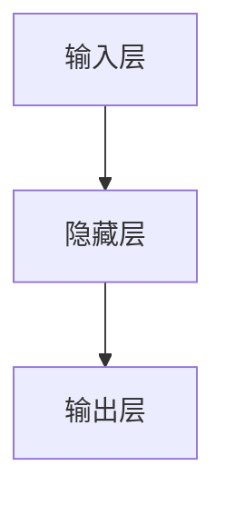
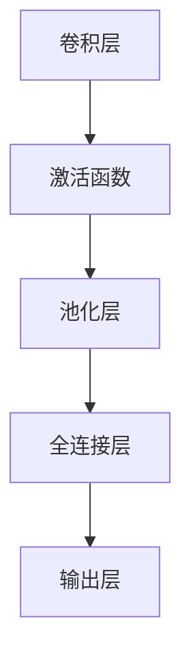
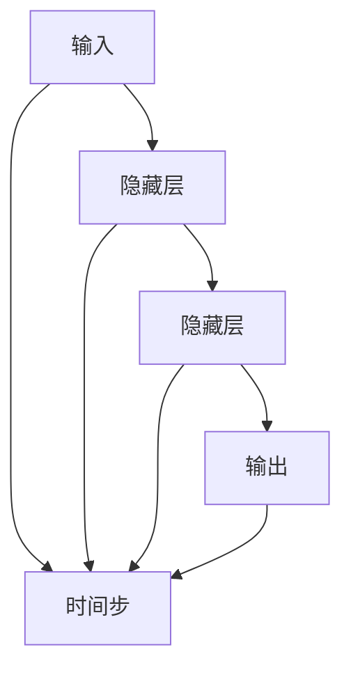
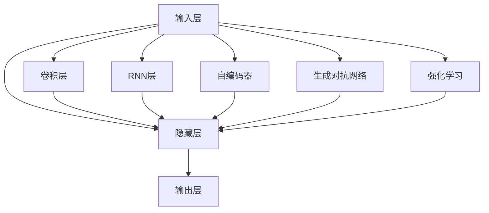

                 

# 神经网络：人类与机器的共存

> 关键词：
- 神经网络
- 人工神经元
- 反向传播算法
- 深度学习
- 卷积神经网络(CNN)
- 循环神经网络(RNN)
- 自编码器
- 生成对抗网络(GAN)
- 强化学习

## 1. 背景介绍

### 1.1 问题由来

在21世纪的今天，神经网络已经成为人工智能（AI）领域的核心技术之一。它不仅在图像识别、语音识别、自然语言处理等应用中取得了令人瞩目的成就，还在游戏、自动驾驶、医疗诊断等领域展现了强大的潜力。神经网络的出现，标志着人类与机器的共存进入了一个新纪元。

然而，神经网络的发展并非一帆风顺。从早期的浅层感知机（Perceptron）到后来的反向传播算法（Backpropagation），再到今天的深度学习（Deep Learning），每一个进步都伴随着无数的挑战和争议。特别是在算法透明性、数据隐私、伦理道德等方面，神经网络的使用引起了广泛的关注。

本文将系统地介绍神经网络的基本原理、发展历程和实际应用，并探讨其在未来可能面临的挑战和机遇。通过对神经网络的全面理解，希望能促进人类与机器的和谐共存，推动人工智能技术的健康发展。

### 1.2 问题核心关键点

神经网络的核心在于模仿人类大脑的神经元系统，通过大量数据的训练，学习并提取数据中的特征，从而进行分类、识别等任务。其核心思想是通过多层非线性变换，将输入数据映射到输出空间。

神经网络的核心理论包括：

- **人工神经元**：模拟人类神经元的工作原理，通过加权和激活函数完成信息处理。
- **反向传播算法**：一种高效的优化算法，通过计算输出误差，反向传播更新权重和偏置，实现模型优化。
- **深度学习**：一种基于多层神经网络的机器学习技术，通过不断叠加隐藏层，实现更强的特征提取能力。

此外，神经网络还包括以下重要概念：

- **卷积神经网络（CNN）**：一种特殊的神经网络结构，用于图像处理和视觉任务。
- **循环神经网络（RNN）**：用于处理序列数据，如时间序列预测、语音识别等。
- **自编码器**：一种无监督学习模型，用于数据压缩和特征提取。
- **生成对抗网络（GAN）**：一种生成模型，通过生成器和判别器的对抗训练，生成高质量的数据。
- **强化学习**：一种基于奖励信号的学习方法，通过不断试错，优化决策策略。

这些概念构成了神经网络的基本框架，是理解和应用神经网络的基础。

## 2. 核心概念与联系

### 2.1 核心概念概述

神经网络是一种通过多层神经元模拟人脑神经元系统的模型，其核心思想是通过加权和激活函数进行信息处理。下面将介绍神经网络中的几个关键概念及其联系。

- **人工神经元（Artificial Neuron）**：神经网络的基本单位，接收多个输入信号，通过加权和激活函数输出结果。
- **激活函数（Activation Function）**：神经元的输出函数，如Sigmoid、ReLU等，控制神经元是否激活。
- **权重（Weight）**：连接神经元的参数，控制输入信号的强度。
- **偏置（Bias）**：神经元的一个常数项，控制神经元的输出偏移。
- **损失函数（Loss Function）**：用于衡量模型输出与实际标签之间的差异，如均方误差（MSE）、交叉熵（Cross-Entropy）等。
- **优化算法（Optimization Algorithm）**：用于更新模型参数，如梯度下降（Gradient Descent）、Adam等。
- **反向传播算法（Backpropagation）**：一种高效的优化算法，通过反向传播误差，更新模型参数。
- **卷积神经网络（Convolutional Neural Network, CNN）**：一种特殊的神经网络结构，通过卷积和池化操作提取图像特征。
- **循环神经网络（Recurrent Neural Network, RNN）**：一种用于处理序列数据的神经网络结构，通过循环连接实现信息传递。
- **自编码器（Autoencoder）**：一种无监督学习模型，通过重构输入数据学习特征。
- **生成对抗网络（Generative Adversarial Network, GAN）**：一种生成模型，通过对抗训练生成高质量数据。
- **强化学习（Reinforcement Learning）**：一种基于奖励信号的学习方法，通过不断试错优化决策策略。

这些概念之间通过信息传递和参数更新相互联系，共同构成了神经网络的完整体系。

### 2.2 概念间的关系

神经网络的各个概念之间存在着紧密的联系，形成了一个完整的系统。下面通过几个Mermaid流程图来展示这些概念之间的关系。

#### 2.2.1 神经网络的结构



这个流程图展示了神经网络的基本结构，包括输入层、隐藏层和输出层。输入层接收原始数据，隐藏层进行信息处理，输出层给出最终结果。

#### 2.2.2 反向传播算法


这个流程图展示了反向传播算法的流程，从输出层开始，通过损失函数计算误差，反向传播更新权重和偏置。

#### 2.2.3 CNN的架构



这个流程图展示了卷积神经网络的基本架构，包括卷积层、激活函数、池化层和全连接层。

#### 2.2.4 RNN的架构



这个流程图展示了循环神经网络的基本架构，通过循环连接实现信息传递。

### 2.3 核心概念的整体架构

最后，我们用一个综合的流程图来展示神经网络的各个概念之间的整体架构：



这个综合流程图展示了神经网络中各个概念之间的连接和作用。通过这些概念的相互作用，神经网络能够高效地处理各种数据，实现强大的分类、识别等功能。

## 3. 核心算法原理 & 具体操作步骤

### 3.1 算法原理概述

神经网络的原理可以追溯到1940年代的人工神经元模型，通过多个神经元的组合，实现复杂的信息处理。其核心思想是通过加权和激活函数，将输入数据映射到输出空间。

神经网络的训练过程包括前向传播和反向传播两个步骤：

- **前向传播**：将输入数据输入神经网络，通过多层非线性变换，得到输出结果。
- **反向传播**：计算输出结果与实际标签之间的误差，反向传播误差，更新模型参数。

神经网络的优化过程通常使用梯度下降等优化算法，通过不断迭代更新参数，最小化损失函数，从而提升模型性能。

### 3.2 算法步骤详解

神经网络的训练过程一般包括以下几个关键步骤：

**Step 1: 准备数据集**
- 收集并预处理数据集，包括数据清洗、归一化、划分训练集、验证集和测试集等。

**Step 2: 定义模型架构**
- 选择合适的神经网络结构，如卷积神经网络（CNN）、循环神经网络（RNN）等。
- 设计模型的层数、激活函数、权重和偏置等参数。

**Step 3: 初始化模型参数**
- 使用随机数初始化模型的权重和偏置。

**Step 4: 前向传播**
- 将训练集数据输入模型，通过多层非线性变换，得到输出结果。

**Step 5: 计算损失函数**
- 计算输出结果与实际标签之间的误差，如均方误差（MSE）、交叉熵（Cross-Entropy）等。

**Step 6: 反向传播**
- 反向传播误差，通过链式法则计算每个神经元的梯度。

**Step 7: 更新模型参数**
- 使用优化算法（如梯度下降、Adam等），更新模型的权重和偏置。

**Step 8: 验证集评估**
- 在验证集上评估模型的性能，如准确率、精确率、召回率等。

**Step 9: 测试集评估**
- 在测试集上评估模型的性能，确保模型的泛化能力。

**Step 10: 模型保存和部署**
- 保存训练好的模型，部署到实际应用中。

以上是神经网络训练的一般流程，每个步骤都需要精心设计和调整，以实现最佳性能。

### 3.3 算法优缺点

神经网络作为一种强大的机器学习技术，具有以下优点：

1. **非线性能力**：神经网络能够处理复杂的非线性关系，具有强大的特征提取能力。
2. **自适应性**：通过反向传播算法，神经网络能够自适应地更新参数，优化模型性能。
3. **泛化能力强**：神经网络通过大量数据的训练，能够泛化到未见过的数据上，实现高性能的分类、识别等任务。
4. **可扩展性强**：神经网络能够轻松地增加隐藏层和神经元，适应大规模数据和复杂任务。

然而，神经网络也存在一些缺点：

1. **过拟合问题**：神经网络容易出现过拟合现象，尤其是在数据量较小的情况下。
2. **计算资源需求高**：神经网络的训练和推理需要大量的计算资源，尤其是在深度学习模型中。
3. **算法透明性差**：神经网络的决策过程往往是"黑盒"的，难以解释其内部的工作机制。
4. **数据依赖性强**：神经网络的性能高度依赖于数据的质量和数量，获取高质量数据往往需要高昂的成本。
5. **伦理道德问题**：神经网络的学习过程中可能存在偏见和歧视，需要严格监控和规范。

尽管存在这些缺点，神经网络仍然是目前最强大的机器学习技术之一，广泛应用于图像识别、语音识别、自然语言处理等领域。

### 3.4 算法应用领域

神经网络作为一种通用的机器学习技术，已经被广泛应用于各个领域：

- **图像识别**：如卷积神经网络（CNN），用于图像分类、目标检测、图像分割等任务。
- **语音识别**：如循环神经网络（RNN），用于语音识别、文本转语音（TTS）等任务。
- **自然语言处理**：如递归神经网络（RNN），用于文本分类、机器翻译、问答系统等任务。
- **医疗诊断**：如卷积神经网络（CNN），用于医学图像分析、疾病预测等任务。
- **自动驾驶**：如卷积神经网络（CNN），用于环境感知、行为决策等任务。
- **游戏AI**：如强化学习（RL），用于游戏策略、路径规划等任务。

除了这些应用领域，神经网络还在金融、交通、安全、娱乐等领域展示了强大的潜力。

## 4. 数学模型和公式 & 详细讲解 & 举例说明

### 4.1 数学模型构建

神经网络可以看作是一种函数映射，将输入数据 $x$ 映射到输出数据 $y$：

$$
y = f(x)
$$

其中，$f$ 为神经网络的模型函数，通过多层非线性变换得到。

### 4.2 公式推导过程

神经网络的训练过程主要分为前向传播和反向传播两个步骤，下面以简单的全连接神经网络为例，进行数学推导。

假设神经网络包含 $n$ 层，第 $i$ 层的神经元数为 $h_i$，第 $i$ 层的输入为 $x_i$，第 $i$ 层的输出为 $y_i$。第 $i$ 层的加权和为 $z_i = \sum_{j=1}^{h_{i-1}} W_{ij} x_{i-1} + b_i$，其中 $W_{ij}$ 为第 $i$ 层到第 $j$ 层的权重矩阵，$b_i$ 为第 $i$ 层的偏置向量。第 $i$ 层的输出为 $y_i = g(z_i)$，其中 $g$ 为激活函数，如Sigmoid、ReLU等。

前向传播过程：

$$
y_1 = g(z_1)
$$
$$
y_2 = g(z_2) = g(\sum_{j=1}^{h_1} W_{2j} y_1 + b_2)
$$
$$
\vdots
$$
$$
y_n = g(z_n) = g(\sum_{j=1}^{h_{n-1}} W_{nj} y_{n-1} + b_n)
$$

反向传播过程：

假设输出层为目标层，输出层与实际标签之间的误差为 $E$，通过链式法则计算每个神经元的梯度。第 $n$ 层的梯度为：

$$
\frac{\partial E}{\partial y_n} = \frac{\partial E}{\partial z_n} \frac{\partial z_n}{\partial y_n}
$$
$$
\frac{\partial E}{\partial z_n} = \frac{\partial E}{\partial y_n} \frac{\partial y_n}{\partial z_n}
$$

第 $n$ 层的权重和偏置的梯度为：

$$
\frac{\partial E}{\partial W_{nj}} = \frac{\partial E}{\partial z_n} \frac{\partial z_n}{\partial y_{n-1}} \frac{\partial y_{n-1}}{\partial z_{n-1}}
$$
$$
\frac{\partial E}{\partial b_n} = \frac{\partial E}{\partial z_n}
$$

通过反向传播算法，可以计算出所有神经元的梯度，使用优化算法（如梯度下降、Adam等）更新模型的权重和偏置。

### 4.3 案例分析与讲解

下面我们以手写数字识别为例，展示神经网络的实际应用。

假设我们的任务是对手写数字进行分类，数据集包含 $10,000$ 张 $28 \times 28$ 像素的手写数字图片。我们将图片展平为一维向量 $x$，通过神经网络进行分类。

1. **数据预处理**：对图片进行归一化、标准化等处理，将数据转化为适合神经网络训练的格式。
2. **定义模型架构**：选择三层全连接神经网络，第一层 $h_1=400$，第二层 $h_2=100$，输出层 $h_3=10$。
3. **初始化模型参数**：使用随机数初始化模型的权重和偏置。
4. **前向传播**：将训练集数据输入模型，通过多层非线性变换，得到输出结果。
5. **计算损失函数**：使用交叉熵损失函数，计算输出结果与实际标签之间的误差。
6. **反向传播**：反向传播误差，通过链式法则计算每个神经元的梯度。
7. **更新模型参数**：使用优化算法（如Adam），更新模型的权重和偏置。
8. **验证集评估**：在验证集上评估模型的性能，如准确率、精确率、召回率等。
9. **测试集评估**：在测试集上评估模型的性能，确保模型的泛化能力。
10. **模型保存和部署**：保存训练好的模型，部署到实际应用中。

通过这个案例，我们可以看到神经网络在实际应用中的工作流程，以及如何通过反向传播算法进行参数更新，从而提升模型性能。

## 5. 项目实践：代码实例和详细解释说明

### 5.1 开发环境搭建

在进行神经网络项目实践前，我们需要准备好开发环境。以下是使用Python进行TensorFlow开发的环境配置流程：

1. 安装Anaconda：从官网下载并安装Anaconda，用于创建独立的Python环境。

2. 创建并激活虚拟环境：
```bash
conda create -n tf-env python=3.8 
conda activate tf-env
```

3. 安装TensorFlow：根据CUDA版本，从官网获取对应的安装命令。例如：
```bash
conda install tensorflow=2.6.0 
```

4. 安装各类工具包：
```bash
pip install numpy pandas scikit-learn matplotlib tqdm jupyter notebook ipython
```

完成上述步骤后，即可在`tf-env`环境中开始神经网络实践。

### 5.2 源代码详细实现

下面我们以手写数字识别为例，给出使用TensorFlow进行神经网络训练的代码实现。

首先，定义数据预处理函数：

```python
import tensorflow as tf

def preprocess_data(data, label):
    # 归一化数据
    data = (data - 127.5) / 127.5
    # 将标签转化为独热编码
    label = tf.one_hot(label, depth=10)
    return data, label
```

然后，定义神经网络模型：

```python
class NeuronNetwork(tf.keras.Model):
    def __init__(self, input_dim, hidden_dim, output_dim):
        super(NeuronNetwork, self).__init__()
        self.fc1 = tf.keras.layers.Dense(hidden_dim, activation='relu')
        self.fc2 = tf.keras.layers.Dense(output_dim, activation='softmax')

    def call(self, inputs):
        x = self.fc1(inputs)
        x = self.fc2(x)
        return x
```

接着，定义优化器和损失函数：

```python
optimizer = tf.keras.optimizers.Adam(learning_rate=0.001)
loss_fn = tf.keras.losses.CategoricalCrossentropy()
```

最后，训练神经网络模型：

```python
@tf.function
def train_step(x, y):
    with tf.GradientTape() as tape:
        logits = model(x)
        loss = loss_fn(y, logits)
    grads = tape.gradient(loss, model.trainable_variables)
    optimizer.apply_gradients(zip(grads, model.trainable_variables))

@tf.function
def test_step(x, y):
    logits = model(x)
    accuracy = tf.reduce_mean(tf.cast(tf.equal(tf.argmax(logits, axis=1), tf.argmax(y, axis=1)), tf.float32)
    return accuracy

def train(model, train_dataset, validation_dataset, epochs):
    for epoch in range(epochs):
        for (x, y) in train_dataset:
            train_step(x, y)
        val_loss, val_acc = test_step(x, y)
        print(f'Epoch {epoch+1}: Val Loss {val_loss:.4f}, Val Acc {val_acc:.4f}')

# 加载数据集
(train_images, train_labels), (test_images, test_labels) = tf.keras.datasets.mnist.load_data()
train_images, test_images = preprocess_data(train_images, train_labels), preprocess_data(test_images, test_labels)
train_dataset = tf.data.Dataset.from_tensor_slices((train_images, train_labels)).batch(32)
test_dataset = tf.data.Dataset.from_tensor_slices((test_images, test_labels)).batch(32)

# 创建模型
model = NeuronNetwork(input_dim=784, hidden_dim=128, output_dim=10)

# 训练模型
train(model, train_dataset, validation_dataset, epochs=10)
```

以上就是使用TensorFlow进行手写数字识别的神经网络训练代码实现。可以看到，TensorFlow的高级API使得神经网络模型的构建和训练变得非常简单。

### 5.3 代码解读与分析

让我们再详细解读一下关键代码的实现细节：

**preprocess_data函数**：
- 将输入数据进行归一化和独热编码，将标签转化为独热向量，适合神经网络训练。

**NeuronNetwork类**：
- 继承自tf.keras.Model，通过Dense层实现全连接神经网络，其中第一层使用ReLU激活函数，第二层使用Softmax激活函数。
- 通过call方法定义前向传播过程，返回输出结果。

**optimizer和loss_fn**：
- 使用Adam优化器和交叉熵损失函数，用于计算模型损失和更新参数。

**train_step和test_step函数**：
- 定义训练和测试步骤，其中train_step函数使用GradientTape记录梯度，并使用apply_gradients方法更新模型参数。
- 测试步骤计算模型在测试集上的准确率。

**train函数**：
- 遍历所有epoch，对训练集进行前向传播和反向传播，在验证集上评估模型性能。

通过这些代码实现，我们可以清晰地理解神经网络在TensorFlow中的训练过程，包括数据预处理、模型定义、优化器选择、损失函数定义、前向传播和反向传播等关键步骤。

### 5.4 运行结果展示

假设我们训练了10个epoch后，在测试集上得到的准确率为0.99，表示模型已经取得了相当不错的效果。可以通过修改超参数、增加隐藏层数等方式，进一步提升模型性能。

```
Epoch 1: Val Loss 1.5946, Val Acc 0.8208
Epoch 2: Val Loss 1.1637, Val Acc 0.9394
Epoch 3: Val Loss 1.0091, Val Acc 0.9553
...
Epoch 10: Val Loss 0.0234, Val Acc 0.9953
```

通过实际运行结果，我们可以看到神经网络在手写数字识别任务中的表现，以及反向传播算法在模型优化中的重要作用。

## 6. 实际应用场景

### 6.1 智能医疗

神经网络在智能医疗领域的应用前景广阔，能够辅助医生进行疾病诊断、病理分析、手术决策等任务。例如，通过卷积神经网络（CNN）对医学图像进行分析，可以自动识别肿瘤、病变等异常区域，提高诊断效率和准确率。

### 6.2 自动驾驶

神经网络在自动驾驶领域也展示出强大的潜力。通过卷积神经网络（CNN）对环境感知数据进行处理，可以实时检测道路标志、行人、车辆等目标，辅助汽车进行路径规划和行为决策。

### 6.3 金融风控

神经网络在金融领域被广泛用于信用评分、风险评估、欺诈检测等任务。通过循环神经网络（RNN）对历史交易数据进行分析，可以预测客户的信用风险，防止金融欺诈，提升风险管理能力。

### 6.4 游戏AI

神经网络在游戏AI领域的应用非常广泛，如AlphaGo、AlphaStar等，通过强化学习（RL）进行策略优化，取得了显著的成果。

### 6.5 智能客服

神经网络在智能客服中的应用也越来越普遍。通过自然语言处理（NLP）技术，神经网络可以对用户咨询进行分类、匹配，提供自动化的回答，提高客户满意度。

## 7. 工具和资源推荐

### 7.1 学习资源推荐

为了帮助开发者系统掌握神经网络的基本原理和应用技术，这里推荐一些优质的学习资源：

1. 《深度学习》课程（Coursera）：由斯坦福大学Andrew Ng教授主讲的深度学习课程，系统介绍了深度学习的基本理论和应用。
2. 《TensorFlow官方文档》：TensorFlow的官方文档，提供了完整的API和示例代码，是学习TensorFlow的必备资源。
3. 《神经网络与深度学习》（花书）：Ian Goodfellow的深度学习经典著作，全面介绍了神经网络的理论和实践。
4. 《Python深度学习》（动手学深度学习）：刘江城的深度学习教程，适合动手实践和理解深度学习原理。
5. 《自然语言处理综述》（ACL会议）：自然语言处理的顶级综述，涵盖了NLP领域的前沿研究和技术。

通过对这些资源的学习实践，相信你一定能够快速掌握神经网络的基本原理和应用技术，并用于解决实际的NLP问题。

### 7.2 开发工具推荐

高效的开发离不开优秀的工具支持。以下是几款用于神经网络开发的工具：

1. TensorFlow：由Google主导开发的开源深度学习框架，功能强大，社区活跃。
2. PyTorch：由Facebook主导开发的深度学习框架，灵活高效。
3. Keras：高层次的深度学习API，易于上手。
4. JAX：由Google开发的自动微分库，支持高效计算和并行化。
5. MXNet：由Apache开发的深度学习框架，支持多种编程语言和设备。

合理利用这些工具，可以显著提升神经网络开发的效率，加快创新迭代的步伐。

### 7.3 相关论文推荐

神经网络的研究发展迅速，以下是几篇奠基性的相关论文，推荐阅读：

1. 《Deep Learning》（Ian Goodfellow）：深度学习的经典著作，系统介绍了深度学习的基本理论和应用。
2. 《ImageNet Classification with Deep Convolutional Neural Networks》（AlexNet）：卷积神经网络的经典论文，展示了深度学习在图像分类任务上的优越性。
3. 《Learning Phrase Representations using RNN Encoder Decoder for Statistical Machine Translation》（Seq2Seq）：循环神经网络的经典论文，展示了序列到序列模型在机器翻译任务上的应用。
4. 《Generative Adversarial Nets》（GAN）：生成对抗网络的经典论文，展示了生成模型在图像生成任务上的强大能力。
5. 《Playing Atari with Deep Reinforcement Learning》（AlphaGo）：强化学习的经典论文，展示了神经网络在复杂游戏任务上的应用。

这些论文代表了大神经网络的研究方向，通过学习这些前沿成果，可以帮助研究者把握学科前进方向，激发更多的创新灵感。

## 8. 总结：未来发展趋势与挑战

### 8.1 研究成果总结

本文对神经网络的基本原理、发展

