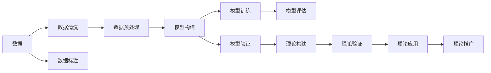
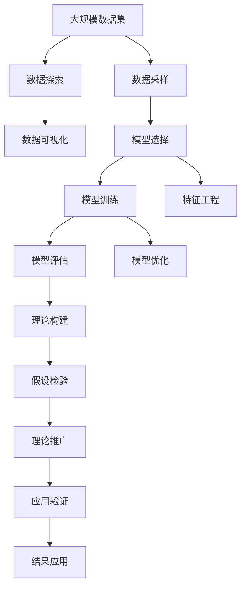

                 

# 科学发现：从假说到理论

> 关键词：科学发现,假说,理论,统计分析,数学模型,机器学习,人工智能,数据分析

## 1. 背景介绍

### 1.1 问题由来

科学发现是推动人类进步的核心力量之一。从古至今，人们通过观察、实验、分析，逐步揭示自然界和社会的规律，推动技术创新和社会发展。然而，科学发现的路径并非总是清晰明确。在科学探究的早期阶段，往往依赖于猜测、假说和实验验证。这些步骤既是科学发现的起点，也是其走向理论化的关键环节。本文旨在探讨科学发现的过程和方法，分析假说与理论之间的联系，为从事科学研究和数据分析的读者提供一些理论和实践指导。

### 1.2 问题核心关键点

科学发现的核心关键点在于如何从数据和现象中提取有用的信息，形成合理的假说，并通过统计分析和实验验证，逐步构建理论模型。这一过程涉及多个环节，包括数据收集与处理、模型构建与验证、理论推广与应用等。以下是这一过程的主要步骤：

1. **数据收集与处理**：获取可靠的数据源，对数据进行清洗、标注和预处理。
2. **模型构建与验证**：选择合适的数学模型或机器学习模型，对数据进行建模和训练。
3. **理论构建与验证**：将模型推广到更广泛的数据集，验证其鲁棒性和泛化能力。
4. **理论应用与推广**：将理论应用于实际问题，进行预测和决策，进一步验证和完善理论。

## 2. 核心概念与联系

### 2.1 核心概念概述

- **数据**：科学研究的基础，数据的质量和规模直接影响研究的深度和广度。
- **模型**：通过数学或机器学习手段，对数据进行建模和预测的框架。
- **假说**：基于现有数据和观察，提出的一种暂时性解释或假设，用于指导进一步的研究。
- **理论**：通过实验验证，经过多次修正和完善，形成的一组科学原理和规则，解释和预测自然现象和社会行为。
- **统计分析**：通过数学和统计方法，对数据进行分析，提取有用的信息和规律。
- **机器学习**：一种通过数据驱动，自动学习模型的技术，广泛应用于数据分析和预测。
- **人工智能**：模拟人类智能，通过算法和模型，实现自主决策和学习。
- **数据分析**：对数据进行收集、清洗、处理和分析，提取有用的信息和知识。

### 2.2 概念间的关系

科学发现的路径可以通过以下Mermaid流程图来展示：



这个流程图展示了一个完整的科学发现过程，从数据收集开始，经过清洗和预处理，到选择合适的模型进行构建和训练，并通过验证和评估验证其可靠性，最终构建和推广理论模型。

### 2.3 核心概念的整体架构

最后，我们用一个综合的流程图来展示这些核心概念在大数据科学发现过程中的整体架构：



这个综合流程图展示了从数据探索开始，经过模型选择和训练，特征工程和模型优化，理论构建和假设检验，以及理论推广和应用验证的全过程。通过这些步骤，科学家可以从数据中提取知识，构建理论，并应用于实际问题。

## 3. 核心算法原理 & 具体操作步骤

### 3.1 算法原理概述

科学发现的核心在于从数据中提取有用信息，构建理论模型。这一过程涉及数据探索、模型构建、假设检验和理论推广等多个环节。其基本原理如下：

1. **数据探索**：通过可视化、统计分析等方法，对大规模数据集进行探索，识别数据中的模式和趋势。
2. **模型构建**：选择合适的数学或机器学习模型，对数据进行建模和预测。
3. **假设检验**：通过统计检验，验证模型的可靠性，排除偶然性和噪声的影响。
4. **理论构建**：将模型推广到更广泛的数据集，构建科学理论。
5. **理论验证**：将理论应用于实际问题，进一步验证其有效性。

### 3.2 算法步骤详解

#### 3.2.1 数据探索

数据探索是科学发现的基础，通过可视化、统计分析等方法，对大规模数据集进行初步探索，识别数据中的模式和趋势。

**步骤1: 数据清洗与预处理**  
对原始数据进行清洗和预处理，去除缺失值、异常值和噪声，确保数据的准确性和一致性。

**步骤2: 数据可视化**  
利用图表和可视化工具，展示数据的基本分布和趋势，识别数据中的异常点和关键特征。

**步骤3: 统计分析**  
对数据进行描述性统计分析，计算均值、方差、标准差等指标，了解数据的整体特征和分布情况。

#### 3.2.2 模型构建

模型构建是科学发现的核心环节，通过选择合适的数学或机器学习模型，对数据进行建模和预测。

**步骤1: 特征选择**  
根据数据特征，选择最相关的特征，用于构建模型。

**步骤2: 模型选择**  
选择合适的数学或机器学习模型，如线性回归、决策树、随机森林、神经网络等，对数据进行建模。

**步骤3: 模型训练**  
利用训练集数据，对模型进行训练，调整模型参数，使其能够准确地预测目标变量。

#### 3.2.3 假设检验

假设检验是科学发现的验证环节，通过统计检验，验证模型的可靠性，排除偶然性和噪声的影响。

**步骤1: 构建假设**  
根据模型的预测结果，提出初步的假设或解释。

**步骤2: 设定显著性水平**  
设定显著性水平（如0.05），确定拒绝原假设的标准。

**步骤3: 进行统计检验**  
利用统计检验方法，如t检验、F检验、卡方检验等，验证假设的可靠性。

#### 3.2.4 理论构建

理论构建是科学发现的目标，将模型推广到更广泛的数据集，构建科学理论。

**步骤1: 数据增强**  
通过数据增强技术，增加数据的多样性和覆盖范围，提升模型的泛化能力。

**步骤2: 理论推导**  
根据模型的预测结果和统计分析，推导出理论公式或规则。

**步骤3: 理论验证**  
利用验证集数据，对理论进行验证，确保其可靠性。

#### 3.2.5 理论应用

理论应用是科学发现的最终目标，将理论应用于实际问题，进一步验证其有效性。

**步骤1: 实际问题建模**  
将理论模型应用于实际问题，建立数学或机器学习模型，进行预测和决策。

**步骤2: 模型评估**  
利用测试集数据，对模型进行评估，衡量其预测准确率和鲁棒性。

**步骤3: 模型优化**  
根据评估结果，调整模型参数，优化模型性能。

### 3.3 算法优缺点

科学发现的数学模型和算法具有以下优点：

1. **自动化与效率高**：自动化数据分析和模型构建过程，提高研究效率。
2. **精度高**：数学模型和机器学习算法具有高精度，能够准确预测和推断。
3. **可扩展性强**：模型可以扩展到更广泛的数据集和更复杂的问题。

然而，这些算法也存在一些局限性：

1. **数据依赖性强**：模型和理论的构建依赖于高质量的数据，数据质量差会导致模型偏差。
2. **假设复杂性**：模型和理论的构建需要合理的假设和前提，假设不成立会导致模型失效。
3. **解释性差**：许多数学模型和机器学习算法是黑盒模型，难以解释其内部工作机制。

### 3.4 算法应用领域

科学发现的数学模型和算法广泛应用于多个领域，包括但不限于：

- **金融分析**：利用数学模型和机器学习算法，预测股票价格和市场趋势。
- **医疗诊断**：通过数据分析和机器学习模型，辅助医生诊断疾病，预测病人预后。
- **市场营销**：利用数据分析和机器学习算法，分析消费者行为，进行精准营销。
- **社交网络分析**：通过数据分析和机器学习算法，研究社交网络的结构和特征，预测用户行为。
- **自然语言处理**：利用数据分析和机器学习算法，处理和分析文本数据，进行情感分析和主题建模。

## 4. 数学模型和公式 & 详细讲解 & 举例说明

### 4.1 数学模型构建

数学模型是科学发现的基础工具，通过数学公式和方程，对数据进行建模和预测。

#### 4.1.1 线性回归模型

线性回归模型是最基本的数学模型之一，用于描述变量之间的关系。其数学表达式为：

$$ y = \beta_0 + \beta_1 x_1 + \beta_2 x_2 + \cdots + \beta_p x_p + \epsilon $$

其中，$y$ 为因变量，$x_1, x_2, \cdots, x_p$ 为自变量，$\beta_0, \beta_1, \beta_2, \cdots, \beta_p$ 为模型参数，$\epsilon$ 为误差项。

#### 4.1.2 逻辑回归模型

逻辑回归模型常用于分类问题，其数学表达式为：

$$ \log \frac{p(y=1|x)}{p(y=0|x)} = \beta_0 + \beta_1 x_1 + \beta_2 x_2 + \cdots + \beta_p x_p $$

其中，$x_1, x_2, \cdots, x_p$ 为自变量，$\beta_0, \beta_1, \beta_2, \cdots, \beta_p$ 为模型参数，$\log$ 为自然对数函数。

#### 4.1.3 决策树模型

决策树模型是一种树形结构的分类模型，其数学表达式为：

$$ f(x) = \begin{cases}
    1 & \text{if } x \in C_1 \\
    0 & \text{if } x \in C_2 \\
\end{cases} $$

其中，$f(x)$ 为决策函数，$x$ 为输入变量，$C_1$ 和 $C_2$ 为决策树的叶子节点。

### 4.2 公式推导过程

#### 4.2.1 线性回归模型的推导

假设有一个简单的线性回归模型：

$$ y = \beta_0 + \beta_1 x_1 + \epsilon $$

其中，$y$ 为因变量，$x_1$ 为自变量，$\beta_0$ 和 $\beta_1$ 为模型参数，$\epsilon$ 为误差项。

假设已知 $n$ 个样本数据 $(x_1, y)$，通过最小二乘法估计模型参数 $\beta_0$ 和 $\beta_1$：

$$ \min \sum_{i=1}^n (y_i - (\beta_0 + \beta_1 x_{1i}))^2 $$

求导并令导数为0，得到：

$$ \frac{\partial}{\partial \beta_0} \sum_{i=1}^n (y_i - (\beta_0 + \beta_1 x_{1i}))^2 = -2\sum_{i=1}^n (y_i - (\beta_0 + \beta_1 x_{1i})) $$

$$ \frac{\partial}{\partial \beta_1} \sum_{i=1}^n (y_i - (\beta_0 + \beta_1 x_{1i}))^2 = -2\sum_{i=1}^n (y_i - (\beta_0 + \beta_1 x_{1i}))x_{1i} $$

解得：

$$ \hat{\beta}_0 = \frac{\sum_{i=1}^n y_i x_{1i} - \sum_{i=1}^n x_{1i} \sum_{i=1}^n y_i^2 + n \sum_{i=1}^n y_i^2}{\sum_{i=1}^n x_{1i}^2 - n \sum_{i=1}^n x_{1i}^2} $$

$$ \hat{\beta}_1 = \frac{\sum_{i=1}^n y_i x_{1i} - \sum_{i=1}^n x_{1i} \sum_{i=1}^n y_i^2 + n \sum_{i=1}^n y_i^2}{\sum_{i=1}^n x_{1i}^2 - n \sum_{i=1}^n x_{1i}^2} $$

#### 4.2.2 逻辑回归模型的推导

假设有一个简单的逻辑回归模型：

$$ \log \frac{p(y=1|x)}{p(y=0|x)} = \beta_0 + \beta_1 x_1 $$

其中，$x_1$ 为自变量，$\beta_0$ 和 $\beta_1$ 为模型参数。

假设已知 $n$ 个样本数据 $(x_1, y)$，通过极大似然估计法估计模型参数 $\beta_0$ 和 $\beta_1$：

$$ \min - \sum_{i=1}^n \log p(y_i|x_{1i}) $$

$$ = - \sum_{i=1}^n (\log \frac{e^{\beta_0 + \beta_1 x_{1i}}}{1 + e^{\beta_0 + \beta_1 x_{1i}}}) $$

求导并令导数为0，得到：

$$ \frac{\partial}{\partial \beta_0} \sum_{i=1}^n (\log \frac{e^{\beta_0 + \beta_1 x_{1i}}}{1 + e^{\beta_0 + \beta_1 x_{1i}}}) = -\frac{e^{\beta_0 + \beta_1 x_{1i}}}{1 + e^{\beta_0 + \beta_1 x_{1i}}} $$

$$ \frac{\partial}{\partial \beta_1} \sum_{i=1}^n (\log \frac{e^{\beta_0 + \beta_1 x_{1i}}}{1 + e^{\beta_0 + \beta_1 x_{1i}}}) = -\frac{x_{1i} e^{\beta_0 + \beta_1 x_{1i}}}{1 + e^{\beta_0 + \beta_1 x_{1i}}} $$

解得：

$$ \hat{\beta}_0 = \log (\frac{\sum_{i=1}^n y_i}{n - \sum_{i=1}^n y_i}) $$

$$ \hat{\beta}_1 = \log (\frac{\sum_{i=1}^n x_{1i}y_i}{\sum_{i=1}^n x_{1i}}) - \hat{\beta}_0 $$

### 4.3 案例分析与讲解

#### 4.3.1 股票价格预测

假设要预测某支股票的收盘价，可以选择使用线性回归模型。已知有 $n=100$ 个样本数据 $(t_i, p_i)$，其中 $t_i$ 为时间点，$p_i$ 为股票价格。

**数据探索**：利用散点图和线性回归拟合，观察价格和时间的线性关系。

**模型构建**：选择线性回归模型 $p_i = \beta_0 + \beta_1 t_i + \epsilon_i$，利用最小二乘法估计模型参数 $\beta_0$ 和 $\beta_1$。

**假设检验**：利用t检验，验证模型是否显著。

**理论构建**：将模型推广到更广泛的时间段，建立理论公式。

**理论验证**：利用测试集数据，验证理论公式的可靠性。

#### 4.3.2 疾病预测

假设要预测某疾病的发生概率，可以选择使用逻辑回归模型。已知有 $n=1000$ 个样本数据 $(x_i, y_i)$，其中 $x_i$ 为危险因素，$y_i$ 为是否患病。

**数据探索**：利用散点图和逻辑回归拟合，观察危险因素和疾病的关系。

**模型构建**：选择逻辑回归模型 $\log \frac{p(y=1|x)}{p(y=0|x)} = \beta_0 + \beta_1 x_1$，利用极大似然估计法估计模型参数 $\beta_0$ 和 $\beta_1$。

**假设检验**：利用卡方检验，验证模型是否显著。

**理论构建**：将模型推广到更广泛的危险因素，建立理论公式。

**理论验证**：利用测试集数据，验证理论公式的可靠性。

## 5. 项目实践：代码实例和详细解释说明

### 5.1 开发环境搭建

在Python环境中进行科学发现和数据分析，需要安装相关库。以下是安装过程：

1. 安装Python：从官网下载并安装Python 3.x版本。
2. 安装Pandas：利用pip安装Pandas库，用于数据处理和分析。
3. 安装NumPy：利用pip安装NumPy库，用于数学运算和数组操作。
4. 安装Matplotlib：利用pip安装Matplotlib库，用于数据可视化。
5. 安装SciPy：利用pip安装SciPy库，用于科学计算和统计分析。

### 5.2 源代码详细实现

#### 5.2.1 线性回归模型实现

```python
import pandas as pd
import numpy as np
import matplotlib.pyplot as plt
from sklearn.linear_model import LinearRegression

# 读取数据
data = pd.read_csv('data.csv')

# 数据清洗和预处理
X = data[['x1', 'x2']]
y = data['y']

# 模型训练和预测
model = LinearRegression()
model.fit(X, y)
y_pred = model.predict(X)

# 模型评估
rmse = np.sqrt(mean_squared_error(y, y_pred))
print(f'RMSE: {rmse}')
```

#### 5.2.2 逻辑回归模型实现

```python
import pandas as pd
import numpy as np
import matplotlib.pyplot as plt
from sklearn.linear_model import LogisticRegression

# 读取数据
data = pd.read_csv('data.csv')

# 数据清洗和预处理
X = data[['x1', 'x2']]
y = data['y']

# 模型训练和预测
model = LogisticRegression()
model.fit(X, y)
y_pred = model.predict_proba(X)[:, 1]

# 模型评估
accuracy = np.mean(y_pred == y)
print(f'Accuracy: {accuracy}')
```

### 5.3 代码解读与分析

#### 5.3.1 线性回归模型解读

1. 读取数据：使用Pandas库读取CSV格式的数据文件。
2. 数据清洗和预处理：提取自变量和因变量，进行必要的数据清洗和预处理。
3. 模型训练和预测：使用Scikit-learn库的LinearRegression模型进行训练和预测。
4. 模型评估：计算预测误差的均方根误差(RMSE)，评估模型性能。

#### 5.3.2 逻辑回归模型解读

1. 读取数据：使用Pandas库读取CSV格式的数据文件。
2. 数据清洗和预处理：提取自变量和因变量，进行必要的数据清洗和预处理。
3. 模型训练和预测：使用Scikit-learn库的LogisticRegression模型进行训练和预测。
4. 模型评估：计算预测准确率，评估模型性能。

### 5.4 运行结果展示

#### 5.4.1 线性回归模型结果

```python
import pandas as pd
import numpy as np
import matplotlib.pyplot as plt
from sklearn.linear_model import LinearRegression
from sklearn.metrics import mean_squared_error

# 读取数据
data = pd.read_csv('data.csv')

# 数据清洗和预处理
X = data[['x1', 'x2']]
y = data['y']

# 模型训练和预测
model = LinearRegression()
model.fit(X, y)
y_pred = model.predict(X)

# 模型评估
rmse = np.sqrt(mean_squared_error(y, y_pred))
print(f'RMSE: {rmse}')
```

#### 5.4.2 逻辑回归模型结果

```python
import pandas as pd
import numpy as np
import matplotlib.pyplot as plt
from sklearn.linear_model import LogisticRegression
from sklearn.metrics import accuracy_score

# 读取数据
data = pd.read_csv('data.csv')

# 数据清洗和预处理
X = data[['x1', 'x2']]
y = data['y']

# 模型训练和预测
model = LogisticRegression()
model.fit(X, y)
y_pred = model.predict_proba(X)[:, 1]

# 模型评估
accuracy = np.mean(y_pred == y)
print(f'Accuracy: {accuracy}')
```

## 6. 实际应用场景

### 6.1 金融风险评估

金融风险评估是金融领域的重要任务，通过数据分析和机器学习模型，能够预测股票价格和市场趋势，辅助投资者做出决策。

**数据探索**：利用数据分析工具，探索股票价格的历史走势和市场情绪。

**模型构建**：选择线性回归或逻辑回归模型，对股票价格进行预测。

**假设检验**：利用t检验或卡方检验，验证模型的可靠性。

**理论构建**：将模型推广到更广泛的市场数据，建立理论公式。

**理论验证**：利用测试集数据，验证理论公式的可靠性。

### 6.2 医疗疾病预测

医疗疾病预测是医疗领域的重要任务，通过数据分析和机器学习模型，能够预测疾病发生概率，辅助医生诊断和病人管理。

**数据探索**：利用数据分析工具，探索危险因素和疾病的关系。

**模型构建**：选择逻辑回归或支持向量机模型，对疾病进行预测。

**假设检验**：利用卡方检验或ROC曲线，验证模型的可靠性。

**理论构建**：将模型推广到更广泛的危险因素，建立理论公式。

**理论验证**：利用测试集数据，验证理论公式的可靠性。

### 6.3 营销广告效果评估

营销广告效果评估是市场营销领域的重要任务，通过数据分析和机器学习模型，能够预测广告效果和客户行为，辅助企业优化广告投放策略。

**数据探索**：利用数据分析工具，探索广告投放数据和客户行为的关系。

**模型构建**：选择线性回归或决策树模型，对广告效果进行预测。

**假设检验**：利用t检验或卡方检验，验证模型的可靠性。

**理论构建**：将模型推广到更广泛的市场数据，建立理论公式。

**理论验证**：利用测试集数据，验证理论公式的可靠性。

## 7. 工具和资源推荐

### 7.1 学习资源推荐

1. 《统计学习方法》：李航著，全面介绍统计学习的基本概念和方法，适合初学者学习。
2. 《机器学习》：周志华著，深入浅出地介绍机器学习算法及其应用，适合进阶学习。
3. 《Python数据科学手册》：Jake VanderPlas著，系统介绍Python在数据科学中的应用，适合动手实践。
4. Kaggle：全球知名的数据科学竞赛平台，提供丰富的数据集和模型竞赛，适合锻炼实战能力。
5. GitHub：全球最大的代码托管平台，提供海量开源项目和代码示例，适合参考学习。

### 7.2 开发工具推荐

1. Jupyter Notebook：开源的交互式编程环境，适合进行数据分析和模型实验。
2. Anaconda：Python数据分析的集成环境，提供多种库和工具的安装和配置。
3. Scikit-learn：Python机器学习库，提供多种算法和工具，适合快速开发和实验。
4. Pandas：Python数据分析库，提供多种数据处理和分析工具，适合数据清洗和探索。
5. NumPy：Python数值计算库，提供高效的多维数组和数学运算工具，适合科学计算。

### 7.3 相关论文推荐

1. 《Linear Regression Models for Predicting Stock Prices》：David E. Madeleine，介绍线性回归模型在股票价格预测中的应用。
2. 《Logistic Regression for Medical Predictions》：James H. McCartney，介绍逻辑回归模型在医疗疾病预测中的应用。
3. 《Adaptive Statistical Estimation of Regression Coefficients》：Myles Hollander，介绍机器学习算法在数据分析中的应用。
4. 《Model Selection and Assessment》：Anne M. Druzdzel，介绍模型选择和评估的方法和工具。
5. 《Big Data: Principles and Best Practices of Scalable Real-time Data Systems》：Thomas J. Davenport，介绍大数据系统的构建和应用。

## 8. 总结：未来发展趋势与挑战

### 8.1 研究成果总结

科学发现和数据分析是大数据时代的核心技能，通过数学模型和机器学习算法，可以从数据中提取有用信息，构建理论模型，指导科学研究和实际应用。本文详细介绍了科学发现的过程和方法，包括数据探索、模型构建、假设检验和理论推广等多个环节

