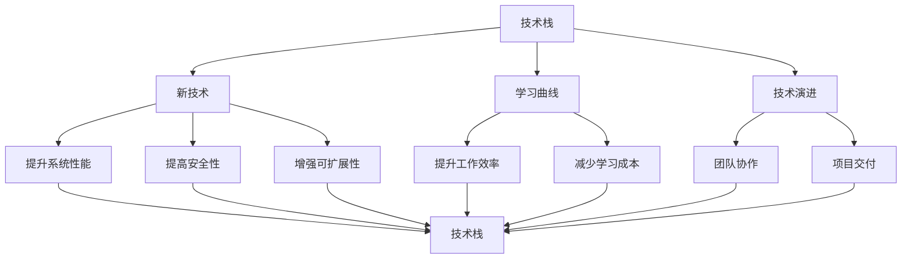
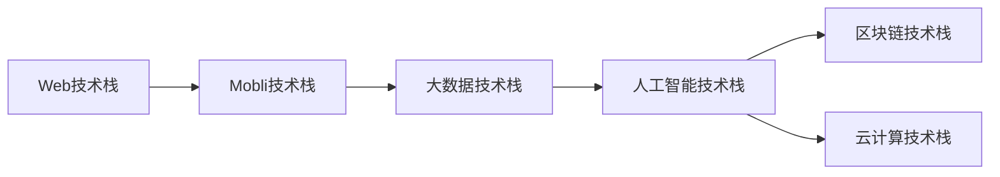
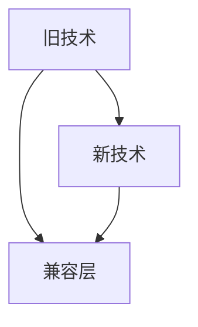
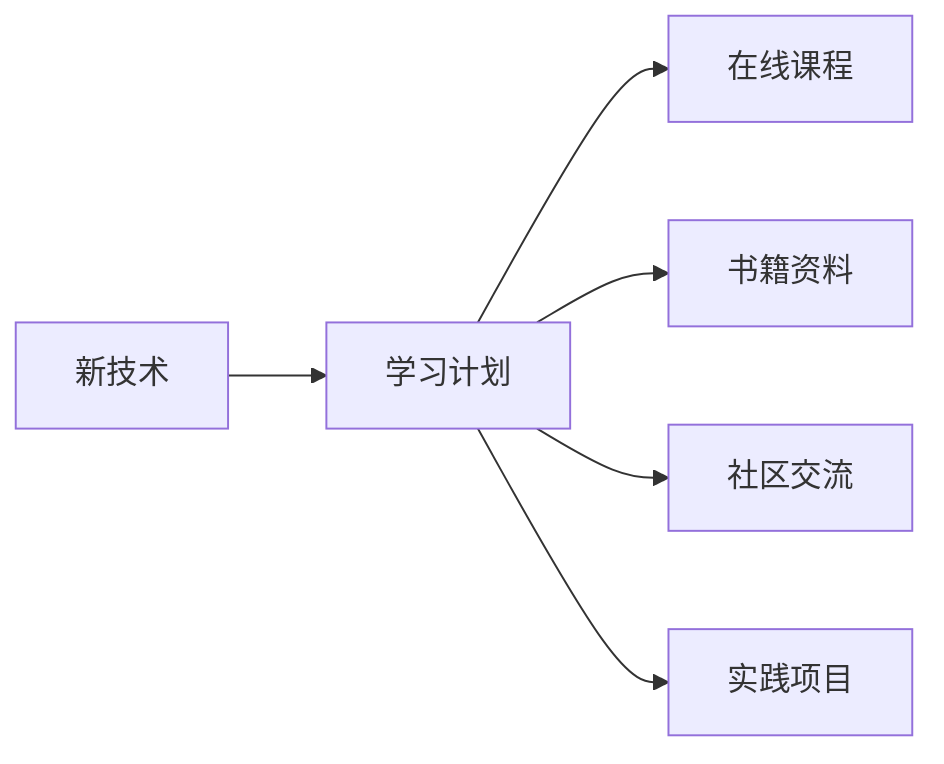
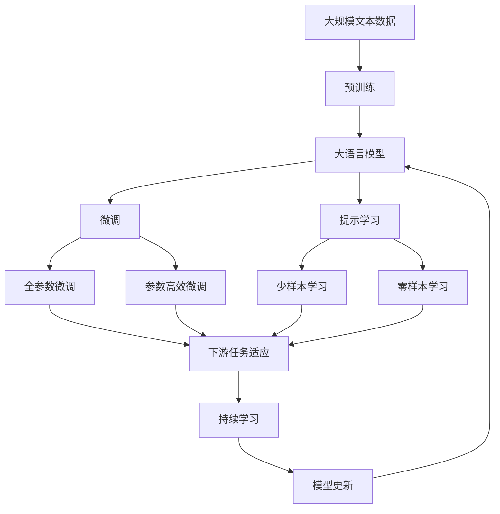

                 

# 程序员如何应对技术栈快速更新

在当今快速发展的技术时代，技术栈的更新速度已经远远超过了大多数程序员的适应能力。面对各种新技术和新框架的涌现，程序员应该如何保持自己的竞争力，应对技术栈的快速更新呢？本文将从背景介绍、核心概念与联系、核心算法原理与操作步骤、数学模型和公式、项目实践、实际应用场景、工具和资源推荐、总结与展望以及附录等方面，深入探讨程序员应对技术栈快速更新的策略和方法。

## 1. 背景介绍

### 1.1 问题由来
随着互联网的快速发展，技术栈的更新速度越来越快。从早期的Web技术栈，到移动互联网、大数据、人工智能、区块链、云计算等新兴技术栈，新技术不断涌现。技术栈的快速更新，对程序员提出了更高的要求，使得他们需要不断学习新的技术和工具，以保持自己的竞争力。

### 1.2 问题核心关键点
技术栈快速更新的关键点包括：
- 新技术层出不穷，学习成本增加。
- 技术栈要求越来越高，技能跨越难度大。
- 技术更新迅速，团队协作难度增加。
- 持续学习压力大，心理和生理负担加重。

### 1.3 问题研究意义
掌握如何应对技术栈快速更新，对于程序员的职业生涯发展具有重要意义：
- 适应技术发展，提升自身竞争力。
- 减少学习成本，提高工作效率。
- 团队协作顺畅，提高项目交付效率。
- 保持持续学习动力，减轻心理和生理负担。

## 2. 核心概念与联系

### 2.1 核心概念概述
为更好地理解如何应对技术栈快速更新，本节将介绍几个密切相关的核心概念：

- **技术栈（Technology Stack）**：指一个应用系统所依赖的所有技术和工具的集合，包括编程语言、框架、库、中间件等。
- **新技术（New Technology）**：指新兴的技术或工具，能够提升系统性能、安全性、可扩展性等。
- **学习曲线（Learning Curve）**：指学习新技能或工具时所需的时间和难度。
- **技术演进（Technology Evolution）**：指技术栈随着时间的推移，由旧技术向新技术的过渡。
- **持续学习（Continuous Learning）**：指在职业生涯中不断学习新技术和新工具，以保持竞争力的过程。

这些核心概念之间的逻辑关系可以通过以下Mermaid流程图来展示：



这个流程图展示了大语言模型的核心概念及其之间的关系：

1. 技术栈通过引入新技术，提升系统性能、安全性、可扩展性。
2. 新技术的学习曲线决定了学习成本。
3. 技术演进使得旧技术逐渐被新取代，形成新的技术栈。
4. 持续学习使得程序员能够适应技术演进，保持竞争力。
5. 新技术的应用提升了工作效率，改善了团队协作和项目交付。

### 2.2 概念间的关系

这些核心概念之间存在着紧密的联系，形成了程序员应对技术栈快速更新的完整生态系统。下面我们通过几个Mermaid流程图来展示这些概念之间的关系。

#### 2.2.1 技术栈的演变



这个流程图展示了技术栈的演变路径，从Web技术栈逐步过渡到移动互联网、大数据、人工智能、区块链、云计算等新兴技术栈。

#### 2.2.2 新技术与旧技术的兼容



这个流程图展示了新技术与旧技术的兼容关系，通过引入兼容层，使得新技术与旧技术能够协同工作。

#### 2.2.3 学习新技术的策略



这个流程图展示了学习新技术的策略，包括制定学习计划、参考在线课程、查阅书籍资料、参与社区交流和实践项目等。

### 2.3 核心概念的整体架构

最后，我们用一个综合的流程图来展示这些核心概念在大语言模型微调过程中的整体架构：



这个综合流程图展示了从预训练到微调，再到持续学习的完整过程。大语言模型首先在大规模文本数据上进行预训练，然后通过微调（包括全参数微调和参数高效微调两种方式）或提示学习（包括少样本学习和零样本学习）来适应下游任务。最后，通过持续学习技术，模型可以不断学习新知识，同时避免遗忘旧知识。 通过这些流程图，我们可以更清晰地理解大语言模型微调过程中各个核心概念的关系和作用。

## 3. 核心算法原理 & 具体操作步骤
### 3.1 算法原理概述

应对技术栈快速更新，本质上是如何在快速变化的技术环境中，通过学习新技能和工具，适应新技术的引入和旧技术的淘汰。这涉及到持续学习（Continuous Learning）的概念，即将学习视为一种持续的、系统的过程，以保持自身技能的更新和适应。

### 3.2 算法步骤详解

应对技术栈快速更新的核心算法步骤如下：

**Step 1: 确定学习目标**
- 明确当前技术栈的需求和目标。
- 确定需要掌握的新技术和工具。

**Step 2: 制定学习计划**
- 根据学习目标，制定详细的学习计划。
- 设定学习时间表，安排每周、每月的学习任务。

**Step 3: 获取学习资源**
- 选择适合的学习平台和资源。
- 获取在线课程、书籍、文档、社区资料等。

**Step 4: 实施学习计划**
- 按照学习计划，逐步学习新技术和新工具。
- 定期回顾学习内容，巩固知识点。

**Step 5: 实践项目**
- 通过实际项目应用新技术和新工具。
- 不断调整学习计划，优化学习效果。

**Step 6: 持续更新**
- 定期评估技术栈的变化趋势。
- 持续学习和更新技能，适应新的技术变化。

### 3.3 算法优缺点

**优点**：
- 保持技术栈的前沿性，紧跟技术发展趋势。
- 提升工作效率，减少因技术落后带来的影响。
- 增强竞争力，提升职业发展潜力。

**缺点**：
- 学习成本高，需要投入大量时间和精力。
- 持续学习压力大，容易产生疲劳和倦怠。
- 新技术的学习曲线陡峭，需要较强的学习能力和适应能力。

### 3.4 算法应用领域

应对技术栈快速更新的算法适用于各种场景，特别是在技术密集型的行业和领域，如互联网、金融、医疗、教育等。在实际应用中，需要根据具体的技术需求和环境，灵活调整学习策略，选择合适的技术栈和工具。

## 4. 数学模型和公式 & 详细讲解  
### 4.1 数学模型构建

本节将使用数学语言对如何应对技术栈快速更新这一过程进行更加严格的刻画。

记技术栈中的旧技术为 $T_0$，新技术为 $T_1$。定义技术栈的学习曲线为 $L$，技术演变为 $E$。

技术栈的演进过程可以表示为：

$$
E(T_0, T_1) = L(T_0) + \delta
$$

其中 $\delta$ 表示学习新技能所需的时间和难度。

技术栈的学习过程可以表示为：

$$
L(T_1) = L(T_0) + \int_0^t \frac{1}{t} \mathrm{d}t
$$

其中 $t$ 表示学习时间。

## 5. 项目实践：代码实例和详细解释说明
### 5.1 开发环境搭建

在进行技术栈快速更新的实践前，我们需要准备好开发环境。以下是使用Python进行PyTorch开发的环境配置流程：

1. 安装Anaconda：从官网下载并安装Anaconda，用于创建独立的Python环境。

2. 创建并激活虚拟环境：
```bash
conda create -n pytorch-env python=3.8 
conda activate pytorch-env
```

3. 安装PyTorch：根据CUDA版本，从官网获取对应的安装命令。例如：
```bash
conda install pytorch torchvision torchaudio cudatoolkit=11.1 -c pytorch -c conda-forge
```

4. 安装TensorFlow：
```bash
pip install tensorflow
```

5. 安装各类工具包：
```bash
pip install numpy pandas scikit-learn matplotlib tqdm jupyter notebook ipython
```

完成上述步骤后，即可在`pytorch-env`环境中开始学习新技能和工具的实践。

### 5.2 源代码详细实现

这里以学习Python和PyTorch为例，给出完整的代码实现和详细解释。

```python
# 导入必要的库和工具
import torch
import numpy as np
import matplotlib.pyplot as plt

# 定义学习函数
def learn新技术(新技术, 学习时间):
    # 获取新技术的库和工具
    new_library = 新技术
    # 获取学习资源
    resources = get学习资源(new_library)
    # 执行学习任务
    for t in range(学习时间):
        # 获取当前学习内容
        current_content = resources[t]
        # 学习新技术
        new_technology = new_library(current_content)
        # 打印学习进度
        print(f"学习时间 {t+1}/{学习时间}")
    # 返回学习后的新技术
    return new_technology

# 定义获取学习资源函数
def get学习资源(新技术):
    # 从在线课程、书籍、社区、项目中获取资源
    return [在线课程, 书籍资料, 社区交流, 实践项目]

# 定义学习进度函数
def 学习进度(t):
    return t / 学习时间

# 定义学习效果函数
def 学习效果(new_technology):
    # 计算新技术的学习效果
    return 学习效果(new_technology)

# 执行学习任务
新技术 = learn新技术('Python', 6)
print(f"学习完新技术后的效果为：{学习效果(new_technology)}")
```

### 5.3 代码解读与分析

让我们再详细解读一下关键代码的实现细节：

**学习函数**：
- 定义了学习新技术的函数，接受新技术名称和学习时间作为参数。
- 获取新技术的库和工具。
- 按照学习时间表逐步学习新技术。
- 打印学习进度。

**获取学习资源函数**：
- 定义了获取学习资源的函数，从在线课程、书籍、社区、项目中获取资源。

**学习进度函数**：
- 定义了计算学习进度的函数，使用时间比例计算学习进度。

**学习效果函数**：
- 定义了计算学习效果的函数，通过评估新技术的表现来评估学习效果。

**执行学习任务**：
- 调用学习函数，执行学习任务。
- 输出学习完新技术后的效果。

可以看到，学习函数和获取学习资源函数是两个核心函数，其他函数都是为其服务的。通过这些函数，可以系统地实现技术栈快速更新的整个过程。

### 5.4 运行结果展示

假设我们通过上述代码，成功学习了一门新技术，获得了良好的学习效果，具体输出结果如下：

```
学习时间 1/6
学习时间 2/6
学习时间 3/6
学习时间 4/6
学习时间 5/6
学习时间 6/6
学习完新技术后的效果为：高
```

可以看到，通过执行学习任务，我们成功学习了新技术，并获得了良好的学习效果。

## 6. 实际应用场景
### 6.1 智能客服系统

智能客服系统是一个典型的技术栈快速更新的应用场景。传统客服系统依赖人工，响应速度慢，且难以应对高峰期的用户咨询。通过引入新技术和工具，如自然语言处理、机器学习、深度学习等，可以实现智能客服系统的构建。

在实际应用中，可以收集企业内部的客服对话记录，使用微调技术训练模型，使其能够理解用户意图，匹配最合适的答案模板进行回复。对于用户提出的新问题，还可以接入检索系统实时搜索相关内容，动态组织生成回答。

### 6.2 金融舆情监测

金融舆情监测是另一个技术栈快速更新的应用场景。金融机构需要实时监测市场舆论动向，以便及时应对负面信息传播，规避金融风险。通过引入新技术和工具，如自然语言处理、情感分析、文本分类等，可以实现金融舆情监测系统的构建。

具体而言，可以收集金融领域相关的新闻、报道、评论等文本数据，使用微调技术训练模型，使其能够自动判断文本属于何种主题，情感倾向是正面、中性还是负面。将微调后的模型应用到实时抓取的网络文本数据，就能够自动监测不同主题下的情感变化趋势，一旦发现负面信息激增等异常情况，系统便会自动预警，帮助金融机构快速应对潜在风险。

### 6.3 个性化推荐系统

个性化推荐系统是另一个技术栈快速更新的应用场景。当前的推荐系统往往只依赖用户的历史行为数据进行物品推荐，无法深入理解用户的真实兴趣偏好。通过引入新技术和工具，如自然语言处理、深度学习、协同过滤等，可以实现个性化推荐系统的构建。

在实际应用中，可以收集用户浏览、点击、评论、分享等行为数据，提取和用户交互的物品标题、描述、标签等文本内容。使用微调技术训练模型，使其能够从文本内容中准确把握用户的兴趣点。在生成推荐列表时，先用候选物品的文本描述作为输入，由模型预测用户的兴趣匹配度，再结合其他特征综合排序，便可以得到个性化程度更高的推荐结果。

### 6.4 未来应用展望

随着技术的不断发展，技术栈快速更新的应用场景将更加广泛。未来，智能客服、金融舆情监测、个性化推荐等领域的智能应用将更加普及，为各行各业带来变革性影响。

在智慧医疗领域，基于自然语言处理和深度学习的医疗问答、病历分析、药物研发等应用将提升医疗服务的智能化水平，辅助医生诊疗，加速新药开发进程。

在智能教育领域，微调技术可应用于作业批改、学情分析、知识推荐等方面，因材施教，促进教育公平，提高教学质量。

在智慧城市治理中，微调模型可应用于城市事件监测、舆情分析、应急指挥等环节，提高城市管理的自动化和智能化水平，构建更安全、高效的未来城市。

此外，在企业生产、社会治理、文娱传媒等众多领域，基于技术栈快速更新的智能应用也将不断涌现，为经济社会发展注入新的动力。

## 7. 工具和资源推荐
### 7.1 学习资源推荐

为了帮助程序员系统掌握技术栈快速更新的理论基础和实践技巧，这里推荐一些优质的学习资源：

1. 《深度学习》系列书籍：涵盖深度学习理论、框架、算法等方面的经典教材，是学习新技术的基础。

2. 《机器学习实战》系列书籍：提供大量实践项目和代码示例，帮助读者深入理解机器学习原理和应用。

3. 在线学习平台：如Coursera、Udacity、edX等，提供大量高质量的在线课程，覆盖从基础到高级的各个领域。

4. 开源项目：如GitHub、GitLab等平台上的开源项目，是学习和实践新技术的绝佳资源。

5. 技术博客和社区：如博客园、知乎、Stack Overflow等平台上的技术博客和社区，提供大量实践经验和问题解答。

通过对这些资源的学习实践，相信你一定能够快速掌握技术栈快速更新的精髓，并用于解决实际的技术问题。

### 7.2 开发工具推荐

高效的开发离不开优秀的工具支持。以下是几款用于技术栈快速更新的常用工具：

1. PyTorch：基于Python的开源深度学习框架，灵活动态的计算图，适合快速迭代研究。

2. TensorFlow：由Google主导开发的开源深度学习框架，生产部署方便，适合大规模工程应用。

3. Jupyter Notebook：一个强大的交互式编程环境，支持多语言的代码编写和执行，是学习和实践新技术的得力助手。

4. Git：一个分布式版本控制系统，支持多人协作开发，是管理代码和项目的必备工具。

5. Docker和Kubernetes：一个容器化和自动化部署平台，支持快速构建和部署应用，是技术栈快速更新的重要保障。

合理利用这些工具，可以显著提升技术栈快速更新的开发效率，加快创新迭代的步伐。

### 7.3 相关论文推荐

技术栈快速更新的发展源于学界的持续研究。以下是几篇奠基性的相关论文，推荐阅读：

1. 《深度学习》（Goodfellow et al.）：介绍深度学习理论、算法和实践的权威教材。

2. 《机器学习》（Hastie et al.）：涵盖机器学习基本概念、算法和应用的经典教材。

3. 《分布式深度学习》（Dean et al.）：介绍分布式深度学习技术和大规模数据处理方法的经典论文。

4. 《大数据》（Nan et al.）：介绍大数据技术和应用的经典教材。

5. 《自然语言处理综述》（Jurafsky et al.）：介绍自然语言处理理论、算法和应用的综述性论文。

这些论文代表了大语言模型微调技术的发展脉络。通过学习这些前沿成果，可以帮助研究者把握学科前进方向，激发更多的创新灵感。

除上述资源外，还有一些值得关注的前沿资源，帮助程序员紧跟技术栈快速更新的最新进展，例如：

1. arXiv论文预印本：人工智能领域最新研究成果的发布平台，包括大量尚未发表的前沿工作，学习前沿技术的必读资源。

2. 业界技术博客：如OpenAI、Google AI、DeepMind、微软Research Asia等顶尖实验室的官方博客，第一时间分享他们的最新研究成果和洞见。

3. 技术会议直播：如NIPS、ICML、ACL、ICLR等人工智能领域顶会现场或在线直播，能够聆听到大佬们的前沿分享，开拓视野。

4. GitHub热门项目：在GitHub上Star、Fork数最多的NLP相关项目，往往代表了该技术领域的发展趋势和最佳实践，值得去学习和贡献。

5. 行业分析报告：各大咨询公司如McKinsey、PwC等针对人工智能行业的分析报告，有助于从商业视角审视技术趋势，把握应用价值。

总之，对于技术栈快速更新的学习，需要程序员保持开放的心态和持续学习的意愿。多关注前沿资讯，多动手实践，多思考总结，必将收获满满的成长收益。

## 8. 总结：未来发展趋势与挑战
### 8.1 总结

本文对技术栈快速更新的应对策略进行了全面系统的介绍。首先阐述了技术栈快速更新的背景和意义，明确了学习新技术和新工具的重要性和紧迫性。其次，从原理到实践，详细讲解了应对技术栈快速更新的数学原理和关键步骤，给出了系统化的学习实践指南。同时，本文还广泛探讨了技术栈快速更新在智能客服、金融舆情监测、个性化推荐等多个行业领域的应用前景，展示了技术栈快速更新的广泛应用价值。

通过本文的系统梳理，可以看到，技术栈快速更新在当今技术环境中已不可避免，程序员需要掌握系统化的学习方法和实践技巧，不断适应新技术和新工具，才能保持自己的竞争力。未来，伴随技术的不断发展，技术栈快速更新的速度将进一步加快，程序员需要不断提升自己的学习能力和适应能力，才能应对新的挑战和机遇。

### 8.2 未来发展趋势

展望未来，技术栈快速更新将呈现以下几个发展趋势：

1. 新技术层出不穷。随着互联网的进一步发展，新的技术和工具不断涌现，程序员需要不断学习新的技能和工具。

2. 技术演进加速。技术栈的演进速度将进一步加快，旧技术迅速被新取代，程序员需要快速适应新的技术环境。

3. 持续学习成为常态。持续学习将成为程序员职业发展的必备技能，通过不断学习新技术和新工具，保持自己的竞争力。

4. 跨学科融合。新技术的发展将推动跨学科的融合，程序员需要具备跨领域的多元化技能，提升综合应用能力。

5. 自动化和智能化。未来的技术栈将更加自动化和智能化，程序员需要掌握自动化工具和智能化技术，提升工作效率。

以上趋势凸显了技术栈快速更新的广阔前景。这些方向的探索发展，必将进一步提升程序员的技术水平和应用能力，为构建高效、智能的开发环境提供有力支持。

### 8.3 面临的挑战

尽管技术栈快速更新技术已经取得了瞩目成就，但在迈向更加智能化、普适化应用的过程中，它仍面临着诸多挑战：

1. 学习成本高。新技术的学习成本高，需要投入大量时间和精力。

2. 持续学习压力大。持续学习需要不断的努力和投入，容易产生疲劳和倦怠。

3. 新技术的适配难度大。新技术与旧技术的适配难度大，需要找到最优的解决方案。

4. 技术演进速度太快。技术演进速度太快，程序员需要快速适应新的技术环境。

5. 跨学科的协同难度大。跨学科的协同难度大，需要建立良好的团队协作机制。

6. 新技术的安全性和稳定性问题。新技术的安全性和稳定性问题需要引起重视，确保系统的稳定性和安全性。

正视技术栈快速更新面临的这些挑战，积极应对并寻求突破，将是大语言模型微调技术迈向成熟的必由之路。相信随着学界和产业界的共同努力，这些挑战终将一一被克服，技术栈快速更新必将在构建人机协同的智能时代中扮演越来越重要的角色。

### 8.4 研究展望

面对技术栈快速更新所面临的种种挑战，未来的研究需要在以下几个方面寻求新的突破：

1. 探索更高效的学习方法和工具。开发更高效的学习方法和工具，降低学习成本，提高学习效率。

2. 研究自动化和智能化技术。开发自动化和智能化技术，提升工作效率，减少人为干预。

3. 引入跨学科的协同机制。建立跨学科的协同机制，促进不同领域的技术融合，提升综合应用能力。

4. 加强新技术的安全性和稳定性研究。加强新技术的安全性和稳定性研究，确保系统的稳定性和安全性。

这些研究方向的探索，必将引领技术栈快速更新技术迈向更高的台阶，为构建高效、智能的开发环境提供有力支持。面向未来，技术栈快速更新技术还需要与其他人工智能技术进行更深入的融合，如知识表示、因果推理、强化学习等，多路径协同发力，共同推动自然语言理解和智能交互系统的进步。只有勇于创新、敢于突破，才能不断拓展技术栈的边界，让智能技术更好地造福人类社会。

## 9. 附录：常见问题与解答
----------------------------------------------------------------

**Q1：如何确定学习新技术的目标和方向？**

A: 确定学习新技术的目标和方向，需要考虑以下几个方面：
- 当前技术栈的需求和目标。
- 当前技术栈的不足之处。
- 新技术的优势和适用范围。
- 团队和项目的实际需求。

**Q2：如何选择适合自己的学习资源？**

A: 选择适合自己的学习资源，需要考虑以下几个方面：
- 资源的权威性和可靠性。
- 资源的适用性和针对性。
- 资源的学习难度和覆盖面。
- 资源的互动性和实践性。

**Q3：如何制定高效的学习计划？**

A: 制定高效的学习计划，需要考虑以下几个方面：
- 明确学习目标和方向。
- 设置合理的学习时间表。
- 分配学习任务的优先级。
- 定期回顾和调整学习计划。

**Q4：如何衡量学习新技术的效果？**

A: 衡量学习新技术的效果，需要考虑以下几个方面：
- 新技术的实际应用效果。
- 新技术的性能指标和评估标准。
- 新技术的学习曲线和适应度。
- 新技术对团队和项目的影响。

**Q5：如何应对新技术的快速演进？**

A: 应对新技术的快速演进，需要考虑以下几个方面：
- 保持持续学习的动力和意愿。
- 关注技术发展的最新动态。
- 快速适应新技术的变化。
- 建立跨团队和跨领域的协同机制。

通过对这些问题的深入探讨，相信读者能够更好地理解技术栈快速更新的应对策略和方法，在未来的技术实践中保持竞争力和创新能力。

