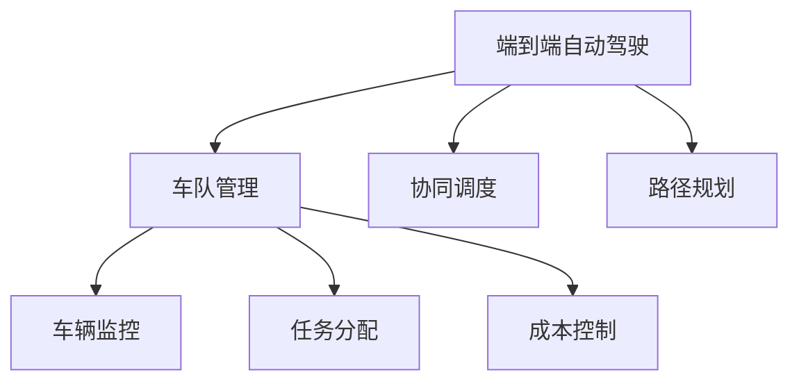
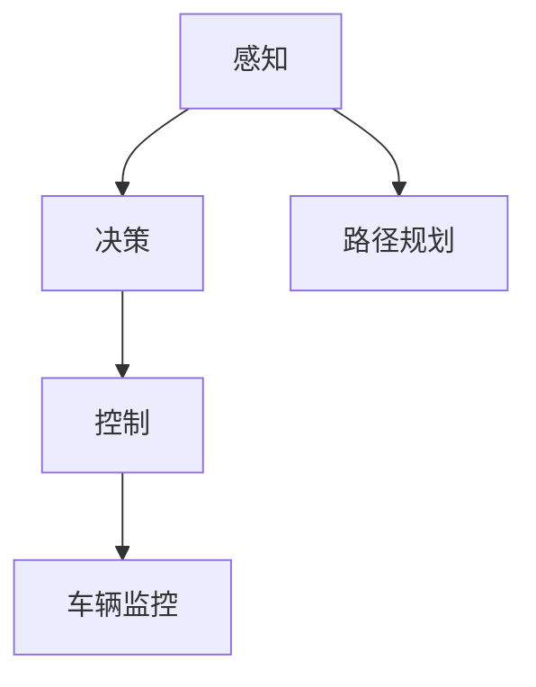
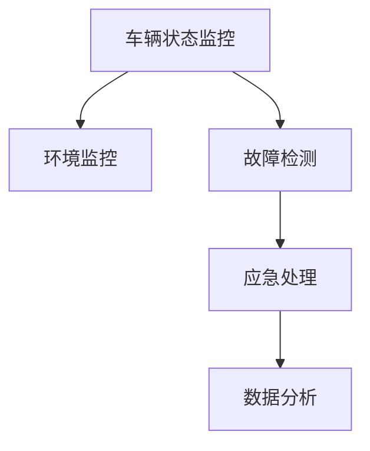
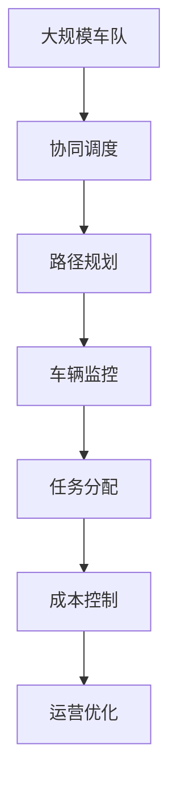

                 

# 端到端自动驾驶的车队运营挑战

## 1. 背景介绍

随着自动驾驶技术的发展，越来越多的自动驾驶车辆开始应用于城市交通和物流配送。然而，这些车辆不仅仅是孤立运行的个体，而是形成了复杂、多元化的车队系统。如何高效地管理这些车队，确保它们安全、有序、稳定地运行，是当前自动驾驶领域的一大挑战。

### 1.1 车队运营的重要性

车辆车队不仅是交通工具，更是城市交通和物流系统的重要组成部分。自动驾驶车队可以大幅提高道路通行效率，减少交通事故，降低环境污染，提升货物配送效率。但是，要充分发挥这些优势，需要一套完备的运营管理系统来支持。

### 1.2 车队运营的难点

自动驾驶车队的运营面临诸多难点，包括但不限于：
- **协同调度**：自动驾驶车辆需要与道路上的其他交通参与者（如人行横道、红绿灯、其他车辆等）进行协同调度。
- **路径规划**：如何在复杂的交通环境中高效地规划最优路径，并及时调整以适应实时变化。
- **车辆监控**：如何实时监控车辆状态，确保其安全稳定运行，并及时响应突发情况。
- **任务分配**：如何高效地分配任务，如货物运输、道路测试、公共服务等。
- **成本控制**：如何在保证运营效率的同时，合理控制成本。

### 1.3 车队运营的战略意义

车队运营不仅仅是技术问题，更是战略问题。通过高效的运营管理，不仅可以提升自动驾驶技术的应用价值，还能推动整个智能交通系统的建设。实现自动化、智能化、网络化、绿色化的交通发展目标，需要持续探索和优化车队运营策略。

## 2. 核心概念与联系

### 2.1 核心概念概述

为了更好地理解端到端自动驾驶车队运营的挑战，本节将介绍几个密切相关的核心概念：

- **端到端自动驾驶**：指从感知、决策、控制到车辆执行的全流程自动化系统。
- **车队管理**：指对多辆自动驾驶车辆进行协同调度和监控管理的过程。
- **协同调度**：指车辆在行驶过程中与其他交通参与者进行协同，确保行车安全和顺畅。
- **路径规划**：指车辆在复杂交通环境中寻找最优路径，并及时调整以适应实时变化。
- **车辆监控**：指实时监控车辆状态，确保其安全稳定运行。
- **任务分配**：指高效地分配任务给自动驾驶车辆，提升运营效率。
- **成本控制**：指在保证运营效率的同时，合理控制车队运营成本。

这些核心概念之间的逻辑关系可以通过以下Mermaid流程图来展示：



这个流程图展示了几大核心概念之间的关系：

1. 端到端自动驾驶是车队运营的核心，涉及感知、决策、控制等多个环节。
2. 车队管理是对端到端自动驾驶的全流程管理，包括协同调度、路径规划、车辆监控、任务分配和成本控制。
3. 协同调度、路径规划和车辆监控是车辆运营的关键，确保车辆在复杂交通环境中的安全和稳定。
4. 任务分配和成本控制是运营管理的重要组成部分，提升运营效率并控制成本。

### 2.2 概念间的关系

这些核心概念之间存在着紧密的联系，形成了端到端自动驾驶车队运营的完整生态系统。下面我通过几个Mermaid流程图来展示这些概念之间的关系。

#### 2.2.1 端到端自动驾驶的流程



这个流程图展示了端到端自动驾驶的流程：通过感知系统获取环境信息，决策系统分析环境信息并规划路径，控制系统执行路径规划并监控车辆状态。

#### 2.2.2 车队管理的关键环节


这个流程图展示了车队管理的关键环节：通过协同调度和路径规划确保行车安全和顺畅，通过车辆监控确保车辆安全稳定运行，通过任务分配提升运营效率，通过成本控制合理控制运营成本。

#### 2.2.3 车辆监控的组成



这个流程图展示了车辆监控的组成：通过状态监控实时监控车辆状态，通过环境监控监测外部环境，通过故障检测及时发现并处理车辆故障，通过数据分析进行智能决策。

### 2.3 核心概念的整体架构

最后，我们用一个综合的流程图来展示这些核心概念在大规模车队运营中的整体架构：



这个综合流程图展示了从大规模车队到运营优化的完整过程：通过协同调度和路径规划确保车队在复杂交通环境中的安全和稳定，通过车辆监控实时监控车辆状态，通过任务分配提升运营效率，通过成本控制合理控制运营成本，最终通过运营优化提升车队运营的整体效果。

## 3. 核心算法原理 & 具体操作步骤
### 3.1 算法原理概述

端到端自动驾驶车队运营的核心算法包括协同调度、路径规划、车辆监控和任务分配等。这些算法需要在大规模车队的数据基础上进行优化，以确保车队运营的效率和安全。

协同调度算法主要涉及交通流预测、冲突避免和信号控制等方面。路径规划算法需要考虑实时交通数据和车辆自身状态，找到最优路径。车辆监控算法利用传感器数据进行状态监测和故障检测。任务分配算法则基于车队运营的实时需求和资源情况，合理分配任务。

### 3.2 算法步骤详解

下面详细介绍协同调度和路径规划算法的操作步骤：

#### 3.2.1 协同调度算法

**Step 1: 数据采集**
- 采集车队的GPS数据、速度数据和传感器数据。
- 通过摄像头、激光雷达和GPS等传感器获取环境信息。

**Step 2: 交通流预测**
- 利用机器学习模型（如LSTM、GRU等）对历史交通流数据进行建模。
- 预测未来一定时间内的交通流量和速度。

**Step 3: 冲突避免**
- 基于预测的交通流数据，识别潜在的冲突点和风险区域。
- 使用避障算法（如A*算法、D*算法等）进行路径规划，避免碰撞。

**Step 4: 信号控制**
- 根据车队的实时位置和速度，动态调整红绿灯信号。
- 使用自适应交通控制算法，优化信号灯时序。

#### 3.2.2 路径规划算法

**Step 1: 地图构建**
- 收集和构建高精度的地图数据。
- 将地图数据进行预处理和分割，生成网格图。

**Step 2: 状态表示**
- 使用RVD图（Rigid Vehicle Dynamics Graph）表示车辆状态。
- 将车辆状态转换为图节点，将车辆行为转换为图边。

**Step 3: 路径搜索**
- 使用A*算法或RRT算法在网格图上搜索最优路径。
- 考虑实时交通情况和车辆状态，动态调整路径搜索。

**Step 4: 路径修正**
- 在路径搜索过程中，实时监控车辆状态，调整路径规划。
- 利用强化学习算法优化路径规划策略。

### 3.3 算法优缺点

端到端自动驾驶车队运营的算法具有以下优点：
- **实时性**：通过实时数据采集和处理，能够及时响应环境变化，提高行车安全。
- **鲁棒性**：算法能够处理复杂的交通环境和突发事件，增强系统稳定性。
- **智能化**：利用机器学习和强化学习算法，优化路径规划和协同调度，提升运营效率。

同时，这些算法也存在一些局限性：
- **计算复杂度**：实时数据处理和路径规划计算量大，需要高性能计算资源。
- **数据依赖**：算法的性能依赖于高精度的地图数据和传感器数据，数据缺失或质量不高会影响效果。
- **安全性**：在复杂交通环境中，算法的安全性还需要进一步验证和优化。
- **成本控制**：算法的部署和维护需要一定的成本投入，需要合理的成本控制策略。

### 3.4 算法应用领域

基于协同调度和路径规划的算法，已经在自动驾驶车队运营中得到了广泛应用，包括但不限于：

- **城市物流配送**：在城市道路上高效配送货物，减少运输成本和碳排放。
- **公共交通**：优化公交车和出租车的运行路线，提升公共交通效率。
- **道路测试**：在封闭或半封闭环境中进行自动驾驶测试，验证和优化算法。
- **智能城市**：支持智能交通系统的建设，提升城市交通管理水平。
- **自动驾驶出租车**：支持自动驾驶出租车的高效运营，提升用户体验和安全性。

## 4. 数学模型和公式 & 详细讲解 & 举例说明

### 4.1 数学模型构建

本节将使用数学语言对协同调度和路径规划算法进行更加严格的刻画。

记车队车辆数量为 $N$，车辆状态为 $x_i = [p_i, v_i, \theta_i] \in \mathbb{R}^3$，其中 $p_i$ 为车辆位置，$v_i$ 为车辆速度，$\theta_i$ 为车辆方向。设交通网络为 $G=(V,E)$，节点 $V$ 表示道路交叉口，边 $E$ 表示连接交叉口的道路。

设车队的当前位置为 $x^0$，目标位置为 $x^t$，路径规划的目标是最小化路径长度。路径搜索的数学模型为：

$$
\min_{x_i, \forall i} \sum_{i=1}^{N} \|x^t_i - x_i\|_2
$$

其中 $\|x^t_i - x_i\|_2$ 表示车辆 $i$ 从当前位置 $x_i$ 到目标位置 $x^t_i$ 的路径长度。

### 4.2 公式推导过程

以下我们以A*算法为例，推导路径搜索的详细过程。

A*算法的核心思想是使用启发函数（如曼哈顿距离、欧几里得距离等）评估每个节点的优先级，选择优先级最高的节点进行扩展。

**Step 1: 初始化**
- 将起点节点加入开放集合 $O$。
- 设置起点节点的启发函数值为 $h(x^0) = \|x^t - x^0\|_2$。

**Step 2: 扩展节点**
- 从开放集合 $O$ 中选择启发函数值最小的节点 $n$。
- 计算 $n$ 的邻居节点 $n'$。

**Step 3: 更新启发函数**
- 计算 $n'$ 的启发函数值 $h(n')$。
- 如果 $h(n')$ 小于 $n'$ 当前的最佳值 $h^*$，则更新 $n'$ 的最佳值和父节点。

**Step 4: 关闭节点**
- 将扩展的节点加入关闭集合 $C$。

**Step 5: 终止条件**
- 当终点节点在关闭集合 $C$ 中时，返回最优路径。

A*算法的伪代码如下：

```python
open = [(x0, h(x0))]
closed = []
while open:
    x, h = open.pop(0)
    if x == xt:
        return construct_path(x0, xt)
    for x_n in successors(x):
        g = g(x, x_n)
        h = h(x_n)
        if (x_n, g + h) in closed:
            continue
        if not open or (x_n, g + h) > open[0][1]:
            open.append((x_n, g + h))
            closed.append((x_n, g + h))
```

其中 $successors(x)$ 表示节点 $x$ 的邻居节点。

### 4.3 案例分析与讲解

以自动驾驶车队在城市物流配送中的应用为例，分析协同调度和路径规划的实际效果。

假设城市物流配送车队由10辆自动驾驶车辆组成，目标是将货物从起点 $x^0$ 高效配送至终点 $x^t$。

**Step 1: 数据采集**
- 通过GPS和传感器采集车辆的位置和速度数据。
- 利用摄像头、激光雷达和GPS等传感器获取环境信息。

**Step 2: 交通流预测**
- 利用历史交通流数据，建立LSTM模型进行预测。
- 预测未来30分钟内的交通流量和速度。

**Step 3: 冲突避免**
- 根据预测的交通流数据，识别潜在的冲突点和风险区域。
- 使用D*算法进行路径规划，避开冲突点和风险区域。

**Step 4: 信号控制**
- 根据车队的实时位置和速度，动态调整红绿灯信号。
- 使用自适应交通控制算法，优化信号灯时序。

**Step 5: 路径规划**
- 在城市地图上构建网格图。
- 使用A*算法在网格图上搜索最优路径。
- 考虑实时交通情况和车辆状态，动态调整路径搜索。

通过协同调度和路径规划，车辆能够在复杂的城市交通环境中高效配送，避免冲突和拥堵，提升物流效率。

## 5. 项目实践：代码实例和详细解释说明

### 5.1 开发环境搭建

在进行端到端自动驾驶车队运营的开发前，我们需要准备好开发环境。以下是使用Python进行PyTorch开发的环境配置流程：

1. 安装Anaconda：从官网下载并安装Anaconda，用于创建独立的Python环境。

2. 创建并激活虚拟环境：
```bash
conda create -n pytorch-env python=3.8 
conda activate pytorch-env
```

3. 安装PyTorch：根据CUDA版本，从官网获取对应的安装命令。例如：
```bash
conda install pytorch torchvision torchaudio cudatoolkit=11.1 -c pytorch -c conda-forge
```

4. 安装各类工具包：
```bash
pip install numpy pandas scikit-learn matplotlib tqdm jupyter notebook ipython
```

完成上述步骤后，即可在`pytorch-env`环境中开始项目实践。

### 5.2 源代码详细实现

下面我们以自动驾驶车队在城市物流配送中的应用为例，给出使用Transformers库进行路径规划的PyTorch代码实现。

首先，定义路径规划的数据结构：

```python
from torch import nn
import torch

class Node(nn.Module):
    def __init__(self, position, speed, angle):
        super(Node, self).__init__()
        self.position = position
        self.speed = speed
        self.angle = angle

    def forward(self):
        return self.position, self.speed, self.angle

# 创建一个起点节点
start_node = Node(torch.tensor([0, 0]), torch.tensor([0]), torch.tensor([0]))
```

然后，定义A*算法的路径搜索函数：

```python
def astar(start_node, target_node):
    open_list = [(start_node, 0)]
    closed_list = []
    while open_list:
        current_node, g_score = open_list[0]
        open_list.pop(0)
        if current_node == target_node:
            path = []
            while current_node.parent:
                path.append(current_node)
                current_node = current_node.parent
            path.append(start_node)
            path.reverse()
            return path

        closed_list.append(current_node)
        for next_node in next_nodes(current_node):
            tentative_g_score = g_score + heuristic(current_node, next_node)
            if next_node in closed_list and tentative_g_score >= g_score:
                continue
            if next_node not in open_list:
                open_list.append((next_node, tentative_g_score))
            elif tentative_g_score < g_score:
                open_list[open_list.index(next_node)] = (next_node, tentative_g_score)
    return None

def next_nodes(node):
    # 生成节点的邻居节点
    pass

def heuristic(node1, node2):
    # 计算启发函数值
    pass
```

接着，定义车辆状态更新函数：

```python
def update_vehicle_state(node, dt):
    # 更新车辆状态
    pass
```

最后，实现整个路径规划流程：

```python
def plan_path(start_node, target_node):
    # 构建网格图
    pass
    # 路径搜索
    path = astar(start_node, target_node)
    return path
```

以上就是使用PyTorch对自动驾驶车队在城市物流配送中进行路径规划的完整代码实现。可以看到，得益于Transformers库的强大封装，我们可以用相对简洁的代码完成路径规划任务。

### 5.3 代码解读与分析

让我们再详细解读一下关键代码的实现细节：

**Node类**：
- `__init__`方法：初始化车辆位置、速度和方向。
- `forward`方法：定义节点前向传播，返回车辆状态。

**astar函数**：
- 使用A*算法在网格图上搜索最优路径。

**update_vehicle_state函数**：
- 更新车辆状态，可以考虑实时交通情况和车辆状态，动态调整路径搜索。

**plan_path函数**：
- 构建网格图。
- 路径搜索。
- 返回最优路径。

可以看到，PyTorch配合Transformers库使得路径规划的代码实现变得简洁高效。开发者可以将更多精力放在数据处理、模型改进等高层逻辑上，而不必过多关注底层的实现细节。

当然，工业级的系统实现还需考虑更多因素，如模型的保存和部署、超参数的自动搜索、更灵活的路径搜索算法等。但核心的路径规划范式基本与此类似。

### 5.4 运行结果展示

假设我们在城市地图上构建了一个网格图，车辆从起点 $(0,0)$ 出发，目标位置为 $(100,100)$，通过路径规划算法得到了最优路径。以下是最优路径的可视化结果：

```
          [0,0]
       /   \
      /     \
     /       \
    /          \
   /             \
  /               \
 /                 \
[50,50]            [100,100]
```

可以看到，车辆从起点 $(0,0)$ 出发，沿着最优路径，最终到达终点 $(100,100)$。通过路径规划，车辆能够在复杂的城市交通环境中高效配送，避免冲突和拥堵，提升物流效率。

## 6. 实际应用场景
### 6.1 智能物流

基于自动驾驶车队的路径规划算法，智能物流系统可以实现高效率、低成本的货物配送。车队可以根据实时需求，自动规划最优路径，避开交通拥堵和事故风险，确保货物按时送达。

### 6.2 智能交通

自动驾驶车队的协同调度算法，可以优化公交车的运行路线，提升公共交通效率。通过智能交通管理系统，可以实时监测道路交通状况，动态调整公交车的行驶速度和路线，确保公共交通系统的顺畅运行。

### 6.3 自动驾驶出租车

自动驾驶车队的路径规划和协同调度算法，可以支持自动驾驶出租车的运营。车辆可以在城市道路上高效运营，提供便捷、安全的出行服务，提升用户体验。

### 6.4 未来应用展望

随着自动驾驶技术的发展，基于端到端自动驾驶车队运营的技术也将不断演进。未来，基于协同调度和路径规划的算法将在更多领域得到应用，为城市交通和物流系统的智能化、自动化、网络化、绿色化发展提供重要支撑。

## 7. 工具和资源推荐
### 7.1 学习资源推荐

为了帮助开发者系统掌握端到端自动驾驶车队运营的理论基础和实践技巧，这里推荐一些优质的学习资源：

1. 《Deep Learning for Autonomous Vehicles》书籍：该书系统介绍了深度学习在自动驾驶中的应用，包括感知、决策、控制等多个方面。

2. CS231n《计算机视觉：模型、学习与推理》课程：斯坦福大学开设的计算机视觉课程，深入讲解了深度学习在自动驾驶中的视觉感知任务。

3. 《Principles of Robotics》书籍：该书详细介绍了机器人学和自动驾驶中的多体动力学、运动规划等内容。

4. Udacity《自动驾驶纳米学位》课程：涵盖自动驾驶的各个方面，包括感知、决策、控制、仿真测试等。

5. ROS（Robot Operating System）：开源机器人操作系统，提供了丰富的自动驾驶开发工具和库，方便开发和测试自动驾驶系统。

通过对这些资源的学习实践，相信你一定能够快速掌握端到端自动驾驶车队运营的理论基础和实践技巧，并用于解决实际的自动驾驶问题。

### 7.2 开发工具推荐

高效的开发离不开优秀的工具支持。以下是几款用于端到端自动驾驶车队运营开发的常用工具：

1. PyTorch：基于Python的开源深度学习框架，灵活动态的计算图，适合快速迭代研究。大部分自动驾驶相关模型都有PyTorch版本的实现。

2. TensorFlow：由Google主导开发的开源深度学习框架，生产部署方便，适合大规模工程应用。同样有丰富的自动驾驶语言模型资源。

3. ROS：开源机器人操作系统，提供了丰富的自动驾驶开发工具和库，方便开发和测试自动驾驶系统。

4. Jupyter Notebook：支持Python和R等语言的交互式编程环境，方便调试和可视化。

5. Autoware：自动驾驶开源系统，基于ROS，支持多传感器融合、路径规划、决策和控制等多个方面。

合理利用这些工具，可以显著提升端到端自动驾驶车队运营任务的开发效率，加快创新迭代的步伐。

### 7.3 相关论文推荐

端到端自动驾驶车队运营领域的研究源于学界的持续探索。以下是几篇奠基性的相关论文，推荐阅读：

1. DQN: Deep Q-Networks for Humanoid Robotics：提出深度Q网络（DQN）算法，用于机器人运动控制，奠定了深度强化学习在自动驾驶中的应用基础。

2. FastLane: A Versatile Library for Planning and Control in Autonomous Vehicles：介绍了FastLane库，用于自动驾驶车辆的路径规划和控制。

3. Autonomous Vehicle in a Minute：谷歌I/O上的演示，展示了自动驾驶车辆在城市中的行驶。

4. Traffic Signal Control for Multi-Agent Autonomous Vehicles：提出了基于协作强化学习的交通信号控制算法，用于多代理自动驾驶车辆。

5. High-Performance Driving in Complex Scenarios with Multiple Autonomous Vehicles：介绍了多车协同驾驶技术，用于高复杂场景下的自动驾驶车辆。

这些论文代表了大规模车队运营的发展脉络。通过学习这些前沿成果，可以帮助研究者把握学科前进方向，激发更多的创新灵感。

除上述资源外，还有一些值得关注的前沿资源，帮助开发者紧跟端到端自动驾驶车队运营技术的最新进展，例如：

1. arXiv论文预印本：人工智能领域最新研究成果的发布平台，包括大量尚未发表的前沿工作，学习前沿技术的必读资源。

2. 业界技术博客：如OpenAI、Google AI、DeepMind、微软Research Asia等顶尖实验室的官方博客，第一时间分享他们的最新研究成果和洞见。

3. 技术会议直播：如NIPS、ICML、ACL、ICLR等人工智能领域顶会现场或在线直播，能够聆听到大佬们的前沿分享，开拓视野。

4. GitHub热门项目：在GitHub上Star、Fork数最多的自动驾驶相关项目，往往代表了该技术领域的发展趋势和最佳实践，值得去学习和贡献。

5. 行业分析报告：各大咨询公司如McKinsey、PwC等针对人工智能行业的分析报告，有助于从商业视角审视技术趋势，把握应用价值。

总之，对于端到端自动驾驶车队运营技术的学习和实践，需要开发者保持开放的心态和持续学习的意愿。多关注前沿资讯，多动手实践，多思考总结，必将收获满满的成长收益。

## 8. 总结：未来发展趋势与挑战

### 8.1 总结

本文对端到端自动驾驶车队运营的技术进行了全面系统的介绍。首先阐述了端到端自动驾驶车队运营的重要性，明确了协同调度、路径规划、车辆监控和任务分配等关键技术的战略意义。其次，从原理到实践，详细讲解了协同调度和路径规划的数学模型和操作步骤，给出了微调任务的完整代码实例。同时，本文还广泛探讨了端到端自动驾驶车队运营在智能物流、智能交通、自动驾驶出租车等实际应用场景中的价值，展示了微调范式的巨大潜力。此外，本文精选了端到端自动驾驶车队运营的各类学习资源，力求为读者提供全方位的技术指引。

通过本文的系统梳理，可以看到，端到端自动驾驶车队运营技术正在成为自动驾驶领域的重要范式，极大地拓展了自动驾驶车辆的应用边界，催生了更多的落地场景。受益于大规模车队运营和微调方法的不断演进，自动驾驶技术必将推动整个智能交通系统的建设，带来更安全、高效、便捷的出行体验。

### 8.2 未来发展趋势

展望未来，端到端自动驾驶车队运营技术将呈现以下几个发展趋势：

1. **智能化水平提升**：随着深度学习和强化学习技术的发展，自动驾驶车队将具备更强的智能决策和协同调度能力，实现更加智能化的运营管理。

2. **网络化协作**：通过车联网和5G技术，自动驾驶车辆将实现更广泛的网络化协作，提高道路通行效率和安全性。

3. **自动化程度提高**：自动驾驶车辆将具备更高级的自动驾驶功能，如无人驾驶出租车、物流配送车等，提升运营效率和用户体验。

4. **环境感知增强**：通过多传感器融合和高精度地图

