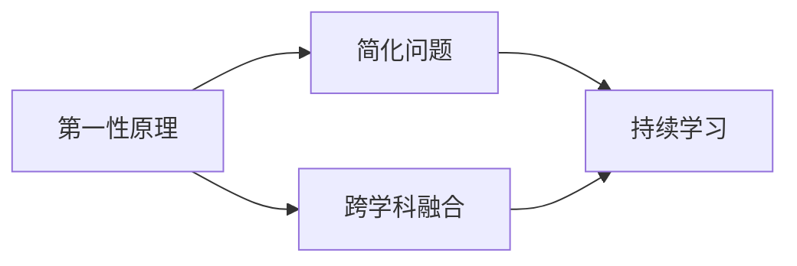
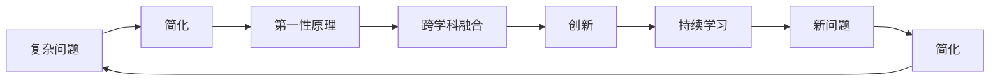

                 

## 1. 背景介绍

### 1.1 问题由来

随着科技的飞速发展和人工智能（AI）的兴起，第一性原理思维能力的重要性日益凸显。第一性原理是指从最基础和最本质的规律出发，直接推导新知识的过程。它强调去繁就简，从最根本的原理出发进行创新和思考。在AI领域，第一性原理思维能力有助于突破传统思维模式的束缚，开创新的技术路径和应用场景。

### 1.2 问题核心关键点

第一性原理思维能力的关键点包括：
1. **基础理论掌握**：对所研究领域的核心基础理论有深刻理解和掌握。
2. **问题简化**：将复杂问题简化为基本元素，从而寻找解决问题的新方法。
3. **跨学科融合**：跨学科整合不同领域的知识和原理，进行综合创新。
4. **创新突破**：基于第一性原理进行技术创新，突破传统思维限制。
5. **持续学习**：持续更新知识，不断挑战新的问题。

这些关键点共同构成了第一性原理思维能力的核心，能够帮助AI从业者更好地进行创新和应用。

### 1.3 问题研究意义

培养第一性原理思维能力对于AI领域具有重要意义：
1. **促进技术创新**：突破传统技术框架，探索新领域和新方法。
2. **提高问题解决效率**：简化问题模型，直接找到问题本质。
3. **增强应用范围**：通过跨学科融合，拓展AI技术的适用性。
4. **提升竞争力**：持续学习和更新知识，保持技术领先地位。

本文将系统介绍第一性原理思维能力的培养方法，帮助AI从业者提升技术水平和创新能力。

## 2. 核心概念与联系

### 2.1 核心概念概述

第一性原理思维能力的培养涉及多个核心概念，主要包括：
1. **第一性原理**：从最基本的原理出发进行推导和创新的过程。
2. **简化问题**：将复杂问题分解为基本元素，进行简化处理。
3. **跨学科融合**：整合不同学科的知识和理论，进行综合创新。
4. **持续学习**：不断更新知识和技能，保持技术的前沿性。

这些概念通过以下Mermaid流程图展示其联系：



这个流程图展示了第一性原理与其他概念之间的逻辑关系：
- 第一性原理是整个思维过程的起点。
- 简化问题是通过基础原理对复杂问题进行分解和简化。
- 跨学科融合是将不同领域的基础原理进行整合，进行综合创新。
- 持续学习则是不断更新知识，保持第一性原理的适用性和创新性。

### 2.2 概念间的关系

这些核心概念之间存在着紧密的联系，构成了第一性原理思维能力的完整框架：
1. **第一性原理是基础**：任何创新和改进都应基于最基本的原理。
2. **简化问题为手段**：通过简化问题，更好地理解和应用第一性原理。
3. **跨学科融合是路径**：通过跨学科整合，找到新的创新方向。
4. **持续学习是保障**：保持知识和理论的最新状态，持续更新和应用第一性原理。

### 2.3 核心概念的整体架构

以下是一个综合的Mermaid流程图，展示了第一性原理思维能力的整体架构：



这个流程图展示了从复杂问题出发，通过简化、应用第一性原理、跨学科融合、创新和持续学习，不断循环往复的过程。

## 3. 核心算法原理 & 具体操作步骤

### 3.1 算法原理概述

第一性原理思维能力的培养，基于以下核心算法原理：
1. **基本原理推导**：从基础理论出发，推导出新的原理和知识。
2. **问题简化**：将复杂问题分解为基本元素，进行简化处理。
3. **跨学科整合**：整合不同学科的基础原理，进行综合创新。
4. **持续学习**：通过持续学习，更新知识，保持第一性原理的创新性。

### 3.2 算法步骤详解

以下是一系列详细的步骤，帮助读者掌握第一性原理思维能力的培养方法：
1. **选择合适的领域**：选择具有研究价值和应用前景的领域。
2. **掌握基础理论**：深入学习所选领域的基础理论。
3. **问题分解**：将复杂问题分解为基本元素。
4. **应用第一性原理**：基于基础原理，推导出新的原理和知识。
5. **跨学科整合**：将不同学科的基础原理进行整合，进行综合创新。
6. **持续更新**：持续学习新的知识和理论，保持技术的前沿性。

### 3.3 算法优缺点

第一性原理思维能力培养的优势包括：
1. **创新性**：基于基础原理进行创新，突破传统思维限制。
2. **高效性**：简化问题模型，直接找到问题本质。
3. **广适应性**：通过跨学科融合，拓展应用范围。

其缺点包括：
1. **高门槛**：需要深入掌握基础理论，对个人知识水平要求高。
2. **复杂性**：跨学科整合和持续学习需要大量时间和精力。

### 3.4 算法应用领域

第一性原理思维能力培养的方法可以应用于多个领域，例如：
1. **计算机科学**：通过简化算法和数据结构，提升算法效率。
2. **自然语言处理**：简化语言模型，提升自然语言理解能力。
3. **人工智能**：整合不同学科的知识，进行综合创新。
4. **生物信息学**：通过整合生物学和计算机科学的原理，进行新的生物研究。
5. **金融科技**：通过跨学科融合，开发新的金融模型和技术。

## 4. 数学模型和公式 & 详细讲解 & 举例说明

### 4.1 数学模型构建

我们通过数学模型来展示第一性原理思维能力的培养过程：
假设有一个复杂问题 $P$，我们需要对其进行简化和创新。我们将问题 $P$ 分解为基本元素 $A$、$B$、$C$，并应用第一性原理 $O_1$、$O_2$ 进行推导。

$$
P = A + B + C
$$

其中，$A$、$B$、$C$ 为问题的基本元素，$O_1$、$O_2$ 为基础原理。

### 4.2 公式推导过程

我们以优化算法为例，展示第一性原理的应用。假设问题为函数优化问题：

$$
f(x) = ax^2 + bx + c
$$

通过应用第一性原理 $O_1$ 和 $O_2$，我们推导出新的优化算法：

$$
f(x) = \frac{\partial f(x)}{\partial x} = 2ax + b
$$

将 $f(x)$ 的导数等于零，得到极值点：

$$
2ax + b = 0 \Rightarrow x = -\frac{b}{2a}
$$

这就是基于第一性原理推导出的新算法，用于求解函数的最小值。

### 4.3 案例分析与讲解

我们以机器学习中的神经网络为例，展示第一性原理的应用：
1. **基础原理**：神经网络通过多层非线性变换进行数据处理。
2. **简化问题**：将神经网络简化为基本单元。
3. **跨学科整合**：整合统计学和计算机科学原理，进行模型优化。
4. **持续学习**：持续更新模型，保持技术的前沿性。

## 5. 项目实践：代码实例和详细解释说明

### 5.1 开发环境搭建

首先，安装Python和相关开发工具，例如PyTorch、TensorFlow等。创建虚拟环境，并配置好开发工具。

```bash
conda create -n myenv python=3.7
conda activate myenv
pip install torch torchvision torchaudio
```

### 5.2 源代码详细实现

我们以神经网络为例，展示第一性原理的应用。以下是一个简单的神经网络模型：

```python
import torch
import torch.nn as nn

class NeuralNetwork(nn.Module):
    def __init__(self):
        super(NeuralNetwork, self).__init__()
        self.fc1 = nn.Linear(784, 128)
        self.fc2 = nn.Linear(128, 10)
    
    def forward(self, x):
        x = torch.relu(self.fc1(x))
        x = self.fc2(x)
        return x
```

在模型训练过程中，我们可以应用第一性原理进行优化：

```python
def train(model, train_loader, epochs, device):
    model.to(device)
    criterion = nn.CrossEntropyLoss()
    optimizer = torch.optim.Adam(model.parameters(), lr=0.001)
    
    for epoch in range(epochs):
        running_loss = 0.0
        for i, (inputs, labels) in enumerate(train_loader):
            inputs, labels = inputs.to(device), labels.to(device)
            optimizer.zero_grad()
            outputs = model(inputs)
            loss = criterion(outputs, labels)
            loss.backward()
            optimizer.step()
            running_loss += loss.item()
        print('Epoch [{}/{}], Loss: {:.4f}'.format(epoch+1, epochs, running_loss/len(train_loader)))
```

### 5.3 代码解读与分析

我们以神经网络为例，展示第一性原理的应用。以下是对代码的详细解读：
1. **模型定义**：定义神经网络模型，包含输入层、隐藏层和输出层。
2. **优化器定义**：使用Adam优化器进行模型优化。
3. **训练过程**：通过反向传播进行模型训练，输出损失值。

## 6. 实际应用场景

### 6.1 第一性原理在计算机科学中的应用

第一性原理在计算机科学中有广泛应用，例如：
1. **算法优化**：通过简化算法，提升算法效率。
2. **数据结构设计**：简化数据结构，提高数据处理能力。
3. **模型训练**：通过简化模型，提升模型性能。

### 6.2 第一性原理在自然语言处理中的应用

第一性原理在自然语言处理中也有重要应用，例如：
1. **语言模型简化**：简化语言模型，提升自然语言理解能力。
2. **词汇表设计**：简化词汇表，提升模型训练效率。
3. **数据预处理**：简化数据预处理步骤，提升模型性能。

### 6.3 第一性原理在人工智能中的应用

第一性原理在人工智能中有广泛应用，例如：
1. **模型融合**：整合不同模型的优点，进行综合创新。
2. **知识图谱构建**：通过整合多领域知识，构建知识图谱。
3. **生成对抗网络**：通过简化模型，提升生成对抗网络的性能。

### 6.4 未来应用展望

未来，第一性原理思维能力的应用将更加广泛，包括：
1. **自适应学习**：通过第一性原理进行自适应学习，提升模型性能。
2. **跨模态融合**：通过整合不同模态数据，进行综合创新。
3. **实时优化**：通过第一性原理进行实时优化，提升系统性能。

## 7. 工具和资源推荐

### 7.1 学习资源推荐

1. **《计算机程序设计艺术》系列书籍**：深入介绍计算机科学和算法设计的基本原理。
2. **Coursera、edX等在线课程**：提供系统化的计算机科学和AI课程，涵盖基础理论和实践应用。
3. **GitHub**：查找和学习前沿技术，参与开源项目。
4. **arXiv**：获取最新的AI研究成果和论文。

### 7.2 开发工具推荐

1. **PyTorch**：强大的深度学习框架，提供丰富的API和工具。
2. **TensorFlow**：Google开发的深度学习框架，支持大规模模型训练。
3. **Jupyter Notebook**：交互式编程环境，便于代码调试和数据分析。

### 7.3 相关论文推荐

1. **《算法设计与分析基础》**：详细介绍了算法设计和分析的基本原理和技巧。
2. **《深度学习》**：介绍深度学习的基本原理和应用。
3. **《人工智能基础》**：介绍人工智能的基本原理和应用。

## 8. 总结：未来发展趋势与挑战

### 8.1 研究成果总结

第一性原理思维能力的培养，有助于推动AI技术的创新和发展。在AI领域，第一性原理思维能力的应用已经取得了显著成果，包括：
1. **算法优化**：通过简化算法，提升算法效率。
2. **模型优化**：通过简化模型，提升模型性能。
3. **数据优化**：通过简化数据预处理步骤，提升数据处理能力。

### 8.2 未来发展趋势

未来，第一性原理思维能力将持续推动AI技术的创新和发展：
1. **自适应学习**：通过第一性原理进行自适应学习，提升模型性能。
2. **跨模态融合**：通过整合不同模态数据，进行综合创新。
3. **实时优化**：通过第一性原理进行实时优化，提升系统性能。

### 8.3 面临的挑战

第一性原理思维能力培养也面临一些挑战：
1. **高门槛**：需要深入掌握基础理论，对个人知识水平要求高。
2. **复杂性**：跨学科整合和持续学习需要大量时间和精力。

### 8.4 研究展望

未来，第一性原理思维能力的研究方向包括：
1. **理论创新**：探索新的理论和方法，提升第一性原理的应用范围。
2. **实践应用**：将第一性原理应用于更多实际问题，提升应用效果。
3. **教育培训**：开发更多教育和培训资源，帮助更多人掌握第一性原理思维能力。

## 9. 附录：常见问题与解答

### Q1: 如何培养第一性原理思维能力？

A: 培养第一性原理思维能力需要掌握基础理论，简化问题，跨学科整合，持续学习。以下是具体步骤：
1. 深入学习基础理论，建立系统化的知识体系。
2. 将复杂问题分解为基本元素，进行简化处理。
3. 整合不同学科的基础原理，进行综合创新。
4. 持续学习新的知识和理论，保持技术的前沿性。

### Q2: 第一性原理思维能力在实际应用中有哪些优势？

A: 第一性原理思维能力在实际应用中的优势包括：
1. 创新性：基于基础原理进行创新，突破传统思维限制。
2. 高效性：简化问题模型，直接找到问题本质。
3. 广适应性：通过跨学科融合，拓展应用范围。

### Q3: 第一性原理思维能力培养有哪些挑战？

A: 第一性原理思维能力培养面临的挑战包括：
1. 高门槛：需要深入掌握基础理论，对个人知识水平要求高。
2. 复杂性：跨学科整合和持续学习需要大量时间和精力。

### Q4: 第一性原理思维能力在AI领域的应用前景如何？

A: 第一性原理思维能力在AI领域具有广阔的应用前景：
1. 算法优化：通过简化算法，提升算法效率。
2. 模型优化：通过简化模型，提升模型性能。
3. 数据优化：通过简化数据预处理步骤，提升数据处理能力。

作者：禅与计算机程序设计艺术 / Zen and the Art of Computer Programming

