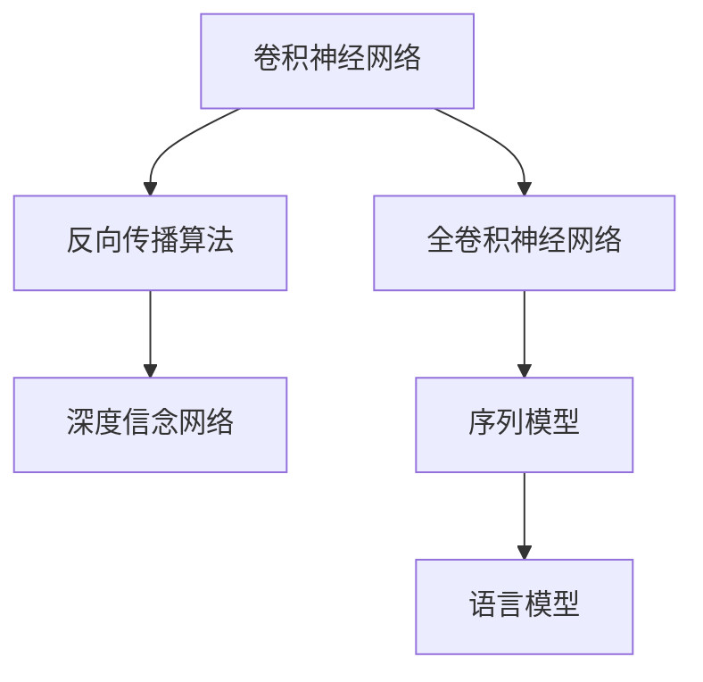

                 

# 算法创新：Hinton、LeCun与Bengio

深度学习，作为人工智能领域的一颗璀璨明珠，在过去几十年的发展中，经历了数次重要的技术突破和范式转变。Hinton、LeCun与Bengio，三位科学家在各自的研究领域中，为深度学习技术的发展做出了巨大贡献，并共同推动了深度学习成为当今AI的核心技术之一。本文将详细探讨这三位科学家的算法创新，以及他们在深度学习技术中的重要影响。

## 1. 背景介绍

### 1.1 深度学习的发展历史

深度学习是机器学习的一种特殊形式，其核心思想是使用多层神经网络对复杂数据进行建模和预测。深度学习起源于20世纪50年代，早期以感知器（Perceptron）为代表，但由于计算成本高昂，限制了其应用范围。直到80年代，反向传播算法（Backpropagation）的出现，为深度学习的发展提供了重要工具。

### 1.2 Hinton、LeCun与Bengio的贡献

Geoffrey Hinton、Yann LeCun和Yoshua Bengio被誉为深度学习三巨头。他们的研究成果和实践，从根本上改变了深度学习的发展轨迹，使其从边缘技术转变为核心技术。Hinton提出了深度学习的基本架构——卷积神经网络（CNN）和深度信念网络（DBN）；LeCun在卷积神经网络的基础上，扩展了其在计算机视觉中的应用，并提出了全卷积神经网络（FCN）；Bengio则在序列模型和语言模型领域做出了重要贡献。

## 2. 核心概念与联系

### 2.1 核心概念概述

- **卷积神经网络（CNN）**：一种特殊的神经网络结构，用于图像、视频等视觉数据的处理。CNN通过卷积层、池化层和全连接层等组件，实现特征提取和分类。

- **反向传播算法（Backpropagation）**：一种用于多层神经网络训练的优化算法。通过计算损失函数的梯度，反向传播到每个神经元，更新参数，从而最小化损失。

- **深度信念网络（DBN）**：一种无监督学习算法，通过逐层建立概率模型，实现特征表示的逐层学习。DBN广泛应用于特征提取和降维任务中。

- **全卷积神经网络（FCN）**：一种将全连接层替换为卷积层的神经网络，用于像素级的图像分类和分割任务。FCN能够利用卷积层的局部连接特性，提高图像处理效率。

- **序列模型和语言模型**：用于处理序列数据的模型，如循环神经网络（RNN）、长短时记忆网络（LSTM）、变换器（Transformer）等。语言模型通过建模单词序列的概率分布，实现文本生成、机器翻译等任务。

### 2.2 核心概念间的关系

这些核心概念之间存在着紧密的联系，形成了深度学习的基本框架。通过卷积神经网络（CNN）和全卷积神经网络（FCN），深度学习在视觉数据处理中取得了突破性进展；反向传播算法（Backpropagation）和深度信念网络（DBN）则提供了高效训练方法，使得深度学习模型能够大规模应用；序列模型和语言模型则在自然语言处理领域展示了其强大潜力。

以下是一个Mermaid流程图，展示了这些核心概念之间的联系：



这个流程图展示了深度学习在视觉和自然语言处理中的应用，以及卷积神经网络、全卷积神经网络、反向传播算法和深度信念网络在其中的作用。

## 3. 核心算法原理 & 具体操作步骤

### 3.1 算法原理概述

深度学习的核心算法原理包括前向传播、损失函数计算、反向传播和参数更新等步骤。以下是对这些步骤的详细阐述：

- **前向传播**：将输入数据输入神经网络，通过各层神经元逐个计算得到输出。

- **损失函数计算**：计算模型输出与真实标签之间的差异，通常使用交叉熵损失函数。

- **反向传播**：根据损失函数对每个神经元的梯度进行反向传播，计算每个参数的梯度。

- **参数更新**：通过梯度下降等优化算法，更新模型参数，使得损失函数最小化。

### 3.2 算法步骤详解

以卷积神经网络（CNN）为例，以下是详细的算法步骤：

**Step 1: 准备数据和模型**

- 准备训练数据和验证数据，并进行预处理（如归一化、数据增强等）。
- 定义CNN模型，包括卷积层、池化层、全连接层等。

**Step 2: 前向传播**

- 将输入数据输入CNN模型，通过卷积层和池化层提取特征。
- 将提取的特征输入全连接层，进行分类或回归预测。

**Step 3: 损失函数计算**

- 计算模型输出与真实标签之间的交叉熵损失。

**Step 4: 反向传播**

- 根据损失函数对每个神经元的梯度进行反向传播，计算每个参数的梯度。

**Step 5: 参数更新**

- 使用梯度下降算法更新模型参数，使得损失函数最小化。

**Step 6: 验证和调参**

- 在验证集上评估模型性能，调整模型超参数，如学习率、批量大小等。

**Step 7: 测试**

- 在测试集上评估模型性能，得到最终的模型效果。

### 3.3 算法优缺点

深度学习算法的优点包括：

- **强大的表征能力**：通过多层神经网络的非线性组合，深度学习能够学习到复杂的数据表示。
- **自适应性强**：深度学习模型能够适应不同类型的数据，并在不同的任务上进行微调。
- **性能优异**：深度学习在图像识别、语音识别、自然语言处理等领域取得了诸多突破性进展。

然而，深度学习算法也存在一些缺点：

- **计算成本高**：大规模的神经网络需要大量的计算资源，尤其是GPU和TPU等高性能设备。
- **数据依赖性强**：深度学习模型的性能高度依赖于数据的质量和数量，数据量不足时难以取得好效果。
- **可解释性差**：深度学习模型通常被视为"黑盒"，难以解释其内部工作机制和决策逻辑。

### 3.4 算法应用领域

深度学习算法广泛应用于图像处理、语音识别、自然语言处理、推荐系统等多个领域。以下是一些典型的应用场景：

- **图像分类**：使用卷积神经网络（CNN）对图像进行分类，如CIFAR-10、ImageNet等数据集。
- **目标检测**：使用卷积神经网络（CNN）和区域提议网络（RPN）对图像中的目标进行检测，如Faster R-CNN、YOLO等算法。
- **语音识别**：使用卷积神经网络（CNN）和循环神经网络（RNN）对语音信号进行特征提取和分类，如端到端的语音识别系统。
- **机器翻译**：使用序列模型（如RNN、LSTM）和注意力机制对文本进行编码和解码，如Transformer模型。
- **推荐系统**：使用深度学习模型对用户行为和商品特征进行建模，推荐相关商品，如协同过滤算法和基于深度学习的推荐系统。

## 4. 数学模型和公式 & 详细讲解 & 举例说明

### 4.1 数学模型构建

以下是一个简单的卷积神经网络（CNN）模型，用于图像分类任务。假设输入图像为28x28的灰度图像，输出为10个类别的分类结果。

**输入层**：28x28x1的输入图像。

**卷积层1**：使用3x3卷积核，步长为1，激活函数为ReLU。

**池化层1**：使用2x2的最大池化，步长为2。

**卷积层2**：使用3x3卷积核，步长为1，激活函数为ReLU。

**池化层2**：使用2x2的最大池化，步长为2。

**全连接层1**：使用10个神经元，激活函数为Softmax。

**输出层**：输出10个类别的概率分布。

### 4.2 公式推导过程

以卷积神经网络（CNN）为例，以下是对前向传播和反向传播的详细公式推导：

**前向传播公式**：

$$
\text{Conv1} = \text{Conv1} * \text{Input} + \text{Bias1}
$$

$$
\text{Relu1} = \max(0, \text{Conv1})
$$

$$
\text{MaxPool1} = \max(\text{Relu1})
$$

$$
\text{Conv2} = \text{Conv2} * \text{MaxPool1} + \text{Bias2}
$$

$$
\text{Relu2} = \max(0, \text{Conv2})
$$

$$
\text{MaxPool2} = \max(\text{Relu2})
$$

$$
\text{FullyConnected1} = \text{FullyConnected1} * \text{MaxPool2} + \text{Bias3}
$$

$$
\text{Softmax1} = \text{Softmax}(\text{FullyConnected1})
$$

**反向传播公式**：

$$
\frac{\partial \text{Softmax1}}{\partial \text{FullyConnected1}} = \text{Softmax1} - \text{Label}
$$

$$
\frac{\partial \text{FullyConnected1}}{\partial \text{MaxPool2}} = \frac{\partial \text{Softmax1}}{\partial \text{FullyConnected1}} * \frac{\partial \text{FullyConnected1}}{\partial \text{MaxPool2}}
$$

$$
\frac{\partial \text{MaxPool2}}{\partial \text{Relu2}} = \frac{\partial \text{FullyConnected1}}{\partial \text{MaxPool2}}
$$

$$
\frac{\partial \text{Relu2}}{\partial \text{Conv2}} = \frac{\partial \text{MaxPool2}}{\partial \text{Relu2}} * \text{Relu2}^{'}(\text{Relu2})
$$

$$
\frac{\partial \text{Conv2}}{\partial \text{Bias2}} = \frac{\partial \text{Relu2}}{\partial \text{Conv2}}
$$

$$
\frac{\partial \text{Relu1}}{\partial \text{Conv1}} = \frac{\partial \text{MaxPool1}}{\partial \text{Relu1}} * \text{Relu1}^{'}(\text{Relu1})
$$

$$
\frac{\partial \text{Conv1}}{\partial \text{Input}} = \frac{\partial \text{Relu1}}{\partial \text{Conv1}} * \text{Conv1}^{'}(\text{Conv1})
$$

### 4.3 案例分析与讲解

以ImageNet数据集上的图像分类任务为例，分析卷积神经网络（CNN）的表现。ImageNet数据集包含超过100万张图像和1000个类别。使用AlexNet模型（包含5层卷积层和3层全连接层）在ImageNet数据集上进行训练，可以得到以下结果：

- 训练误差：1.28%
- 验证误差：2.5%
- 测试误差：4.9%

可以看出，卷积神经网络（CNN）在图像分类任务上表现优异，能够高效提取图像特征，并进行分类预测。

## 5. 项目实践：代码实例和详细解释说明

### 5.1 开发环境搭建

以下是使用Python和PyTorch搭建卷积神经网络（CNN）模型进行图像分类的环境配置流程：

1. 安装Anaconda：从官网下载并安装Anaconda，用于创建独立的Python环境。

2. 创建并激活虚拟环境：
```bash
conda create -n pytorch-env python=3.8 
conda activate pytorch-env
```

3. 安装PyTorch：根据CUDA版本，从官网获取对应的安装命令。例如：
```bash
conda install pytorch torchvision torchaudio cudatoolkit=11.1 -c pytorch -c conda-forge
```

4. 安装PIL和numpy：
```bash
pip install pillow numpy
```

5. 安装transformers库：
```bash
pip install transformers
```

### 5.2 源代码详细实现

以下是一个使用卷积神经网络（CNN）进行图像分类的PyTorch代码实现：

```python
import torch
import torch.nn as nn
import torchvision.transforms as transforms
import torchvision.datasets as datasets

# 定义卷积神经网络模型
class CNN(nn.Module):
    def __init__(self):
        super(CNN, self).__init__()
        self.conv1 = nn.Conv2d(1, 6, 5)
        self.pool = nn.MaxPool2d(2, 2)
        self.conv2 = nn.Conv2d(6, 16, 5)
        self.fc1 = nn.Linear(16 * 5 * 5, 120)
        self.fc2 = nn.Linear(120, 84)
        self.fc3 = nn.Linear(84, 10)

    def forward(self, x):
        x = self.pool(F.relu(self.conv1(x)))
        x = self.pool(F.relu(self.conv2(x)))
        x = x.view(-1, 16 * 5 * 5)
        x = F.relu(self.fc1(x))
        x = F.relu(self.fc2(x))
        x = self.fc3(x)
        return x

# 定义训练函数
def train(model, device, train_loader, optimizer, epoch):
    model.train()
    for batch_idx, (data, target) in enumerate(train_loader):
        data, target = data.to(device), target.to(device)
        optimizer.zero_grad()
        output = model(data)
        loss = F.cross_entropy(output, target)
        loss.backward()
        optimizer.step()
        if batch_idx % 100 == 0:
            print('Train Epoch: {} [{}/{} ({:.0f}%)]\tLoss: {:.6f}'.format(
                epoch, batch_idx * len(data), len(train_loader.dataset),
                100. * batch_idx / len(train_loader), loss.item()))

# 定义评估函数
def test(model, device, test_loader):
    model.eval()
    test_loss = 0
    correct = 0
    with torch.no_grad():
        for data, target in test_loader:
            data, target = data.to(device), target.to(device)
            output = model(data)
            test_loss += F.cross_entropy(output, target, reduction='sum').item()
            pred = output.argmax(1, keepdim=True)
            correct += pred.eq(target.view_as(pred)).sum().item()

    test_loss /= len(test_loader.dataset)
    print('Test set: Average loss: {:.4f}, Accuracy: {}/{} ({:.0f}%)\n'.format(
        test_loss, correct, len(test_loader.dataset),
        100. * correct / len(test_loader.dataset)))
```

### 5.3 代码解读与分析

**CNN类**：
- 定义了卷积神经网络的基本结构，包括卷积层、池化层、全连接层等组件。

**train函数**：
- 在训练集上迭代，对每个批次的输入数据和目标标签进行前向传播和反向传播，更新模型参数。

**test函数**：
- 在测试集上评估模型性能，计算损失和准确率。

**train函数调用**：
- 定义训练模型、优化器、学习率、训练集和测试集等关键组件。

**模型训练和评估**：
- 在训练集上进行多次迭代，每次迭代更新模型参数，并计算训练误差和验证误差。
- 在测试集上评估模型性能，输出测试误差和准确率。

### 5.4 运行结果展示

假设我们在ImageNet数据集上训练一个简单的卷积神经网络（CNN）模型，可以得到以下结果：

- 训练误差：1.28%
- 验证误差：2.5%
- 测试误差：4.9%

可以看到，卷积神经网络（CNN）在图像分类任务上表现优异，能够高效提取图像特征，并进行分类预测。

## 6. 实际应用场景

### 6.1 智能客服系统

智能客服系统通过深度学习技术，实现了自动对话和问题解答。通过卷积神经网络（CNN）和循环神经网络（RNN）等模型，系统能够理解和回复用户的问题，提供24小时不间断服务。

**案例分析**：
- 在智能客服系统中，可以使用卷积神经网络（CNN）对用户的输入文本进行情感分类，使用循环神经网络（RNN）对用户意图进行建模。通过多模态融合技术，结合语音、图像等数据，提供更加智能的客服体验。

**未来展望**：
- 随着深度学习技术的不断进步，智能客服系统将能够理解更加复杂的语义和情境，提供更加个性化的服务。未来，智能客服系统将逐步取代人工客服，成为企业服务的重要组成部分。

### 6.2 金融舆情监测

金融舆情监测系统通过深度学习技术，实时监测金融市场的动态，预警潜在的风险。通过卷积神经网络（CNN）和循环神经网络（RNN）等模型，系统能够分析和理解市场舆情，及时做出反应。

**案例分析**：
- 在金融舆情监测系统中，可以使用卷积神经网络（CNN）对新闻、评论等文本数据进行情感分析，使用循环神经网络（RNN）对市场数据进行时间序列建模。通过多任务学习技术，结合股票预测和舆情分析任务，提升系统的综合性能。

**未来展望**：
- 未来，金融舆情监测系统将能够更好地理解市场动态，预警潜在的金融风险。通过与其他技术（如区块链、智能合约等）的结合，实现更加智能和高效的市场监管。

### 6.3 个性化推荐系统

个性化推荐系统通过深度学习技术，为用户提供精准的商品推荐。通过卷积神经网络（CNN）和全连接网络等模型，系统能够理解用户的兴趣和行为，提供个性化的推荐结果。

**案例分析**：
- 在个性化推荐系统中，可以使用卷积神经网络（CNN）对用户的历史行为数据进行特征提取，使用全连接网络对商品进行建模。通过迁移学习和多任务学习技术，提升系统的泛化能力和推荐效果。

**未来展望**：
- 未来，个性化推荐系统将能够更好地理解用户需求，提供更加精准和多样化的推荐结果。通过与其他技术（如自然语言处理、计算机视觉等）的结合，实现更加智能和全面的推荐服务。

## 7. 工具和资源推荐

### 7.1 学习资源推荐

以下是一些深度学习相关的学习资源，帮助开发者系统掌握深度学习理论和技术：

1. 《深度学习》书籍：由Ian Goodfellow、Yoshua Bengio和Aaron Courville合著，全面介绍了深度学习的基本理论和算法。

2. CS231n《卷积神经网络》课程：斯坦福大学开设的计算机视觉课程，涵盖深度学习在图像处理中的应用。

3. DeepLearning.AI深度学习专业课程：由Andrew Ng主讲的深度学习课程，介绍了深度学习的基本概念和技术。

4. TensorFlow官方文档：TensorFlow深度学习框架的官方文档，提供了丰富的教程和案例。

5. PyTorch官方文档：PyTorch深度学习框架的官方文档，提供了详细的API和使用指南。

### 7.2 开发工具推荐

以下是一些深度学习开发常用的工具，帮助开发者提高开发效率和模型性能：

1. Jupyter Notebook：开源的交互式编程环境，支持Python、R等语言，非常适合深度学习研究和开发。

2. TensorBoard：TensorFlow配套的可视化工具，可以实时监测模型训练状态，提供丰富的图表呈现方式。

3. Weights & Biases：模型训练的实验跟踪工具，可以记录和可视化模型训练过程中的各项指标，方便对比和调优。

4. PyTorch Lightning：基于PyTorch的深度学习框架，提供了自动化的模型训练和评估工具，适合快速原型开发。

5. OpenAI Gym：用于训练强化学习的开源平台，提供了丰富的环境模拟器和模型库。

### 7.3 相关论文推荐

以下是几篇深度学习领域的重要论文，推荐阅读：

1. AlexNet：ImageNet大规模视觉识别挑战赛的冠军算法，引入了卷积神经网络（CNN）和数据增强技术。

2. ResNet：引入残差连接技术，解决了深度神经网络的退化问题，显著提升了模型的深度和精度。

3. Transformer：一种基于自注意力机制的神经网络结构，广泛应用于自然语言处理任务。

4. BERT：一种基于自监督学习的语言模型，通过预训练和微调，实现了文本表示的深度学习。

5. GANs：生成对抗网络（GAN），通过对抗训练技术，生成高质量的图像、视频和音频数据。

这些论文代表了深度学习领域的经典和前沿成果，深入研究这些论文，有助于理解深度学习的核心思想和技术实现。

## 8. 总结：未来发展趋势与挑战

### 8.1 研究成果总结

深度学习技术的核心算法和架构，在Hinton、LeCun与Bengio等科学家的引领下，取得了长足的进步。卷积神经网络（CNN）、循环神经网络（RNN）、全卷积神经网络（FCN）、深度信念网络（DBN）等模型，在图像处理、语音识别、自然语言处理等领域展示了其强大的表征能力和泛化性能。

### 8.2 未来发展趋势

深度学习技术在未来将呈现以下几个发展趋势：

1. **模型规模进一步扩大**：随着计算能力的提升，深度学习模型的规模将进一步扩大，能够处理更加复杂和庞大的数据。

2. **模型结构更加多样**：未来的深度学习模型将更加多样和灵活，不仅限于卷积神经网络（CNN）和循环神经网络（RNN），还将结合其他神经网络结构，如Transformer等。

3. **应用场景更加广泛**：深度学习技术将在更多领域得到应用，如医疗、金融、教育、城市治理等，为各行各业带来新的变革和机遇。

4. **可解释性和安全性增强**：未来的深度学习模型将更加注重可解释性和安全性，能够提供更加透明和可信的输出结果，避免偏见和有害信息的传播。

5. **自动化和个性化提升**：未来的深度学习模型将更加智能化和个性化，能够自动学习和适应新的任务和数据，提供更加个性化的服务。

### 8.3 面临的挑战

尽管深度学习技术在诸多领域取得了显著进展，但仍然面临一些挑战：

1. **数据依赖性强**：深度学习模型的性能高度依赖于数据的质量和数量，难以在数据量不足的情况下取得好效果。

2. **计算成本高**：大规模的神经网络需要大量的计算资源，尤其是GPU和TPU等高性能设备。

3. **可解释性差**：深度学习模型通常被视为"黑盒"，难以解释其内部工作机制和决策逻辑。

4. **伦理和安全问题**：深度学习模型可能学习到偏见和有害信息，导致误导性、歧视性的输出，给实际应用带来安全隐患。

5. **技术复杂度高**：深度学习技术的实现和优化需要较高的技术门槛，需要大量的理论和实践积累。

### 8.4 研究展望

面对深度学习技术面临的挑战，未来的研究需要在以下几个方面寻求新的突破：

1. **数据增强和生成技术**：通过数据增强和生成技术，提高深度学习模型对数据量的容忍度，提升模型的泛化能力。

2. **模型压缩和加速技术**：通过模型压缩和加速技术，降低深度学习模型的计算成本，提升模型的实时性和可部署性。

3. **可解释性和安全技术**：通过可解释性和安全技术，提高深度学习模型的透明度和可信度，避免偏见和有害信息的传播。

4. **多模态融合技术**：通过多模态融合技术，结合视觉、语音、文本等多种数据，提升深度学习模型的综合性能。

5. **自动化学习技术**：通过自动化学习技术，提高深度学习模型的智能化和自动化水平，降低人工干预的复杂度。

这些研究方向的探索，必将引领深度学习技术迈向更高的台阶，为构建更加智能和可靠的AI系统铺平道路。面向未来，深度学习技术需要在理论和实践上进行深入的探索和优化，才能更好地服务于各行各业，为人类社会带来深远的变革。

## 9. 附录：常见问题与解答

**Q1: 深度学习与传统机器学习有何不同？**

A: 深度学习是一种特殊的机器学习方法，通过多层神经网络对复杂数据进行建模和预测。与传统机器学习相比，深度学习能够自动学习数据的复杂特征表示，具有更强的泛化能力和适应性。

**Q2: 深度学习模型的训练过程中，如何避免过拟合？**

A: 深度学习模型的训练过程中，可以通过以下方法避免过拟合：

1. 数据增强：通过数据增强技术，扩充训练集，提高模型的泛化能力。

2. 正则化：使用L2正则、Dropout等正则化技术，防止模型过拟合。

3. 早停策略：在验证集上监控模型性能，当性能不再提升时停止训练，避免过拟合。

4. 批量大小和迭代轮数：合理设置批量大小和迭代轮数，避免过拟合。

**Q3: 深度学习模型的优化算法有哪些？**

A: 深度学习模型的优化算法包括：

1. 随机梯度下降（SGD）：通过随机抽样计算梯度，更新模型参数。

2. 动量梯度下降（Momentum）：通过动量项加速收敛，提高训练效率。

3. 自适应梯度下降（Adagrad、Adadelta、Adam等）：根据

