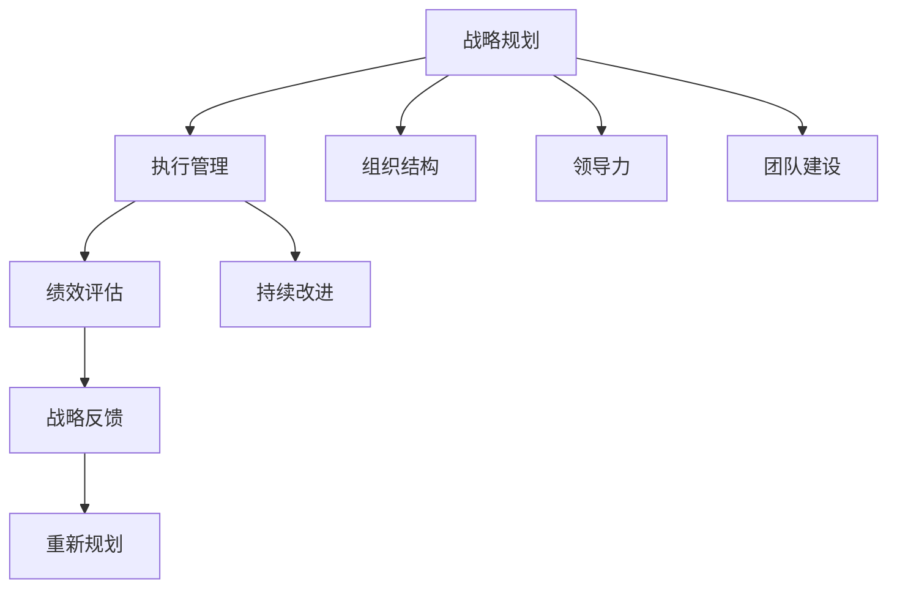
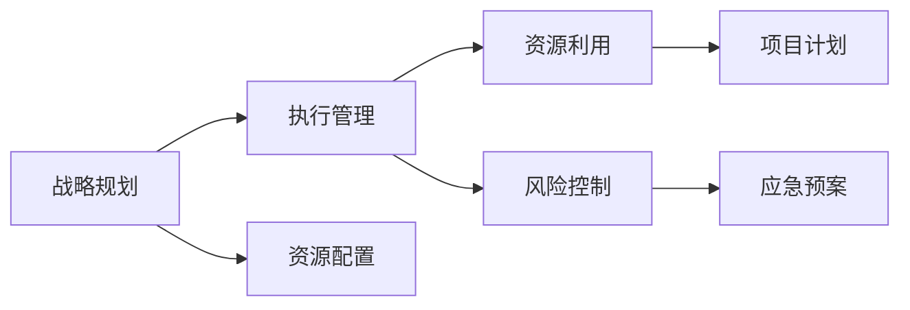
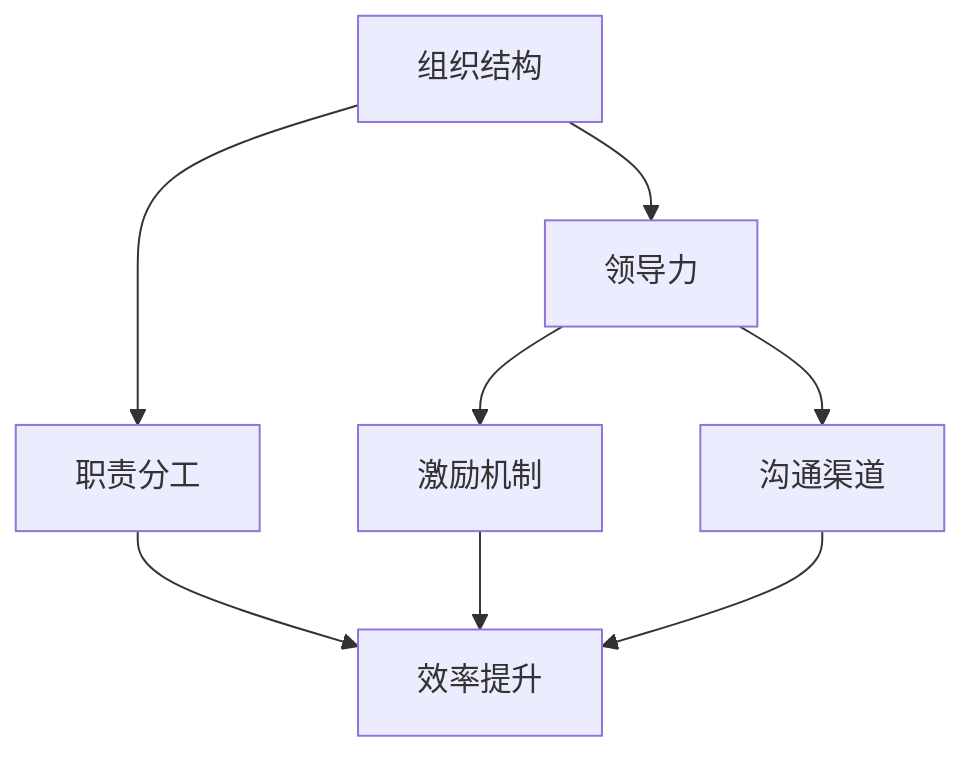
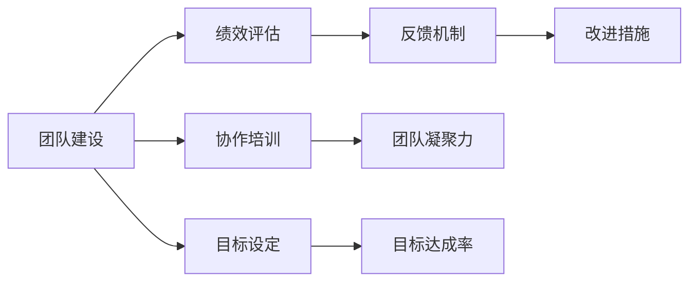
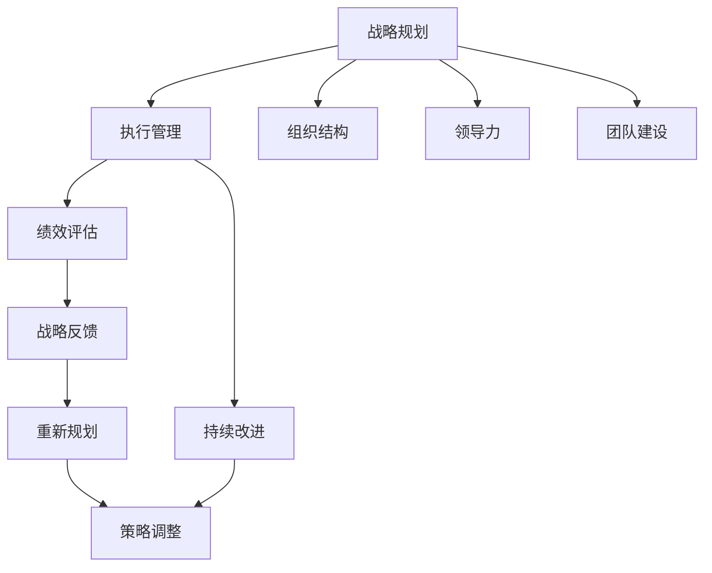

                 

# 管理艺术：从策略到执行

> 关键词：管理，战略，执行，决策，组织，领导，团队，绩效，激励，变革，迭代

## 1. 背景介绍

### 1.1 问题由来
在当今快速变化、竞争激烈的市场环境中，企业管理者面临着前所未有的挑战。如何制定正确的战略，如何将战略转化为实际行动，如何高效执行和管理团队，是每个企业管理者必须面对的问题。这些问题涉及复杂的决策过程、组织架构、人力资源、技术应用等方面，需要系统化的思考和解决。

### 1.2 问题核心关键点
- **战略制定**：确定公司的长期目标和短期策略，需要考虑市场环境、竞争对手、内部资源等因素。
- **执行管理**：将战略转化为具体行动，涉及资源配置、团队建设、绩效管理、风险控制等。
- **组织结构**：设计合理的组织架构，明确职责分工，提升组织效率。
- **领导力**：塑造有效的领导风格，激发团队成员的积极性，推动公司战略的实现。
- **团队建设**：通过团队协作和激励，增强团队凝聚力和战斗力。
- **绩效评估**：建立科学的绩效管理体系，确保员工和团队达到预期目标。
- **持续改进**：采用敏捷方法和迭代过程，不断优化公司运营和业务流程。

这些关键点相互关联，共同构成了企业管理的重要内容。本文将深入探讨从策略制定到执行管理的全过程，为读者提供一套全面的解决方案。

### 1.3 问题研究意义
管理艺术的核心在于将策略转化为可执行的行动，通过科学的方法和工具，提升企业运营效率和市场竞争力。管理艺术的掌握，不仅能够帮助企业应对复杂多变的市场环境，还能够增强企业的内在实力，实现可持续发展。

## 2. 核心概念与联系

### 2.1 核心概念概述

为了更好地理解从策略到执行的管理过程，本节将介绍几个核心概念：

- **战略规划**：通过分析内外环境，确定公司的长期目标和具体策略。
- **执行管理**：将战略转化为具体的行动计划和操作流程。
- **组织结构**：企业内部各部门之间的职责和协作方式。
- **领导力**：管理者对团队的激励和指导能力。
- **团队建设**：提升团队成员之间的协作和信任。
- **绩效评估**：评估员工和团队的工作效果和目标完成情况。
- **持续改进**：通过不断的学习和调整，优化企业运营和业务流程。

这些概念之间的联系通过以下Mermaid流程图来展示：



这个流程图展示了一个从战略规划到持续改进的管理循环：

1. 通过分析环境，制定战略规划。
2. 根据战略规划，设计组织结构、领导力和团队建设。
3. 执行具体的管理流程。
4. 通过绩效评估，监控执行效果。
5. 根据评估结果，进行持续改进，进入下一个循环。

### 2.2 概念间的关系

这些核心概念之间存在着紧密的联系，形成了企业管理的基础架构。下面我们通过几个Mermaid流程图来展示这些概念之间的关系。

#### 2.2.1 战略规划与执行管理的关系



这个流程图展示了战略规划与执行管理的关系：

1. 战略规划明确了公司的发展方向和目标。
2. 根据战略规划，进行资源配置和项目计划。
3. 在执行管理过程中，合理利用资源，进行风险控制。
4. 项目计划和应急预案，确保执行过程顺利进行。

#### 2.2.2 组织结构与领导力的关系



这个流程图展示了组织结构与领导力的关系：

1. 组织结构决定了各部门的职责和分工。
2. 领导力通过激励机制和沟通渠道，提升团队凝聚力。
3. 职责分工明确，提高工作效率。
4. 激励机制和沟通渠道，增强团队协作和创新能力。

#### 2.2.3 团队建设与绩效评估的关系



这个流程图展示了团队建设与绩效评估的关系：

1. 团队建设通过协作培训和目标设定，提升团队能力。
2. 绩效评估通过反馈机制和改进措施，不断优化团队表现。
3. 团队凝聚力和目标达成率，反映团队建设效果。
4. 反馈机制和改进措施，推动团队持续改进。

### 2.3 核心概念的整体架构

最后，我们用一个综合的流程图来展示这些核心概念在大企业管理中的应用：



这个综合流程图展示了从战略规划到持续改进的完整过程，以及各个环节之间的相互作用。

## 3. 核心算法原理 & 具体操作步骤

### 3.1 算法原理概述

从策略到执行的管理过程，本质上是一个多阶段、多维度的决策和执行过程。其核心算法原理主要包括：

- **决策理论**：基于系统论、博弈论和经济学等理论，制定合理的决策模型。
- **控制理论**：通过反馈机制和调节策略，确保执行过程的稳定性和有效性。
- **组织行为学**：研究组织内成员的行为规律和心理机制，提升团队协作和领导力。
- **绩效管理**：建立科学的绩效评估体系，激励和约束员工行为，推动目标实现。

### 3.2 算法步骤详解

基于以上核心算法原理，大企业管理从策略到执行的过程主要包括以下步骤：

#### 3.2.1 战略规划

1. **环境分析**：通过PEST分析、SWOT分析等方法，评估外部环境和内部资源。
2. **目标设定**：根据分析结果，制定长期和短期的战略目标。
3. **策略制定**：设计实现目标的具体策略，考虑资源配置、风险控制等因素。

#### 3.2.2 执行管理

1. **资源配置**：根据战略规划，合理配置资源，包括人力、物力、财力等。
2. **项目计划**：制定详细的项目计划，明确每个阶段的任务和里程碑。
3. **风险管理**：识别和评估潜在风险，制定应对策略和应急预案。
4. **流程优化**：通过PDCA循环（计划-执行-检查-调整），不断优化业务流程。

#### 3.2.3 组织结构

1. **职责分工**：设计扁平化、分权的组织结构，提升决策效率。
2. **部门协同**：建立跨部门协作机制，促进信息共享和资源整合。
3. **考核体系**：设计科学的考核指标和激励机制，提升员工积极性。

#### 3.2.4 领导力

1. **激励机制**：通过股权激励、绩效奖励等方式，激发员工潜力。
2. **沟通渠道**：建立双向沟通机制，促进上下级和横向沟通。
3. **决策能力**：提升管理者的战略眼光和执行力，确保决策科学。

#### 3.2.5 团队建设

1. **协作培训**：通过团队建设和协作培训，提升团队协作能力。
2. **目标设定**：设定明确的项目目标和任务，确保团队方向一致。
3. **绩效评估**：通过定期评估和反馈机制，持续改进团队表现。

#### 3.2.6 绩效评估

1. **评估指标**：设定科学、可量化的绩效指标，评估员工和团队表现。
2. **反馈机制**：建立及时的反馈机制，帮助员工改进不足。
3. **激励措施**：根据绩效评估结果，实施相应的激励措施。

#### 3.2.7 持续改进

1. **反馈分析**：收集绩效评估和员工反馈，分析改进点。
2. **优化流程**：通过改进和优化流程，提升业务效率。
3. **学习机制**：建立持续学习和知识共享机制，推动团队和组织进步。

### 3.3 算法优缺点

从策略到执行的管理算法具有以下优点：

- **系统性**：通过全面的分析和管理过程，确保每个环节的有效性。
- **科学性**：基于现代科学理论和方法，制定决策和执行模型。
- **灵活性**：通过PDCA循环和反馈机制，不断调整和优化管理过程。

同时，该算法也存在一些缺点：

- **复杂性**：涉及多个环节和维度，需要综合考虑各种因素。
- **高成本**：复杂的分析和优化过程，需要投入大量资源和时间。
- **执行难度**：需要高水平的管理团队和专业技能，才能有效实施。

### 3.4 算法应用领域

从策略到执行的管理算法，广泛应用于各种组织管理领域，包括：

- **企业经营管理**：制定和实施战略规划，提升企业竞争力。
- **项目管理**：确保项目按时按质完成，优化资源配置和流程。
- **人力资源管理**：通过绩效评估和激励机制，提升员工绩效和满意度。
- **技术创新管理**：推动技术研发和产品创新，提升市场响应速度。
- **市场拓展管理**：制定市场策略和销售计划，开拓新市场和客户。

## 4. 数学模型和公式 & 详细讲解 & 举例说明

### 4.1 数学模型构建

在大企业管理中，常用的数学模型包括：

- **线性规划模型**：用于资源配置和流程优化。
- **回归分析模型**：用于预测和评估绩效。
- **博弈论模型**：用于分析和制定竞争策略。
- **系统动力学模型**：用于模拟和优化组织结构和流程。

### 4.2 公式推导过程

以线性规划模型为例，其公式推导过程如下：

$$
\begin{aligned}
\max & \quad \sum_{i=1}^n c_i x_i \\
\text{s.t.} & \quad \sum_{i=1}^n a_{ij} x_i \leq b_j, \quad j = 1, 2, \ldots, m \\
& \quad x_i \geq 0, \quad i = 1, 2, \ldots, n
\end{aligned}
$$

其中，$c_i$表示第$i$个资源的价格，$a_{ij}$表示第$j$个约束条件的系数，$b_j$表示第$j$个约束条件的限制条件，$x_i$表示第$i$个资源的分配量。

### 4.3 案例分析与讲解

假设一家制造企业需要制定生产计划，以最大化利润。生产计划涉及三个关键资源：人力资源、机器设备和原材料。

- **目标函数**：$\max \quad (10 \times 100 + 15 \times 200 + 20 \times 300) = 12500$
- **约束条件**：
  - $5 \times x_1 + 7 \times x_2 + 3 \times x_3 \leq 3000$（总工时限制）
  - $2 \times x_1 + 3 \times x_2 + 1 \times x_3 \leq 5000$（总设备时限制）
  - $x_1 + x_2 + x_3 \leq 1500$（总人力限制）
  - $x_i \geq 0$（非负约束）

通过求解上述线性规划问题，可以得到最优的生产计划分配方案，最大化企业利润。

## 5. 项目实践：代码实例和详细解释说明

### 5.1 开发环境搭建

要进行项目管理和大企业管理系统的开发，需要搭建以下开发环境：

1. **操作系统**：安装Linux、Windows或Mac OS等操作系统。
2. **编程语言**：选择Python、Java、C++等主流编程语言。
3. **开发框架**：选择Spring、Django、Flask等开发框架。
4. **数据库**：选择MySQL、PostgreSQL、MongoDB等关系型或非关系型数据库。
5. **版本控制**：使用Git进行代码版本控制。
6. **开发工具**：安装Visual Studio Code、PyCharm、Eclipse等开发工具。

### 5.2 源代码详细实现

以下是一个简单的项目管理系统的Python代码实现，用于分配项目任务和资源：

```python
class Project:
    def __init__(self, name, resources):
        self.name = name
        self.resources = resources

    def allocate_resources(self, tasks):
        total_resources = sum(self.resources.values())
        task_resources = sum(tasks.values())
        if total_resources < task_resources:
            raise Exception("Resources not enough")

        for task, resource in tasks.items():
            if resource > self.resources[task]:
                raise Exception(f"Task {task} requires {resource} resources, but available {self.resources[task]}")

        # 根据资源分配和任务优先级，进行最优分配
        # 可以使用线性规划等数学方法进行求解
        return tasks

# 示例
project = Project("Project A", {"HR": 500, "Machine": 1000, "Material": 2000})
tasks = {"Task 1": 200, "Task 2": 300, "Task 3": 400}
result = project.allocate_resources(tasks)
print(result)
```

### 5.3 代码解读与分析

在这个简单的项目管理系统代码中，我们定义了一个`Project`类，用于管理项目资源和任务分配。通过`allocate_resources`方法，可以分配项目任务和资源，确保资源分配合理。

- **资源定义**：通过`resources`字典，定义了每个资源的数量。
- **任务分配**：通过`tasks`字典，定义了每个任务的资源需求。
- **资源检查**：检查总资源是否足够，任务资源是否合理。
- **最优分配**：使用线性规划等数学方法，进行最优资源分配。

## 6. 实际应用场景

### 6.1 智能制造

在大企业管理中，智能制造是一个重要的应用场景。通过先进的生产管理系统和大数据分析，可以实现生产过程的自动化、智能化和优化。

- **生产计划管理**：使用线性规划模型，优化生产计划和资源配置。
- **质量控制**：使用回归分析模型，实时监控产品质量，进行故障预测和预防。
- **供应链管理**：使用博弈论模型，优化供应链节点和物流管理。

### 6.2 人力资源管理

人力资源管理是大企业管理的重要组成部分，通过科学的绩效评估和激励机制，可以提升员工满意度和工作效率。

- **绩效评估**：使用回归分析模型，评估员工绩效，提供个性化的激励措施。
- **培训与发展**：通过协作培训和团队建设，提升员工技能和团队协作能力。
- **员工满意度**：使用系统动力学模型，模拟员工满意度的变化，优化管理措施。

### 6.3 财务预算管理

财务预算管理是大企业管理中的核心环节，通过科学的预算控制和绩效评估，可以确保公司的财务健康和可持续发展。

- **预算编制**：使用线性规划模型，优化资源配置和预算分配。
- **成本控制**：使用回归分析模型，分析成本和绩效的关系，进行成本优化。
- **绩效评估**：使用系统动力学模型，模拟财务预算的执行效果，进行及时调整。

### 6.4 未来应用展望

随着技术的不断进步，从策略到执行的管理方法将更加智能化和自动化。未来，大企业管理将实现以下趋势：

- **人工智能与自动化**：通过AI技术，实现更高效的资源配置和流程优化。
- **数据驱动决策**：通过大数据分析和机器学习，提供科学、精确的决策支持。
- **区块链与去中心化**：通过区块链技术，提升数据安全和透明度。
- **可持续发展**：通过绿色管理和循环经济，实现企业的可持续发展。

## 7. 工具和资源推荐

### 7.1 学习资源推荐

为了帮助开发者系统掌握大企业管理的方法和工具，这里推荐一些优质的学习资源：

1. **《管理学》系列书籍**：经典的管理学教材，涵盖战略、组织、领导、沟通等多个方面。
2. **Coursera《管理学》课程**：全球知名大学开设的管理学课程，包括哈佛、斯坦福等。
3. **LinkedIn Learning《领导力》课程**：覆盖领导力、激励、团队管理等多个主题，提供实用的管理技巧。
4. **EdX《数据分析与决策》课程**：通过数据分析和回归分析，提升决策科学性。
5. **Udacity《敏捷项目管理》课程**：介绍敏捷开发方法，提升项目管理的灵活性和效率。

通过对这些资源的学习实践，相信你一定能够掌握大企业管理艺术的精髓，提升管理水平和业务能力。

### 7.2 开发工具推荐

高效的开发离不开优秀的工具支持。以下是几款用于大企业管理开发的常用工具：

1. **JIRA**：项目管理工具，支持敏捷开发和任务管理，优化资源配置和流程。
2. **Trello**：任务管理和协作工具，支持可视化项目进度和团队协作。
3. **Slack**：沟通工具，提供实时沟通和信息共享，提升团队协作效率。
4. **Confluence**：文档协作工具，支持知识共享和团队沟通。
5. **Tableau**：数据可视化工具，支持复杂的数据分析和报告。

合理利用这些工具，可以显著提升大企业管理系统的开发效率，加快创新迭代的步伐。

### 7.3 相关论文推荐

大企业管理技术的发展源于学界的持续研究。以下是几篇奠基性的相关论文，推荐阅读：

1. **《管理学基础》**：管理学经典教材，涵盖战略、组织、领导等多个方面。
2. **《管理科学与工程》**：介绍管理科学与工程的基本理论和应用方法。
3. **《商业管理与组织》**：研究商业管理与组织行为的基本理论和方法。
4. **《项目管理》**：介绍项目管理的理论、方法和工具。
5. **《领导力与激励》**：研究领导力、激励和团队管理的理论和实践。

这些论文代表了大企业管理技术的发展脉络。通过学习这些前沿成果，可以帮助研究者把握学科前进方向，激发更多的创新灵感。

除上述资源外，还有一些值得关注的前沿资源，帮助开发者紧跟大企业管理技术的最新进展，例如：

1. **ArXiv论文预印本**：人工智能领域最新研究成果的发布平台，包括大量尚未发表的前沿工作，学习前沿技术的必读资源。
2. **顶级期刊和会议**：如《管理科学季刊》、《哈佛商业评论》、《IEEE会议》等，提供最新的管理理论和实践。
3. **技术博客和论坛**：如Medium、Hacker News、LinkedIn等，分享前沿观点和实践经验。
4. **开源项目和社区**：如GitHub、Stack Overflow等，提供丰富的开源资源和社区支持。

总之，对于大企业管理技术的学习和实践，需要开发者保持开放的心态和持续学习的意愿。多关注前沿资讯，多动手实践，多思考总结，必将收获满满的成长收益。

## 8. 总结：未来发展趋势与挑战

### 8.1 总结

本文对大企业管理艺术从策略到执行的全过程进行了系统介绍。通过深入分析每个环节的原理和操作细节，展示了从战略规划到持续改进的完整过程。本文还提供了具体的代码实例和应用场景，帮助读者更好地理解和实践这些管理方法。

通过本文的系统梳理，可以看到，从策略到执行的大企业管理方法，不仅具有系统性和科学性，还具有较高的灵活性和可操作性。这些方法的应用，可以显著提升企业运营效率和管理水平，实现可持续发展。

### 8.2 未来发展趋势

展望未来，大企业管理技术将呈现以下几个发展趋势：

1. **人工智能与自动化**：通过AI技术，实现更高效的资源配置和流程优化。
2. **数据驱动决策**：通过大数据分析和机器学习，提供科学、精确的决策支持。
3. **区块链与去中心化**：通过区块链技术，提升数据安全和透明度。
4. **可持续发展**：通过绿色管理和循环经济，实现企业的可持续发展。
5. **智能制造**：通过智能管理系统，实现生产过程的自动化和智能化。

这些趋势展示了管理技术的未来发展方向，相信随着技术的不断进步，企业管理将更加科学、高效和可持续。

### 8.3 面临的挑战

尽管大企业管理技术已经取得了显著成效，但在迈向更加智能化、普适化应用的过程中，仍面临诸多挑战：

1. **复杂性**：涉及多个环节和维度，需要综合考虑各种因素。
2. **高成本**：复杂的分析和优化过程，需要投入大量资源和时间。
3. **执行难度**：需要高水平的管理团队和专业技能，才能有效实施。
4. **数据质量**：数据的不准确和不完整，可能导致决策失误。
5. **文化差异**：不同文化背景和管理风格，需要协调和融合。

### 8.4 研究展望

面对大企业管理技术面临的这些挑战，未来的研究需要在以下几个方面寻求新的突破：

1. **自动化与智能化**：通过AI和自动化技术，简化管理过程，提高效率。
2. **数据治理与隐私保护**：建立科学的数据治理机制，保护数据隐私和安全。
3. **跨文化管理**：研究跨文化管理和协作的最佳实践，提升全球化管理能力。
4. **柔性管理与创新**：通过柔性管理和敏捷方法，增强组织的适应性和创新能力。
5. **领导力与组织行为**：研究新型领导力和组织行为，提升团队的凝聚力和战斗力。

这些研究方向将进一步推动大企业管理技术的创新和发展，为企业的管理实践提供更全面的解决方案。

## 9. 附录：常见问题与解答

**Q1：如何制定科学合理的战略规划？**

A: 制定科学合理的战略规划，需要遵循以下步骤：

1. **环境分析**：通过PEST分析、SWOT分析等方法，评估外部环境和内部资源。
2. **目标设定**：根据分析结果，制定长期和短期的战略目标。
3. **策略制定**：设计实现目标的具体策略，考虑资源配置、风险控制等因素。
4. **方案评估**：使用博弈论模型和系统动力学模型，评估方案的可行性和效果。

通过以上步骤，可以制定科学合理的战略规划，确保公司长期发展方向正确。

**Q2：如何优化资源配置和流程？**

A: 优化资源配置和流程，可以通过以下方法：

1. **线性规划模型**：使用线性规划模型，优化资源配置和流程。
2. **流程再造**：通过BPR（Business Process Reengineering），重新设计和优化业务流程。
3. **敏捷方法**：采用敏捷开发方法，提升项目的灵活性和响应速度。
4. **精益管理**：引入精益管理理念，优化资源利用和运营效率。

通过以上方法，可以优化资源配置和流程，提升企业运营效率和竞争力。

**Q3：如何提升团队的协作和领导力？**

A: 提升团队的协作和领导力，可以通过以下方法：

1. **协作培训**：通过团队建设和协作培训，提升团队协作能力。
2. **领导力培训**：提升管理者的领导力和沟通能力，增强团队凝聚力。
3. **目标设定**：设定明确的项目目标和任务，确保团队方向一致。
4. **激励机制**：使用股权激励、绩效奖励等方式，激发员工潜力。

通过以上方法，可以提升团队的协作和领导力，增强企业的整体战斗力。

**Q4：如何建立科学的绩效评估体系？**

A: 建立科学的绩效评估体系，需要遵循以下步骤：

1. **指标设定**：设定科学、可量化的绩效指标，评估员工和团队表现。
2. **数据收集**：通过系统数据采集和员工反馈，收集绩效数据。
3. **分析评估**：使用回归分析模型和系统动力学模型，分析绩效数据，提供评估报告。
4. **反馈机制**：建立及时的反馈机制，帮助员工改进不足。

通过以上步骤，可以建立科学的绩效评估体系，激励和约束员工行为，推动目标实现。

---

作者：禅与计算机程序设计艺术 / Zen and the Art of Computer Programming

