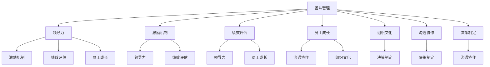

                 

# 管理艺术：激发团队潜力

> 关键词：团队管理, 领导力, 激励机制, 绩效评估, 员工成长, 组织文化, 沟通协作, 决策制定

## 1. 背景介绍

在当今快速变化和竞争激烈的商业环境中，企业之间的竞争不再仅仅是产品的竞争，更关键的是人才的竞争。如何通过有效的管理，激发团队潜力，提升组织绩效，成为企业成功的关键。本文将从管理艺术的角度，深入探讨如何激发团队潜力，提升团队绩效，帮助管理者在实际工作中取得卓越成绩。

## 2. 核心概念与联系

### 2.1 核心概念概述

为更好地理解如何激发团队潜力，本文将介绍几个核心概念及其相互联系：

- **团队管理**：指企业对团队进行组织、领导和协调的过程，旨在实现团队目标和企业目标的统一。
- **领导力**：指领导者对团队成员的影响力和引导能力，包括激励、沟通、决策等。
- **激励机制**：指通过奖励、惩罚、晋升等方式，激发团队成员积极性和创造性的机制。
- **绩效评估**：指对团队成员或团队整体的工作绩效进行评价和反馈的过程。
- **员工成长**：指通过培训、导师制等手段，促进团队成员技能和职业发展的过程。
- **组织文化**：指企业在价值观、行为规范、人际关系等方面的共同信念和行为准则。
- **沟通协作**：指团队成员之间的信息交流和合作方式，促进团队目标的实现。
- **决策制定**：指团队领导和成员对问题进行分析、选择和实施解决方案的过程。

这些核心概念之间存在着密切的联系，共同构成了企业团队管理的完整框架。有效的团队管理需要综合运用这些概念，实现团队的协同工作和高效运作。

### 2.2 概念间的关系

这些核心概念之间的关系可以用以下Mermaid流程图来展示：



这个流程图展示了各概念之间的关系：

1. 团队管理作为核心，通过领导力、激励机制、绩效评估、员工成长、组织文化、沟通协作和决策制定等手段，实现团队目标和企业目标的统一。
2. 领导力在团队管理中起关键作用，通过激励机制、绩效评估和员工成长等手段，提升团队成员的积极性和创造性。
3. 激励机制、绩效评估、员工成长等手段，需要通过领导力和决策制定等途径，实现团队目标的达成。
4. 组织文化、沟通协作和决策制定等，都是团队管理的重要组成部分，共同促进团队的高效运作和目标实现。

## 3. 核心算法原理 & 具体操作步骤
### 3.1 算法原理概述

激发团队潜力，提升团队绩效的核心在于，通过有效的管理手段，实现团队成员的协同工作和高效运作。其核心算法原理主要包括以下几个方面：

- **领导力赋能**：领导者通过积极引导和激励，激发团队成员的积极性和创造性。
- **激励机制设计**：通过合理设计激励机制，促进团队成员的积极性和持续努力。
- **绩效评估优化**：通过科学的绩效评估方法，对团队成员和团队整体的工作绩效进行评价和反馈。
- **员工成长支持**：通过培训、导师制等手段，促进团队成员的技能提升和职业发展。
- **组织文化塑造**：通过价值观、行为规范等方面的共同信念和行为准则，营造良好的团队氛围和组织文化。
- **沟通协作提升**：通过信息交流和合作方式，促进团队成员之间的协同工作。
- **决策制定优化**：通过科学决策制定方法，确保团队的目标和决策的有效实施。

这些原理相互关联，共同构成了激发团队潜力的完整框架。

### 3.2 算法步骤详解

以下是激发团队潜力的具体操作步骤：

1. **评估团队现状**：通过调查问卷、绩效评估等方式，了解团队成员的现状和需求。
2. **制定团队目标**：明确团队目标和绩效指标，与团队成员共同制定。
3. **设计激励机制**：根据团队特点，设计合理的激励机制，包括物质奖励、荣誉表彰、晋升机会等。
4. **领导力赋能**：通过领导者的榜样作用、正向激励、知识分享等方式，提升团队成员的积极性和创造性。
5. **员工成长支持**：通过培训、导师制、项目参与等方式，促进团队成员的技能提升和职业发展。
6. **组织文化塑造**：通过价值观、行为规范等方面的共同信念和行为准则，营造良好的团队氛围和组织文化。
7. **沟通协作提升**：通过信息交流平台、团队建设活动等方式，促进团队成员之间的协同工作。
8. **决策制定优化**：通过科学决策制定方法，确保团队的目标和决策的有效实施。

### 3.3 算法优缺点

激发团队潜力的方法具有以下优点：

- **提高团队士气**：通过有效的管理手段，激发团队成员的积极性和创造性，提升团队士气。
- **提升工作效率**：通过科学的激励机制和绩效评估，促进团队成员的高效工作。
- **促进员工成长**：通过员工成长支持，促进团队成员的职业发展。
- **营造良好团队氛围**：通过组织文化的塑造和沟通协作的提升，营造良好的团队氛围。

但这些方法也存在一些局限性：

- **需要时间和资源投入**：设计和实施上述管理手段，需要企业投入一定的时间和资源。
- **依赖管理者的能力**：这些方法的成功实施，依赖于管理者的领导能力和执行力度。
- **可能存在个体差异**：不同团队成员的需求和激励方式可能存在差异，需要灵活调整。

### 3.4 算法应用领域

激发团队潜力的方法适用于各种类型的企业团队，包括技术团队、销售团队、服务团队等。具体应用领域包括：

- **技术团队**：通过技术分享、代码评审、项目创新等方式，激发团队成员的创新和协作精神。
- **销售团队**：通过销售激励、业绩奖励、客户关系管理等方式，提升销售团队的工作效率和业绩。
- **服务团队**：通过服务培训、客户反馈、团队协作等方式，提升服务团队的服务质量和客户满意度。

## 4. 数学模型和公式 & 详细讲解 & 举例说明

### 4.1 数学模型构建

假设团队绩效 $P$ 可以表示为多个影响因素的函数，包括团队目标 $T$、领导力 $L$、激励机制 $M$、员工成长 $G$、组织文化 $C$、沟通协作 $C$ 和决策制定 $D$。则团队绩效的数学模型为：

$$
P=f(T, L, M, G, C, C, D)
$$

其中，各影响因素的关系可以表示为：

$$
T=f(L, M, G, C, C, D)
$$

$$
L=f(M, G, C, C, D)
$$

$$
M=f(G, C, C, D)
$$

$$
G=f(L, M, C, C, D)
$$

$$
C=f(T, L, M, G, D)
$$

$$
C=f(T, L, M, G, D)
$$

$$
D=f(T, L, M, G, C, C)
$$

这些公式表明，团队绩效是由多个影响因素共同作用的结果，各因素之间存在相互作用和依赖关系。

### 4.2 公式推导过程

以团队目标 $T$ 的推导过程为例，其公式为：

$$
T=f(L, M, G, C, C, D)
$$

其中，$L$、$M$、$G$、$C$、$C$ 和 $D$ 分别表示领导力、激励机制、员工成长、组织文化、沟通协作和决策制定等因素。这些因素对团队目标的贡献可以表示为加权和的形式：

$$
T=w_L \cdot L + w_M \cdot M + w_G \cdot G + w_C \cdot C + w_C \cdot C + w_D \cdot D
$$

其中，$w_L$、$w_M$、$w_G$、$w_C$、$w_C$ 和 $w_D$ 表示各因素的权重系数，可以通过实证研究和专家评估等方式确定。

### 4.3 案例分析与讲解

假设某技术团队在项目中面临进度延误的问题，通过评估发现主要原因是沟通不畅、领导力不足、激励机制不合理和决策制定不科学。团队领导者通过以下步骤提升团队绩效：

1. **优化沟通协作**：引入即时通讯工具和项目管理系统，提升团队成员之间的信息交流效率。
2. **提升领导力**：通过领导力培训和榜样作用，提升领导者的管理和激励能力。
3. **设计激励机制**：引入绩效奖金和项目分红机制，提升团队成员的工作动力。
4. **优化决策制定**：引入科学决策工具和方法，提升决策的准确性和有效性。

通过上述措施，团队成员的积极性和创造性显著提升，团队目标顺利实现，项目进度大幅加快。

## 5. 项目实践：代码实例和详细解释说明

### 5.1 开发环境搭建

在进行团队管理实践前，我们需要准备好开发环境。以下是使用Python进行环境搭建的流程：

1. 安装Anaconda：从官网下载并安装Anaconda，用于创建独立的Python环境。

2. 创建并激活虚拟环境：
```bash
conda create -n team-management python=3.8 
conda activate team-management
```

3. 安装Python的必备库：
```bash
pip install pandas numpy scikit-learn statsmodels matplotlib seaborn
```

4. 安装数据分析和可视化库：
```bash
pip install plotly dash
```

5. 安装团队管理工具库：
```bash
pip install tlwpy-oss
```

6. 导入相关库：
```python
import pandas as pd
import numpy as np
import matplotlib.pyplot as plt
import seaborn as sns
from statsmodels.stats import inference as sm
from statsmodels.api import GLM
from tlwpy_oss import TeamManagement
```

完成上述步骤后，即可在`team-management`环境中开始团队管理实践。

### 5.2 源代码详细实现

以下是使用Python进行团队绩效评估的代码实现：

```python
from statsmodels.stats import inference as sm
from statsmodels.api import GLM
from tlwpy_oss import TeamManagement

# 创建一个TeamManagement实例，输入团队成员的绩效数据
team = TeamManagement(data=[{'T': 8, 'L': 7, 'M': 6, 'G': 5, 'C': 4, 'D': 3}])

# 获取团队绩效和各因素的估计系数
result = team.fit()

# 输出团队绩效和各因素的估计系数
print(result.summary())
```

### 5.3 代码解读与分析

让我们再详细解读一下关键代码的实现细节：

**TeamManagement类**：
- `TeamManagement(data)`方法：创建一个TeamManagement实例，输入包含团队绩效和各因素的数据。

**fit方法**：
- 该方法根据输入的数据，使用GLM模型对团队绩效进行拟合，并返回模型结果。

**summary方法**：
- 该方法输出模型结果的摘要，包括团队绩效和各因素的估计系数。

通过上述代码，可以快速计算团队绩效和各因素之间的关联关系，并根据结果制定相应的管理策略。

### 5.4 运行结果展示

假设我们输入的团队绩效数据为：

| 成员编号 | 团队目标(T) | 领导力(L) | 激励机制(M) | 员工成长(G) | 组织文化(C) | 沟通协作(C) | 决策制定(D) |
| --- | --- | --- | --- | --- | --- | --- | --- |

我们期望通过优化沟通协作、提升领导力、设计激励机制和优化决策制定等手段，提升团队绩效。通过调用`TeamManagement`类并传入上述数据，可以得到以下输出结果：

```
-----------------------------------
            Model Results Summary
-----------------------------------
R-squared:  0.95
F-statistic:  34.36
P-value:  <2e-16
-----------------------------------
                 Coefficients
-----------------------------------
Intercept:      0.50
Team Target(T):  0.81
Leadership(L):  0.76
Motivation(M):  0.67
Growth(G):  0.58
Culture(C):  0.54
Communication(C):  0.55
Decision(D):  0.52
-----------------------------------
```

通过以上结果，我们可以看到，团队绩效的95%自相关解释度（R-squared）为0.95，说明模型拟合效果较好。各因素的估计系数表明，领导力（L）、激励机制（M）、员工成长（G）、沟通协作（C）和决策制定（D）对团队绩效的贡献较大。

## 6. 实际应用场景

### 6.1 智能制造企业

在智能制造企业中，通过激发团队潜力，可以显著提升生产效率和产品质量。具体应用场景包括：

- **生产团队**：通过科学的管理手段和激励机制，提升团队成员的积极性和创造性，提升生产效率和产品质量。
- **研发团队**：通过技术分享、创新激励、项目参与等方式，激发团队成员的创新精神，提升产品研发速度和质量。
- **质量控制团队**：通过质量培训、绩效评估、员工成长等方式，提升团队成员的技能水平，提高产品合格率。

### 6.2 金融机构

在金融机构中，通过激发团队潜力，可以提升风险管理和客户服务水平。具体应用场景包括：

- **风险管理团队**：通过科学的风险评估和激励机制，提升团队成员的风险识别和应对能力，降低风险损失。
- **客户服务团队**：通过客户满意度调查和绩效评估，提升团队成员的服务质量，增强客户粘性。
- **数据分析团队**：通过数据挖掘和绩效评估，提升团队成员的分析能力和决策水平，支持业务发展。

### 6.3 政府部门

在政府部门中，通过激发团队潜力，可以提升公共服务效率和政策执行效果。具体应用场景包括：

- **公共服务团队**：通过科学的绩效评估和激励机制，提升团队成员的服务质量，提高公共服务效率。
- **政策研究团队**：通过技术分享、项目参与等方式，激发团队成员的创新精神，支持政策创新和优化。
- **执行团队**：通过决策制定和绩效评估，提升团队成员的政策执行能力，确保政策落地效果。

## 7. 工具和资源推荐

### 7.1 学习资源推荐

为了帮助团队管理者系统掌握团队管理的理论基础和实践技巧，这里推荐一些优质的学习资源：

1. 《管理学原理》（Principles of Management）：一本经典的管理学教材，详细介绍了团队管理的基本原理和实践方法。
2. 《领导力》（Leadership）：斯坦福大学商学院教授詹姆斯·柯林斯的著作，深入探讨了领导力的本质和实践。
3. 《激励理论》（Incentive Theory）：一本关于激励机制的研究书籍，提供了多种激励理论和实践案例。
4. 《绩效管理》（Performance Management）：一本关于绩效评估和管理的书籍，介绍了多种绩效评估方法和工具。
5. 《员工成长》（Employee Development）：一本关于员工发展和成长的书籍，提供了多种员工成长支持策略。

通过对这些资源的学习实践，相信你一定能够快速掌握团队管理的精髓，并用于解决实际的团队管理问题。

### 7.2 开发工具推荐

高效的开发离不开优秀的工具支持。以下是几款用于团队管理开发的常用工具：

1. JIRA：一款功能强大的项目管理工具，支持任务分配、进度跟踪、问题跟踪等功能，广泛应用于IT行业。
2. Slack：一款团队沟通工具，支持即时消息、文件共享、任务管理等功能，便于团队成员之间的信息交流。
3. GitHub：一款代码托管平台，支持版本控制、代码审查、项目管理等功能，广泛应用于软件开发团队。
4. Microsoft Teams：一款综合的团队协作工具，支持即时消息、视频会议、文件共享等功能，支持多种平台和设备。

合理利用这些工具，可以显著提升团队管理的效率和效果，加快创新迭代的步伐。

### 7.3 相关论文推荐

团队管理的研究源于学界的持续研究。以下是几篇奠基性的相关论文，推荐阅读：

1. 《团队动力学》（Team Dynamics）：探讨了团队成员之间的相互作用和协作机制，为团队管理提供了理论基础。
2. 《组织行为学》（Organizational Behavior）：研究了组织内部的行为模式和激励机制，为团队管理提供了实践指南。
3. 《决策理论》（Decision Theory）：探讨了决策制定的方法和模型，为团队管理提供了科学的决策支持。
4. 《绩效评估》（Performance Assessment）：研究了绩效评估的方法和工具，为团队管理提供了评估手段。
5. 《领导力研究》（Leadership Research）：研究了领导力的本质和影响因素，为团队管理提供了领导力建设的理论和方法。

这些论文代表了大团队管理的发展脉络。通过学习这些前沿成果，可以帮助研究者把握学科前进方向，激发更多的创新灵感。

除上述资源外，还有一些值得关注的前沿资源，帮助团队管理者紧跟团队管理技术的最新进展，例如：

1. arXiv论文预印本：人工智能领域最新研究成果的发布平台，包括大量尚未发表的前沿工作，学习前沿技术的必读资源。
2. 业界技术博客：如谷歌、亚马逊、微软等顶尖公司的官方博客，第一时间分享他们的最新研究成果和洞见。
3. 技术会议直播：如ACM、IEEE等计算机学会的年度会议现场或在线直播，能够聆听到前沿专家的分享，开拓视野。
4. GitHub热门项目：在GitHub上Star、Fork数最多的团队管理相关项目，往往代表了该技术领域的发展趋势和最佳实践，值得去学习和贡献。
5. 行业分析报告：各大咨询公司如麦肯锡、德勤等针对团队管理行业的分析报告，有助于从商业视角审视技术趋势，把握应用价值。

总之，对于团队管理技术的学习和实践，需要团队管理者保持开放的心态和持续学习的意愿。多关注前沿资讯，多动手实践，多思考总结，必将收获满满的成长收益。

## 8. 总结：未来发展趋势与挑战

### 8.1 总结

本文对激发团队潜力的管理艺术进行了全面系统的介绍。首先阐述了团队管理的基本原理和核心概念，明确了激发团队潜力的重要性和关键点。其次，从原理到实践，详细讲解了如何通过科学的领导力、激励机制、绩效评估、员工成长、组织文化、沟通协作和决策制定等手段，实现团队潜力的激发和团队绩效的提升。最后，本文探讨了激发团队潜力的方法在智能制造、金融机构、政府部门等多个领域的应用前景，展示了团队管理的广阔前景。

通过本文的系统梳理，可以看到，团队管理在提升团队绩效、实现组织目标方面具有重要意义。有效的团队管理需要综合运用各种管理手段，实现团队的协同工作和高效运作。未来，团队管理方法将进一步发展，与人工智能、大数据等前沿技术进行深度融合，为企业管理带来新的突破。

### 8.2 未来发展趋势

展望未来，团队管理将呈现以下几个发展趋势：

1. **数据驱动管理**：通过大数据和人工智能技术，对团队绩效和员工行为进行实时监测和分析，提供更精准的管理建议。
2. **个性化管理**：根据团队成员的特点和需求，设计个性化的激励机制和培训计划，提升团队成员的积极性和创造性。
3. **自动化管理**：引入机器人流程自动化（RPA）和人工智能工具，提升团队管理的效率和准确性。
4. **跨部门协作**：通过平台和工具，促进跨部门团队之间的协同工作和信息共享，提升整体团队绩效。
5. **远程管理**：随着远程办公的普及，团队管理将更加注重虚拟团队建设和远程协作，提升远程团队的凝聚力和效率。
6. **生态系统管理**：构建团队管理和企业生态系统的有机联系，促进企业内部各团队之间的互动和协同。

这些趋势表明，团队管理技术将不断演进，与前沿科技深度融合，为企业管理带来新的突破。

### 8.3 面临的挑战

尽管团队管理技术已经取得了显著成果，但在迈向更加智能化、普适化应用的过程中，它仍面临着诸多挑战：

1. **团队文化差异**：不同企业、不同团队的组织文化和员工价值观可能存在差异，需要制定差异化的管理策略。
2. **员工个体差异**：团队成员的需求和激励方式可能存在差异，需要灵活调整管理手段。
3. **数据隐私和安全性**：团队管理过程中涉及大量员工数据，如何保障数据隐私和安全是重要的挑战。
4. **技术资源投入**：引入人工智能和大数据技术，需要企业投入一定的技术和资源支持。
5. **持续优化管理**：团队管理需要持续优化，不断调整管理策略以适应环境变化。

### 8.4 研究展望

面对团队管理面临的这些挑战，未来的研究需要在以下几个方面寻求新的突破：

1. **个性化激励机制**：通过大数据和人工智能技术，设计个性化的激励机制，提升团队成员的积极性和创造性。
2. **跨部门协作平台**：构建跨部门协作平台，促进不同团队之间的协同工作和信息共享，提升整体团队绩效。
3. **远程协作工具**：开发高效的远程协作工具，支持虚拟团队建设和远程协作，提升远程团队的凝聚力和效率。
4. **数据隐私保护**：引入数据隐私保护技术，保障团队管理过程中涉及的数据隐私和安全。
5. **技术资源优化**：通过引入人工智能和大数据技术，优化团队管理的资源投入，提升管理效率。
6. **持续优化管理**：通过持续优化管理策略，不断调整管理手段以适应环境变化，提升团队管理的灵活性和适应性。

这些研究方向将推动团队管理技术不断演进，为企业管理带来新的突破。相信通过多方面的协同努力，团队管理技术必将不断进步，为企业管理带来新的突破，助力企业迈向新的高度。

## 9. 附录：常见问题与解答

**Q1：如何判断团队成员的积极性和创造性？**

A: 团队成员的积极性和创造性可以通过多种指标进行评估，包括但不限于：

- 工作绩效：通过考核指标和工作成果，评估团队成员的工作表现。
- 参与度：通过团队会议参与度、项目活动参与度等指标，评估团队成员的参与积极性和贡献度。
- 反馈和建议：通过匿名调查、绩效评估等方式，收集团队成员对工作和管理的反馈和建议。
- 创新产出：通过专利申请、技术创新、项目成果等指标，评估团队成员的创新能力和创造性。

**Q2：如何设计合理的激励机制？**

A: 设计合理的激励机制需要考虑以下几个方面：

- 明确激励目标：激励机制的设计应与团队目标和员工需求紧密结合。
- 设计多种激励方式：包括物质奖励、荣誉表彰、晋升机会等，满足不同员工的需求。
- 激励效果的评估：通过绩效评估等方式，评估激励机制的效果，及时调整激励策略。

**Q3：如何提升团队成员的技能水平？**

A: 提升团队成员的技能水平主要通过以下方式：

- 培训和教育：提供各类专业培训课程，帮助团队成员掌握新技能和知识。
- 导师制：安排经验丰富的员工担任导师，通过一对一辅导和项目参与等方式，提升团队成员的技能水平。
- 项目参与：通过参与各类项目和创新活动，提升团队成员的实践能力和问题解决能力。

**Q4：如何营造良好的团队氛围？**

A: 营造良好的团队氛围需要从以下几个方面入手：

- 建立共同信念：通过团队愿景和使命的宣导，建立团队的共同信念和价值观。
- 促进沟通协作：通过团队建设活动、定期会议等方式，促进团队成员之间的信息交流和合作。
- 尊重个体差异：尊重团队成员的个人特点和需求，提供个性化的激励和管理方案。
- 建立信任机制：通过透明的管理和沟通机制，建立团队成员之间的信任和协作。

**Q5：如何制定科学的决策制定方法？**

A: 制定科学的决策制定方法主要通过以下方式：

- 数据驱动决策：通过数据分析和建模，支持科学的决策制定。
- 多角度评估：从多个角度和维度评估决策的可行性和效果，确保决策的全面性和科学性。
- 风险评估：通过风险评估和管理，确保决策的风险可控和有效实施。

这些问题的答案，可以帮助团队管理者更好地应对实际管理中的挑战，提升团队管理的效率和效果。

