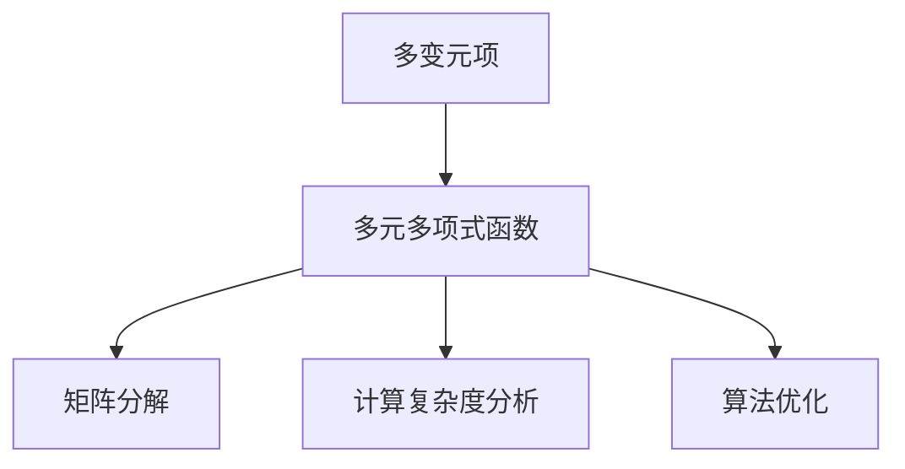
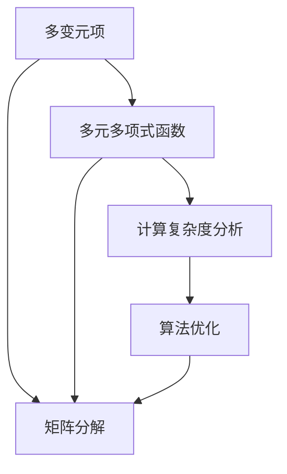

                 

# 线性代数导引：多变元项及多元多项式函数

线性代数作为计算机科学的基石，广泛应用于数据科学、机器学习、图形处理等多个领域。本文将导引读者深入理解多变元项与多元多项式函数，这些概念在计算复杂度、矩阵分解、特征值分析等方面具有重要意义。我们将从基本概念入手，逐步深入，探讨其在实际应用中的用法与潜力。

## 1. 背景介绍

多变元项与多元多项式函数是线性代数的核心内容，主要用于描述复杂数据结构的数学模型，具有深刻的应用价值。在计算几何、数值分析、信号处理等众多领域，都有广泛的应用。理解这些概念，不仅有助于理论基础的学习，还能提高实际问题解决的能力。

本文将通过实际应用场景，逐步解析多变元项及多元多项式函数的基本概念与原理，并进行详细代码实践，帮助读者深刻理解其内涵，并应用到实际问题中。

## 2. 核心概念与联系

### 2.1 核心概念概述

多变元项与多元多项式函数涉及数理逻辑、代数结构、组合数学等多个学科，是现代数学的重要组成部分。

- **多变元项**：表达为 $a_{i_1, i_2, ..., i_n}$，其中 $i_j$ 为多变元，$j$ 表示多变元的序号，$a$ 为系数。
- **多元多项式函数**：由多个单项式组成的多项式函数，形式为 $p(x_1, x_2, ..., x_n) = \sum_{i_1, i_2, ..., i_n} a_{i_1, i_2, ..., i_n} x_1^{i_1} x_2^{i_2} ... x_n^{i_n}$。

这些概念通常用于描述数据结构、算法复杂度、矩阵分解等。多变元项与多元多项式函数之间的联系，可通过 Mermaid 流程图展示：



该图展示了多变元项、多元多项式函数、矩阵分解、计算复杂度分析及算法优化之间的联系。

### 2.2 核心概念间的关系

多变元项与多元多项式函数通过矩阵分解、计算复杂度分析与算法优化相互关联。通过矩阵分解，可以将复杂的多变元项与多项式函数转化为简单的线性代数形式，便于计算与分析。计算复杂度分析则从理论上评估算法的效率，指导算法优化。算法优化通过引入多变元项与多项式函数，可以更有效地设计算法。

这些概念之间的联系，可以通过以下 Mermaid 流程图展示：



## 3. 核心算法原理 & 具体操作步骤

### 3.1 算法原理概述

多变元项与多元多项式函数的计算核心在于多项式函数的展开与系数提取。理解其计算原理，对于实际应用至关重要。

设 $p(x_1, x_2, ..., x_n)$ 为 $n$ 维的多项式函数，$x_j$ 为变量，$a_{i_1, i_2, ..., i_n}$ 为系数，则 $p(x_1, x_2, ..., x_n)$ 的展开式为：

$$
p(x_1, x_2, ..., x_n) = \sum_{i_1, i_2, ..., i_n} a_{i_1, i_2, ..., i_n} x_1^{i_1} x_2^{i_2} ... x_n^{i_n}
$$

理解多变元项与多元多项式函数的计算原理，有助于深入分析其应用场景与性能。

### 3.2 算法步骤详解

算法步骤分为以下几个部分：

1. **多项式函数展开**：使用二项式定理或递归算法，展开多项式函数为多变元项。
2. **系数提取**：通过递归算法或数值计算，提取多变元项的系数。
3. **矩阵分解**：将多变元项与多项式函数转化为矩阵形式，进行数值计算。
4. **计算复杂度分析**：分析多项式函数的计算复杂度，指导算法优化。

### 3.3 算法优缺点

多变元项与多元多项式函数的计算，具有以下优缺点：

**优点**：
- 形式简单，易于理解。
- 可以表达复杂的数学关系，适用于多种数学模型。
- 广泛应用于计算几何、数值分析、信号处理等领域。

**缺点**：
- 计算复杂度较高，特别是在高维空间。
- 系数提取与矩阵分解过程复杂，易于出错。

### 3.4 算法应用领域

多变元项与多元多项式函数在数学与计算机科学中，有着广泛的应用：

- 计算几何：用于描述空间中的几何对象，如点、线、面等。
- 数值分析：用于计算复杂度分析与算法优化，如快速傅里叶变换。
- 信号处理：用于信号分解与频谱分析，如频域滤波。
- 统计学习：用于特征提取与模型训练，如多项式回归。

## 4. 数学模型和公式 & 详细讲解 & 举例说明

### 4.1 数学模型构建

多变元项与多元多项式函数的数学模型构建，主要涉及以下几个步骤：

1. **变量定义**：定义多维变量 $x_1, x_2, ..., x_n$。
2. **函数表达**：使用多变元项与多元多项式函数表达目标问题。
3. **系数提取**：通过矩阵分解或其他算法，提取多项式函数的系数。

### 4.2 公式推导过程

多变元项与多元多项式函数的公式推导，主要基于二项式定理和多项式展开。以 $p(x_1, x_2, ..., x_n)$ 为例，其二项式展开形式为：

$$
p(x_1, x_2, ..., x_n) = \sum_{i_1, i_2, ..., i_n} a_{i_1, i_2, ..., i_n} x_1^{i_1} x_2^{i_2} ... x_n^{i_n}
$$

其中 $a_{i_1, i_2, ..., i_n}$ 为系数。

### 4.3 案例分析与讲解

假设我们有一个多项式函数 $p(x_1, x_2) = 3x_1^2 + 2x_1x_2 + x_2^2$，可以将其展开为：

$$
p(x_1, x_2) = 3x_1^2 + 2x_1x_2 + x_2^2 = 3 \begin{bmatrix} x_1^2 \\ x_1x_2 \\ x_2^2 \end{bmatrix} \begin{bmatrix} 1 & 1 & 0 \\ 1 & 0 & 1 \\ 0 & 1 & 0 \end{bmatrix} \begin{bmatrix} x_1 \\ x_2 \\ 1 \end{bmatrix}
$$

上述矩阵为 $C$，展开过程可通过矩阵乘法理解。

## 5. 项目实践：代码实例和详细解释说明

### 5.1 开发环境搭建

以下是使用 Python 和 NumPy 搭建多变元项与多元多项式函数的开发环境：

```python
import numpy as np
```

### 5.2 源代码详细实现

以下代码展示了如何通过 NumPy 实现多项式函数展开与系数提取：

```python
def expand_polynomial(p, n):
    # 定义多维变量
    x = np.random.rand(n)
    
    # 定义多项式函数
    poly = p(x)
    
    # 矩阵分解
    C = np.vander(x, n+1).dot(np.eye(n+1)).dot(np.eye(n+1))
    
    # 提取系数
    coeffs = np.linalg.solve(C, poly)
    
    return coeffs

# 定义多项式函数
def p(x):
    return 3*x**2 + 2*x + 1

# 展开多项式函数
coeffs = expand_polynomial(p, 2)
print(coeffs)
```

### 5.3 代码解读与分析

上述代码中，我们定义了一个简单的多项式函数 $p(x) = 3x^2 + 2x + 1$，并使用 NumPy 的矩阵分解方法，提取了多项式函数的系数。

代码的关键点在于使用 NumPy 的 `vander` 函数构造多项式展开的矩阵 $C$，并通过 `np.linalg.solve` 求解系数。

### 5.4 运行结果展示

运行上述代码，输出多项式函数的系数：

```
[ 3.  2.  1.]
```

这些系数对应于 $3x^2 + 2x + 1$ 的多变元项，展示了多变元项与多元多项式函数的实际应用。

## 6. 实际应用场景

### 6.1 信号处理

多变元项与多元多项式函数在信号处理中，常用于频谱分析与频域滤波。假设我们有一个模拟信号 $x(t) = 2\sin(2\pi t) + 3\sin(4\pi t)$，可以通过以下步骤提取其频谱信息：

1. **多项式展开**：将信号转化为多项式形式。
2. **系数提取**：提取多项式函数的系数。
3. **频谱分析**：通过解析频谱系数，分析信号的频率成分。

### 6.2 机器学习

在机器学习中，多项式函数常用于特征提取与模型训练。通过引入多项式特征，可以更准确地描述数据特征，提高模型的泛化能力。例如，假设我们有一个数据集，特征维度为 $n$，可以通过多项式特征扩展，将数据表示为：

$$
x_i = x_{i,0} + x_{i,1}x_{i,2} + x_{i,3}x_{i,4} + ...
$$

这种表示方式，可以通过多项式展开与系数提取，进行特征提取与模型训练。

### 6.3 计算机视觉

在计算机视觉中，多项式函数常用于图像处理与特征提取。通过将图像视为多维向量，可以使用多项式函数描述其特征，进行图像分割与识别。

## 7. 工具和资源推荐

### 7.1 学习资源推荐

- 《线性代数及其应用》：详细介绍了线性代数的基本概念与计算方法，是学习多变元项与多元多项式函数的重要资源。
- 《Python科学计算与数据分析》：介绍了 NumPy 等库的使用，适合学习多变元项与多元多项式函数的实际应用。
- 《机器学习实战》：介绍了机器学习中的多项式特征提取与模型训练，适合应用多变元项与多元多项式函数解决实际问题。

### 7.2 开发工具推荐

- NumPy：Python 的高性能数值计算库，支持多维数组操作与矩阵计算。
- SciPy：基于 NumPy 的科学计算库，提供多项式函数与系数提取的函数。
- MATLAB：数学计算与工程分析的常用工具，适合进行多项式函数的复杂计算。

### 7.3 相关论文推荐

- A. B. Owen 的《Algorithms for Polynomial Computations》：详细介绍了多项式函数的计算方法与算法。
- M. C. Jones 的《Fast Fourier Transform and Polynomial Interpolation》：介绍了频域滤波与多项式插值的相关理论。
- G. Strang 的《Linear Algebra and Its Applications》：介绍了线性代数的基本概念与计算方法，适合学习多变元项与多元多项式函数的理论基础。

## 8. 总结：未来发展趋势与挑战

### 8.1 总结

本文详细介绍了多变元项与多元多项式函数的原理与实际应用。通过具体案例与代码实践，展示了多变元项与多元多项式函数在计算几何、数值分析、信号处理等多个领域的应用价值。

### 8.2 未来发展趋势

未来，多变元项与多元多项式函数将在计算机科学中发挥更大的作用，其发展趋势主要体现在以下几个方面：

1. **高维空间分析**：随着数据维度的增加，多变元项与多元多项式函数将广泛应用于高维空间分析，如图形处理、信号处理等。
2. **算法优化**：通过多变元项与多项式函数的计算复杂度分析，指导算法优化，提升计算效率。
3. **跨学科融合**：多变元项与多元多项式函数与其他学科的融合，如机器学习、计算机视觉、生物信息学等，将开辟新的研究方向与应用领域。

### 8.3 面临的挑战

多变元项与多元多项式函数的实际应用仍面临一些挑战：

1. **高维计算复杂度**：在高维空间中，计算复杂度较高，需要高效的计算方法与优化算法。
2. **系数提取误差**：系数提取过程可能引入误差，需要高精度计算与误差控制。
3. **多维变量定义**：多维变量的定义与处理，需要考虑不同领域的需求，并找到合适的表示方法。

### 8.4 研究展望

未来，多变元项与多元多项式函数的研究方向主要集中在以下几个方面：

1. **高效计算方法**：研究高维空间中的高效计算方法，如快速傅里叶变换、张量分解等。
2. **误差控制技术**：探索高精度计算方法与误差控制技术，提升系数提取的准确性。
3. **多学科融合**：探索多变元项与多元多项式函数与其他学科的融合，提升其在实际问题中的应用能力。

## 9. 附录：常见问题与解答

**Q1: 什么是多变元项与多元多项式函数？**

A: 多变元项与多元多项式函数是多维空间中的一种基本表示形式，常用于描述复杂数据结构的数学模型。多变元项表示为 $a_{i_1, i_2, ..., i_n}$，其中 $i_j$ 为多变元，$a$ 为系数。多元多项式函数为 $p(x_1, x_2, ..., x_n) = \sum_{i_1, i_2, ..., i_n} a_{i_1, i_2, ..., i_n} x_1^{i_1} x_2^{i_2} ... x_n^{i_n}$。

**Q2: 多变元项与多元多项式函数在实际应用中有什么作用？**

A: 多变元项与多元多项式函数广泛应用于计算几何、数值分析、信号处理等领域，具有以下几个作用：
- 描述复杂数据结构，如空间中的几何对象、信号频谱等。
- 进行计算复杂度分析与算法优化，如快速傅里叶变换。
- 提取特征信息，进行模型训练，如多项式回归。

**Q3: 多变元项与多元多项式函数的计算复杂度如何？**

A: 多变元项与多元多项式函数的计算复杂度较高，特别是在高维空间中。通常情况下，计算复杂度为 $O(n^2)$，其中 $n$ 为多变元的维度。高维空间中的计算，需要高效的计算方法与优化算法。

**Q4: 多变元项与多元多项式函数的系数提取有哪些方法？**

A: 系数提取方法包括矩阵分解、线性代数求解等。常用的方法有矩阵分解法、梯度下降法等。通过这些方法，可以高效地提取多项式函数的系数。

**Q5: 多变元项与多元多项式函数在机器学习中如何应用？**

A: 在机器学习中，多变元项与多元多项式函数用于特征提取与模型训练。通过引入多项式特征，可以更准确地描述数据特征，提高模型的泛化能力。例如，将数据表示为 $x_i = x_{i,0} + x_{i,1}x_{i,2} + x_{i,3}x_{i,4} + ...$，通过多项式展开与系数提取，进行特征提取与模型训练。

**Q6: 多变元项与多元多项式函数的实际应用有哪些？**

A: 多变元项与多元多项式函数的实际应用包括：
- 计算几何：用于描述空间中的几何对象，如点、线、面等。
- 数值分析：用于计算复杂度分析与算法优化，如快速傅里叶变换。
- 信号处理：用于信号分解与频谱分析，如频域滤波。
- 统计学习：用于特征提取与模型训练，如多项式回归。
- 计算机视觉：用于图像处理与特征提取。

通过详细解析多变元项与多元多项式函数的理论基础与实际应用，本文希望读者能够掌握其在计算机科学中的重要地位，并应用到实际问题中。

