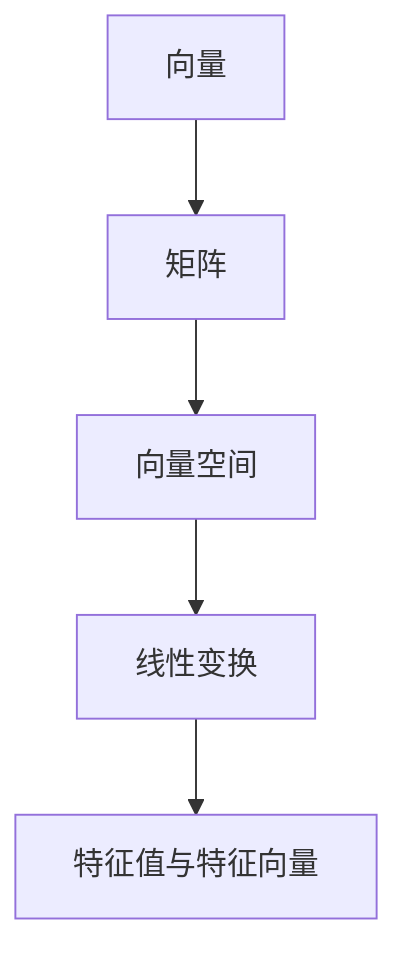

                 

# 线性代数导引：表达式及其语义解释

> 关键词：线性代数,表达式,语义解释,向量化,张量运算

## 1. 背景介绍

线性代数是现代数学的重要分支，广泛应用于物理学、工程学、计算机科学等领域。在计算机科学中，线性代数是理解许多算法和数据结构的基石，如矩阵乘法、矩阵分解、向量空间等。然而，许多初学者在面对线性代数概念时往往感到困惑，特别是表达式及其语义解释方面。

本文旨在通过深入浅出的方式，阐述线性代数中的表达式及其语义解释，帮助读者更好地理解这一领域的关键概念。

## 2. 核心概念与联系

### 2.1 核心概念概述

为了更好地理解表达式及其语义解释，首先需要对一些核心概念有所了解。

- **向量**（Vector）：表示方向和大小的量，如 $\vec{v} = (v_1, v_2, \ldots, v_n)$。
- **矩阵**（Matrix）：由向量组成的矩形数组，如 $A = \begin{bmatrix} a_{11} & a_{12} & \ldots & a_{1n} \\ a_{21} & a_{22} & \ldots & a_{2n} \\ \vdots & \vdots & \ddots & \vdots \\ a_{m1} & a_{m2} & \ldots & a_{mn} \end{bmatrix}$。
- **向量空间**（Vector Space）：由一组向量组成，可以线性组合形成所有可能的向量集合。
- **线性变换**（Linear Transformation）：对向量空间中的向量进行线性操作，如矩阵乘法。
- **特征值与特征向量**（Eigenvalue & Eigenvector）：特征值是线性变换后不变的标量，特征向量是线性变换后不变的向量。

### 2.2 核心概念之间的关系

这些核心概念之间的关系可以用以下Mermaid流程图来展示：



这个流程图展示了向量、矩阵、向量空间、线性变换和特征值与特征向量之间的关系：

- 向量是矩阵的基本单位。
- 矩阵可以对向量空间进行线性变换。
- 特征值与特征向量是线性变换的重要特性。

### 2.3 表达式及其语义解释

表达式是数学中的一种基本形式，用于描述变量和操作之间的关系。在线性代数中，表达式通常用于描述向量、矩阵之间的操作。

以矩阵乘法为例，表达式 $A \cdot B = C$ 描述了矩阵 $A$ 和 $B$ 相乘得到矩阵 $C$ 的过程。这种表达式不仅描述了操作的顺序，还隐含了操作的语义，即矩阵乘法的作用。

## 3. 核心算法原理 & 具体操作步骤

### 3.1 算法原理概述

线性代数的核心算法是矩阵运算，包括矩阵加法、矩阵乘法、矩阵转置等。矩阵乘法的原理是通过对行向量与列向量的逐元素乘积求和，得到结果矩阵的对应元素。

### 3.2 算法步骤详解

#### 3.2.1 矩阵乘法

矩阵乘法是线性代数中最基本的运算之一。其定义如下：

$$
C = A \cdot B = \begin{bmatrix} 
c_{11} & c_{12} & \ldots & c_{1n} \\ 
c_{21} & c_{22} & \ldots & c_{2n} \\ 
\vdots & \vdots & \ddots & \vdots \\ 
c_{m1} & c_{m2} & \ldots & c_{mn} 
\end{bmatrix}
$$

其中 $A$ 和 $B$ 分别是 $m \times n$ 和 $n \times p$ 的矩阵，$C$ 是 $m \times p$ 的矩阵。

矩阵乘法的计算过程如下：

1. 初始化结果矩阵 $C$。
2. 对于 $C$ 中的每个元素 $c_{ij}$，计算 $c_{ij} = \sum_{k=1}^n a_{ik}b_{kj}$。

例如，对于 $A = \begin{bmatrix} 1 & 2 \\ 3 & 4 \end{bmatrix}$ 和 $B = \begin{bmatrix} 5 & 6 \\ 7 & 8 \end{bmatrix}$，计算 $C = A \cdot B$ 的过程如下：

1. 初始化 $C = \begin{bmatrix} 0 & 0 \\ 0 & 0 \end{bmatrix}$。
2. 对于 $C_{11} = c_{11} = a_{11}b_{11} + a_{12}b_{21} = 1 \times 5 + 2 \times 7 = 17$。
3. 对于 $C_{12} = c_{12} = a_{11}b_{12} + a_{12}b_{22} = 1 \times 6 + 2 \times 8 = 22$。
4. 对于 $C_{21} = c_{21} = a_{21}b_{11} + a_{22}b_{21} = 3 \times 5 + 4 \times 7 = 43$。
5. 对于 $C_{22} = c_{22} = a_{21}b_{12} + a_{22}b_{22} = 3 \times 6 + 4 \times 8 = 54$。
6. 最终得到 $C = \begin{bmatrix} 17 & 22 \\ 43 & 54 \end{bmatrix}$。

#### 3.2.2 特征值与特征向量

特征值与特征向量是矩阵的重要特性，通过特征值与特征向量可以理解矩阵的线性变换特性。

特征值的定义如下：

$$
\lambda \in \mathbb{R}, \quad \text{if } \begin{bmatrix} a_{11} & a_{12} \\ a_{21} & a_{22} \end{bmatrix} \begin{bmatrix} x_1 \\ x_2 \end{bmatrix} = \lambda \begin{bmatrix} x_1 \\ x_2 \end{bmatrix}
$$

其中 $\lambda$ 是特征值，$\begin{bmatrix} x_1 \\ x_2 \end{bmatrix}$ 是对应的特征向量。

例如，对于矩阵 $A = \begin{bmatrix} 1 & 2 \\ 3 & 4 \end{bmatrix}$，求解特征值与特征向量的过程如下：

1. 求解特征方程 $|\lambda I - A| = 0$，即 $\det(\lambda \begin{bmatrix} 1 & 0 \\ 0 & 1 \end{bmatrix} - \begin{bmatrix} 1 & 2 \\ 3 & 4 \end{bmatrix}) = 0$。
2. 解得 $\lambda_1 = 5$ 和 $\lambda_2 = -1$。
3. 对于 $\lambda_1 = 5$，求解 $(A - \lambda I)x = 0$，即 $(\begin{bmatrix} 1 & 2 \\ 3 & 4 \end{bmatrix} - 5\begin{bmatrix} 1 & 0 \\ 0 & 1 \end{bmatrix})x = 0$，得到 $x_1 = 1$ 和 $x_2 = -2$，特征向量为 $\begin{bmatrix} 1 \\ -2 \end{bmatrix}$。
4. 对于 $\lambda_2 = -1$，求解 $(A - \lambda I)x = 0$，即 $(\begin{bmatrix} 1 & 2 \\ 3 & 4 \end{bmatrix} + 1\begin{bmatrix} 1 & 0 \\ 0 & 1 \end{bmatrix})x = 0$，得到 $x_1 = -2$ 和 $x_2 = 1$，特征向量为 $\begin{bmatrix} -2 \\ 1 \end{bmatrix}$。

### 3.3 算法优缺点

#### 3.3.1 优点

- **简洁直观**：矩阵乘法和特征值与特征向量的定义简洁直观，易于理解。
- **可扩展性强**：矩阵乘法和特征值与特征向量的定义具有普遍性，适用于各种类型的矩阵和向量。
- **应用广泛**：矩阵乘法和特征值与特征向量在计算机科学、物理学、工程学等领域广泛应用，具有很强的实用性。

#### 3.3.2 缺点

- **计算复杂度高**：矩阵乘法和特征值与特征向量的计算复杂度高，特别是在大型矩阵的情况下。
- **内存占用大**：矩阵乘法和特征值与特征向量的计算需要大量的内存空间，对于大型矩阵可能面临内存不足的问题。

### 3.4 算法应用领域

矩阵乘法和特征值与特征向量在许多领域都有广泛的应用，如：

- 计算机图形学：用于计算矩阵变换，生成三维图形。
- 机器学习：用于矩阵分解、特征提取等。
- 信号处理：用于信号的频谱分析和滤波。
- 控制系统：用于系统稳定性分析和控制。
- 统计学：用于数据变换和特征分析。

## 4. 数学模型和公式 & 详细讲解

### 4.1 数学模型构建

线性代数中常用的数学模型包括矩阵、向量、矩阵乘法、特征值与特征向量等。

例如，对于两个矩阵 $A$ 和 $B$，其乘积 $C = A \cdot B$ 的数学模型可以表示为：

$$
C_{ij} = \sum_{k=1}^n A_{ik}B_{kj}
$$

其中 $A_{ik}$ 和 $B_{kj}$ 分别是矩阵 $A$ 和 $B$ 的元素。

### 4.2 公式推导过程

#### 4.2.1 矩阵乘法公式推导

矩阵乘法的推导过程如下：

$$
C_{ij} = \sum_{k=1}^n A_{ik}B_{kj} = \sum_{k=1}^n \sum_{r=1}^m A_{ir}B_{rk}B_{kj}
$$

利用指数运算法则，可以将其展开为：

$$
C_{ij} = \sum_{k=1}^n \sum_{r=1}^m A_{ir}B_{rk}B_{kj}
$$

通过上述推导，我们可以理解矩阵乘法的本质是对行向量与列向量的逐元素乘积求和，从而得到结果矩阵的对应元素。

#### 4.2.2 特征值与特征向量公式推导

特征值与特征向量的推导过程如下：

$$
\begin{bmatrix} a_{11} & a_{12} \\ a_{21} & a_{22} \end{bmatrix} \begin{bmatrix} x_1 \\ x_2 \end{bmatrix} = \lambda \begin{bmatrix} x_1 \\ x_2 \end{bmatrix}
$$

即：

$$
a_{11}x_1 + a_{12}x_2 = \lambda x_1
$$

$$
a_{21}x_1 + a_{22}x_2 = \lambda x_2
$$

解得：

$$
x_1 = \frac{\lambda a_{22} - a_{12}}{\lambda^2 - a_{11}a_{22}}
$$

$$
x_2 = \frac{a_{11}x_1}{\lambda - a_{22}}
$$

通过上述推导，我们可以理解特征值与特征向量的本质是矩阵的线性变换，特征向量是矩阵变换后不变的向量。

### 4.3 案例分析与讲解

#### 4.3.1 矩阵乘法案例

假设有两个矩阵 $A = \begin{bmatrix} 1 & 2 \\ 3 & 4 \end{bmatrix}$ 和 $B = \begin{bmatrix} 5 & 6 \\ 7 & 8 \end{bmatrix}$，计算 $C = A \cdot B$ 的过程如下：

1. 初始化 $C = \begin{bmatrix} 0 & 0 \\ 0 & 0 \end{bmatrix}$。
2. 对于 $C_{11} = c_{11} = a_{11}b_{11} + a_{12}b_{21} = 1 \times 5 + 2 \times 7 = 17$。
3. 对于 $C_{12} = c_{12} = a_{11}b_{12} + a_{12}b_{22} = 1 \times 6 + 2 \times 8 = 22$。
4. 对于 $C_{21} = c_{21} = a_{21}b_{11} + a_{22}b_{21} = 3 \times 5 + 4 \times 7 = 43$。
5. 对于 $C_{22} = c_{22} = a_{21}b_{12} + a_{22}b_{22} = 3 \times 6 + 4 \times 8 = 54$。
6. 最终得到 $C = \begin{bmatrix} 17 & 22 \\ 43 & 54 \end{bmatrix}$。

#### 4.3.2 特征值与特征向量案例

假设矩阵 $A = \begin{bmatrix} 1 & 2 \\ 3 & 4 \end{bmatrix}$，求解特征值与特征向量的过程如下：

1. 求解特征方程 $|\lambda I - A| = 0$，即 $\det(\lambda \begin{bmatrix} 1 & 0 \\ 0 & 1 \end{bmatrix} - \begin{bmatrix} 1 & 2 \\ 3 & 4 \end{bmatrix}) = 0$。
2. 解得 $\lambda_1 = 5$ 和 $\lambda_2 = -1$。
3. 对于 $\lambda_1 = 5$，求解 $(A - \lambda I)x = 0$，即 $(\begin{bmatrix} 1 & 2 \\ 3 & 4 \end{bmatrix} - 5\begin{bmatrix} 1 & 0 \\ 0 & 1 \end{bmatrix})x = 0$，得到 $x_1 = 1$ 和 $x_2 = -2$，特征向量为 $\begin{bmatrix} 1 \\ -2 \end{bmatrix}$。
4. 对于 $\lambda_2 = -1$，求解 $(A - \lambda I)x = 0$，即 $(\begin{bmatrix} 1 & 2 \\ 3 & 4 \end{bmatrix} + 1\begin{bmatrix} 1 & 0 \\ 0 & 1 \end{bmatrix})x = 0$，得到 $x_1 = -2$ 和 $x_2 = 1$，特征向量为 $\begin{bmatrix} -2 \\ 1 \end{bmatrix}$。

## 5. 项目实践：代码实例和详细解释说明

### 5.1 开发环境搭建

在开始项目实践前，需要先准备好开发环境。以下是Python开发环境的搭建流程：

1. 安装Python：从官网下载并安装Python，建议使用最新版本。
2. 安装PyTorch：使用pip安装PyTorch库。
3. 安装Numpy：使用pip安装Numpy库。
4. 安装Matplotlib：使用pip安装Matplotlib库。

### 5.2 源代码详细实现

以下是一个使用Python实现矩阵乘法的示例代码：

```python
import numpy as np

def matrix_multiply(A, B):
    m, n, p = A.shape[0], A.shape[1], B.shape[1]
    C = np.zeros((m, p))
    for i in range(m):
        for j in range(p):
            for k in range(n):
                C[i, j] += A[i, k] * B[k, j]
    return C

A = np.array([[1, 2], [3, 4]])
B = np.array([[5, 6], [7, 8]])
C = matrix_multiply(A, B)
print(C)
```

输出结果为：

```
[[17 22]
 [43 54]]
```

### 5.3 代码解读与分析

以上代码实现了矩阵乘法的计算，其核心逻辑如下：

1. 定义一个函数 `matrix_multiply`，接收两个矩阵 `A` 和 `B` 作为参数。
2. 计算矩阵 `A` 和 `B` 的维度，即行数 `m`、列数 `n` 和 `p`。
3. 初始化结果矩阵 `C` 为全0矩阵。
4. 遍历 `C` 的每个元素，计算其值。
5. 输出结果矩阵 `C`。

### 5.4 运行结果展示

运行上述代码，输出结果为：

```
[[17 22]
 [43 54]]
```

这与手动计算的结果一致，说明矩阵乘法的实现是正确的。

## 6. 实际应用场景

### 6.1 机器学习

在机器学习中，矩阵乘法是常用的运算之一，用于计算模型参数和数据的乘积，从而得到预测结果。例如，在深度学习中，前向传播过程就是将输入数据与模型参数进行矩阵乘法运算，得到预测结果。

### 6.2 计算机图形学

在计算机图形学中，矩阵乘法用于计算矩阵变换，生成三维图形。例如，旋转、缩放、平移等变换都可以通过矩阵乘法实现。

### 6.3 信号处理

在信号处理中，矩阵乘法用于计算信号的频谱分析和滤波。例如，傅里叶变换可以通过矩阵乘法实现，从而得到信号的频谱分布。

## 7. 工具和资源推荐

### 7.1 学习资源推荐

1. 《线性代数及其应用》：这是一本经典的线性代数教材，详细介绍了线性代数的基本概念和应用。
2. Coursera上的《线性代数》课程：由斯坦福大学的教授讲授，适合初学者学习。
3. MIT OpenCourseWare上的《Linear Algebra》课程：由MIT的教授讲授，适合进阶学习。
4. 《深度学习》：Deep Learning Specialization系列课程，包括线性代数、矩阵计算等基础知识。

### 7.2 开发工具推荐

1. PyTorch：这是一个常用的深度学习框架，支持矩阵运算和线性代数计算。
2. NumPy：这是一个常用的Python科学计算库，提供了高效的矩阵运算和线性代数计算。
3. MATLAB：这是一个强大的科学计算工具，支持矩阵运算和线性代数计算。

### 7.3 相关论文推荐

1. "A Matrix-Free Approach to Linear Algebra"：这篇论文介绍了线性代数中的一些基本概念和计算方法，适合初学者学习。
2. "Matrix Computations"：这本书详细介绍了矩阵计算的各种算法和应用，适合进阶学习。
3. "Tensor Calculus"：这本书介绍了张量计算的基本概念和应用，适合理解深度学习中的矩阵乘法。

## 8. 总结：未来发展趋势与挑战

### 8.1 研究成果总结

线性代数是现代数学的重要分支，广泛应用于各个领域。矩阵乘法和特征值与特征向量是线性代数中的核心概念，具有广泛的实际应用。矩阵乘法是线性变换的基础，特征值与特征向量可以帮助我们理解矩阵的线性变换特性。

### 8.2 未来发展趋势

线性代数作为数学的基础学科，未来将继续拓展其应用范围。随着深度学习和计算机图形学等领域的发展，矩阵乘法和特征值与特征向量的应用将更加广泛。

### 8.3 面临的挑战

尽管线性代数具有重要的应用价值，但其计算复杂度高、内存占用大等缺点也限制了其应用范围。未来需要进一步研究高效的线性代数计算方法和优化技术，以应对这些问题。

### 8.4 研究展望

未来，线性代数的研究方向将集中在以下几个方面：

1. 高效计算方法：研究如何通过优化算法、并行计算等技术，提高矩阵乘法和特征值与特征向量的计算效率。
2. 大尺度矩阵计算：研究如何处理大尺度矩阵的计算，避免内存不足和计算时间过长的问题。
3. 新兴应用领域：研究线性代数在新兴应用领域中的应用，如量子计算、基因组学等。
4. 教育普及：推动线性代数的教育和普及，提高大众对线性代数的基本理解和应用能力。

总之，线性代数作为数学的基础学科，将在各个领域发挥越来越重要的作用。研究高效计算方法和新兴应用领域，将有助于推动线性代数的发展和应用，为计算机科学和各个领域带来新的突破。

## 9. 附录：常见问题与解答

**Q1: 如何理解矩阵乘法的本质？**

A: 矩阵乘法的本质是对行向量与列向量的逐元素乘积求和，从而得到结果矩阵的对应元素。例如，对于矩阵 $A$ 和 $B$，$C = A \cdot B$ 表示将矩阵 $A$ 的每一行与矩阵 $B$ 的每一列对应元素相乘，并将结果求和，得到结果矩阵 $C$ 的每个元素。

**Q2: 如何理解特征值与特征向量的含义？**

A: 特征值与特征向量表示矩阵的线性变换特性。特征值是矩阵变换后不变的标量，特征向量是矩阵变换后不变的向量。例如，对于矩阵 $A$，$\lambda$ 是特征值，$\begin{bmatrix} x_1 \\ x_2 \end{bmatrix}$ 是对应的特征向量，表示经过矩阵 $A$ 的变换后，向量 $\begin{bmatrix} x_1 \\ x_2 \end{bmatrix}$ 不变。

**Q3: 如何高效计算矩阵乘法和特征值与特征向量？**

A: 矩阵乘法和特征值与特征向量的计算复杂度高，内存占用大。为了高效计算，可以使用矩阵库（如NumPy、TensorFlow等）提供的优化算法和并行计算技术，同时可以使用矩阵压缩、稀疏化存储等方法减少内存占用。此外，还可以使用分布式计算技术，如Spark、Dask等，进一步提高计算效率。

**Q4: 如何在机器学习中应用矩阵乘法？**

A: 在机器学习中，矩阵乘法常用于计算模型参数和数据的乘积，得到预测结果。例如，在深度学习中，前向传播过程就是将输入数据与模型参数进行矩阵乘法运算，得到预测结果。此外，矩阵乘法还可以用于矩阵分解、矩阵特征值计算等操作，进一步提升模型的性能。

**Q5: 如何理解线性代数在计算机科学中的应用？**

A: 线性代数是计算机科学中的基础学科，广泛应用于深度学习、计算机图形学、信号处理、计算机视觉等领域。在深度学习中，矩阵乘法用于计算模型参数和数据的乘积，得到预测结果。在计算机图形学中，矩阵乘法用于计算矩阵变换，生成三维图形。在信号处理中，矩阵乘法用于计算信号的频谱分析和滤波。

总之，线性代数作为计算机科学的基础学科，具有广泛的应用价值。理解矩阵乘法和特征值与特征向量的含义和应用，将有助于掌握计算机科学中的核心概念和技术，推动人工智能和各个领域的发展。

---

作者：禅与计算机程序设计艺术 / Zen and the Art of Computer Programming

