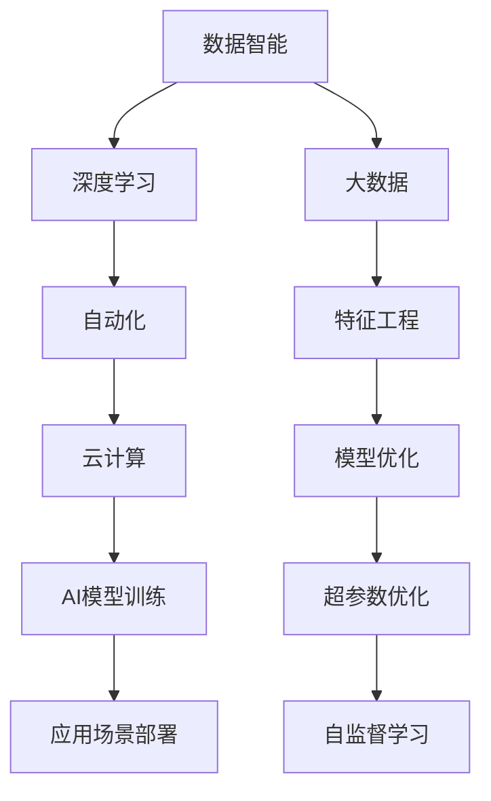

                 

# 李开复：AI 2.0 时代的生态

> 关键词：人工智能(AI), 人工智能2.0, 生态系统(Ecosystem), 技术演进, 数据智能, 自动化(automation), 大数据(big data), 云计算(cloud computing), 深度学习(deep learning), 自监督学习(unsupervised learning)

## 1. 背景介绍

### 1.1 问题由来
当前，人工智能(AI)技术正处于从第一代(知识驱动)到第二代(数据驱动)的演进之中。这一代AI将从传统的基于规则和知识库的推理，转向更加依赖数据和深度学习模型进行决策。这标志着AI技术正在从专业领域的应用，走向更广泛、更复杂、更智能的系统。

AI 2.0时代，数据成为AI模型的核心，而算力和技术的进步则为AI的大规模应用提供了可能。随着深度学习、自然语言处理(NLP)、计算机视觉(CV)等技术的不断突破，AI在自动驾驶、医疗诊断、智能客服等领域展现出巨大潜力。

### 1.2 问题核心关键点
AI 2.0时代的核心挑战在于构建一个开放、协作、可持续发展的生态系统。这个生态系统包括数据获取与处理、算法模型与训练、技术基础设施、应用场景与部署等多个方面。只有各方协同合作，才能最大化AI的商业和社会价值。

**关键点**：
- 数据智能：获取、处理和利用高质量数据，是大规模AI应用的基础。
- 自动化：从数据清洗、特征工程到模型训练、超参数优化，自动化技术能提高工作效率。
- 云计算：云计算提供了强大的计算资源和灵活的部署环境，支持AI模型的训练与推理。
- 大数据：数据量的增长驱动了模型复杂度的提升，大数据技术为模型训练和应用提供了支撑。
- 深度学习：深度神经网络能从数据中自动学习特征，提高模型精度。
- 自监督学习：利用无标签数据进行训练，扩大了数据使用的范围。

### 1.3 问题研究意义
构建AI 2.0时代的生态系统，对于加速AI技术的落地应用、推动产业升级、提升社会福祉具有重要意义：

1. **提升效率**：AI技术能够自动化处理大量重复性工作，提高生产效率。
2. **降低成本**：AI可以优化资源配置，降低人力和物资成本。
3. **创造价值**：AI在医疗、金融、制造等领域的广泛应用，可以创造新的商业价值和社会效益。
4. **促进创新**：AI技术的发展推动了跨领域技术融合，催生了新的行业和商业模式。
5. **提升决策质量**：AI通过数据分析和模式识别，能提供更加准确和及时的决策支持。
6. **应对挑战**：AI能够帮助解决气候变化、疾病防控等全球性问题，提高应对能力。

## 2. 核心概念与联系

### 2.1 核心概念概述

为了更好地理解AI 2.0时代的生态系统，我们将介绍几个关键概念及其相互关系：

1. **人工智能(AI)**：利用计算机技术，模拟人类智能行为，解决复杂问题的能力。
2. **人工智能2.0(AI 2.0)**：以数据为中心，结合深度学习、大数据和云计算等技术，构建智能系统。
3. **数据智能**：通过数据的获取、清洗、处理和分析，提高AI模型的性能。
4. **自动化**：使用自动化工具和流程，提高AI系统的开发和维护效率。
5. **云计算**：提供弹性计算资源和存储服务，支持大规模数据处理和AI模型的训练与部署。
6. **深度学习**：利用神经网络进行复杂模式识别和学习，实现更高效的特征提取和分类。
7. **自监督学习**：利用无标签数据进行模型训练，扩展数据使用范围。

这些概念共同构成了AI 2.0时代的生态系统，每个环节都至关重要，共同推动AI技术的持续发展与应用。

### 2.2 概念间的关系

以下是一个综合的流程图，展示这些核心概念在大规模AI系统中的作用和关系：



这个流程图展示了从数据获取到模型部署的全流程。首先，数据智能获取并处理数据，通过大数据技术进行特征工程，然后使用自动化工具和深度学习模型进行训练和优化，最终部署到云计算平台上，服务于各种应用场景。

### 2.3 核心概念的整体架构

为更清晰地理解这些概念的架构关系，以下是一个更详细的Mermaid流程图：


这个图表展示了从数据处理到模型部署再到用户体验的整个生态链。数据智能通过大数据技术获取和处理数据，特征工程和模型优化利用自动化工具和深度学习进行模型训练和优化，模型部署到云计算平台上，最终为用户提供高效率、高体验的服务。

## 3. 核心算法原理 & 具体操作步骤

### 3.1 算法原理概述

AI 2.0时代的算法原理，主要集中在深度学习和自监督学习两个方向。深度学习利用多层神经网络从数据中自动提取特征，自监督学习则通过无标签数据进行训练，扩大数据使用的范围，提高模型泛化能力。

### 3.2 算法步骤详解

1. **数据智能阶段**：
   - 数据收集：从互联网、传感器、物联网等来源获取数据。
   - 数据清洗：去除噪声和重复数据，确保数据质量。
   - 数据标注：为监督学习任务准备标注数据，对于自监督学习则不需要标注。
   - 数据存储：利用大数据技术进行高效存储和处理。

2. **深度学习阶段**：
   - 模型选择：选择合适的深度学习模型，如卷积神经网络(CNN)、循环神经网络(RNN)、Transformer等。
   - 特征工程：提取和选择有用的特征，提高模型性能。
   - 模型训练：使用标注数据对模型进行训练，调整参数以最小化损失函数。
   - 模型验证：在验证集上评估模型性能，进行超参数调整和模型优化。

3. **自动化阶段**：
   - 自动化工具：使用自动化框架，如TensorFlow、PyTorch等，进行模型开发和训练。
   - 自动化流程：利用流水线工具，如Kubeflow、Airflow等，自动化数据流、模型训练和部署流程。
   - 自动化监控：实时监控模型性能和系统状态，及时发现和解决异常问题。

4. **云计算阶段**：
   - 云计算平台：选择适合的云服务提供商，如AWS、Azure、Google Cloud等。
   - 弹性计算：根据任务需求动态调整计算资源。
   - 数据存储：利用云存储服务，如S3、HDFS等，进行数据管理和备份。
   - 网络优化：通过负载均衡、CDN等技术，提高数据传输效率。

### 3.3 算法优缺点

**优点**：
- 提高了数据利用率，减少了对标注数据的依赖。
- 利用深度学习模型，提升了模型精度和泛化能力。
- 自动化工具和云计算平台提高了开发和部署效率。

**缺点**：
- 数据智能环节需要大量人力和时间投入。
- 深度学习模型需要大量计算资源和数据存储。
- 自动化流程需要专业人员维护和优化。
- 模型训练和推理效率仍需进一步提升。

### 3.4 算法应用领域

AI 2.0时代的算法应用非常广泛，涵盖了医疗、金融、零售、制造等多个行业。以下是几个典型应用领域的详细介绍：

#### 3.4.1 医疗诊断
AI 2.0在医疗诊断中的应用主要体现在影像分析和病理诊断上。深度学习模型可以自动分析X光片、CT扫描等医学影像，识别出病灶和病变。自监督学习可以通过无标签的影像数据进行训练，提高模型的泛化能力。

#### 3.4.2 金融风控
金融领域利用AI 2.0技术进行风险评估和反欺诈检测。深度学习模型可以分析交易数据和行为特征，预测违约风险和欺诈行为。自监督学习可以处理大规模的未标注金融数据，提高模型性能。

#### 3.4.3 零售推荐
零售行业利用AI 2.0进行个性化推荐和库存管理。深度学习模型可以分析用户行为和偏好，生成推荐商品列表。自监督学习可以处理无标签的用户行为数据，提高推荐系统的准确性。

#### 3.4.4 制造自动化
制造业利用AI 2.0进行生产过程优化和设备维护。深度学习模型可以分析传感器数据和生产日志，优化生产流程和预测设备故障。自监督学习可以处理大量的生产数据，提高模型的预测准确性。

## 4. 数学模型和公式 & 详细讲解

### 4.1 数学模型构建

以卷积神经网络(CNN)为例，介绍其在图像识别任务中的应用。假设输入图像为 $X$，输出类别为 $Y$，模型参数为 $\theta$。则CNN的数学模型为：

$$
Y = f(X; \theta)
$$

其中 $f$ 为卷积神经网络的函数映射。模型训练的目标是找到最优的参数 $\theta$，使得损失函数 $\mathcal{L}(\theta)$ 最小化：

$$
\theta^* = \mathop{\arg\min}_{\theta} \mathcal{L}(Y, \hat{Y}; \theta)
$$

其中 $\hat{Y}$ 为模型预测的类别。

### 4.2 公式推导过程

以二分类问题为例，假设模型输出为 $Y$，真实标签为 $T$，则交叉熵损失函数为：

$$
\mathcal{L}(Y, T) = -\frac{1}{N}\sum_{i=1}^N [T_i\log Y_i + (1-T_i)\log (1-Y_i)]
$$

其中 $N$ 为样本数量。最小化损失函数即最小化模型的预测误差：

$$
\mathop{\arg\min}_{\theta} \mathcal{L}(Y, T)
$$

### 4.3 案例分析与讲解

以AlphaGo为例，介绍深度学习在棋类博弈中的应用。AlphaGo利用深度学习模型进行策略选择和估值计算，利用蒙特卡罗树搜索算法进行模拟，最终战胜了世界围棋冠军李世石。该案例展示了深度学习在复杂决策问题中的应用潜力。

## 5. 项目实践：代码实例和详细解释说明

### 5.1 开发环境搭建

**Python**：
- 安装Python 3.6及以上版本，推荐使用Anaconda或Miniconda进行环境管理。
- 安装PyTorch、TensorFlow等深度学习框架，以及numpy、pandas等常用科学计算库。

**Jupyter Notebook**：
- 安装Jupyter Notebook和相关扩展，如JupyterLab、Jupyter Notebook Kernel等。
- 创建虚拟环境，确保不同项目之间不会互相干扰。

### 5.2 源代码详细实现

以TensorFlow为例，展示图像分类任务中的代码实现。

```python
import tensorflow as tf
from tensorflow.keras import layers

# 加载数据集
(x_train, y_train), (x_test, y_test) = tf.keras.datasets.mnist.load_data()

# 数据预处理
x_train = x_train.reshape(-1, 28*28).astype("float32") / 255.0
x_test = x_test.reshape(-1, 28*28).astype("float32") / 255.0
y_train = tf.keras.utils.to_categorical(y_train, num_classes=10)
y_test = tf.keras.utils.to_categorical(y_test, num_classes=10)

# 定义模型
model = tf.keras.Sequential([
    layers.Dense(256, activation='relu', input_shape=(784,)),
    layers.Dropout(0.2),
    layers.Dense(128, activation='relu'),
    layers.Dropout(0.2),
    layers.Dense(10, activation='softmax')
])

# 编译模型
model.compile(optimizer='adam', loss='categorical_crossentropy', metrics=['accuracy'])

# 训练模型
model.fit(x_train, y_train, batch_size=64, epochs=10, validation_data=(x_test, y_test))
```

### 5.3 代码解读与分析

上述代码展示了如何使用TensorFlow进行图像分类任务的训练。首先，加载MNIST数据集并进行预处理，然后定义一个包含多个隐藏层的神经网络模型，并编译模型。最后，使用fit函数进行训练，并指定验证集用于评估模型性能。

## 6. 实际应用场景

### 6.1 医疗影像分析

AI 2.0在医疗影像分析中的应用极为广泛。利用深度学习模型，可以自动分析医学影像，识别出病灶和病变。例如，卷积神经网络可以处理X光片和CT扫描，自动检测肺癌、乳腺癌等病变。

### 6.2 金融风险评估

AI 2.0在金融风险评估中的应用主要体现在信用评分和反欺诈检测上。深度学习模型可以分析贷款申请、交易记录等数据，预测违约风险和欺诈行为。例如，循环神经网络可以处理时间序列数据，识别出异常交易。

### 6.3 零售个性化推荐

AI 2.0在零售个性化推荐中的应用主要体现在用户行为分析和商品推荐上。深度学习模型可以分析用户浏览、点击、购买等行为数据，生成个性化的推荐商品列表。例如，自编码器可以提取用户行为特征，生成推荐模型。

### 6.4 制造业设备维护

AI 2.0在制造业设备维护中的应用主要体现在故障预测和维护计划优化上。深度学习模型可以分析传感器数据和生产日志，预测设备故障和维护时间。例如，循环神经网络可以处理时间序列数据，识别出设备异常状态。

## 7. 工具和资源推荐

### 7.1 学习资源推荐

- **深度学习课程**：如Coursera的《深度学习专项课程》，涵盖深度学习基础、卷积神经网络、循环神经网络等。
- **机器学习书籍**：如《Python深度学习》、《Deep Learning》等，详细介绍了深度学习模型的构建和优化。
- **开源项目**：如TensorFlow、PyTorch等深度学习框架，提供了丰富的教程和样例代码。

### 7.2 开发工具推荐

- **Jupyter Notebook**：轻量级的交互式开发环境，适合数据处理和模型训练。
- **TensorBoard**：可视化工具，实时监控模型训练过程和性能指标。
- **Kubeflow**：自动化机器学习平台，支持模型训练、部署和管理。

### 7.3 相关论文推荐

- **AlphaGo论文**：由DeepMind团队发表，详细介绍了AlphaGo的策略选择和估值计算方法。
- **深度学习在医疗影像分析中的应用**：由MIT Technology Review发表，介绍了深度学习在医学影像分析中的应用和挑战。
- **金融风险评估的深度学习模型**：由IEEE Transactions on Neural Networks and Learning Systems发表，介绍了深度学习在金融风险评估中的应用。

## 8. 总结：未来发展趋势与挑战

### 8.1 总结

本文对AI 2.0时代的生态系统进行了全面系统的介绍。首先阐述了AI 2.0时代的背景和意义，明确了数据智能、自动化、云计算等核心概念。其次，从原理到实践，详细讲解了AI 2.0技术的各个环节，给出了具体的代码实例和分析。同时，本文还探讨了AI 2.0技术在医疗、金融、零售、制造等领域的实际应用。最后，总结了AI 2.0技术的发展趋势和面临的挑战，提出了未来的研究方向和突破方向。

通过本文的系统梳理，可以看到，AI 2.0时代的数据智能、自动化、云计算等技术正在推动AI技术的不断演进，为各行各业带来了前所未有的变革。AI 2.0技术的普及和应用，将深刻影响社会生活的各个方面，带来全新的机遇和挑战。

### 8.2 未来发展趋势

展望未来，AI 2.0技术的几个主要发展趋势包括：

1. **跨领域融合**：AI技术将与其他技术进行更深入的融合，如物联网、区块链、量子计算等，形成更加全面的智能解决方案。
2. **自动化与智能化结合**：自动化工具和智能化算法将更紧密结合，提升系统的效率和效果。
3. **数据驱动与模型驱动结合**：数据智能和模型优化将更紧密结合，提高模型的泛化能力和性能。
4. **边缘计算与云计算结合**：边缘计算和云计算将更紧密结合，实现更高效的资源利用和数据处理。
5. **自监督学习与生成模型结合**：自监督学习和生成模型将更紧密结合，提升模型的鲁棒性和创新能力。

### 8.3 面临的挑战

尽管AI 2.0技术发展迅速，但仍面临诸多挑战：

1. **数据隐私和安全**：AI 2.0技术对数据的依赖导致隐私和安全问题凸显，需要制定更严格的数据保护法规。
2. **算法透明度和可解释性**：AI模型的决策过程缺乏透明度和可解释性，可能影响用户信任和使用效果。
3. **模型公平性和偏见**：AI 2.0模型可能存在偏见和歧视，影响模型的公平性和公正性。
4. **资源和计算成本**：AI 2.0模型的训练和推理需要大量资源和计算能力，成本较高。
5. **技术标准和规范**：AI 2.0技术标准和规范尚未完全统一，需要更多的行业协作和标准化工作。
6. **伦理和社会影响**：AI 2.0技术可能带来伦理和社会问题，如自动化失业、决策失误等。

### 8.4 研究展望

面对AI 2.0技术的挑战，未来的研究需要在以下几个方面寻求新的突破：

1. **数据隐私和安全保护**：研发更加安全、透明、可解释的AI模型，确保数据隐私和安全。
2. **算法透明度和可解释性**：研究如何让AI模型具备更强的可解释性，提升用户信任。
3. **模型公平性和偏见消除**：开发公平、公正、无偏见的AI模型，避免歧视性输出。
4. **资源优化与成本降低**：研究如何降低AI模型的训练和推理成本，提升资源利用效率。
5. **标准化工作与技术规范**：推动AI技术的标准化工作，制定统一的技术规范和标准。
6. **伦理和社会影响研究**：深入研究AI技术对社会、伦理的影响，提出可行的解决方案。

## 9. 附录：常见问题与解答

### Q1: 什么是AI 2.0?

A: AI 2.0是以数据为中心，结合深度学习、大数据和云计算等技术，构建智能系统的技术范式。与第一代AI相比，AI 2.0更注重数据的智能处理和模型的自动化训练。

### Q2: 数据智能在AI 2.0中的作用是什么?

A: 数据智能在AI 2.0中的作用是获取、处理和利用高质量数据，为模型训练提供基础。数据智能通过大数据技术进行特征工程，提取有用的特征，提高模型性能。

### Q3: 自动化在AI 2.0中的作用是什么?

A: 自动化在AI 2.0中的作用是提高模型开发和维护的效率。自动化工具和流程可以自动化数据流、模型训练和部署流程，减少人工干预，提升开发效率。

### Q4: 云计算在AI 2.0中的作用是什么?

A: 云计算在AI 2.0中的作用是提供弹性计算资源和存储服务，支持大规模数据处理和模型训练与部署。云计算平台提供弹性和可伸缩的计算资源，确保模型的训练和推理效率。

### Q5: 深度学习在AI 2.0中的应用场景有哪些?

A: 深度学习在AI 2.0中的应用场景非常广泛，涵盖了医疗诊断、金融风控、零售推荐、制造业设备维护等多个领域。深度学习模型可以自动分析数据，提取特征，进行分类和预测。

---

作者：禅与计算机程序设计艺术 / Zen and the Art of Computer Programming

