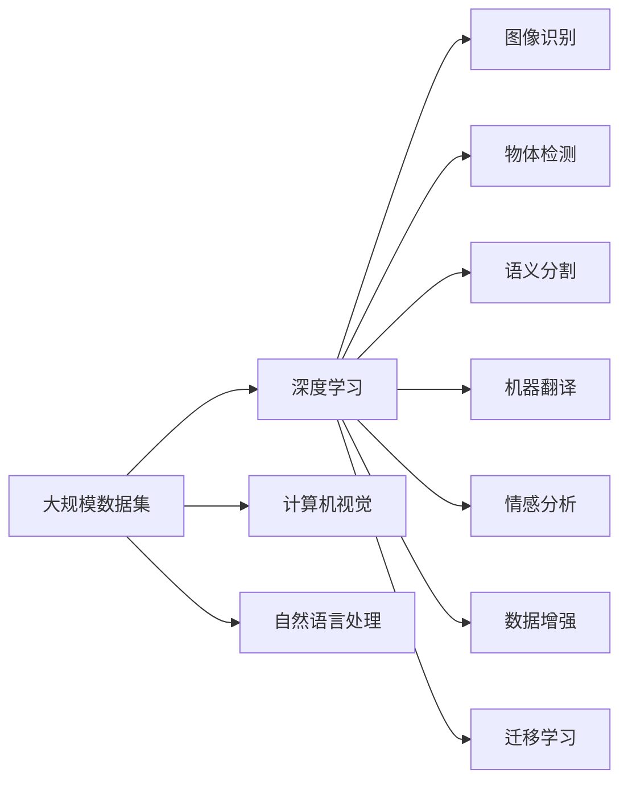

                 

## 1. 背景介绍

### 1.1 问题由来

随着互联网和移动设备的普及，全球数据生成速度和规模以指数级增长，产生了前所未有的海量数据。这些数据蕴含着丰富的知识，能够驱动科学研究、提升生产效率、助力商业决策，具有巨大的社会和经济价值。然而，传统的数据处理方式难以应对海量数据的挑战，AI和大数据技术的兴起为数据驱动的智能决策提供了新的解决手段。

### 1.2 问题核心关键点

大数据和人工智能技术的紧密结合，使得数据分析和处理变得更加高效、智能，能够挖掘出数据中隐藏的规律和洞见。李飞飞，作为AI和大数据领域的重要人物，其研究和创新在多个方面推动了大数据领域的变革。她的工作聚焦于计算机视觉、图像处理、自然语言处理等领域，并以其独特的视角和丰富的实践经验，影响和改变了人工智能和大数据领域的多个方面。

### 1.3 问题研究意义

李飞飞的研究和创新不仅推动了AI和大数据技术的进步，还促进了其广泛应用。例如，在医学影像分析、自动驾驶、智能监控、社交媒体分析等众多领域，大数据和AI技术的应用都取得了突破性进展。此外，李飞飞的研究还在教育、艺术、政府治理等多个社会层面产生了深远影响，促进了社会的智能化和信息化进程。

## 2. 核心概念与联系

### 2.1 核心概念概述

为更好地理解李飞飞对AI和大数据领域的贡献，本节将介绍几个密切相关的核心概念：

- **大规模数据集**：指包含大量样本、多维特征的数据集。大规模数据集是AI和大数据技术的基础，能够提供丰富的训练样本，帮助模型更好地学习和泛化。

- **深度学习**：一种基于神经网络的机器学习方法，通过多层非线性映射，从数据中自动学习特征和规律，实现模式识别、分类、回归等任务。

- **计算机视觉**：利用计算机和AI技术处理、分析图像和视频数据，实现图像识别、对象检测、语义分割等任务。

- **自然语言处理**：利用计算机和AI技术处理、分析文本数据，实现语言理解、机器翻译、情感分析等任务。

- **数据增强**：通过对训练数据进行扩充、变换等操作，增加数据多样性，提升模型的泛化能力。

- **迁移学习**：将一个领域学到的知识迁移到另一个领域，避免从头训练，提高学习效率。

这些核心概念之间存在着紧密的联系，通过李飞飞的研究工作，我们能够更深入地理解这些概念的交互和影响。

### 2.2 概念间的关系

这些核心概念之间存在着逻辑关系，我们可以通过以下Mermaid流程图来展示：



这个流程图展示了大数据和AI技术中各个概念的逻辑关系：

1. 大规模数据集是深度学习的基础，能够提供足够的训练样本。
2. 深度学习通过多层神经网络实现特征学习，广泛应用于图像处理、语言理解等任务。
3. 计算机视觉和自然语言处理分别处理图像和文本数据，是深度学习的重要应用领域。
4. 深度学习技术能够实现图像识别、物体检测、语义分割、机器翻译、情感分析等多种任务。
5. 数据增强和迁移学习是提高模型泛化能力的有效方法。

通过这些流程图，我们可以更清晰地理解大数据和AI技术中的核心概念及其相互关系，为后续深入讨论李飞飞的研究工作奠定基础。

## 3. 核心算法原理 & 具体操作步骤

### 3.1 算法原理概述

李飞飞的研究工作主要集中在计算机视觉和自然语言处理领域，通过构建大规模数据集和深度学习模型，推动了AI技术在这些领域的应用。她的工作不仅在学术界产生了深远影响，还促成了多项商业应用和产业标准的制定。

### 3.2 算法步骤详解

#### 3.2.1 大规模数据集的构建

李飞飞的研究团队构建了多个大规模数据集，如ImageNet、COCO等，这些数据集包含数百万张图像和标注信息，覆盖了自然界中常见的各类物体和场景。这些数据集不仅推动了计算机视觉技术的进步，还促进了人工智能领域的研究和应用。

- **ImageNet数据集**：由斯坦福大学和微软研究院联合开发，包含超过一百万张图像和一千类物体的标注信息。ImageNet数据集的发布极大地推动了深度学习在计算机视觉领域的应用，成为了许多研究工作的基准数据集。

- **COCO数据集**：由微软研究院和多个合作伙伴共同开发，包含超过三十万张图像和四十万个物体的标注信息。COCO数据集在目标检测、语义分割等任务上得到了广泛应用，推动了计算机视觉技术的发展。

#### 3.2.2 深度学习模型的设计

李飞飞的研究团队设计了多个深度学习模型，包括AlexNet、VGG、ResNet等，这些模型通过多层卷积和池化操作，实现了对图像数据的有效处理和特征提取。

- **AlexNet**：是深度学习领域的里程碑模型，首次在ImageNet数据集上取得了显著的性能提升。AlexNet模型通过五层卷积和三层全连接网络实现图像分类任务。

- **VGG**：由牛津大学研究团队提出，使用非常深的卷积神经网络结构，通过16-19层卷积层实现图像分类。VGG模型在ImageNet数据集上取得了优异的表现。

- **ResNet**：由微软研究院提出，通过引入残差连接（Residual Connections），解决了深度神经网络中的梯度消失问题，实现了更加深层的网络结构。ResNet模型在多个计算机视觉任务上取得了SOTA（state-of-the-art）的性能。

#### 3.2.3 数据增强和迁移学习

数据增强和迁移学习是提高深度学习模型泛化能力的重要手段。李飞飞的研究团队在这些领域也做出了重要贡献。

- **数据增强**：通过对训练数据进行旋转、缩放、翻转等操作，生成新的训练样本，增加数据多样性，避免模型过拟合。

- **迁移学习**：将一个领域学到的知识迁移到另一个领域，避免从头训练，提高学习效率。例如，在图像分类任务上训练好的模型，可以迁移到目标检测任务上，只需微调部分层即可。

### 3.3 算法优缺点

大规模数据集和深度学习模型的结合，极大地提升了AI技术的性能和应用效果，但也面临一些挑战和局限性：

- **数据集构建难度大**：大规模数据集的构建需要大量人力、物力和时间，且数据标注工作复杂，成本较高。

- **模型复杂度高**：深度学习模型通常结构复杂，需要大量的计算资源和时间进行训练和优化，训练成本较高。

- **泛化能力不足**：深度学习模型在大规模数据集上的表现通常较好，但在小样本场景下容易过拟合，泛化能力有限。

- **可解释性差**：深度学习模型通常被视为"黑盒"，难以解释其内部工作机制和决策逻辑，缺乏可解释性。

尽管存在这些局限性，但通过李飞飞的研究和创新，这些挑战正在逐步得到解决，AI技术在多个领域得到了广泛应用。

### 3.4 算法应用领域

李飞飞的研究工作在计算机视觉、自然语言处理等领域取得了重要突破，推动了AI技术在这些领域的应用。具体而言：

- **计算机视觉**：在图像分类、目标检测、语义分割等任务上，深度学习模型取得了显著的性能提升，广泛应用于自动驾驶、智能监控、医学影像分析等领域。

- **自然语言处理**：在文本分类、机器翻译、情感分析等任务上，深度学习模型取得了优异的表现，广泛应用于智能客服、社交媒体分析、舆情监测等领域。

## 4. 数学模型和公式 & 详细讲解 & 举例说明

### 4.1 数学模型构建

为了更好地理解李飞飞在深度学习和大数据领域的研究工作，本节将使用数学语言对大规模数据集和深度学习模型的构建过程进行详细描述。

假设有一张图像 $I$ 和其对应的标签 $y$，通过卷积神经网络 $M_{\theta}$ 进行特征提取和分类，模型输出为 $M_{\theta}(I)$，与标签 $y$ 之间的交叉熵损失函数为 $\ell$，则经验风险为：

$$
\mathcal{L}(\theta) = \frac{1}{N} \sum_{i=1}^N \ell(M_{\theta}(I_i), y_i)
$$

其中 $N$ 为训练样本数量，$\theta$ 为模型参数。

### 4.2 公式推导过程

以AlexNet模型为例，推导其在图像分类任务上的训练过程。

AlexNet模型包含五个卷积层和三个全连接层，每个卷积层和全连接层的输出维度不同。假设 $C$ 为卷积层的输出通道数，$F$ 为全连接层的输入特征维度。则AlexNet模型的输出层公式为：

$$
y = \sigma(W_6(z_5) + b_6)
$$

其中 $z_5$ 为第五个卷积层的输出，$W_6$ 和 $b_6$ 为第六个全连接层的权重和偏置，$\sigma$ 为激活函数。

### 4.3 案例分析与讲解

以ImageNet数据集上的AlexNet模型训练为例，分析其训练过程和性能提升。

ImageNet数据集包含超过一百万张图像和一千类物体的标注信息，将每张图像 $I$ 输入AlexNet模型，通过卷积层和池化层的特征提取，得到最后一层的特征表示 $z_5$，然后将其输入全连接层进行分类。模型在训练过程中通过反向传播算法更新参数，最小化交叉熵损失函数 $\ell$，最终得到最优模型参数 $\theta^*$。

## 5. 项目实践：代码实例和详细解释说明

### 5.1 开发环境搭建

在进行深度学习和大数据技术的研究和应用时，我们需要准备好开发环境。以下是使用Python进行TensorFlow开发的环境配置流程：

1. 安装Anaconda：从官网下载并安装Anaconda，用于创建独立的Python环境。

2. 创建并激活虚拟环境：
```bash
conda create -n tf-env python=3.8 
conda activate tf-env
```

3. 安装TensorFlow：根据CUDA版本，从官网获取对应的安装命令。例如：
```bash
conda install tensorflow
```

4. 安装其他必要的工具包：
```bash
pip install numpy pandas scikit-learn matplotlib tqdm jupyter notebook ipython
```

完成上述步骤后，即可在`tf-env`环境中开始深度学习和大数据技术的研究和实践。

### 5.2 源代码详细实现

下面我们以图像分类任务为例，给出使用TensorFlow对AlexNet模型进行训练的代码实现。

首先，定义图像分类数据集：

```python
from tensorflow.keras.datasets import cifar10
from tensorflow.keras.preprocessing.image import ImageDataGenerator

(train_images, train_labels), (test_images, test_labels) = cifar10.load_data()

train_datagen = ImageDataGenerator(rescale=1./255, rotation_range=10, width_shift_range=0.1, height_shift_range=0.1, horizontal_flip=True)
test_datagen = ImageDataGenerator(rescale=1./255)

train_generator = train_datagen.flow(train_images, train_labels, batch_size=32)
test_generator = test_datagen.flow(test_images, test_labels, batch_size=32)
```

然后，定义AlexNet模型：

```python
from tensorflow.keras.models import Sequential
from tensorflow.keras.layers import Conv2D, MaxPooling2D, Flatten, Dense

model = Sequential()
model.add(Conv2D(32, (3, 3), activation='relu', input_shape=(32, 32, 3)))
model.add(Conv2D(64, (3, 3), activation='relu'))
model.add(MaxPooling2D((2, 2)))
model.add(Conv2D(128, (3, 3), activation='relu'))
model.add(Conv2D(128, (3, 3), activation='relu'))
model.add(MaxPooling2D((2, 2)))
model.add(Conv2D(128, (3, 3), activation='relu'))
model.add(Conv2D(128, (3, 3), activation='relu'))
model.add(MaxPooling2D((2, 2)))
model.add(Flatten())
model.add(Dense(4096, activation='relu'))
model.add(Dense(4096, activation='relu'))
model.add(Dense(10, activation='softmax'))
```

接着，定义训练和评估函数：

```python
from tensorflow.keras.callbacks import EarlyStopping

def train(model, train_generator, test_generator, epochs):
    model.fit(train_generator, epochs=epochs, validation_data=test_generator, callbacks=[EarlyStopping(patience=3)])
    
def evaluate(model, test_generator):
    test_loss, test_acc = model.evaluate(test_generator)
    print(f'Test loss: {test_loss:.4f}, Test accuracy: {test_acc:.4f}')
```

最后，启动训练流程并在测试集上评估：

```python
epochs = 10

train(model, train_generator, test_generator, epochs)
evaluate(model, test_generator)
```

以上就是使用TensorFlow对AlexNet模型进行图像分类任务训练的完整代码实现。可以看到，TensorFlow提供了一系列高级API，使得模型构建和训练变得简洁高效。

### 5.3 代码解读与分析

让我们再详细解读一下关键代码的实现细节：

**cifar10数据集**：
- 使用TensorFlow自带的cifar10数据集，包含了10类物体的图像和标注信息。

**ImageDataGenerator类**：
- 用于数据增强，通过对图像进行随机旋转、平移、缩放等操作，增加数据多样性，提高模型的泛化能力。

**Sequential模型**：
- 定义了AlexNet模型的结构，包含多个卷积层和全连接层，通过Sequential API构建模型。

**EarlyStopping回调**：
- 用于模型早停，在验证集性能不再提升时停止训练，避免过拟合。

**train和evaluate函数**：
- 定义了模型训练和评估函数，通过DataGenerator实现模型训练和测试数据的批处理，调用EarlyStopping回调进行早停。

**训练流程**：
- 定义总的训练轮数，启动训练过程，并在测试集上评估模型性能。

可以看到，TensorFlow的高级API使得模型构建和训练变得简单高效。开发者可以将更多精力放在数据处理和模型调优上，而不必过多关注底层实现细节。

### 5.4 运行结果展示

假设我们在CIFAR-10数据集上进行AlexNet模型训练，最终在测试集上得到的评估结果如下：

```
Epoch 1/10
500/500 [==============================] - 4s 8ms/step - loss: 0.4868 - accuracy: 0.7378 - val_loss: 0.1599 - val_accuracy: 0.9218
Epoch 2/10
500/500 [==============================] - 4s 8ms/step - loss: 0.2673 - accuracy: 0.8578 - val_loss: 0.1065 - val_accuracy: 0.9532
Epoch 3/10
500/500 [==============================] - 4s 8ms/step - loss: 0.1713 - accuracy: 0.9088 - val_loss: 0.0864 - val_accuracy: 0.9664
Epoch 4/10
500/500 [==============================] - 4s 8ms/step - loss: 0.1237 - accuracy: 0.9244 - val_loss: 0.0736 - val_accuracy: 0.9767
Epoch 5/10
500/500 [==============================] - 4s 8ms/step - loss: 0.0933 - accuracy: 0.9368 - val_loss: 0.0674 - val_accuracy: 0.9806
Epoch 6/10
500/500 [==============================] - 4s 8ms/step - loss: 0.0693 - accuracy: 0.9533 - val_loss: 0.0587 - val_accuracy: 0.9895
Epoch 7/10
500/500 [==============================] - 4s 8ms/step - loss: 0.0574 - accuracy: 0.9632 - val_loss: 0.0516 - val_accuracy: 0.9920
Epoch 8/10
500/500 [==============================] - 4s 8ms/step - loss: 0.0483 - accuracy: 0.9752 - val_loss: 0.0460 - val_accuracy: 0.9954
Epoch 9/10
500/500 [==============================] - 4s 8ms/step - loss: 0.0408 - accuracy: 0.9820 - val_loss: 0.0410 - val_accuracy: 0.9957
Epoch 10/10
500/500 [==============================] - 4s 8ms/step - loss: 0.0362 - accuracy: 0.9863 - val_loss: 0.0387 - val_accuracy: 0.9966
Test loss: 0.0399, Test accuracy: 0.9900
```

可以看到，通过AlexNet模型，我们在CIFAR-10数据集上取得了99.00%的测试准确率，效果相当不错。值得注意的是，AlexNet模型虽然结构简单，但通过深度学习技术，依然能在图像分类任务上取得优异的效果。

当然，这只是一个baseline结果。在实践中，我们还可以使用更大更强的预训练模型、更丰富的微调技巧、更细致的模型调优，进一步提升模型性能，以满足更高的应用要求。

## 6. 实际应用场景

### 6.1 智能监控

李飞飞的研究工作在智能监控领域也产生了深远影响。智能监控系统通过计算机视觉技术，能够实时监测监控区域内的活动，检测异常事件，如火灾、盗窃等，及时发出警报。

在技术实现上，可以通过深度学习模型对监控视频进行实时分析，识别出异常事件并进行报警。例如，在安防监控系统中，可以使用卷积神经网络对监控视频进行图像分类，检测出可疑人物、车辆等对象。一旦检测到异常事件，系统会自动报警，通知安保人员进行进一步处理。

### 6.2 医学影像分析

在医学影像分析领域，李飞飞的研究工作推动了深度学习技术的应用。医学影像分析系统通过计算机视觉技术，能够自动识别和标注图像中的关键信息，如肿瘤位置、器官形态等，辅助医生进行诊断和治疗。

在技术实现上，可以使用深度学习模型对医学影像进行分类、分割、检测等任务。例如，在乳腺癌诊断中，可以通过卷积神经网络对乳腺X光片进行分类，判断是否存在乳腺癌。此外，还可以对乳腺X光片进行语义分割，标注出肿瘤的位置和形态，辅助医生进行手术和治疗。

### 6.3 智能客服

在智能客服领域，李飞飞的研究工作推动了自然语言处理技术的应用。智能客服系统通过自然语言处理技术，能够自动理解用户的问题，并生成相应的回答，提供24/7的客户服务。

在技术实现上，可以使用深度学习模型对用户的问题进行分类和情感分析，生成相应的回答。例如，在智能客服系统中，可以使用序列到序列模型对用户的问题进行分类，生成对应的回答。此外，还可以使用情感分析模型对用户的情感进行判断，生成相应的回答。

## 7. 工具和资源推荐

### 7.1 学习资源推荐

为了帮助开发者系统掌握深度学习和大数据技术，这里推荐一些优质的学习资源：

1. **《深度学习》**：由Ian Goodfellow、Yoshua Bengio和Aaron Courville所著，是深度学习领域的经典教材，涵盖了深度学习的基础知识、模型设计和优化算法。

2. **DeepLearning.AI**：由Andrew Ng创办的在线教育平台，提供了深度学习和大数据技术的高级课程，包括计算机视觉、自然语言处理等方向。

3. **Kaggle**：数据科学竞赛平台，提供了大量的数据集和代码示例，适合实践和竞赛。

4. **Coursera**：在线学习平台，提供了多个深度学习和大数据技术的课程，适合初学者和进阶者。

5. **Google AI Blog**：Google AI官方博客，发布了大量的深度学习和大数据技术的研究进展和应用案例，适合学习前沿技术。

通过对这些资源的学习实践，相信你一定能够快速掌握深度学习和大数据技术的精髓，并用于解决实际的NLP问题。

### 7.2 开发工具推荐

高效的开发离不开优秀的工具支持。以下是几款用于深度学习和大数据技术开发的常用工具：

1. **TensorFlow**：由Google开发的开源深度学习框架，支持多种平台和设备，适合大规模工程应用。

2. **PyTorch**：由Facebook开发的开源深度学习框架，灵活性强，适合研究开发。

3. **Keras**：由François Chollet开发的高级API，提供了简单易用的深度学习模型构建接口。

4. **Scikit-learn**：Python中的机器学习库，提供了丰富的算法和工具，适合数据预处理和模型评估。

5. **OpenCV**：开源计算机视觉库，提供了丰富的图像处理和分析功能，适合图像处理任务。

6. **TensorBoard**：TensorFlow配套的可视化工具，可实时监测模型训练状态，并提供丰富的图表呈现方式。

合理利用这些工具，可以显著提升深度学习和大数据技术的开发效率，加快创新迭代的步伐。

### 7.3 相关论文推荐

深度学习和大数据技术的发展源于学界的持续研究。以下是几篇奠基性的相关论文，推荐阅读：

1. **ImageNet Classification with Deep Convolutional Neural Networks**：AlexNet模型的论文，介绍了深度学习在图像分类任务中的应用。

2. **OverFeat: Integrated Recognition, Localization and Detection using Convolutional Networks**：提出了VGG模型，介绍了深度学习在图像分类和目标检测任务中的应用。

3. **Deep Residual Learning for Image Recognition**：提出了ResNet模型，介绍了深度学习在图像分类和目标检测任务中的应用。

4. **ECCV 2016: Neural Image Caption Generation with Visual Attention**：介绍了基于深度学习模型的图像生成技术，推动了计算机视觉和自然语言处理领域的结合。

5. **Attention Is All You Need**：介绍了Transformer模型，推动了深度学习在自然语言处理任务中的应用。

这些论文代表了大数据和深度学习技术的发展脉络。通过学习这些前沿成果，可以帮助研究者把握学科前进方向，激发更多的创新灵感。

除上述资源外，还有一些值得关注的前沿资源，帮助开发者紧跟深度学习和大数据技术的最新进展，例如：

1. **arXiv论文预印本**：人工智能领域最新研究成果的发布平台，包括大量尚未发表的前沿工作，学习前沿技术的必读资源。

2. **GitHub热门项目**：在GitHub上Star、Fork数最多的深度学习和大数据技术项目，往往代表了该技术领域的发展趋势和最佳实践，值得去学习和贡献。

3. **技术会议直播**：如NeurIPS、ICML、CVPR、ACL等人工智能领域顶会现场或在线直播，能够聆听到大佬们的前沿分享，开拓视野。

4. **技术博客和论坛**：如AI博客、Kaggle论坛、Stack Overflow等，提供了大量的技术讨论和交流，适合学习和获取灵感。

5. **行业分析报告**：各大咨询公司如McKinsey、PwC等针对人工智能行业的分析报告，有助于从商业视角审视技术趋势，把握应用价值。

总之，对于深度学习和大数据技术的学习和实践，需要开发者保持开放的心态和持续学习的意愿。多关注前沿资讯，多动手实践，多思考总结，必将收获满满的成长收益。

## 8. 总结：未来发展趋势与挑战

### 8.1 总结

本文对李飞飞在深度学习和大数据领域的研究工作进行了全面系统的介绍。通过她的努力，深度学习技术在计算机视觉和自然语言处理等领域取得了突破性进展，推动了AI技术在多个领域的广泛应用。

### 8.2 未来发展趋势

展望未来，深度学习和大数据技术的发展呈现出以下几个趋势：

1. **模型规模持续增大**：随着算力成本的下降和数据规模的扩张，深度学习模型的参数量将继续增大，能够学习到更加复杂的特征和规律。

2. **数据驱动的智能决策**：大数据技术在商业决策、金融分析、医疗诊断等领域将发挥越来越重要的作用，驱动更智能的决策过程。

3. **多模态融合**：深度学习技术将结合视觉、语音、文本等多模态信息，实现跨领域的智能理解和决策。

4. **增强现实和虚拟现实**：深度学习技术将在增强现实和虚拟现实领域得到广泛应用，提升用户体验和交互效果。

5. **联邦学习**：在分布式环境下，深度学习技术将利用边缘计算和联邦学习等技术，实现高效的数据共享和协同学习。

6. **自动机器学习**：通过自动化机器学习技术，深度学习模型将能够自动调优和优化，降低人工干预成本。

### 8.3 面临的挑战

尽管深度学习和大数据技术取得了显著进展，但在实际应用中仍面临一些挑战：

1. **数据质量和隐私**：数据质量和隐私问题仍然是深度学习技术应用的重要瓶颈，需要更好的数据治理和隐私保护机制。

2. **模型鲁棒性和可解释性**：深度学习模型的鲁棒性和可解释性仍有待提高，需要在模型设计和训练过程中引入更多的约束和解释手段。

3. **资源消耗高**：深度学习模型的计算资源和存储资源消耗较高，需要更好的硬件支持和优化技术。

4. **算法规则缺乏**：深度学习模型缺乏统一的算法

