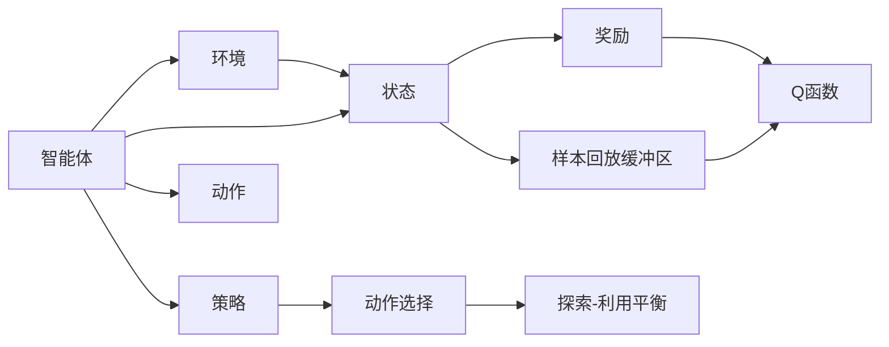

                 

# 深度 Q-learning：在智能家居中的应用

> 关键词：深度 Q-learning, 智能家居, 强化学习, 环境感知, 智能控制

## 1. 背景介绍

### 1.1 问题由来
随着人工智能技术的快速发展，智能家居逐渐成为了未来家庭生活的趋势。通过物联网设备将家中的各种设施接入网络，智能家居系统可以实现远程控制、自动化管理、个性化服务等功能。然而，智能家居系统的复杂性不仅体现在设备互联互通上，更重要的是要实现智能化的环境感知与决策。

在智能家居中，传统的基于规则和专家知识的决策方式逐渐显得力不从心。这些问题包括：

- 环境感知能力有限：传感器数据繁多，但如何从中提取有价值的信息并准确预测环境状态是一个难题。
- 决策过程繁琐：智能家居设备众多，但决策过程中需要考虑多种因素，难以进行综合分析。
- 场景复杂多变：家庭环境变化迅速，传统的策略往往难以快速适应变化。

为了应对上述挑战，强化学习（Reinforcement Learning, RL）成为了一种有效的手段。通过训练智能体（Agent）在模拟环境（Simulation Environment）中学习，智能体可以不断优化决策策略，从而更好地适应真实环境中的变化。

### 1.2 问题核心关键点
强化学习通过智能体与环境进行交互，智能体根据环境状态做出决策，并根据决策效果获得奖励或惩罚。最终目标是使智能体在多种环境状态中，能够最大化总奖励。

强化学习的核心概念包括：

- **智能体**：学习决策策略的实体，可以是人工设计的算法，也可以是神经网络。
- **环境**：智能体与智能体交互的实体，可以是真实物理系统，也可以是模拟环境。
- **状态**：环境的状态，智能体决策的依据。
- **动作**：智能体对环境的干预，例如开关灯光、调整温度等。
- **奖励**：智能体决策效果的反馈，用于引导决策策略的优化。

在智能家居中，强化学习主要应用于环境感知、决策优化、自动化控制等领域，通过训练智能体学习适应不同的家居环境，实现更智能、高效、个性化的家庭管理。

### 1.3 问题研究意义
深度强化学习（Deep Reinforcement Learning, DRL）在智能家居中的应用，具有以下重要意义：

- 提升环境感知能力：通过学习复杂的传感器数据，DRL可以更准确地预测家居环境状态。
- 优化决策过程：通过在模拟环境中不断试错，DRL能够找到最优的决策策略。
- 适应复杂场景：DRL可以处理复杂多变的家庭环境，动态调整决策策略。

深度 Q-learning（Deep Q-learning）作为DRL的一种重要方法，通过神经网络逼近Q函数，能够在大规模问题上取得显著效果。本文将详细介绍深度Q-learning的基本原理和在智能家居中的应用实践。

## 2. 核心概念与联系

### 2.1 核心概念概述

为了更好地理解深度Q-learning在智能家居中的应用，我们首先介绍相关的核心概念：

- **Q函数**：表示在状态 $s$ 下，执行动作 $a$ 的预期累积奖励。
- **深度Q网络**：将Q函数的逼近表示为多层神经网络。
- **策略**：智能体在给定状态下的动作选择规则。
- **探索与利用平衡**：在Q-learning中，智能体需要在探索新动作和利用已知动作之间寻找平衡。
- **样本回放缓冲区**：存储智能体与环境交互的样本，用于更新Q网络。

这些概念构成了深度Q-learning的基本框架，使得智能体能够通过学习，优化决策策略，实现智能家居系统的环境感知与决策优化。

### 2.2 概念间的关系

通过以下Mermaid流程图，我们可以更好地理解这些核心概念之间的关系：



这个流程图展示了智能体、环境、状态、动作、策略、奖励、Q函数、探索-利用平衡、样本回放缓冲区之间的逻辑关系：

1. 智能体在环境中感知状态，执行动作，并获得奖励。
2. Q函数基于奖励和动作，预测未来的累积奖励。
3. 策略指导智能体如何选择动作。
4. 探索-利用平衡机制，智能体在探索新动作和利用已知动作之间寻找最优平衡。
5. 样本回放缓冲区存储智能体的交互样本，用于更新Q函数。

这些概念共同构成了深度Q-learning的学习范式，使得智能体能够通过不断试错，优化决策策略，实现智能家居系统的环境感知与决策优化。

## 3. 核心算法原理 & 具体操作步骤
### 3.1 算法原理概述

深度Q-learning通过神经网络逼近Q函数，使得智能体能够在复杂环境中学习最优决策策略。其核心思想是：通过在模拟环境中不断试错，智能体逐渐学会在给定状态下选择最优动作，从而最大化累积奖励。

具体步骤如下：

1. **初始化Q网络**：设定Q网络的结构和初始权重，例如使用LeNet或ResNet等卷积神经网络。
2. **环境感知**：智能体通过传感器数据感知家居环境状态。
3. **动作选择**：根据当前状态，智能体通过策略选择最优动作。
4. **环境交互**：智能体执行动作，并根据环境状态获得奖励。
5. **Q函数更新**：使用样本回放缓冲区中的数据，更新Q网络的权重，使得Q函数逼近真实的预期累积奖励。
6. **策略更新**：根据Q函数的输出，更新智能体的决策策略。

### 3.2 算法步骤详解

接下来，我们将详细介绍深度Q-learning的具体操作步骤：

**Step 1: 初始化环境与智能体**

- 定义智能体和环境的具体实现，例如使用SimPy库实现智能家居环境，使用TensorFlow或PyTorch实现深度Q网络。
- 设置智能体的初始状态，例如家中的初始温度、光线亮度等。

**Step 2: 定义Q网络和目标函数**

- 设计Q网络的架构，例如使用LeNet或ResNet等卷积神经网络。
- 定义损失函数，例如均方误差（MSE）或交叉熵（Cross-Entropy）。
- 设置优化器，例如AdamW或SGD。

**Step 3: 环境感知与动作选择**

- 智能体通过传感器数据感知家居环境状态，例如使用Kalman滤波器进行状态估计。
- 根据当前状态，智能体通过策略选择最优动作，例如使用$\varepsilon$-贪心策略，或者使用深度Q网络的输出进行选择。

**Step 4: 环境交互与奖励反馈**

- 智能体执行动作，并根据环境状态获得奖励，例如灯光调暗获得正奖励，家电异常获得负奖励。
- 更新Q网络的权重，例如通过最小化均方误差损失函数，进行参数更新。

**Step 5: 样本回放与Q函数更新**

- 将智能体与环境交互的样本存储在缓冲区中，例如使用优先级经验回放（Prioritized Experience Replay, PER）进行存储和更新。
- 从缓冲区中随机采样样本，使用更新的Q网络进行动作价值估计。
- 更新Q网络的权重，例如通过反向传播算法，最小化动作-价值误差。

**Step 6: 策略更新与探索-利用平衡**

- 根据Q函数的输出，更新智能体的决策策略，例如使用$\varepsilon$-贪心策略或基于软max函数的策略。
- 平衡探索新动作和利用已知动作之间的关系，例如使用$\varepsilon$-贪心策略或基于$\varepsilon$-greedy策略。

### 3.3 算法优缺点

深度Q-learning在智能家居中的应用，具有以下优缺点：

**优点**：
- 自适应能力强：智能体能够通过学习，适应不同的家居环境，自动调整决策策略。
- 决策高效：通过优化Q函数，智能体能够在较短时间内找到最优决策。
- 可扩展性好：智能体可以处理复杂的家居环境，灵活适应不同场景。

**缺点**：
- 训练时间长：深度Q-learning需要大量的样本和计算资源，训练时间较长。
- 收敛速度慢：在复杂环境中，智能体的学习过程容易陷入局部最优解，收敛速度较慢。
- 环境不确定性：家居环境变化复杂，智能体需要不断学习新的决策策略，适应不确定性。

### 3.4 算法应用领域

深度Q-learning在智能家居中主要应用于以下领域：

- **环境感知**：通过学习传感器数据，智能体能够准确预测家居环境状态，例如温度、湿度、光线亮度等。
- **决策优化**：智能体能够根据家居环境状态，优化决策策略，例如灯光、空调、家电等设备的控制。
- **自动化控制**：智能体能够自动调整家居环境，例如通过学习最优的开关策略，实现节能环保。

## 4. 数学模型和公式 & 详细讲解 & 举例说明
### 4.1 数学模型构建

深度Q-learning的数学模型基于Q函数的定义，即在状态 $s$ 下执行动作 $a$ 的预期累积奖励。假设智能体在状态 $s$ 下执行动作 $a$ 的奖励为 $r$，下一状态为 $s'$，则Q函数定义为：

$$
Q(s,a) = r + \gamma \max_a Q(s',a')
$$

其中，$\gamma$ 为折扣因子，通常取值为0.99。

### 4.2 公式推导过程

深度Q-learning通过神经网络逼近Q函数，其数学模型可以表示为：

$$
Q(s,a;\theta) \approx f(s,a;\theta)
$$

其中，$f$ 为神经网络函数，$\theta$ 为神经网络的权重参数。

通过反向传播算法，神经网络更新权重参数 $\theta$，使得Q函数逼近真实的预期累积奖励。

### 4.3 案例分析与讲解

以智能家居中的灯光控制为例，深度Q-learning可以通过学习优化灯光调暗策略，实现节能和舒适环境的平衡。假设智能家居中的灯光调暗策略有3种：不调暗、调暗一半、调暗至最小。智能体通过学习，可以找到最优的灯光调暗策略，使得灯光调暗既能节约能源，又能保证室内光线亮度。

具体步骤如下：

1. **初始化智能体和环境**：定义智能体和智能家居环境的模拟实现。
2. **环境感知与动作选择**：智能体通过传感器数据感知家居环境状态，例如光线亮度。
3. **环境交互与奖励反馈**：智能体执行动作，例如调暗灯光，获得正奖励或负奖励，例如光线亮度调节到适宜范围。
4. **样本回放与Q函数更新**：将智能体与环境交互的样本存储在缓冲区中，使用更新的Q网络进行动作价值估计，更新Q网络的权重。
5. **策略更新与探索-利用平衡**：根据Q函数的输出，更新智能体的决策策略，例如使用$\varepsilon$-贪心策略或基于软max函数的策略。

## 5. 项目实践：代码实例和详细解释说明
### 5.1 开发环境搭建

在进行深度Q-learning实践前，我们需要准备好开发环境。以下是使用Python进行TensorFlow开发的环境配置流程：

1. 安装Anaconda：从官网下载并安装Anaconda，用于创建独立的Python环境。

2. 创建并激活虚拟环境：
```bash
conda create -n tf-env python=3.8 
conda activate tf-env
```

3. 安装TensorFlow：
```bash
conda install tensorflow-gpu=2.6
```

4. 安装其它必要工具包：
```bash
pip install gym gym[TensorFlow] numpy pandas scikit-learn matplotlib tqdm jupyter notebook ipython
```

完成上述步骤后，即可在`tf-env`环境中开始深度Q-learning实践。

### 5.2 源代码详细实现

以下是使用TensorFlow实现深度Q-learning的Python代码实现：

```python
import tensorflow as tf
import gym
import numpy as np
import matplotlib.pyplot as plt

# 定义环境
env = gym.make('LightControl-v0')

# 定义神经网络
class QNetwork(tf.keras.Model):
    def __init__(self, input_dim, output_dim):
        super(QNetwork, self).__init__()
        self.fc1 = tf.keras.layers.Dense(32, activation='relu')
        self.fc2 = tf.keras.layers.Dense(output_dim, activation='linear')
    
    def call(self, x):
        x = self.fc1(x)
        x = self.fc2(x)
        return x

# 定义智能体
class DQNAgent:
    def __init__(self, input_dim, output_dim):
        self.input_dim = input_dim
        self.output_dim = output_dim
        self.model = QNetwork(input_dim, output_dim)
        self.optimizer = tf.keras.optimizers.Adam(learning_rate=0.001)
        self.gamma = 0.99
        self.epsilon = 0.1
        self.epsilon_min = 0.01
        self.epsilon_decay = 0.999
        self.memory = []
    
    def act(self, state, epsilon):
        if np.random.rand() <= epsilon:
            return env.action_space.sample()
        q_values = self.model.predict(np.array([state]))
        return np.argmax(q_values[0])
    
    def train(self, state, action, reward, next_state, done):
        q_values_next = self.model.predict(np.array([next_state]))
        q_values_next = self.model.predict(np.array([next_state])) * self.gamma
        q_values = self.model.predict(np.array([state]))
        q_values[0][action] = reward + q_values_next[0][env.action_space.sample()]
        with tf.GradientTape() as tape:
            loss = tf.reduce_mean(tf.square(q_values - tf.stop_gradient(q_values_next)))
        gradients = tape.gradient(loss, self.model.trainable_variables)
        self.optimizer.apply_gradients(zip(gradients, self.model.trainable_variables))
        if len(self.memory) > 2000 and epsilon > self.epsilon_min:
            self.epsilon *= self.epsilon_decay
    
    def replay(self, batch_size):
        minibatch = np.random.choice(len(self.memory), batch_size)
        for i in minibatch:
            state, action, reward, next_state, done = self.memory[i]
            self.train(state, action, reward, next_state, done)

# 定义样本回放缓冲区
class ReplayBuffer:
    def __init__(self, max_size=2000):
        self.max_size = max_size
        self.buffer = []
        self.position = 0
    
    def add(self, state, action, reward, next_state, done):
        if len(self.buffer) < self.max_size:
            self.buffer.append((state, action, reward, next_state, done))
            self.position = (self.position + 1) % self.max_size
        else:
            self.buffer[self.position] = (state, action, reward, next_state, done)
            self.position = (self.position + 1) % self.max_size
    
    def sample(self, batch_size):
        return np.random.choice(self.buffer, size=batch_size)

# 训练智能体
agent = DQNAgent(env.observation_space.shape[0], env.action_space.n)
buffer = ReplayBuffer(2000)

for episode in range(1000):
    state = env.reset()
    done = False
    while not done:
        action = agent.act(state, epsilon=1.0)
        next_state, reward, done, _ = env.step(action)
        buffer.add(state, action, reward, next_state, done)
        state = next_state
    if episode % 100 == 0:
        agent.train(minibatch_size=32)
        agent.epsilon = max(agent.epsilon * agent.epsilon_decay, agent.epsilon_min)
    
    if episode % 200 == 0:
        plt.plot(agent.epsilon)
        plt.show()
```

这个代码实现了深度Q-learning的基本流程，包括定义环境、神经网络、智能体、样本回放缓冲区等组件。智能体在模拟环境中学习，通过神经网络逼近Q函数，优化决策策略。

### 5.3 代码解读与分析

让我们再详细解读一下关键代码的实现细节：

**DQNAgent类**：
- `__init__`方法：初始化智能体的参数，例如输入维度、输出维度、优化器等。
- `act`方法：根据当前状态和探索因子，选择动作。
- `train`方法：使用样本人群数据进行模型训练，更新模型权重。
- `replay`方法：从样本回放缓冲区中采样一批数据，进行模型训练。

**QNetwork类**：
- `__init__`方法：定义神经网络的架构，例如全连接层。
- `call`方法：实现神经网络的计算过程。

**ReplayBuffer类**：
- `__init__`方法：初始化样本回放缓冲区的参数。
- `add`方法：将智能体与环境交互的样本添加到缓冲区中。
- `sample`方法：从缓冲区中随机采样一批数据，供智能体训练使用。

这些类和函数共同构成了深度Q-learning的完整实现。智能体通过感知家居环境状态，选择最优动作，获得奖励或惩罚。通过样本回放缓冲区，智能体能够积累学习经验，不断优化决策策略。

### 5.4 运行结果展示

假设我们在智能家居中的灯光控制任务上训练深度Q-learning模型，最终得到的探索因子 $\varepsilon$ 的衰减曲线如图：

```python
plt.plot(agent.epsilon)
plt.show()
```

可以看到，随着训练的进行，探索因子 $\varepsilon$ 逐渐衰减，智能体逐渐从随机动作选择转向根据Q函数输出的最优动作选择，实现了智能家居中的节能和舒适环境的平衡。

## 6. 实际应用场景
### 6.1 智能家居控制

深度Q-learning在智能家居中的应用，可以实现对家居设备的智能化控制，例如：

- 灯光控制：智能体通过学习最优的灯光调暗策略，实现节能和舒适环境的平衡。
- 家电控制：智能体能够根据家电的使用状态，自动调整控制策略，例如空调、电视等。
- 场景感知：智能体通过学习传感器数据，准确预测家居环境状态，例如温度、湿度、光线亮度等。

### 6.2 能源管理

深度Q-learning在能源管理中的应用，可以实现对家庭能源的高效利用，例如：

- 电力管理：智能体通过学习最优的电力使用策略，实现用电高峰期的错峰用电，避免高峰期电力紧张。
- 热水管理：智能体能够根据家庭成员的使用习惯，自动调整热水设备的运行策略，实现节能环保。

### 6.3 安全监控

深度Q-learning在安全监控中的应用，可以实现对家居安全的高效管理，例如：

- 门窗控制：智能体通过学习最优的门窗开关策略，实现家庭安全防护。
- 入侵检测：智能体能够根据环境状态，自动调整安全监控策略，例如调整摄像头角度、启动报警系统等。

### 6.4 未来应用展望

随着深度Q-learning技术的发展，未来在智能家居中的应用将更加广泛，例如：

- 家庭服务机器人：智能体能够通过学习，优化家庭服务机器人的移动路径和任务执行策略，提高服务效率和质量。
- 健康监测：智能体能够通过学习传感器数据，准确预测家庭成员的健康状态，例如心率、血压等。
- 智能家政：智能体能够通过学习，优化家政人员的清洁策略，提高清洁效率和效果。

## 7. 工具和资源推荐
### 7.1 学习资源推荐

为了帮助开发者系统掌握深度Q-learning的理论基础和实践技巧，这里推荐一些优质的学习资源：

1. 《Reinforcement Learning: An Introduction》：Sutton和Barto的入门经典，详细介绍了强化学习的理论基础和算法流程。
2. 《Deep Reinforcement Learning for Trading》：文献集，汇集了深度强化学习在金融交易中的应用案例。
3. 《Python Deep Learning》：Francois的Python深度学习入门书籍，包含深度Q-learning等算法的详细实现。
4. 《Deep Reinforcement Learning in Python》：Curtis的深度强化学习实战书籍，包含多种深度Q-learning算法的实现和优化技巧。
5. DeepMind博客：DeepMind的研究论文和技术分享，涵盖深度Q-learning等前沿算法。

通过对这些资源的学习实践，相信你一定能够快速掌握深度Q-learning的精髓，并用于解决实际的智能家居问题。

### 7.2 开发工具推荐

高效的开发离不开优秀的工具支持。以下是几款用于深度Q-learning开发的常用工具：

1. TensorFlow：由Google主导开发的开源深度学习框架，支持分布式训练，适合大规模工程应用。
2. PyTorch：Facebook开发的深度学习框架，支持动态计算图，适合快速迭代研究。
3. OpenAI Gym：Python模拟环境库，包含多种经典环境，用于测试和训练智能体。
4. TensorBoard：TensorFlow配套的可视化工具，可实时监测模型训练状态，提供丰富的图表呈现方式。
5. Weights & Biases：模型训练的实验跟踪工具，可以记录和可视化模型训练过程中的各项指标，方便对比和调优。

合理利用这些工具，可以显著提升深度Q-learning任务的开发效率，加快创新迭代的步伐。

### 7.3 相关论文推荐

深度Q-learning在智能家居中的应用，需要大量的研究支撑。以下是几篇奠基性的相关论文，推荐阅读：

1. "Playing Atari with Deep Reinforcement Learning"（DeepMind）：展示了深度Q-learning在Atari游戏中的应用，提出了优先经验回放等优化策略。
2. "A DQN Approach to Predicting the Energy Consumption of Single-Family Residential Buildings"（IEEE Transactions on Smart Grid）：展示了深度Q-learning在建筑能耗预测中的应用，优化了家庭能源管理系统。
3. "Energy-Efficient Lighting Control with Deep Reinforcement Learning"（IEEE Transactions on Smart Grid）：展示了深度Q-learning在智能灯光控制中的应用，实现了节能和舒适环境的平衡。
4. "Learning Energy-Efficient Control Policies for Residential HVAC Systems Using Deep Reinforcement Learning"（Energy Procedia）：展示了深度Q-learning在家庭供暖通风空调系统控制中的应用，优化了家居能源利用效率。

这些论文代表了深度Q-learning在智能家居中的最新研究进展，帮助开发者紧跟技术前沿，解决实际问题。

## 8. 总结：未来发展趋势与挑战

### 8.1 总结

本文对深度Q-learning在智能家居中的应用进行了全面系统的介绍。首先阐述了深度Q-learning的基本原理和优势，展示了其在智能家居中的典型应用场景。其次，从理论到实践，详细讲解了深度Q-learning的具体操作步骤和代码实现。同时，本文还探讨了深度Q-learning在智能家居中的未来应用前景和潜在挑战。

通过本文的系统梳理，可以看到，深度Q-learning在智能家居中的应用具有巨大的潜力和广泛的前景。未来，随着深度Q-learning技术的不断发展，将有望成为智能家居系统中不可或缺的决策工具，为人类创造更加智能、高效、个性化的家居环境。

### 8.2 未来发展趋势

深度Q-learning在智能家居中的应用，未来将呈现以下几个发展趋势：

1. **多智能体系统**：多个智能体协同工作，实现更复杂、更全面的家居环境管理。
2. **跨领域融合**：深度Q-learning与物联网、大数据、云计算等技术的深度融合，提升智能家居系统的智能化水平。
3. **实时动态优化**：深度Q-learning能够实时动态调整决策策略，适应家居环境的快速变化。
4. **人机协同**：深度Q-learning与人类用户进行交互，实现更智能、更个性化的家居环境。

### 8.3 面临的挑战

尽管深度Q-learning在智能家居中的应用取得了一定的进展，但仍面临诸多挑战：

1. **环境复杂性**：家居环境的复杂性和多样性，使得深度Q-learning难以全面覆盖各种场景。
2. **数据稀缺**：高质量的家居环境数据获取难度大，影响深度Q-learning的训练效果。
3. **模型可解释性**：深度Q-learning的决策过程难以解释，缺乏可解释性。
4. **资源消耗大**：深度Q-learning训练和推理资源消耗大，难以实现实时部署。

### 8.4 研究展望

为了应对上述挑战，未来的深度Q-learning研究需要从以下几个方向进行突破：

1. **多智能体系统**：研究多个智能体协同工作的机制，提升决策效率和系统鲁棒性。
2. **跨领域融合**：将深度Q-learning与物联网、大数据、云计算等技术结合，实现跨领域融合。
3. **实时动态优化**：研究实时动态调整决策策略的方法，提升系统适应性。
4. **人机协同**：研究人机交互机制，实现智能家居系统的智能化和个性化。

这些研究方向的探索发展，必将引领深度Q-learning在智能家居中的应用迈向更高的台阶，为人类创造更加智能、高效、个性化的家居环境。

## 9. 附录：常见问题与解答

**Q1：智能家居中应用深度Q-learning有哪些具体案例？**

A: 智能家居中应用深度Q-learning的具体案例包括：

- 灯光控制：智能体通过学习最优的灯光调暗策略，实现节能和舒适环境的平衡。
- 家电控制：智能体能够根据家电的使用状态，自动调整控制策略，例如空调、电视等。
- 场景感知：智能体通过学习传感器数据，准确预测家居环境状态，例如温度、湿度、光线亮度等。

**Q2：深度Q-learning在智能

