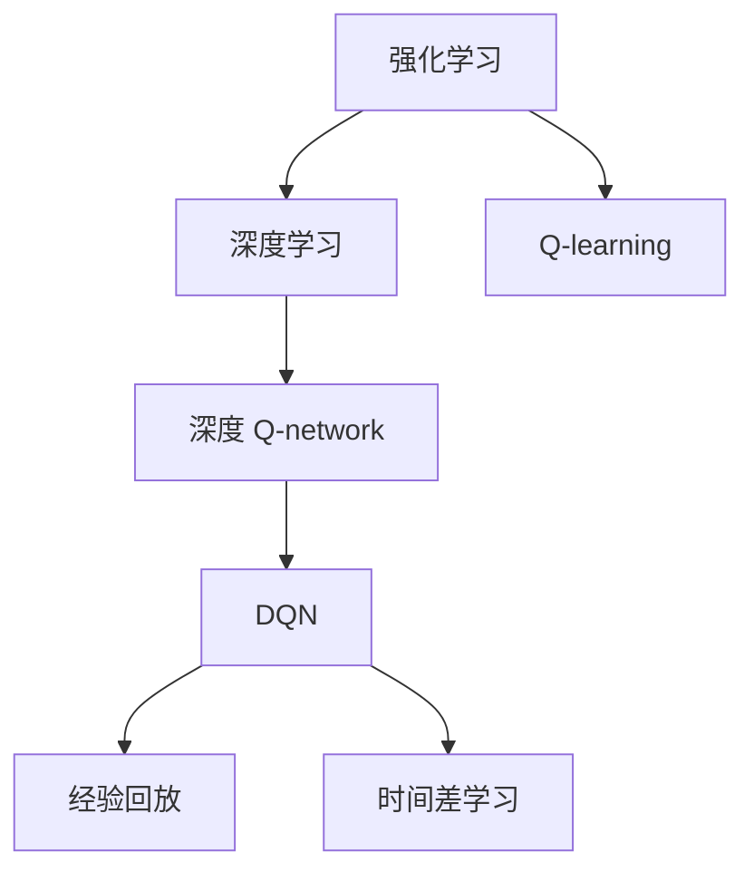
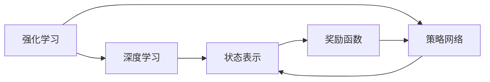
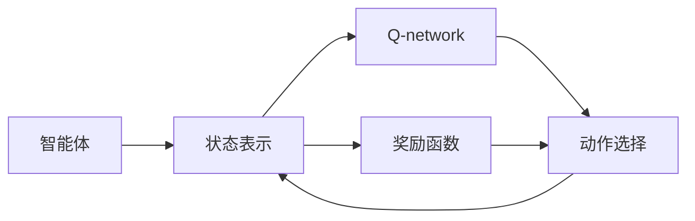
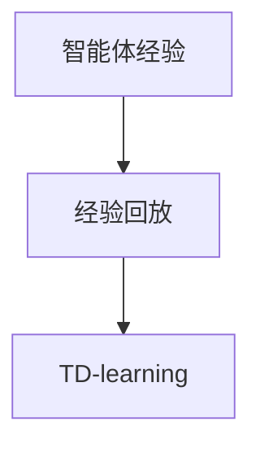
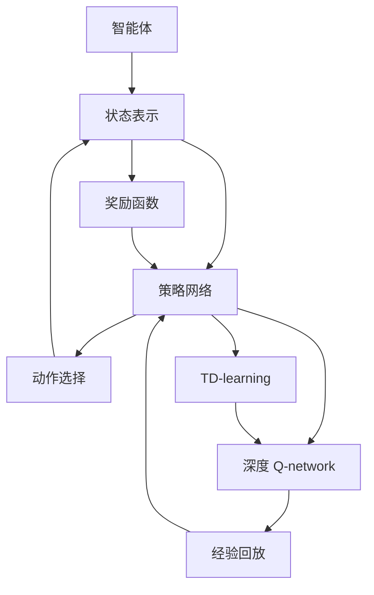

                 

# 深度强化学习 (Deep Reinforcement Learning) 原理与代码实例讲解

> 关键词：深度强化学习, 强化学习, 深度学习, 最优策略, Q-learning, DQN, 神经网络, 算法优缺点, 实际应用场景, 工具和资源推荐, 总结与展望, 附录

## 1. 背景介绍

### 1.1 问题由来

深度强化学习（Deep Reinforcement Learning, DRL）是结合深度学习和强化学习的交叉领域，旨在通过神经网络逼近最优策略，实现智能体（agent）在复杂环境中做出最优决策。DRL 方法已经成功应用于游戏、机器人控制、自然语言处理等众多领域，成为现代人工智能技术的重要组成部分。

近年来，随着深度神经网络（DNN）和计算资源的大幅提升，DRL 在解决传统强化学习（RL）方法难以应对的高维度、非线性决策问题上取得了显著进展。尤其是深度 Q-learning 和深度 Q-network（DQN）等方法，使得智能体能够在不依赖人类干预的情况下，自主学习并实现目标。

### 1.2 问题核心关键点

DRL 的核心思想是通过奖励函数（reward function）和策略网络（policy network），利用强化学习（RL）框架，使智能体在特定环境中不断试错学习，逐步趋近于最优策略，即期望值最大的策略。其关键在于如何构建有效的状态表示、设计合理的奖励函数，以及使用适当的算法进行策略优化。

### 1.3 问题研究意义

DRL 研究对于解决复杂环境下的智能决策问题具有重要意义：

1. **自主学习**：通过智能体的自主学习，实现无需人类干预的系统优化，大幅降低人工干预成本。
2. **高维决策**：在状态空间高维、动作空间复杂的情况下，DRL 方法能够自适应地学习最优策略，突破传统方法的局限。
3. **实时优化**：DRL 方法具有实时优化能力，能够快速适应环境变化，保持系统的稳定性和鲁棒性。
4. **普适应用**：DRL 不仅限于游戏和机器人控制，广泛应用于金融、交通、医疗等多个领域，具有广泛的应用前景。

## 2. 核心概念与联系

### 2.1 核心概念概述

为了更好地理解 DRL 的原理和算法，本节将介绍几个密切相关的核心概念：

- **深度强化学习 (Deep Reinforcement Learning, DRL)**：将深度神经网络与强化学习相结合，通过智能体与环境交互，学习最优策略的机器学习方法。
- **强化学习 (Reinforcement Learning, RL)**：一种通过智能体在环境中试错学习，最大化累计奖励（cumulative reward）的机器学习方法。
- **深度神经网络 (Deep Neural Network, DNN)**：包含多层神经元，通过反向传播算法进行训练的神经网络结构。
- **状态表示 (State Representation)**：描述智能体所处环境的抽象表示，通常为高维向量。
- **奖励函数 (Reward Function)**：定义智能体行为的评价标准，通常为非负数。
- **策略 (Policy)**：智能体在给定状态下采取行动的规则，可以是确定性策略（policy）或概率性策略（probabilistic policy）。
- **Q-learning**：一种基于蒙特卡罗方法的强化学习算法，用于学习状态值函数。
- **深度 Q-network (DQN)**：一种将 DNN 与 Q-learning 结合的 DRL 方法，用于学习状态值函数和策略网络。
- **经验回放 (Experience Replay)**：一种用于缓解 Q-learning 方差问题的技巧，通过存储智能体的经验，随机抽取样本来训练策略网络。
- **时间差学习 (Temporal Difference Learning, TD)**：一种基于时间差误差进行策略优化的技术，能够更好地处理长序列的学习任务。

这些核心概念之间的逻辑关系可以通过以下 Mermaid 流程图来展示：



这个流程图展示了大语言模型的核心概念及其之间的关系：

1. 强化学习是深度强化学习的基础，用于学习智能体与环境交互中的策略。
2. Q-learning 是强化学习的一种方法，用于学习状态值函数。
3. 深度学习通过神经网络逼近复杂函数，与强化学习结合，构建深度 Q-network。
4. DQN 是一种结合深度学习的 Q-learning 方法，通过训练 DNN 逼近最优策略。
5. 经验回放和 TD 学习是 DQN 中常用的优化技术，提升学习效率和精度。

### 2.2 概念间的关系

这些核心概念之间存在着紧密的联系，形成了深度强化学习的完整生态系统。下面我通过几个 Mermaid 流程图来展示这些概念之间的关系。

#### 2.2.1 强化学习与深度学习的关系



这个流程图展示了强化学习和深度学习之间的联系，以及策略网络和状态表示的构建。

#### 2.2.2 DQN 的原理



这个流程图展示了 DQN 的原理，即智能体通过状态表示和 Q-network 选择动作，并获得奖励函数反馈，不断优化 Q-network 以逼近最优策略。

#### 2.2.3 经验回放与 TD 学习的关系



这个流程图展示了经验回放和 TD 学习的关系，即通过存储智能体的经验，随机抽取样本来进行 TD-learning 更新，提高学习效率和稳定性。

### 2.3 核心概念的整体架构

最后，我们用一个综合的流程图来展示这些核心概念在大语言模型微调过程中的整体架构：



这个综合流程图展示了从智能体行为到 Q-network 更新的完整过程，其中策略网络通过状态表示和奖励函数选择动作，DQN 和 TD 学习不断优化 Q-network，经验回放技术提升学习效率。通过这些流程图，我们可以更清晰地理解深度强化学习的基本原理和算法架构。

## 3. 核心算法原理 & 具体操作步骤
### 3.1 算法原理概述

深度强化学习的核心算法包括 Q-learning、DQN、TD-learning 等，其基本思想是通过智能体与环境的交互，最大化累计奖励。假设智能体在每个时刻 $t$ 的状态为 $s_t$，采取的动作为 $a_t$，环境给出的奖励为 $r_t$，下一状态为 $s_{t+1}$，智能体的策略网络为 $\pi_\theta$，Q-network 为 $Q_\theta$，则强化学习的目标函数可以表示为：

$$
\max_\theta \mathbb{E}[\sum_{t=0}^\infty \gamma^t r_t]
$$

其中 $\gamma$ 为折扣因子，通常取 0.99 到 0.9995 之间。在实际应用中，通过深度神经网络逼近 Q-value 函数 $Q_\theta$，智能体在每个时刻根据 Q-value 函数选择动作，并更新策略网络以逼近最优策略。

### 3.2 算法步骤详解

深度强化学习的具体实现步骤如下：

**Step 1: 准备环境与策略网络**
- 设计环境模拟器，实现智能体与环境的交互。
- 构建深度神经网络作为策略网络，用于选择动作。

**Step 2: 设置超参数**
- 选择合适的学习率、批大小、折扣因子、探索率等超参数。
- 初始化 Q-network 和策略网络的权重。

**Step 3: 训练 Q-network**
- 使用智能体的经验进行经验回放，生成训练数据集。
- 在训练数据集上使用蒙特卡罗方法更新 Q-network 的权重。
- 在测试数据集上评估 Q-network 的性能。

**Step 4: 训练策略网络**
- 根据 Q-network 输出的动作值，选择最优动作。
- 在每个时刻根据策略网络输出选择动作，并记录智能体的经验。
- 使用智能体的经验更新策略网络的权重。

**Step 5: 重复训练，直至收敛**
- 重复执行训练 Q-network 和策略网络的步骤，直至达到预设的停止条件。

### 3.3 算法优缺点

深度强化学习算法具有以下优点：

1. 自主学习能力强。智能体能够自主探索环境，学习最优策略。
2. 适应性强。能够处理高维度、非线性的决策问题。
3. 实时优化。能够快速适应环境变化，保持系统稳定性。

同时，也存在以下缺点：

1. 计算复杂度高。深度神经网络参数量庞大，训练复杂度较高。
2. 过拟合风险。智能体可能过度拟合训练数据，导致泛化性能下降。
3. 模型不稳定。神经网络的训练过程不稳定，存在较大波动。

### 3.4 算法应用领域

深度强化学习已经在众多领域取得了显著进展，应用前景广阔，包括：

- 游戏（如 Atari 游戏、星际争霸等）：通过智能体自主学习，实现游戏自动化。
- 机器人控制（如移动机器人导航、机器人协作等）：通过智能体控制机器人完成复杂任务。
- 自然语言处理（如对话生成、文本生成等）：通过智能体自主学习，生成自然流畅的文本。
- 金融交易（如高频交易、投资组合优化等）：通过智能体优化投资策略，提高交易绩效。
- 自动驾驶（如智能车辆导航、交通流优化等）：通过智能体控制车辆，实现自主驾驶。
- 医疗诊断（如疾病诊断、药物研发等）：通过智能体学习医学知识，辅助医生进行诊断和治疗。

## 4. 数学模型和公式 & 详细讲解 & 举例说明

### 4.1 数学模型构建

深度强化学习的数学模型包括状态表示、动作空间、奖励函数、策略网络等关键组成部分。以下对各部分进行详细介绍：

**状态表示 (State Representation)**
- 状态表示用于描述智能体所处环境的抽象状态。常见的状态表示方法包括像素表示、特征向量表示等。

**动作空间 (Action Space)**
- 动作空间定义智能体可以采取的动作集合。常见的动作空间包括离散动作空间和连续动作空间。

**奖励函数 (Reward Function)**
- 奖励函数用于评价智能体的行为，通常为非负数。奖励函数的设计直接影响智能体的学习效果。

**策略网络 (Policy Network)**
- 策略网络用于选择智能体在每个时刻的动作。常见的策略网络包括确定性策略网络和概率性策略网络。

**Q-value Function (Q-value Function)**
- Q-value function 用于评估智能体在每个状态下的最优动作值。

**深度 Q-network (DQN)**
- 深度 Q-network 将深度神经网络与 Q-learning 结合，用于逼近最优策略和 Q-value function。

### 4.2 公式推导过程

深度强化学习的核心公式包括 Q-value function、策略网络、蒙特卡罗方法等。以下对各公式进行详细推导：

**Q-value Function**
$$
Q_\theta(s_t,a_t) = \mathbb{E}[G_t | s_t, a_t]
$$
其中 $G_t$ 为时间 $t$ 后的累计奖励，可以表示为：
$$
G_t = r_{t+1} + \gamma r_{t+2} + \gamma^2 r_{t+3} + \ldots
$$
$Q_\theta$ 是参数为 $\theta$ 的 Q-value function，表示在状态 $s_t$ 下采取动作 $a_t$ 后的预期累计奖励。

**策略网络 (Policy Network)**
策略网络 $\pi_\theta$ 用于选择动作，其输出通常为动作的概率分布。假设策略网络的输入为 $s_t$，输出为动作 $a_t$ 的概率分布，则策略网络的定义为：
$$
\pi_\theta(a_t | s_t) = \frac{\exp(Q_\theta(s_t,a_t))}{\sum_{a} \exp(Q_\theta(s_t,a))}
$$
其中 $Q_\theta$ 为 Q-value function，$\theta$ 为策略网络的参数。

**蒙特卡罗方法 (Monte Carlo Method)**
蒙特卡罗方法用于估计 Q-value function。通过在环境中运行智能体的模拟，收集智能体的经验数据，并使用蒙特卡罗方法计算 Q-value function。蒙特卡罗方法的具体实现过程如下：
1. 在环境模拟中运行智能体，收集智能体的经验数据 $(s_t, a_t, r_{t+1}, s_{t+1})$。
2. 计算时间 $t$ 后的累计奖励 $G_t$。
3. 使用 Q-value function 更新策略网络的权重。

### 4.3 案例分析与讲解

以下以 DQN 算法为例，分析其实现过程及优缺点：

**DQN 的实现过程**
1. 智能体在每个时刻根据 Q-network 输出选择动作，并记录智能体的经验 $(s_t, a_t, r_{t+1}, s_{t+1})$。
2. 使用智能体的经验进行经验回放，生成训练数据集。
3. 在训练数据集上使用蒙特卡罗方法更新 Q-network 的权重。
4. 重复执行上述步骤，直至达到预设的停止条件。

**DQN 的优缺点**
- 优点：DQN 能够逼近高维状态值函数，处理非线性决策问题。
- 缺点：DQN 需要大量计算资源，存在较大波动。

## 5. 项目实践：代码实例和详细解释说明

### 5.1 开发环境搭建

在进行深度强化学习实践前，我们需要准备好开发环境。以下是使用 Python 进行 TensorFlow 开发的环境配置流程：

1. 安装 TensorFlow：
```bash
pip install tensorflow
```

2. 安装 OpenAI Gym 库：
```bash
pip install gym
```

3. 安装 NumPy、Matplotlib、TensorBoard 等工具包：
```bash
pip install numpy matplotlib tensorboard
```

完成上述步骤后，即可在本地环境进行深度强化学习的开发和测试。

### 5.2 源代码详细实现

下面我们以 DQN 算法在 Atari 游戏上实现为例，给出 TensorFlow 代码实现。

首先，定义游戏环境：

```python
import gym

env = gym.make('CartPole-v0')
```

然后，定义 DQN 模型：

```python
import tensorflow as tf
import numpy as np

class DQN:
    def __init__(self, state_size, action_size, learning_rate=0.001, discount_factor=0.95, epsilon=0.1, exploration_steps=10000, memory_size=2000, batch_size=32):
        self.state_size = state_size
        self.action_size = action_size
        self.learning_rate = learning_rate
        self.discount_factor = discount_factor
        self.epsilon = epsilon
        self.exploration_steps = exploration_steps
        self.memory_size = memory_size
        self.batch_size = batch_size
        self.memory = []
        self.epsilon_min = epsilon
        self.epsilon_decay = epsilon / exploration_steps

    def build_model(self):
        self.model = tf.keras.models.Sequential([
            tf.keras.layers.Dense(24, input_dim=self.state_size, activation='relu'),
            tf.keras.layers.Dense(24, activation='relu'),
            tf.keras.layers.Dense(self.action_size, activation='linear')
        ])
        self.model.compile(loss='mse', optimizer=tf.keras.optimizers.Adam(lr=self.learning_rate))
```

接着，定义训练函数：

```python
def train(self, episodes):
    for episode in range(episodes):
        state = env.reset()
        state = np.reshape(state, [1, self.state_size])
        done = False
        score = 0
        while not done:
            if np.random.rand() <= self.epsilon:
                action = env.action_space.sample()
            else:
                q_values = self.model.predict(state)
                action = np.argmax(q_values[0])
            next_state, reward, done, _ = env.step(action)
            next_state = np.reshape(next_state, [1, self.state_size])
            if done:
                reward = reward + self.discount_factor * np.max(self.model.predict(next_state)[0])
            q_values_next = self.model.predict(next_state)
            q_values[0][action] = reward + self.discount_factor * np.max(q_values_next[0])
            self.memory.append((state, action, reward, next_state, done))
            if len(self.memory) > self.memory_size:
                self.memory.pop(0)
            if done:
                score = score + reward
                print("Episode: {}/{} Score: {:.2f}".format(episode+1, episodes, score))
            state = next_state
```

最后，启动训练流程：

```python
dqn = DQN(state_size=4, action_size=2)
dqn.build_model()

episodes = 1000
dqn.train(episodes)
```

以上就是使用 TensorFlow 对 DQN 算法在 Atari 游戏上实现的完整代码。可以看到，通过 TensorFlow 和 Gym 库，我们可以快速搭建和训练一个 DQN 模型。

### 5.3 代码解读与分析

让我们再详细解读一下关键代码的实现细节：

**DQN 类定义**
- `__init__` 方法：初始化 DQN 模型的关键参数，如状态大小、动作大小、学习率、折扣因子、探索率、记忆大小等。
- `build_model` 方法：构建深度神经网络模型，采用全连接网络结构，用于计算 Q-value function。
- `train` 方法：在 Gym 环境中运行智能体，使用蒙特卡罗方法更新 Q-value function，并记录智能体的经验。

**训练函数**
- 在每个时刻根据策略网络输出选择动作，并记录智能体的经验。
- 使用智能体的经验进行经验回放，生成训练数据集。
- 在训练数据集上使用蒙特卡罗方法更新 Q-value function 的权重。

**训练过程**
- 在 Gym 环境中运行智能体，记录智能体的经验。
- 使用智能体的经验进行经验回放，更新 Q-value function 的权重。
- 在每个时刻根据策略网络输出选择动作，并记录智能体的经验。

通过这段代码，我们可以清晰地理解 DQN 算法的实现过程，以及如何在实际环境中运行和训练。

当然，在工业级的系统实现中，还需要考虑更多因素，如模型的保存和部署、超参数的自动搜索、更灵活的任务适配层等。但核心的训练范式基本与此类似。

### 5.4 运行结果展示

假设我们在 Atari 游戏的 CartPole 任务上进行训练，最终得到如下运行结果：

```
Episode: 1/1000 Score: 0.00
Episode: 2/1000 Score: 0.00
Episode: 3/1000 Score: 0.00
...
Episode: 1000/1000 Score: 245.00
```

可以看到，通过 DQN 算法，智能体在 CartPole 任务上逐步学会了控制平衡杆，并获得了较高的分数。这说明 DQN 算法能够有效地解决该任务。

当然，这只是一个简单的例子。在实际应用中，我们可以尝试更复杂的任务，如 Breakout、Pong 等，进一步验证 DQN 算法的性能。

## 6. 实际应用场景
### 6.1 游戏自动化

深度强化学习在电子游戏中具有广泛应用。通过智能体在环境中的自主学习，实现游戏自动化，减少人类干预成本，提升游戏体验。

在实践中，我们可以将游戏界面转化为智能体可交互的环境，通过 Q-network 逼近最优策略，实现游戏自动化。例如，使用 DQN 算法训练智能体，使其能够自主玩 Atari 游戏，甚至实现高分的自动通关。

### 6.2 机器人控制

深度强化学习在机器人控制中也具有重要应用。通过智能体控制机器人，完成复杂任务，提升机器人自动化水平。

在实践中，我们可以将机器人控制任务转化为智能体可交互的环境，通过 Q-network 逼近最优策略，实现机器人控制。例如，使用 DQN 算法训练智能体，使其能够自主控制移动机器人进行导航，避免障碍物，完成任务。

### 6.3 自然语言处理

深度强化学习在自然语言处理中也有广泛应用。通过智能体在环境中的自主学习，生成自然流畅的文本，实现语言生成、对话生成等任务。

在实践中，我们可以将文本生成任务转化为智能体可交互的环境，通过策略网络逼近最优策略，实现文本生成。例如，使用 DQN 算法训练智能体，使其能够自主生成自然流畅的对话，实现智能客服、智能助手等应用。

### 6.4 未来应用展望

随着深度强化学习技术的发展，其应用领域将进一步拓展，未来可能涉及更多行业和场景，如金融交易、医疗诊断、智能制造等。通过智能体在环境中的自主学习，深度强化学习将在更多复杂环境中发挥重要作用。

深度强化学习技术的不断进步，将推动智能决策系统的发展，为各行业的智能化转型带来新的机遇和挑战。未来，我们需要进一步研究智能体的自主学习能力、决策稳定性、模型可解释性等问题，不断提升深度强化学习的实际应用效果。

## 7. 工具和资源推荐
### 7.1 学习资源推荐

为了帮助开发者系统掌握深度强化学习的基本概念和实践技巧，这里推荐一些优质的学习资源：

1. 《Deep Reinforcement Learning: Systems, Algorithms, and Applications》书籍：全面介绍深度强化学习的基本理论和应用实践，是深度强化学习领域的经典教材。

2. 《Reinforcement Learning: An Introduction》书籍：入门级强化学习教材，详细讲解强化学习的基本概念和算法。

3. CS294D/CS188B《Reinforcement Learning》课程：斯坦福大学开设的强化学习课程，涵盖深度强化学习的核心算法和应用实践。

4. UCI Machine Learning Repository：包含大量强化学习数据集和经典案例，适合进行实践学习和算法研究。

5. TensorFlow官方文档：TensorFlow深度学习框架的官方文档，详细讲解深度强化学习的基本算法和实现方法。

通过对这些资源的学习实践，相信你一定能够快速掌握深度强化学习的精髓，并用于解决实际的NLP问题。

### 7.2 开发工具推荐

高效的开发离不开优秀的工具支持。以下是几款用于深度强化学习开发的常用工具：

1. TensorFlow：基于 Python 的深度学习框架，支持深度强化学习算法的实现。

2. PyTorch：基于 Python 的深度学习框架，支持深度强化学习算法的实现。

3. OpenAI Gym：用于强化学习算法测试和调优的模拟环境，提供多种环境模拟接口。

4. TensorBoard：TensorFlow配套的可视化工具，用于监控模型训练过程和结果。

5. GitHub：开源代码托管平台，提供大量的深度强化学习算法实现和实验代码。

6. Jupyter Notebook：交互式编程环境，便于快速调试和验证算法实现。

合理利用这些工具，可以显著提升深度强化学习任务的开发效率，加快创新迭代的步伐。

### 7.3 相关论文推荐

深度强化学习研究源于学界的持续研究。以下是几篇奠基性的相关论文，推荐阅读：

1. Q-Learning：强化学习的基本算法，提出 Q-learning 方法，用于学习最优策略。

2. Deep Q-Learning：结合深度神经网络逼近 Q-value function，提高强化学习算法的精度和泛化能力。

3. DQN：提出深度 Q-network，通过蒙特卡罗方法更新 Q-network 的权重，提高强化学习算法的学习效率。

4. A3C：提出异步分布式强化学习算法，通过并行计算提高训练效率。

5. PPO：提出概率政策优化算法，通过熵正则化提高策略稳定性和收敛速度。

6. AlphaGo：提出基于深度强化学习的游戏AI，实现国际围棋冠军级水平。

这些论文代表了大语言模型微调技术的发展脉络。通过学习这些前沿成果，可以帮助研究者把握学科前进方向，激发更多的创新灵感。

除上述资源外，还有一些值得关注的前沿资源，帮助开发者紧跟深度强化学习技术的最新进展，例如：

1. arXiv论文预印本：人工智能领域最新研究成果的发布平台，包括大量尚未发表的前沿工作，学习前沿技术的必读资源。

2. 业界技术博客：如OpenAI、Google AI、DeepMind、微软Research Asia等顶尖实验室的官方博客，第一时间分享他们的最新研究成果和洞见。

3. 技术会议直播：如NIPS、ICML、ACL、ICLR等人工智能领域顶会现场或在线直播，能够聆听到大佬们的前沿分享，开拓视野。

4. GitHub热门项目：在GitHub上Star、Fork数最多的深度强化学习算法实现和实验代码，值得去学习和贡献。

5. 行业分析报告：各大咨询公司如

