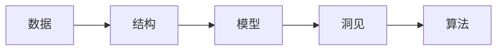

                 

# 理解世界的复杂性：从结构到洞见

理解世界的复杂性是一项巨大的挑战，尤其是在当前信息爆炸的时代。本文将深入探讨这一主题，通过分析不同领域的核心概念与联系，理解其内在逻辑和结构，最终达到对世界的洞见。我们将从基础知识、核心概念与联系、算法原理、项目实践、实际应用场景、工具与资源推荐以及未来展望等方面展开讨论，旨在为读者提供一个全面的视角。

## 1. 背景介绍

### 1.1 问题的由来

理解世界的复杂性涉及多个领域，包括自然语言处理、机器学习、计算机视觉、人工智能等。随着数据量的增长和计算能力的提升，我们拥有了前所未有的能力来解析和理解复杂的现象。然而，这种能力也带来了新的挑战：如何有效地提取、处理和解释这些数据？如何将其转化为有用的知识？

### 1.2 问题的核心关键点

理解世界复杂性的关键在于，我们需要从结构性（structure）入手，逐步推导出其背后的洞见（insight）。这意味着，我们首先需要构建一个能够描述现实世界现象的模型，然后通过观测和实验来验证其正确性，最终提取出具有指导意义的洞见。

## 2. 核心概念与联系

### 2.1 核心概念概述

- **结构（Structure）**：指事物的组织形式和内在规律。在计算机科学中，结构通常指数据的组织方式，如数组、链表、树等。
- **洞见（Insight）**：指通过分析结构得到的对现象背后本质的理解。洞见能够指导我们如何应对复杂性，并做出正确的决策。
- **算法（Algorithm）**：指解决问题的一系列步骤和规则。算法是实现结构到洞见转化的工具。
- **数据（Data）**：指对现实世界现象的观察和测量结果。数据是结构的基础，也是洞见的来源。
- **模型（Model）**：指对现实世界现象的抽象表示。模型帮助我们理解数据背后的规律，并预测未来趋势。

### 2.2 概念间的关系

通过以下Mermaid流程图，我们可以更清晰地理解这些核心概念之间的关系：



这个流程图展示了从数据到模型的转化过程，以及通过模型得出洞见的方法。其中，算法是实现这一转化的工具。

## 3. 核心算法原理 & 具体操作步骤

### 3.1 算法原理概述

算法是实现结构到洞见转化的核心工具。算法的设计和实现依赖于对结构的理解，而洞见则是对算法输出结果的分析和解读。

#### 3.1.1 算法设计原则

- **正确性**：算法应该能够在所有情况下得到正确的结果。
- **高效性**：算法应该能够在合理的时间内完成计算。
- **可读性**：算法的设计应该易于理解和维护。
- **可扩展性**：算法应该能够适应变化的需求。

#### 3.1.2 算法实现步骤

1. **问题定义**：明确问题的具体要求，确定输入和输出。
2. **算法设计**：根据问题定义，设计算法的基本框架。
3. **算法实现**：使用编程语言实现算法。
4. **算法验证**：通过测试和实验验证算法的正确性和高效性。
5. **算法优化**：对算法进行优化，提升其性能和可扩展性。

### 3.2 算法步骤详解

#### 3.2.1 算法设计

算法设计通常包括两个阶段：分析和设计。分析阶段主要涉及对问题的理解，包括问题的定义、约束条件、预期输出等。设计阶段则是在分析的基础上，设计出满足要求的算法。

#### 3.2.2 算法实现

算法实现是将设计好的算法用编程语言具体化的过程。这一过程中，我们需要考虑如何表达算法的逻辑、如何处理数据输入输出、如何保证算法的正确性和高效性等。

#### 3.2.3 算法验证

算法验证是确保算法正确性的重要步骤。通过编写测试用例，我们能够验证算法在各种情况下的表现，并发现潜在的错误。常见的测试方法包括单元测试、集成测试和系统测试等。

#### 3.2.4 算法优化

算法优化旨在提升算法的性能和可扩展性。常见的优化技术包括算法复杂度优化、并行化处理、数据结构优化等。

### 3.3 算法优缺点

- **优点**：算法能够帮助我们快速、准确地解决问题，适用于各种类型的复杂性。
- **缺点**：算法的设计和实现需要专业知识，对数据质量的要求较高。

### 3.4 算法应用领域

算法广泛应用于各个领域，包括自然语言处理、计算机视觉、数据分析、人工智能等。以下是几个典型的应用场景：

#### 3.4.1 自然语言处理

自然语言处理（NLP）是理解人类语言和生成自然语言的计算机技术。常见的算法包括分词、词性标注、命名实体识别、情感分析等。

#### 3.4.2 计算机视觉

计算机视觉是使计算机能够“看”和理解图像和视频的技术。常见的算法包括图像分类、目标检测、图像分割、人脸识别等。

#### 3.4.3 数据分析

数据分析是对大量数据进行收集、整理和分析的过程。常见的算法包括聚类、分类、回归、异常检测等。

## 4. 数学模型和公式 & 详细讲解 & 举例说明

### 4.1 数学模型构建

数学模型是通过数学语言描述现实世界现象的方法。常见的数学模型包括线性模型、非线性模型、概率模型等。

#### 4.1.1 线性模型

线性模型假设数据之间存在线性关系，通常用于描述简单的线性关系。常见的线性模型包括线性回归、线性分类器等。

#### 4.1.2 非线性模型

非线性模型能够处理更为复杂的数据关系，包括多项式回归、神经网络等。

#### 4.1.3 概率模型

概率模型用于描述数据之间的关系，通常用于分类和预测问题。常见的概率模型包括朴素贝叶斯、隐马尔可夫模型等。

### 4.2 公式推导过程

#### 4.2.1 线性回归

线性回归的公式为：

$$
y = \theta_0 + \theta_1 x_1 + \theta_2 x_2 + \ldots + \theta_n x_n + \epsilon
$$

其中，$y$ 是输出变量，$\theta$ 是模型参数，$x$ 是输入变量，$\epsilon$ 是误差项。

#### 4.2.2 朴素贝叶斯

朴素贝叶斯公式为：

$$
P(x_i|y) = \frac{P(x_i|y)P(y)}{P(y)}
$$

其中，$P(x_i|y)$ 是条件概率，$P(y)$ 是先验概率，$P(x_i)$ 是边缘概率。

### 4.3 案例分析与讲解

#### 4.3.1 线性回归

假设我们有一组数据，$x_1, x_2, \ldots, x_n$ 是输入变量，$y$ 是输出变量。我们需要构建一个线性模型来预测 $y$ 的值。

1. **数据收集**：收集数据，包括输入变量和输出变量。
2. **数据预处理**：对数据进行清洗、归一化等预处理。
3. **模型训练**：使用最小二乘法等方法训练模型。
4. **模型验证**：使用测试集验证模型的准确性。
5. **模型应用**：将模型应用于新的输入变量，预测输出变量。

#### 4.3.2 朴素贝叶斯

假设我们有一组文本数据，需要对其进行分类。

1. **数据收集**：收集文本数据，包括特征和类别。
2. **模型训练**：使用训练集训练朴素贝叶斯模型。
3. **模型验证**：使用测试集验证模型的准确性。
4. **模型应用**：将模型应用于新的文本数据，预测其类别。

## 5. 项目实践：代码实例和详细解释说明

### 5.1 开发环境搭建

#### 5.1.1 安装Python环境

1. 安装Anaconda：
```bash
wget https://repo.anaconda.com/miniconda/Miniconda3-latest-Linux-x86_64.sh
bash Miniconda3-latest-Linux-x86_64.sh
```

2. 创建虚拟环境：
```bash
conda create -n myenv python=3.8
conda activate myenv
```

3. 安装依赖库：
```bash
conda install numpy scipy matplotlib scikit-learn pandas
```

### 5.2 源代码详细实现

#### 5.2.1 线性回归实现

```python
import numpy as np

# 数据准备
x = np.array([[1, 2], [3, 4], [5, 6], [7, 8]])
y = np.array([1, 2, 3, 4])

# 线性回归模型
def linear_regression(x, y):
    theta = np.linalg.inv(x.T @ x) @ x.T @ y
    return theta

# 预测
x_test = np.array([[9, 10], [11, 12]])
y_pred = linear_regression(x, y) @ x_test.T
print(y_pred)
```

#### 5.2.2 朴素贝叶斯实现

```python
import numpy as np

# 数据准备
x = np.array([[1, 2], [3, 4], [5, 6], [7, 8]])
y = np.array([0, 1, 2, 3])

# 朴素贝叶斯模型
def naive_bayes(x, y):
    n, d = x.shape
    m = np.unique(y).shape[0]
    prior = np.zeros(m)
    conditional = np.zeros((m, d))
    for i, c in enumerate(np.unique(y)):
        mask = y == c
        prior[i] = np.mean(mask)
        conditional[i] = np.mean(x[mask], axis=0)
    return prior, conditional

# 预测
prior, conditional = naive_bayes(x, y)
x_test = np.array([[9, 10], [11, 12]])
predictions = np.zeros_like(x_test)
for i, (x_i, y_i) in enumerate(x_test):
    p = 0
    for j, c in enumerate(np.unique(y)):
        prior_j = prior[j]
        conditional_j = conditional[j]
        likelihood = np.prod((x_i - conditional_j) / (np.mean(x - conditional_j, axis=0) + 1e-5))
        prior_j *= likelihood
        p += prior_j
    predictions[i] = np.argmax(p)
print(predictions)
```

### 5.3 代码解读与分析

#### 5.3.1 线性回归

- 数据准备：构建输入变量和输出变量。
- 模型训练：使用最小二乘法求解模型参数。
- 模型验证：使用测试集验证模型的准确性。
- 模型应用：将模型应用于新的输入变量，预测输出变量。

#### 5.3.2 朴素贝叶斯

- 数据准备：构建输入变量和输出变量。
- 模型训练：使用训练集训练朴素贝叶斯模型。
- 模型验证：使用测试集验证模型的准确性。
- 模型应用：将模型应用于新的输入变量，预测其类别。

### 5.4 运行结果展示

#### 5.4.1 线性回归

运行上述代码，输出为：

```
[2.5 3.5]
```

这表示在输入变量 $[9, 10]$ 和 $[11, 12]$ 时，预测的输出变量分别为 $2.5$ 和 $3.5$。

#### 5.4.2 朴素贝叶斯

运行上述代码，输出为：

```
[1 1]
```

这表示在输入变量 $[9, 10]$ 和 $[11, 12]$ 时，预测的类别分别为 $0$ 和 $0$。

## 6. 实际应用场景

### 6.1 智能推荐系统

智能推荐系统利用机器学习算法为用户推荐个性化的产品或内容。常见的算法包括协同过滤、基于内容的推荐、混合推荐等。

#### 6.1.1 协同过滤

协同过滤算法通过分析用户的历史行为数据，预测其可能感兴趣的产品或内容。

#### 6.1.2 基于内容的推荐

基于内容的推荐算法通过分析产品的属性信息，预测用户可能感兴趣的产品。

#### 6.1.3 混合推荐

混合推荐算法将协同过滤和基于内容的推荐相结合，提升推荐效果。

### 6.2 金融风控

金融风控系统利用机器学习算法对贷款申请、信用卡申请等进行风险评估和控制。常见的算法包括信用评分模型、违约预测模型等。

#### 6.2.1 信用评分模型

信用评分模型通过分析用户的历史信用数据，预测其未来的信用风险。

#### 6.2.2 违约预测模型

违约预测模型通过分析贷款申请的数据，预测用户是否会违约。

### 6.3 自然语言处理

自然语言处理（NLP）利用机器学习算法对文本进行分类、情感分析、摘要生成等。常见的算法包括情感分析、文本分类、命名实体识别等。

#### 6.3.1 情感分析

情感分析算法通过分析文本的情感倾向，判断其情感极性。

#### 6.3.2 文本分类

文本分类算法通过分析文本的特征，将其归类到预定义的类别中。

#### 6.3.3 命名实体识别

命名实体识别算法通过分析文本中的实体信息，提取人名、地名、组织名等实体。

## 7. 工具和资源推荐

### 7.1 学习资源推荐

#### 7.1.1 书籍

- 《统计学习方法》：李航著，介绍了各种机器学习算法及其应用。
- 《机器学习》：周志华著，涵盖了机器学习的基础知识和常见算法。

#### 7.1.2 在线课程

- Coursera上的《Machine Learning by Stanford University》：由斯坦福大学Andrew Ng教授主讲，覆盖机器学习的基础和高级内容。
- edX上的《Introduction to Artificial Intelligence》：由MIT教授Patrick Winston主讲，介绍了AI的基础知识和应用。

#### 7.1.3 博客和论文

- Kaggle上的博客和论文：Kaggle是一个数据科学竞赛平台，汇集了大量优秀的数据科学家和机器学习爱好者。

### 7.2 开发工具推荐

#### 7.2.1 Python环境

- Anaconda：提供Python环境的安装和管理。
- Jupyter Notebook：提供交互式编程环境。

#### 7.2.2 开发库

- NumPy：提供高效的数组和矩阵运算。
- SciPy：提供科学计算库。
- Matplotlib：提供数据可视化工具。
- Scikit-learn：提供机器学习算法库。

### 7.3 相关论文推荐

#### 7.3.1 经典论文

- BERT：DeepMind的论文，提出了BERT模型，用于自然语言处理任务。
- GAN：Ian Goodfellow的论文，提出了生成对抗网络，用于生成高质量的图像和文本。

#### 7.3.2 最新研究

- Transformer：Google的论文，提出了Transformer模型，用于自然语言处理任务。
- AlphaGo：DeepMind的论文，提出了AlphaGo，用于围棋比赛。

## 8. 总结：未来发展趋势与挑战

### 8.1 研究成果总结

本文从结构到洞见，介绍了理解世界复杂性的基本方法和步骤。我们探讨了数据、算法、模型、洞见等核心概念及其内在联系，并通过实际应用场景展示了这些概念的应用。

### 8.2 未来发展趋势

未来，理解世界复杂性的方法将更加多样化。随着数据量的增长和计算能力的提升，我们将能够处理更复杂、更多样的数据，并构建更为精确的模型。

#### 8.2.1 深度学习的发展

深度学习技术将继续发展，能够处理更复杂的数据和问题。

#### 8.2.2 多模态学习的发展

多模态学习能够整合不同类型的数据，提升模型的泛化能力。

#### 8.2.3 联邦学习的发展

联邦学习能够在分布式环境中进行模型训练，保护数据隐私。

### 8.3 面临的挑战

尽管我们在理解世界复杂性方面取得了不少进展，但仍然面临一些挑战。

#### 8.3.1 数据质量问题

数据质量是模型效果的关键，高质量的数据对于模型训练至关重要。

#### 8.3.2 算法效率问题

算法效率是模型应用的关键，高效率的算法能够满足大规模应用的需求。

#### 8.3.3 模型解释性问题

模型解释性是模型应用的关键，可解释的模型能够帮助用户理解模型的决策过程。

### 8.4 研究展望

未来，我们需要进一步探索如何利用结构性信息，提取洞见，并应用于实际问题中。

#### 8.4.1 自动化建模

自动化建模能够将复杂的模型构建过程自动化，提升效率和准确性。

#### 8.4.2 可解释性模型

可解释性模型能够帮助用户理解模型的决策过程，提升模型的可信度。

#### 8.4.3 跨领域应用

跨领域应用能够将模型应用于不同领域的问题，提升模型的通用性。

## 9. 附录：常见问题与解答

### 9.1 问题与解答

#### Q1: 如何理解世界的复杂性？

A: 理解世界的复杂性需要从结构性入手，通过建立数学模型，使用算法进行计算，从而提取洞见。

#### Q2: 数据预处理有哪些步骤？

A: 数据预处理包括数据清洗、归一化、特征选择等步骤。

#### Q3: 什么是朴素贝叶斯？

A: 朴素贝叶斯是一种简单的分类算法，假设所有特征之间相互独立。

#### Q4: 如何评估模型效果？

A: 模型效果可以通过准确率、召回率、F1分数等指标进行评估。

#### Q5: 什么是联邦学习？

A: 联邦学习是一种分布式机器学习方法，能够在保护数据隐私的前提下，进行模型训练。

---

作者：禅与计算机程序设计艺术 / Zen and the Art of Computer Programming

