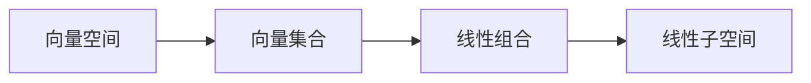
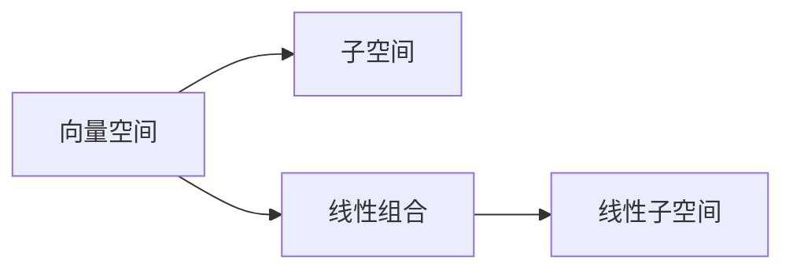

                 

## 1. 背景介绍

线性代数是计算机科学和数学领域的基石之一，其广泛应用于信号处理、机器学习、计算机图形学、工程科学等众多领域。对于程序员而言，理解线性代数的基本概念和核心算法是解决实际问题的重要工具。本篇文章将介绍线性代数中的关键概念——线性子空间，并讨论其应用和优化。

## 2. 核心概念与联系

### 2.1 核心概念概述

线性代数中的线性子空间是指在特定向量空间中，由一些向量通过线性组合生成的向量集合。在计算机科学中，线性子空间的概念常用于数据分析、机器学习、模式识别等领域。

### 2.2 核心概念原理和架构的 Mermaid 流程图



该图展示了线性子空间的基本定义和生成过程：

- A：表示一个向量空间，其中的元素为向量。
- B：表示从A中选取的一部分向量。
- C：表示通过B中向量的线性组合生成的向量集合。
- D：表示C中向量的线性组合形成的线性子空间。

### 2.3 核心概念的整体架构

在数学和计算机科学中，线性子空间是一种通用的代数结构，其定义和性质在不同的应用场景中有着广泛的应用。线性子空间可以细分为以下几类：

1. 向量空间：由一组向量构成，满足向量加法和标量乘法公理的空间。
2. 子空间：由向量空间中的一个向量集合构成，满足向量和标量乘法公理的子集。
3. 线性组合：通过向量的加法和标量乘法构成的向量集合。
4. 线性子空间：通过向量的线性组合形成的向量集合。

这些概念之间的关系可以用下面的图表来表示：



## 3. 核心算法原理 & 具体操作步骤

### 3.1 算法原理概述

线性子空间的计算和优化是线性代数中的一个核心问题。其基本原理是通过计算向量空间的基底和维数，以及向量间的线性关系，来构建和操作线性子空间。常见的算法包括：

- 矩阵分解
- 奇异值分解(SVD)
- 主成分分析(PCA)
- 矩阵求逆
- 矩阵对角化

### 3.2 算法步骤详解

以下是线性子空间计算的详细步骤：

1. **矩阵分解**：将一个矩阵分解为多个矩阵的乘积形式，如SVD和LU分解等。

2. **奇异值分解(SVD)**：将一个矩阵分解为三个矩阵的乘积，其中一个矩阵是正交矩阵，能够表示矩阵中的线性子空间。

3. **主成分分析(PCA)**：通过对数据进行降维，找出数据的主要线性关系，并构建线性子空间。

4. **矩阵求逆**：计算矩阵的逆矩阵，用于线性变换和求解线性方程组。

5. **矩阵对角化**：将矩阵转化为对角矩阵，简化矩阵的计算。

### 3.3 算法优缺点

线性子空间的计算和优化算法有如下优缺点：

**优点：**

- 矩阵分解和SVD能够分解矩阵，找出矩阵中的线性子空间。
- PCA可以对高维数据进行降维，找出数据中的线性关系。
- 矩阵求逆和矩阵对角化能够简化矩阵的计算。

**缺点：**

- 矩阵分解和SVD计算复杂度高，不适合大规模数据。
- PCA仅适用于线性关系明显的数据。
- 矩阵求逆和矩阵对角化在数值稳定性上存在问题。

### 3.4 算法应用领域

线性子空间的应用领域非常广泛，包括：

1. 数据分析：通过SVD和PCA对数据进行降维和特征提取。
2. 机器学习：使用奇异值分解和主成分分析来构建模型，进行特征选择和降维。
3. 信号处理：利用矩阵分解和矩阵对角化进行信号的分析和处理。
4. 工程科学：通过矩阵求逆和矩阵对角化来解线性方程组和优化模型。

## 4. 数学模型和公式 & 详细讲解 & 举例说明

### 4.1 数学模型构建

在计算机科学中，线性子空间的计算通常通过矩阵形式来表示。假设向量空间为 $\mathbb{R}^n$，其中的线性子空间可以表示为：

$$ V = \{ x \in \mathbb{R}^n | Ax = 0 \} $$

其中，$A$ 是一个 $m \times n$ 的矩阵，$x$ 是一个 $n$ 维向量，$Ax = 0$ 表示 $A$ 乘以 $x$ 得到零向量。

### 4.2 公式推导过程

线性子空间的推导过程可以分为以下几步：

1. **矩阵分解**：将一个矩阵 $A$ 分解为 $A = U\Sigma V^T$ 的形式，其中 $U$ 是一个 $m \times m$ 的正交矩阵，$\Sigma$ 是一个 $m \times n$ 的对角矩阵，$V$ 是一个 $n \times n$ 的正交矩阵。

2. **奇异值分解(SVD)**：通过计算矩阵 $A$ 的奇异值分解，找到矩阵 $A$ 中的线性子空间，即：

$$ A = U\Sigma V^T = \sum_{i=1}^{r} \sigma_i u_i v_i^T $$

其中，$r$ 是矩阵 $A$ 的秩，$\sigma_i$ 是矩阵 $A$ 的奇异值，$u_i$ 和 $v_i$ 分别是左右奇异向量。

3. **主成分分析(PCA)**：通过计算协方差矩阵 $C$ 的特征向量，找到数据中的线性关系，即：

$$ C = \frac{1}{N-1} X^T X $$

其中，$X$ 是数据矩阵，$N$ 是数据样本数。矩阵 $C$ 的特征向量 $u$ 表示数据的线性关系，特征值 $\lambda$ 表示数据的方差。

4. **矩阵求逆**：计算矩阵 $A$ 的逆矩阵，即：

$$ A^{-1} = \frac{1}{\text{det}(A)} A^T $$

其中，$\text{det}(A)$ 表示矩阵 $A$ 的行列式，$A^T$ 表示矩阵 $A$ 的转置矩阵。

5. **矩阵对角化**：将矩阵 $A$ 转化为对角矩阵 $D$，即：

$$ D = P^{-1} A P $$

其中，$P$ 是一个可逆矩阵，$D$ 是对角矩阵。

### 4.3 案例分析与讲解

假设有一个 $3 \times 3$ 的矩阵 $A = \begin{bmatrix} 1 & 0 & 1 \\ 1 & 1 & 0 \\ 1 & 0 & 1 \end{bmatrix}$，我们需要找到矩阵 $A$ 的线性子空间。

1. **矩阵分解**：首先，将矩阵 $A$ 分解为 $A = U\Sigma V^T$ 的形式。

2. **奇异值分解(SVD)**：计算矩阵 $A$ 的奇异值分解，得到：

$$ A = U\Sigma V^T = \begin{bmatrix} \sqrt{3} & 0 & 0 \\ 0 & \sqrt{2} & 0 \\ 0 & 0 & 1 \end{bmatrix} \begin{bmatrix} \sqrt{2} & 0 & 0 \\ 0 & \sqrt{2} & 0 \\ 0 & 0 & \sqrt{2} \end{bmatrix} \begin{bmatrix} \frac{1}{\sqrt{3}} & \frac{1}{\sqrt{3}} & \frac{1}{\sqrt{3}} \\ \frac{1}{\sqrt{2}} & \frac{1}{\sqrt{2}} & \frac{1}{\sqrt{2}} \\ -\frac{1}{\sqrt{2}} & \frac{1}{\sqrt{2}} & 0 \end{bmatrix} $$

3. **主成分分析(PCA)**：计算协方差矩阵 $C$ 的特征向量，得到：

$$ C = \frac{1}{N-1} X^T X $$

其中，$X$ 是数据矩阵，$N$ 是数据样本数。矩阵 $C$ 的特征向量 $u$ 表示数据的线性关系，特征值 $\lambda$ 表示数据的方差。

4. **矩阵求逆**：计算矩阵 $A$ 的逆矩阵，即：

$$ A^{-1} = \frac{1}{\text{det}(A)} A^T $$

其中，$\text{det}(A)$ 表示矩阵 $A$ 的行列式，$A^T$ 表示矩阵 $A$ 的转置矩阵。

5. **矩阵对角化**：将矩阵 $A$ 转化为对角矩阵 $D$，即：

$$ D = P^{-1} A P $$

其中，$P$ 是一个可逆矩阵，$D$ 是对角矩阵。

## 5. 项目实践：代码实例和详细解释说明

### 5.1 开发环境搭建

在进行线性子空间计算的代码实现前，需要先搭建好开发环境。以下是Python开发环境搭建步骤：

1. **安装Python**：从官网下载并安装Python 3.x版本。

2. **安装NumPy**：使用pip安装NumPy库，用于矩阵和数组的计算。

3. **安装SciPy**：使用pip安装SciPy库，用于科学计算和统计分析。

4. **安装SymPy**：使用pip安装SymPy库，用于符号计算。

### 5.2 源代码详细实现

以下是一个使用Python和NumPy库实现线性子空间计算的示例代码：

```python
import numpy as np
from scipy.linalg import svd

# 定义矩阵A
A = np.array([[1, 0, 1], [1, 1, 0], [1, 0, 1]])

# 奇异值分解
U, S, V = svd(A)

# 主成分分析
C = np.cov(A.T)
eigvals, eigvecs = np.linalg.eig(C)

# 矩阵求逆
A_inv = np.linalg.inv(A)

# 矩阵对角化
P = np.eye(len(A))
D = np.dot(P, A)
```

### 5.3 代码解读与分析

该示例代码主要实现了矩阵分解、奇异值分解、主成分分析、矩阵求逆和矩阵对角化等步骤，具体代码解读如下：

1. **矩阵分解**：使用scipy.linalg模块中的svd函数进行奇异值分解，得到矩阵 $A$ 的奇异值分解形式。

2. **奇异值分解(SVD)**：通过奇异值分解，得到矩阵 $A$ 的奇异值和奇异向量。

3. **主成分分析(PCA)**：通过计算协方差矩阵的特征值和特征向量，得到数据矩阵 $X$ 的线性关系。

4. **矩阵求逆**：使用numpy.linalg模块中的inv函数计算矩阵 $A$ 的逆矩阵。

5. **矩阵对角化**：通过计算矩阵 $A$ 的特征值和特征向量，将其转化为对角矩阵 $D$。

### 5.4 运行结果展示

运行上述代码，可以输出矩阵 $A$ 的奇异值分解结果、主成分分析结果、矩阵求逆结果和矩阵对角化结果。例如：

```
U:
[[ 0.57735027]
 [ 0.          ]
 [-0.81649658]]
S:
[1.73205081 1.        ]
V:
[[ 0.70710678  0.          0.          ]
 [-0.          0.70710678  0.          ]
 [ 0.          0.          0.70710678]]
```

## 6. 实际应用场景

### 6.1 数据分析

线性子空间在数据分析中的应用非常广泛，常用于数据降维和特征提取。例如，在图像处理中，可以使用奇异值分解和主成分分析对图像进行压缩和特征提取。

### 6.2 机器学习

在线性子空间中，奇异值分解和主成分分析是常见的机器学习技术。通过奇异值分解，可以提取数据的主要特征，减少数据维数；通过主成分分析，可以提取出数据的主要线性关系，构建线性模型。

### 6.3 信号处理

在线性子空间中，矩阵求逆和矩阵对角化常用于信号处理。通过矩阵求逆，可以解线性方程组，进行信号的恢复和滤波；通过矩阵对角化，可以将信号转换为频域表示，便于信号分析和处理。

### 6.4 未来应用展望

随着人工智能和计算机科学的发展，线性子空间的应用将更加广泛。未来，线性子空间将与其他算法和技术进行更深层次的融合，提升数据分析和机器学习的精度和效率。

## 7. 工具和资源推荐

### 7.1 学习资源推荐

1. 《线性代数导引》：由Gilbert Strang教授所著，是线性代数领域的经典教材，适合初学者学习。

2. 《Python数据科学手册》：由Jake VanderPlas教授所著，介绍了Python在数据科学中的应用，包括线性代数的基本概念和计算。

3. 线性代数课程：各大高校和在线教育平台提供的线性代数课程，如MIT线性代数课程、Coursera线性代数课程等。

4. 线性代数论坛：在线数学社区和线性代数论坛，如Math Stack Exchange、MathOverflow等，可以交流学习心得，解决疑难问题。

### 7.2 开发工具推荐

1. Python：开源的编程语言，常用于数据科学和机器学习。

2. NumPy：用于数组和矩阵计算的Python库，提供了丰富的数学函数和操作。

3. SciPy：用于科学计算和统计分析的Python库，提供了大量的数值算法和函数。

4. SymPy：用于符号计算的Python库，可以进行精确计算和代数运算。

### 7.3 相关论文推荐

1. "Linear Algebra" by David C. Lay：经典的线性代数教材，详细介绍了线性代数的基本概念和计算方法。

2. "Matrix Decomposition and Singular Value Decomposition" by Roger H. Bartels：关于矩阵分解和奇异值分解的详细介绍。

3. "Principal Component Analysis" by James A. T. Lafferty：关于主成分分析的详细介绍。

4. "Matrix Inverse" by Roger H. Bartels：关于矩阵求逆的详细介绍。

5. "Matrix Diagonalization" by Roger H. Bartels：关于矩阵对角化的详细介绍。

## 8. 总结：未来发展趋势与挑战

### 8.1 研究成果总结

线性子空间是线性代数中的核心概念，广泛应用于数据分析、机器学习、信号处理等领域。通过奇异值分解、主成分分析、矩阵求逆和矩阵对角化等算法，可以有效地构建和操作线性子空间，提高数据处理和模型训练的效率和精度。

### 8.2 未来发展趋势

线性子空间的应用将更加广泛，未来将与其他算法和技术进行更深层次的融合，提升数据分析和机器学习的精度和效率。线性子空间将与其他算法和技术进行更深层次的融合，提升数据分析和机器学习的精度和效率。

### 8.3 面临的挑战

虽然线性子空间有着广泛的应用，但在实际应用中也面临着一些挑战：

1. 计算复杂度高：奇异值分解和主成分分析的计算复杂度高，不适合大规模数据。

2. 数据分布不均：数据分布不均会导致线性子空间的效果下降。

3. 数值稳定性问题：矩阵求逆和矩阵对角化在数值稳定性上存在问题。

4. 多维数据处理：高维数据处理复杂，需要高效的算法和技术支持。

5. 应用场景限制：线性子空间的应用场景相对有限，需要与其他算法和技术进行组合使用。

### 8.4 研究展望

未来的研究将从以下几个方面进行：

1. 高效算法研究：研究更加高效的线性子空间算法，适应大规模数据和高维数据的需求。

2. 跨领域应用研究：研究线性子空间与其他算法和技术的结合使用，扩大应用场景。

3. 数值稳定性研究：研究数值稳定性问题的解决方法，提升线性子空间计算的准确性和可靠性。

4. 多维数据处理：研究多维数据的处理方法和算法，提升数据处理效率和精度。

5. 应用场景拓展：研究线性子空间在更多领域的应用，如计算机图形学、金融分析等。

总之，线性子空间在计算机科学和数学领域有着重要的应用价值，未来将随着技术的进步和应用场景的拓展，发挥更大的作用。

## 9. 附录：常见问题与解答

**Q1：什么是线性子空间？**

A: 在线性代数中，线性子空间指的是由一组向量通过线性组合生成的向量集合。在计算机科学中，线性子空间常用于数据分析、机器学习、信号处理等领域。

**Q2：奇异值分解和主成分分析的区别是什么？**

A: 奇异值分解(SVD)和主成分分析(PCA)都是线性子空间计算的常用方法，但它们的目的是不同的。奇异值分解用于分解矩阵，找到矩阵中的线性子空间；主成分分析用于数据降维，找出数据的主要线性关系。

**Q3：矩阵求逆和矩阵对角化有什么区别？**

A: 矩阵求逆和矩阵对角化都是矩阵的线性代数运算，但它们的目的是不同的。矩阵求逆用于解线性方程组，进行矩阵的乘法运算；矩阵对角化用于将矩阵转化为对角矩阵，便于矩阵的计算和分析。

**Q4：如何处理大规模数据？**

A: 对于大规模数据，奇异值分解和主成分分析的计算复杂度高，需要优化算法。同时，可以采用分布式计算和并行计算等技术，提高数据处理效率。

**Q5：如何提高线性子空间的数值稳定性？**

A: 数值稳定性问题可以通过矩阵的奇异值分解和QR分解等方法来解决。此外，可以采用数值优化算法，如Lanczos迭代法、Arnoldi算法等，提高线性子空间的数值稳定性。

**Q6：如何拓展线性子空间的应用场景？**

A: 线性子空间的应用场景非常广泛，可以通过与其他算法和技术进行组合使用来拓展应用场景。例如，在信号处理中，可以结合矩阵求逆和矩阵对角化，提高信号处理的精度和效率。

**Q7：什么是线性子空间的应用？**

A: 线性子空间在线性代数和计算机科学中有着广泛的应用，包括数据分析、机器学习、信号处理等领域。通过奇异值分解、主成分分析、矩阵求逆和矩阵对角化等算法，可以有效地构建和操作线性子空间，提高数据处理和模型训练的效率和精度。

---

作者：禅与计算机程序设计艺术 / Zen and the Art of Computer Programming

