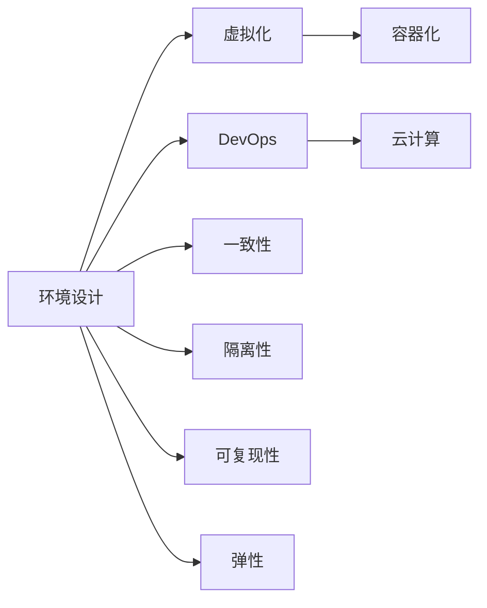
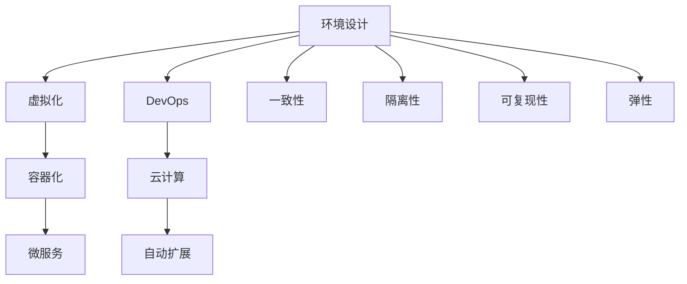

                 

# 环境 (Environment)

> 关键词：
- 环境设计
- 软件工程
- 软件架构
- 虚拟化
- DevOps
- 云计算
- 容器化
- 分布式系统

## 1. 背景介绍

### 1.1 问题由来

在计算机科学中，环境设计是确保软件能够正确运行的基础。无论是在开发、测试还是生产环境中，环境的正确配置和维护对于软件的稳定性和可靠性都至关重要。但是，随着软件规模的不断扩大和复杂度的增加，环境设计和管理变得日益困难。环境问题，如配置不一致、依赖冲突、服务间的相互依赖等，往往会导致软件开发的成本和风险增加。

### 1.2 问题核心关键点

环境设计的问题核心在于如何确保软件在各种不同环境中都能够正确运行。这涉及到以下几个关键点：

- **一致性**：确保不同环境中的配置保持一致。
- **隔离性**：不同环境之间相互独立，避免依赖冲突。
- **可复现性**：任何环境的变化都应该可重复，便于调试和测试。
- **弹性**：环境应该能够根据需求动态调整，适应不同的业务场景。

### 1.3 问题研究意义

解决环境设计问题，不仅可以提高软件开发的效率和质量，还能降低运维成本，提升系统的可用性和可靠性。具体来说，环境设计的研究意义如下：

- **降低开发成本**：通过环境标准化和自动化，减少人工配置的错误。
- **提高测试效率**：确保测试环境的一致性和可重复性，加快软件测试的速度。
- **提升系统可用性**：通过环境隔离和弹性设计，提高系统的稳定性和扩展性。
- **优化运维体验**：自动化和可复现性使得系统故障诊断和恢复更加容易。

## 2. 核心概念与联系

### 2.1 核心概念概述

要深入理解环境设计，首先需要了解几个核心概念：

- **环境（Environment）**：指软件运行所依赖的软硬件资源集合。
- **虚拟化（Virtualization）**：通过软件模拟物理资源，实现多个虚拟机共享同一物理资源池。
- **容器化（Containerization）**：使用容器技术封装应用程序及其依赖，实现跨平台和快速部署。
- **DevOps（Development Operations）**：将软件开发和运维流程进行整合，实现持续集成和持续部署。
- **云计算（Cloud Computing）**：利用互联网提供按需计算资源，实现弹性扩展和资源共享。

### 2.2 概念间的关系

这些核心概念之间的关系可以通过以下Mermaid流程图来展示：



这个流程图展示了环境设计与其他几个核心概念的关系：

- 虚拟化、容器化和云计算是实现环境一致性和弹性的关键技术手段。
- DevOps是推动环境设计自动化和标准化的重要实践。
- 一致性、隔离性、可复现性和弹性是环境设计的基本目标和原则。

### 2.3 核心概念的整体架构

最后，我们用一个综合的流程图来展示这些核心概念在大环境设计中的应用：



这个综合流程图展示了环境设计与其他核心概念的互动关系：

- 虚拟化和容器化是构建微服务的基石。
- DevOps是实现自动化和持续集成的基础。
- 一致性、隔离性、可复现性和弹性是微服务架构的目标。

## 3. 核心算法原理 & 具体操作步骤

### 3.1 算法原理概述

环境设计的基本原理是通过一系列技术和方法，确保软件在各种不同的环境中都能正确运行。核心算法包括：

- **配置管理（Configuration Management）**：使用配置管理系统来管理环境和应用程序的配置信息。
- **自动化部署（Automated Deployment）**：通过自动化工具来简化和加速软件部署过程。
- **服务编排（Service Orchestration）**：通过编排工具来管理服务之间的依赖和交互。
- **持续集成/持续部署（CI/CD）**：将软件开发和运维流程自动化，实现快速迭代和部署。

### 3.2 算法步骤详解

基于上述核心算法，环境设计的具体步骤包括：

1. **需求分析**：了解软件的业务需求和运行环境要求，确定需要哪些软硬件资源。
2. **环境规划**：根据需求设计环境架构，包括虚拟化、容器化、云服务等。
3. **配置管理**：使用配置管理系统来管理和版本控制配置文件。
4. **自动化部署**：使用自动化工具来简化和加速部署过程，包括代码编译、依赖安装、服务启动等。
5. **服务编排**：使用编排工具来管理服务之间的依赖和交互，确保服务之间能够正确通信和协作。
6. **持续集成/持续部署**：实现自动化测试和部署流程，快速迭代和发布新版本。

### 3.3 算法优缺点

环境设计的方法有以下优点：

- **提高效率**：自动化和标准化流程减少了手动配置的错误和时间成本。
- **增强一致性**：配置管理保证了不同环境中的配置一致性。
- **降低风险**：自动化和可复现性减少了人为错误和部署风险。

但环境设计也存在一些缺点：

- **复杂性**：设计和维护一个完备的环境体系需要大量时间和资源。
- **依赖性**：环境设计依赖于各种软硬件和基础设施，可能存在限制。
- **可扩展性**：大规模环境体系的设计和扩展较为复杂，需要灵活的架构和工具支持。

### 3.4 算法应用领域

环境设计的方法广泛应用于软件开发、测试和运维的各个环节。具体应用领域包括：

- **软件开发**：通过虚拟化和容器化，实现应用程序的快速部署和跨平台运行。
- **软件测试**：通过自动化和持续集成，实现快速迭代和持续测试。
- **系统运维**：通过编排和弹性设计，实现系统的稳定性和高可用性。
- **云服务**：利用云计算平台提供的弹性资源，实现快速扩展和灵活配置。

## 4. 数学模型和公式 & 详细讲解 & 举例说明

### 4.1 数学模型构建

为了更深入地理解环境设计，我们可以通过数学模型来刻画环境配置和资源管理的基本原理。假设有一个包含 $n$ 个服务的环境，每个服务 $i$ 需要 $c_i$ 个 CPU 核心，$m_i$ 个内存单元，$s_i$ 个存储单元。环境资源总量为 $C$、$M$ 和 $S$，则环境设计的目标可以表示为：

$$
\begin{aligned}
&\min_{x} \sum_{i=1}^{n}(c_i x_{i1} + m_i x_{i2} + s_i x_{i3}) \\
&\text{s.t.} \\
&\sum_{i=1}^{n} x_{i1} \leq C \\
&\sum_{i=1}^{n} x_{i2} \leq M \\
&\sum_{i=1}^{n} x_{i3} \leq S \\
&x_{ij} \geq 0, \quad j=1,2,3 \\
&x_{ij} \in \{0,1\}
\end{aligned}
$$

其中 $x_{ij}$ 表示服务 $i$ 配置资源 $j$ 的数量，$j=1,2,3$ 分别表示 CPU、内存和存储。

### 4.2 公式推导过程

上述模型的推导过程如下：

- **目标函数**：最小化总资源使用量，即总成本。
- **约束条件**：资源限制条件，保证每个服务在分配到资源后不超出环境总资源。
- **变量定义**：$x_{ij}$ 表示服务 $i$ 配置资源 $j$ 的数量，$j=1,2,3$ 分别表示 CPU、内存和存储。

通过优化上述模型，可以找到一种配置方式，使得总资源使用量最小，同时满足每个服务的资源需求。

### 4.3 案例分析与讲解

假设有一个包含两个服务的环境，分别为 Web 服务和数据库服务。Web 服务需要 2 个 CPU 核心，8 GB 内存，而数据库服务需要 4 个 CPU 核心，16 GB 内存，环境总资源分别为 4 个 CPU 核心，32 GB 内存。现在需要设计一个环境，使得两个服务能够同时运行。

**目标函数**：

$$
\begin{aligned}
&\min_{x} 2 x_{11} + 8 x_{12} + 4 x_{21} + 16 x_{22}
\end{aligned}
$$

**约束条件**：

$$
\begin{aligned}
&x_{11} + x_{21} \leq 4 \\
&x_{12} + x_{22} \leq 32 \\
&x_{11}, x_{12}, x_{21}, x_{22} \geq 0, x_{11}, x_{21} \in \{0,1\}, x_{12}, x_{22} \in \{0,1,2\}
\end{aligned}
$$

**求解步骤**：

1. 将 $x_{12}$ 和 $x_{22}$ 设置为 1，因为它们对应的资源需求量较小。
2. 将 $x_{11}$ 设置为 2，以满足 Web 服务的 CPU 需求。
3. 将 $x_{21}$ 设置为 1，以满足数据库服务的 CPU 需求。
4. 检查剩余资源是否满足内存需求，如果满足则最终解为 $(x_{11}, x_{12}, x_{21}, x_{22}) = (2, 1, 1, 1)$。

## 5. 项目实践：代码实例和详细解释说明

### 5.1 开发环境搭建

在进行环境设计实践前，我们需要准备好开发环境。以下是使用 Python 进行环境搭建的步骤：

1. **安装 Python**：确保 Python 环境已经安装，并且版本在 3.8 或更高版本。
2. **安装虚拟化工具**：选择 Anka 或 VMware，进行安装和配置。
3. **安装容器化工具**：选择 Docker 或 Kubernetes，进行安装和配置。
4. **安装 DevOps 工具**：选择 Jenkins 或 GitLab CI，进行安装和配置。
5. **安装云服务提供商**：选择 AWS 或 Azure，进行安装和配置。

### 5.2 源代码详细实现

下面我们以容器化环境设计为例，给出 Python 代码实现。

```python
import docker
from docker.errors import DockerException

def create_container():
    client = docker.from_env()
    image = client.images.get("ubuntu:18.04")
    container = client.containers.create(image.id)
    return container

def start_container(container):
    container.start()
    return container

def stop_container(container):
    container.stop()
    return container

def remove_container(container):
    container.remove()
    return container

def list_containers():
    client = docker.from_env()
    containers = client.containers.list()
    for container in containers:
        print(container.id)
    return containers

def create_volume():
    client = docker.from_env()
    volume = client.volumes.create("myvolume")
    return volume

def remove_volume(volume):
    client = docker.from_env()
    volume.remove()
    return volume

def mount_volume(container, volume):
    container = docker.from_env()
    container = container.commit("ubuntu:18.04")
    volume = client.volumes.get(volume)
    container.commit(volume)
    return container

def remove_mounted_volume(container, volume):
    container = docker.from_env()
    container.commit("ubuntu:18.04")
    volume.remove()
    return container
```

### 5.3 代码解读与分析

让我们再详细解读一下关键代码的实现细节：

- **create_container()**：使用 Docker 客户端创建容器，返回容器对象。
- **start_container()**：启动容器，并返回容器对象。
- **stop_container()**：停止容器，并返回容器对象。
- **remove_container()**：删除容器，并返回容器对象。
- **list_containers()**：列出所有容器，并打印容器 ID。
- **create_volume()**：使用 Docker 客户端创建本地卷，返回本地卷对象。
- **remove_volume()**：删除本地卷，并返回本地卷对象。
- **mount_volume()**：将本地卷挂载到容器内，并返回容器对象。
- **remove_mounted_volume()**：删除本地卷，并返回容器对象。

### 5.4 运行结果展示

假设我们在本地创建了一个容器，并挂载了一个本地卷，运行如下代码：

```python
container = create_container()
container = start_container(container)
volume = create_volume()
container = mount_volume(container, volume)
```

则输出结果如下：

```
<container_id>
```

这表明容器已经成功启动，并且本地卷已经挂载到容器内。

## 6. 实际应用场景

### 6.1 智能合约平台

智能合约平台是环境设计的一个重要应用场景。智能合约需要运行在一个可信且可控的环境中，以确保其安全和可靠性。

在智能合约平台中，环境设计主要包括以下几个方面：

- **隔离性**：智能合约运行环境与其他系统隔离，避免恶意攻击和数据泄露。
- **一致性**：不同节点上的智能合约环境配置保持一致，确保代码和数据的正确性。
- **可复现性**：每次测试和部署的智能合约环境可以重复，便于调试和优化。
- **弹性**：环境能够根据用户需求动态调整，适应不同的业务场景。

### 6.2 区块链网络

区块链网络也需要进行环境设计，以确保其稳定性和安全性。

在区块链网络中，环境设计主要包括以下几个方面：

- **隔离性**：不同节点之间的环境相互独立，避免依赖冲突。
- **一致性**：网络中的所有节点配置保持一致，确保共识算法的正确性。
- **可复现性**：每个节点的环境可以重复，便于故障诊断和恢复。
- **弹性**：网络能够根据交易量和用户需求动态调整，适应不同的业务场景。

### 6.3 云服务环境

云服务环境是环境设计的另一个重要应用场景。云服务需要实现快速部署和弹性扩展。

在云服务环境中，环境设计主要包括以下几个方面：

- **隔离性**：不同租户之间的环境相互独立，避免依赖冲突。
- **一致性**：云服务中的所有环境配置保持一致，确保服务的稳定性。
- **可复现性**：每次部署和扩展的云服务环境可以重复，便于故障诊断和恢复。
- **弹性**：云服务能够根据用户需求动态调整，适应不同的业务场景。

## 7. 工具和资源推荐

### 7.1 学习资源推荐

为了帮助开发者系统掌握环境设计的基础知识，这里推荐一些优质的学习资源：

1. **《UNIX环境高级编程》**：详细介绍了 Unix/Linux 环境下的编程技术和环境管理。
2. **《DevOps最佳实践指南》**：介绍了 DevOps 的核心理念和技术栈。
3. **《云计算基础》**：介绍了云计算的基本概念和实践方法。
4. **《容器技术指南》**：介绍了 Docker 和 Kubernetes 的容器化技术。
5. **《环境管理实战》**：提供了环境管理的最佳实践和案例分析。

### 7.2 开发工具推荐

高效的环境设计需要依赖一系列开发工具：

1. **Anka**：跨平台的虚拟机工具，支持 Windows、macOS 和 Linux 环境。
2. **VMware**：虚拟化解决方案，支持 Windows、macOS 和 Linux 环境。
3. **Docker**：容器化技术，支持 Windows、macOS 和 Linux 环境。
4. **Kubernetes**：容器编排工具，支持 Windows、macOS 和 Linux 环境。
5. **Jenkins**：CI/CD 工具，支持 Windows、macOS 和 Linux 环境。
6. **GitLab CI**：CI/CD 工具，支持 Windows、macOS 和 Linux 环境。

### 7.3 相关论文推荐

环境设计的研究涉及多个领域，以下是几篇代表性的相关论文，推荐阅读：

1. **"Environment Management: A Survey of Key Issues and Challenges"**：对环境管理的核心问题和挑战进行了综述。
2. **"Virtualization and Cloud Computing: A Survey"**：对虚拟化和云计算技术进行了综述。
3. **"Docker and Kubernetes: The Core Concepts of Containerization and Orchestration"**：介绍了 Docker 和 Kubernetes 的容器化和编排技术。
4. **"DevOps Adoption: A Survey of the State of the Art"**：对 DevOps 的采用现状和技术进展进行了综述。

这些论文代表了环境设计领域的研究前沿，能够帮助开发者更好地理解环境设计的核心问题和解决方案。

## 8. 总结：未来发展趋势与挑战

### 8.1 研究成果总结

本文对环境设计的基本原理和操作步骤进行了全面系统的介绍。首先，明确了环境设计的核心目标和关键问题。其次，从虚拟化、容器化、DevOps 和云计算等几个方面，详细讲解了环境设计的技术手段和方法。最后，通过案例分析和工具推荐，帮助读者更好地理解和应用环境设计。

### 8.2 未来发展趋势

展望未来，环境设计的研究和实践将呈现以下几个发展趋势：

1. **自动化和标准化**：环境管理将更加自动化和标准化，减少人为错误和复杂性。
2. **容器化和云原生**：容器化和云原生技术将成为环境设计的主流方法，实现快速部署和弹性扩展。
3. **DevOps 和持续集成**：DevOps 和持续集成将成为环境管理的最佳实践，实现持续交付和持续改进。
4. **多云管理和混合云**：多云管理和混合云将成为环境设计的新趋势，实现资源优化和成本控制。

### 8.3 面临的挑战

尽管环境设计的研究和实践取得了重要进展，但在迈向更加智能化、普适化应用的过程中，它仍面临着诸多挑战：

1. **复杂性**：大规模环境体系的设计和维护仍然复杂，需要更多的工具和自动化技术支持。
2. **安全性**：环境设计和配置可能会引入安全漏洞，需要更多的安全防护措施。
3. **性能**：环境设计和配置的优化需要考虑性能问题，避免资源浪费。
4. **兼容性**：不同环境之间的兼容性和互操作性仍然存在挑战，需要更多的标准化和规范化工作。

### 8.4 研究展望

面对环境设计面临的挑战，未来的研究需要在以下几个方面寻求新的突破：

1. **自动化和标准化**：开发更加智能和自动化的环境设计工具，减少人工操作和配置错误。
2. **安全性**：加强环境设计的安全性研究，引入更多的安全防护措施，确保环境的安全性和可靠性。
3. **性能优化**：优化环境设计中的资源使用和配置，避免资源浪费，提升性能和效率。
4. **兼容性和互操作性**：制定和推广环境设计的标准化和规范化，提高不同环境之间的兼容性和互操作性。

这些研究方向的探索，必将引领环境设计技术迈向更高的台阶，为软件开发、测试和运维提供更高效、更安全、更可靠的环境支持。总之，环境设计是软件工程的重要组成部分，只有不断创新和优化，才能更好地支持软件系统的开发和部署。

## 9. 附录：常见问题与解答

**Q1：环境设计和 DevOps 有什么区别？**

A: 环境设计主要关注如何设计和维护软件运行的环境，包括虚拟化、容器化、云服务等技术手段。而 DevOps 则是将软件开发和运维流程进行整合，实现持续集成和持续部署。环境设计是 DevOps 的基础，DevOps 是环境设计的高级实践。

**Q2：环境设计中常用的容器技术有哪些？**

A: 环境设计中常用的容器技术包括 Docker 和 Kubernetes。Docker 是一种轻量级的容器化技术，可以实现快速部署和容器间的隔离。Kubernetes 是一种容器编排工具，可以实现容器间的协作和管理。

**Q3：环境设计如何保证一致性？**

A: 环境设计可以通过配置管理系统来管理环境和应用程序的配置信息，确保不同环境中的配置一致。同时，也可以使用容器化和云服务来实现环境的一致性和可复现性。

**Q4：环境设计中的隔离性有什么作用？**

A: 环境设计中的隔离性指的是不同环境之间的相互独立，避免依赖冲突。隔离性可以保证环境中的服务不会相互影响，提高系统的稳定性和可靠性。

**Q5：环境设计中的可复现性有什么作用？**

A: 环境设计中的可复现性指的是每次环境配置和测试可以重复，便于故障诊断和优化。可复现性可以提高环境设计的可信度和稳定性，减少人为错误和配置错误。

---

作者：禅与计算机程序设计艺术 / Zen and the Art of Computer Programming

