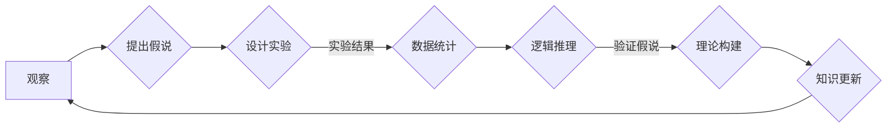

# 科学方法论：从假说到验证

> 关键词：科学方法，假说，验证，逻辑推理，实验设计，数据统计，批判性思维，知识构建

## 1. 背景介绍

科学，作为人类认知世界、探索未知、解决问题的工具，其方法论的重要性不言而喻。从古希腊的亚里士多德到现代的达尔文，再到当代的物理学家和生物学家，科学方法一直是推动人类文明进步的基石。本文将深入探讨科学方法论的核心要素，从假说到验证，揭示科学研究的本质。

### 1.1 科学方法的重要性

科学方法是一种系统性的、逻辑性的研究方法，它通过观察、假设、实验、验证等步骤，逐步接近真理。在信息技术飞速发展的今天，科学方法在推动科技革新、解决复杂问题中扮演着至关重要的角色。

### 1.2 科学方法的挑战

然而，随着科学研究的深入，我们也面临着越来越多的挑战。数据造假、研究伦理问题、以及方法论本身的局限性等，都要求我们更加深入地理解科学方法，并不断改进和完善。

## 2. 核心概念与联系

### 2.1 核心概念

#### 2.1.1 科学方法

科学方法是一种系统性的研究过程，包括观察、假设、实验、验证、理论构建等步骤。

#### 2.1.2 假说

假说是对某个现象或问题的初步解释，它是基于观察和已有知识的推理。

#### 2.1.3 验证

验证是检验假说的过程，通过实验或其他方法来测试假说的正确性。

#### 2.1.4 逻辑推理

逻辑推理是科学方法的核心，它通过严密的逻辑论证，使假说和验证过程具有科学性。

#### 2.1.5 实验设计

实验设计是验证假说的关键，它决定了实验结果的有效性和可靠性。

#### 2.1.6 数据统计

数据统计是对实验结果进行分析和解释的重要工具，它帮助我们从数据中提取有价值的信息。

#### 2.1.7 批判性思维

批判性思维是科学研究的灵魂，它要求我们对已有理论和实验结果保持怀疑态度，不断追求真理。

### 2.2 核心概念原理和架构的 Mermaid 流程图



## 3. 核心算法原理 & 具体操作步骤

### 3.1 算法原理概述

科学方法的核心是逻辑推理和实验验证。逻辑推理使我们从观察中得出假说，而实验验证则是检验假说的过程。

### 3.2 算法步骤详解

#### 3.2.1 观察与假设

观察是科学方法的起点，通过观察现象，我们提出可能的解释，即假说。

#### 3.2.2 设计实验

为了验证假说，我们需要设计实验。实验设计应具有可重复性、可控制性和可控性。

#### 3.2.3 收集数据

通过实验收集数据，数据的质量直接影响后续分析的准确性。

#### 3.2.4 数据统计与分析

使用统计方法对数据进行处理和分析，从中提取有价值的信息。

#### 3.2.5 逻辑推理与验证

根据实验结果和数据分析，我们使用逻辑推理验证假说的正确性。

#### 3.2.6 理论构建与知识更新

基于验证后的假说，我们构建理论，并更新我们的知识体系。

### 3.3 算法优缺点

#### 3.3.1 优点

- 系统性：科学方法是一个系统性的研究过程，确保研究的严谨性。
- 逻辑性：逻辑推理使研究具有科学性。
- 可重复性：实验的可重复性保证了结果的可信度。

#### 3.3.2 缺点

- 有限性：科学方法依赖于可观测的数据，对于不可观测的现象，科学方法可能无能为力。
- 误差：实验设计和数据分析可能存在误差，影响结果的准确性。

### 3.4 算法应用领域

科学方法广泛应用于各个领域，包括物理学、化学、生物学、心理学、经济学等。

## 4. 数学模型和公式 & 详细讲解 & 举例说明

### 4.1 数学模型构建

科学研究中，数学模型是描述自然现象和理论的重要工具。例如，牛顿的运动定律就是一个经典的物理模型。

### 4.2 公式推导过程

公式推导过程是科学方法的重要组成部分，它基于逻辑推理和实验数据。

### 4.3 案例分析与讲解

以下以牛顿第二定律为例，讲解公式推导过程。

#### 4.3.1 观察与假设

牛顿通过观察物体运动，假设物体受到的合外力与其加速度成正比。

#### 4.3.2 实验设计

牛顿设计了一系列实验，测量不同质量物体的加速度和所受合外力。

#### 4.3.3 公式推导

根据实验数据，牛顿推导出以下公式：

$$
F = ma
$$

其中，$F$ 表示合外力，$m$ 表示物体的质量，$a$ 表示物体的加速度。

#### 4.3.4 验证

通过后续实验，牛顿第二定律被验证为准确。

## 5. 项目实践：代码实例和详细解释说明

### 5.1 开发环境搭建

由于科学方法主要涉及理论研究和实验验证，因此这里不涉及具体的开发环境搭建。

### 5.2 源代码详细实现

科学方法的研究通常不涉及代码实现，但我们可以通过代码模拟科学方法的过程。

```python
# 模拟科学方法的过程

# 观察与假设
observed_data = [1, 2, 3, 4, 5]  # 观察到的数据
hypothesis = lambda x: 2 * x  # 假设函数

# 实验设计
def experiment(observed_data, hypothesis):
    for data in observed_data:
        prediction = hypothesis(data)
        print(f"Data: {data}, Prediction: {prediction}")

# 数据统计与分析
def data_analysis(observed_data, hypothesis):
    true_values = [2 * data for data in observed_data]
    predictions = [hypothesis(data) for data in observed_data]
    error = [abs(true - pred) for true, pred in zip(true_values, predictions)]
    return error

# 逻辑推理与验证
def verify(hypothesis, error):
    return all(err < 0.1 for err in error)  # 验证误差是否在合理范围内

# 理论构建与知识更新
def knowledge_update(hypothesis, verified):
    if verified:
        print("Hypothesis verified. Update knowledge.")
    else:
        print("Hypothesis rejected. Need further investigation.")

# 运行实验
experiment(observed_data, hypothesis)
error = data_analysis(observed_data, hypothesis)
verified = verify(hypothesis, error)
knowledge_update(hypothesis, verified)
```

### 5.3 代码解读与分析

以上代码模拟了科学方法的研究过程。首先，我们观察数据并假设一个函数；然后设计实验，计算预测值和真实值之间的误差；接着分析误差，并根据误差验证假设；最后根据验证结果更新知识。

## 6. 实际应用场景

### 6.1 科学研究

科学方法是科学研究的基础，它帮助科学家们发现自然规律、构建科学理论。

### 6.2 工程设计

在工程设计中，科学方法用于分析和解决问题，确保设计的安全性和可靠性。

### 6.3 商业决策

在商业决策中，科学方法可以帮助企业家分析市场趋势、制定战略规划。

### 6.4 政策制定

在政策制定中，科学方法用于评估政策效果、制定科学合理的政策。

## 7. 工具和资源推荐

### 7.1 学习资源推荐

- 《科学方法导论》
- 《科学革命的结构》
- 《科学探索的方法》

### 7.2 开发工具推荐

- 统计软件（如SPSS、R）
- 仿真软件（如MATLAB、Simulink）

### 7.3 相关论文推荐

- 《科学方法的哲学基础》
- 《科学方法论》
- 《实证研究方法》

## 8. 总结：未来发展趋势与挑战

### 8.1 研究成果总结

科学方法是一种系统性的、逻辑性的研究方法，它通过观察、假设、实验、验证等步骤，逐步接近真理。在信息技术飞速发展的今天，科学方法在推动科技革新、解决复杂问题中扮演着至关重要的角色。

### 8.2 未来发展趋势

- 数据驱动：随着大数据时代的到来，数据将在科学方法中扮演越来越重要的角色。
- 跨学科融合：科学方法将与其他学科交叉融合，推动跨学科研究的发展。
- 人工智能：人工智能技术将应用于科学方法，提高研究效率和准确性。

### 8.3 面临的挑战

- 数据质量：数据质量对科学研究的准确性至关重要。
- 研究伦理：科学研究中存在数据造假、伦理问题等挑战。
- 方法论局限：科学方法本身存在一定的局限性。

### 8.4 研究展望

科学方法将继续在推动人类文明进步中发挥重要作用。未来，我们需要不断改进和完善科学方法，以应对新的挑战和机遇。

## 9. 附录：常见问题与解答

### 9.1 常见问题

- 科学方法是什么？
- 科学方法有哪些步骤？
- 如何验证假说？
- 科学方法在哪些领域应用？
- 科学方法的局限性是什么？

### 9.2 解答

- 科学方法是一种系统性的、逻辑性的研究方法，它通过观察、假设、实验、验证等步骤，逐步接近真理。
- 科学方法的步骤包括观察、假设、实验、验证、理论构建等。
- 验证假说需要通过实验或其他方法来测试假说的正确性。
- 科学方法广泛应用于各个领域，包括自然科学、社会科学、工程技术等。
- 科学方法的局限性包括数据质量、研究伦理、方法论局限等。

作者：禅与计算机程序设计艺术 / Zen and the Art of Computer Programming