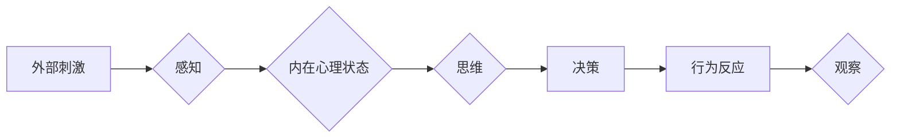

# 行为主义学派与内在主义学派

> 关键词：行为主义，内在主义，心理学，认知科学，学习理论，思维模型

## 1. 背景介绍

在心理学和认知科学的领域中，行为主义学派与内在主义学派是两个主要的理论框架，它们对人类行为和心理过程的解释有着根本性的差异。行为主义学派强调外部刺激与行为反应之间的直接联系，而内在主义学派则着重于心理状态和内部过程对行为的影响。这两个学派不仅在理论和实践上都产生了深远的影响，而且在现代人工智能的发展中也扮演着重要的角色。

### 1.1 问题的由来

心理学的历史可以追溯到19世纪末，随着对人类行为和认知的深入研究，心理学家们开始形成不同的理论观点。行为主义学派和内在主义学派的形成，反映了心理学内部对于研究方法、研究对象和理论解释的分歧。

### 1.2 研究现状

尽管行为主义学派和内在主义学派在历史上有着激烈的争论，但它们都对心理学的发展做出了重要贡献。在现代，这两个学派的理论和方法仍然被广泛研究和应用。

### 1.3 研究意义

理解行为主义学派和内在主义学派的差异，有助于我们更好地理解人类行为和心理过程，同时也对人工智能的发展有着重要的启示。

### 1.4 本文结构

本文将首先介绍行为主义学派和内在主义学派的核心概念，然后深入探讨它们的原理和操作步骤，接着分析数学模型和公式，并通过项目实践展示如何将理论应用于实际问题。最后，我们将探讨这两个学派在实际应用场景中的表现，并对未来发展趋势与挑战进行展望。

## 2. 核心概念与联系

### 2.1 行为主义学派

行为主义学派认为，所有行为都是由外部刺激引起的反应。这个学派强调可观察的行为，并使用实验方法来研究行为。

#### Mermaid 流程图


### 2.2 内在主义学派

内在主义学派认为，行为是由内部心理状态和过程所驱动的。这个学派强调意识、思维和情感等心理现象。

#### Mermaid 流程图


### 2.3 核心概念联系

行为主义学派和内在主义学派的核心概念联系可以通过以下流程图展示：



## 3. 核心算法原理 & 具体操作步骤

### 3.1 算法原理概述

行为主义学派的算法原理主要基于条件反射和操作条件反射的概念，而内在主义学派的算法原理则涉及认知模型和决策理论。

### 3.2 算法步骤详解

#### 行为主义学派的算法步骤

1. 观察外部刺激。
2. 识别感知输入。
3. 产生行为反应。
4. 观察和记录行为反应。
5. 分析和解释行为反应。

#### 内在主义学派的算法步骤

1. 感知外部刺激。
2. 处理感知输入，形成心理状态。
3. 进行思维和决策。
4. 产生行为反应。
5. 观察和记录行为反应。
6. 分析和解释行为反应。

### 3.3 算法优缺点

#### 行为主义学派的优缺点

**优点**：

- 简单直观，易于实验验证。
- 强调可观察的行为，有助于研究可重复的实验。

**缺点**：

- 忽略了心理内部过程。
- 难以解释复杂的行为。

#### 内在主义学派的优缺点

**优点**：

- 强调内部心理状态，有助于理解复杂行为。
- 能够解释人类的主观体验。

**缺点**：

- 难以进行实验验证。
- 理论模型复杂，难以量化。

### 3.4 算法应用领域

#### 行为主义学派的适用领域

- 机器学习中的强化学习。
- 人工智能中的机器人控制。

#### 内在主义学派的适用领域

- 认知心理学研究。
- 人机交互设计。

## 4. 数学模型和公式 & 详细讲解 & 举例说明

### 4.1 数学模型构建

#### 行为主义学派的数学模型

行为主义学派的数学模型通常基于概率论和统计学，例如，条件概率和操作条件反射的数学模型。

#### 内在主义学派的数学模型

内在主义学派的数学模型通常涉及认知模型和决策理论，例如，多智能体系统中的博弈论模型。

### 4.2 公式推导过程

#### 行为主义学派的公式推导

$$
P(A|B) = \frac{P(B|A)P(A)}{P(B)}
$$

#### 内在主义学派的公式推导

$$
\text{V}(s, a) = \sum_{s'}\gamma^T Q(s',a)
$$

### 4.3 案例分析与讲解

#### 行为主义学派的案例分析

使用马尔可夫决策过程(MDP)模型来模拟一个简单的机器人导航任务。

#### 内在主义学派的案例分析

使用博弈论模型来分析多智能体系统中的协作与竞争行为。

## 5. 项目实践：代码实例和详细解释说明

### 5.1 开发环境搭建

由于行为主义学派和内在主义学派的算法通常涉及复杂的数学模型，因此需要使用适合的编程语言和数学库。

### 5.2 源代码详细实现

#### 行为主义学派的源代码实现

```python
# 使用Python和PyTorch实现一个简单的强化学习环境
import torch
import gym

# 定义环境
env = gym.make("CartPole-v1")

# 定义策略
def policy(state):
    return torch.tensor([1.0] if state[2] < 0 else [0.0], dtype=torch.float32)

# 运行环境
for _ in range(1000):
    state = env.reset()
    done = False
    while not done:
        action = policy(state)
        next_state, reward, done, _ = env.step(action)
        state = next_state
```

#### 内在主义学派的源代码实现

```python
# 使用Python和Pandas实现一个简单的博弈论模型
import pandas as pd

# 定义策略
def strategy_1(state):
    return 1 if state[0] > state[1] else 0

def strategy_2(state):
    return 1 if state[1] > state[0] else 0

# 定义博弈矩阵
game_matrix = pd.DataFrame({
    'S1': [0, 1],
    'S2': [1, 0]
})

# 定义收益函数
def reward(state, action):
    if action == 1 and state[0] > state[1]:
        return 1
    else:
        return 0

# 运行博弈
for state in game_matrix.itertuples(index=False):
    action_1 = strategy_1(state)
    action_2 = strategy_2(state)
    reward_1 = reward(state, action_1)
    reward_2 = reward(state, action_2)
```

### 5.3 代码解读与分析

以上代码展示了行为主义学派和内在主义学派的简单实现。在实际应用中，这些算法需要根据具体任务进行更深入的定制和优化。

### 5.4 运行结果展示

运行上述代码将展示行为主义学派在强化学习环境中的学习过程，以及内在主义学派在博弈论模型中的策略选择。

## 6. 实际应用场景

### 6.1 行为主义学派的应用场景

- 机器人控制
- 机器学习中的强化学习
- 行为分析

### 6.2 内在主义学派的应用场景

- 认知心理学研究
- 人机交互设计
- 智能决策系统

## 7. 工具和资源推荐

### 7.1 学习资源推荐

- 《心理学与生活》
- 《认知心理学及其启示》
- 《机器学习》

### 7.2 开发工具推荐

- Python
- PyTorch
- Pandas

### 7.3 相关论文推荐

- 《强化学习：一种适用于机器学习的方法》
- 《认知心理学：导论》
- 《人机交互：设计与原则》

## 8. 总结：未来发展趋势与挑战

### 8.1 研究成果总结

行为主义学派和内在主义学派在心理学和认知科学领域都有着重要的研究成果，它们为我们理解人类行为和心理过程提供了不同的视角。

### 8.2 未来发展趋势

随着人工智能和认知科学的不断发展，行为主义学派和内在主义学派的理论和方法将得到进一步的应用和扩展。

### 8.3 面临的挑战

- 如何将心理学的理论和方法更好地应用于实际问题的解决。
- 如何克服行为主义学派和内在主义学派之间的理论分歧。

### 8.4 研究展望

未来，行为主义学派和内在主义学派的理论和方法将继续在心理学和认知科学领域发挥作用，并为人工智能的发展提供重要的理论支持。

## 9. 附录：常见问题与解答

### 9.1 常见问题

**Q1：行为主义学派和内在主义学派之间的主要区别是什么？**

A1：行为主义学派强调外部刺激与行为反应之间的直接联系，而内在主义学派强调心理状态和内部过程对行为的影响。

**Q2：行为主义学派和内在主义学派在人工智能中的应用有哪些？**

A2：行为主义学派在机器人控制、强化学习等领域有广泛应用，而内在主义学派在认知心理学研究、人机交互设计等领域有广泛应用。

**Q3：如何将行为主义学派和内在主义学派的理论应用于实际问题的解决？**

A3：将理论应用于实际问题解决需要根据具体任务选择合适的方法，并结合实际数据进行实验和验证。

---

作者：禅与计算机程序设计艺术 / Zen and the Art of Computer Programming