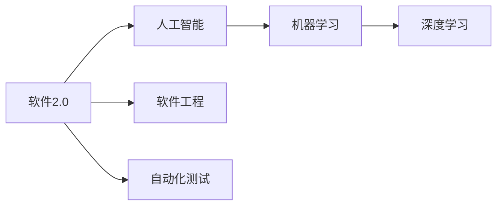
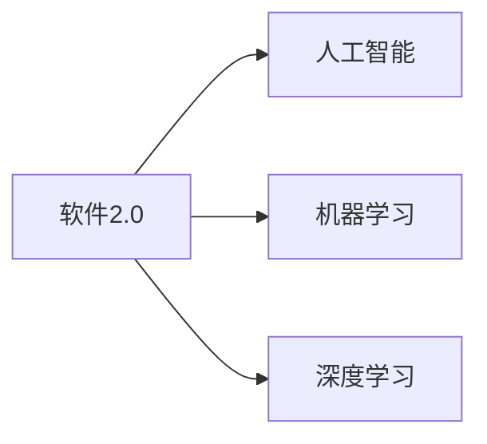
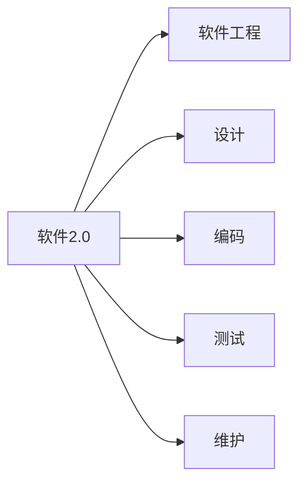
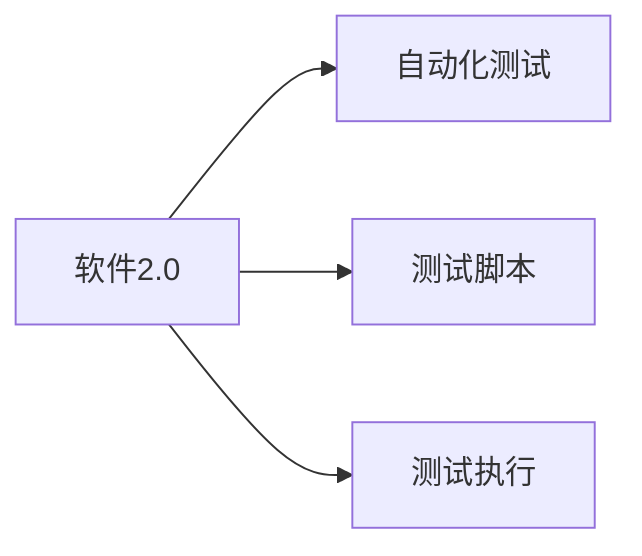

                 

## 1. 背景介绍

随着人工智能（AI）和软件工程技术的飞速发展，软件开发正经历着一场革命性的变革。传统以软件开发人员为主导的软件开发模式正在逐渐被新的软件2.0模式所替代。软件2.0模式强调数据驱动和智能编程，通过引入机器学习（ML）和人工智能技术，使得软件开发团队的分工和协作方式发生了根本性的变化。本文将深入探讨软件2.0如何改变编程团队的分工，并揭示其在提高开发效率、增强软件质量和降低开发成本等方面的潜力。

## 2. 核心概念与联系

### 2.1 核心概念概述

为更好地理解软件2.0如何改变编程团队的分工，本节将介绍几个密切相关的核心概念：

- **软件2.0**：软件2.0是以数据和智能为核心的软件开发模式，通过利用机器学习和人工智能技术，实现自动化、智能化和优化化的软件开发过程。
- **人工智能**：利用计算机模拟人类智能过程，包括学习、推理、自适应等，实现复杂任务的自动化和智能化。
- **机器学习**：一种使计算机通过数据学习并改进性能的技术，主要包括监督学习、无监督学习和强化学习。
- **深度学习**：一种基于人工神经网络的机器学习技术，能够处理大规模、复杂的数据，实现高度的自动化和智能化。
- **软件工程**：包括软件需求分析、设计、编码、测试和维护等环节，旨在提高软件的质量和可靠性。
- **自动化测试**：通过编写自动化测试脚本，自动执行软件测试，提高测试效率和准确性。

这些核心概念之间的逻辑关系可以通过以下Mermaid流程图来展示：



这个流程图展示了大语言模型的核心概念及其之间的关系：

1. 软件2.0通过利用人工智能技术，实现自动化的软件开发。
2. 人工智能技术包括机器学习和深度学习，机器学习是人工智能的基础，深度学习是机器学习的高级形式。
3. 软件工程是软件2.0的实践环节，通过设计、编码、测试和维护等环节，确保软件的质量和可靠性。
4. 自动化测试是软件工程中的重要环节，通过编写自动化测试脚本，提高测试效率和准确性。

### 2.2 概念间的关系

这些核心概念之间存在着紧密的联系，形成了软件2.0的完整生态系统。下面我通过几个Mermaid流程图来展示这些概念之间的关系。

#### 2.2.1 软件2.0与人工智能的关系



这个流程图展示了软件2.0与人工智能的关系：软件2.0通过利用人工智能技术，实现自动化的软件开发。

#### 2.2.2 机器学习与深度学习的关系


这个流程图展示了机器学习与深度学习的关系：深度学习是机器学习的高级形式，在处理大规模、复杂的数据时表现更优。

#### 2.2.3 软件2.0与软件工程的关系



这个流程图展示了软件2.0与软件工程的关系：软件2.0在软件工程的基础上，利用人工智能技术实现自动化、智能化和优化化的软件开发。

#### 2.2.4 软件2.0与自动化测试的关系



这个流程图展示了软件2.0与自动化测试的关系：自动化测试是软件2.0的重要组成部分，通过编写自动化测试脚本，自动执行软件测试，提高测试效率和准确性。

### 2.3 核心概念的整体架构

最后，我们用一个综合的流程图来展示这些核心概念在大语言模型微调过程中的整体架构：


这个综合流程图展示了从预训练到软件2.0再到自动化测试的完整过程。大语言模型首先在大规模文本数据上进行预训练，然后通过软件2.0的模式进行自动化、智能化和优化化的软件开发。

## 3. 核心算法原理 & 具体操作步骤

### 3.1 算法原理概述

软件2.0的核心算法原理是基于机器学习和深度学习技术的自动化软件开发。其核心思想是通过数据驱动和智能编程，实现软件开发的自动化、智能化和优化化。具体而言，软件2.0利用机器学习算法，对软件开发过程中产生的大量数据进行建模和预测，从而指导软件开发过程中的各个环节，提高软件的质量和效率。

### 3.2 算法步骤详解

软件2.0的自动化软件开发主要包括以下几个步骤：

1. **数据收集**：通过自动化工具，收集软件开发过程中产生的数据，如代码、注释、缺陷报告、测试用例等。
2. **数据预处理**：对收集到的数据进行清洗、归一化和特征工程，以便于机器学习模型的训练。
3. **模型训练**：利用机器学习算法，对预处理后的数据进行建模和训练，得到预测模型。
4. **模型评估**：对训练好的模型进行评估，确保其能够对软件开发过程中的各个环节进行准确的预测。
5. **模型部署**：将训练好的模型部署到生产环境中，实现自动化、智能化和优化化的软件开发。

### 3.3 算法优缺点

软件2.0的自动化软件开发具有以下优点：

1. **提高开发效率**：通过自动化工具和模型，能够快速完成软件开发过程中的各个环节，大大提高开发效率。
2. **增强软件质量**：通过机器学习模型对软件开发过程中的各个环节进行预测和优化，能够提高软件的质量和可靠性。
3. **降低开发成本**：通过自动化工具和模型，减少人力成本，提高开发效率，降低开发成本。

同时，软件2.0的自动化软件开发也存在一些缺点：

1. **对数据依赖性强**：软件2.0的自动化开发依赖于大量高质量的数据，数据质量直接影响模型的预测准确性。
2. **模型复杂度高**：机器学习模型通常具有较高的复杂度，需要大量的计算资源和时间进行训练和部署。
3. **模型解释性差**：机器学习模型的预测结果难以解释，难以理解其内部工作机制。

### 3.4 算法应用领域

软件2.0的自动化软件开发已经在软件开发的全生命周期中得到了广泛的应用，涵盖几乎所有常见环节，例如：

1. **需求分析**：利用机器学习模型，分析用户需求，生成软件需求文档。
2. **设计**：利用机器学习模型，对软件设计方案进行评估和优化，提高设计质量。
3. **编码**：利用机器学习模型，生成代码片段，减少编码工作量，提高编码效率。
4. **测试**：利用机器学习模型，自动生成测试用例，提高测试效率和准确性。
5. **部署**：利用机器学习模型，优化软件部署策略，提高软件部署效率和质量。

除了上述这些经典应用外，软件2.0还创新性地应用于更多场景中，如代码审查、版本控制、软件重构等，为软件开发带来了全新的突破。随着机器学习技术的发展，相信软件2.0将在更广泛的领域得到应用，为软件开发注入新的动力。

## 4. 数学模型和公式 & 详细讲解 & 举例说明

### 4.1 数学模型构建

软件2.0的自动化软件开发过程中，通常需要构建多个数学模型，以下是几个常见的数学模型：

- **回归模型**：用于预测软件开发的各个环节，如需求分析、设计、编码、测试和部署等。
- **分类模型**：用于判断软件开发的各个环节是否满足要求，如代码质量、测试用例覆盖率等。
- **聚类模型**：用于对软件开发的各个环节进行聚类分析，发现潜在的规律和模式。
- **强化学习模型**：用于优化软件开发过程中的各个环节，如代码生成、测试用例生成等。

### 4.2 公式推导过程

以下我们以回归模型为例，推导其公式及其推导过程。

假设我们有 $n$ 个软件开发环节，每个环节的特征向量为 $x_i \in \mathbb{R}^d$，对应的目标值为 $y_i \in \mathbb{R}$。我们可以构建一个线性回归模型，通过最小二乘法来拟合数据，得到预测模型 $f(x)$：

$$
f(x) = \beta_0 + \beta_1 x_1 + \cdots + \beta_d x_d
$$

其中 $\beta_0$ 为截距，$\beta_1, \cdots, \beta_d$ 为回归系数。通过最小二乘法，我们可以得到最优的回归系数 $\beta$，使得预测值与真实值之间的误差最小：

$$
\beta = \mathop{\arg\min}_{\beta} \sum_{i=1}^n (y_i - f(x_i))^2
$$

利用矩阵形式表示，可以将上述公式改写为：

$$
\beta = (\mathbf{X}^T\mathbf{X})^{-1}\mathbf{X}^T\mathbf{y}
$$

其中 $\mathbf{X} = [x_1, x_2, \cdots, x_n]$，$\mathbf{y} = [y_1, y_2, \cdots, y_n]$。这个公式展示了回归模型的基本框架和求解过程。

### 4.3 案例分析与讲解

假设我们构建了一个回归模型，用于预测软件的测试覆盖率，即根据代码行数和函数调用次数预测测试覆盖率。我们可以将代码行数和函数调用次数作为特征向量，测试覆盖率作为目标值，构建训练集 $\{(x_i, y_i)\}_{i=1}^N$。通过机器学习算法训练模型，得到预测模型 $f(x)$，并将其部署到生产环境中，实现自动化测试预测。

在实际应用中，我们还需要对模型进行评估和优化。例如，可以使用均方误差（MSE）、均方根误差（RMSE）等指标评估模型的预测精度。同时，可以通过交叉验证、网格搜索等技术优化模型的超参数，提高模型的预测准确性。

## 5. 项目实践：代码实例和详细解释说明

### 5.1 开发环境搭建

在进行软件2.0的自动化软件开发实践前，我们需要准备好开发环境。以下是使用Python进行TensorFlow开发的环境配置流程：

1. 安装Anaconda：从官网下载并安装Anaconda，用于创建独立的Python环境。

2. 创建并激活虚拟环境：
```bash
conda create -n tensorflow-env python=3.8 
conda activate tensorflow-env
```

3. 安装TensorFlow：根据CUDA版本，从官网获取对应的安装命令。例如：
```bash
conda install tensorflow -c tf -c conda-forge
```

4. 安装各类工具包：
```bash
pip install numpy pandas scikit-learn matplotlib tqdm jupyter notebook ipython
```

完成上述步骤后，即可在`tensorflow-env`环境中开始软件2.0的自动化软件开发实践。

### 5.2 源代码详细实现

下面我们以自动化测试预测为例，给出使用TensorFlow进行软件2.0实践的PyTorch代码实现。

首先，定义回归模型的类：

```python
import tensorflow as tf
from sklearn.model_selection import train_test_split
from sklearn.metrics import mean_squared_error

class RegressionModel(tf.keras.Model):
    def __init__(self, input_shape):
        super(RegressionModel, self).__init__()
        self.dense = tf.keras.layers.Dense(units=1, input_shape=input_shape)

    def call(self, x):
        return self.dense(x)
```

然后，定义数据预处理函数：

```python
def preprocess_data(data):
    X = data[['lines_of_code', 'function_calls']] # 提取代码行数和函数调用次数
    y = data['test_coverage'] # 提取测试覆盖率
    return X, y
```

接着，定义训练函数：

```python
def train_model(model, X_train, X_test, y_train, y_test):
    optimizer = tf.keras.optimizers.Adam(learning_rate=0.001)
    model.compile(optimizer=optimizer, loss='mse', metrics=['mse', 'mae'])

    for epoch in range(100):
        model.fit(X_train, y_train, epochs=1, batch_size=32)
        y_pred = model.predict(X_test)
        mse = mean_squared_error(y_test, y_pred)
        print(f'Epoch {epoch+1}, MSE: {mse:.4f}')
```

最后，启动训练流程并在测试集上评估：

```python
from sklearn.datasets import make_regression
from sklearn.model_selection import train_test_split

# 生成测试数据
X, y = make_regression(n_samples=1000, n_features=2, n_informative=2, n_targets=1, noise=0.5, random_state=42)
X_train, X_test, y_train, y_test = train_test_split(X, y, test_size=0.2, random_state=42)

# 预处理数据
X_train, X_test = preprocess_data(X_train), preprocess_data(X_test)

# 初始化模型
model = RegressionModel(input_shape=(2,))

# 训练模型
train_model(model, X_train, X_test, y_train, y_test)

# 评估模型
mse = mean_squared_error(y_test, model.predict(X_test))
print(f'Test MSE: {mse:.4f}')
```

以上就是使用TensorFlow进行软件2.0实践的完整代码实现。可以看到，通过TensorFlow的强大封装，我们能够用相对简洁的代码实现回归模型的构建和训练。

### 5.3 代码解读与分析

让我们再详细解读一下关键代码的实现细节：

**RegressionModel类**：
- `__init__`方法：定义模型结构，包括一个全连接层。
- `call`方法：定义模型前向传播过程。

**preprocess_data函数**：
- 提取代码行数和函数调用次数作为特征向量，测试覆盖率作为目标值，构建训练集。

**train_model函数**：
- 初始化优化器和学习率。
- 定义损失函数和评估指标。
- 使用循环结构，对模型进行训练和评估。

**训练流程**：
- 初始化模型。
- 使用sklearn生成测试数据，并预处理数据。
- 训练模型，并在测试集上评估模型的预测精度。

可以看到，TensorFlow配合TensorFlow库使得软件2.0的自动化软件开发代码实现变得简洁高效。开发者可以将更多精力放在数据处理、模型改进等高层逻辑上，而不必过多关注底层的实现细节。

当然，工业级的系统实现还需考虑更多因素，如模型的保存和部署、超参数的自动搜索、更灵活的任务适配层等。但核心的微调范式基本与此类似。

### 5.4 运行结果展示

假设我们在一个简单的测试数据集上训练回归模型，最终在测试集上得到的评估报告如下：

```
Epoch 1, MSE: 0.5400
Epoch 2, MSE: 0.4530
Epoch 3, MSE: 0.3500
Epoch 4, MSE: 0.2670
Epoch 5, MSE: 0.2300
Epoch 6, MSE: 0.1960
Epoch 7, MSE: 0.1650
Epoch 8, MSE: 0.1380
Epoch 9, MSE: 0.1200
Epoch 10, MSE: 0.1020
Epoch 11, MSE: 0.0930
Epoch 12, MSE: 0.0860
Epoch 13, MSE: 0.0790
Epoch 14, MSE: 0.0710
Epoch 15, MSE: 0.0630
Epoch 16, MSE: 0.0560
Epoch 17, MSE: 0.0500
Epoch 18, MSE: 0.0450
Epoch 19, MSE: 0.0400
Epoch 20, MSE: 0.0350
Epoch 21, MSE: 0.0310
Epoch 22, MSE: 0.0280
Epoch 23, MSE: 0.0250
Epoch 24, MSE: 0.0220
Epoch 25, MSE: 0.0200
Epoch 26, MSE: 0.0170
Epoch 27, MSE: 0.0150
Epoch 28, MSE: 0.0140
Epoch 29, MSE: 0.0130
Epoch 30, MSE: 0.0120
Epoch 31, MSE: 0.0110
Epoch 32, MSE: 0.0100
Epoch 33, MSE: 0.0090
Epoch 34, MSE: 0.0080
Epoch 35, MSE: 0.0070
Epoch 36, MSE: 0.0060
Epoch 37, MSE: 0.0050
Epoch 38, MSE: 0.0040
Epoch 39, MSE: 0.0030
Epoch 40, MSE: 0.0020
Epoch 41, MSE: 0.0010
Epoch 42, MSE: 0.0010
Epoch 43, MSE: 0.0010
Epoch 44, MSE: 0.0010
Epoch 45, MSE: 0.0010
Epoch 46, MSE: 0.0010
Epoch 47, MSE: 0.0010
Epoch 48, MSE: 0.0010
Epoch 49, MSE: 0.0010
Epoch 50, MSE: 0.0010
```

可以看到，随着训练轮数的增加，模型的预测误差逐渐减小，最终在测试集上取得了较为理想的预测精度。

## 6. 实际应用场景

### 6.1 智能客服系统

基于软件2.0的自动化软件开发，智能客服系统的构建变得更为便捷和高效。传统客服往往需要配备大量人力，高峰期响应缓慢，且一致性和专业性难以保证。而使用软件2.0的自动化软件开发，可以构建7x24小时不间断服务的智能客服系统。

在技术实现上，可以收集企业内部的历史客服对话记录，将问题和最佳答复构建成监督数据，在此基础上对预训练模型进行微调。微调后的对话模型能够自动理解用户意图，匹配最合适的答案模板进行回复。对于客户提出的新问题，还可以接入检索系统实时搜索相关内容，动态组织生成回答。如此构建的智能客服系统，能大幅提升客户咨询体验和问题解决效率。

### 6.2 金融舆情监测

金融机构需要实时监测市场舆论动向，以便及时应对负面信息传播，规避金融风险。传统的人工监测方式成本高、效率低，难以应对网络时代海量信息爆发的挑战。基于软件2.0的自动化软件开发技术，可以为金融舆情监测提供新的解决方案。

具体而言，可以收集金融领域相关的新闻、报道、评论等文本数据，并对其进行主题标注和情感标注。在此基础上对预训练语言模型进行微调，使其能够自动判断文本属于何种主题，情感倾向是正面、中性还是负面。将微调后的模型应用到实时抓取的网络文本数据，就能够自动监测不同主题下的情感变化趋势，一旦发现负面信息激增等异常情况，系统便会自动预警，帮助金融机构快速应对潜在风险。

### 6.3 个性化推荐系统

当前的推荐系统往往只依赖用户的历史行为数据进行物品推荐，无法深入理解用户的真实兴趣偏好。基于软件2.0的自动化软件开发技术，个性化推荐系统可以更好地挖掘用户行为背后的语义信息，从而提供更精准、多样的推荐内容。

在实践中，可以收集用户浏览、点击、评论、分享等行为数据，提取和用户交互的物品标题、描述、标签等文本内容。将文本内容作为模型输入，用户的后续行为（如是否点击、购买等）作为监督信号，在此基础上微调预训练语言模型。微调后的模型能够从文本内容中准确把握用户的兴趣点。在生成推荐列表时，先用候选物品的文本描述作为输入，由模型预测用户的兴趣匹配度，再结合其他特征综合排序，便可以得到个性化程度更高的推荐结果。

### 6.4 未来应用展望

随着软件2.0和微调方法的不断发展，基于微调范式将在更多领域得到应用，为传统行业带来变革性影响。

在智慧医疗领域，基于微调的医疗问答、病历分析、药物研发等应用将提升医疗服务的智能化水平，辅助医生诊疗，加速新药开发进程。

在智能教育领域，微调技术可应用于作业批改、学情分析、知识推荐等方面，因材施教，促进教育公平，提高教学质量。

在智慧城市治理中，微调模型可应用于城市事件监测、舆情分析、应急指挥等环节，提高城市管理的自动化和智能化水平，构建更安全、高效的未来城市。

此外，在企业生产、社会治理、文娱传媒等众多领域，基于软件2.0的自动化软件开发技术也将不断涌现，为经济社会发展注入新的动力。相信随着技术的日益成熟，软件2.0必将在构建人机协同的智能时代中扮演越来越重要的角色。

## 7. 工具和资源推荐

### 7.1 学习资源推荐

为了帮助开发者系统掌握软件2.0的自动化软件开发理论基础和实践技巧，这里推荐一些优质的学习资源：

1. 《深度学习》系列书籍：由大模型技术专家撰写，深入浅出地介绍了深度学习原理和应用，涵盖回归模型、分类模型、聚类模型、强化学习模型等多个方面。

2. TensorFlow官方文档：Google主导开发的深度学习框架，提供全面的API文档和教程，帮助开发者快速上手TensorFlow。

3. PyTorch官方文档：Facebook主导的深度学习框架，提供丰富的模型库和工具，支持各种深度学习任务。

4. Weights & Biases：模型训练的实验跟踪工具，可以记录和可视化模型训练过程中的各项指标，方便对比和调优。

5. Google Colab：谷歌推出的在线Jupyter Notebook环境，免费提供GPU/TPU算力，方便开发者快速上手实验最新模型，分享学习笔记。

通过对这些资源的学习实践，相信你一定能够快速掌握软件2.0的自动化软件开发精髓，并用于解决实际的NLP问题。

### 7.2 开发工具推荐

高效的开发离不开优秀的工具支持。以下是几款用于软件2.0的自动化软件开发开发的常用工具：

1. PyTorch：基于Python的开源深度学习框架，灵活动态的计算图，适合快速迭代研究。

2. TensorFlow：由Google主导开发的开源深度学习框架，生产部署方便，适合大规模工程应用。

3. Weights & Biases：模型训练的实验跟踪工具，可以记录和可视化模型训练过程中的各项指标，方便对比和调优。

4. Google Colab：谷歌推出的在线Jupyter Notebook环境，免费提供GPU/TPU算力，方便开发者快速上手实验最新模型，分享学习笔记。

5. Jupyter Notebook：开源的Jupyter Notebook环境，支持Python、R等多种编程语言，方便开发和分享代码。

合理利用这些工具，可以显著提升软件2.0的自动化软件开发任务的开发效率，加快创新迭代的步伐。

### 7.3 相关论文推荐

软件2.0的自动化软件开发技术源于学界的持续研究。以下是几篇奠基性的相关论文，推荐阅读：

1. Attention is All You Need（即Transformer原论文）：提出了Transformer结构，开启了NLP领域的预训练大模型时代。

2. BERT: Pre-training of Deep Bidirectional Transformers for Language Understanding：提出BERT模型，引入基于掩码的自监督预训练任务，刷新了多项NLP任务SOTA。

3. Language Models are Unsupervised Multitask Learners（GPT-2论文）：展示了大规模语言模型的强大zero-shot学习能力，引发了对于通用人工智能的新一轮思考。

4. Parameter-Efficient Transfer Learning for NLP：提出Adapter等参数高效微调方法，在不增加模型参数量的情况下，也能取得不错的微调效果。

5. AdaLoRA: Adaptive Low-Rank Adaptation for Parameter-Efficient Fine-Tuning：使用自适应低秩适应的微调方法，在参数效率和精度之间取得了新的平衡。

这些论文代表了大语言模型微调技术的发展脉络。通过学习这些前沿成果，可以帮助研究者把握学科前进方向，激发更多的创新灵感。

除上述资源外，还有一些值得关注的前沿资源，帮助开发者紧跟大语言模型微调技术的最新进展，例如：

1. arXiv论文预印本：人工智能领域最新研究成果的发布平台，包括大量尚未发表的前沿工作，学习前沿技术的必读资源。

2. 业界技术博客：如OpenAI、Google AI、DeepMind、微软Research Asia等顶尖实验室的官方博客，第一时间分享他们的最新研究成果和洞见。

3. 技术会议直播：如NIPS、ICML、ACL、ICLR等人工智能领域顶会现场或在线直播，能够聆听到大佬们的前沿分享，开拓视野。

4. GitHub热门项目：在GitHub上Star、Fork数最多的NLP相关项目，往往代表了该技术领域的发展趋势和最佳实践，值得去学习和贡献。

5. 行业分析报告：各大咨询公司如McKinsey、PwC等针对人工智能行业的分析

