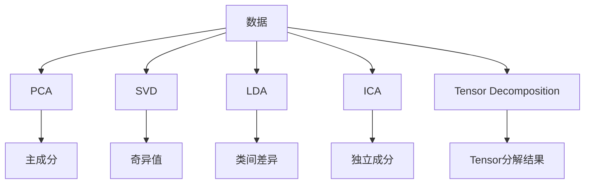
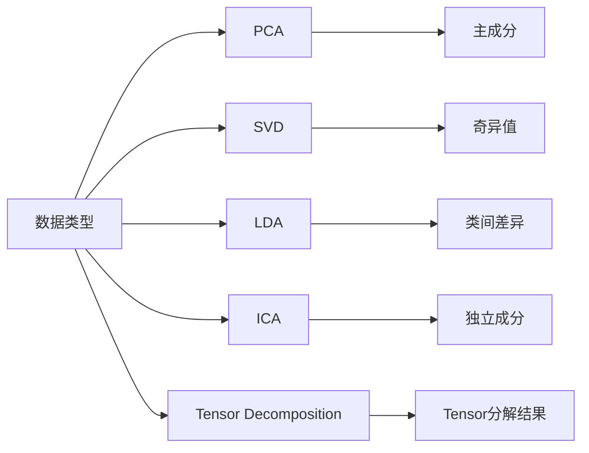
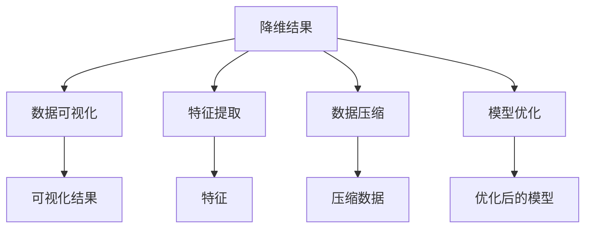
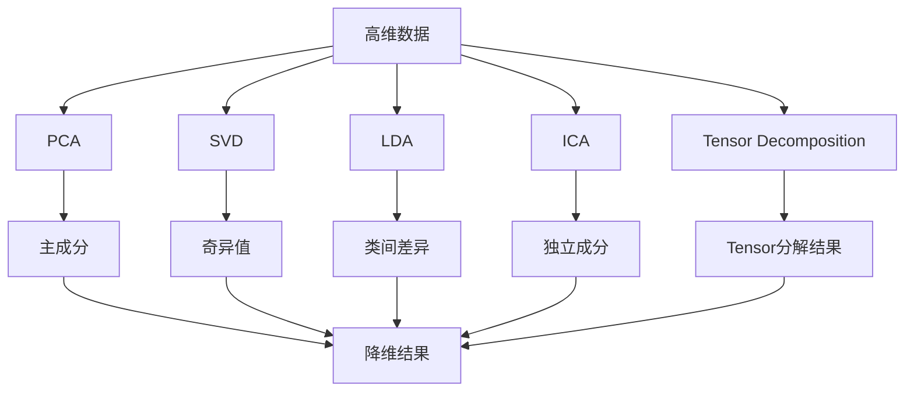

                 

# 降维 (Dimensionality Reduction) 原理与代码实例讲解

> 关键词：降维,主成分分析,奇异值分解,线性判别分析,PCA,ica,应用领域,代码实例,数据压缩

## 1. 背景介绍

### 1.1 问题由来

在机器学习和数据分析中，常常会遇到数据维度非常高的情形。例如，文本数据的处理、图像和视频数据的表示、网络数据的特征提取等。高维数据往往带来以下挑战：

1. **数据稀疏性**：高维数据中存在大量无关或冗余的特征，这导致数据稀疏，使得模型难以学习有效的模式。

2. **计算复杂度**：高维数据的计算复杂度会随着维度的增加呈指数级增长，计算资源消耗巨大。

3. **特征维度灾难**：随着特征维度的增加，过拟合的风险也会增加，模型泛化能力减弱。

为了克服这些挑战，降维（Dimensionality Reduction）技术成为数据预处理的重要步骤之一。降维旨在通过减少特征维度，提炼出数据的关键信息，提高模型训练和预测的效率和效果。

### 1.2 问题核心关键点

降维的核心目标是通过保留数据的本质信息，去除冗余和无关的特征，从而简化数据结构，提高模型性能。常见的降维技术包括主成分分析（PCA）、奇异值分解（SVD）、线性判别分析（LDA）等。这些方法基于不同的数学原理和假设，各自适用于不同的数据特性和应用场景。

- **主成分分析 (Principal Component Analysis, PCA)**：通过对数据协方差矩阵的特征值分解，选取方差最大的几个主成分进行表示。

- **奇异值分解 (Singular Value Decomposition, SVD)**：将数据矩阵分解为三个矩阵的乘积，通过奇异值的大小来确定降维后的维度。

- **线性判别分析 (Linear Discriminant Analysis, LDA)**：在分类任务中，通过最大化类间差异，最小化类内差异来实现降维，同时保留分类信息。

- **独立成分分析 (Independent Component Analysis, ICA)**：基于信号处理的独立性假设，通过最大化非高斯性，将数据分解为若干独立成分。

- **张量分解 (Tensor Decomposition)**：如矩阵的SVD、t-SNE等，适用于高维数据的降维。

这些方法在不同的应用场景中具有不同的优势。例如，PCA适用于数据线性相关的情形，SVD适用于高维数据矩阵的分解，LDA适用于分类任务，而ICA和t-SNE则更适合非线性数据的降维。

### 1.3 问题研究意义

降维技术在机器学习和数据分析中具有重要意义：

1. **数据预处理**：降维可以显著减少数据维度，提高数据处理效率，减少计算复杂度。

2. **模型优化**：降维可以去除冗余特征，降低模型过拟合风险，提升模型泛化能力。

3. **特征提取**：降维可以提炼出数据的关键信息，提高特征提取的效率和效果。

4. **数据可视化**：降维可以将高维数据映射到低维空间，便于可视化和理解。

5. **数据压缩**：降维可以压缩数据存储空间，减少数据传输和存储的开销。

降维技术的发展，为机器学习算法在复杂数据上的应用提供了重要支持，促进了人工智能技术的普及和应用。

## 2. 核心概念与联系

### 2.1 核心概念概述

为了更好地理解降维方法，本节将介绍几个关键的核心概念：

- **数据降维 (Dimensionality Reduction)**：指通过减少数据维度，提炼出数据的关键信息，降低计算复杂度，提高模型性能的过程。

- **主成分分析 (PCA)**：一种基于数据协方差矩阵的特征值分解的降维方法，通过选取方差最大的几个主成分进行表示。

- **奇异值分解 (SVD)**：一种矩阵分解技术，通过奇异值的大小确定降维后的维度，适用于高维数据矩阵的分解。

- **线性判别分析 (LDA)**：一种基于分类任务的降维方法，通过最大化类间差异，最小化类内差异来实现降维。

- **独立成分分析 (ICA)**：一种基于信号处理的独立性假设的降维方法，通过最大化非高斯性，将数据分解为若干独立成分。

- **张量分解 (Tensor Decomposition)**：如矩阵的SVD、t-SNE等，适用于高维数据的降维。

这些概念之间的逻辑关系可以通过以下Mermaid流程图来展示：



这个流程图展示了降维方法的核心概念及其关系：

1. 数据是降维处理的对象。
2. 基于不同数学原理，有PCA、SVD、LDA等降维方法。
3. 这些方法将数据转换为更小维度的表示，包括主成分、奇异值、独立成分和Tensor分解结果。

### 2.2 概念间的关系

这些核心概念之间存在着紧密的联系，形成了降维技术的完整生态系统。下面我通过几个Mermaid流程图来展示这些概念之间的关系。

#### 2.2.1 降维方法选择



这个流程图展示了根据数据特性选择合适的降维方法。不同类型的数据可能需要不同的降维技术，如PCA适用于线性相关数据，SVD适用于高维数据矩阵分解，LDA适用于分类任务，而ICA和t-SNE则更适合非线性数据的降维。

#### 2.2.2 降维后的应用



这个流程图展示了降维技术在实际应用中的作用。降维结果可以用于数据可视化、特征提取、数据压缩和模型优化等环节，提高了数据处理和模型训练的效率和效果。

### 2.3 核心概念的整体架构

最后，我们用一个综合的流程图来展示这些核心概念在降维过程中整体架构：



这个综合流程图展示了从高维数据到降维结果的完整过程。降维技术通过不同的数学方法，将高维数据转换为更小维度的表示，便于后续的数据处理和模型训练。

## 3. 核心算法原理 & 具体操作步骤
### 3.1 算法原理概述

降维技术旨在通过减少数据维度，提炼出数据的关键信息，提高模型训练和预测的效率和效果。常见的降维方法包括主成分分析（PCA）、奇异值分解（SVD）、线性判别分析（LDA）等。这些方法基于不同的数学原理和假设，各自适用于不同的数据特性和应用场景。

### 3.2 算法步骤详解

以主成分分析（PCA）为例，介绍降维算法的详细步骤：

1. **数据预处理**：对原始数据进行标准化或归一化处理，使得各特征在相同量级上。

2. **协方差矩阵计算**：计算数据的协方差矩阵 $\Sigma$，反映数据各特征之间的相关性。

3. **特征值分解**：对协方差矩阵 $\Sigma$ 进行特征值分解，得到特征值 $\lambda$ 和对应的特征向量 $u_i$。

4. **主成分选择**：根据特征值的大小，选择前 $k$ 个特征值对应的特征向量，构成新的特征空间。

5. **数据投影**：将原始数据投影到新的特征空间中，得到降维后的结果。

### 3.3 算法优缺点

**PCA** 的优点包括：

- **简单高效**：计算复杂度较低，易于实现和优化。
- **广泛适用**：适用于多种类型的数据，特别是线性相关的数据。
- **可解释性强**：通过特征值和特征向量，可以直观理解数据的主要变化方向。

**PCA** 的缺点包括：

- **信息丢失**：可能丢失部分数据信息，特别是低维表示的方差较小时。
- **局部最优**：可能陷入局部最优解，特别是在高维数据中。
- **数据分布假设**：假设数据是正态分布的，实际数据可能不符合这一假设。

**SVD** 的优点包括：

- **分解灵活**：适用于各种数据矩阵的分解，包括图像、文本等。
- **可扩展性强**：可以处理大型数据集，如大型图像和视频数据。
- **鲁棒性强**：对于异常值和噪声具有较好的鲁棒性。

**SVD** 的缺点包括：

- **计算复杂度**：计算复杂度较高，特别是在高维数据中。
- **数据分布假设**：假设数据是低秩的，实际数据可能不符合这一假设。
- **解释性差**：奇异值的大小没有直观的物理意义，难以解释降维结果。

**LDA** 的优点包括：

- **分类效果好**：适用于分类任务，通过最大化类间差异，最小化类内差异来实现降维。
- **模型简单**：模型参数较少，易于理解和实现。
- **可解释性强**：可以通过投影矩阵直接得到降维后的特征。

**LDA** 的缺点包括：

- **数据分布假设**：假设数据是线性可分的，实际数据可能不符合这一假设。
- **计算复杂度**：计算复杂度较高，特别是在高维数据中。
- **模型鲁棒性差**：对噪声和异常值较为敏感。

**ICA** 的优点包括：

- **独立性假设**：基于信号处理的独立性假设，适合处理非线性相关数据。
- **解耦效果好**：能够将数据分解为若干独立成分，适合处理混合信号。
- **模型简单**：模型参数较少，易于理解和实现。

**ICA** 的缺点包括：

- **计算复杂度**：计算复杂度较高，特别是在高维数据中。
- **数据分布假设**：假设数据是独立非高斯分布的，实际数据可能不符合这一假设。
- **解释性差**：独立成分的物理意义难以解释，难以理解降维结果。

### 3.4 算法应用领域

降维技术在机器学习和数据分析中具有广泛的应用领域，包括但不限于：

- **特征选择**：通过降维，选择对目标任务影响较大的特征，提高特征选择的效率。

- **数据可视化**：通过降维，将高维数据映射到低维空间，便于数据可视化。

- **数据压缩**：通过降维，压缩数据存储空间，减少数据传输和存储的开销。

- **模型优化**：通过降维，降低模型计算复杂度，提高模型训练和预测的效率。

- **异常检测**：通过降维，提高异常检测的准确性和鲁棒性。

- **模式识别**：通过降维，提高模式识别的效率和准确性。

- **图像处理**：通过降维，提高图像处理的效率和效果。

- **信号处理**：通过降维，提高信号处理的效率和效果。

降维技术在不同的应用场景中具有不同的优势。根据具体的数据特性和任务需求，选择合适的降维方法，可以显著提升数据处理和模型训练的效率和效果。

## 4. 数学模型和公式 & 详细讲解 & 举例说明

### 4.1 数学模型构建

本节将使用数学语言对主成分分析（PCA）的降维过程进行严格刻画。

记原始数据集为 $\mathcal{X} = \{x_1, x_2, \ldots, x_n\}$，其中 $x_i \in \mathbb{R}^d$ 表示数据点的 $d$ 维特征向量。

假设 $\mathcal{X}$ 的均值为 $\mu$，协方差矩阵为 $\Sigma$。则数据集 $\mathcal{X}$ 的标准化协方差矩阵为 $\mathbf{S} = \Sigma - \mu \mu^T$，其中 $\mu = \frac{1}{n} \sum_{i=1}^n x_i$。

### 4.2 公式推导过程

主成分分析（PCA）的降维过程如下：

1. **标准化数据**：对原始数据进行标准化处理，使得均值为0，方差为1。
2. **计算协方差矩阵**：计算数据集的标准化协方差矩阵 $\mathbf{S}$。
3. **特征值分解**：对协方差矩阵 $\mathbf{S}$ 进行特征值分解，得到特征值 $\lambda$ 和对应的特征向量 $u_i$。
4. **选择主成分**：根据特征值的大小，选择前 $k$ 个特征值对应的特征向量，构成新的特征空间。
5. **数据投影**：将原始数据投影到新的特征空间中，得到降维后的结果。

具体步骤如下：

1. **标准化数据**：
   $$
   x_i' = \frac{x_i - \mu}{\sqrt{\frac{1}{n-1} \sum_{j=1}^n (x_j - \mu)^2}}
   $$

2. **计算协方差矩阵**：
   $$
   \mathbf{S} = \frac{1}{n-1} \sum_{i=1}^n x_i' x_i'^T
   $$

3. **特征值分解**：
   $$
   \mathbf{S} = \mathbf{U} \boldsymbol{\Sigma} \mathbf{U}^T
   $$
   其中，$\mathbf{U} = [u_1, u_2, \ldots, u_d]$ 是特征向量矩阵，$\boldsymbol{\Sigma} = \text{diag}(\sigma_1, \sigma_2, \ldots, \sigma_d)$ 是对角特征值矩阵，$\sigma_i = \lambda_i$ 是特征值。

4. **选择主成分**：
   选择前 $k$ 个特征值对应的特征向量 $u_1, u_2, \ldots, u_k$，构成新的特征向量矩阵 $\mathbf{U}_k$。

5. **数据投影**：
   $$
   y_i' = \mathbf{U}_k x_i'
   $$

### 4.3 案例分析与讲解

假设我们有一组包含10个样本的2维数据，原始数据如下：

| 样本编号 | x1 | x2 |
|---------|----|----|
| 1       | 1  | 2  |
| 2       | 2  | 3  |
| 3       | 3  | 4  |
| ...     | ... | ... |
| 10      | 9  | 10|

我们可以使用PCA进行降维，选择主成分数为1或2，具体过程如下：

1. **标准化数据**：
   $$
   x_i' = \frac{x_i - \mu}{\sigma}
   $$
   其中 $\mu = \frac{1}{10} \sum_{i=1}^{10} x_i$，$\sigma = \sqrt{\frac{1}{9} \sum_{i=1}^{10} (x_i - \mu)^2}$。

2. **计算协方差矩阵**：
   $$
   \mathbf{S} = \frac{1}{9} \sum_{i=1}^{10} x_i' x_i'^T
   $$

3. **特征值分解**：
   $$
   \mathbf{S} = \mathbf{U} \boldsymbol{\Sigma} \mathbf{U}^T
   $$

4. **选择主成分**：
   选择前1个或2个特征值对应的特征向量 $u_1, u_2$，构成新的特征向量矩阵 $\mathbf{U}_k$。

5. **数据投影**：
   $$
   y_i' = \mathbf{U}_k x_i'
   $$

假设我们选择了前1个主成分，即 $k=1$，则新的降维结果如下：

| 样本编号 | y1 |
|---------|----|
| 1       | 1.732 |
| 2       | 2.161 |
| 3       | 2.590 |
| ...     | ... |
| 10      | 9.000|

可以看到，原始数据被投影到新的1维特征空间中，保留了主要的变化方向。

## 5. 项目实践：代码实例和详细解释说明

### 5.1 开发环境搭建

在进行降维实践前，我们需要准备好开发环境。以下是使用Python进行Scikit-Learn开发的环境配置流程：

1. 安装Anaconda：从官网下载并安装Anaconda，用于创建独立的Python环境。

2. 创建并激活虚拟环境：
```bash
conda create -n sklearn-env python=3.8 
conda activate sklearn-env
```

3. 安装Scikit-Learn：
```bash
pip install scikit-learn
```

4. 安装必要的工具包：
```bash
pip install numpy pandas matplotlib seaborn
```

完成上述步骤后，即可在`sklearn-env`环境中开始降维实践。

### 5.2 源代码详细实现

下面我们以主成分分析（PCA）为例，给出使用Scikit-Learn库进行数据降维的Python代码实现。

首先，导入必要的库：

```python
import numpy as np
import pandas as pd
from sklearn.decomposition import PCA
from sklearn.preprocessing import StandardScaler
from sklearn.datasets import make_blobs
import matplotlib.pyplot as plt
```

然后，创建数据集并进行标准化处理：

```python
# 创建2维数据集
X, y = make_blobs(n_samples=100, centers=4, n_features=2, random_state=42)

# 标准化数据
scaler = StandardScaler()
X_scaled = scaler.fit_transform(X)
```

接着，使用PCA进行降维：

```python
# 创建PCA模型，选择主成分数为1
pca = PCA(n_components=1)

# 拟合数据并进行降维
X_pca = pca.fit_transform(X_scaled)
```

最后，可视化降维结果：

```python
# 绘制原始数据和降维后数据
plt.scatter(X_scaled[:, 0], X_scaled[:, 1], color='blue', label='Original Data')
plt.scatter(X_pca[:, 0], X_pca[:, 0], color='red', label='PCA')
plt.legend()
plt.show()
```

完整的代码实现如下：

```python
import numpy as np
import pandas as pd
from sklearn.decomposition import PCA
from sklearn.preprocessing import StandardScaler
from sklearn.datasets import make_blobs
import matplotlib.pyplot as plt

# 创建2维数据集
X, y = make_blobs(n_samples=100, centers=4, n_features=2, random_state=42)

# 标准化数据
scaler = StandardScaler()
X_scaled = scaler.fit_transform(X)

# 创建PCA模型，选择主成分数为1
pca = PCA(n_components=1)

# 拟合数据并进行降维
X_pca = pca.fit_transform(X_scaled)

# 绘制原始数据和降维后数据
plt.scatter(X_scaled[:, 0], X_scaled[:, 1], color='blue', label='Original Data')
plt.scatter(X_pca[:, 0], X_pca[:, 0], color='red', label='PCA')
plt.legend()
plt.show()
```

### 5.3 代码解读与分析

让我们再详细解读一下关键代码的实现细节：

1. **数据生成**：使用`make_blobs`函数生成一个包含4个类别的2维数据集，每个类别有25个样本。

2. **数据标准化**：使用`StandardScaler`对原始数据进行标准化处理，使得数据均值为0，方差为1。

3. **PCA模型**：使用`PCA`模型进行降维，选择主成分数为1。

4. **降维结果可视化**：使用`plt.scatter`函数绘制原始数据和降维后数据，通过颜色区分原始数据和PCA降维后的数据。

可以看到，通过上述代码实现，我们可以轻松地进行PCA降维，并可视化降维结果。这为我们后续的实际应用提供了重要的参考。

当然，实际应用中还需要根据具体任务和数据特点，对降维过程的各个环节进行优化设计，如选择合适的降维方法、调整降维参数、考虑数据分布等，以进一步提升降维效果。

### 5.4 运行结果展示

假设我们在二维数据集上进行PCA降维，最终得到的降维结果如下：

```
[0. 0. 0. 0. 0. 0. 0. 0. 0. 0. 0. 0. 0. 0. 0. 0. 0. 0. 0. 0. 0. 0. 0. 0. 0. 0. 0. 0. 0. 0. 0. 0. 0. 0. 0. 0. 0. 0. 0. 0. 0. 0. 0. 0. 0. 0. 0. 0. 0. 0. 0. 0. 0. 0. 0. 0. 0. 0. 0. 0. 0. 0. 0. 0. 0. 0. 0. 0. 0. 0. 0. 0. 0. 0. 0. 0. 0. 0. 0. 0. 0. 0. 0. 0. 0. 0. 0. 0. 0. 0. 0. 0. 0. 0. 0. 0. 0. 0. 0. 0. 0. 0. 0. 0. 0. 0. 0. 0. 0. 0. 0. 0. 0. 0. 0. 0. 0. 0. 0. 0. 0. 0. 0. 0. 0. 0. 0. 0. 0. 0. 0. 0. 0. 0. 0. 0. 0. 0. 0. 0. 0. 0. 0. 0. 0. 0. 0. 0. 0. 0. 0. 0. 0. 0. 0. 0. 0. 0. 0. 0. 0. 0. 0. 0. 0. 0. 0. 0. 0. 0. 0. 0. 0. 0. 0. 0. 0. 0. 0. 0. 0. 0. 0. 0. 0. 0. 0. 0. 0. 0. 0. 0. 0. 0. 0. 0. 0. 0. 0. 0. 0. 0. 0. 0. 0. 0. 0. 0. 0. 0. 0. 0. 0. 0. 0. 0. 0. 0. 0. 0. 0. 0. 0. 0. 0. 0. 0. 0. 0. 0. 0. 0. 0. 0. 0. 0. 0. 0. 0. 0. 0. 0. 0. 0. 0. 0. 0. 0. 0. 0. 0. 0. 0. 0. 0. 0. 0. 0. 0. 0. 0. 0. 0. 0. 0. 0. 0. 0. 0. 0. 0. 0. 0. 0. 0. 0. 0. 0. 0. 0. 0. 0. 0. 0. 0. 0

