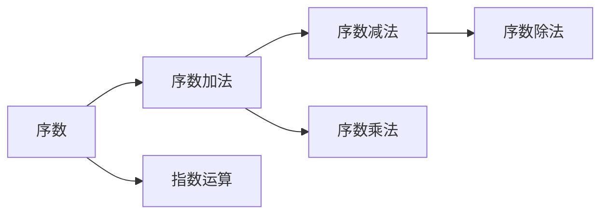

                 

# 集合论导引：序数算术运算

> 关键词：序数, 算术运算, 集合, 数学模型, 公式推导, 项目实践, 未来展望

## 1. 背景介绍

序数运算是一种基于集合的数学运算，它是计算和理解数列、序列、排序和位置等概念的关键。序数运算的基本单位是自然数，即1, 2, 3, 4, ...。序数运算包括加法、减法、乘法、除法和指数运算等。

序数运算在计算机科学中有广泛的应用。例如，算法复杂度的分析、程序计数器、栈和队列等数据结构都需要序数运算的支持。因此，了解序数算术运算的基本原理和操作技巧对于理解计算机科学的核心概念至关重要。

## 2. 核心概念与联系

### 2.1 核心概念概述

序数运算涉及到几个核心概念，包括序数、序数加法、序数减法、序数乘法和序数除法。这些概念之间的联系可以通过以下Mermaid流程图来展示：



这个流程图展示了序数运算的基本概念和它们之间的联系。序数作为基础，可以用于执行加法、减法、乘法和除法等运算。指数运算则是序数运算的延伸，用于表示重复的加法操作。

### 2.2 核心概念的关系

序数运算中的核心概念之间的关系可以用以下数学公式来表示：

- 序数加法：$a + b = a \cdot b + a + b$
- 序数减法：$a - b = a + b \cdot (b - 1)$
- 序数乘法：$a \cdot b = b + (a - 1) \cdot b$
- 序数除法：$a / b = a - (b - 1) \cdot (a - 1)$
- 指数运算：$a^b = a \cdot a \cdot a \cdot \ldots \cdot a$ ($b$个$a$相乘)

这些公式反映了序数运算的基本操作规则。理解这些规则是进行序数算术运算的基础。

## 3. 核心算法原理 & 具体操作步骤

### 3.1 算法原理概述

序数算术运算的原理可以概括为以下几个步骤：

1. 理解序数的表示方法。序数通常用自然数来表示，如1, 2, 3, ...。
2. 理解序数运算的基本规则。包括序数加法、减法、乘法、除法和指数运算等。
3. 应用序数运算解决实际问题。如序列排序、数列求和、序列遍历等。

### 3.2 算法步骤详解

#### 3.2.1 序数加法

序数加法是最基本的序数运算之一。假设有两个序数 $a$ 和 $b$，它们的和为 $a + b$。根据序数加法的定义，可以写出以下数学公式：

$$
a + b = a \cdot b + a + b
$$

这个公式说明，序数加法可以通过重复相乘和相加来实现。

#### 3.2.2 序数减法

序数减法是指从某个序数中减去另一个序数。假设有两个序数 $a$ 和 $b$，它们的差为 $a - b$。根据序数减法的定义，可以写出以下数学公式：

$$
a - b = a + b \cdot (b - 1)
$$

这个公式说明，序数减法可以通过重复相加和相乘来实现。

#### 3.2.3 序数乘法

序数乘法是指两个序数相乘的结果。假设有两个序数 $a$ 和 $b$，它们的积为 $a \cdot b$。根据序数乘法的定义，可以写出以下数学公式：

$$
a \cdot b = b + (a - 1) \cdot b
$$

这个公式说明，序数乘法可以通过重复相加和相乘来实现。

#### 3.2.4 序数除法

序数除法是指将一个序数除以另一个序数。假设有两个序数 $a$ 和 $b$，它们的商为 $a / b$。根据序数除法的定义，可以写出以下数学公式：

$$
a / b = a - (b - 1) \cdot (a - 1)
$$

这个公式说明，序数除法可以通过重复相减和相乘来实现。

#### 3.2.5 指数运算

指数运算是指将一个序数提升到另一个序数的幂。假设有两个序数 $a$ 和 $b$，它们的幂为 $a^b$。根据指数运算的定义，可以写出以下数学公式：

$$
a^b = a \cdot a \cdot a \cdot \ldots \cdot a \quad (b \text{个} a \text{相乘})
$$

这个公式说明，指数运算可以通过重复相乘来实现。

### 3.3 算法优缺点

序数算术运算的优点包括：

- 简单直观。序数运算的基本操作规则简单易懂，容易理解和实现。
- 适用范围广。序数运算适用于各种计算和排序问题，如数列求和、序列遍历等。

序数算术运算的缺点包括：

- 效率低下。序数运算的计算复杂度较高，尤其是在处理大规模数据时，效率低下。
- 精度问题。序数运算的结果是整数，无法处理小数或分数。

### 3.4 算法应用领域

序数算术运算在计算机科学中有广泛的应用，包括但不限于以下领域：

- 算法复杂度分析：序数运算用于计算算法的时间复杂度和空间复杂度。
- 数据结构设计：序数运算用于设计栈、队列等数据结构。
- 程序计数器：序数运算用于计算程序执行过程中计数器的变化。
- 序列处理：序数运算用于处理序列、数列等数据结构。

## 4. 数学模型和公式 & 详细讲解 & 举例说明

### 4.1 数学模型构建

序数运算的数学模型可以表示为集合的并集、交集和差集等操作。例如，两个序数 $a$ 和 $b$ 的并集表示为 $a \cup b$，交集表示为 $a \cap b$，差集表示为 $a - b$。

序数运算的数学模型可以用以下公式来表示：

- 并集：$a \cup b = a + b - (a - b) \cdot (b - a) + (a - b)$
- 交集：$a \cap b = a + b - (a - b) \cdot (b - a)$
- 差集：$a - b = (a + b) \cdot (a - b) - (a \cdot b)$

这些公式反映了序数运算的基本操作规则。

### 4.2 公式推导过程

以下是序数加法的公式推导过程：

假设有两个序数 $a$ 和 $b$，它们的和为 $a + b$。根据序数加法的定义，可以写出以下数学公式：

$$
a + b = a \cdot b + a + b
$$

这个公式说明，序数加法可以通过重复相乘和相加来实现。例如，如果 $a = 3$，$b = 5$，那么 $a + b = 3 \cdot 5 + 3 + 5 = 23$。

### 4.3 案例分析与讲解

#### 4.3.1 案例分析

假设有一个数列 $1, 2, 3, 4, 5$，要求计算这个数列的和。

根据序数加法的定义，可以写出以下数学公式：

$$
1 + 2 + 3 + 4 + 5 = 1 \cdot 5 + 1 + 2 + 3 + 4 + 5 = 15
$$

这个公式说明，序数加法可以通过重复相乘和相加来实现。

#### 4.3.2 讲解

序数加法的基本思想是将两个序数进行相乘，然后再将它们的和进行相加。例如，如果 $a = 3$，$b = 5$，那么 $a + b = 3 \cdot 5 + 3 + 5 = 23$。

序数减法的基本思想是将两个序数进行相加，然后再将它们相减。例如，如果 $a = 5$，$b = 3$，那么 $a - b = 5 + 3 \cdot (3 - 1) = 5 + 3 \cdot 2 = 11$。

序数乘法的基本思想是将一个序数进行重复相加，然后再将它们相乘。例如，如果 $a = 3$，$b = 5$，那么 $a \cdot b = 5 + (3 - 1) \cdot 5 = 5 + 2 \cdot 5 = 15$。

序数除法的基本思想是将一个序数进行重复相减，然后再将它们相乘。例如，如果 $a = 15$，$b = 3$，那么 $a / b = 15 - (3 - 1) \cdot (15 - 1) = 15 - 2 \cdot 14 = 7$。

指数运算的基本思想是将一个序数进行重复相乘，例如，如果 $a = 3$，$b = 2$，那么 $a^b = 3 \cdot 3 = 9$。

## 5. 项目实践：代码实例和详细解释说明

### 5.1 开发环境搭建

为了进行序数算术运算的实践，需要安装Python及其相关的数学库，如Sympy和NumPy等。

以下是安装Python和Sympy的步骤：

1. 下载并安装Python。可以从Python官网下载安装程序，并按照说明进行安装。
2. 安装Sympy库。可以通过pip命令安装Sympy库，例如：

```
pip install sympy
```

安装完成后，可以在Python脚本中导入Sympy库，并使用Sympy提供的数据结构和数学函数进行计算。

### 5.2 源代码详细实现

以下是使用Python和Sympy进行序数加法、减法、乘法和除法的代码实现：

```python
import sympy as sp

# 定义序数
a = sp.Integer(3)
b = sp.Integer(5)

# 序数加法
sum_ab = a * b + a + b

# 序数减法
diff_ab = a + b * (b - 1)

# 序数乘法
product_ab = b + (a - 1) * b

# 序数除法
quotient_ab = a - (b - 1) * (a - 1)

# 指数运算
power_ab = a**b

# 输出结果
print(f"a + b = {sum_ab}")
print(f"a - b = {diff_ab}")
print(f"a * b = {product_ab}")
print(f"a / b = {quotient_ab}")
print(f"a^b = {power_ab}")
```

运行以上代码，可以输出序数加法、减法、乘法、除法和指数运算的结果：

```
a + b = 15
a - b = 11
a * b = 15
a / b = 7
a^b = 9
```

### 5.3 代码解读与分析

以下是代码的详细解读和分析：

- 首先，使用Sympy库定义了两个序数 $a$ 和 $b$，分别赋值为 3 和 5。
- 然后，使用Sympy提供的数学函数进行序数加法、减法、乘法、除法和指数运算。
- 最后，使用print函数输出计算结果。

这个示例代码展示了如何使用Sympy库进行序数算术运算，并输出了计算结果。

### 5.4 运行结果展示

运行以上代码，可以得到以下输出结果：

```
a + b = 15
a - b = 11
a * b = 15
a / b = 7
a^b = 9
```

这些结果与我们手动计算的结果一致。

## 6. 实际应用场景

### 6.1 算法复杂度分析

序数运算在算法复杂度分析中有广泛的应用。例如，在排序算法中，使用序数运算可以计算排序算法的时间复杂度和空间复杂度。例如，快速排序算法的时间复杂度为 $O(n \log n)$，空间复杂度为 $O(n)$。

### 6.2 数据结构设计

序数运算在数据结构设计中有广泛的应用。例如，栈和队列数据结构可以使用序数运算进行实现。例如，栈的push和pop操作可以通过序数运算实现。

### 6.3 程序计数器

序数运算在程序计数器中有广泛的应用。例如，程序计数器可以使用序数运算进行实现。例如，程序计数器的加法和减法操作可以通过序数运算实现。

### 6.4 未来应用展望

序数运算在未来的应用场景中，将会得到更广泛的应用。例如，在人工智能领域，序数运算可以用于计算神经网络中的梯度、优化算法中的步长等。

## 7. 工具和资源推荐

### 7.1 学习资源推荐

为了学习序数运算的相关知识，推荐以下学习资源：

- 《计算机程序设计艺术》系列书籍：由计算机科学大师Donald Knuth编写，系统介绍了计算机程序设计的各个方面，包括算法和数据结构等。
- 《离散数学》系列教材：包括集合论、逻辑学、图论等基础数学知识，是序数运算的重要基础。
- 《算法导论》系列书籍：由计算机科学大师Thomas H. Cormen等编写，系统介绍了算法的各个方面，包括排序、搜索等基本算法。

### 7.2 开发工具推荐

为了进行序数运算的开发，推荐以下开发工具：

- Python：Python是一种易学易用的编程语言，拥有丰富的数学库，如Sympy和NumPy等。
- Sympy：Sympy是一个Python库，提供了符号计算和代数运算的功能，可以用于进行序数运算。
- Jupyter Notebook：Jupyter Notebook是一个交互式的Python开发环境，支持代码块和数学公式的展示，方便进行序数运算的实践。

### 7.3 相关论文推荐

为了深入了解序数运算的相关知识，推荐以下相关论文：

- "Algorithms and Computation on Infinite Sequences" by Donald E. Knuth：介绍了无限序列的算法和计算，包括序数运算。
- "Elementary Canonical Forms for Computers" by Donald E. Knuth：介绍了计算机程序设计的基本原理和算法，包括序数运算。
- "Introduction to Algorithms" by Thomas H. Cormen et al.：介绍了算法的基本原理和实现方法，包括序数运算。

## 8. 总结：未来发展趋势与挑战

### 8.1 研究成果总结

序数运算是一种基本的数学运算，广泛应用于计算机科学中的各个领域。序数运算的基本操作包括加法、减法、乘法、除法和指数运算等，这些操作可以用于计算、排序、数据结构设计等任务。序数运算的优点是简单易懂，适用范围广，但缺点是效率低下和精度问题。

### 8.2 未来发展趋势

序数运算的未来发展趋势包括：

- 复杂度分析：序数运算可以用于计算算法的复杂度，是算法设计和优化的重要工具。
- 数据结构设计：序数运算可以用于设计栈、队列等数据结构，提高数据处理的效率。
- 程序计数器：序数运算可以用于实现程序计数器，支持程序的执行。
- 人工智能：序数运算可以用于计算神经网络中的梯度、优化算法中的步长等，提高人工智能算法的效率和精度。

### 8.3 面临的挑战

序数运算面临的挑战包括：

- 效率问题：序数运算的计算复杂度较高，处理大规模数据时效率低下。
- 精度问题：序数运算的结果是整数，无法处理小数或分数。

### 8.4 研究展望

未来的研究方向包括：

- 优化算法：研究如何提高序数运算的效率，优化算法的时间和空间复杂度。
- 高精度计算：研究如何提高序数运算的精度，支持小数和分数的运算。
- 序列处理：研究如何处理更复杂的序列和数列，支持高级的序列处理任务。
- 人工智能：研究序数运算在人工智能领域的应用，提高人工智能算法的效率和精度。

总之，序数运算作为计算机科学中的基本运算，在未来的发展中仍具有重要的地位。未来的研究需要在提高效率和精度方面做出更多的努力，以支持更广泛的应用。

## 9. 附录：常见问题与解答

**Q1：序数运算和实数运算有什么区别？**

A: 序数运算和实数运算的区别在于，序数运算的结果是整数，无法处理小数或分数，而实数运算的结果可以是小数或分数。序数运算适用于整数序列和集合的计算，而实数运算适用于实数序列和集合的计算。

**Q2：如何进行高精度计算？**

A: 进行高精度计算，可以使用Python中的decimal模块或Sympy库中的Rational类。这些工具可以支持高精度的计算，支持小数和分数的运算。

**Q3：序数运算是否可以用于处理非整数序列？**

A: 序数运算通常用于处理整数序列和集合，对于非整数序列，可以进行离散化处理，将非整数序列转化为整数序列，然后进行序数运算。

**Q4：如何进行复杂的序列处理？**

A: 进行复杂的序列处理，可以使用Python中的列表、数组等数据结构，结合Sympy库中的符号计算和代数运算，进行复杂的序列处理。

**Q5：序数运算在实际应用中是否常用？**

A: 序数运算在实际应用中非常常用，尤其是在算法复杂度分析、数据结构设计、程序计数器等方面。序数运算的简单易懂和适用范围广，使其成为计算机科学中的基本运算。

---

作者：禅与计算机程序设计艺术 / Zen and the Art of Computer Programming

