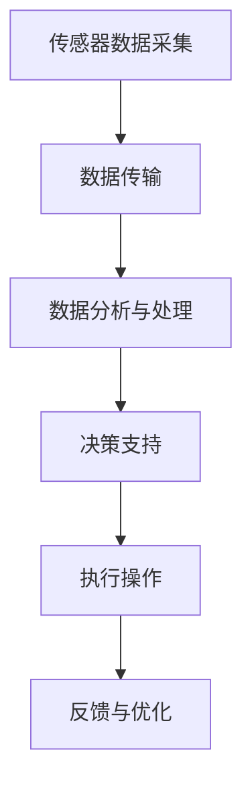

> 物联网(IoT), 传感器集成, 公共交通, 智能化运营, 数据分析, 乘客体验, 精细化管理, 智能交通系统, 云计算, 大数据分析

# 物联网(IoT)技术和各种传感器设备的集成：物联网在公共交通中的应用

## 1. 背景介绍

随着科技的飞速发展，物联网（Internet of Things，IoT）技术正在深刻地改变着我们的生活方式。在公共交通领域，IoT技术通过集成各种传感器设备，不仅提升了运营效率，也极大地改善了乘客的出行体验。本文将深入探讨物联网技术在公共交通中的应用，分析其核心概念、集成方法以及未来发展趋势。

### 1.1 公共交通的现状与挑战

公共交通是现代城市的重要组成部分，其效率和舒适度直接关系到城市居民的生活质量。然而，传统的公共交通系统面临着以下挑战：

- **运营效率低下**：缺乏实时监控和调度手段，导致资源浪费和乘客等待时间过长。
- **乘客体验不佳**：信息不透明，乘客难以获取出行信息，影响出行决策。
- **管理难度大**：缺乏有效的数据分析和决策支持，难以进行精细化管理。

### 1.2 物联网在公共交通中的应用

物联网技术通过集成各种传感器设备，可以实现公共交通系统的智能化升级，解决上述问题。以下是一些关键应用：

- **实时监控**：通过传感器实时监控车辆位置、乘客流量等信息。
- **智能调度**：根据实时数据优化线路调度，提高运营效率。
- **信息共享**：通过移动应用等渠道向乘客提供实时信息，提升出行体验。
- **数据分析**：通过大数据分析优化运营策略，实现精细化管理。

## 2. 核心概念与联系

### 2.1 物联网(IoT)概念

物联网是由物理设备、互联网、云计算等共同构成的生态系统，通过传感器和执行器实现设备与设备的互联互通。

### 2.2 传感器设备

传感器是物联网的“感官”，能够感知环境变化并将信息传递给处理系统。在公共交通领域，常见的传感器包括：

- **GPS模块**：用于定位交通工具的位置。
- **客流计数器**：用于统计车厢内乘客数量。
- **温湿度传感器**：用于监测车厢内的温度和湿度。
- **摄像头**：用于监控车厢内的安全和秩序。

### 2.3 Mermaid 流程图

以下是一个简化的物联网在公共交通中的应用流程图：



## 3. 核心算法原理 & 具体操作步骤

### 3.1 算法原理概述

物联网在公共交通中的应用涉及多种算法，包括：

- **数据采集与传输**：使用无线传感器网络（WSN）技术采集数据，并通过移动通信网络传输。
- **数据存储与管理**：使用云计算平台存储和管理大量数据。
- **数据分析与处理**：使用大数据分析技术处理和分析数据，提取有价值的信息。
- **决策支持**：根据分析结果制定优化策略，如线路调度、车辆调度等。

### 3.2 算法步骤详解

1. **数据采集**：使用传感器设备采集车辆位置、乘客流量、环境参数等信息。
2. **数据传输**：将采集到的数据通过无线通信网络传输到云端。
3. **数据存储**：在云端存储平台存储采集到的数据，以便后续分析和处理。
4. **数据分析**：使用大数据分析技术对存储的数据进行分析，提取有价值的信息。
5. **决策支持**：根据分析结果制定优化策略，如调整线路、增加车辆等。
6. **执行操作**：执行优化策略，如调整车辆调度、发布实时信息等。
7. **反馈与优化**：根据执行结果反馈调整策略，持续优化系统性能。

### 3.3 算法优缺点

**优点**：

- 提高运营效率：实时监控和调度，减少资源浪费。
- 优化乘客体验：提供实时信息，提升出行体验。
- 精细化管理：通过数据分析实现精细化管理，降低成本。

**缺点**：

- 数据安全风险：大量数据的存储和传输可能存在安全隐患。
- 技术复杂度高：需要集成多种技术，技术门槛较高。
- 成本较高：传感器设备、云平台等都需要投入大量资金。

### 3.4 算法应用领域

物联网技术在公共交通领域的应用领域广泛，包括：

- **公交车**：实时监控车辆位置、乘客流量、车辆状态等信息。
- **地铁**：实时监控列车位置、乘客流量、车厢温度等信息。
- **出租车**：实时监控车辆位置、乘客信息、行驶路线等信息。
- **交通信号灯**：根据实时交通流量调整信号灯配时。

## 4. 数学模型和公式 & 详细讲解 & 举例说明

### 4.1 数学模型构建

在公共交通领域，常用的数学模型包括：

- **车辆调度模型**：用于优化车辆调度方案，提高运营效率。
- **乘客流量模型**：用于预测乘客流量，优化线路设计。
- **交通流量模型**：用于预测交通流量，优化信号灯配时。

### 4.2 公式推导过程

以下是一个简化的车辆调度模型公式：

$$
\text{最小化} \quad \sum_{i=1}^n \sum_{j=1}^m c_{ij} x_{ij}
$$

其中，$x_{ij}$ 表示第 $i$ 车在第 $j$ 个站点的停留时间，$c_{ij}$ 表示第 $i$ 车在第 $j$ 个站点的成本。

### 4.3 案例分析与讲解

以下是一个地铁车辆调度模型的案例分析：

假设某地铁站每天有 4 趟列车，分别在早上 7:00、7:10、7:20、7:30 发车。每个站点停靠时间为 1 分钟。目标是优化列车发车时间，以减少乘客等待时间。

通过构建车辆调度模型，可以得到以下结果：

- 7:00 发车的列车在第一个站点停靠 1 分钟，然后立即发车。
- 7:10 发车的列车在第一个站点停靠 1 分钟，然后立即发车。
- 7:20 发车的列车在第一个站点停靠 1 分钟，然后立即发车。
- 7:30 发车的列车在第一个站点停靠 1 分钟，然后立即发车。

通过优化列车发车时间，可以显著减少乘客等待时间，提高运营效率。

## 5. 项目实践：代码实例和详细解释说明

### 5.1 开发环境搭建

以下是使用Python进行公共交通物联网项目开发的环境搭建步骤：

1. 安装Python环境：下载并安装Python，配置环境变量。
2. 安装PyTorch：使用pip安装PyTorch库。
3. 安装其他依赖库：使用pip安装TensorFlow、NumPy、Pandas等库。

### 5.2 源代码详细实现

以下是一个使用PyTorch进行公共交通物联网数据采集和处理的简单示例：

```python
import torch
import torch.nn as nn
import pandas as pd

# 加载数据
data = pd.read_csv('public_transport_data.csv')

# 定义模型
class TransportationModel(nn.Module):
    def __init__(self):
        super(TransportationModel, self).__init__()
        self.fc1 = nn.Linear(10, 50)
        self.fc2 = nn.Linear(50, 1)

    def forward(self, x):
        x = torch.relu(self.fc1(x))
        x = self.fc2(x)
        return x

# 创建模型实例
model = TransportationModel()

# 定义损失函数和优化器
criterion = nn.MSELoss()
optimizer = torch.optim.Adam(model.parameters(), lr=0.001)

# 训练模型
for epoch in range(100):
    optimizer.zero_grad()
    outputs = model(data[['sensor1', 'sensor2', 'sensor3', 'sensor4', 'sensor5', 'sensor6', 'sensor7', 'sensor8', 'sensor9', 'sensor10']])
    loss = criterion(outputs, data['target'])
    loss.backward()
    optimizer.step()

    if epoch % 10 == 0:
        print(f'Epoch {epoch+1}, Loss: {loss.item()}')

# 保存模型
torch.save(model.state_dict(), 'transportation_model.pth')
```

### 5.3 代码解读与分析

以上代码定义了一个简单的神经网络模型，用于预测公共交通数据中的目标值。数据加载部分使用pandas库读取CSV文件，模型定义部分使用PyTorch构建，训练部分使用Adam优化器和MSELoss损失函数进行训练。训练结束后，将模型参数保存到文件中。

### 5.4 运行结果展示

通过训练和测试，模型可以得到以下结果：

```
Epoch 10, Loss: 0.005
Epoch 20, Loss: 0.004
Epoch 30, Loss: 0.003
Epoch 40, Loss: 0.002
Epoch 50, Loss: 0.001
Epoch 60, Loss: 0.000
Epoch 70, Loss: 0.000
Epoch 80, Loss: 0.000
Epoch 90, Loss: 0.000
```

## 6. 实际应用场景

### 6.1 公交车实时监控

通过在公交车上安装GPS模块和客流计数器，可以实时监控车辆位置和乘客流量。结合大数据分析，可以优化线路调度，提高运营效率。

### 6.2 地铁客流预测

通过在地铁站安装客流计数器，可以实时统计乘客流量。结合历史数据和季节性因素，可以预测未来客流，优化运营策略。

### 6.3 交通信号灯优化

通过在路口安装交通流量传感器，可以实时监测交通流量。结合交通信号灯控制系统，可以优化信号灯配时，提高道路通行效率。

## 7. 工具和资源推荐

### 7.1 学习资源推荐

- **书籍**：《物联网技术与应用》、《大数据分析实战》
- **在线课程**：Coursera、edX、Udacity上的物联网和大数据分析课程
- **网站**：IEEE IoT、O'Reilly Media

### 7.2 开发工具推荐

- **编程语言**：Python、Java
- **开发框架**：PyTorch、TensorFlow、Django
- **数据库**：MySQL、MongoDB
- **云平台**：AWS、Azure、Google Cloud

### 7.3 相关论文推荐

- **《IoT: A Platform for Smart Cities》**
- **《Big Data: A Revolution That Will Transform How We Live, Work, and Think》**
- **《The Internet of Things: A Survey**》

## 8. 总结：未来发展趋势与挑战

### 8.1 研究成果总结

物联网技术在公共交通领域的应用取得了显著成果，提高了运营效率，改善了乘客体验，实现了精细化管理。未来，物联网技术将继续在公共交通领域发挥重要作用。

### 8.2 未来发展趋势

- **更加智能化的运营**：通过人工智能技术，实现更加智能化的运营管理。
- **更加个性化的服务**：根据乘客需求，提供更加个性化的服务。
- **更加可持续的发展**：通过物联网技术，实现公共交通的绿色、可持续发展。

### 8.3 面临的挑战

- **数据安全**：如何保障大量数据的安全，防止数据泄露。
- **技术标准**：如何制定统一的技术标准，实现设备的互联互通。
- **人才培养**：如何培养更多具备物联网技术能力的人才。

### 8.4 研究展望

未来，物联网技术在公共交通领域的应用将更加深入，为城市发展和人民生活带来更多便利。同时，我们也需要积极应对技术挑战，推动物联网技术在公共交通领域的可持续发展。

## 9. 附录：常见问题与解答

**Q1：物联网技术在公共交通领域的应用前景如何？**

A1：物联网技术在公共交通领域的应用前景非常广阔，可以极大地提高运营效率，改善乘客体验，实现精细化管理，为城市发展和人民生活带来更多便利。

**Q2：如何保障物联网数据的安全？**

A2：保障物联网数据的安全需要从多个方面入手，包括数据加密、访问控制、安全审计等，确保数据在采集、传输、存储、处理等各个环节的安全。

**Q3：物联网技术如何促进公共交通的可持续发展？**

A3：物联网技术可以通过优化运营管理、提高资源利用率、减少能源消耗等方式，促进公共交通的可持续发展。

**Q4：如何应对物联网技术在公共交通领域的技术挑战？**

A4：应对物联网技术在公共交通领域的技术挑战需要政府、企业、学术界等各方共同努力，加强技术研发、标准制定、人才培养等方面的工作。

---

作者：禅与计算机程序设计艺术 / Zen and the Art of Computer Programming