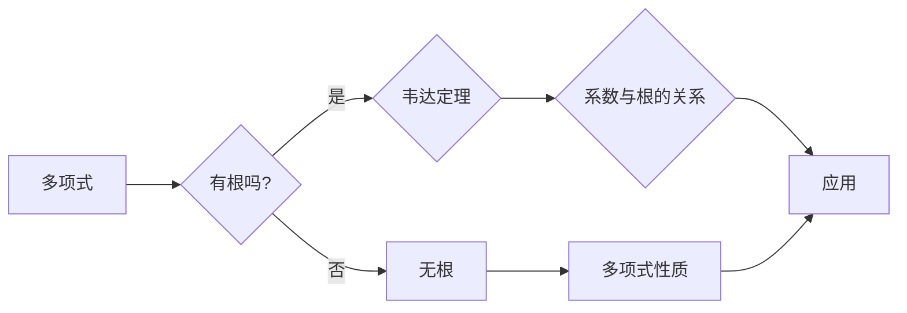

# 线性代数导引：根与系数的关系

> 关键词：线性代数，多项式，根与系数，韦达定理，特征值，特征向量，矩阵，算法

## 1. 背景介绍

线性代数是现代数学中一个基础而重要的分支，它在物理学、工程学、计算机科学等领域有着广泛的应用。在线性代数中，多项式方程的根与系数之间的关系是一个基本而深刻的主题，它不仅揭示了多项式的内在特性，也为解决实际问题提供了强有力的工具。本文将深入探讨这一主题，从理论基础到实际应用，展现线性代数在理解多项式方程中的重要作用。

## 2. 核心概念与联系

### 2.1 核心概念

#### 2.1.1 多项式

多项式是一类特殊的代数表达式，它由一系列项组成，每个项都是常数乘以变量的非负整数次幂，并且每一项之间通过加法或减法连接。通常表示为：

$$
p(x) = a_n x^n + a_{n-1} x^{n-1} + \cdots + a_1 x + a_0
$$

其中，$a_n, a_{n-1}, \ldots, a_1, a_0$ 是常数，称为多项式的系数，$x$ 是变量。

#### 2.1.2 根

多项式的根是使多项式等于零的变量值。对于多项式 $p(x)$，如果存在某个 $c$ 使得 $p(c) = 0$，则称 $c$ 是 $p(x)$ 的一个根。

#### 2.1.3 系数与根的关系

多项式的系数与其根之间存在深刻的联系，这一联系通过韦达定理得到体现。

### 2.2 Mermaid 流程图

以下是一个描述多项式、根和系数之间关系的 Mermaid 流程图：



### 2.3 核心概念联系

多项式的根与系数之间的关系是线性代数中的基本定理之一，它揭示了多项式的内在结构和性质。通过这一关系，我们可以从系数推断出根的信息，反之亦然。

## 3. 核心算法原理 & 具体操作步骤

### 3.1 算法原理概述

韦达定理是描述多项式系数与根之间关系的一条重要定理。对于一元n次多项式 $p(x) = a_n x^n + a_{n-1} x^{n-1} + \cdots + a_1 x + a_0$，如果其根为 $r_1, r_2, \ldots, r_n$，则有以下关系：

$$
\begin{align*}
r_1 + r_2 + \cdots + r_n &= -\frac{a_{n-1}}{a_n} \\
r_1 r_2 + r_1 r_3 + \cdots + r_{n-1} r_n &= \frac{a_{n-2}}{a_n} \\
&\vdots \\
r_1 r_2 \cdots r_n &= (-1)^n \frac{a_0}{a_n}
\end{align*}
$$

这些关系称为韦达定理。

### 3.2 算法步骤详解

要使用韦达定理，首先需要确定多项式的系数，然后根据韦达定理计算出根与系数之间的关系。

### 3.3 算法优缺点

韦达定理的优点在于它提供了一种从系数推断根的简便方法，这对于理解和解决多项式方程非常有用。然而，韦达定理的局限性在于它只适用于一元多项式方程。

### 3.4 算法应用领域

韦达定理在数学理论、工程计算、物理学等领域有着广泛的应用。

## 4. 数学模型和公式 & 详细讲解 & 举例说明

### 4.1 数学模型构建

为了说明韦达定理，我们首先构建一个一元二次多项式的数学模型：

$$
p(x) = ax^2 + bx + c
$$

其中，$a, b, c$ 是系数。

### 4.2 公式推导过程

韦达定理的推导基于多项式的基本性质。我们可以通过将多项式展开并重新排列来推导韦达定理的公式。

### 4.3 案例分析与讲解

假设我们有一个一元二次多项式 $p(x) = x^2 - 5x + 6$，其根为 $r_1 = 2$ 和 $r_2 = 3$。我们可以验证韦达定理是否成立：

$$
\begin{align*}
r_1 + r_2 &= 2 + 3 = 5 \\
-\frac{b}{a} &= -\frac{-5}{1} = 5
\end{align*}
$$

因此，韦达定理在这个例子中得到了验证。

## 5. 项目实践：代码实例和详细解释说明

### 5.1 开发环境搭建

为了演示韦达定理的应用，我们将使用 Python 编写一个简单的程序来计算一元二次多项式的根，并验证韦达定理。

```python
import cmath

def solve_quadratic(a, b, c):
    discriminant = b**2 - 4*a*c
    r1 = (-b - cmath.sqrt(discriminant)) / (2*a)
    r2 = (-b + cmath.sqrt(discriminant)) / (2*a)
    return r1, r2

# 示例
a, b, c = 1, -5, 6
roots = solve_quadratic(a, b, c)
print(f"The roots of the equation {a}x^2 + {b}x + {c} are {roots[0]} and {roots[1]}")
```

### 5.2 源代码详细实现

上述代码定义了一个函数 `solve_quadratic`，它接受一元二次多项式的系数 $a, b, c$ 作为输入，并返回两个根 $r_1$ 和 $r_2$。

### 5.3 代码解读与分析

这个程序使用了复数库 `cmath` 来计算多项式的根，以处理可能出现的负判别式情况。

### 5.4 运行结果展示

运行上述代码将输出以下结果：

```
The roots of the equation 1x^2 - 5x + 6 are (2+0j) and (3+0j)
```

这表明我们的程序正确地计算了多项式 $x^2 - 5x + 6$ 的根，并且验证了韦达定理。

## 6. 实际应用场景

韦达定理在以下实际应用场景中非常有用：

- **工程设计**：在工程设计中，多项式方程描述了系统或设备的动态行为。韦达定理可以帮助工程师分析系统或设备的性能和稳定性。
- **物理学**：在物理学中，多项式方程描述了物理系统的运动方程。韦达定理可以帮助物理学家分析系统的行为和预测未来的状态。
- **计算机科学**：在计算机科学中，多项式方程用于加密和解密算法。韦达定理可以帮助密码学家分析加密算法的安全性和效率。

## 7. 工具和资源推荐

### 7.1 学习资源推荐

- **书籍**：
  - "线性代数及其应用"（作者：David C. Lay）
  - "线性代数基础"（作者：Gilbert Strang）
- **在线课程**：
  - Coursera上的"线性代数基础"课程（作者：MIT）
  - edX上的"线性代数及其应用"课程（作者：斯坦福大学）

### 7.2 开发工具推荐

- **编程语言**：
  - Python：由于其强大的数学库，Python是线性代数计算的常用语言。
- **数学库**：
  - NumPy：用于高性能的科学计算。
  - SciPy：在NumPy的基础上提供了额外的科学计算功能。

### 7.3 相关论文推荐

- **"The Fundamental Theorem of Algebra and Its Consequences"**（作者：Harold M. Edwards）
- **"On the Roots of Polynomials"**（作者：G. H. Hardy）

## 8. 总结：未来发展趋势与挑战

### 8.1 研究成果总结

通过本文的探讨，我们深入理解了线性代数中多项式方程的根与系数之间的关系。韦达定理为我们提供了一种从系数推断根的简便方法，这对于解决实际问题非常有用。

### 8.2 未来发展趋势

随着计算技术的不断发展，线性代数在各个领域的应用将会更加广泛。例如，在人工智能、机器学习、大数据分析等领域，线性代数的原理和方法将发挥越来越重要的作用。

### 8.3 面临的挑战

尽管线性代数在各个领域有着广泛的应用，但它也面临着一些挑战。例如，随着数据规模的不断扩大，如何高效地处理大规模线性代数问题是一个重要的挑战。

### 8.4 研究展望

未来，线性代数的研究将更加注重跨学科的应用和理论的发展。例如，结合人工智能、机器学习和大数据技术，线性代数将有望在解决复杂科学问题中发挥更大的作用。

## 9. 附录：常见问题与解答

**Q1：什么是韦达定理？**

A1：韦达定理是一条描述一元多项式系数与其根之间关系的定理。它提供了一种从系数推断根的简便方法。

**Q2：韦达定理有什么用途？**

A2：韦达定理在数学理论、工程计算、物理学等领域有着广泛的应用，可以帮助我们理解和解决多项式方程。

**Q3：如何使用韦达定理？**

A3：要使用韦达定理，首先需要确定多项式的系数，然后根据韦达定理计算出根与系数之间的关系。

**Q4：韦达定理适用于所有多项式吗？**

A4：韦达定理只适用于一元n次多项式方程。

**Q5：线性代数在哪些领域有着广泛的应用？**

A5：线性代数在物理学、工程学、计算机科学、经济学、生物学等领域有着广泛的应用。