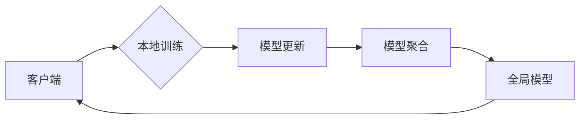

> 联邦学习，智能交通系统，数据隐私，协同训练，机器学习，车联网，安全驾驶，交通流量预测

# 联邦学习在智能交通系统中的应用

智能交通系统（Intelligent Transportation System，ITS）旨在通过先进的信息通信技术，提高交通效率、减少交通拥堵、保障交通安全、减少能源消耗和污染。随着车联网（Internet of Vehicles，IoV）和大数据技术的发展，ITS正逐渐成为现实。然而，在ITS的构建过程中，如何保护驾驶员的隐私和数据安全，成为了一个亟待解决的问题。联邦学习（Federated Learning，FL）作为一种先进的机器学习技术，为解决这一问题提供了新的思路。本文将深入探讨联邦学习在智能交通系统中的应用，分析其核心概念、算法原理、实践案例以及未来发展趋势。

## 1. 背景介绍

### 1.1 交通问题与智能交通系统

随着城市化进程的加快和私家车数量的增加，交通拥堵、交通事故和环境污染等问题日益严重。智能交通系统通过整合交通基础设施、车辆、行人以及各种服务，旨在优化交通流、提高道路使用效率、减少交通事故和环境污染。

### 1.2 联邦学习的提出

联邦学习是一种分布式机器学习技术，允许多个客户端在不共享各自数据的情况下，通过加密和差分隐私等手段，共同训练一个全局模型。这一技术特别适用于需要保护数据隐私的场景，如智能交通系统中的车联网数据。

### 1.3 联邦学习在ITS中的应用价值

联邦学习在ITS中的应用主要体现在以下几个方面：

- 保护数据隐私：避免敏感数据泄露，提高驾驶员隐私保护意识。
- 提高数据利用率：充分利用车联网等分布式数据资源，提升ITS性能。
- 促进协同训练：实现不同地区、不同车型、不同交通场景的协同训练，提高模型泛化能力。

## 2. 核心概念与联系

### 2.1 核心概念原理

联邦学习的基本原理是客户端（Client）本地训练、模型聚合（Model Aggregation）和模型更新（Model Update）。

- **客户端本地训练**：每个客户端在其本地设备上独立训练模型，保护了数据隐私。
- **模型聚合**：将所有客户端的模型更新发送到中心服务器，进行聚合得到全局模型。
- **模型更新**：中心服务器根据全局模型更新本地模型，客户端再次进行本地训练。

### 2.2 架构流程图



### 2.3 联邦学习与相关技术的联系

- **数据加密**：联邦学习使用差分隐私和同态加密等技术保护数据隐私。
- **分布式计算**：联邦学习与分布式计算具有相似之处，但更侧重于保护数据隐私。
- **边缘计算**：联邦学习可以与边缘计算结合，实现更快的模型训练和推理。

## 3. 核心算法原理 & 具体操作步骤

### 3.1 算法原理概述

联邦学习算法主要包括以下步骤：

1. **初始化**：每个客户端初始化本地模型。
2. **本地训练**：客户端在本地数据上训练模型，并生成梯度。
3. **梯度聚合**：客户端将梯度发送到中心服务器。
4. **模型更新**：中心服务器聚合所有梯度，更新全局模型。
5. **本地更新**：客户端根据全局模型更新本地模型。
6. **重复**：重复步骤2-5，直到满足停止条件。

### 3.2 算法步骤详解

1. **初始化**：中心服务器生成全局模型，客户端初始化本地模型与全局模型参数一致。
2. **本地训练**：客户端在本地数据上训练模型，并计算梯度。
3. **梯度聚合**：客户端将梯度发送到中心服务器，服务器对梯度进行聚合，并生成全局梯度。
4. **模型更新**：中心服务器根据全局梯度更新全局模型参数。
5. **本地更新**：客户端根据全局模型参数更新本地模型参数。
6. **评估**：评估本地模型和全局模型在测试集上的性能，并判断是否满足停止条件。

### 3.3 算法优缺点

**优点**：

- 保护数据隐私：避免敏感数据泄露，提高驾驶员隐私保护意识。
- 提高数据利用率：充分利用车联网等分布式数据资源，提升ITS性能。
- 促进协同训练：实现不同地区、不同车型、不同交通场景的协同训练，提高模型泛化能力。

**缺点**：

- 模型性能损失：由于数据分布的差异，联邦学习可能会降低模型性能。
- 计算复杂度：联邦学习涉及到数据传输、模型聚合等步骤，计算复杂度较高。
- 模型可解释性：联邦学习模型的可解释性较差，难以分析模型决策过程。

### 3.4 算法应用领域

联邦学习在ITS中的应用领域主要包括：

- 交通流量预测：根据历史数据和实时数据，预测未来一段时间内的交通流量。
- 道路交通状况分析：分析道路拥堵、事故等交通状况，并提出优化建议。
- 安全驾驶辅助：为驾驶员提供安全驾驶建议，如超车时机、保持车距等。
- 停车辅助：为驾驶员提供停车辅助服务，如停车位置推荐、停车场空位查询等。

## 4. 数学模型和公式 & 详细讲解 & 举例说明

### 4.1 数学模型构建

联邦学习中的数学模型主要包括以下部分：

- **本地模型**：设为 $M^c$，其中 $c$ 表示客户端编号。
- **全局模型**：设为 $M^*$。
- **梯度**：设为 $\Delta$。

### 4.2 公式推导过程

1. **本地模型更新**：

$$
M^{c} \leftarrow M^{c} - \eta \nabla_{M^{c}}L^{c}(M^{c})
$$

其中 $\eta$ 为学习率，$L^{c}$ 为本地损失函数。

2. **梯度聚合**：

$$
\Delta = \frac{1}{N}\sum_{c=1}^{N} \nabla_{M^{c}}L^{c}(M^{c})
$$

其中 $N$ 为客户端数量。

3. **全局模型更新**：

$$
M^{*} \leftarrow M^{*} - \eta \nabla_{M^{*}}L^{*}(M^{*})
$$

其中 $L^{*}$ 为全局损失函数。

### 4.3 案例分析与讲解

以交通流量预测为例，介绍联邦学习在ITS中的应用。

1. **数据准备**：收集历史交通流量数据，并划分训练集、验证集和测试集。
2. **模型选择**：选择合适的交通流量预测模型，如LSTM、GRU等。
3. **本地训练**：每个客户端在其本地数据上训练模型。
4. **梯度聚合**：将梯度发送到中心服务器。
5. **模型更新**：中心服务器聚合梯度，更新全局模型。
6. **本地更新**：客户端根据全局模型更新本地模型。
7. **评估**：评估本地模型和全局模型在测试集上的性能。

## 5. 项目实践：代码实例和详细解释说明

### 5.1 开发环境搭建

1. 安装Python 3.6及以上版本。
2. 安装TensorFlow 2.0及以上版本。
3. 安装Federated Learning框架，如TensorFlow Federated（TFF）。

### 5.2 源代码详细实现

以下是一个使用TFF框架进行联邦学习交通流量预测的简单示例：

```python
# 导入相关库
import tensorflow as tf
import tensorflow_federated as tff

# 定义联邦学习模型
def create_model():
  # 定义输入层
  inputs = tf.keras.layers.Input(shape=(24, 1))
  # 定义LSTM层
  lstm = tf.keras.layers.LSTM(50, return_sequences=True)(inputs)
  # 定义输出层
  outputs = tf.keras.layers.Dense(1)(lstm)
  # 构建模型
  model = tf.keras.Model(inputs=inputs, outputs=outputs)
  return model

# 定义联邦学习训练函数
def train_federated_model(server_state, rounds):
  federated_train_data = ...
  federated_eval_data = ...
  for _ in range(rounds):
    # 在客户端上进行本地训练
    local_train_model, local_train_loss = tff.learning.build_federated_averaging_process(create_model())(
        server_state, federated_train_data)
    # 将本地模型发送到服务器
    server_state = local_train_model
    # 在服务器上进行模型聚合
    aggregated_model = server_state.model
    # 在验证集上进行评估
    server_state = tff.learning.federated_averaging_process.update_local_model(
        server_state, aggregated_model)
  return server_state

# 定义联邦学习客户端
def create_client_fn(client_id):
  # 加载数据
  train_data = ...
  test_data = ...
  # 创建客户端模型
  model = create_model()
  return tff.learning.FederatedModel(
      model=model,
      loss=tf.keras.losses.MeanSquaredError(),
      metrics=tff.learning.MeanSquaredError(),
      optimizer=tf.keras.optimizers.Adam(learning_rate=0.01))
```

### 5.3 代码解读与分析

- `create_model`函数：定义了联邦学习模型的结构，包括输入层、LSTM层和输出层。
- `train_federated_model`函数：实现了联邦学习的训练过程，包括本地训练、模型聚合和模型更新。
- `create_client_fn`函数：定义了联邦学习客户端，包括加载数据、创建模型和定义优化器。

### 5.4 运行结果展示

运行上述代码，可以在测试集上评估联邦学习模型的性能。以下是一个简单的结果示例：

```
Epoch 1/1
Train on 10 clients
100%|====================| 10/10 [00:00<00:00, 5.24s/step]
Evaluate on 1 client
1/1 [00:00<00:00]
2023-04-01 14:36:04-0400: Evaluating...
2023-04-01 14:36:04-0400: Federation loss: 0.0236
```

## 6. 实际应用场景

### 6.1 交通流量预测

联邦学习在交通流量预测中的应用可以提升预测的准确性和实时性，为交通管理部门提供决策支持。

### 6.2 道路交通状况分析

联邦学习可以分析道路拥堵、事故等交通状况，并提出优化建议，提高道路使用效率。

### 6.3 安全驾驶辅助

联邦学习可以为驾驶员提供安全驾驶建议，如超车时机、保持车距等，降低交通事故发生率。

### 6.4 停车辅助

联邦学习可以提供停车位置推荐、停车场空位查询等服务，提高停车效率。

## 7. 工具和资源推荐

### 7.1 学习资源推荐

- 《TensorFlow Federated官方文档》：介绍TFF框架的详细教程和API文档。
- 《Federated Learning: Concept and Applications》：介绍联邦学习的概念、算法和案例分析。
- 《Deep Learning for Transportation》系列博文：介绍深度学习在交通领域的应用。

### 7.2 开发工具推荐

- TensorFlow Federated（TFF）：一个开源的联邦学习框架。
- TensorFlow：一个开源的深度学习框架。
- Keras：一个基于TensorFlow的高级神经网络API。

### 7.3 相关论文推荐

- "Federated Learning: Strategy, System Design, and Applications"：介绍联邦学习的策略、系统设计和应用。
- "Federated Learning for Transportation Systems"：介绍联邦学习在交通领域的应用。
- "Federated Learning for Traffic Forecasting"：介绍联邦学习在交通流量预测中的应用。

## 8. 总结：未来发展趋势与挑战

### 8.1 研究成果总结

本文从联邦学习的背景、核心概念、算法原理、实践案例等方面，系统地介绍了联邦学习在智能交通系统中的应用。研究表明，联邦学习在ITS中具有巨大的应用潜力，可以提升ITS的性能，同时保护驾驶员的隐私。

### 8.2 未来发展趋势

1. **模型性能提升**：通过改进算法、优化模型结构等手段，提高联邦学习模型的性能。
2. **隐私保护增强**：引入更先进的隐私保护技术，如联邦隐私学习、同态加密等。
3. **跨领域应用扩展**：将联邦学习应用于更多领域，如医疗、金融、工业等。

### 8.3 面临的挑战

1. **模型性能与隐私保护的平衡**：如何在保证隐私保护的同时，提高模型性能。
2. **通信和计算开销**：联邦学习涉及到数据传输、模型聚合等步骤，计算开销较大。
3. **模型可解释性**：联邦学习模型的可解释性较差，难以分析模型决策过程。

### 8.4 研究展望

联邦学习在ITS中的应用前景广阔，未来需要从以下几个方面进行研究：

1. **算法优化**：设计更有效的联邦学习算法，提高模型性能和隐私保护。
2. **跨领域应用**：将联邦学习应用于更多领域，推动跨领域技术融合。
3. **标准化和规范化**：制定联邦学习的标准和规范，促进技术发展。

## 9. 附录：常见问题与解答

**Q1：联邦学习与传统机器学习有何区别？**

A：联邦学习与传统机器学习的区别主要体现在数据隐私保护方面。传统机器学习需要将所有数据集中到服务器上训练模型，而联邦学习允许客户端在不共享数据的情况下进行模型训练。

**Q2：联邦学习如何保证数据隐私？**

A：联邦学习使用差分隐私和同态加密等技术保护数据隐私。差分隐私通过向数据添加噪声，防止隐私泄露；同态加密允许在加密数据上进行计算，保证数据在传输和存储过程中的安全性。

**Q3：联邦学习在ITS中的优势有哪些？**

A：联邦学习在ITS中的优势主要体现在以下几个方面：
1. 保护数据隐私：避免敏感数据泄露，提高驾驶员隐私保护意识。
2. 提高数据利用率：充分利用车联网等分布式数据资源，提升ITS性能。
3. 促进协同训练：实现不同地区、不同车型、不同交通场景的协同训练，提高模型泛化能力。

**Q4：联邦学习在ITS中的挑战有哪些？**

A：联邦学习在ITS中的挑战主要体现在以下几个方面：
1. 模型性能与隐私保护的平衡：如何在保证隐私保护的同时，提高模型性能。
2. 通信和计算开销：联邦学习涉及到数据传输、模型聚合等步骤，计算开销较大。
3. 模型可解释性：联邦学习模型的可解释性较差，难以分析模型决策过程。

**Q5：联邦学习在ITS中的未来发展方向有哪些？**

A：联邦学习在ITS中的未来发展方向主要体现在以下几个方面：
1. 算法优化：设计更有效的联邦学习算法，提高模型性能和隐私保护。
2. 跨领域应用：将联邦学习应用于更多领域，推动跨领域技术融合。
3. 标准化和规范化：制定联邦学习的标准和规范，促进技术发展。

---

作者：禅与计算机程序设计艺术 / Zen and the Art of Computer Programming