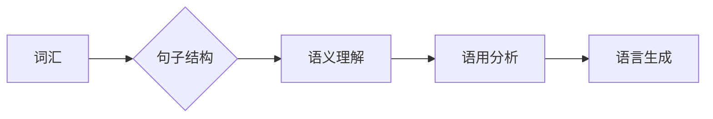

# 自然语言处理原理与代码实战案例讲解

> 关键词：自然语言处理(NLP),深度学习,机器学习,文本分析,情感分析,文本分类,序列模型,卷积神经网络(CNN),递归神经网络(RNN),长短期记忆网络(LSTM),Transformer

## 1. 背景介绍

自然语言处理（Natural Language Processing，NLP）是人工智能领域的一个重要分支，它旨在让计算机能够理解、解释和生成人类语言。随着深度学习技术的迅猛发展，NLP在各个领域的应用越来越广泛，从智能客服到机器翻译，从文本摘要到情感分析，NLP技术正在改变我们的生活方式。

本文将深入浅出地讲解NLP的基本原理，并通过代码实战案例展示如何应用这些原理解决实际问题。无论是NLP初学者还是有经验的开发者，都能从本文中获得宝贵的知识和经验。

## 2. 核心概念与联系

### 2.1 核心概念原理

自然语言处理涉及多个核心概念，以下是一些关键术语：

- **词汇**：语言的基本单位，如单词、标点符号等。
- **句子**：由词汇组成，表达完整意义的语言单位。
- **语义**：语言表达的含义，包括字面意义和隐含意义。
- **语用**：语言在特定语境中的使用，涉及语境、意图等。
- **语法**：语言的结构规则，包括词法、句法等。

### 2.2 架构的 Mermaid 流程图



在NLP中，词汇是基础，句子结构是构建语言的基本框架，语义理解是核心，语用分析考虑语言的实际应用，最后是语言生成，即计算机如何生成符合语言规则的文本。

## 3. 核心算法原理 & 具体操作步骤

### 3.1 算法原理概述

NLP算法主要分为以下几类：

- **统计模型**：基于概率论和统计学的算法，如朴素贝叶斯、隐马尔可夫模型等。
- **基于规则的方法**：基于手工编写的规则进行文本分析，如词性标注、句法分析等。
- **深度学习模型**：使用神经网络进行文本分析，如循环神经网络（RNN）、长短期记忆网络（LSTM）、卷积神经网络（CNN）和Transformer等。

### 3.2 算法步骤详解

1. **数据预处理**：包括文本清洗、分词、去除停用词、词干提取等。
2. **特征提取**：将文本转换为计算机可以处理的数值特征，如词袋模型、TF-IDF等。
3. **模型训练**：使用机器学习或深度学习算法对特征进行学习，建立模型。
4. **模型评估**：使用测试数据评估模型的性能。
5. **模型部署**：将模型部署到实际应用中。

### 3.3 算法优缺点

- **统计模型**：计算简单，可解释性强，但泛化能力有限。
- **基于规则的方法**：可解释性强，但规则难以编写，且难以处理复杂文本。
- **深度学习模型**：泛化能力强，能够处理复杂文本，但可解释性差，且需要大量计算资源。

### 3.4 算法应用领域

NLP算法在以下领域有广泛应用：

- **文本分类**：将文本分为不同的类别，如情感分析、主题分类等。
- **命名实体识别**：识别文本中的命名实体，如人名、地名等。
- **机器翻译**：将一种语言的文本翻译成另一种语言。
- **文本摘要**：从长文本中提取关键信息，生成摘要。
- **问答系统**：回答用户提出的问题。

## 4. 数学模型和公式 & 详细讲解 & 举例说明

### 4.1 数学模型构建

NLP中的数学模型主要包括：

- **概率模型**：如朴素贝叶斯、隐马尔可夫模型等。
- **神经网络模型**：如RNN、LSTM、CNN和Transformer等。

### 4.2 公式推导过程

以朴素贝叶斯模型为例，假设有n个类别，每个类别的概率为$P(C_k)$，对于文本中的每个特征，其条件概率为$P(w_i|C_k)$。则文本属于类别$C_k$的概率为：

$$
P(C_k|T) = \frac{P(T|C_k)P(C_k)}{P(T)}
$$

其中$P(T|C_k)$为文本T属于类别$C_k$的概率，$P(C_k)$为类别$C_k$的概率，$P(T)$为文本T的概率。

### 4.3 案例分析与讲解

以下是一个简单的情感分析案例，使用TF-IDF进行文本分类：

1. **数据预处理**：将文本进行分词、去除停用词等操作。
2. **特征提取**：计算每个单词的TF-IDF值。
3. **模型训练**：使用逻辑回归模型进行分类。
4. **模型评估**：使用测试数据评估模型性能。

## 5. 项目实践：代码实例和详细解释说明

### 5.1 开发环境搭建

1. 安装Python环境。
2. 安装NLP相关库，如NLTK、spaCy、scikit-learn等。

### 5.2 源代码详细实现

```python
import pandas as pd
from sklearn.model_selection import train_test_split
from sklearn.feature_extraction.text import TfidfVectorizer
from sklearn.linear_model import LogisticRegression
from sklearn.metrics import accuracy_score

# 加载数据
data = pd.read_csv('data.csv')
X = data['text']
y = data['label']

# 划分训练集和测试集
X_train, X_test, y_train, y_test = train_test_split(X, y, test_size=0.2, random_state=42)

# 特征提取
tfidf = TfidfVectorizer()
X_train_tfidf = tfidf.fit_transform(X_train)
X_test_tfidf = tfidf.transform(X_test)

# 模型训练
model = LogisticRegression()
model.fit(X_train_tfidf, y_train)

# 模型评估
y_pred = model.predict(X_test_tfidf)
accuracy = accuracy_score(y_test, y_pred)
print(f'Accuracy: {accuracy:.2f}')
```

### 5.3 代码解读与分析

以上代码实现了使用TF-IDF和逻辑回归进行情感分析。首先加载数据，然后划分训练集和测试集。接着使用TF-IDF进行特征提取，最后使用逻辑回归模型进行分类，并评估模型性能。

## 6. 实际应用场景

### 6.1 情感分析

情感分析是NLP领域的一个经典应用，它可以用于分析社交媒体上的用户评论、产品评价等，帮助企业了解用户对产品或服务的看法。

### 6.2 文本分类

文本分类是将文本分为不同的类别，如新闻分类、邮件分类等。它可以用于信息检索、舆情监测等场景。

### 6.3 命名实体识别

命名实体识别可以识别文本中的命名实体，如人名、地名、组织名等。它可以用于信息抽取、实体链接等场景。

### 6.4 机器翻译

机器翻译是将一种语言的文本翻译成另一种语言。它可以用于国际交流、跨语言信息检索等场景。

### 6.5 文本摘要

文本摘要可以提取文本中的关键信息，生成摘要。它可以用于信息过载处理、文档检索等场景。

## 7. 工具和资源推荐

### 7.1 学习资源推荐

- 《自然语言处理综论》
- 《深度学习自然语言处理》
- 《自然语言处理入门》

### 7.2 开发工具推荐

- NLTK
- spaCy
- scikit-learn
- TensorFlow
- PyTorch

### 7.3 相关论文推荐

- "A Neural Probabilistic Language Model"
- "Recursive Deep Learning for Compositionality: A Syntax-aware Neural Language Model"
- "Attention is All You Need"

## 8. 总结：未来发展趋势与挑战

### 8.1 研究成果总结

NLP领域的研究取得了显著的成果，深度学习技术的发展推动了NLP技术的突破，使计算机能够更好地理解和生成人类语言。

### 8.2 未来发展趋势

- 预训练语言模型将更加普及，并应用于更多领域。
- NLP技术将与其他人工智能技术融合，如计算机视觉、语音识别等。
- NLP技术将更加注重可解释性和安全性。

### 8.3 面临的挑战

- 数据标注成本高，数据质量参差不齐。
- 模型可解释性差，难以理解模型的决策过程。
- 模型泛化能力有限，难以适应不同领域和任务。

### 8.4 研究展望

未来NLP研究将更加注重跨领域迁移、少样本学习、可解释性和安全性等方面，以实现更加智能、高效、可靠的NLP技术。

## 9. 附录：常见问题与解答

### 9.1 常见问题

- **Q1：NLP和机器学习有什么区别？**
  **A1**：NLP是机器学习的一个子领域，专注于文本数据的处理和分析。

- **Q2：如何选择合适的NLP模型？**
  **A2**：根据具体任务和数据特点选择合适的模型。例如，对于文本分类任务，可以使用朴素贝叶斯、逻辑回归、SVM等模型；对于序列建模任务，可以使用RNN、LSTM、Transformer等模型。

- **Q3：如何提高NLP模型的可解释性？**
  **A3**：可以使用注意力机制、可解释AI等方法提高模型的可解释性。

### 9.2 解答

**Q1**：NLP和机器学习有什么区别？

A1：NLP是机器学习的一个子领域，专注于文本数据的处理和分析。机器学习是更广泛的人工智能领域，包括NLP、计算机视觉、语音识别等多个子领域。

**Q2**：如何选择合适的NLP模型？

A2：选择合适的NLP模型需要考虑以下因素：

- 任务类型：文本分类、序列建模、信息抽取等。
- 数据特点：数据规模、数据分布、数据质量等。
- 模型性能：准确率、召回率、F1值等。

**Q3**：如何提高NLP模型的可解释性？

A3：提高NLP模型的可解释性可以从以下几个方面入手：

- 使用注意力机制：注意力机制可以帮助理解模型在处理文本时的关注点。
- 使用可解释AI技术：可解释AI技术可以帮助解释模型的决策过程。
- 分析模型内部结构：分析模型内部结构，了解模型的工作原理。

作者：禅与计算机程序设计艺术 / Zen and the Art of Computer Programming