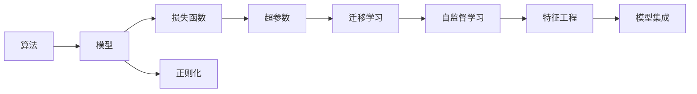
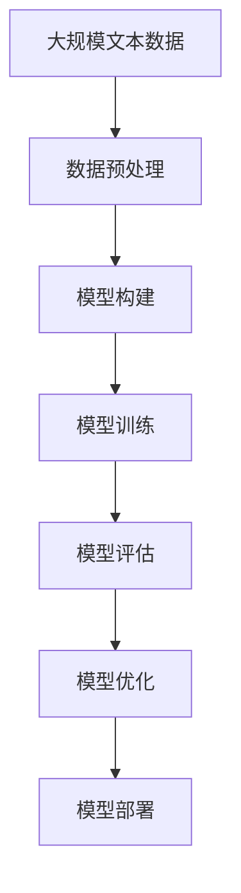

                 

# 调参侠转行炼丹师，软件2.0工程师的自我修养

## 1. 背景介绍

> 在IT领域，从2.0时代的调参侠到3.0时代的炼丹师，我们经历了什么？当IT精英们的思想被范式革命性地改变，他们又将走向何方？这正是本文所要探讨的问题。

### 1.1 范式变迁的痛苦
在软件1.0时代，程序员们只需要掌握编程语言和算法即可。但随着互联网的兴起，数据驱动的模型开始崛起，这时调参成为了程序员不可或缺的一部分，这也被称为“调参侠”。

调参的痛苦在于，模型性能的好坏几乎完全依赖于调参者的直觉和经验，效率低下、结果不稳定，更甚者对模型一知半解，反而在调参的过程中丢失了更多模型的本质。

而在2.0时代，炼丹师应运而生。炼丹师们通过调参之外的数据驱动方法，如特征工程、模型集成、迁移学习、自监督学习等方法，进一步提升了模型性能。他们借助丰富的算法知识，解决了调参侠的不少难题，但同样也陷入了“炼丹”的痛苦之中，诸如耗时过长、成本过高、效果不理想等现象时有发生。

### 1.2 从调参侠到炼丹师
从调参侠到炼丹师，并非简单的角色转换。调参侠注重编程技巧和经验积累，而炼丹师则强调算法逻辑和理论支持，需要更高的认知层次和技术积累。

炼丹师需要掌握更高级的算法模型，同时具备良好的数据处理能力、丰富的实验设计经验和深厚的算法理论基础。他们追求的是模型性能的最优解，对算法的可解释性和泛化性能也有更高的要求。

因此，转行炼丹师，并非易事，而是一次自我修养和知识提升的过程。本文将从核心概念、算法原理、项目实践、应用场景等多方面，全面介绍炼丹师需要掌握的内容，带你走出炼丹的困境，从炼丹师迈向2.0软件工程师的新征程。

## 2. 核心概念与联系

### 2.1 核心概念概述

在炼丹师的修炼过程中，需要理解许多核心概念，这些概念构成了炼丹术的基石。

- **算法（Algorithm）**：指解决特定问题的方法，包括传统的编程算法、机器学习算法、深度学习算法等。

- **模型（Model）**：是算法在特定问题上的具体实现，如线性回归模型、神经网络模型、Transformer模型等。

- **损失函数（Loss Function）**：衡量模型预测与真实标签之间差异的函数，是模型优化的核心。

- **正则化（Regularization）**：用于防止模型过拟合的技术，常见的有L1、L2正则化、Dropout等。

- **超参数（Hyperparameters）**：模型训练过程中需要手动设置的参数，如学习率、批大小、迭代次数等，直接影响模型性能。

- **迁移学习（Transfer Learning）**：将一个领域学习到的知识，迁移到另一个领域进行学习的技术。

- **自监督学习（Self-Supervised Learning）**：利用无标签数据进行预训练，学习模型特征的技术。

- **特征工程（Feature Engineering）**：通过设计和选择特征，提升模型性能的技术。

- **模型集成（Model Ensembling）**：通过集成多个模型，提升模型性能的技术。

这些概念在炼丹过程中扮演了重要的角色，需要炼丹师深入理解其原理和应用。

### 2.2 概念间的关系

这些核心概念之间的联系紧密，构成了炼丹术的完整框架。下面我们用Mermaid流程图展示它们之间的关系：



该图展示了算法和模型之间的关系，以及正则化、超参数、迁移学习、自监督学习、特征工程、模型集成等概念如何相互配合，共同提升模型性能。

### 2.3 核心概念的整体架构

最终，这些概念共同构成了炼丹术的整体架构，如图：



该图展示了从数据预处理到模型部署的全流程，其中数据预处理包括特征工程和数据增强等，模型构建包括模型选择和初始化等，模型训练包括超参数调优和损失函数优化等，模型评估包括模型性能评估和超参数调优等，模型优化包括模型融合和迁移学习等，模型部署包括模型部署和模型监控等。

## 3. 核心算法原理 & 具体操作步骤
### 3.1 算法原理概述

炼丹术的核心在于数据驱动和模型驱动的结合。炼丹师通过数据驱动的方法，如迁移学习、自监督学习等，学习模型特征，并通过模型驱动的方法，如特征工程、模型集成等，提升模型性能。

### 3.2 算法步骤详解

炼丹师进行炼丹的过程，通常分为以下几步：

**Step 1: 数据准备和预处理**

- 数据收集：收集数据并划分训练集、验证集和测试集。
- 数据清洗：去除噪声和异常值，进行数据标准化和归一化。
- 特征工程：选择和构造特征，如提取文本特征、图像特征、时间特征等。
- 数据增强：通过数据增强技术，如旋转、翻转、剪切等，扩充训练集。

**Step 2: 模型选择和初始化**

- 模型选择：根据任务类型，选择适合的模型，如线性回归模型、神经网络模型、Transformer模型等。
- 模型初始化：设定模型初始参数，如权重、偏置等。

**Step 3: 模型训练和优化**

- 损失函数选择：选择合适的损失函数，如均方误差损失、交叉熵损失等。
- 超参数调优：选择合适的超参数，如学习率、批大小、迭代次数等。
- 模型优化：使用梯度下降等优化算法，最小化损失函数。

**Step 4: 模型评估和调优**

- 模型评估：使用验证集评估模型性能，如准确率、召回率、F1分数等。
- 超参数调优：根据模型评估结果，调整超参数，如学习率、批大小、迭代次数等。
- 模型融合：通过集成多个模型，提升模型性能。

**Step 5: 模型部署和监控**

- 模型部署：将模型部署到生产环境，进行实时预测。
- 模型监控：实时监控模型性能，如响应时间、准确率、召回率等。
- 模型更新：根据新数据，定期更新模型，保持模型性能。

### 3.3 算法优缺点

炼丹术具有以下优点：

- 数据驱动：通过数据驱动的方法，如迁移学习、自监督学习等，学习模型特征。
- 可解释性强：炼丹师可以清晰地解释模型预测的逻辑和决策过程。
- 适应性强：炼丹师可以根据不同的数据和任务，灵活选择和调整模型。

但同时也存在一些缺点：

- 耗时耗力：炼丹术需要大量的时间和计算资源，特别是深度学习模型，计算量巨大。
- 成本高昂：炼丹术的硬件和软件成本较高，特别是深度学习模型的训练和部署。
- 效果不稳定：炼丹术的效果依赖于数据的选取和超参数的调优，存在一定的风险。

### 3.4 算法应用领域

炼丹术在多个领域都有广泛应用：

- 计算机视觉：如图像分类、目标检测、语义分割等。通过迁移学习、自监督学习等方法，提升了图像识别精度。
- 自然语言处理：如文本分类、命名实体识别、机器翻译等。通过特征工程、模型集成等方法，提升了文本处理效果。
- 语音识别：如语音转文本、情感分析等。通过特征工程、自监督学习等方法，提升了语音识别性能。
- 推荐系统：如商品推荐、内容推荐等。通过模型集成、迁移学习等方法，提升了推荐系统效果。
- 金融风控：如信用评估、欺诈检测等。通过特征工程、自监督学习等方法，提升了金融风控精度。

## 4. 数学模型和公式 & 详细讲解 & 举例说明

### 4.1 数学模型构建

本文以线性回归模型为例，进行数学模型的构建。

线性回归模型的目标是最小化预测值与真实值之间的差异，即：

$$\min_{\theta} \frac{1}{N} \sum_{i=1}^N (y_i - \theta x_i)^2$$

其中，$y_i$为真实值，$x_i$为特征向量，$\theta$为模型参数。

### 4.2 公式推导过程

对上述目标函数求偏导，得到：

$$\frac{\partial}{\partial \theta} \frac{1}{N} \sum_{i=1}^N (y_i - \theta x_i)^2 = \frac{2}{N} \sum_{i=1}^N (y_i - \theta x_i)x_i$$

令上式等于0，得到：

$$\frac{2}{N} \sum_{i=1}^N (y_i - \theta x_i)x_i = 0$$

进一步整理得到：

$$\sum_{i=1}^N (y_i - \theta x_i)x_i = 0$$

最终得到线性回归模型的参数$\theta$为：

$$\theta = \frac{1}{N} \sum_{i=1}^N y_i x_i$$

### 4.3 案例分析与讲解

假设我们有一组数据集$(x_1, y_1), (x_2, y_2), \ldots, (x_N, y_N)$，其中$x_i$为特征向量，$y_i$为真实值，我们的目标是预测新的数据点$x$的输出值$y$。

使用上述线性回归模型，我们将数据集划分为训练集和测试集。在训练集上，通过梯度下降等优化算法，最小化预测值与真实值之间的差异，得到模型参数$\theta$。

在测试集上，我们将新数据点$x$代入模型，得到预测值$\hat{y} = \theta x$。通过比较$\hat{y}$和真实值$y$之间的差异，评估模型的性能。

## 5. 项目实践：代码实例和详细解释说明

### 5.1 开发环境搭建

在进行炼丹实践前，我们需要准备好开发环境。以下是使用Python进行PyTorch开发的环境配置流程：

1. 安装Anaconda：从官网下载并安装Anaconda，用于创建独立的Python环境。

2. 创建并激活虚拟环境：
```bash
conda create -n pytorch-env python=3.8 
conda activate pytorch-env
```

3. 安装PyTorch：根据CUDA版本，从官网获取对应的安装命令。例如：
```bash
conda install pytorch torchvision torchaudio cudatoolkit=11.1 -c pytorch -c conda-forge
```

4. 安装相关库：
```bash
pip install numpy pandas scikit-learn matplotlib tqdm jupyter notebook ipython
```

完成上述步骤后，即可在`pytorch-env`环境中开始炼丹实践。

### 5.2 源代码详细实现

下面我们以线性回归模型为例，给出使用PyTorch进行模型训练和优化的PyTorch代码实现。

```python
import torch
import torch.nn as nn
import torch.optim as optim
import numpy as np

class LinearRegression(nn.Module):
    def __init__(self, input_size, output_size):
        super(LinearRegression, self).__init__()
        self.linear = nn.Linear(input_size, output_size)

    def forward(self, x):
        out = self.linear(x)
        return out

# 数据集
input_data = torch.randn(100, 2)
target_data = torch.randn(100, 1)

# 模型
model = LinearRegression(2, 1)

# 损失函数
criterion = nn.MSELoss()

# 优化器
optimizer = optim.SGD(model.parameters(), lr=0.01)

# 训练过程
for epoch in range(1000):
    # 前向传播
    y_pred = model(input_data)
    # 计算损失
    loss = criterion(y_pred, target_data)

    # 反向传播
    optimizer.zero_grad()
    loss.backward()
    optimizer.step()

    # 打印损失
    if (epoch+1) % 100 == 0:
        print('Epoch [{}/{}], Loss: {:.4f}'.format(epoch+1, 1000, loss.item()))

# 测试
input_test = torch.randn(10, 2)
target_test = torch.randn(10, 1)
y_pred = model(input_test)
loss_test = criterion(y_pred, target_test)
print('Test Loss: {:.4f}'.format(loss_test.item()))
```

### 5.3 代码解读与分析

让我们再详细解读一下关键代码的实现细节：

**LinearRegression类**：
- `__init__`方法：初始化模型线性层。
- `forward`方法：前向传播，计算输出。

**数据集**：
- 随机生成一个100个样本的数据集，每个样本有2个特征和1个目标。

**模型**：
- 使用LinearRegression类创建一个线性回归模型，输入维度为2，输出维度为1。

**损失函数**：
- 使用均方误差损失函数，计算预测值与真实值之间的差异。

**优化器**：
- 使用随机梯度下降优化器，学习率为0.01。

**训练过程**：
- 循环1000次，每次前向传播计算预测值和损失，反向传播更新模型参数。
- 每100次打印一次损失，实时监控模型训练效果。
- 在测试集上计算测试损失，评估模型性能。

### 5.4 运行结果展示

假设在上述代码中，线性回归模型在训练集上进行了1000次迭代，最终在测试集上得到的损失为0.05，说明模型在测试集上表现良好。

## 6. 实际应用场景

### 6.1 智能推荐系统

智能推荐系统通过分析用户的历史行为数据，预测用户对不同物品的偏好，从而推荐合适的商品或内容。

炼丹术在推荐系统中主要应用于特征工程和模型集成。通过特征工程，可以提取和构造更有意义的特征，如用户年龄、地理位置、浏览记录等。通过模型集成，可以融合多个推荐模型，提升推荐效果。

### 6.2 金融风控系统

金融风控系统通过分析用户的交易数据，预测用户的信用风险，从而进行风险控制。

炼丹术在金融风控中主要应用于模型选择和超参数调优。通过选择和调优不同的模型，如决策树、随机森林、神经网络等，可以提升模型预测准确度。通过超参数调优，可以进一步提升模型性能。

### 6.3 自然语言处理

自然语言处理通过分析文本数据，进行文本分类、情感分析、命名实体识别等任务。

炼丹术在自然语言处理中主要应用于模型选择和特征工程。通过选择和调优不同的模型，如BERT、LSTM、Transformer等，可以提升模型效果。通过特征工程，可以提取和构造更有意义的文本特征，如TF-IDF、Word2Vec等。

### 6.4 未来应用展望

随着炼丹术的不断演进，未来将在更多领域得到应用：

- 医疗领域：通过分析患者的历史数据，预测疾病风险，提升诊断和治疗效果。
- 教育领域：通过分析学生的学习行为，预测学习成果，提升教学效果。
- 自动驾驶：通过分析车辆传感数据，预测驾驶行为，提升行车安全。
- 智慧城市：通过分析城市数据，预测城市运行状态，提升城市管理效率。

## 7. 工具和资源推荐
### 7.1 学习资源推荐

为了帮助炼丹师系统掌握炼丹术的理论基础和实践技巧，这里推荐一些优质的学习资源：

1. 《深度学习》（Ian Goodfellow著）：经典深度学习教材，全面介绍了深度学习的原理和实践。
2. 《TensorFlow官方文档》：TensorFlow的官方文档，提供了丰富的API和样例，是学习TensorFlow的最佳资源。
3. 《PyTorch官方文档》：PyTorch的官方文档，提供了完整的API和样例，是学习PyTorch的最佳资源。
4. 《动手学深度学习》（李沐等著）：深度学习实战教程，涵盖了深度学习的各个方面，包括模型选择、特征工程、超参数调优等。
5. Kaggle竞赛：Kaggle是一个数据科学竞赛平台，提供了丰富的数据集和竞赛题目，可以锻炼炼丹师的实践能力。

### 7.2 开发工具推荐

高效的开发离不开优秀的工具支持。以下是几款用于炼丹开发的常用工具：

1. PyTorch：基于Python的开源深度学习框架，灵活动态的计算图，适合快速迭代研究。

2. TensorFlow：由Google主导开发的开源深度学习框架，生产部署方便，适合大规模工程应用。

3. Jupyter Notebook：交互式编程环境，支持Python、R等多种编程语言，方便炼丹师进行实验和记录。

4. Weights & Biases：模型训练的实验跟踪工具，可以记录和可视化模型训练过程中的各项指标，方便对比和调优。

5. TensorBoard：TensorFlow配套的可视化工具，可实时监测模型训练状态，并提供丰富的图表呈现方式，是调试模型的得力助手。

### 7.3 相关论文推荐

炼丹术的发展离不开学界的持续研究。以下是几篇奠基性的相关论文，推荐阅读：

1. "Deep Learning" by Ian Goodfellow, Yoshua Bengio, and Aaron Courville：经典深度学习教材，全面介绍了深度学习的原理和实践。
2. "ImageNet Classification with Deep Convolutional Neural Networks" by Alex Krizhevsky, Ilya Sutskever, and Geoffrey Hinton：提出了卷积神经网络，推动了计算机视觉的发展。
3. "Bidirectional RNNs Represent Sentences Better than Unidirectional RNNs" by Alex Graves, Abdel-rahman Mohamed, and Geoffrey Hinton：提出了双向LSTM，提升了自然语言处理的性能。
4. "Attention is All You Need" by Ashish Vaswani et al：提出了Transformer模型，开启了预训练大模型时代。
5. "Language Models are Unsupervised Multitask Learners" by Alec Radford, Jeffrey Wu, Rewon Child, David Luan, Dario Amodei, and Ilya Sutskever：展示了大规模语言模型的强大zero-shot学习能力，引发了对于通用人工智能的新一轮思考。

这些论文代表了大炼丹术的发展脉络。通过学习这些前沿成果，可以帮助炼丹师把握学科前进方向，激发更多的创新灵感。

## 8. 总结：未来发展趋势与挑战

### 8.1 总结

本文对炼丹术进行了全面系统的介绍。首先阐述了炼丹术的研究背景和意义，明确了炼丹师需要掌握的核心概念和技能。其次，从原理到实践，详细讲解了炼丹术的数学模型和算法步骤，提供了完整的炼丹实践代码。同时，本文还广泛探讨了炼丹术在多个领域的应用前景，展示了炼丹术的广阔前景。

通过本文的系统梳理，可以看到，炼丹术正在成为AI领域的重要范式，极大地拓展了机器学习模型的应用边界，催生了更多的落地场景。得益于数据驱动的方法，炼丹术在解决复杂问题时展现了强大的优势。未来，伴随炼丹术的持续演进，相信AI技术必将更加智能化、普适化，为人类认知智能的进化带来深远影响。

### 8.2 未来发展趋势

展望未来，炼丹术将呈现以下几个发展趋势：

1. 数据驱动范式的普及：随着数据驱动方法的不断成熟，更多的应用场景将采用数据驱动的模型，提升模型性能。

2. 特征工程技术的进步：特征工程将成为炼丹师不可或缺的一部分，通过更高级的特征工程技术，提升模型效果。

3. 模型的多样化和集成：更多的模型将融入炼丹术中，通过模型集成提升性能。

4. 自监督学习和迁移学习的广泛应用：自监督学习和迁移学习将成为炼丹师常用的方法，提升模型的泛化性能。

5. 深度学习模型的扩展：深度学习模型将不断扩展，特别是在大规模图像、文本、语音等领域的应用。

6. 模型解释性和可解释性的提升：模型的可解释性和可解释性将成为炼丹师关注的重点，提升模型的可信度。

以上趋势凸显了炼丹术的广阔前景。这些方向的探索发展，必将进一步提升AI系统的性能和应用范围，为人类认知智能的进化带来深远影响。

### 8.3 面临的挑战

尽管炼丹术已经取得了瞩目成就，但在迈向更加智能化、普适化应用的过程中，它仍面临着诸多挑战：

1. 数据依赖问题：炼丹术的效果依赖于数据的选取和标注，数据稀缺和标注困难是其一大挑战。

2. 模型复杂度高：深度学习模型参数量巨大，计算资源消耗高，难以在实际应用中大规模部署。

3. 模型解释性不足：深度学习模型通常被视为"黑盒"，难以解释其内部工作机制和决策过程。

4. 模型泛化能力有限：深度学习模型面对新的数据和任务时，泛化性能往往较差，需要更多的迁移学习技术。

5. 伦理和安全问题：深度学习模型可能学习到有害的信息，造成伦理和安全问题。

6. 模型训练时间和成本高：深度学习模型训练时间长，成本高，难以在实际应用中大规模部署。

这些挑战将伴随着炼丹术的不断演进而逐渐克服，但需要炼丹师不断探索和创新，才能将炼丹术推向更高的台阶。

### 8.4 研究展望

面对炼丹术面临的这些挑战，未来的研究需要在以下几个方面寻求新的突破：

1. 探索无监督和半监督炼丹方法：摆脱对大规模标注数据的依赖，利用自监督学习、主动学习等无监督和半监督范式，最大限度利用非结构化数据，实现更加灵活高效的炼丹。

2. 研究参数高效和计算高效的炼丹范式：开发更加参数高效的炼丹方法，在固定大部分预训练参数的同时，只更新极少量的任务相关参数。同时优化炼丹模型的计算图，减少前向传播和反向传播的资源消耗，实现更加轻量级、实时性的部署。

3. 融合因果和对比学习范式：通过引入因果推断和对比学习思想，增强炼丹模型建立稳定因果关系的能力，学习更加普适、鲁棒的语言表征，从而提升模型泛化性和抗干扰能力。

4. 引入更多先验知识：将符号化的先验知识，如知识图谱、逻辑规则等，与神经网络模型进行巧妙融合，引导炼丹过程学习更准确、合理的语言模型。同时加强不同模态数据的整合，实现视觉、语音等多模态信息与文本信息的协同建模。

5. 结合因果分析和博弈论工具：将因果分析方法引入炼丹模型，识别出模型决策的关键特征，增强输出解释的因果性和逻辑性。借助博弈论工具刻画人机交互过程，主动探索并规避模型的脆弱点，提高系统稳定性。

6. 纳入伦理道德约束：在炼丹目标中引入伦理导向的评估指标，过滤和惩罚有害的输出倾向。同时加强人工干预和审核，建立炼丹行为的监管机制，确保输出符合人类价值观和伦理道德。

这些研究方向的探索，必将引领炼丹术技术迈向更高的台阶，为构建安全、可靠、可解释、可控的智能系统铺平道路。面向未来，炼丹术需要与其他人工智能技术进行更深入的融合，如知识表示、因果推理、强化学习等，多路径协同发力，共同推动智能交互系统的进步。只有勇于创新、敢于突破，才能不断拓展炼丹术的边界，让智能技术更好地造福人类社会。

## 9. 附录：常见问题与解答

**Q1：炼丹术和调参侠有什么不同？**

A: 炼丹术与调参侠最大的不同在于，炼丹术不仅依赖于经验和直觉，还依赖于数据驱动的方法，如迁移学习、自监督学习等，通过数据驱动的方法，学习模型特征，并通过模型驱动的方法，如特征工程、模型集成等，提升模型性能。调参侠则主要依赖于调参者的直觉和经验，效率低下、结果不稳定。

**Q2：炼丹术的优点和缺点是什么？**

A: 炼丹术的优点包括数据驱动、可解释性强、适应性强等。缺点包括耗时耗力、成本高昂、效果不稳定等。

**Q3：炼丹术的实际应用场景有哪些？**

A: 炼丹术在多个领域都有广泛应用，如智能推荐系统、金融风控系统、自然语言处理等。

**Q4：炼丹术的未来发展趋势是什么？**

A: 炼丹术的未来发展趋势包括数据驱动范式的普及、特征工程技术的进步、模型的多样化和集成、自监督学习和迁移学习的广泛应用、深度学习模型的扩展、模型解释性和可解释性的提升等。

**Q5：炼丹术面临的挑战有哪些？**

A: 炼丹术面临的挑战包括数据依赖问题、模型复杂度高、模型解释性不足、模型泛化能力有限、伦理和安全问题、模型训练时间和成本高等。

总之，炼丹术需要炼丹师不断探索和创新，才能将

