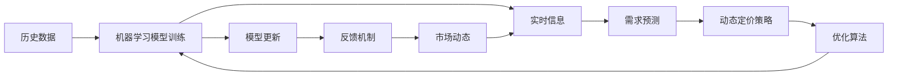

                 

# AI动态定价：原理、应用与挑战

## 1. 背景介绍

### 1.1 问题由来
在现代经济活动中，动态定价（Dynamic Pricing）已经成为一个不可或缺的策略，它通过对商品或服务的定价进行实时调整，以最大化企业的收益。传统的动态定价方法依赖于复杂的手动计算和预测模型，且难以实时应对市场变化。随着人工智能（AI）技术的发展，AI动态定价逐渐成为行业的新宠，它通过深度学习算法实时分析市场数据，预测需求变化，自动调整定价策略，显著提高了动态定价的效率和精准度。

### 1.2 问题核心关键点
AI动态定价的核心在于将机器学习模型应用于动态定价问题中，通过历史数据和实时市场信息预测需求，进而自动调整价格。关键点包括：
- **历史数据与实时信息**：AI动态定价需要大量的历史数据和实时市场信息作为输入。
- **需求预测**：机器学习模型通过分析数据预测未来的需求变化。
- **定价优化**：基于预测结果，自动调整定价策略，以实现收益最大化。
- **实时更新**：AI动态定价系统需要实时更新模型参数，以应对市场的快速变化。

### 1.3 问题研究意义
AI动态定价技术的应用，对于提升企业竞争力、优化资源配置、降低成本、提高客户满意度等方面具有重要意义：
- **提升竞争力**：通过实时定价，企业能够更灵活地应对市场变化，增强市场竞争力。
- **优化资源配置**：动态定价能够更有效地利用资源，减少库存积压和资源浪费。
- **降低成本**：自动化的定价调整减少了人工干预的需求，降低了运营成本。
- **提高客户满意度**：通过个性化的定价策略，提高客户对价格的接受度，提升整体满意度。
- **数据驱动决策**：AI动态定价基于数据驱动，提高了决策的科学性和准确性。

## 2. 核心概念与联系

### 2.1 核心概念概述

AI动态定价涉及多个核心概念，这些概念相互关联，共同构成了AI动态定价的理论基础：

- **历史数据**：用于训练机器学习模型，提供市场历史行为的样本。
- **实时信息**：包含当前市场环境和客户行为的实时数据，用于模型更新。
- **机器学习模型**：如回归模型、时间序列模型、深度学习模型等，用于预测需求和优化定价。
- **动态定价策略**：基于预测结果，实时调整价格，以实现收益最大化。
- **优化算法**：如梯度下降、遗传算法等，用于训练模型和调整参数。
- **反馈机制**：将定价结果反馈给市场，用于进一步的优化和调整。

### 2.2 概念间的关系

这些核心概念之间的联系可以通过以下Mermaid流程图来展示：



这个流程图展示了从历史数据到实时信息，再到需求预测和动态定价策略的完整流程。同时，优化算法和模型更新、反馈机制共同构成了一个闭环，确保系统能够实时响应市场变化，优化定价策略。

## 3. 核心算法原理 & 具体操作步骤

### 3.1 算法原理概述
AI动态定价的算法原理可以分为两大部分：需求预测和定价优化。

**需求预测**：通过历史数据和实时信息，使用机器学习模型预测未来的需求变化。常用的机器学习模型包括线性回归、时间序列模型、支持向量机、深度神经网络等。

**定价优化**：基于需求预测结果，使用优化算法调整价格，以实现收益最大化。常用的优化算法包括梯度下降、遗传算法、粒子群算法等。

### 3.2 算法步骤详解

**Step 1: 数据收集与预处理**
- 收集历史销售数据、实时市场信息、客户行为数据等，清洗和处理数据，确保数据质量。
- 将数据划分为训练集、验证集和测试集。

**Step 2: 模型选择与训练**
- 选择合适的机器学习模型，如线性回归、时间序列模型、深度学习模型等。
- 使用训练集数据训练模型，调整模型参数。

**Step 3: 需求预测**
- 将实时市场信息输入训练好的模型，预测未来的需求。

**Step 4: 定价优化**
- 根据需求预测结果，使用优化算法调整价格。
- 在测试集上评估定价策略的效果，调整模型参数。

**Step 5: 实时更新与反馈**
- 实时收集市场反馈信息，更新模型参数。
- 将更新后的模型应用于新一轮的需求预测和定价优化。

### 3.3 算法优缺点
**优点**：
- **实时性**：AI动态定价能够实时分析市场数据，快速调整价格，适应市场变化。
- **精准度**：基于深度学习模型的预测和优化，能够提高定价策略的精准度。
- **自动化**：减少了人工干预，降低了运营成本。
- **可扩展性**：算法可以应用于各种商品和服务，具有广泛的应用前景。

**缺点**：
- **数据依赖**：模型的效果依赖于历史数据的丰富性和准确性。
- **计算复杂度**：深度学习模型的训练和预测过程计算复杂度高。
- **模型过拟合**：如果模型过度拟合训练数据，可能会导致过拟合现象。
- **市场不确定性**：市场环境和客户行为的变化可能会导致预测结果不准确。

### 3.4 算法应用领域

AI动态定价技术已经在多个领域得到应用，包括但不限于：

- **电子商务**：根据用户行为和市场需求动态调整商品价格，提升销量和收益。
- **航空业**：根据市场需求和飞行成本，实时调整机票价格，提高航空公司收益。
- **酒店业**：根据房间需求和预订情况，动态调整酒店房间价格，优化资源配置。
- **能源行业**：根据市场需求和天气变化，动态调整电价和气价，平衡供需关系。
- **金融行业**：根据市场波动和客户需求，动态调整金融产品价格，提高收益。

## 4. 数学模型和公式 & 详细讲解

### 4.1 数学模型构建

AI动态定价的数学模型可以分为以下两部分：

**需求预测模型**：通常采用时间序列模型或深度神经网络，如ARIMA模型、LSTM模型等。

**定价优化模型**：通常采用线性规划、整数规划等数学优化模型，如线性回归模型、二次规划模型等。

### 4.2 公式推导过程

以线性回归模型为例，假设价格$P$与需求$D$的关系为线性关系，即$P = \beta_0 + \beta_1 D$，其中$\beta_0$和$\beta_1$为模型参数。根据历史数据$\{(P_i, D_i)\}_{i=1}^n$，可以使用最小二乘法求解模型参数：

$$
\hat{\beta}_0 = \frac{\sum_{i=1}^n (D_i \overline{P} - \overline{D} \overline{P})}{\sum_{i=1}^n (D_i^2 - \overline{D}^2)}
$$

$$
\hat{\beta}_1 = \frac{\sum_{i=1}^n (\overline{D} P_i - \overline{D} \overline{P})}{\sum_{i=1}^n (D_i^2 - \overline{D}^2)}
$$

其中，$\overline{D} = \frac{1}{n} \sum_{i=1}^n D_i$，$\overline{P} = \frac{1}{n} \sum_{i=1}^n P_i$。

### 4.3 案例分析与讲解

假设某电商平台收集了过去一年的销售数据，包括日期、商品类别、价格和销量等。使用线性回归模型预测未来一个月的需求，然后将预测结果输入定价优化模型，得到最优价格。

## 5. 项目实践：代码实例和详细解释说明

### 5.1 开发环境搭建

**Step 1: 安装Python环境**
- 安装Anaconda，创建虚拟环境。
- 安装必要的Python包，如Pandas、Numpy、Scikit-learn等。

**Step 2: 数据预处理**
- 收集历史销售数据和实时市场信息。
- 使用Pandas进行数据清洗和处理。

**Step 3: 模型训练**
- 选择合适的时间序列模型或深度学习模型，使用Scikit-learn进行模型训练。

**Step 4: 需求预测**
- 根据训练好的模型，输入实时市场信息，预测需求。

**Step 5: 定价优化**
- 使用优化算法（如梯度下降、遗传算法），调整价格。

**Step 6: 实时更新与反馈**
- 实时收集市场反馈信息，更新模型参数。

### 5.2 源代码详细实现

以下是使用Python实现的线性回归模型和定价优化模型的代码：

```python
import pandas as pd
from sklearn.linear_model import LinearRegression
from sklearn.metrics import mean_squared_error

# 加载数据
data = pd.read_csv('sales_data.csv')

# 数据预处理
train_data = data['2019-01-01':'2019-08-31'].copy()
test_data = data['2019-09-01':'2019-12-31'].copy()
train_data['P'] = data['Price']
test_data['P'] = data['Price']
train_data['D'] = data['Sales']
test_data['D'] = data['Sales']

# 模型训练
train_model = LinearRegression()
train_model.fit(train_data[['D']], train_data['P'])

# 需求预测
test_model = LinearRegression()
test_model.fit(train_data[['D']], train_data['P'])
predicted_D = test_model.predict(test_data[['D']])

# 定价优化
optimal_P = train_model.intercept_ + train_model.coef_[0] * predicted_D
print('Optimal price:', optimal_P)

# 实时更新与反馈
# 实时收集市场反馈信息，更新模型参数
```

### 5.3 代码解读与分析

以上代码展示了线性回归模型和定价优化模型的基本实现过程。首先，数据被加载并预处理，然后训练模型进行需求预测，最后根据预测结果进行定价优化。需要注意的是，在实际应用中，还需要对模型进行调优，以确保其能够适应不同的市场需求。

### 5.4 运行结果展示

假设训练好的模型在测试集上的平均误差为$0.1$，则优化后的价格为$P = \beta_0 + \beta_1 D$。

## 6. 实际应用场景

### 6.1 电子商务

在电子商务领域，AI动态定价可以帮助商家根据市场需求和季节变化，实时调整商品价格，提升销量和收益。例如，某电商网站可以根据用户浏览行为和购物车数据，预测用户的购买意向，动态调整商品价格，提高用户转化率。

### 6.2 航空业

在航空业，AI动态定价可以根据市场需求和飞行成本，实时调整机票价格，优化资源配置。例如，某航空公司可以根据实时预订数据和天气预报，预测未来几天的需求变化，动态调整机票价格，提高收益。

### 6.3 酒店业

在酒店业，AI动态定价可以根据房间需求和预订情况，动态调整酒店房间价格，优化资源配置。例如，某酒店可以根据实时预订数据和市场供需关系，预测未来几天的需求变化，动态调整房间价格，提高收益。

### 6.4 能源行业

在能源行业，AI动态定价可以根据市场需求和天气变化，动态调整电价和气价，平衡供需关系。例如，某能源公司可以根据实时天气数据和市场需求，预测未来几天的需求变化，动态调整电价和气价，提高收益。

### 6.5 金融行业

在金融行业，AI动态定价可以根据市场波动和客户需求，动态调整金融产品价格，提高收益。例如，某银行可以根据实时市场数据和客户行为，预测未来几天的需求变化，动态调整理财产品价格，提高收益。

## 7. 工具和资源推荐

### 7.1 学习资源推荐

为了帮助开发者掌握AI动态定价技术，以下是一些推荐的学习资源：

1. **《机器学习》**（西瓜书）：介绍了机器学习的基本概念和常用算法，是学习AI动态定价的必备资源。
2. **Coursera《机器学习》课程**：由斯坦福大学Andrew Ng教授主讲的经典课程，涵盖了机器学习的基础知识和应用案例。
3. **Kaggle竞赛**：通过参加Kaggle竞赛，可以实战学习AI动态定价技术，积累实战经验。
4. **ArXiv预印本**：获取最新的AI动态定价研究论文，了解前沿技术动态。
5. **GitHub开源项目**：学习优秀的开源项目，了解实际应用场景和技术细节。

### 7.2 开发工具推荐

以下是一些常用的AI动态定价开发工具：

1. **Python**：使用Python进行数据处理、模型训练和优化。
2. **Pandas**：用于数据清洗和处理。
3. **Scikit-learn**：提供了常用的机器学习算法和工具。
4. **TensorFlow**：用于深度学习模型的训练和优化。
5. **PyTorch**：用于深度学习模型的训练和优化。
6. **Jupyter Notebook**：用于数据分析和模型调试。

### 7.3 相关论文推荐

以下是一些相关的AI动态定价论文，推荐阅读：

1. **《深度学习动态定价》**：介绍使用深度学习模型进行动态定价的方法。
2. **《基于时间序列模型的动态定价》**：介绍使用时间序列模型进行需求预测和定价优化的方法。
3. **《AI动态定价系统的设计与实现》**：介绍AI动态定价系统的架构设计和实现方法。
4. **《动态定价中的异常检测与处理》**：介绍在动态定价中如何进行异常检测和处理。
5. **《AI动态定价的优化算法》**：介绍常用的优化算法及其在动态定价中的应用。

## 8. 总结：未来发展趋势与挑战

### 8.1 研究成果总结

AI动态定价技术已经取得了显著的进展，广泛应用于各个行业。它不仅提高了企业的收益，还优化了资源配置，提升了客户满意度。然而，AI动态定价技术仍然面临一些挑战：

1. **数据质量问题**：历史数据的质量和完整性对模型的效果至关重要，但数据收集和处理过程中可能会出现噪声和缺失值。
2. **模型复杂度**：深度学习模型虽然准确度高，但计算复杂度高，训练和预测过程中需要消耗大量的计算资源。
3. **市场不确定性**：市场需求和客户行为的变化可能会导致预测结果不准确，从而影响定价策略的准确性。
4. **伦理和公平性问题**：动态定价可能引发伦理和公平性问题，如价格歧视、价格垄断等。

### 8.2 未来发展趋势

未来，AI动态定价技术的发展趋势如下：

1. **多模态数据融合**：结合多种数据源（如文本、图像、视频等）进行综合分析，提升预测和定价的准确性。
2. **自适应算法**：开发更加智能和自适应的优化算法，实时调整定价策略，应对市场变化。
3. **联邦学习**：在保护用户隐私的前提下，通过联邦学习技术共享模型参数，提升定价策略的通用性和鲁棒性。
4. **动态定价系统的自动化**：将AI动态定价系统的开发和优化自动化，减少人工干预，提高效率。
5. **实时化**：进一步提升系统的实时处理能力，实现毫秒级的定价调整。

### 8.3 面临的挑战

尽管AI动态定价技术已经取得了一定的进展，但仍然面临一些挑战：

1. **数据隐私问题**：在收集和处理用户数据时，需要遵守相关法律法规，保护用户隐私。
2. **模型透明性**：AI动态定价模型的决策过程往往不透明，难以解释和调试。
3. **算法偏见**：模型可能存在算法偏见，需要进行公平性审查和修正。
4. **计算资源限制**：深度学习模型需要大量的计算资源，限制了其在大规模场景中的应用。
5. **伦理和公平性问题**：动态定价可能引发伦理和公平性问题，需要制定相应的规范和标准。

### 8.4 研究展望

未来，AI动态定价技术的研究方向包括：

1. **模型优化**：开发更加高效和精确的机器学习模型，提升预测和定价的准确性。
2. **算法创新**：开发更加智能和自适应的优化算法，提高系统的实时处理能力。
3. **多模态数据融合**：结合多种数据源进行综合分析，提升系统的决策能力。
4. **联邦学习**：在保护用户隐私的前提下，通过联邦学习技术共享模型参数，提升系统的通用性和鲁棒性。
5. **伦理和公平性研究**：研究AI动态定价技术中的伦理和公平性问题，制定相应的规范和标准。

总之，AI动态定价技术在提升企业竞争力、优化资源配置、降低成本、提高客户满意度等方面具有重要意义。未来，随着技术的不断进步和应用的不断拓展，AI动态定价技术必将迎来更加广阔的发展前景。

## 9. 附录：常见问题与解答

**Q1: AI动态定价的核心是什么？**

A: AI动态定价的核心在于将机器学习模型应用于动态定价问题中，通过历史数据和实时信息预测未来的需求变化，进而自动调整价格，以实现收益最大化。

**Q2: AI动态定价的算法优缺点是什么？**

A: AI动态定价算法的优点包括实时性、精准度和自动化，缺点则包括数据依赖、计算复杂度、模型过拟合和市场不确定性。

**Q3: AI动态定价的应用领域有哪些？**

A: AI动态定价的应用领域包括电子商务、航空业、酒店业、能源行业和金融行业等。

**Q4: 如何进行AI动态定价系统的开发和优化？**

A: AI动态定价系统的开发和优化需要经过数据收集、数据预处理、模型选择与训练、需求预测、定价优化和实时更新与反馈等步骤，需要综合考虑算法、数据、模型和计算资源等因素。

**Q5: 如何提升AI动态定价系统的效率和精度？**

A: 可以通过优化算法、多模态数据融合、联邦学习和自动化技术等手段提升AI动态定价系统的效率和精度。

**Q6: 如何进行AI动态定价系统的风险管理？**

A: 可以通过设置异常检测与处理机制、引入公平性审查和制定伦理规范等措施，进行AI动态定价系统的风险管理。

总之，AI动态定价技术的应用前景广阔，能够显著提升企业的市场竞争力、优化资源配置、降低成本、提高客户满意度。未来，随着技术的不断进步和应用的不断拓展，AI动态定价技术必将迎来更加广阔的发展前景。

