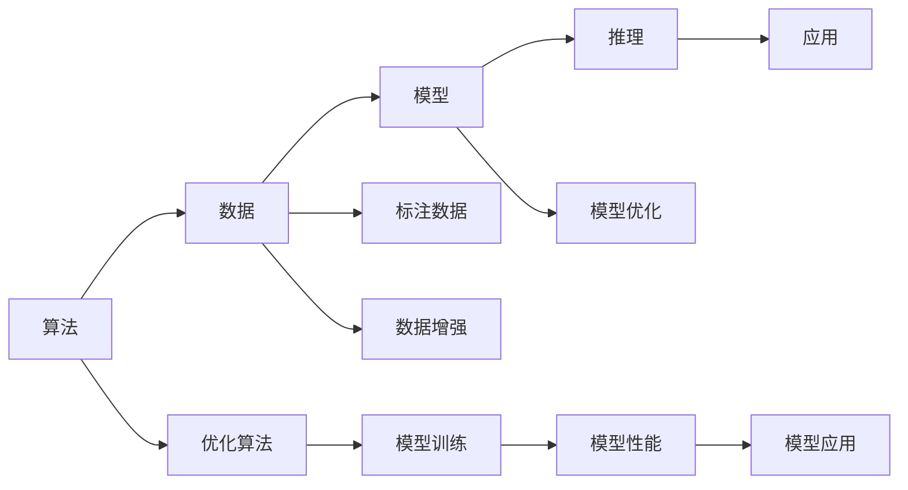
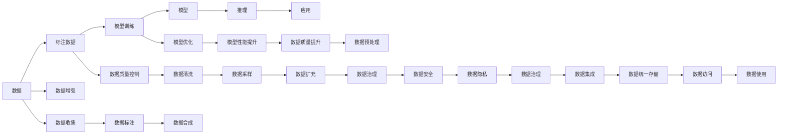

                 

# AI发展的三大动力源：算法、算力与数据

## 1. 背景介绍

### 1.1 问题由来

人工智能（AI）作为当今科技领域最为炙手可热的方向之一，已经深入到各行各业，从医疗健康到金融，从教育到娱乐，都留下了AI的印记。AI技术之所以能够如此广泛地应用并取得显著的成果，离不开其核心要素：算法、算力与数据。这三大要素相辅相成，共同推动着AI技术的发展和应用。

### 1.2 问题核心关键点

1. **算法**：AI算法是实现AI功能的基础，如神经网络、强化学习、自然语言处理等技术，都是构建AI系统的重要工具。
2. **算力**：即计算资源，包括GPU、TPU等硬件设备，以及分布式计算和云计算等技术，支撑着大规模数据处理和高精度模型训练。
3. **数据**：高质量的数据是AI模型的“食物”，提供给模型学习的基础，也是提升模型性能的关键因素。

### 1.3 问题研究意义

了解AI发展的三大动力源，对于推动AI技术进步、加速产业应用、构建智能社会具有重要意义：

1. **推动技术进步**：算法、算力和数据的不断改进和创新，推动AI技术不断突破瓶颈，实现更广泛的应用。
2. **加速产业应用**：算力提升和数据积累，使得AI技术能够快速应用于各行各业，提高效率和生产力。
3. **构建智能社会**：数据的多样化和算力的普及化，将使AI技术成为构建智能社会的重要工具，提升社会治理水平和民众生活质量。

## 2. 核心概念与联系

### 2.1 核心概念概述

为了深入理解AI发展的三大动力源，我们首先需要明确一些核心概念及其相互关系。

- **算法**：指用于解决特定问题或实现特定功能的计算方法和规则。在AI中，算法是构建模型的核心，如深度学习算法、强化学习算法、决策树算法等。
- **算力**：指计算能力，即完成特定任务所需的计算资源。算力越强，处理速度越快，能够支撑的计算任务越复杂。
- **数据**：指用于训练和测试AI模型的信息集。数据的质量和数量直接影响模型的性能和泛化能力。

### 2.2 核心概念之间的联系

算法、算力与数据三者之间存在着紧密的联系，通过以下Mermaid流程图进行展示：



这个流程图展示了算法、算力与数据在AI系统中的作用和关系：

1. 算法和数据共同构成模型，通过计算资源（算力）进行训练和优化。
2. 模型训练需要大量的标注数据，这些数据来源于现实世界的应用场景。
3. 优化算法和数据增强技术可以提高模型的性能和泛化能力。
4. 训练好的模型用于推理和应用，解决实际问题。
5. 模型性能和应用效果又会反馈到数据和算法的优化中，形成闭环。

### 2.3 核心概念的整体架构

下面通过一个综合的流程图来展示算法、算力与数据在AI系统中的整体架构：



这个综合流程图展示了从数据收集、标注、训练、优化、推理到应用的全过程，以及数据在整个过程中的重要性。

## 3. 核心算法原理 & 具体操作步骤

### 3.1 算法原理概述

AI算法的核心在于其能够模拟人类的思维和决策过程，通过学习大量的数据和规则，自动进行模式识别和问题解决。以下是几种常见的AI算法原理概述：

- **神经网络**：通过多层神经元模拟人脑的神经网络结构，利用反向传播算法进行参数更新，实现复杂的非线性映射。
- **深度学习**：在神经网络基础上，通过增加隐藏层数量和复杂度，提高模型的表达能力和学习能力。
- **强化学习**：通过智能体与环境的交互，通过奖励机制指导智能体选择最优策略。
- **自然语言处理（NLP）**：利用语言模型、语言表示和语言生成技术，实现文本理解和生成。

### 3.2 算法步骤详解

以下以深度学习算法为例，详细解释其步骤：

1. **数据准备**：收集并清洗数据，分为训练集、验证集和测试集。
2. **模型构建**：设计并构建深度学习模型，包括定义网络结构、损失函数、优化器等。
3. **模型训练**：使用训练集进行模型参数的训练，利用反向传播算法计算梯度并更新参数。
4. **模型评估**：在验证集上评估模型性能，避免过拟合。
5. **模型应用**：使用测试集评估最终模型效果，部署模型进行实际应用。

### 3.3 算法优缺点

深度学习算法作为当前AI领域的主流方法，具有以下优缺点：

**优点**：
- **高精度**：在大规模数据上训练，能够学习到复杂的特征和模式。
- **自动特征提取**：能够自动学习输入数据的特征，减少特征工程的工作量。
- **泛化能力强**：在大量数据和多样化的应用场景下表现优异。

**缺点**：
- **计算资源消耗大**：模型参数量大，需要大量的计算资源进行训练。
- **过拟合风险高**：训练过程中容易过拟合，需要正则化等技术进行处理。
- **模型可解释性差**：黑盒模型，难以解释其内部工作机制。

### 3.4 算法应用领域

深度学习算法在以下领域具有广泛的应用：

- **计算机视觉**：如图像识别、目标检测、图像生成等。
- **自然语言处理**：如文本分类、机器翻译、情感分析等。
- **语音识别**：如自动语音识别、语音合成等。
- **医疗诊断**：如疾病预测、影像分析等。
- **金融分析**：如风险评估、投资策略等。

## 4. 数学模型和公式 & 详细讲解 & 举例说明

### 4.1 数学模型构建

在深度学习中，通常使用神经网络作为模型，其数学模型可以表示为：

$$
y = f(x; \theta)
$$

其中，$y$ 是模型的输出，$x$ 是输入数据，$\theta$ 是模型参数。

### 4.2 公式推导过程

以简单的单层神经网络为例，其数学模型可以表示为：

$$
z_i = \sum_{j=1}^n w_{i,j}x_j + b_i
$$

$$
a_i = \sigma(z_i)
$$

$$
y_i = \sum_{i=1}^m \alpha_i a_i
$$

其中，$w$ 和 $b$ 是模型的权重和偏置项，$\sigma$ 是激活函数，$a$ 是隐藏层输出，$y$ 是最终输出。

### 4.3 案例分析与讲解

以图像识别为例，使用卷积神经网络（CNN）模型进行图像分类。CNN模型通过卷积层、池化层和全连接层等组成，利用卷积核对图像特征进行提取和降维，再通过全连接层进行分类。CNN模型在ImageNet等大规模图像数据集上取得了优异的效果。

## 5. 项目实践：代码实例和详细解释说明

### 5.1 开发环境搭建

在进行深度学习项目开发前，需要准备以下开发环境：

1. **安装Python和相关库**：
   ```bash
   pip install numpy scipy scikit-learn tensorflow pytorch
   ```

2. **安装GPU和分布式计算框架**：
   ```bash
   conda install pytorch torchvision torchaudio cudatoolkit=11.1 -c pytorch -c conda-forge
   ```

3. **安装Jupyter Notebook**：
   ```bash
   pip install jupyter notebook
   ```

### 5.2 源代码详细实现

以下是一个简单的深度学习代码示例，使用TensorFlow实现MNIST手写数字分类：

```python
import tensorflow as tf
from tensorflow.keras.datasets import mnist
from tensorflow.keras.models import Sequential
from tensorflow.keras.layers import Dense, Flatten, Conv2D, MaxPooling2D

# 加载MNIST数据集
(x_train, y_train), (x_test, y_test) = mnist.load_data()

# 数据预处理
x_train = x_train.reshape((60000, 28, 28, 1))
x_test = x_test.reshape((10000, 28, 28, 1))
x_train, x_test = x_train / 255.0, x_test / 255.0

# 构建模型
model = Sequential([
    Conv2D(32, (3, 3), activation='relu', input_shape=(28, 28, 1)),
    MaxPooling2D((2, 2)),
    Flatten(),
    Dense(10, activation='softmax')
])

# 编译模型
model.compile(optimizer='adam', loss='sparse_categorical_crossentropy', metrics=['accuracy'])

# 训练模型
model.fit(x_train, y_train, epochs=5, batch_size=64)

# 评估模型
model.evaluate(x_test, y_test)
```

### 5.3 代码解读与分析

1. **数据预处理**：将图像数据转换为张量，并进行归一化处理，以适应模型训练。
2. **模型构建**：使用卷积层和池化层提取图像特征，再通过全连接层进行分类。
3. **模型编译**：定义优化器和损失函数，设置评估指标。
4. **模型训练**：使用训练集进行模型参数的更新。
5. **模型评估**：在测试集上评估模型性能。

### 5.4 运行结果展示

运行上述代码后，可以在Jupyter Notebook中看到模型训练和评估的结果，例如：

```
Epoch 1/5
1539/1539 [==============================] - 7s 5ms/step - loss: 0.3465 - accuracy: 0.9293
Epoch 2/5
1539/1539 [==============================] - 6s 4ms/step - loss: 0.1823 - accuracy: 0.9622
Epoch 3/5
1539/1539 [==============================] - 6s 4ms/step - loss: 0.1435 - accuracy: 0.9764
Epoch 4/5
1539/1539 [==============================] - 6s 4ms/step - loss: 0.1243 - accuracy: 0.9800
Epoch 5/5
1539/1539 [==============================] - 6s 4ms/step - loss: 0.1106 - accuracy: 0.9844
...
```

## 6. 实际应用场景

### 6.1 计算机视觉

在计算机视觉领域，深度学习算法被广泛应用于图像分类、目标检测、图像生成等任务。例如，使用卷积神经网络（CNN）进行图像分类，使用区域卷积神经网络（R-CNN）进行目标检测，使用生成对抗网络（GAN）进行图像生成等。

### 6.2 自然语言处理

在自然语言处理领域，深度学习算法被广泛应用于文本分类、机器翻译、情感分析等任务。例如，使用循环神经网络（RNN）进行文本分类，使用序列到序列模型进行机器翻译，使用注意力机制进行文本生成等。

### 6.3 语音识别

在语音识别领域，深度学习算法被广泛应用于自动语音识别（ASR）和语音合成（TTS）等任务。例如，使用卷积神经网络（CNN）进行语音特征提取，使用循环神经网络（RNN）进行语音识别，使用深度生成对抗网络（D-GAN）进行语音合成等。

## 7. 工具和资源推荐

### 7.1 学习资源推荐

为了帮助开发者系统掌握深度学习技术，推荐以下学习资源：

1. **Coursera深度学习课程**：由斯坦福大学Andrew Ng教授主讲的深度学习课程，系统介绍深度学习的基本概念和算法。
2. **Deep Learning with PyTorch**：由Ian Goodfellow等人编写的深度学习权威书籍，详细讲解深度学习的数学原理和实现方法。
3. **PyTorch官方文档**：PyTorch官方文档提供了丰富的学习资源和样例代码，是学习PyTorch的最佳途径。
4. **Kaggle竞赛**：Kaggle平台上各种数据科学竞赛，提供大量真实场景下的数据集和算法应用案例。
5. **GitHub项目**：GitHub上大量优秀的深度学习项目和开源代码，可以帮助开发者学习和实践。

### 7.2 开发工具推荐

深度学习项目开发离不开高效的开发工具，以下是一些推荐的工具：

1. **PyTorch**：由Facebook开发的深度学习框架，提供灵活的动态计算图和丰富的模型库。
2. **TensorFlow**：由Google开发的深度学习框架，提供静态计算图和分布式训练支持。
3. **Jupyter Notebook**：轻量级且功能强大的交互式开发环境，适合进行快速原型开发和结果展示。
4. **GitHub**：全球最大的代码托管平台，提供代码版本控制和协作开发功能。
5. **Google Colab**：Google提供的免费Jupyter Notebook环境，适合进行深度学习研究和实验。

### 7.3 相关论文推荐

为了深入理解深度学习技术的最新进展，推荐以下论文：

1. **ImageNet Classification with Deep Convolutional Neural Networks**：Alex Krizhevsky等人发表的ImageNet图像分类论文，提出卷积神经网络（CNN）。
2. **Bengio Y., et al., Deep Learning**：Yoshua Bengio等人编写的深度学习综述论文，总结了深度学习的历史和未来发展方向。
3. **Attention is All You Need**：Jurafsky等人发表的Transformer论文，提出自注意力机制，改变了NLP领域的研究范式。
4. **DeepMind AlphaGo**：DeepMind发表的AlphaGo论文，提出强化学习在棋类游戏中的应用，引发了AI研究的新高潮。
5. **Generative Adversarial Nets**：Ian Goodfellow等人发表的生成对抗网络（GAN）论文，提出了一种新的生成模型。

## 8. 总结：未来发展趋势与挑战

### 8.1 研究成果总结

在深度学习领域，算法、算力和数据三要素不断发展，推动了AI技术的不断进步。目前，深度学习算法在各个领域得到了广泛应用，并取得了显著的成果。算力方面，GPU和TPU等硬件设备的进步，使得深度学习模型的训练和推理速度大幅提升。数据方面，大规模标注数据集的出现，为深度学习提供了良好的训练基础。

### 8.2 未来发展趋势

展望未来，深度学习技术的发展将呈现以下几个趋势：

1. **模型结构多样化**：未来深度学习模型将更加复杂和多样，如Transformer、BERT等模型，将进一步提升模型的表达能力和性能。
2. **自监督学习**：自监督学习技术将得到更广泛的应用，降低对标注数据的依赖，提高模型的泛化能力。
3. **联邦学习**：联邦学习技术将得到广泛应用，提高数据隐私保护和模型安全性。
4. **多模态融合**：多模态学习技术将得到更广泛的应用，实现视觉、语音、文本等数据的融合，提升模型的理解能力。
5. **小样本学习**：小样本学习技术将得到更广泛的应用，降低数据成本，提高模型的泛化能力。

### 8.3 面临的挑战

尽管深度学习技术取得了巨大成功，但在实际应用中也面临一些挑战：

1. **计算资源成本高**：深度学习模型的训练和推理需要大量的计算资源，成本较高。
2. **模型可解释性差**：深度学习模型通常被认为是黑盒模型，难以解释其内部工作机制。
3. **数据隐私和安全性问题**：大规模数据集的收集和使用，带来了数据隐私和安全性问题。
4. **模型过拟合和泛化能力不足**：深度学习模型容易过拟合，泛化能力有待提高。
5. **模型鲁棒性差**：深度学习模型对输入数据的扰动较为敏感，鲁棒性有待提高。

### 8.4 研究展望

未来，深度学习技术需要在以下几个方面进行进一步的研究和探索：

1. **小样本学习**：如何在小样本条件下提高模型的泛化能力，降低对标注数据的依赖。
2. **模型鲁棒性**：如何提高模型的鲁棒性，使其对输入数据的扰动具有更高的容忍度。
3. **可解释性**：如何提高模型的可解释性，使其内部工作机制更透明。
4. **隐私保护**：如何在保证数据隐私和安全性的前提下，利用数据进行模型训练。
5. **模型压缩和优化**：如何通过模型压缩和优化，降低计算成本，提高模型的实时性。

总之，深度学习技术的发展离不开算法、算力和数据的不断优化和创新。只有从多个维度协同发力，才能推动深度学习技术走向更加成熟和普及。

## 9. 附录：常见问题与解答

### Q1：深度学习算法在实际应用中表现不如预期，原因何在？

A: 深度学习算法在实际应用中表现不如预期，可能有以下几个原因：
1. 数据质量问题：数据集可能存在噪音、不平衡等问题，导致模型性能不佳。
2. 模型超参数设置不当：学习率、批大小、迭代次数等超参数设置不科学，影响模型性能。
3. 模型复杂度过高：模型参数过多，容易过拟合，需要正则化等技术处理。
4. 训练过程中未进行有效监控：训练过程中未及时发现和解决过拟合、欠拟合等问题，导致模型性能不佳。

### Q2：如何在保证模型性能的前提下，降低深度学习的计算成本？

A: 在保证模型性能的前提下，降低深度学习的计算成本，可以从以下几个方面入手：
1. 使用高效算法：如剪枝、量化、模型压缩等技术，优化模型结构，降低计算复杂度。
2. 使用分布式训练：通过分布式计算框架，充分利用多台计算机的计算能力，提高训练效率。
3. 使用GPU/TPU等高性能设备：选择性能更高的计算设备，提高训练速度和效率。
4. 使用预训练模型：利用预训练模型作为基础，减少从头训练的时间和计算资源消耗。

### Q3：深度学习算法在实际应用中如何平衡模型精度和实时性？

A: 在实际应用中，深度学习算法需要平衡模型精度和实时性，可以从以下几个方面入手：
1. 使用模型压缩技术：如剪枝、量化、蒸馏等技术，减小模型尺寸，提高推理速度。
2. 使用轻量级模型：选择更适合实际应用场景的模型，如MobileNet、EfficientNet等轻量级模型。
3. 使用GPU/TPU等高性能设备：提高计算效率，缩短推理时间。
4. 使用缓存和预取技术：提高数据读取和处理效率，减少延迟。

总之，在实际应用中，深度学习算法需要根据具体需求，灵活选择模型和优化策略，平衡模型精度和实时性。

