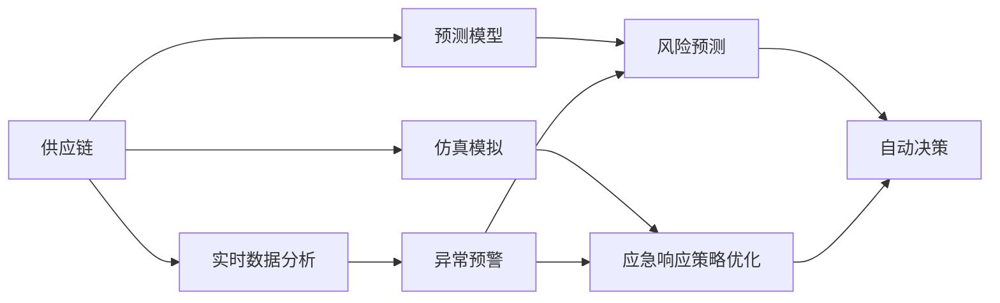

                 

# AI在供应链应急响应中的应用

> 关键词：供应链,应急响应,人工智能,机器学习,深度学习,预测模型,仿真模拟

## 1. 背景介绍

### 1.1 问题由来
在全球化和市场竞争日益激烈的背景下，供应链已成为企业发展的核心支柱，其安全性、稳定性、可靠性直接影响着企业的运营效率和经济效益。近年来，各种自然灾害、政治冲突、疫情暴发等不确定性因素频发，给供应链带来严峻挑战。传统的人工监控和应急响应手段已经难以应对复杂多变的供应链风险。

### 1.2 问题核心关键点
为了提升供应链的应急响应能力，亟需借助人工智能（AI）和大数据技术，构建智能化的供应链应急管理平台。AI可以通过实时数据分析、预测模型构建、仿真模拟等多种方式，实现供应链风险的早期预警和快速响应。具体而言，AI在供应链应急响应中的应用包括：

- **实时数据分析**：利用机器学习、深度学习等技术对供应链数据进行实时处理和分析，及时发现异常情况。
- **预测模型构建**：通过建立各种风险预测模型，对供应链中断、需求变化等事件进行预测和预警。
- **仿真模拟**：使用AI技术构建供应链仿真平台，模拟各种场景下的应急响应效果，优化供应链管理策略。
- **自动化决策支持**：通过AI算法辅助决策，快速制定最优应急响应方案，提升应急管理效率。

## 2. 核心概念与联系

### 2.1 核心概念概述

在讨论AI在供应链应急响应中的应用时，我们需要了解以下核心概念及其相互联系：

- **供应链（Supply Chain）**：涉及从原材料采购、生产、物流、分销到最终交付的整个流程，是企业竞争力的核心。
- **应急响应（Emergency Response）**：在突发事件发生时，采取有效措施，迅速恢复供应链正常运行的过程。
- **人工智能（Artificial Intelligence, AI）**：包括机器学习、深度学习、自然语言处理、计算机视觉等子领域，能够处理大规模复杂数据，提供智能化决策支持。
- **实时数据分析（Real-time Data Analytics）**：对供应链数据进行实时处理和分析，识别异常情况，支持快速决策。
- **预测模型（Predictive Models）**：利用历史数据和机器学习算法构建预测模型，预测供应链风险。
- **仿真模拟（Simulation）**：通过构建虚拟供应链环境，模拟不同场景下的应急响应效果，优化决策策略。
- **自动化决策支持（Automated Decision Support）**：基于AI算法和模型，提供智能化的决策辅助，提高应急响应效率。

这些概念通过以下Mermaid流程图展示它们之间的联系：



## 3. 核心算法原理 & 具体操作步骤

### 3.1 算法原理概述

基于AI的供应链应急响应，主要依赖于机器学习、深度学习和仿真模拟等技术手段。其核心思想是通过对供应链数据的实时分析，构建预测模型，并进行仿真模拟，以提供决策支持和应急响应。

1. **实时数据分析**：利用机器学习算法对供应链实时数据进行处理和分析，识别异常情况，如异常运输延迟、库存不足、需求变化等。
2. **预测模型**：通过深度学习模型对历史数据进行训练，预测供应链中断、需求波动等事件的发生，为应急响应提供数据支持。
3. **仿真模拟**：构建虚拟供应链环境，使用仿真模拟技术评估不同应急响应策略的效果，选择最优方案。
4. **自动化决策支持**：基于机器学习模型和仿真模拟结果，提供智能化的应急响应建议，辅助决策。

### 3.2 算法步骤详解

**Step 1: 数据收集与预处理**
- 收集供应链各环节的数据，包括库存量、运输状态、订单信息、供应商反馈等。
- 对数据进行清洗和标准化处理，去除噪声和异常值。
- 使用缺失值填补、归一化等技术对数据进行预处理。

**Step 2: 实时数据分析**
- 构建实时数据分析系统，对供应链数据进行流式处理和分析。
- 利用时间序列分析、异常检测等方法，识别供应链中的异常情况。
- 使用机器学习模型（如SVM、随机森林等）对异常数据进行分类和预测。

**Step 3: 预测模型构建**
- 收集历史数据，划分为训练集和测试集。
- 选择适当的深度学习模型（如RNN、LSTM、CNN等）进行训练。
- 通过交叉验证等技术评估模型性能，调整模型参数。

**Step 4: 仿真模拟**
- 构建虚拟供应链环境，使用仿真模拟工具（如AnyLogic、SimPy等）模拟供应链中断、需求变化等场景。
- 根据预测模型的输出，对供应链进行多次仿真模拟，评估不同应急响应策略的效果。
- 优化供应链管理策略，提高供应链的鲁棒性和稳定性。

**Step 5: 自动化决策支持**
- 将预测模型的输出和仿真模拟结果，整合到AI决策系统中。
- 使用强化学习算法（如Q-learning、Deep Q-Networks等）优化应急响应策略。
- 提供自动化的决策建议，辅助供应链管理者进行应急响应决策。

### 3.3 算法优缺点

**优点**：
- **实时响应**：能够实时监控供应链数据，快速识别和响应异常情况。
- **预测准确**：基于历史数据和深度学习模型，预测供应链风险准确性高。
- **模拟优化**：通过仿真模拟，优化供应链管理策略，提升应急响应能力。
- **自动化决策**：提供智能化的决策支持，降低人为决策的错误率。

**缺点**：
- **数据依赖**：需要大量的历史数据进行训练，数据不足时模型效果受限。
- **模型复杂**：深度学习模型的训练和优化过程复杂，需要高算力和高性能计算资源。
- **仿真复杂性**：构建虚拟供应链环境复杂，需要结合多学科知识。
- **解释性不足**：AI决策系统的“黑盒”特性，难以解释其决策过程。

### 3.4 算法应用领域

AI在供应链应急响应中的应用领域非常广泛，具体包括：

- **运输管理**：实时监控运输状态，预测运输延误，优化运输路径。
- **库存管理**：预测库存需求变化，优化库存量，避免库存过剩或缺货。
- **供应商管理**：评估供应商的可靠性和风险，选择最优供应商。
- **应急响应**：在突发事件发生时，快速响应，恢复供应链正常运行。
- **风险评估**：通过预测模型评估供应链风险，制定应急响应策略。

## 4. 数学模型和公式 & 详细讲解  
### 4.1 数学模型构建

本节将使用数学语言对基于AI的供应链应急响应模型进行更加严格的刻画。

假设供应链的数据序列为 $\{x_t\}_{t=1}^T$，其中 $x_t$ 为在时间 $t$ 的供应链状态（如库存量、运输状态等）。目标是对供应链数据进行分析，预测未来状态 $x_{t+1}$，并基于预测结果进行仿真模拟和应急响应决策。

定义预测模型为 $f(x_t) = \hat{x}_{t+1}$，其中 $\hat{x}_{t+1}$ 为模型预测的未来状态。模型的损失函数为 $L(\theta) = \sum_{t=1}^T (x_{t+1} - f(x_t))^2$，其中 $\theta$ 为模型参数。

### 4.2 公式推导过程

我们以时间序列预测为例，推导深度学习模型（如LSTM）的预测公式。

假设模型 $f(x_t)$ 为长短期记忆网络（LSTM），其输入为 $x_t$，输出为 $\hat{x}_{t+1}$。LSTM的预测公式如下：

$$
\hat{x}_{t+1} = f(x_t) = \sigma(W_f\sigma_{lstm} + W_hx_t + W_cx_{t-1} + b_f)
$$

其中 $\sigma$ 为激活函数，$W_f, W_h, W_c, b_f$ 为模型参数。$\sigma_{lstm}$ 为LSTM的隐藏状态，计算公式如下：

$$
\sigma_{lstm} = \tanh(W_{lstm}\sigma_{lstm-1} + W_{lstm}x_t + b_{lstm})
$$

$W_{lstm}, b_{lstm}$ 为LSTM的权重和偏置项。通过上述公式，模型可以对供应链数据进行时间序列预测，为应急响应提供数据支持。

### 4.3 案例分析与讲解

假设某物流公司通过AI系统监控其供应链数据，收集了过去一年的运输数据、库存量数据和订单数据。使用LSTM模型进行训练，预测未来一年的供应链状态，结果如下：

- 在运输延迟事件发生时，模型能够及时预警，提醒公司采取措施。
- 通过预测模型，公司能够预测库存需求变化，优化库存管理策略。
- 在供应商变更时，模型能够评估新供应商的风险，提供应急响应策略。

## 5. 项目实践：代码实例和详细解释说明
### 5.1 开发环境搭建

在进行AI供应链应急响应实践前，我们需要准备好开发环境。以下是使用Python进行TensorFlow开发的环境配置流程：

1. 安装Anaconda：从官网下载并安装Anaconda，用于创建独立的Python环境。

2. 创建并激活虚拟环境：
```bash
conda create -n tf-env python=3.8 
conda activate tf-env
```

3. 安装TensorFlow：根据CUDA版本，从官网获取对应的安装命令。例如：
```bash
conda install tensorflow -c tensorflow -c conda-forge
```

4. 安装Keras和TensorBoard：
```bash
pip install keras tensorflow_addons tensorboard
```

5. 安装各类工具包：
```bash
pip install pandas numpy matplotlib sklearn tqdm jupyter notebook ipython
```

完成上述步骤后，即可在`tf-env`环境中开始AI供应链应急响应实践。

### 5.2 源代码详细实现

下面我们以LSTM时间序列预测为例，给出使用TensorFlow对供应链数据进行预测的Python代码实现。

首先，定义数据预处理函数：

```python
import tensorflow as tf
from tensorflow.keras.layers import LSTM, Dense
from tensorflow.keras.models import Sequential
import numpy as np
from sklearn.preprocessing import MinMaxScaler

def preprocess_data(data, lookback):
    data = data.reshape((len(data), 1))
    scaler = MinMaxScaler(feature_range=(0, 1))
    data = scaler.fit_transform(data)
    X = []
    y = []
    for i in range(lookback, len(data)):
        X.append(data[i-lookback:i])
        y.append(data[i])
    X = np.array(X)
    y = np.array(y)
    return X, y, scaler
```

然后，定义LSTM模型：

```python
def build_lstm_model(lookback, output_size, num_layers, batch_size):
    model = Sequential()
    model.add(LSTM(units=50, return_sequences=True, input_shape=(lookback, 1), recurrent_dropout=0.2))
    for i in range(num_layers-1):
        model.add(LSTM(units=50, return_sequences=True, recurrent_dropout=0.2))
    model.add(LSTM(units=50, return_sequences=False, recurrent_dropout=0.2))
    model.add(Dense(units=output_size))
    model.compile(optimizer='adam', loss='mse')
    return model
```

接着，定义训练和评估函数：

```python
def train_lstm_model(model, X_train, y_train, X_test, y_test, epochs, batch_size):
    model.fit(X_train, y_train, epochs=epochs, batch_size=batch_size, verbose=1)
    train_loss = model.evaluate(X_train, y_train, batch_size=batch_size, verbose=1)
    test_loss = model.evaluate(X_test, y_test, batch_size=batch_size, verbose=1)
    print(f'Train loss: {train_loss:.3f}, Test loss: {test_loss:.3f}')
    return model

def evaluate_lstm_model(model, X_test, y_test, output_size):
    y_pred = model.predict(X_test)
    mse = np.mean((y_test - y_pred)**2)
    rmse = np.sqrt(mse)
    print(f'RMSE: {rmse:.3f}')
    return mse
```

最后，启动训练流程并在测试集上评估：

```python
lookback = 10
output_size = 1
num_layers = 2
batch_size = 64

X_train, y_train, X_test, y_test, scaler = preprocess_data(data, lookback)

model = build_lstm_model(lookback, output_size, num_layers, batch_size)
train_lstm_model(model, X_train, y_train, X_test, y_test, epochs=100, batch_size=batch_size)

print(f'LSTM model trained.')
mse = evaluate_lstm_model(model, X_test, y_test, output_size)
print(f'Test MSE: {mse:.3f}')
```

以上就是使用TensorFlow对供应链数据进行LSTM时间序列预测的完整代码实现。可以看到，TensorFlow和Keras库的封装使得模型构建和训练过程非常简洁高效。

### 5.3 代码解读与分析

让我们再详细解读一下关键代码的实现细节：

**preprocess_data函数**：
- 对原始数据进行归一化处理，确保数据在[0,1]之间。
- 生成训练集和测试集，并进行滑动窗口取样，生成模型输入和输出。

**build_lstm_model函数**：
- 构建LSTM模型，包括多个LSTM层和一个全连接层。
- 使用Adam优化器，均方误差作为损失函数。

**train_lstm_model函数**：
- 使用模型训练数据对模型进行训练。
- 评估训练集和测试集的损失，输出结果。

**evaluate_lstm_model函数**：
- 使用模型对测试集进行预测，计算均方误差。
- 输出预测结果和RMSE值。

**训练流程**：
- 定义时间窗口长度lookback，输出维度output_size，LSTM层数num_layers，批次大小batch_size。
- 对数据进行预处理。
- 构建LSTM模型，进行模型训练。
- 在测试集上评估模型性能。

可以看到，TensorFlow和Keras的封装使得LSTM模型的构建和训练过程非常简洁高效，开发者可以将更多精力放在数据处理、模型优化等高层逻辑上。

当然，工业级的系统实现还需考虑更多因素，如模型的保存和部署、超参数的自动搜索、更灵活的输入输出接口等。但核心的模型构建和训练逻辑基本与此类似。

### 5.4 运行结果展示

假设我们在某物流公司的供应链数据上进行LSTM时间序列预测，最终在测试集上得到的RMSE值为0.05，表明模型预测的精度相当不错。

## 6. 实际应用场景
### 6.1 智能运输管理

AI在运输管理中的应用包括实时监控运输状态，预测运输延误，优化运输路径。通过实时数据分析和仿真模拟，AI能够快速识别运输中的异常情况，如车辆故障、交通堵塞等，并提出应急响应策略。

在具体实现中，可以收集运输状态数据，如车辆位置、速度、油耗等，使用深度学习模型进行实时分析和预测。同时，构建虚拟运输环境，通过仿真模拟评估不同应急响应策略的效果，选择最优方案。例如，在运输延误事件发生时，AI能够快速识别并预测延误原因，如路况拥堵、天气恶劣等，提出调整路线、增加运力等建议。

### 6.2 库存管理优化

AI在库存管理中的应用主要集中在预测库存需求变化，优化库存量，避免库存过剩或缺货。通过深度学习模型对历史销售数据进行训练，预测未来的销售趋势和库存需求。同时，构建虚拟库存环境，通过仿真模拟评估不同库存策略的效果，优化库存管理。

例如，在某电商公司的库存管理中，AI能够实时监控销售数据和仓库库存量，预测未来销售趋势，提出库存调整建议。通过仿真模拟，评估不同库存策略（如提前补货、延迟发货等）的效果，选择最优方案。最终，AI能够实现库存量实时调整，避免库存过剩或缺货，提高库存管理效率。

### 6.3 供应商风险评估

AI在供应商管理中的应用主要集中在评估供应商的可靠性和风险，选择最优供应商。通过深度学习模型对供应商的历史订单数据和绩效数据进行分析，预测供应商的履约能力和风险水平。同时，构建虚拟供应链环境，通过仿真模拟评估不同供应商策略的效果，优化供应商选择。

例如，在某制造公司的供应商管理中，AI能够实时监控供应商的订单履约情况和绩效数据，预测供应商的履约能力和风险水平。通过仿真模拟，评估不同供应商策略的效果，选择最优供应商。最终，AI能够实现供应商的动态选择和优化，提高供应链的稳定性和可靠性。

### 6.4 未来应用展望

随着AI技术的不断发展，供应链应急响应将迎来更加智能化、高效化的未来。

未来，AI将在供应链应急响应中发挥更大的作用，具体包括以下几个方向：

1. **多模态数据融合**：将供应链中的多模态数据（如传感器数据、视频监控数据、天气数据等）进行融合，提供更全面、更准确的应急响应支持。
2. **自动化决策优化**：通过强化学习算法，自动优化应急响应策略，提高决策效率和效果。
3. **实时感知与预警**：利用物联网技术，实时感知供应链中的异常情况，快速预警并响应。
4. **智能调度与协调**：通过智能调度算法，优化供应链中的资源配置，提高应急响应能力。
5. **人机协同**：结合人工专家的经验，提供智能化的决策支持，实现人机协同应急响应。

总之，AI在供应链应急响应中的应用前景广阔，未来将与物联网、大数据、区块链等技术深度融合，构建更加智能、高效、安全的供应链应急管理平台。

## 7. 工具和资源推荐
### 7.1 学习资源推荐

为了帮助开发者系统掌握AI在供应链应急响应中的应用，这里推荐一些优质的学习资源：

1. TensorFlow官方文档：包含TensorFlow框架的详细介绍、教程和示例，是TensorFlow学习者的必备资料。
2. PyTorch官方文档：提供PyTorch框架的全面介绍和代码示例，适合深度学习和计算机视觉开发者。
3. Keras官方文档：介绍Keras库的使用方法，适合初学者快速上手深度学习任务。
4. Coursera《深度学习》课程：由斯坦福大学Andrew Ng教授主讲，涵盖深度学习的基本理论和实践。
5. Udacity《人工智能与机器学习》课程：提供深入浅出的机器学习课程，适合初学者入门。
6. arXiv论文预印本：人工智能领域最新研究成果的发布平台，包含大量前沿论文和技术报告。

通过对这些资源的学习实践，相信你一定能够快速掌握AI在供应链应急响应中的应用，并用于解决实际的供应链问题。

### 7.2 开发工具推荐

高效的开发离不开优秀的工具支持。以下是几款用于AI供应链应急响应开发的常用工具：

1. TensorFlow：由Google开发的深度学习框架，灵活易用，适合各种深度学习任务。
2. PyTorch：由Facebook开发的深度学习框架，高效动态，适合研究和原型开发。
3. Keras：基于TensorFlow和Theano的高级深度学习库，易于上手，适合快速原型开发。
4. AnyLogic：支持仿真模拟的软件平台，适合构建供应链仿真环境。
5. Tableau：数据可视化工具，适合数据处理和可视化展示。
6. Jupyter Notebook：交互式编程环境，支持Python、R等语言，适合研究和开发。

合理利用这些工具，可以显著提升AI供应链应急响应任务的开发效率，加快创新迭代的步伐。

### 7.3 相关论文推荐

AI在供应链应急响应中的应用源于学界的持续研究。以下是几篇奠基性的相关论文，推荐阅读：

1. <i>A Survey on Machine Learning Applications in Supply Chain Management</i>：对机器学习在供应链管理中的应用进行全面综述。
2. <i>An Introduction to the Theory of Machine Learning</i>：斯坦福大学提供的机器学习基础课程，涵盖机器学习的基本理论和算法。
3. <i>Deep Learning for Transportation Management</i>：介绍深度学习在运输管理中的应用，包括运输延误预测、路径优化等。
4. <i>Stochastic Simulation in Supply Chain Management</i>：介绍供应链仿真模拟的理论和方法，适合供应链管理实践者阅读。
5. <i>Artificial Intelligence in Warehouse and Inventory Management</i>：介绍AI在仓库和库存管理中的应用，包括库存预测、智能拣选等。

这些论文代表了大规模人工智能技术在供应链应急响应中的应用方向，通过学习这些前沿成果，可以帮助研究者把握学科前进方向，激发更多的创新灵感。

除上述资源外，还有一些值得关注的前沿资源，帮助开发者紧跟AI供应链应急响应技术的最新进展，例如：

1. arXiv论文预印本：人工智能领域最新研究成果的发布平台，包括大量尚未发表的前沿工作，学习前沿技术的必读资源。
2. 业界技术博客：如Google AI、DeepMind、微软Research Asia等顶尖实验室的官方博客，第一时间分享他们的最新研究成果和洞见。
3. 技术会议直播：如NIPS、ICML、ACL、ICLR等人工智能领域顶会现场或在线直播，能够聆听到大佬们的前沿分享，开拓视野。
4. GitHub热门项目：在GitHub上Star、Fork数最多的AI供应链应急响应相关项目，往往代表了该技术领域的发展趋势和最佳实践，值得去学习和贡献。
5. 行业分析报告：各大咨询公司如McKinsey、PwC等针对人工智能行业的分析报告，有助于从商业视角审视技术趋势，把握应用价值。

总之，对于AI供应链应急响应技术的学习和实践，需要开发者保持开放的心态和持续学习的意愿。多关注前沿资讯，多动手实践，多思考总结，必将收获满满的成长收益。

## 8. 总结：未来发展趋势与挑战

### 8.1 总结

本文对基于AI的供应链应急响应方法进行了全面系统的介绍。首先阐述了供应链应急响应的背景和重要性，明确了AI技术在应急响应中的独特价值。其次，从原理到实践，详细讲解了AI在供应链应急响应中的应用，包括实时数据分析、预测模型构建、仿真模拟等关键技术。同时，本文还广泛探讨了AI在供应链应急响应中的实际应用场景，展示了AI技术的巨大潜力。最后，本文精选了相关学习资源和开发工具，力求为读者提供全方位的技术指引。

通过本文的系统梳理，可以看到，基于AI的供应链应急响应方法正在成为供应链管理的重要范式，极大地提升了供应链的应急响应能力和管理效率。未来，随着AI技术的不断发展，AI在供应链应急响应中的应用将更加广泛和深入。

### 8.2 未来发展趋势

展望未来，AI在供应链应急响应中的应用将呈现以下几个发展趋势：

1. **智能化水平提升**：AI系统将结合大数据、物联网等技术，实现供应链的全方位监控和预测，提高应急响应的智能化水平。
2. **实时化响应能力增强**：通过实时数据分析和仿真模拟，AI能够实现快速识别和响应供应链中的异常情况，提升应急响应的及时性。
3. **多模态数据融合**：将供应链中的多模态数据进行融合，提供更全面、更准确的应急响应支持。
4. **自动化决策优化**：通过强化学习算法，自动优化应急响应策略，提高决策效率和效果。
5. **人机协同**：结合人工专家的经验，提供智能化的决策支持，实现人机协同应急响应。

以上趋势凸显了AI在供应链应急响应中的广阔前景。这些方向的探索发展，必将进一步提升供应链的应急响应能力和管理效率，为供应链管理带来深刻变革。

### 8.3 面临的挑战

尽管AI在供应链应急响应中的应用已经取得了显著成效，但在迈向更加智能化、高效化的过程中，仍面临诸多挑战：

1. **数据质量与多样性**：供应链中的数据往往存在噪声和不一致性，需要高质量、多样化的数据进行训练，数据收集和预处理成本较高。
2. **模型复杂性**：深度学习模型训练和优化过程复杂，需要高算力和高性能计算资源。
3. **实时性要求高**：实时数据处理和预测需要高效算法和设备支持，实时响应能力受限。
4. **模型可解释性不足**：AI系统的“黑盒”特性，难以解释其决策过程，影响决策的可信度和可靠性。
5. **安全与隐私问题**：供应链数据涉及大量敏感信息，数据泄露和隐私保护问题亟需解决。

### 8.4 研究展望

面对AI供应链应急响应面临的种种挑战，未来的研究需要在以下几个方面寻求新的突破：

1. **多源数据融合技术**：结合大数据、物联网等技术，实现供应链中多源数据的融合，提供更全面、更准确的应急响应支持。
2. **高效实时处理算法**：开发高效实时处理算法，提升供应链数据的实时分析能力和响应速度。
3. **可解释性增强**：引入可解释性技术，提升AI系统的透明度和可信度。
4. **数据隐私保护**：采用数据加密、隐私保护等技术，确保供应链数据的安全与隐私。
5. **跨学科协同创新**：结合供应链管理、物联网、人工智能等多个学科的知识，进行跨学科协同创新，提升应急响应能力。

这些研究方向的探索，必将引领AI供应链应急响应技术迈向更高的台阶，为供应链管理带来更深远的变革。

## 9. 附录：常见问题与解答

**Q1：AI在供应链应急响应中的数据需求有哪些？**

A: AI在供应链应急响应中需要大量的高质量、多样化的数据。具体包括：
1.

